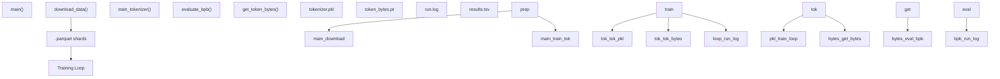

# 版本控制与产物

相关源文件

-   [.gitignore](https://github.com/karpathy/autoresearch/blob/e6d79c12/.gitignore)

## 目的与范围

本页记录 `autoresearch` 系统中的版本控制策略与产物管理方式。它解释了 `.gitignore` 规则如何将受跟踪源代码与生成研究数据分离，并详细说明每条排除规则背后的原因。系统采用双轨追踪方式：Git 历史维护成功架构改进的干净线性路径，而 `results.tsv` 提供对每次实验尝试（包括失败与崩溃）的完整日志。

---

## Git 跟踪的文件

仓库仅跟踪最小文件集，以维持干净、可复现的代码库。该版本控制策略落实了一个核心设计原则：**在自主研究期间仅 `train.py` 可修改**。

### 核心系统文件

所有系统文件在实验期间都被跟踪并保持不可变，唯一例外是模型定义文件：

| 文件 | 目的 | 智能体可修改 |
| --- | --- | --- |
| `train.py` | 模型、优化器与训练循环 | **是** - 智能体唯一会修改的文件 [program.md12-14](https://github.com/karpathy/autoresearch/blob/e6d79c12/program.md?plain=1#L12-L14) |
| `prepare.py` | 数据流水线、分词器与评估框架 | 否 - 不可变基础设施 [program.md26-30](https://github.com/karpathy/autoresearch/blob/e6d79c12/program.md?plain=1#L26-L30) |
| `program.md` | 智能体指令与研究协议 | 否 - 不可变 [program.md1-5](https://github.com/karpathy/autoresearch/blob/e6d79c12/program.md?plain=1#L1-L5) |
| `pyproject.toml` | 依赖规范与项目元数据 | 否 - 不可变 [pyproject.toml1-20](https://github.com/karpathy/autoresearch/blob/e6d79c12/pyproject.toml#L1-L20) |
| `uv.lock` | 用于可复现性的锁定依赖版本 | 否 - 不可变 |

**单一可修改文件约束**确保所有实验使用相同的评估基础设施。当智能体提交变更时，各提交之间仅 `train.py` 不同，这使差异易于审阅与理解 [program.md91-94](https://github.com/karpathy/autoresearch/blob/e6d79c12/program.md?plain=1#L91-L94)

---

## Git 忽略的产物

`.gitignore` 文件定义了哪些产物应从版本控制中排除。这种分离确保仓库只包含必要代码，同时允许生成大型数据产物与实验输出。

### 产物分类

**图示：产物分类与存储**

来源： [.gitignore1-24](https://github.com/karpathy/autoresearch/blob/e6d79c12/.gitignore#L1-L24) [program.md95-103](https://github.com/karpathy/autoresearch/blob/e6d79c12/program.md?plain=1#L95-L103)

### Python 构建产物

标准 Python 生成文件会被排除，以防构建系统污染 [.gitignore1-7](https://github.com/karpathy/autoresearch/blob/e6d79c12/.gitignore#L1-L7)：

-   `__pycache__/`, `*.py[oc]`：编译后的字节码。
-   `build/`, `dist/`, `wheels/`, `*.egg-info`：分发与构建元数据。

### 虚拟环境与工作区

环境目录会被排除，以防提交体积庞大的依赖安装内容或临时工作区域 [.gitignore9-13](https://github.com/karpathy/autoresearch/blob/e6d79c12/.gitignore#L9-L13)：

-   `.venv`：由 `uv` 管理的本地 Python 环境。
-   `worktrees/`：用于并行研究运行的 Git worktree。
-   `results/`：并行智能体日志输出目录。
-   `queue/`：实验排队协调目录。

### 智能体会话文件

启动脚本会生成按会话划分的提示文件，这些文件会被排除，以保持仓库整洁 [.gitignore15-17](https://github.com/karpathy/autoresearch/blob/e6d79c12/.gitignore#L15-L17)：

-   `CLAUDE.md`：基于 Claude 的智能体上下文。
-   `AGENTS.md`：多智能体协作指令。

### 实验结果

`results.tsv` 文件被明确排除在 Git 跟踪之外 [.gitignore23](https://github.com/karpathy/autoresearch/blob/e6d79c12/.gitignore#L23-L23)

**排除原因：**

1.  **results.tsv**：该文件与分支相关且持续增长。虽然关键，但若在 Git 中跟踪它，在多智能体并行运行时会产生合并冲突。它被视为本地结果数据库 [program.md66-70](https://github.com/karpathy/autoresearch/blob/e6d79c12/program.md?plain=1#L66-L70)
2.  **run.log**：该文件是临时文件，每次实验运行都会覆盖。它包含原始 stdout/stderr，过于冗长，不适合版本控制 [program.md99-100](https://github.com/karpathy/autoresearch/blob/e6d79c12/program.md?plain=1#L99-L100)
3.  **Data Shards**：`.parquet` 分片与分词器产物存储在 `~/.cache/autoresearch/`（仓库外），因为它们体积大（约 100GB），且可通过 `prepare.py` 确定性再生。

---

## 双轨追踪系统

系统维护两套并行的研究进展记录：Git 历史（“前沿”）与 TSV 日志（“完整历史”）。

### 1\. Git 历史：优化前沿

研究分支维护一条**仅包含成功实验的线性历史** [program.md9-10](https://github.com/karpathy/autoresearch/blob/e6d79c12/program.md?plain=1#L9-L10)

-   **Keep**：当实验提升 `val_bpb` 时，提交被保留。
-   **Discard**：当结果持平或更差时，通过 `git reset HEAD~1` 回滚该提交 [program.md102-103](https://github.com/karpathy/autoresearch/blob/e6d79c12/program.md?plain=1#L102-L103)

这会形成干净的 Git 历史，其中每个提交都代表真实的架构改进。

### 2\. results.tsv：完整尝试日志

与 Git 历史不同，`results.tsv` 会记录每一次尝试，包括被丢弃的想法和崩溃 [program.md101](https://github.com/karpathy/autoresearch/blob/e6d79c12/program.md?plain=1#L101-L101)

**文件结构 [program.md66-88](https://github.com/karpathy/autoresearch/blob/e6d79c12/program.md?plain=1#L66-L88)：**

| 列 | 描述 |
| --- | --- |
| `commit` | 实验代码的 7 字符短哈希 |
| `val_bpb` | 主指标（崩溃时为 0.000000） |
| `memory_gb` | 峰值 VRAM 使用量 |
| `status` | 以下之一：`keep`、`discard` 或 `crash` |
| `description` | 智能体对变更的自然语言摘要 |

---

## 数据流与产物生成

下图说明研究循环期间，代码实体如何生成并访问产物。

**图示：代码实体到产物映射**

来源： [prepare.py1-10](https://github.com/karpathy/autoresearch/blob/e6d79c12/prepare.py#L1-L10) [train.py1-20](https://github.com/karpathy/autoresearch/blob/e6d79c12/train.py#L1-L20) [program.md99-101](https://github.com/karpathy/autoresearch/blob/e6d79c12/program.md?plain=1#L99-L101)

### 关键代码参考

-   **指标提取**：智能体使用 shell 命令解析 `run.log`，提取 `val_bpb` 和 `peak_vram_mb` [program.md99-100](https://github.com/karpathy/autoresearch/blob/e6d79c12/program.md?plain=1#L99-L100)
-   **日志逻辑**：智能体采用制表符分隔格式追加写入 `results.tsv`，以避免描述中的逗号造成解析错误 [program.md66-70](https://github.com/karpathy/autoresearch/blob/e6d79c12/program.md?plain=1#L66-L70)
-   **Git 管理**：当实验未能改进基线时，智能体执行 `git reset HEAD~1` 以修剪代码历史 [program.md102-103](https://github.com/karpathy/autoresearch/blob/e6d79c12/program.md?plain=1#L102-L103)

来源： [.gitignore1-24](https://github.com/karpathy/autoresearch/blob/e6d79c12/.gitignore#L1-L24) [program.md66-103](https://github.com/karpathy/autoresearch/blob/e6d79c12/program.md?plain=1#L66-L103)
