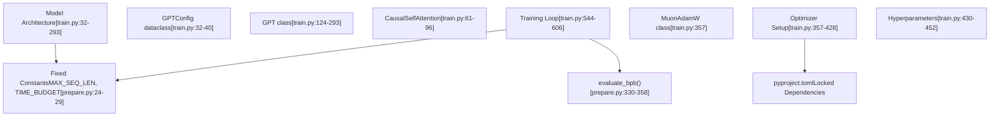
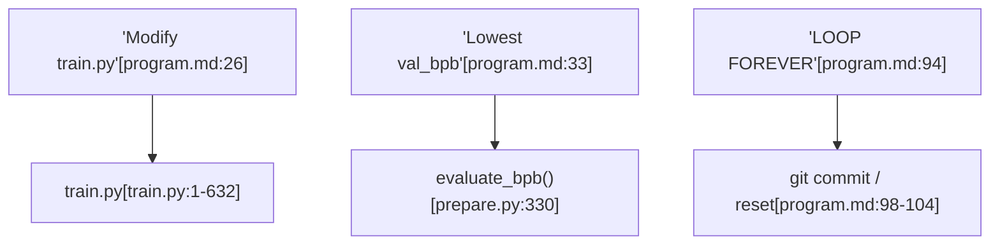

# 高级主题

相关源文件

-   [README.md](https://github.com/karpathy/autoresearch/blob/e6d79c12/README.md?plain=1)
-   [program.md](https://github.com/karpathy/autoresearch/blob/e6d79c12/program.md?plain=1)
-   [train.py](https://github.com/karpathy/autoresearch/blob/e6d79c12/train.py)

本页介绍 `autoresearch` 框架的高级使用模式、自定义策略与系统扩展技术。它作为高层入口，面向希望将系统能力推进到默认配置之外的用户。

---

## 8.1. 高效修改 train.py

`autoresearch` 系统在**可变**与**不可变**组件之间保持严格边界。智能体仅被允许修改 `train.py`，而 `prepare.py` 与核心系统常量保持固定，以确保评估公平性。

### 代码修改边界

下图展示了可变智能体空间与不可变基础设施之间的关系。

**图示：系统可变性与代码实体关系**

**来源：** [README.md13-15](https://github.com/karpathy/autoresearch/blob/e6d79c12/README.md?plain=1#L13-L15) [train.py32-40](https://github.com/karpathy/autoresearch/blob/e6d79c12/train.py#L32-L40) [train.py544-606](https://github.com/karpathy/autoresearch/blob/e6d79c12/train.py#L544-L606) [prepare.py24-29](https://github.com/karpathy/autoresearch/blob/e6d79c12/prepare.py#L24-L29)

如需深入了解修改策略，请参阅[高效修改 train.py](/karpathy/autoresearch/8.1-modifying-train.py-effectively)。

---

## 8.2. 简洁性准则

简洁性准则是一项核心的哲学性约束，用于防止智能体为了边际收益引入“意大利面式代码”。它强制在原始性能（`val_bpb`）与代码可维护性之间进行权衡。

**决策矩阵：复杂度 vs. 性能**

| 性能变化 | 复杂度变化 | 决策 | 理由 |
| --- | --- | --- | --- |
| 显著提升 | 增加复杂度 | **保留** | 巨大收益足以证明架构成本合理 |
| 轻微提升 | 显著增加复杂度 | **丢弃** | “Hacky” 代码不值得 0.001 BPB |
| 持平 / 轻微下降 | 显著简化 | **保留** | 删除代码属于“简化胜利” |

关于智能体如何权衡这些因素的详细示例，请参阅[简洁性准则](/karpathy/autoresearch/8.2-simplicity-criterion)。 **来源：** [program.md37](https://github.com/karpathy/autoresearch/blob/e6d79c12/program.md?plain=1#L37-L37)

---

## 8.3. 自定义研究程序

`program.md` 文件充当“Research Org Code”。通过修改该文件，人类可以将自治智能体群重定向到不同研究目标，例如内存效率、吞吐优化或替代性架构范式。

**图示：将程序指令映射到代码执行**

**来源：** [program.md26-33](https://github.com/karpathy/autoresearch/blob/e6d79c12/program.md?plain=1#L26-L33) [program.md94-104](https://github.com/karpathy/autoresearch/blob/e6d79c12/program.md?plain=1#L94-L104) [prepare.py330-358](https://github.com/karpathy/autoresearch/blob/e6d79c12/prepare.py#L330-L358)

关于如何编写有效研究指令的指南，请参阅[自定义研究程序](/karpathy/autoresearch/8.3-custom-research-programs)。

---

## 8.4. 平台适配与分叉

尽管核心仓库针对 NVIDIA H100 GPU 进行了优化，社区仍已产出面向 MacOS（MLX/MPS）与消费级硬件的分叉版本。适配系统需要同时调优 `prepare.py` 与 `train.py` 中的特定“旋钮”。

**小型硬件的关键调优旋钮：**

-   **`MAX_SEQ_LEN`**：在 [prepare.py26](https://github.com/karpathy/autoresearch/blob/e6d79c12/prepare.py#L26-L26) 中降低该值可显著减少 VRAM 占用。
-   **`DEPTH`**：位于 [train.py451](https://github.com/karpathy/autoresearch/blob/e6d79c12/train.py#L451-L451) 的主要复杂度控制器
-   **`WINDOW_PATTERN`**：在 [train.py436](https://github.com/karpathy/autoresearch/blob/e6d79c12/train.py#L436-L436) 中将其从 `"SSSL"` 切换为 `"L"`，可在非 Hopper GPU 上提升效率。

关于平台特定建议与值得关注的分叉列表，请参阅[平台适配与分叉](/karpathy/autoresearch/8.4-platform-adaptation-and-forks)。 **来源：** [README.md71-80](https://github.com/karpathy/autoresearch/blob/e6d79c12/README.md?plain=1#L71-L80) [train.py430-452](https://github.com/karpathy/autoresearch/blob/e6d79c12/train.py#L430-L452)

---

## 8.5. 系统局限与未来工作

当前版本的 `autoresearch` 存在若干架构约束：

-   **单 GPU**：默认 `train.py` 不原生支持多节点或多 GPU 分布式。
-   **固定时间**：5 分钟预算 [prepare.py27](https://github.com/karpathy/autoresearch/blob/e6d79c12/prepare.py#L27-L27) 更偏向快速收敛的模型，而非在长期算力下更具扩展性的模型。
-   **单文件**：智能体无法将项目结构重构为多个模块。

关于扩展约束与计划中增强项的讨论，请参阅[系统局限与未来工作](/karpathy/autoresearch/8.5-system-limitations-and-future-work)。 **来源：** [README.md61-64](https://github.com/karpathy/autoresearch/blob/e6d79c12/README.md?plain=1#L61-L64) [prepare.py27](https://github.com/karpathy/autoresearch/blob/e6d79c12/prepare.py#L27-L27)
