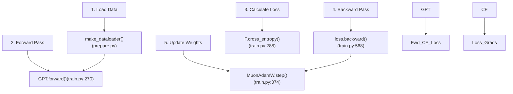
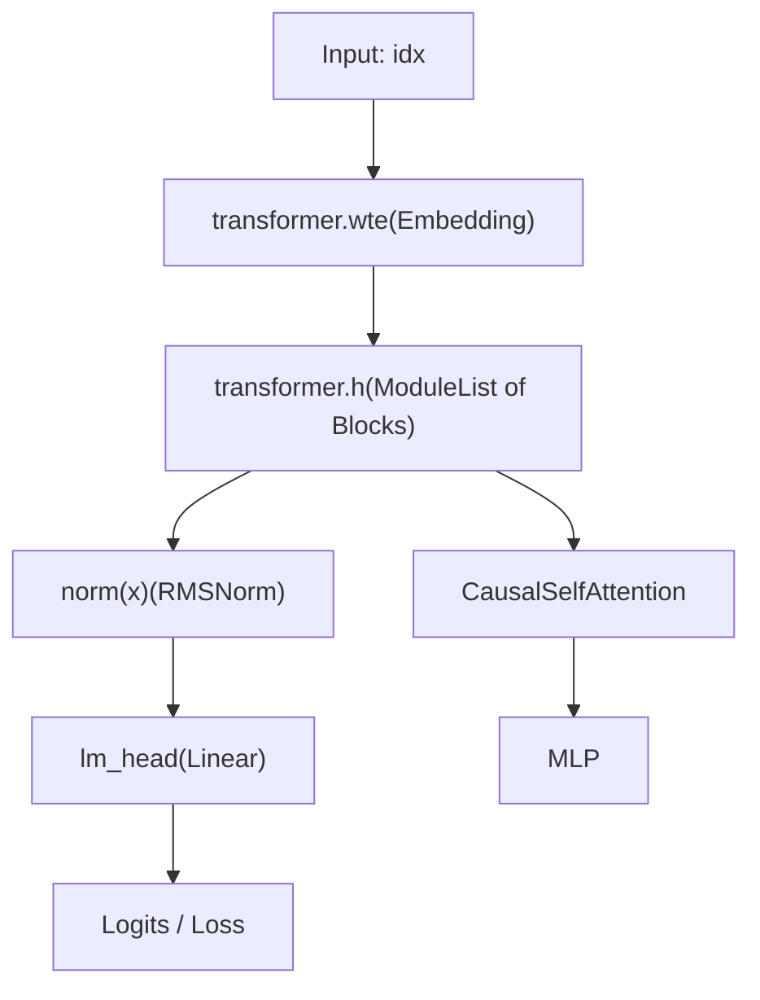

# 高效修改 train.py

相关源文件

-   [program.md](https://github.com/karpathy/autoresearch/blob/e6d79c12/program.md?plain=1)
-   [train.py](https://github.com/karpathy/autoresearch/blob/e6d79c12/train.py)

## 目的与范围

本页提供用于修改 `train.py` 的技术最佳实践与策略。`train.py` 是 autoresearch 系统中唯一可变的文件 [program.md25-26](https://github.com/karpathy/autoresearch/blob/e6d79c12/program.md?plain=1#L25-L26) 它详细说明了模型架构、混合优化器以及受时间约束的训练循环的实现。本指南面向希望在固定 5 分钟训练预算内优化 `val_bpb` 指标的开发者或智能体 [program.md23-33](https://github.com/karpathy/autoresearch/blob/e6d79c12/program.md?plain=1#L23-L33)

**来源：** [program.md1-114](https://github.com/karpathy/autoresearch/blob/e6d79c12/program.md?plain=1#L1-L114) [train.py1-632](https://github.com/karpathy/autoresearch/blob/e6d79c12/train.py#L1-L632)

---

## 理解 train.py 结构

`train.py` 文件由四个功能块构成。对某一块的修改通常需要在其他块中进行对应调整（例如，在模型部分新增一种层类型时，需要更新优化器中的参数分组）。

| 部分 | 行范围 | 目的 | 关键代码实体 |
| --- | --- | --- | --- |
| **GPT 模型** | [train.py30-293](https://github.com/karpathy/autoresearch/blob/e6d79c12/train.py#L30-L293) | 架构定义 | `GPTConfig`, `CausalSelfAttention`, `MLP`, `Block`, `GPT` |
| **优化器** | [train.py294-428](https://github.com/karpathy/autoresearch/blob/e6d79c12/train.py#L294-L428) | 混合 Muon/AdamW 逻辑 | `adamw_step_fused`, `muon_step_fused`, `MuonAdamW` |
| **超参数** | [train.py429-453](https://github.com/karpathy/autoresearch/blob/e6d79c12/train.py#L429-L453) | 全局配置 | `ASPECT_RATIO`, `TOTAL_BATCH_SIZE`, `MATRIX_LR`, `DEPTH` |
| **训练循环** | [train.py454-632](https://github.com/karpathy/autoresearch/blob/e6d79c12/train.py#L454-L632) | 执行与调度 | `get_lr_multiplier`, `get_muon_momentum`, `train_loader` |

### 系统数据流图

下图展示了“训练”这一自然语言概念与 `train.py` 中具体代码实体之间的关系。

**来源：** [train.py270-293](https://github.com/karpathy/autoresearch/blob/e6d79c12/train.py#L270-L293) [train.py374-428](https://github.com/karpathy/autoresearch/blob/e6d79c12/train.py#L374-L428) [train.py568](https://github.com/karpathy/autoresearch/blob/e6d79c12/train.py#L568-L568) [prepare.py126-149](https://github.com/karpathy/autoresearch/blob/e6d79c12/prepare.py#L126-L149)

---

## 架构修改

架构变更会修改 `GPT` 类及其子模块。这类改动杠杆效应高，但必须遵守 Flash Attention 3 与 `torch.compile` 的约束。

### 核心模型组件

1.  **注意力机制**：在 `CausalSelfAttention` 中实现 [train.py61-97](https://github.com/karpathy/autoresearch/blob/e6d79c12/train.py#L61-L97) 它使用 `fa3.flash_attn_func` [train.py93](https://github.com/karpathy/autoresearch/blob/e6d79c12/train.py#L93-L93)，该函数要求 4D 张量，形状为 `(B, T, n_head, head_dim)`。
2.  **MLP 块**：使用 `F.relu(x).square()` 的标准前馈网络 [train.py107](https://github.com/karpathy/autoresearch/blob/e6d79c12/train.py#L107-L107)
3.  **残差流**：通过 `resid_lambdas` 与 `x0_lambdas` 使用多尺度残差 [train.py278-280](https://github.com/karpathy/autoresearch/blob/e6d79c12/train.py#L278-L280)
4.  **Value Embeddings**：通过 `value_embeds` 实现 [train.py139-142](https://github.com/karpathy/autoresearch/blob/e6d79c12/train.py#L139-L142)，并借助与输入相关的 `ve_gate` [train.py84-87](https://github.com/karpathy/autoresearch/blob/e6d79c12/train.py#L84-L87) 混入注意力值（`v`）中。

### 模型逻辑流

该图展示了数据如何流经 `train.py` 中定义的具体架构实体。

**来源：** [train.py30-293](https://github.com/karpathy/autoresearch/blob/e6d79c12/train.py#L30-L293) [train.py112-121](https://github.com/karpathy/autoresearch/blob/e6d79c12/train.py#L112-L121) [train.py124-293](https://github.com/karpathy/autoresearch/blob/e6d79c12/train.py#L124-L293)

---

## 优化器与超参数调优

系统使用 `MuonAdamW` [train.py357](https://github.com/karpathy/autoresearch/blob/e6d79c12/train.py#L357-L357) 这一混合优化器。要高效调优它，需要理解参数如何分组。

### 参数分组逻辑

`setup_optimizer` 函数 [train.py237-267](https://github.com/karpathy/autoresearch/blob/e6d79c12/train.py#L237-L267) 将参数拆分为三个不同类别：

1.  **Muon 组**：`transformer.h`（隐藏层）中的 2D 矩阵 [train.py252-254](https://github.com/karpathy/autoresearch/blob/e6d79c12/train.py#L252-L254)
2.  **AdamW 组（嵌入）**：`wte` 与 `value_embeds` [train.py255-257](https://github.com/karpathy/autoresearch/blob/e6d79c12/train.py#L255-L257)
3.  **AdamW 组（小型/1D）**：`lm_head`、`resid_lambdas`、`x0_lambdas` 以及所有 bias/norm [train.py258-260](https://github.com/karpathy/autoresearch/blob/e6d79c12/train.py#L258-L260)

### 有效调优范围

| 超参数 | 代码符号 | 基线值 | 建议调优范围 |
| --- | --- | --- | --- |
| Matrix LR | `MATRIX_LR` | 0.04 [train.py442](https://github.com/karpathy/autoresearch/blob/e6d79c12/train.py#L442-L442) | 0.01 - 0.08 |
| Embedding LR | `EMBEDDING_LR` | 0.6 [train.py440](https://github.com/karpathy/autoresearch/blob/e6d79c12/train.py#L440-L440) | 0.1 - 1.0 |
| 模型深度 | `DEPTH` | 8 [train.py451](https://github.com/karpathy/autoresearch/blob/e6d79c12/train.py#L451-L451) | 6 - 12 |
| 批大小 | `TOTAL_BATCH_SIZE` | 2\*\*19 [train.py448](https://github.com/karpathy/autoresearch/blob/e6d79c12/train.py#L448-L448) | 2**18 - 2**20 |
| Warmdown 比例 | `WARMDOWN_RATIO` | 0.5 [train.py431](https://github.com/karpathy/autoresearch/blob/e6d79c12/train.py#L431-L431) | 0.3 - 0.7 |

**来源：** [train.py237-267](https://github.com/karpathy/autoresearch/blob/e6d79c12/train.py#L237-L267) [train.py429-453](https://github.com/karpathy/autoresearch/blob/e6d79c12/train.py#L429-L453)

---

## 训练循环与调度

训练循环 [train.py544-606](https://github.com/karpathy/autoresearch/blob/e6d79c12/train.py#L544-L606) 受 `TIME_BUDGET`（300 秒）控制 [prepare.py13](https://github.com/karpathy/autoresearch/blob/e6d79c12/prepare.py#L13-L13)

### 学习率调度

`get_lr_multiplier` 函数 [train.py519-526](https://github.com/karpathy/autoresearch/blob/e6d79c12/train.py#L519-L526) 实现了三阶段调度：

1.  **Warmup**：线性升高（默认 `WARMUP_RATIO` 为 0.0）。
2.  **Constant**：保持最大学习率。
3.  **Warmdown**：线性衰减到 `FINAL_LR_FRAC` [train.py524-526](https://github.com/karpathy/autoresearch/blob/e6d79c12/train.py#L524-L526)

### 计时与编译

为确保公平比较，脚本通过以下方式处理 `torch.compile` 的开销：

-   运行 10 个 warmup step [train.py579](https://github.com/karpathy/autoresearch/blob/e6d79c12/train.py#L579-L579)
-   在第 10 步后重置 `start_time` [train.py580](https://github.com/karpathy/autoresearch/blob/e6d79c12/train.py#L580-L580)
-   一旦 `total_training_time >= TIME_BUDGET` 即退出循环 [train.py604](https://github.com/karpathy/autoresearch/blob/e6d79c12/train.py#L604-L604)

**来源：** [train.py519-533](https://github.com/karpathy/autoresearch/blob/e6d79c12/train.py#L519-L533) [train.py544-606](https://github.com/karpathy/autoresearch/blob/e6d79c12/train.py#L544-L606) [prepare.py13](https://github.com/karpathy/autoresearch/blob/e6d79c12/prepare.py#L13-L13)

---

## 修改最佳实践

1.  **VRAM 管理**：若提高 `DEPTH` 或 `ASPECT_RATIO`，请降低 `DEVICE_BATCH_SIZE` [train.py452](https://github.com/karpathy/autoresearch/blob/e6d79c12/train.py#L452-L452) 以避免 `OutOfMemoryError`。脚本使用 `expandable_segments` [train.py8](https://github.com/karpathy/autoresearch/blob/e6d79c12/train.py#L8-L8) 以帮助缓解碎片化。
2.  **简洁性准则**：将 `val_bpb` 增益与代码复杂度进行权衡。增益 < 0.001 时，通常不值得新增 > 20 行代码 [program.md37-38](https://github.com/karpathy/autoresearch/blob/e6d79c12/program.md?plain=1#L37-L38)
3.  **初始化**：若新增层，请确保在 `init_weights()` [train.py150-182](https://github.com/karpathy/autoresearch/blob/e6d79c12/train.py#L150-L182) 中完成初始化。注意 `c_proj` 权重被初始化为零 [train.py161-163](https://github.com/karpathy/autoresearch/blob/e6d79c12/train.py#L161-L163)，以便初始时作为恒等残差。
4.  **Softcapping**：模型在 logits 上使用了 50.0 的 `softcap` [train.py283-286](https://github.com/karpathy/autoresearch/blob/e6d79c12/train.py#L283-L286) 修改该值会显著影响训练稳定性。
5.  **Rotary Embeddings**：RoPE 预计算长度为 `sequence_len * 10` [train.py144](https://github.com/karpathy/autoresearch/blob/e6d79c12/train.py#L144-L144) 若你显著增加序列长度，请确保更新 `rotary_seq_len`。

**来源：** [train.py8](https://github.com/karpathy/autoresearch/blob/e6d79c12/train.py#L8-L8) [train.py150-182](https://github.com/karpathy/autoresearch/blob/e6d79c12/train.py#L150-L182) [train.py283-286](https://github.com/karpathy/autoresearch/blob/e6d79c12/train.py#L283-L286) [program.md37-38](https://github.com/karpathy/autoresearch/blob/e6d79c12/program.md?plain=1#L37-L38)
