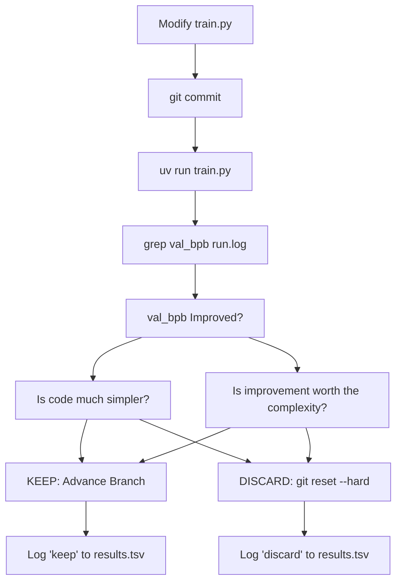
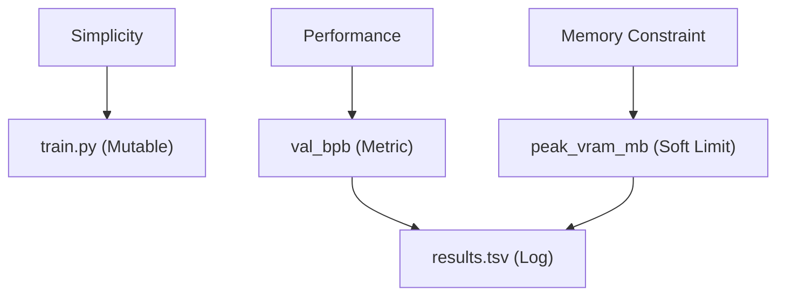

# 简洁性准则

相关源文件

-   [README.md](https://github.com/karpathy/autoresearch/blob/e6d79c12/README.md?plain=1)
-   [program.md](https://github.com/karpathy/autoresearch/blob/e6d79c12/program.md?plain=1)

本页记录了 **简洁性准则**，这是 `autoresearch` 系统中的一种定性启发式，用于指导智能体在评估实验改动时进行决策。不同于固定时间预算或不可变评估等硬约束，简洁性准则帮助智能体在代码复杂度与性能改进之间取得平衡。

## 概览

简洁性准则是一条设计原则，即**在其他条件相同的情况下，越简单越好**。该原则影响智能体在评估是否保留或丢弃对 `train.py` 的实验改动时的判断。尽管 `val_bpb` 的提升是首要成功指标，简洁性准则作为二级过滤器，可防止代码库积累不必要的复杂度或“hacky”实现。

来源： [README.md61-64](https://github.com/karpathy/autoresearch/blob/e6d79c12/README.md?plain=1#L61-L64) [program.md37](https://github.com/karpathy/autoresearch/blob/e6d79c12/program.md?plain=1#L37-L37)

## 定义与范围

简洁性准则在 `program.md` 的智能体指令中被正式定义。它专门关注改进幅度与为实现该改进而新增代码“成本”之间的权衡。

> **简洁性准则**：在其他条件相同的情况下，越简单越好。若一项小幅改进带来了丑陋的复杂性，就不值得。反之，删除某些内容并获得相同或更好的结果，是非常好的结果——这是一次简化胜利。在评估是否保留某项改动时，要权衡复杂度成本与改进幅度。

该准则仅适用于 `train.py`，因为这是智能体被允许修改的唯一文件。

来源： [program.md25-31](https://github.com/karpathy/autoresearch/blob/e6d79c12/program.md?plain=1#L25-L31) [program.md37](https://github.com/karpathy/autoresearch/blob/e6d79c12/program.md?plain=1#L37-L37)

### 复杂度与性能映射

系统根据改动对指标（`val_bpb`）与代码结构的双重影响进行分类。

| 结果类别 | 指标影响 | 代码影响 | 决策 |
| --- | --- | --- | --- |
| **显著收益** | `val_bpb` 大幅下降 | 中等复杂度 | **保留** |
| **简化胜利** | 无变化或小幅下降 | 删除代码/重构 | **保留** |
| **复杂度蔓延** | `val_bpb` 微小下降 | “Hacky” 或大规模新增 | **丢弃** |
| **重构胜利** | 无变化 | 显著简化 | **保留** |
| **退化** | `val_bpb` 上升 | 任意 | **丢弃** |

来源： [program.md37](https://github.com/karpathy/autoresearch/blob/e6d79c12/program.md?plain=1#L37-L37) [program.md103-104](https://github.com/karpathy/autoresearch/blob/e6d79c12/program.md?plain=1#L103-L104)

## 在研究循环中的实现

简洁性准则已集成到自治 `LOOP FOREVER` 逻辑中。虽然主分支推进条件是更低的 `val_bpb`，但智能体被指示在提交该推进前进行判断。

### 决策逻辑流程

下图展示了 `program.md` 指令如何转化为 `train.py` 修改循环中的决策过程。

**决策流程：简洁性 vs. 性能**

来源： [program.md37-38](https://github.com/karpathy/autoresearch/blob/e6d79c12/program.md?plain=1#L37-L38) [program.md94-106](https://github.com/karpathy/autoresearch/blob/e6d79c12/program.md?plain=1#L94-L106)

## 具体示例与启发式

`program.md` 提供了用于校准智能体判断的具体场景：

-   **0.001 规则**：将 `0.001 val_bpb` 的提升与新增 20 行“hacky”代码绑定时，被明确标注为“probably not worth it”。
-   **把删除当作特性**：若通过删除代码获得 `0.001 val_bpb` 的提升，则是“definite keep”。
-   **中性性能**：若大约 `0` 的改进带来更简洁的代码，则为“keep”。

来源： [program.md37](https://github.com/karpathy/autoresearch/blob/e6d79c12/program.md?plain=1#L37-L37)

### 与系统约束的关系

简洁性准则与环境中定义的其他约束协同工作：

| 约束 | 类型 | 文件引用 |
| --- | --- | --- |
| **固定时间预算** | 硬约束（5 分钟） | [README.md64](https://github.com/karpathy/autoresearch/blob/e6d79c12/README.md?plain=1#L64-L64) [program.md23](https://github.com/karpathy/autoresearch/blob/e6d79c12/program.md?plain=1#L23-L23) |
| **VRAM 使用量** | 软约束 | [program.md35](https://github.com/karpathy/autoresearch/blob/e6d79c12/program.md?plain=1#L35-L35) |
| **单文件编辑** | 硬约束（仅 `train.py`） | [README.md63](https://github.com/karpathy/autoresearch/blob/e6d79c12/README.md?plain=1#L63-L63) [program.md26](https://github.com/karpathy/autoresearch/blob/e6d79c12/program.md?plain=1#L26-L26) |
| **指标（val\_bpb）** | 首要目标 | [README.md17](https://github.com/karpathy/autoresearch/blob/e6d79c12/README.md?plain=1#L17-L17) [program.md33](https://github.com/karpathy/autoresearch/blob/e6d79c12/program.md?plain=1#L33-L33) |

来源： [README.md61-66](https://github.com/karpathy/autoresearch/blob/e6d79c12/README.md?plain=1#L61-L66) [program.md21-40](https://github.com/karpathy/autoresearch/blob/e6d79c12/program.md?plain=1#L21-L40)

## 该准则的理由

`autoresearch` 项目旨在固定时间预算内，为特定平台找到最优模型。如果没有简洁性准则，智能体可能会：

1.  **过拟合架构**：累积大量仅在特定 5 分钟片段上有效、但无法泛化的微优化。
2.  **生成不可维护的差异**：产生成千上万行代码，导致人类在早晨无法理解研究“前沿”。
3.  **引入脆弱性**：复杂代码更容易导致“crashes”（OOM、拼写错误、逻辑错误），从而拖慢自治循环。

**自然语言到代码映射**

来源： [README.md11-15](https://github.com/karpathy/autoresearch/blob/e6d79c12/README.md?plain=1#L11-L15) [program.md64-88](https://github.com/karpathy/autoresearch/blob/e6d79c12/program.md?plain=1#L64-L88)

## 结果记录与状态

简洁性决策会体现在 `results.tsv` 的 `status` 列中。

-   **keep**：该改动带来了足够的性能提升，或简化了代码。
-   **discard**：该改动导致性能退化，或引入了不合理复杂度。
-   **crash**：该改动导致运行时错误（例如 OOM 或语法错误）。

`results.tsv` 中的 `description` 列是智能体说明理由的机会：解释为何在存在复杂度的情况下仍保留改动，或为何执行了某项简化。

来源： [program.md71-88](https://github.com/karpathy/autoresearch/blob/e6d79c12/program.md?plain=1#L71-L88) [program.md102-106](https://github.com/karpathy/autoresearch/blob/e6d79c12/program.md?plain=1#L102-L106)
