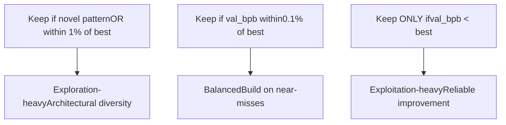
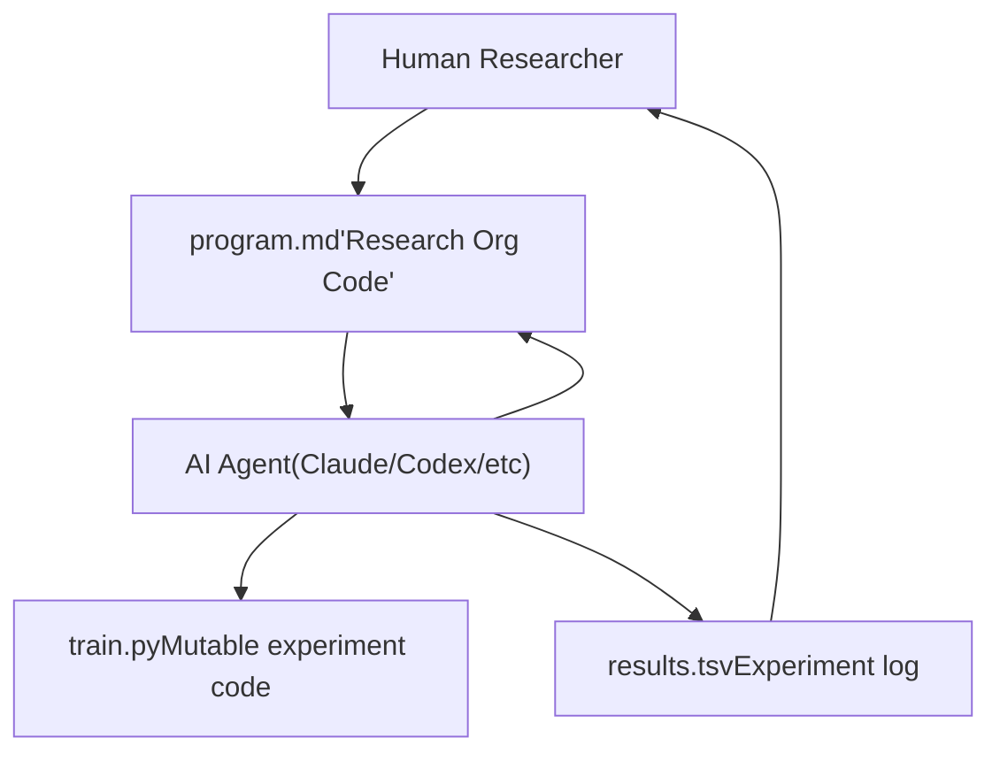

# 自定义研究程序

相关源文件

-   [README.md](https://github.com/karpathy/autoresearch/blob/e6d79c12/README.md?plain=1)
-   [program.md](https://github.com/karpathy/autoresearch/blob/e6d79c12/program.md?plain=1)

本页说明如何编写与自定义 `program.md` 文件，以引导自治智能体研究朝不同目标推进。`program.md` 文件充当“research org code”——由人类可编辑的指令集合，用于定义智能体应优化什么、必须遵守哪些约束，以及应如何自主运行。

关于智能体如何在自治循环中执行这些指令，请参阅[4.1 研究循环](https://github.com/karpathy/autoresearch/blob/e6d79c12/4.1 The Research Loop) 关于智能体可在 `train.py` 中修改的内容，请参阅[3.1 train.py - 可变核心](https://github.com/karpathy/autoresearch/blob/e6d79c12/3.1 train.py - The Mutable Core)

**来源：** [README.md7](https://github.com/karpathy/autoresearch/blob/e6d79c12/README.md?plain=1#L7-L7) [README.md15](https://github.com/karpathy/autoresearch/blob/e6d79c12/README.md?plain=1#L15-L15) [README.md50](https://github.com/karpathy/autoresearch/blob/e6d79c12/README.md?plain=1#L50-L50) [program.md1-115](https://github.com/karpathy/autoresearch/blob/e6d79c12/program.md?plain=1#L1-L115)

## program.md 的用途

在 `autoresearch` 中，`program.md` 文件是主要的人机接口。在自治运行期间，人类不会直接编辑 `train.py`，而是通过迭代 `program.md` 来控制研究方向。该文件定义了：

-   **研究目标**：优化什么指标，以及次级目标是什么 [program.md33](https://github.com/karpathy/autoresearch/blob/e6d79c12/program.md?plain=1#L33-L33)
-   **运行约束**：哪些文件可修改、时间预算与资源限制 [program.md25-31](https://github.com/karpathy/autoresearch/blob/e6d79c12/program.md?plain=1#L25-L31)
-   **决策标准**：何时 `keep`，何时 `discard` 实验 [program.md103-104](https://github.com/karpathy/autoresearch/blob/e6d79c12/program.md?plain=1#L103-L104)
-   **循环行为**：初始化流程、实验生命周期与错误处理 [program.md90-115](https://github.com/karpathy/autoresearch/blob/e6d79c12/program.md?plain=1#L90-L115)

默认 `program.md` 故意保持为精简骨架 [README.md7](https://github.com/karpathy/autoresearch/blob/e6d79c12/README.md?plain=1#L7-L7) 元研究目标是迭代该文件，以发现能实现最快研究进展的“research org code”。

**来源：** [README.md7](https://github.com/karpathy/autoresearch/blob/e6d79c12/README.md?plain=1#L7-L7) [README.md15](https://github.com/karpathy/autoresearch/blob/e6d79c12/README.md?plain=1#L15-L15) [README.md50](https://github.com/karpathy/autoresearch/blob/e6d79c12/README.md?plain=1#L50-L50) [program.md33](https://github.com/karpathy/autoresearch/blob/e6d79c12/program.md?plain=1#L33-L33) [program.md25-31](https://github.com/karpathy/autoresearch/blob/e6d79c12/program.md?plain=1#L25-L31) [program.md103-104](https://github.com/karpathy/autoresearch/blob/e6d79c12/program.md?plain=1#L103-L104) [program.md90-115](https://github.com/karpathy/autoresearch/blob/e6d79c12/program.md?plain=1#L90-L115)

## 默认 program.md 的结构

默认 `program.md` [program.md1-115](https://github.com/karpathy/autoresearch/blob/e6d79c12/program.md?plain=1#L1-L115) 包含五个主要部分，用于组织智能体行为：

**默认 program.md 结构**

```mermaid
flowchart TD
    HEADER["# autoresearch(Context header)"]
    SETUP["## SetupLines 5-19"]
    EXPERIMENT["## ExperimentationLines 21-39"]
    OUTPUT["## Output formatLines 41-56"]
    LOGGING["## Logging resultsLines 64-88"]
    LOOP["## The experiment loopLines 90-115"]
    CREATE_BRANCH["git checkout -b autoresearch/tag"]
    READ_FILES["Read README.md, prepare.py, train.py"]
    VERIFY_DATA["Check ~/.cache/autoresearch/"]
    INIT_TSV["Initialize results.tsv"]
    MODIFY_TRAIN["Edit train.py"]
    RUN_EXP["uv run train.py"]
    EXTRACT_METRIC["grep val_bpb run.log"]
    APPEND_TSV["Append to results.tsv"]
    GIT_COMMIT["git commit"]
    GIT_RESET["git reset --hard"]
    LOOP_FOREVER["Infinite autonomous loop"]
    CRASH_HANDLE["tail -n 50 run.log"]
    NEVER_STOP["Continue indefinitely"]

    HEADER --> SETUP
    SETUP --> CREATE_BRANCH
    SETUP --> READ_FILES
    SETUP --> VERIFY_DATA
    SETUP --> INIT_TSV
    EXPERIMENT --> MODIFY_TRAIN
    EXPERIMENT --> RUN_EXP
    OUTPUT --> EXTRACT_METRIC
    LOGGING --> APPEND_TSV
    LOOP --> LOOP_FOREVER
    LOOP --> GIT_COMMIT
    LOOP --> GIT_RESET
    LOOP --> CRASH_HANDLE
    LOOP --> NEVER_STOP
```

**来源：** [program.md1-115](https://github.com/karpathy/autoresearch/blob/e6d79c12/program.md?plain=1#L1-L115)

### 分节拆解

| 部分 | 行号 | 目的 | 关键指令 |
| --- | --- | --- | --- |
| **Setup** | [program.md5-19](https://github.com/karpathy/autoresearch/blob/e6d79c12/program.md?plain=1#L5-L19) | 一次性初始化 | 创建分支、读取上下文文件、校验数据、初始化 `results.tsv`。 |
| **Experimentation** | [program.md21-39](https://github.com/karpathy/autoresearch/blob/e6d79c12/program.md?plain=1#L21-L39) | 定义范围与目标 | 可以修改 `train.py`，不能修改 `prepare.py`，目标是最低 `val_bpb`。 |
| **Output format** | [program.md41-56](https://github.com/karpathy/autoresearch/blob/e6d79c12/program.md?plain=1#L41-L56) | 指定脚本输出 | 展示包含 `val_bpb`、`peak_vram_mb`、`mfu_percent` 等字段的示例摘要。 |
| **Logging results** | [program.md64-88](https://github.com/karpathy/autoresearch/blob/e6d79c12/program.md?plain=1#L64-L88) | 定义 `results.tsv` 格式 | 5 列 TSV：commit、val\_bpb、memory\_gb、status、description。 |
| **The experiment loop** | [program.md90-115](https://github.com/karpathy/autoresearch/blob/e6d79c12/program.md?plain=1#L90-L115) | 自治指令 | LOOP FOREVER、改进则提交、失败则重置、NEVER STOP。 |

**来源：** [program.md5-19](https://github.com/karpathy/autoresearch/blob/e6d79c12/program.md?plain=1#L5-L19) [program.md21-39](https://github.com/karpathy/autoresearch/blob/e6d79c12/program.md?plain=1#L21-L39) [program.md41-56](https://github.com/karpathy/autoresearch/blob/e6d79c12/program.md?plain=1#L41-L56) [program.md64-88](https://github.com/karpathy/autoresearch/blob/e6d79c12/program.md?plain=1#L64-L88) [program.md90-115](https://github.com/karpathy/autoresearch/blob/e6d79c12/program.md?plain=1#L90-L115)

## 关键指令类别

### 约束与边界

`program.md` 文件明确建立了智能体可修改与不可修改内容的边界：

**允许的修改** [program.md25-26](https://github.com/karpathy/autoresearch/blob/e6d79c12/program.md?plain=1#L25-L26)：

-   修改 `train.py` —— 这是智能体唯一可编辑的文件。其内部所有内容都可作为修改对象：架构、优化器、超参数、训练循环、批大小等。

**禁止的修改** [program.md28-31](https://github.com/karpathy/autoresearch/blob/e6d79c12/program.md?plain=1#L28-L31)：

-   修改 `prepare.py`。该文件为只读，包含固定评估框架。
-   安装新包，或向 `pyproject.toml` 添加依赖。
-   修改 `prepare.py` 中的 `evaluate_bpb` 函数。

这些约束通过固定评估基础设施来确保实验之间可公平比较 [program.md31](https://github.com/karpathy/autoresearch/blob/e6d79c12/program.md?plain=1#L31-L31)

**来源：** [program.md25-31](https://github.com/karpathy/autoresearch/blob/e6d79c12/program.md?plain=1#L25-L31) [prepare.py1-255](https://github.com/karpathy/autoresearch/blob/e6d79c12/prepare.py#L1-L255)

### 优化目标

默认程序定义了一个主指标和若干次级考量：

-   **主指标**：目标是获得最低 `val_bpb` [program.md33](https://github.com/karpathy/autoresearch/blob/e6d79c12/program.md?plain=1#L33-L33) 由于时间预算固定为 5 分钟，智能体无需担心训练时长。
-   **VRAM**：软约束。若能带来有意义的 `val_bpb` 提升，可接受 VRAM 增长 [program.md35](https://github.com/karpathy/autoresearch/blob/e6d79c12/program.md?plain=1#L35-L35)
-   **简洁性准则**：在其他条件相同的情况下，越简单越好 [program.md37](https://github.com/karpathy/autoresearch/blob/e6d79c12/program.md?plain=1#L37-L37) 若 0.001 的改进需要新增 20 行 hacky 代码，则不值得；若删除代码且性能不变，则是胜利。

**来源：** [program.md33-37](https://github.com/karpathy/autoresearch/blob/e6d79c12/program.md?plain=1#L33-L37)

### 循环控制指令

实验循环部分 [program.md90-115](https://github.com/karpathy/autoresearch/blob/e6d79c12/program.md?plain=1#L90-L115) 包含控制自治行为的关键指令：

**自治循环状态机**

**NEVER STOP** 指令 [program.md112](https://github.com/karpathy/autoresearch/blob/e6d79c12/program.md?plain=1#L112-L112) 对自治运行至关重要，它确保在人类离开时智能体仍持续工作。

**来源：** [program.md90-115](https://github.com/karpathy/autoresearch/blob/e6d79c12/program.md?plain=1#L90-L115) [program.md112](https://github.com/karpathy/autoresearch/blob/e6d79c12/program.md?plain=1#L112-L112)

## 自定义策略

### 修改研究目标

首要自定义入口是改变智能体优化的目标。

| 目标 | 示例指令 |
| --- | --- |
| **最大化吞吐** | "当 `mfu_percent` 增加 OR `val_bpb` 降低时保留。" |
| **最小化 VRAM** | "目标：在 `peak_vram_mb` 尽可能低的情况下实现 `val_bpb` < 1.0。" |
| **简化架构** | "当 `num_params_M` 降低且 `val_bpb` 保持在基线 0.5% 以内时保留。" |
| **探索架构** | "当 `val_bpb` 距离最优值 1% 以内且引入新颖架构模式时保留。" |

**示例：多目标优化** 将 [program.md33](https://github.com/karpathy/autoresearch/blob/e6d79c12/program.md?plain=1#L33-L33) 替换为：

> "The goal: Pareto-optimize val\_bpb and peak\_vram\_mb. Keep an experiment if it improves either metric without significantly regressing the other (>5% worse)."

**来源：** [program.md33](https://github.com/karpathy/autoresearch/blob/e6d79c12/program.md?plain=1#L33-L33) [program.md35](https://github.com/karpathy/autoresearch/blob/e6d79c12/program.md?plain=1#L35-L35) [program.md37](https://github.com/karpathy/autoresearch/blob/e6d79c12/program.md?plain=1#L37-L37)

### 调整决策标准

`keep`/`discard` 逻辑 [program.md103-104](https://github.com/karpathy/autoresearch/blob/e6d79c12/program.md?plain=1#L103-L104) 可被自定义，以改变探索行为。

**探索策略**

**来源：** [program.md103-104](https://github.com/karpathy/autoresearch/blob/e6d79c12/program.md?plain=1#L103-L104)

### 崩溃处理策略

默认崩溃处理 [program.md110](https://github.com/karpathy/autoresearch/blob/e6d79c12/program.md?plain=1#L110-L110) 尝试简单修复。用户可指定更激进的恢复方式：

> **Crashes**: If a run crashes, parse the stack trace with `tail -n 100 run.log`. If it is an OOM, attempt to reduce `DEPTH` or `DEVICE_BATCH_SIZE` once before giving up.

**来源：** [program.md110](https://github.com/karpathy/autoresearch/blob/e6d79c12/program.md?plain=1#L110-L110) [program.md101](https://github.com/karpathy/autoresearch/blob/e6d79c12/program.md?plain=1#L101-L101)

### 超时与预算修改

默认的 5 分钟预算 [program.md23](https://github.com/karpathy/autoresearch/blob/e6d79c12/program.md?plain=1#L23-L23) 可针对不同平台进行调整。在较慢硬件（Macbook 等）上，用户可能希望调整预算，或遵循 [README.md71-80](https://github.com/karpathy/autoresearch/blob/e6d79c12/README.md?plain=1#L71-L80) 中的平台专用建议。

**来源：** [program.md23](https://github.com/karpathy/autoresearch/blob/e6d79c12/program.md?plain=1#L23-L23) [README.md71-80](https://github.com/karpathy/autoresearch/blob/e6d79c12/README.md?plain=1#L71-L80)

## 编写有效的智能体指令

### 清晰性与具体性

有效指令应当无歧义。对比：

-   ❌ **模糊**："Try to improve the model somehow."
-   ✅ **具体**："Modify the GPT model architecture in `train.py`. Valid changes include adjusting `DEPTH` (lines 20-21), changing `n_head` (line 27), or modifying `WINDOW_PATTERN` (line 29)."

### 约束搜索空间

当面向特定研究方向时，应缩小范围以防止智能体偏离：

**示例：聚焦优化器的研究**

> "For this experiment run, focus ONLY on modifications to the optimizer in `train.py` (lines 290-350). Do NOT modify model architecture or batch sizes."

**来源：** [program.md25-31](https://github.com/karpathy/autoresearch/blob/e6d79c12/program.md?plain=1#L25-L31) [train.py290-350](https://github.com/karpathy/autoresearch/blob/e6d79c12/train.py#L290-L350)

## 与系统架构的关系

`program.md` 文件位于 `autoresearch` 层级结构的元层：

**元优化循环**

在人类不介入直接修改 `train.py` 的自治运行阶段，人类仅通过 `program.md` 进行操作 [README.md7](https://github.com/karpathy/autoresearch/blob/e6d79c12/README.md?plain=1#L7-L7) 这形成了一个元优化循环：人类迭代“research org code”以最大化研究速度。

**来源：** [README.md7](https://github.com/karpathy/autoresearch/blob/e6d79c12/README.md?plain=1#L7-L7) [README.md15](https://github.com/karpathy/autoresearch/blob/e6d79c12/README.md?plain=1#L15-L15) [program.md1-115](https://github.com/karpathy/autoresearch/blob/e6d79c12/program.md?plain=1#L1-L115)
