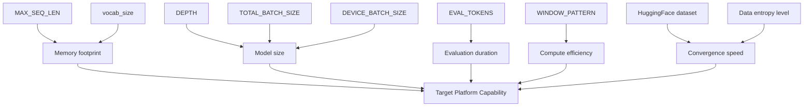
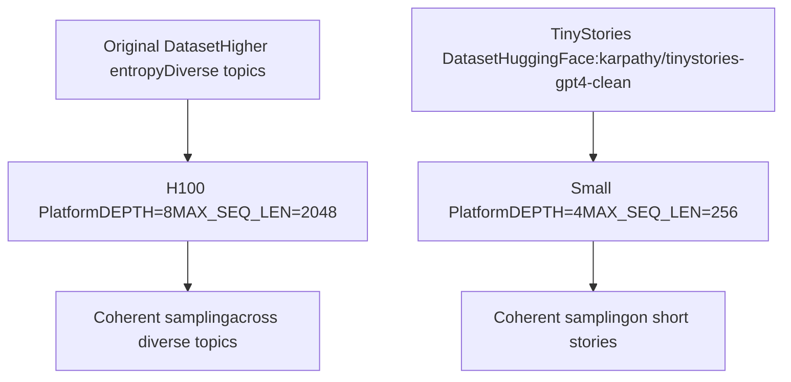
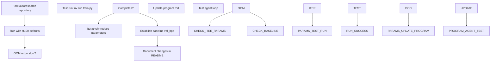

# 平台适配与分叉

相关源文件

-   [README.md](https://github.com/karpathy/autoresearch/blob/e6d79c12/README.md?plain=1)
-   [train.py](https://github.com/karpathy/autoresearch/blob/e6d79c12/train.py)

本页记录了通过分叉与参数调优将 autoresearch 适配到不同硬件平台的策略。核心仓库面向高端 NVIDIA H100 GPU，但社区分叉使其可在包括 MacOS 与 Windows RTX 系统在内的消费级硬件上运行。

关于通用系统参数及其作用，请参阅 **3.3 系统参数**。关于智能体运行期间如何修改 `train.py`，请参阅 **8.1 高效修改 train.py**。

## 分叉哲学

autoresearch 核心仓库有意保持狭窄的平台聚焦，以避免代码膨胀与复杂化。项目并不引入多平台抽象、条件分支逻辑与回退实现，而是鼓励通过分叉进行平台特定适配。该设计决策优先考虑：

1.  **代码清晰性** - 参考实现保持简洁、可读。
2.  **H100 优化** - 默认参数面向前沿硬件调优，不做折中。
3.  **社区所有权** - 分叉维护者针对其目标平台进行优化。
4.  **聚焦范围** - 核心开发专注研究方法，而非平台支持。

功能更完整的 [nanochat](https://github.com/karpathy/autoresearch/blob/e6d79c12/nanochat) 仓库展示了多平台模式（Flash Attention 3 回退、通用设备支持、自动检测），分叉维护者在适配 autoresearch 时可参考这些模式 [README.md68-70](https://github.com/karpathy/autoresearch/blob/e6d79c12/README.md?plain=1#L68-L70)

**来源：** [README.md68-70](https://github.com/karpathy/autoresearch/blob/e6d79c12/README.md?plain=1#L68-L70)

## 现有平台分叉

值得关注的分叉提供了平台特定适配：

| Fork | 平台 | 仓库 | 关键适配 |
| --- | --- | --- | --- |
| autoresearch-macos | MacOS | [miolini/autoresearch-macos](https://github.com/karpathy/autoresearch/blob/e6d79c12/miolini/autoresearch-macos) | MacOS 兼容层 |
| autoresearch-mlx | MacOS MLX | [trevin-creator/autoresearch-mlx](https://github.com/karpathy/autoresearch/blob/e6d79c12/trevin-creator/autoresearch-mlx) | Apple MLX 后端 |
| autoresearch-win-rtx | Windows RTX | [jsegov/autoresearch-win-rtx](https://github.com/karpathy/autoresearch/blob/e6d79c12/jsegov/autoresearch-win-rtx) | Windows + 消费级 NVIDIA GPU |

每个分叉都保持了 autoresearch 核心架构（不可变 `prepare.py`、可变 `train.py`、智能体驱动实验），同时针对目标平台适配基础设施与默认参数 [README.md83-87](https://github.com/karpathy/autoresearch/blob/e6d79c12/README.md?plain=1#L83-L87)

**来源：** [README.md83-87](https://github.com/karpathy/autoresearch/blob/e6d79c12/README.md?plain=1#L83-L87)

## 参数调优策略

将 autoresearch 适配到较小算力平台，需要在基础设施（`prepare.py`）和模型配置（`train.py`）两侧系统性地下调参数。

### 参数位置映射

**来源：** [README.md71-80](https://github.com/karpathy/autoresearch/blob/e6d79c12/README.md?plain=1#L71-L80) [train.py32-40](https://github.com/karpathy/autoresearch/blob/e6d79c12/train.py#L32-L40)

## 基础设施参数（prepare.py）

这些参数在一次性数据准备阶段设置，并影响固定评估基础设施。

### MAX\_SEQ\_LEN

**位置：** [prepare.py17](https://github.com/karpathy/autoresearch/blob/e6d79c12/prepare.py#L17-L17)
**默认值：** 2048
**小平台建议范围：** 256-512
控制训练与评估的最大序列长度。降低该参数会线性减少每次前向/反向传播的内存消耗和计算量 [README.md75](https://github.com/karpathy/autoresearch/blob/e6d79c12/README.md?plain=1#L75-L75)

### vocab\_size

**位置：** [train.py35](https://github.com/karpathy/autoresearch/blob/e6d79c12/train.py#L35-L35)（以及分词器训练配置）
**默认值：** 32768（注意：README 提到 8192 可作为较小规模运行的基线）
**小平台建议范围：** 256-4096
控制 BPE 分词器词表大小。降低该参数会减小嵌入表尺寸（`vocab_size × n_embd`）。也可以使用包含 256 字节的 byte-level tokenizer [README.md74](https://github.com/karpathy/autoresearch/blob/e6d79c12/README.md?plain=1#L74-L74)

### EVAL\_TOKENS

**位置：** [prepare.py20](https://github.com/karpathy/autoresearch/blob/e6d79c12/prepare.py#L20-L20)
**默认值：** 40 \* 524288
**调优指引：** 与模型尺寸缩减成比例地下调。
控制 `evaluate_bpb()` 调用时评估的总 token 数。降低该参数会加快验证测量，但会增大方差 [README.md76](https://github.com/karpathy/autoresearch/blob/e6d79c12/README.md?plain=1#L76-L76)

**来源：** [README.md73-77](https://github.com/karpathy/autoresearch/blob/e6d79c12/README.md?plain=1#L73-L77) [prepare.py17-20](https://github.com/karpathy/autoresearch/blob/e6d79c12/prepare.py#L17-L20) [train.py35](https://github.com/karpathy/autoresearch/blob/e6d79c12/train.py#L35-L35)

## 模型参数（train.py）

这些参数控制模型架构与训练动态。

### DEPTH

**位置：** [train.py348](https://github.com/karpathy/autoresearch/blob/e6d79c12/train.py#L348-L348)
**默认值：** 8
**小平台建议范围：** 2-4
控制模型复杂度的首要单一旋钮。许多派生变量都是它的函数 [README.md77](https://github.com/karpathy/autoresearch/blob/e6d79c12/README.md?plain=1#L77-L77)

### WINDOW\_PATTERN

**位置：** [train.py40](https://github.com/karpathy/autoresearch/blob/e6d79c12/train.py#L40-L40)
**默认值：** "SSSL"
**小平台建议：** "L"
控制交替注意力模式。"SSSL" 使用交替的 Sliding window（带状）与 Local（全局）注意力。在缺乏高效带状内核的平台上，"L"（全 Local）可能更高效 [README.md78](https://github.com/karpathy/autoresearch/blob/e6d79c12/README.md?plain=1#L78-L78)

### TOTAL\_BATCH\_SIZE

**位置：** [train.py349](https://github.com/karpathy/autoresearch/blob/e6d79c12/train.py#L349-L349)
**默认值：** 524288 (2^19)
**小平台建议范围：** 16384-65536 (2^14 to 2^16)
控制每次梯度更新的总 token 数。降低该参数会提高更新频率，但可能需要调整学习率调度 [README.md79](https://github.com/karpathy/autoresearch/blob/e6d79c12/README.md?plain=1#L79-L79)

### DEVICE\_BATCH\_SIZE

**位置：** [train.py352](https://github.com/karpathy/autoresearch/blob/e6d79c12/train.py#L352-L352)
**默认值：** 由 `DEPTH` 与 `MAX_SEQ_LEN` 推导
控制实际 GPU 批大小。当降低 `MAX_SEQ_LEN` 时，提高 `DEVICE_BATCH_SIZE` 有助于维持每次前向/反向传播的 token 数 [README.md75](https://github.com/karpathy/autoresearch/blob/e6d79c12/README.md?plain=1#L75-L75)

**来源：** [README.md75-79](https://github.com/karpathy/autoresearch/blob/e6d79c12/README.md?plain=1#L75-L79) [train.py40](https://github.com/karpathy/autoresearch/blob/e6d79c12/train.py#L40-L40) [train.py348-352](https://github.com/karpathy/autoresearch/blob/e6d79c12/train.py#L348-L352)

## 数据集选择

对于小算力平台，数据集选择对收敛速度与模型质量有关键影响。

### 推荐数据集：TinyStories

[TinyStories dataset](https://huggingface.co/datasets/karpathy/tinystories-gpt4-clean) 包含由 GPT-4 生成的短篇故事，熵显著更低。这使小模型也能产生连贯结果并获得可见进展 [README.md73](https://github.com/karpathy/autoresearch/blob/e6d79c12/README.md?plain=1#L73-L73)

**来源：** [README.md73-74](https://github.com/karpathy/autoresearch/blob/e6d79c12/README.md?plain=1#L73-L74)

## 扩展策略决策树

下图展示了参数调优的决策过程：

```mermaid
flowchart TD
    START["Start: H100 defaultsDEPTH=8, MAX_SEQ_LEN=2048"]
    CHECK_MEM["Does training fitin GPU memory?"]
    CHECK_TIME["Does experimentcomplete in ~5 minutes?"]
    REDUCE_SEQ["Reduce MAX_SEQ_LEN2048→1024→512→256"]
    CHECK_STILL_OOM["Still OOM?"]
    REDUCE_DEPTH["Reduce DEPTH8→6→4→2"]
    COMPENSATE_BATCH["Increase DEVICE_BATCH_SIZE"]
    CHECK_STILL_OOM2["Still OOM?"]
    REDUCE_VOCAB["Reduce vocab_size"]
    SIMPLIFY_ATTN["Change WINDOW_PATTERNSSSL→L"]
    CHECK_EVAL["Is evaluationtoo slow?"]
    REDUCE_BATCH["Reduce TOTAL_BATCH_SIZE"]
    REDUCE_EVAL["Reduce EVAL_TOKENS"]
    CONSIDER_DATA["Are val_bpb valuesimproving slowly?"]
    SWITCH_DATA["Switch to TinyStories"]
    DONE["Configuration complete"]

    START --> CHECK_MEM
    CHECK --> MEM_CHECK_TIME
    CHECK --> MEM_REDUCE_SEQ
    REDUCE --> SEQ_CHECK_STILL_OOM
    CHECK --> STILL_OOM_REDUCE_DEPTH
    CHECK --> STILL_OOM_COMPENSATE_BATCH
    REDUCE --> DEPTH_CHECK_STILL_OOM2
    CHECK --> STILL_OOM2_REDUCE_VOCAB
    CHECK --> STILL_OOM2_CHECK_TIME
    REDUCE --> VOCAB_CHECK_TIME
    COMPENSATE --> BATCH_CHECK_TIME
    CHECK --> TIME_SIMPLIFY_ATTN
    CHECK --> TIME_CHECK_EVAL
    SIMPLIFY --> ATTN_REDUCE_BATCH
    REDUCE --> BATCH_CHECK_EVAL
    CHECK --> EVAL_REDUCE_EVAL
    CHECK --> EVAL_CONSIDER_DATA
    REDUCE --> EVAL_CONSIDER_DATA
    CONSIDER --> DATA_SWITCH_DATA
    CONSIDER --> DATA_DONE
```

**来源：** [README.md71-80](https://github.com/karpathy/autoresearch/blob/e6d79c12/README.md?plain=1#L71-L80)

## 平台特定注意事项

### MacOS 平台

-   **挑战：** 不支持 CUDA（需要 MPS 或 MLX），且受集成显存限制。
-   **建议：** 从 `DEPTH=2-4`、`MAX_SEQ_LEN=256-512` 和 `WINDOW_PATTERN="L"` 起步。使用 TinyStories 数据集 [README.md71-80](https://github.com/karpathy/autoresearch/blob/e6d79c12/README.md?plain=1#L71-L80)

### Windows RTX 消费级 GPU

-   **挑战：** 显存限制（8-16GB），且与数据中心 GPU 相比内核性能不同。
-   **建议：** 从 `DEPTH=4-6` 起步，监控 `results.tsv` 中的 `peak_vram_mb`，并相应调整 `DEVICE_BATCH_SIZE` [README.md71-80](https://github.com/karpathy/autoresearch/blob/e6d79c12/README.md?plain=1#L71-L80)

**来源：** [README.md68-80](https://github.com/karpathy/autoresearch/blob/e6d79c12/README.md?plain=1#L68-L80)

## 分叉适配工作流

**来源：** [README.md68-87](https://github.com/karpathy/autoresearch/blob/e6d79c12/README.md?plain=1#L68-L87)

## 保持可比性

结果在**不同平台之间不可直接比较**。固定 5 分钟时间预算意味着：

1.  不同平台会训练不同数量的步数。
2.  不同模型尺寸会得到不同的 `val_bpb` 值。
3.  最优超参数因平台而异。

每个分叉都需要建立自己的基线。该流程优化的是特定平台约束下的结果 [README.md64-65](https://github.com/karpathy/autoresearch/blob/e6d79c12/README.md?plain=1#L64-L65)

**来源：** [README.md64-65](https://github.com/karpathy/autoresearch/blob/e6d79c12/README.md?plain=1#L64-L65)

## 汇总表：参数调优参考

| 参数 | 文件 | H100 默认值 | 小平台范围 | 主要影响 |
| --- | --- | --- | --- | --- |
| `MAX_SEQ_LEN` | `prepare.py` | 2048 | 256-512 | 内存、每步计算量 |
| `vocab_size` | `train.py` | 32768 | 256-4096 | 嵌入表大小 |
| `EVAL_TOKENS` | `prepare.py` | 40\*524288 | 10\*524288 | 验证耗时 |
| `DEPTH` | `train.py` | 8 | 2-4 | 模型尺寸 |
| `WINDOW_PATTERN` | `train.py` | "SSSL" | "L" | 注意力效率 |
| `TOTAL_BATCH_SIZE` | `train.py` | 524288 | 16384-65536 | 梯度累积 |
| `DEVICE_BATCH_SIZE` | `train.py` | Derived | 按内存调整 | GPU 内存使用 |

**来源：** [README.md71-80](https://github.com/karpathy/autoresearch/blob/e6d79c12/README.md?plain=1#L71-L80) [train.py32-40](https://github.com/karpathy/autoresearch/blob/e6d79c12/train.py#L32-L40) [prepare.py17-20](https://github.com/karpathy/autoresearch/blob/e6d79c12/prepare.py#L17-L20)
