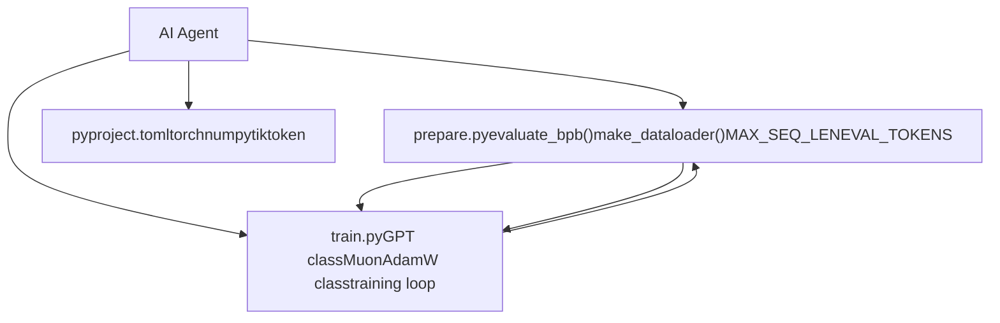
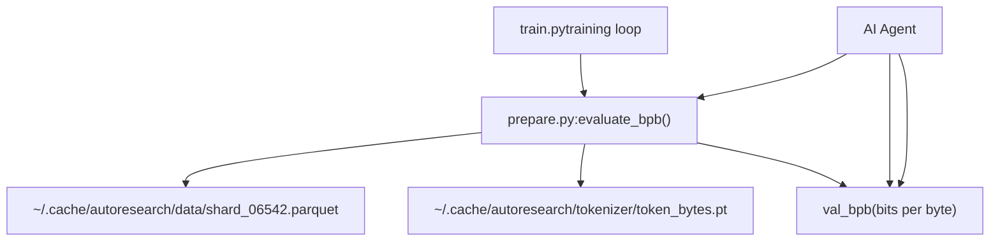

# 系统局限与未来工作

相关源文件

-   [README.md](https://github.com/karpathy/autoresearch/blob/e6d79c12/README.md?plain=1)
-   [program.md](https://github.com/karpathy/autoresearch/blob/e6d79c12/program.md?plain=1)

本页记录了 autoresearch 系统当前设计中已知的局限、为实现目标而作出的权衡，以及未来版本可能的扩展或改进。该系统被设计为“bare bones baseline” [README.md7](https://github.com/karpathy/autoresearch/blob/e6d79c12/README.md?plain=1#L7-L7)，用于演示自治研究，优先考虑简洁性与可复现性，而非功能完备性。

---

## 设计约束及其影响

autoresearch 系统刻意施加了若干硬约束，以支持自治运行和公平比较。尽管这些约束简化了系统并确保实验有效性，但它们也对可开展研究的类型施加了根本限制。

### 单文件修改约束

最显著的架构限制是智能体只能修改 `train.py`。其他所有组件——`prepare.py` 与 `pyproject.toml`——均不可变。

**当前限制：**

**来源：** [README.md13-15](https://github.com/karpathy/autoresearch/blob/e6d79c12/README.md?plain=1#L13-L15) [README.md63-64](https://github.com/karpathy/autoresearch/blob/e6d79c12/README.md?plain=1#L63-L64) [program.md12-14](https://github.com/karpathy/autoresearch/blob/e6d79c12/program.md?plain=1#L12-L14) [program.md28-31](https://github.com/karpathy/autoresearch/blob/e6d79c12/program.md?plain=1#L28-L31)

**影响：**

-   **固定上下文：** 无法实验不同序列长度，因为 `MAX_SEQ_LEN` 在 `prepare.py` 中固定 [prepare.py10](https://github.com/karpathy/autoresearch/blob/e6d79c12/prepare.py#L10-L10)
-   **静态评估：** 无法修改评估指标 `val_bpb`，也无法修改用于验证的数据量（`EVAL_TOKENS`）[prepare.py12](https://github.com/karpathy/autoresearch/blob/e6d79c12/prepare.py#L12-L12)
-   **依赖锁定：** 无法添加新库（例如自定义内核或日志工具），因为 `pyproject.toml` 不允许修改 [program.md30](https://github.com/karpathy/autoresearch/blob/e6d79c12/program.md?plain=1#L30-L30)
-   **数据管线：** 无法修改 dataloader 实现或 BOS 对齐打包策略 [prepare.py157-195](https://github.com/karpathy/autoresearch/blob/e6d79c12/prepare.py#L157-L195)

---

### 固定时间预算限制

所有实验都严格运行 5 分钟墙钟训练时间。这通过 `train.py` 中将已用时间与预算比较来强制执行。

**当前实现约束：**

| 约束 | 值 | 位置 | 可修改性 |
| --- | --- | --- | --- |
| 训练时长 | 5 分钟 | `train.py:TIME_BUDGET` | 是（由智能体） |
| 序列长度 | 2048 | `prepare.py:MAX_SEQ_LEN` | 否 |
| 评估 tokens | ~20.9M | `prepare.py:EVAL_TOKENS` | 否 |
| GPU 数量 | 1 | 系统设计 | 否 |

**来源：** [README.md17-18](https://github.com/karpathy/autoresearch/blob/e6d79c12/README.md?plain=1#L17-L18) [README.md64-65](https://github.com/karpathy/autoresearch/blob/e6d79c12/README.md?plain=1#L64-L65) [program.md23](https://github.com/karpathy/autoresearch/blob/e6d79c12/program.md?plain=1#L23-L23) [prepare.py10-12](https://github.com/karpathy/autoresearch/blob/e6d79c12/prepare.py#L10-L12)

**局限：**

1.  **无法探索缩放律：** 缩放律研究需要同时改变模型大小与训练时长；固定预算阻止了对长期收敛的探索 [README.md64-65](https://github.com/karpathy/autoresearch/blob/e6d79c12/README.md?plain=1#L64-L65)
2.  **平台依赖：** 由于预算是墙钟时间，H100 上的结果与消费级 GPU 上的结果不可直接比较，因为 H100 在 5 分钟内可处理显著更多 token [README.md64-65](https://github.com/karpathy/autoresearch/blob/e6d79c12/README.md?plain=1#L64-L65)
3.  **启动开销：** 5 分钟计时通常不包含启动/编译 [README.md17-18](https://github.com/karpathy/autoresearch/blob/e6d79c12/README.md?plain=1#L17-L18)，但高复杂度模型可能遭遇较长编译时间，而这不会体现在训练效率指标中。

---

### 评估框架不可变性

`prepare.py` 中的 `evaluate_bpb()` 函数是基准真值，智能体无法修改。

**来源：** [prepare.py210-243](https://github.com/karpathy/autoresearch/blob/e6d79c12/prepare.py#L210-L243) [program.md31](https://github.com/karpathy/autoresearch/blob/e6d79c12/program.md?plain=1#L31-L31) [README.md17-18](https://github.com/karpathy/autoresearch/blob/e6d79c12/README.md?plain=1#L17-L18)

**局限：**

1.  **单一目标：** 智能体只优化 `val_bpb`。除非它们间接影响 5 分钟窗口内的训练吞吐，否则不会显式优化推理延迟或参数量 [program.md33-35](https://github.com/karpathy/autoresearch/blob/e6d79c12/program.md?plain=1#L33-L35)
2.  **静态验证集：** 系统始终在固定 shard（`shard_06542.parquet`）上评估，可能在数百代迭代后对验证集过拟合 [prepare.py211-215](https://github.com/karpathy/autoresearch/blob/e6d79c12/prepare.py#L211-L215)

---

## 资源与可扩展性局限

### 单 GPU 与 VRAM 约束

该系统严格面向单个 NVIDIA GPU 设计 [README.md23](https://github.com/karpathy/autoresearch/blob/e6d79c12/README.md?plain=1#L23-L23)

**当前资源管理：**

-   **VRAM 软约束：** 智能体被告知 VRAM 是软约束；不应“blow up dramatically” [program.md35](https://github.com/karpathy/autoresearch/blob/e6d79c12/program.md?plain=1#L35-L35)
-   **内存跟踪：** 通过 `torch.cuda.max_memory_allocated()` 跟踪峰值 VRAM，并记录到 `results.tsv` [program.md43-54](https://github.com/karpathy/autoresearch/blob/e6d79c12/program.md?plain=1#L43-L54) [program.md76](https://github.com/karpathy/autoresearch/blob/e6d79c12/program.md?plain=1#L76-L76)

**局限：**

1.  **模型规模上限：** 模型受单卡内存限制（例如 H100 约 80GB）。不支持 DeepSpeed、FSDP 或模型切分。
2.  **无多 GPU 并行：** 智能体无法运行数据并行训练以提升有效批大小或吞吐。

---

### 串行实验

研究循环本质上是串行的。智能体一次执行一个实验，评估后再决定下一步。

> **[Mermaid stateDiagram]**
> *(图表结构无法解析)*

**来源：** [program.md94-108](https://github.com/karpathy/autoresearch/blob/e6d79c12/program.md?plain=1#L94-L108) [README.md64-65](https://github.com/karpathy/autoresearch/blob/e6d79c12/README.md?plain=1#L64-L65)

**局限：**

1.  **吞吐较低：** 约每小时 12 次实验 [README.md64-65](https://github.com/karpathy/autoresearch/blob/e6d79c12/README.md?plain=1#L64-L65)，与并行超参数扫描相比，搜索空间探索速度较慢。
2.  **贪心搜索：** 当前“keep 或 discard”逻辑实现的是贪心爬山搜索 [program.md103-104](https://github.com/karpathy/autoresearch/blob/e6d79c12/program.md?plain=1#L103-L104) 它难以探索“谷地”（临时性能下降）以到达后续更高峰值。

---

## 未来工作与潜在增强

基于当前局限，识别出若干未来发展方向：

### 1\. 计算最优缩放

将 **Time Budget** 转换为 **Compute Budget**（总 FLOPs）。这将使智能体能在同一“能量”包络内，在“训练小模型更多 token”与“训练大模型更少 token”之间做选择，从而使不同硬件上的结果可比较。

### 2\. 多智能体协作

实现“Research Org”，让多个智能体在不同代码分支上并行工作，并周期性合并成功的架构改动，或进行锦标赛式选择。

### 3\. 自动化元分析

当前分析由人类使用 `analysis.ipynb` 完成。未来可让智能体自行分析 `results.tsv`，识别缩放趋势或超参数相关性，再提出下一批实验。

### 4\. 动态数据与评估

允许智能体修改数据课程或分词器词表大小。为保持 `val_bpb` 指标有效性，这需要在 `prepare.py` 中引入更复杂的归一化层。

### 5\. 高级硬件支持

将系统扩展到支持 Apple Silicon（MPS）或多 GPU 配置。尽管当前为避免“code bloat”而回避这些支持 [README.md68-70](https://github.com/karpathy/autoresearch/blob/e6d79c12/README.md?plain=1#L68-L70)，仍鼓励分叉探索这些平台 [README.md71-80](https://github.com/karpathy/autoresearch/blob/e6d79c12/README.md?plain=1#L71-L80)

**来源：** [README.md7-18](https://github.com/karpathy/autoresearch/blob/e6d79c12/README.md?plain=1#L7-L18) [README.md68-80](https://github.com/karpathy/autoresearch/blob/e6d79c12/README.md?plain=1#L68-L80) [program.md112-115](https://github.com/karpathy/autoresearch/blob/e6d79c12/program.md?plain=1#L112-L115)
