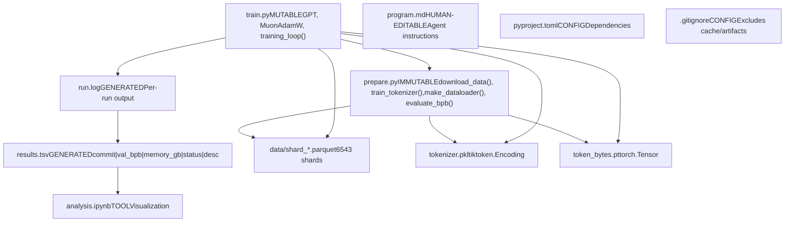
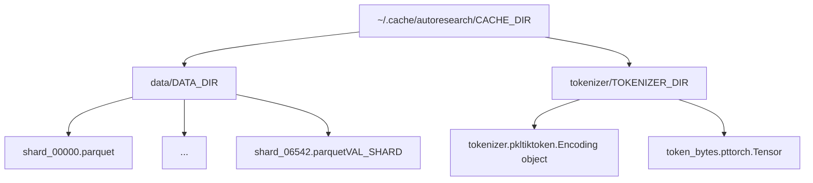
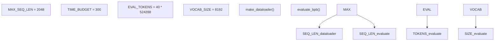

# 参考

相关源文件

-   [README.md](https://github.com/karpathy/autoresearch/blob/e6d79c12/README.md?plain=1)
-   [prepare.py](https://github.com/karpathy/autoresearch/blob/e6d79c12/prepare.py)
-   [train.py](https://github.com/karpathy/autoresearch/blob/e6d79c12/train.py)

本页提供 autoresearch 系统中文件、命令与参数的速查文档。可用于快速查找代码实体、命令语法与配置值。

---

## 9.1. 文件参考

### 仓库文件

**文件系统组织**

来源： [README.md11-15](https://github.com/karpathy/autoresearch/blob/e6d79c12/README.md?plain=1#L11-L15) [README.md52-59](https://github.com/karpathy/autoresearch/blob/e6d79c12/README.md?plain=1#L52-L59)

### 核心文件

| 文件 | 修改策略 | 目的 | 关键代码实体 |
| --- | --- | --- | --- |
| `prepare.py` | **IMMUTABLE**（绝不修改） | 数据准备与评估基础设施 | `download_data()`, `train_tokenizer()`, `make_dataloader()`, `evaluate_bpb()`, `Tokenizer` |
| `train.py` | **MUTABLE**（由智能体修改） | 模型架构、优化器、训练循环 | `GPT`, `CausalSelfAttention`, `MLP`, `MuonAdamW`, `GPTConfig` |
| `program.md` | **HUMAN-EDITABLE** | 研究目标与智能体指令 | 智能体协议、决策规则 |
| `pyproject.toml` | **CONFIG** | Python 依赖 | `torch`, `tiktoken`, `rustbpe`, `pyarrow` |
| `results.tsv` | **GENERATED** | 制表符分隔实验日志 | 列：`commit`, `val_bpb`, `memory_gb`, `status`, `description` |
| `analysis.ipynb` | **TOOL** | 实验后可视化 | 绘图代码、统计计算 |
| `run.log` | **GENERATED** | 单次实验控制台输出 | 训练日志、指标、错误 |

来源： [README.md11-16](https://github.com/karpathy/autoresearch/blob/e6d79c12/README.md?plain=1#L11-L16) [README.md52-59](https://github.com/karpathy/autoresearch/blob/e6d79c12/README.md?plain=1#L52-L59)

### 缓存目录结构

**缓存目录布局**

| 路径 | 变量名 | 内容 | 创建者 |
| --- | --- | --- | --- |
| `~/.cache/autoresearch/` | `CACHE_DIR` | 缓存根目录 | [prepare.py38](https://github.com/karpathy/autoresearch/blob/e6d79c12/prepare.py#L38-L38) |
| `~/.cache/autoresearch/data/` | `DATA_DIR` | Parquet 数据分片 | [prepare.py39](https://github.com/karpathy/autoresearch/blob/e6d79c12/prepare.py#L39-L39) |
| `~/.cache/autoresearch/tokenizer/` | `TOKENIZER_DIR` | 分词器工件 | [prepare.py40](https://github.com/karpathy/autoresearch/blob/e6d79c12/prepare.py#L40-L40) |
| `.../data/shard_06542.parquet` | `VAL_SHARD` | 验证数据（最后一个分片） | [prepare.py43-44](https://github.com/karpathy/autoresearch/blob/e6d79c12/prepare.py#L43-L44) |
| `.../tokenizer/tokenizer.pkl` | — | 训练后的 BPE 分词器 | [prepare.py143](https://github.com/karpathy/autoresearch/blob/e6d79c12/prepare.py#L143-L143) |
| `.../tokenizer/token_bytes.pt` | — | UTF-8 字节长度查找表 | [prepare.py144](https://github.com/karpathy/autoresearch/blob/e6d79c12/prepare.py#L144-L144) |

来源： [prepare.py38-45](https://github.com/karpathy/autoresearch/blob/e6d79c12/prepare.py#L38-L45) [prepare.py141-188](https://github.com/karpathy/autoresearch/blob/e6d79c12/prepare.py#L141-L188)

---

## 9.2. 命令参考

### 初始化命令（一次性）

| 命令 | 目的 | 时长 | 输出 |
| --- | --- | --- | --- |
| `curl -LsSf https://astral.sh/uv/install.sh | sh` | 安装 `uv` 管理器 | ~10 秒 | `uv` 二进制 |
| `uv sync` | 安装依赖 | ~1-2 分钟 | `.venv/` 已填充 |
| `uv run prepare.py` | 完整数据/分词器准备 | ~2-5 分钟 | 缓存已填充 |
| `uv run prepare.py --num-shards 8` | 部分数据下载 | ~1 分钟 | 测试缓存 |

来源： [README.md25-34](https://github.com/karpathy/autoresearch/blob/e6d79c12/README.md?plain=1#L25-L34) [prepare.py5-10](https://github.com/karpathy/autoresearch/blob/e6d79c12/prepare.py#L5-L10)

### 实验命令

| 命令 | 目的 | 时长 | 输出 |
| --- | --- | --- | --- |
| `uv run train.py` | 运行单次实验 | ~5-6 分钟 | `run.log` |
| `git commit -m "desc"` | 记录实验改动 | 即时 | 新 Git commit |
| `git reset HEAD~1` | 丢弃失败实验 | 即时 | 回退 `train.py` |

来源： [README.md36-37](https://github.com/karpathy/autoresearch/blob/e6d79c12/README.md?plain=1#L36-L37) [README.md63-64](https://github.com/karpathy/autoresearch/blob/e6d79c12/README.md?plain=1#L63-L64)

---

## 9.3. 常量与参数

### 基础设施常量（prepare.py）

**固定系统参数**

| 常量 | 值 | 目的 | 位置 |
| --- | --- | --- | --- |
| `MAX_SEQ_LEN` | 2048 | 上下文长度 | [prepare.py30](https://github.com/karpathy/autoresearch/blob/e6d79c12/prepare.py#L30-L30) |
| `TIME_BUDGET` | 300 | 5 分钟限制（秒） | [prepare.py31](https://github.com/karpathy/autoresearch/blob/e6d79c12/prepare.py#L31-L31) |
| `EVAL_TOKENS` | 20,971,520 | 验证 token 数 | [prepare.py32](https://github.com/karpathy/autoresearch/blob/e6d79c12/prepare.py#L32-L32) |
| `VOCAB_SIZE` | 8192 | BPE 词表大小 | [prepare.py45](https://github.com/karpathy/autoresearch/blob/e6d79c12/prepare.py#L45-L45) |
| `SPLIT_PATTERN` | GPT-4 风格 | BPE 正则模式 | [prepare.py48](https://github.com/karpathy/autoresearch/blob/e6d79c12/prepare.py#L48-L48) |

来源： [prepare.py30-51](https://github.com/karpathy/autoresearch/blob/e6d79c12/prepare.py#L30-L51)

### 模型超参数（train.py）

**智能体可修改参数**

| 参数 | 默认值 | 目的 | 位置 |
| --- | --- | --- | --- |
| `n_layer` | 12 | Transformer block 数量 | [train.py36](https://github.com/karpathy/autoresearch/blob/e6d79c12/train.py#L36-L36) |
| `n_head` | 6 | 注意力头数量 | [train.py37](https://github.com/karpathy/autoresearch/blob/e6d79c12/train.py#L37-L37) |
| `n_embd` | 768 | 嵌入维度 | [train.py39](https://github.com/karpathy/autoresearch/blob/e6d79c12/train.py#L39-L39) |
| `window_pattern` | `"SSSL"` | 滑动窗口注意力模式 | [train.py40](https://github.com/karpathy/autoresearch/blob/e6d79c12/train.py#L40-L40) |
| `TOTAL_BATCH_SIZE` | 524,288 | 每次更新目标 token 数 | [train.py270](https://github.com/karpathy/autoresearch/blob/e6d79c12/train.py#L270-L270) |
| `DEVICE_BATCH_SIZE` | 16 | 每 step 批大小 | [train.py271](https://github.com/karpathy/autoresearch/blob/e6d79c12/train.py#L271-L271) |

来源： [train.py32-41](https://github.com/karpathy/autoresearch/blob/e6d79c12/train.py#L32-L41) [train.py270-271](https://github.com/karpathy/autoresearch/blob/e6d79c12/train.py#L270-L271)

---

## 关键函数签名

### prepare.py 导出项

| 函数 | 签名 | 目的 |
| --- | --- | --- |
| `make_dataloader` | `(tokenizer, B, T, split)` | 产出 (x, y, epoch) |
| `evaluate_bpb` | `(model, tokenizer, batch_size)` | 计算验证 BPB |
| `Tokenizer` | `class` | BPE 编码/解码 |

来源： [prepare.py260-349](https://github.com/karpathy/autoresearch/blob/e6d79c12/prepare.py#L260-L349)

### train.py 组件

| 类/函数 | 目的 | 位置 |
| --- | --- | --- |
| `GPT` | 核心 Transformer 模型 | [train.py124](https://github.com/karpathy/autoresearch/blob/e6d79c12/train.py#L124-L124) |
| `CausalSelfAttention` | 带可选 Value Embedding 的注意力 | [train.py61](https://github.com/karpathy/autoresearch/blob/e6d79c12/train.py#L61-L61) |
| `MuonAdamW` | 混合矩阵/向量优化器 | [train.py214](https://github.com/karpathy/autoresearch/blob/e6d79c12/train.py#L214-L214) |
| `has_ve` | Value Embedding 层逻辑 | [train.py47](https://github.com/karpathy/autoresearch/blob/e6d79c12/train.py#L47-L47) |

来源： [train.py47-214](https://github.com/karpathy/autoresearch/blob/e6d79c12/train.py#L47-L214)
