# 文件参考

相关源文件

-   [.gitignore](https://github.com/karpathy/autoresearch/blob/e6d79c12/.gitignore)
-   [README.md](https://github.com/karpathy/autoresearch/blob/e6d79c12/README.md?plain=1)
-   [progress.png](https://github.com/karpathy/autoresearch/blob/e6d79c12/progress.png)

本页提供 `autoresearch` 系统中所有文件的完整参考，包括其位置、用途和修改策略。该系统围绕不可变基础设施与由 AI 代理优化的可变训练代码之间的清晰分离而设计。

---

## 文件类别概览

系统架构划分为三个功能层：**人类层**（战略指令）、**代理层**（自主执行与代码修改）以及**基础设施层**（数据、评估与环境）。

### 系统数据流与修改角色

下图说明了 AI 代理如何与代码库交互，区分了其读取内容、修改内容以及生成的输出内容。

**系统实体关系图**

**来源：** [README.md11-18](https://github.com/karpathy/autoresearch/blob/e6d79c12/README.md?plain=1#L11-L18) [README.md54-59](https://github.com/karpathy/autoresearch/blob/e6d79c12/README.md?plain=1#L54-L59) [program.md12-31](https://github.com/karpathy/autoresearch/blob/e6d79c12/program.md?plain=1#L12-L31)

---

## 核心系统文件

### 1\. train.py（可变核心）

**修改策略：** **完全可变**。这是代理唯一被允许编辑的文件。

`train.py` 包含完整训练流水线。它是一个自包含脚本，定义了模型架构、优化策略和训练循环。

-   **关键组件：**
    -   `GPT` 类：主模型实现 [train.py125-293](https://github.com/karpathy/autoresearch/blob/e6d79c12/train.py#L125-L293)
    -   `MuonAdamW` 类：混合优化器，对内部二维参数使用 Muon，对其余参数使用 AdamW [train.py357-428](https://github.com/karpathy/autoresearch/blob/e6d79c12/train.py#L357-L428)
    -   **超参数：** 常量专用代码块（例如 `DEPTH`、`TOTAL_BATCH_SIZE`、`MATRIX_LR`），代理会频繁调优 [train.py433-449](https://github.com/karpathy/autoresearch/blob/e6d79c12/train.py#L433-L449)
    -   **训练循环：** 一个时间感知循环，严格运行 `TIME_BUDGET` 秒 [train.py544-606](https://github.com/karpathy/autoresearch/blob/e6d79c12/train.py#L544-L606)

**来源：** [README.md14](https://github.com/karpathy/autoresearch/blob/e6d79c12/README.md?plain=1#L14-L14) [train.py1-632](https://github.com/karpathy/autoresearch/blob/e6d79c12/train.py#L1-L632)

### 2\. prepare.py（数据与评估）

**修改策略：** **不可变**。该文件为实验提供“真实基准”。

`prepare.py` 负责一次性初始化，并提供运行时工具；这些内容必须保持不变，以确保不同 `train.py` 版本之间的公平比较。

-   **关键函数：**
    -   `train_tokenizer()`：使用 `rustbpe` 训练 BPE 分词器 [prepare.py130-193](https://github.com/karpathy/autoresearch/blob/e6d79c12/prepare.py#L130-L193)
    -   `make_dataloader()`：实现 BOS 对齐、最佳适配打包的数据加载器，实现 100% token 利用率 [prepare.py260-322](https://github.com/karpathy/autoresearch/blob/e6d79c12/prepare.py#L260-L322)
    -   `evaluate_bpb()`：关键评估框架，用于计算 bits-per-byte [prepare.py328-350](https://github.com/karpathy/autoresearch/blob/e6d79c12/prepare.py#L328-L350)

**来源：** [README.md13](https://github.com/karpathy/autoresearch/blob/e6d79c12/README.md?plain=1#L13-L13) [prepare.py1-374](https://github.com/karpathy/autoresearch/blob/e6d79c12/prepare.py#L1-L374)

### 3\. program.md（代理指令）

**修改策略：** **可由人类编辑**。该文件代表“研究组织代码（Research Org Code）”。

`program.md` 为 AI 代理提供提示词和运行约束。它定义了研究循环、保留/舍弃实验的决策逻辑，以及 `results.tsv` 的格式。

-   **关键协议：**
    -   **研究循环：** 8 步自主循环 [program.md90-108](https://github.com/karpathy/autoresearch/blob/e6d79c12/program.md?plain=1#L90-L108)
    -   **简洁性准则：** 拒绝复杂且仅带来边际收益的改动 [program.md37](https://github.com/karpathy/autoresearch/blob/e6d79c12/program.md?plain=1#L37-L37)
    -   **Git 策略：** 分支管理说明，以及实验失败时的 `git reset` [program.md104-108](https://github.com/karpathy/autoresearch/blob/e6d79c12/program.md?plain=1#L104-L108)

**来源：** [README.md15](https://github.com/karpathy/autoresearch/blob/e6d79c12/README.md?plain=1#L15-L15) [program.md1-114](https://github.com/karpathy/autoresearch/blob/e6d79c12/program.md?plain=1#L1-L114)

---

## 技术文件参考表

| 文件路径 | 类型 | 修改规则 | 系统中的角色 |
| --- | --- | --- | --- |
| `train.py` | Python 脚本 | **代理可修改** | 定义模型、优化器和训练循环。 |
| `prepare.py` | Python 脚本 | **不可变** | 数据下载、分词器训练和 `evaluate_bpb`。 |
| `program.md` | Markdown | **人类可修改** | AI 代理的指令、目标和协议。 |
| `pyproject.toml` | TOML | **不可变** | 通过 `uv` 进行依赖管理。 |
| `results.tsv` | TSV 数据 | **代理追加** | 每次实验尝试的 5 列日志。 |
| `progress.png` | 图像 | **自动生成** | `val_bpb` 随时间变化的可视化。 |
| `analysis.ipynb` | Notebook | **人类工具** | 对 `results.tsv` 日志进行事后分析。 |
| `.gitignore` | 配置 | **不可变** | 防止缓存和本地日志被追踪。 |

**来源：** [README.md54-59](https://github.com/karpathy/autoresearch/blob/e6d79c12/README.md?plain=1#L54-L59) [.gitignore1-23](https://github.com/karpathy/autoresearch/blob/e6d79c12/.gitignore#L1-L23) [program.md66-88](https://github.com/karpathy/autoresearch/blob/e6d79c12/program.md?plain=1#L66-L88)

---

## 数据与缓存结构

系统使用本地缓存存储体量较大的产物，确保 `train.py` 可以无需重复处理数据而即时启动。

**文件系统与代码实体映射**

```mermaid
flowchart TD
    root["/"]
    train_py_file["train.py"]
    prepare_py_file["prepare.py"]
    results_tsv_file["results.tsv"]
    cache_dir["Cache Root"]
    data_dir["data/"]
    shard_train["shard_00000.parquet ... shard_06541.parquet"]
    shard_val["shard_06542.parquet (Validation)"]
    tok_dir["tokenizer/"]
    tok_pkl["tokenizer.pkl (tiktoken.Encoding)"]
    tok_bytes["token_bytes.pt (Length Map)"]

    root --> train_py_file
    root --> prepare_py_file
    root --> results_tsv_file
    data --> dir_shard_train
    data --> dir_shard_val
    tok --> dir_tok_pkl
    tok --> dir_tok_bytes
    prepare --> py_file_data_dir
    prepare --> py_file_tok_dir
    train --> py_file_cache_dir
```

**来源：** [prepare.py32-43](https://github.com/karpathy/autoresearch/blob/e6d79c12/prepare.py#L32-L43) [prepare.py83-103](https://github.com/karpathy/autoresearch/blob/e6d79c12/prepare.py#L83-L103) [prepare.py245-257](https://github.com/karpathy/autoresearch/blob/e6d79c12/prepare.py#L245-L257)

### 产物细节

-   **results.tsv：** 包含五列：`commit`、`val_bpb`、`memory_gb`、`status` 和 `description` [program.md70-78](https://github.com/karpathy/autoresearch/blob/e6d79c12/program.md?plain=1#L70-L78)
-   **token\_bytes.pt：** 一个 PyTorch 张量，将 `token_id` 映射到其 UTF-8 字节长度，是计算 bits-per-byte 的关键 [prepare.py237-241](https://github.com/karpathy/autoresearch/blob/e6d79c12/prepare.py#L237-L241)
-   **run.log：** 代理用于捕获 `uv run train.py` 输出并通过 `grep` 提取指标的临时文件 [program.md99-100](https://github.com/karpathy/autoresearch/blob/e6d79c12/program.md?plain=1#L99-L100)

---

## 配置与环境

### pyproject.toml

该文件定义技术环境。它指定 Python 版本要求为 `>=3.10`，并管理包括 `torch`、`tiktoken`、`rustbpe` 和 `pyarrow` 在内的依赖。

**来源：** [README.md23-31](https://github.com/karpathy/autoresearch/blob/e6d79c12/README.md?plain=1#L23-L31)

### .gitignore

系统会显式忽略大型数据缓存和会话级代理文件，以保持仓库整洁。

-   **已忽略：** `__pycache__`、`.venv`、`worktrees/`、`results/`、`queue/`、`results.tsv`，以及如 `CLAUDE.md` 或 `AGENTS.md` 这类代理专用提示文件。

**来源：** [.gitignore1-23](https://github.com/karpathy/autoresearch/blob/e6d79c12/.gitignore#L1-L23)
