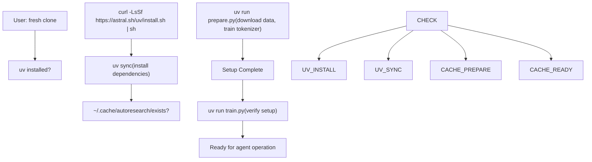
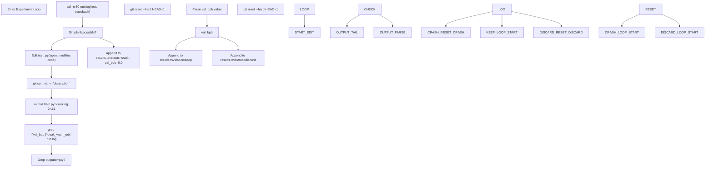

# 命令参考

相关源文件

-   [README.md](https://github.com/karpathy/autoresearch/blob/e6d79c12/README.md?plain=1)
-   [program.md](https://github.com/karpathy/autoresearch/blob/e6d79c12/program.md?plain=1)

本页提供 autoresearch 工作流中所有命令行操作的综合参考。命令按阶段组织：初始设置、代理运行和分析。

## 初始设置命令

这些命令仅执行一次，用于准备 autoresearch 环境。它们建立依赖、数据和分词器产物。

| 命令 | 目的 | 执行上下文 | 说明 |
| --- | --- | --- | --- |
| `curl -LsSf https://astral.sh/uv/install.sh | sh` | 安装 uv 包管理器 | Shell（一次性） | 如果尚未安装 `uv`，则需要执行 [README.md28](https://github.com/karpathy/autoresearch/blob/e6d79c12/README.md?plain=1#L28-L28) |
| `uv sync` | 安装 Python 依赖 | 项目根目录 | 安装 `pyproject.toml` 中定义的 PyTorch 和其他包 [README.md31](https://github.com/karpathy/autoresearch/blob/e6d79c12/README.md?plain=1#L31-L31) |
| `uv run prepare.py` | 准备数据和分词器 | 项目根目录 | 下载分片并训练 BPE 分词器（约 2 分钟） [README.md34](https://github.com/karpathy/autoresearch/blob/e6d79c12/README.md?plain=1#L34-L34) |

**来源：** [README.md25-38](https://github.com/karpathy/autoresearch/blob/e6d79c12/README.md?plain=1#L25-L38) [program.md15](https://github.com/karpathy/autoresearch/blob/e6d79c12/program.md?plain=1#L15-L15)

### 设置命令流程

下图展示了从全新克隆到可进行自主研究状态的转换过程，并将自然语言设置步骤映射到具体 CLI 命令。

**来源：** [README.md25-40](https://github.com/karpathy/autoresearch/blob/e6d79c12/README.md?plain=1#L25-L40) [program.md15](https://github.com/karpathy/autoresearch/blob/e6d79c12/program.md?plain=1#L15-L15)

## 代理运行命令

这些命令由自主代理在实验循环中反复执行。代理无需人工干预即可操作这些命令。

### 核心实验命令

| 命令 | 目的 | 频率 | 预期输出 |
| --- | --- | --- | --- |
| `uv run train.py` | 执行 5 分钟训练运行 | 每次实验 | 向 stdout 打印指标摘要 [README.md37](https://github.com/karpathy/autoresearch/blob/e6d79c12/README.md?plain=1#L37-L37) |
| `uv run train.py > run.log 2>&1` | 执行并捕获完整输出 | 每次实验（代理） | 将所有输出重定向到 `run.log` [program.md99](https://github.com/karpathy/autoresearch/blob/e6d79c12/program.md?plain=1#L99-L99) |

**来源：** [README.md36-37](https://github.com/karpathy/autoresearch/blob/e6d79c12/README.md?plain=1#L36-L37) [program.md23](https://github.com/karpathy/autoresearch/blob/e6d79c12/program.md?plain=1#L23-L23) [program.md99](https://github.com/karpathy/autoresearch/blob/e6d79c12/program.md?plain=1#L99-L99)

### 指标提取命令

代理使用标准 shell 工具解析训练日志，并判断实验是否成功。

| 命令 | 目的 | 输出格式 |
| --- | --- | --- |
| `grep "^val_bpb:" run.log` | 提取主指标 | `val_bpb: 0.997900` [program.md61](https://github.com/karpathy/autoresearch/blob/e6d79c12/program.md?plain=1#L61-L61) |
| `grep "^val_bpb:|^peak_vram_mb:" run.log` | 提取关键指标 | 多行指标 [program.md100](https://github.com/karpathy/autoresearch/blob/e6d79c12/program.md?plain=1#L100-L100) |
| `tail -n 50 run.log` | 调试崩溃 | Python 堆栈跟踪 [program.md101](https://github.com/karpathy/autoresearch/blob/e6d79c12/program.md?plain=1#L101-L101) |

**来源：** [program.md60-62](https://github.com/karpathy/autoresearch/blob/e6d79c12/program.md?plain=1#L60-L62) [program.md100-101](https://github.com/karpathy/autoresearch/blob/e6d79c12/program.md?plain=1#L100-L101)

### 实验循环命令序列

该图将 `program.md` 中描述的高层“实验循环”逻辑映射为用于执行它的具体代码级命令。

**来源：** [program.md94-110](https://github.com/karpathy/autoresearch/blob/e6d79c12/program.md?plain=1#L94-L110)

## 版本控制命令

Git 命令管理实验分支并跟踪优化前沿。代理使用 Git 创建检查点并回滚失败实验。

### 分支管理

| 命令 | 目的 | 执行阶段 | 示例 |
| --- | --- | --- | --- |
| `git checkout -b autoresearch/<tag>` | 创建新的实验分支 | 初始设置 | `git checkout -b autoresearch/mar5` [program.md10](https://github.com/karpathy/autoresearch/blob/e6d79c12/program.md?plain=1#L10-L10) |

### 实验追踪

| 命令 | 目的 | 执行时机 | 效果 |
| --- | --- | --- | --- |
| `git commit -m "description"` | 保存实验状态 | 编辑 `train.py` 后 | 使用 7 字符哈希创建提交 [program.md98](https://github.com/karpathy/autoresearch/blob/e6d79c12/program.md?plain=1#L98-L98) |
| `git reset --hard HEAD~1` | 丢弃失败实验 | 做出 discard/crash 决策后 | 回退到上一个提交 [program.md104](https://github.com/karpathy/autoresearch/blob/e6d79c12/program.md?plain=1#L104-L104) |

**来源：** [program.md9-10](https://github.com/karpathy/autoresearch/blob/e6d79c12/program.md?plain=1#L9-L10) [program.md96-104](https://github.com/karpathy/autoresearch/blob/e6d79c12/program.md?plain=1#L96-L104)

## 文件 I/O 与重定向

### 输出重定向的原因

代理被指示使用 `uv run train.py > run.log 2>&1` [program.md99](https://github.com/karpathy/autoresearch/blob/e6d79c12/program.md?plain=1#L99-L99)。该重定向至关重要，因为：

1.  它可以防止代理的上下文窗口被数千行训练日志淹没。
2.  它允许使用 `grep` 和 `tail` 对 `run.log` 进行事后分析 [program.md100-101](https://github.com/karpathy/autoresearch/blob/e6d79c12/program.md?plain=1#L100-L101)

### 结果文件处理

`results.tsv` 文件是研究进展的主要记录。它使用制表符分隔，以避免描述中的逗号导致解析中断 [program.md66](https://github.com/karpathy/autoresearch/blob/e6d79c12/program.md?plain=1#L66-L66)

| 操作 | 命令/格式 |
| --- | --- |
| 表头 | `commit\tval_bpb\tmemory_gb\tstatus\tdescription` [program.md71](https://github.com/karpathy/autoresearch/blob/e6d79c12/program.md?plain=1#L71-L71) |
| 追加结果 | `<hash>\t<val>\t<mem>\t<status>\t<desc>` [program.md83-88](https://github.com/karpathy/autoresearch/blob/e6d79c12/program.md?plain=1#L83-L88) |

**注意：** `results.tsv` 应保持为 Git 未跟踪状态 [program.md102](https://github.com/karpathy/autoresearch/blob/e6d79c12/program.md?plain=1#L102-L102)

**来源：** [program.md66-88](https://github.com/karpathy/autoresearch/blob/e6d79c12/program.md?plain=1#L66-L88) [program.md99-102](https://github.com/karpathy/autoresearch/blob/e6d79c12/program.md?plain=1#L99-L102)

## 完整命令参考表

| 类别 | 命令 | 目的 |
| --- | --- | --- |
| **设置** | `uv sync` | 安装依赖 [README.md31](https://github.com/karpathy/autoresearch/blob/e6d79c12/README.md?plain=1#L31-L31) |
| **设置** | `uv run prepare.py` | 一次性数据准备 [README.md34](https://github.com/karpathy/autoresearch/blob/e6d79c12/README.md?plain=1#L34-L34) |
| **执行** | `uv run train.py` | 运行 5 分钟训练 [README.md37](https://github.com/karpathy/autoresearch/blob/e6d79c12/README.md?plain=1#L37-L37) |
| **Git** | `git checkout -b autoresearch/<tag>` | 初始化分支 [program.md10](https://github.com/karpathy/autoresearch/blob/e6d79c12/program.md?plain=1#L10-L10) |
| **Git** | `git commit -m "..."` | 实验检查点 [program.md98](https://github.com/karpathy/autoresearch/blob/e6d79c12/program.md?plain=1#L98-L98) |
| **Git** | `git reset --hard HEAD~1` | 回滚失败改动 [program.md104](https://github.com/karpathy/autoresearch/blob/e6d79c12/program.md?plain=1#L104-L104) |
| **分析** | `grep "^val_bpb:" run.log` | 提取主指标 [program.md61](https://github.com/karpathy/autoresearch/blob/e6d79c12/program.md?plain=1#L61-L61) |
| **分析** | `tail -n 50 run.log` | 诊断崩溃 [program.md101](https://github.com/karpathy/autoresearch/blob/e6d79c12/program.md?plain=1#L101-L101) |

**来源：** [README.md25-40](https://github.com/karpathy/autoresearch/blob/e6d79c12/README.md?plain=1#L25-L40) [program.md9-110](https://github.com/karpathy/autoresearch/blob/e6d79c12/program.md?plain=1#L9-L110)
