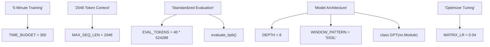
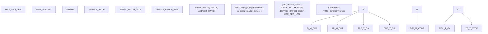

# 常量与参数

相关源文件

-   [prepare.py](https://github.com/karpathy/autoresearch/blob/e6d79c12/prepare.py)
-   [train.py](https://github.com/karpathy/autoresearch/blob/e6d79c12/train.py)

本页提供 autoresearch 代码库中所有常量与参数的综合参考。这些值分为两类关键类别：

1.  **不可变常量**（位于 `prepare.py`）——确保所有实验可公平比较的固定基础设施约束。
2.  **可变参数**（位于 `train.py`）——鼓励 AI 代理修改的超参数与架构设置。

## 目的与范围

本参考文档记录：

-   [prepare.py27-32](https://github.com/karpathy/autoresearch/blob/e6d79c12/prepare.py#L27-L32) 中定义的所有不可变常量
-   [train.py432-451](https://github.com/karpathy/autoresearch/blob/e6d79c12/train.py#L432-L451) 中定义的所有可变超参数
-   [prepare.py38-51](https://github.com/karpathy/autoresearch/blob/e6d79c12/prepare.py#L38-L51) 中的数据与分词器配置
-   这些值与 [train.py](https://github.com/karpathy/autoresearch/blob/e6d79c12/train.py) 中训练循环之间的关系

## 不可变与可变：系统边界

系统在基础设施（不可变）与研究（可变）之间实施严格边界。这可确保主指标（`val_bpb`）的任何改进来自架构或算法创新，而非仅仅提高计算预算。

### 自然语言到代码实体映射

下图连接了高层研究概念与实现它们的具体代码实体。

**来源：** [prepare.py26-32](https://github.com/karpathy/autoresearch/blob/e6d79c12/prepare.py#L26-L32) [train.py429-451](https://github.com/karpathy/autoresearch/blob/e6d79c12/train.py#L429-L451) [train.py124-148](https://github.com/karpathy/autoresearch/blob/e6d79c12/train.py#L124-L148)

---

## 不可变常量（prepare.py）

这些常量定义在 `prepare.py` 顶部，并由 `train.py` 导入。它们代表“游戏规则”。

| 常量 | 值 | 单位 | 角色 |
| --- | --- | --- | --- |
| `MAX_SEQ_LEN` | `2048` | tokens | 训练与评估的固定上下文窗口。 [prepare.py30](https://github.com/karpathy/autoresearch/blob/e6d79c12/prepare.py#L30-L30) |
| `TIME_BUDGET` | `300` | seconds | 训练循环的墙钟时间上限。 [prepare.py31](https://github.com/karpathy/autoresearch/blob/e6d79c12/prepare.py#L31-L31) |
| `EVAL_TOKENS` | `20,971,520` | tokens | 验证期间处理的数据总量。 [prepare.py32](https://github.com/karpathy/autoresearch/blob/e6d79c12/prepare.py#L32-L32) |

### 数据与分词器配置

这些值定义了环境与数据集特征。

| 常量 | 值 | 用途 |
| --- | --- | --- |
| `VOCAB_SIZE` | `8192` | 由 `rustbpe` 训练的 BPE 词表大小。 [prepare.py45](https://github.com/karpathy/autoresearch/blob/e6d79c12/prepare.py#L45-L45) |
| `VAL_SHARD` | `6542` | 专门保留用于验证的数据分片。 [prepare.py43](https://github.com/karpathy/autoresearch/blob/e6d79c12/prepare.py#L43-L43) |
| `SPLIT_PATTERN` | `r"..."` | 用于 BPE 分词的 GPT-4 风格正则表达式。 [prepare.py48](https://github.com/karpathy/autoresearch/blob/e6d79c12/prepare.py#L48-L48) |
| `BOS_TOKEN` | \`"< | reserved\_0 |

**来源：** [prepare.py26-52](https://github.com/karpathy/autoresearch/blob/e6d79c12/prepare.py#L26-L52)

---

## 可变参数（train.py）

这些参数位于 `train.py` 的“Hyperparameters”部分。AI 代理通过修改这些值来寻找性能更好的模型。

### 模型缩放与架构

模型维度由 `DEPTH` 和 `ASPECT_RATIO` 推导，以确保满足注意力头要求的兼容性。

| 参数 | 默认值 | 逻辑 / 用途 |
| --- | --- | --- |
| `DEPTH` | `8` | Transformer 层数。 [train.py450](https://github.com/karpathy/autoresearch/blob/e6d79c12/train.py#L450-L450) |
| `ASPECT_RATIO` | `64` | 宽度乘子：`base_dim = DEPTH * ASPECT_RATIO`。 [train.py433](https://github.com/karpathy/autoresearch/blob/e6d79c12/train.py#L433-L433) |
| `HEAD_DIM` | `128` | 每个注意力头的维度。 [train.py434](https://github.com/karpathy/autoresearch/blob/e6d79c12/train.py#L434-L434) |
| `WINDOW_PATTERN` | `"SSSL"` | 滑动（S）与长程（L）注意力层的模式。 [train.py435](https://github.com/karpathy/autoresearch/blob/e6d79c12/train.py#L435-L435) |

**派生宽度计算：** `model_dim` 在 `train.py` 中被计算为 `HEAD_DIM` 的整数倍，以便进行干净的头拆分：`model_dim = ((base_dim + HEAD_DIM - 1) // HEAD_DIM) * HEAD_DIM` [train.py470-471](https://github.com/karpathy/autoresearch/blob/e6d79c12/train.py#L470-L471)

### 优化与学习率

系统采用混合优化策略：对内部二维矩阵使用 **Muon**，对向量和嵌入使用 **AdamW**。

| 参数 | 默认值 | 优化器 | 目标参数 |
| --- | --- | --- | --- |
| `MATRIX_LR` | `0.04` | Muon | 线性层权重（不含嵌入）。 [train.py441](https://github.com/karpathy/autoresearch/blob/e6d79c12/train.py#L441-L441) |
| `EMBEDDING_LR` | `0.6` | AdamW | `wte` 和 `value_embeds`。 [train.py439](https://github.com/karpathy/autoresearch/blob/e6d79c12/train.py#L439-L439) |
| `UNEMBEDDING_LR` | `0.004` | AdamW | `lm_head` 权重。 [train.py440](https://github.com/karpathy/autoresearch/blob/e6d79c12/train.py#L440-L440) |
| `SCALAR_LR` | `0.5` | AdamW | `resid_lambdas`、`x0_lambdas` 等。 [train.py442](https://github.com/karpathy/autoresearch/blob/e6d79c12/train.py#L442-L442) |
| `TOTAL_BATCH_SIZE` | `524288` | — | 每步全局 token 数（$2^{19}$）。 [train.py438](https://github.com/karpathy/autoresearch/blob/e6d79c12/train.py#L438-L438) |

**来源：** [train.py432-451](https://github.com/karpathy/autoresearch/blob/e6d79c12/train.py#L432-L451) [train.py469-477](https://github.com/karpathy/autoresearch/blob/e6d79c12/train.py#L469-L477)

---

## 参数数据流

下图展示这些常量和参数在一次训练运行初始化期间如何交互。

**来源：** [train.py469-477](https://github.com/karpathy/autoresearch/blob/e6d79c12/train.py#L469-L477) [train.py495-497](https://github.com/karpathy/autoresearch/blob/e6d79c12/train.py#L495-L497) [train.py603-604](https://github.com/karpathy/autoresearch/blob/e6d79c12/train.py#L603-L604)

### 批大小与梯度累积

由于 `TOTAL_BATCH_SIZE` 固定（通常为 $2^{19}$ 个 token），系统会基于 `DEVICE_BATCH_SIZE` 和 `MAX_SEQ_LEN` 自动计算梯度累积步数。

-   **计算：** `grad_accum_steps = TOTAL_BATCH_SIZE // (DEVICE_BATCH_SIZE * MAX_SEQ_LEN)` [train.py497](https://github.com/karpathy/autoresearch/blob/e6d79c12/train.py#L497-L497)
-   **校验：** 代码断言 `TOTAL_BATCH_SIZE` 可被本地批大小整除，以确保优化动态一致。 [train.py496](https://github.com/karpathy/autoresearch/blob/e6d79c12/train.py#L496-L496)

### 学习率调度

学习率并非静态，而是遵循由 `WARMUP_RATIO` 和 `WARMDOWN_RATIO` 控制的三阶段调度。

1.  **Warmup：** 从 0 线性上升到最大学习率。 [train.py521-522](https://github.com/karpathy/autoresearch/blob/e6d79c12/train.py#L521-L522)
2.  **Constant：** 保持最大学习率。 [train.py523-524](https://github.com/karpathy/autoresearch/blob/e6d79c12/train.py#L523-L524)
3.  **Warmdown：** 使用类余弦或线性坡道进行线性衰减（通常降至 0）。 [train.py525-528](https://github.com/karpathy/autoresearch/blob/e6d79c12/train.py#L525-L528)

进度以 `TIME_BUDGET` 的比例度量：`progress = training_time / TIME_BUDGET` [train.py518-519](https://github.com/karpathy/autoresearch/blob/e6d79c12/train.py#L518-L519)

**来源：** [train.py444-447](https://github.com/karpathy/autoresearch/blob/e6d79c12/train.py#L444-L447) [train.py518-532](https://github.com/karpathy/autoresearch/blob/e6d79c12/train.py#L518-L532)
