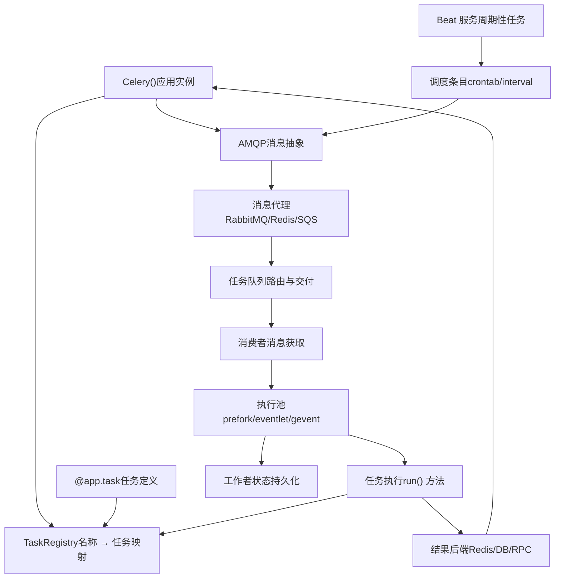
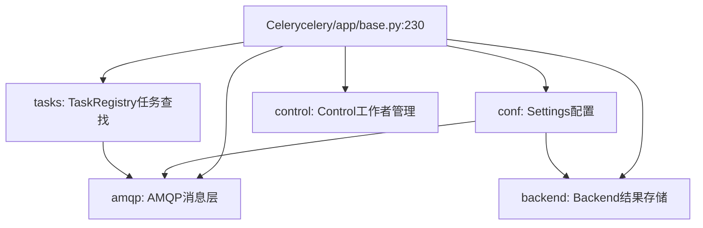
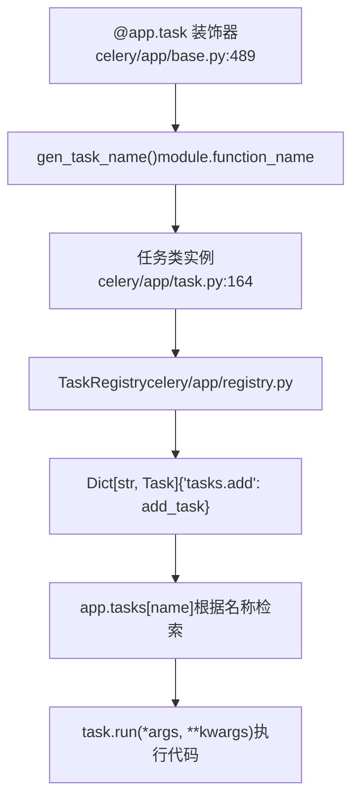
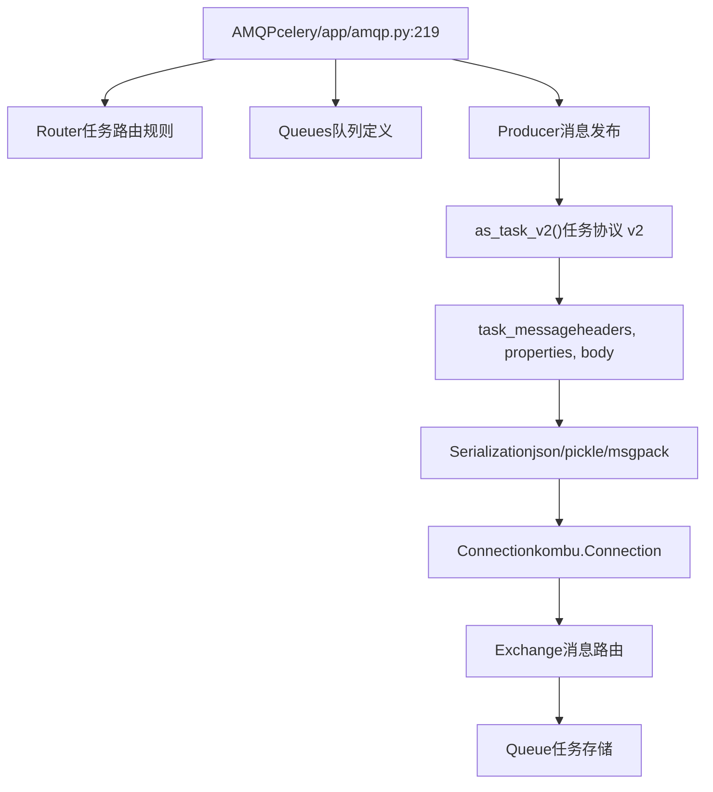
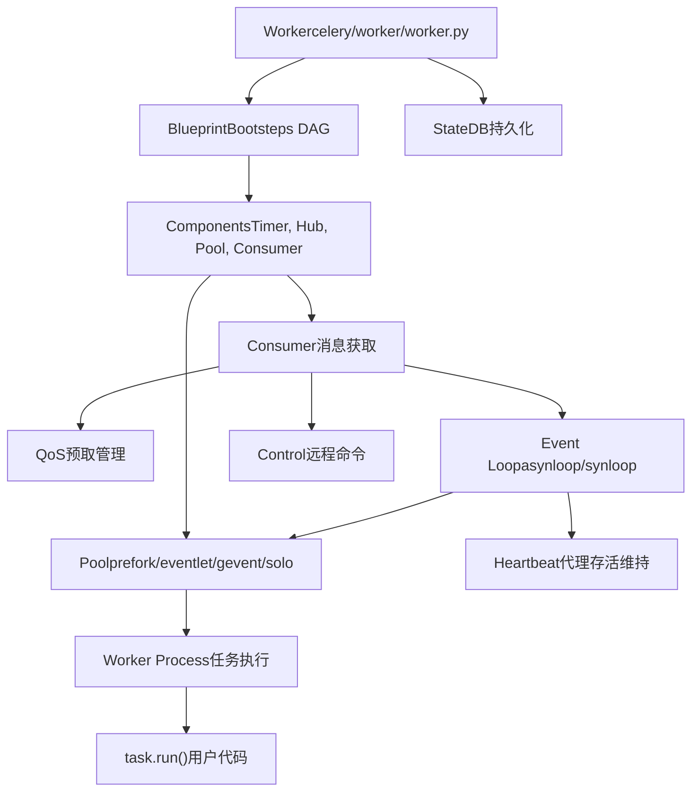
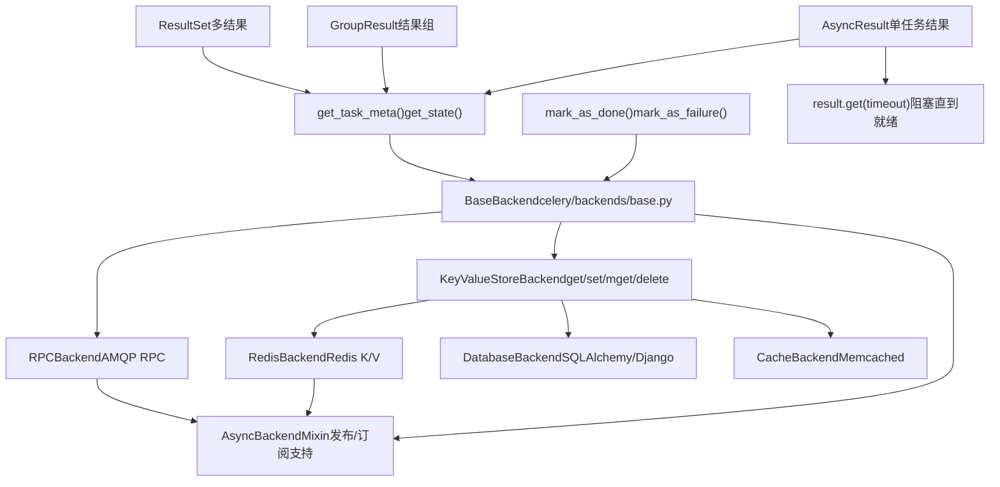
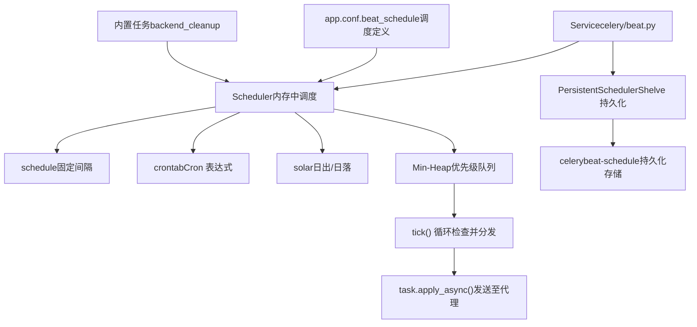
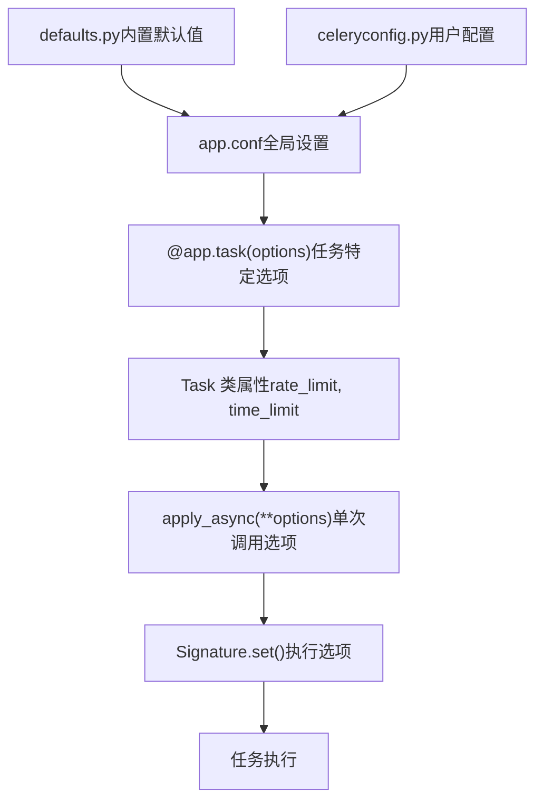

# 核心架构

相关源文件

-   [.bumpversion.cfg](https://github.com/celery/celery/blob/4d068b56/.bumpversion.cfg)
-   [Changelog.rst](https://github.com/celery/celery/blob/4d068b56/Changelog.rst)
-   [README.rst](https://github.com/celery/celery/blob/4d068b56/README.rst)
-   [celery/\_\_init\_\_.py](https://github.com/celery/celery/blob/4d068b56/celery/__init__.py)
-   [celery/app/amqp.py](https://github.com/celery/celery/blob/4d068b56/celery/app/amqp.py)
-   [celery/app/base.py](https://github.com/celery/celery/blob/4d068b56/celery/app/base.py)
-   [celery/app/task.py](https://github.com/celery/celery/blob/4d068b56/celery/app/task.py)
-   [celery/canvas.py](https://github.com/celery/celery/blob/4d068b56/celery/canvas.py)
-   [celery/contrib/sphinx.py](https://github.com/celery/celery/blob/4d068b56/celery/contrib/sphinx.py)
-   [celery/utils/\_\_init\_\_.py](https://github.com/celery/celery/blob/4d068b56/celery/utils/__init__.py)
-   [docs/getting-started/introduction.rst](https://github.com/celery/celery/blob/4d068b56/docs/getting-started/introduction.rst)
-   [docs/history/changelog-5.5.rst](https://github.com/celery/celery/blob/4d068b56/docs/history/changelog-5.5.rst)
-   [docs/history/changelog-5.6.rst](https://github.com/celery/celery/blob/4d068b56/docs/history/changelog-5.6.rst)
-   [docs/history/index.rst](https://github.com/celery/celery/blob/4d068b56/docs/history/index.rst)
-   [docs/history/whatsnew-5.5.rst](https://github.com/celery/celery/blob/4d068b56/docs/history/whatsnew-5.5.rst)
-   [docs/history/whatsnew-5.6.rst](https://github.com/celery/celery/blob/4d068b56/docs/history/whatsnew-5.6.rst)
-   [docs/includes/introduction.txt](https://github.com/celery/celery/blob/4d068b56/docs/includes/introduction.txt)
-   [docs/includes/resources.txt](https://github.com/celery/celery/blob/4d068b56/docs/includes/resources.txt)
-   [docs/index.rst](https://github.com/celery/celery/blob/4d068b56/docs/index.rst)
-   [docs/userguide/canvas.rst](https://github.com/celery/celery/blob/4d068b56/docs/userguide/canvas.rst)
-   [t/integration/conftest.py](https://github.com/celery/celery/blob/4d068b56/t/integration/conftest.py)
-   [t/integration/tasks.py](https://github.com/celery/celery/blob/4d068b56/t/integration/tasks.py)
-   [t/integration/test\_canvas.py](https://github.com/celery/celery/blob/4d068b56/t/integration/test_canvas.py)
-   [t/integration/test\_quorum\_queue\_qos\_cluster\_simulation.py](https://github.com/celery/celery/blob/4d068b56/t/integration/test_quorum_queue_qos_cluster_simulation.py)
-   [t/integration/test\_security.py](https://github.com/celery/celery/blob/4d068b56/t/integration/test_security.py)
-   [t/integration/test\_tasks.py](https://github.com/celery/celery/blob/4d068b56/t/integration/test_tasks.py)
-   [t/smoke/tests/test\_canvas.py](https://github.com/celery/celery/blob/4d068b56/t/smoke/tests/test_canvas.py)
-   [t/unit/app/test\_app.py](https://github.com/celery/celery/blob/4d068b56/t/unit/app/test_app.py)
-   [t/unit/tasks/test\_canvas.py](https://github.com/celery/celery/blob/4d068b56/t/unit/tasks/test_canvas.py)
-   [t/unit/tasks/test\_tasks.py](https://github.com/celery/celery/blob/4d068b56/t/unit/tasks/test_tasks.py)

## 目的与范围

本页面描述了 Celery 分布式任务队列（distributed task queue）架构的基本组件，以及它们如何交互以实现异步任务执行。它提供了对系统主要子系统的高层概览：应用实例（application instance）、任务注册表（task registry）、消息代理（message brokers）、工作者（workers）、结果后端（result backends）以及 Beat 调度器（beat scheduler）。

有关特定组件的详细信息，请参阅：

-   应用配置与初始化：[应用初始化与配置](/celery/celery/2.1-application-initialization-and-configuration)
-   工作者实现细节：[工作者 (Workers)](/celery/celery/5-workers)
-   结果后端实现：[结果后端 (Result Backends)](/celery/celery/6-result-backends)
-   周期性任务调度：[周期性任务 (Beat)](/celery/celery/7-periodic-tasks-(beat))

---

## 系统概览

Celery 的架构遵循分布式消息传递模型，其中客户端将任务提交给代理（broker），工作者消费并执行这些任务，结果存储在后端（backend）。该系统旨在实现水平可扩展性、高可用性和灵活性。


**组件交互流程：**

1.  客户端创建 `Celery()` 应用实例，并使用 `@app.task` 定义任务
2.  任务通过名称注册在 `TaskRegistry` 中
3.  客户端调用 `task.apply_async()`，该方法通过 `AMQP` 层向代理发送消息
4.  工作者的 `Consumer` 从代理队列中获取消息
5.  工作者的执行 `Pool` 运行任务代码
6.  结果存储在 `Backend` 中，可以通过 `AsyncResult` 检索
7.  `Beat` 调度器可选地向代理发送周期性任务

来源：[celery/\_\_init\_\_.py29-34](https://github.com/celery/celery/blob/4d068b56/celery/__init__.py#L29-L34) [celery/app/base.py230-265](https://github.com/celery/celery/blob/4d068b56/celery/app/base.py#L230-L265) [README.rst94-105](https://github.com/celery/celery/blob/4d068b56/README.rst#L94-L105)

---

## Celery 应用

`Celery` 类是所有 Celery 功能的核心入口点。它管理配置、任务注册、代理连接和结果后端。


**关键职责：**

-   **配置管理 (Configuration Management)**：存储诸如 `broker_url`、`result_backend`、任务路由规则等设置
-   **任务注册表 (Task Registry)**：维护任务名称到任务类的映射
-   **连接管理 (Connection Management)**：提供代理连接和生产者池
-   **结果后端 (Result Backend)**：管理结果存储后端实例
-   **工作者控制 (Worker Control)**：提供远程工作者管理的 API

应用实例通常创建一次并在整个代码库中导入：

```
# celery/__init__.py 导出项
from celery.app.base import Celery
app = Celery('myapp', broker='amqp://guest@localhost//')
```
来源：[celery/app/base.py230-409](https://github.com/celery/celery/blob/4d068b56/celery/app/base.py#L230-L409) [celery/\_\_init\_\_.py29-34](https://github.com/celery/celery/blob/4d068b56/celery/__init__.py#L29-L34) [README.rst186-196](https://github.com/celery/celery/blob/4d068b56/README.rst#L186-L196)

---

## 任务注册表 (Task Registry)

`TaskRegistry` 是一个类似字典的对象，它将任务名称映射到任务类实例。所有任务在执行前必须先注册。


**任务注册过程：**

1.  **应用装饰器**：`@app.task` 装饰器包装一个函数
2.  **名称生成**：通过 `gen_task_name()` 将任务名称生成为 `module.function_name`
3.  **类创建**：动态创建一个 `Task` 子类
4.  **注册表插入**：任务存储在 `app._tasks`（TaskRegistry 实例）中
5.  **绑定**：任务绑定到应用实例

任务名称在整个应用中必须是唯一的。当工作者收到消息时，它会在注册表中按名称查找任务以找到可执行代码。

```
# 任务注册通过装饰器自动发生
@app.task
def add(x, y):
    return x + y

# 任务现在以 'mymodule.add' 注册在注册表中
# 工作者检索它：task = app.tasks['mymodule.add']
```
来源：[celery/app/base.py489-607](https://github.com/celery/celery/blob/4d068b56/celery/app/base.py#L489-L607) [celery/app/registry.py](https://github.com/celery/celery/blob/4d068b56/celery/app/registry.py) [celery/app/task.py164-320](https://github.com/celery/celery/blob/4d068b56/celery/app/task.py#L164-L320)

---

## 消息基础设施

Celery 使用消息代理在客户端和工作者之间传输任务消息。`AMQP` 类提供了对不同代理传输方式的抽象层。

### 代理支持

| 代理 | 传输方式 (Transport) | 特性 | 生产就绪 |
| --- | --- | --- | --- |
| RabbitMQ | `pyamqp://` | 功能全、路由、优先级 | ✓ |
| Redis | `redis://` | 快、简单、发布/订阅 | ✓ |
| Amazon SQS | `sqs://` | 托管、可扩展 | ✓ |
| Google Pub/Sub | `gcpubsub://` | 托管、云原生 | 实验性 |


**消息创建过程：**

`AMQP` 类通过 `as_task_v2()` 方法处理任务消息的创建：

1.  **任务信息**：任务名称、参数、kwargs
2.  **执行选项**：ETA、倒计时（countdown）、过期时间（expires）、时间限制（time limits）
3.  **路由**：队列名称、交换机（exchange）、路由键（routing key）
4.  **序列化**：对消息体进行序列化（默认：JSON）
5.  **发布**：通过生产者将消息发送到代理

**任务消息结构（v2 协议）：**

```
task_message(
    headers={
        'lang': 'py',
        'task': 'tasks.add',
        'id': task_id,
        'eta': None,
        'expires': None,
        # ... 更多元数据
    },
    properties={
        'correlation_id': task_id,
        'reply_to': reply_queue,
    },
    body=(args, kwargs, embedded_signatures)
)
```
来源：[celery/app/amqp.py219-487](https://github.com/celery/celery/blob/4d068b56/celery/app/amqp.py#L219-L487) [celery/app/amqp.py320-412](https://github.com/celery/celery/blob/4d068b56/celery/app/amqp.py#L320-L412) [README.rst144-148](https://github.com/celery/celery/blob/4d068b56/README.rst#L144-L148)

---

## 工作者 (Workers)

工作者是长期运行的进程，它们从代理中消费任务消息并执行任务代码。工作者使用复杂的 bootsteps 框架来管理其生命周期。


**工作者架构层：**

1.  **Bootsteps 框架**：管理组件初始化顺序 (Timer → Hub → Pool → Consumer)
2.  **消费者 (Consumer)**：从代理获取消息，管理 QoS（预取限制/prefetch limits）
3.  **事件循环 (Event Loop)**：处理 I/O 事件（异步使用 asynloop，阻塞使用 synloop）
4.  **执行池 (Execution Pool)**：在独立的进程/线程/协程（greenlets）中隔离任务执行
5.  **状态管理**：跟踪任务状态，处理心跳（heartbeats），响应控制命令

**并发模型：**

| 池类型 | 隔离方式 | 并发性 | 使用场景 |
| --- | --- | --- | --- |
| prefork | 进程 | multiprocessing | CPU 密集型任务 |
| eventlet | Greenlet | 协作式 | I/O 密集型任务 |
| gevent | Greenlet | 协作式 | I/O 密集型任务 |
| solo | 无 | 单线程 | 开发/测试 |
| threads | 线程 | Threading | I/O 密集型任务 |

工作者通过 CLI 启动：`celery -A myapp worker -l info`

来源：[celery/worker/worker.py](https://github.com/celery/celery/blob/4d068b56/celery/worker/worker.py) [celery/worker/consumer/consumer.py](https://github.com/celery/celery/blob/4d068b56/celery/worker/consumer/consumer.py) [README.rst204-209](https://github.com/celery/celery/blob/4d068b56/README.rst#L204-L209)

---

## 结果后端 (Result Backends)

结果后端存储任务返回值、状态和异常。它们为检索结果提供 `AsyncResult` API。


**后端架构：**

1.  **BaseBackend**：定义 `store_result()`、`get_task_meta()` 等的抽象接口
2.  **KeyValueStoreBackend**：添加带有键前缀（key prefixing）的 K/V 特定方法
3.  **AsyncBackendMixin**：通过发布/订阅（pub/sub）实现结果的实时消费

**结果存储：**

```
# 工作者存储结果
backend.mark_as_done(task_id, result)

# 客户端检索结果
async_result = AsyncResult(task_id)
result = async_result.get(timeout=10)  # 阻塞直到就绪
```
**后端选择：**

后端通过 `result_backend` 设置进行配置：

```
app = Celery('myapp',
    broker='amqp://',
    result_backend='redis://localhost:6379/0')
```
**键前缀：**

后端使用前缀键来组织数据：

-   任务结果：`celery-task-meta-{task_id}`
-   组结果：`celery-taskset-meta-{group_id}`
-   Chord 结果：`celery-chord-{chord_id}`

来源：[celery/backends/base.py](https://github.com/celery/celery/blob/4d068b56/celery/backends/base.py) [celery/backends/redis.py](https://github.com/celery/celery/blob/4d068b56/celery/backends/redis.py) [celery/result.py](https://github.com/celery/celery/blob/4d068b56/celery/result.py) [README.rst227-234](https://github.com/celery/celery/blob/4d068b56/README.rst#L227-L234)

---

## Beat 调度器 (Beat Scheduler)

Beat 调度器是一个独立的服务，它按计划向代理发送周期性任务。它维护一个已调度条目的优先级队列（priority queue）。


**Beat 运行机制：**

1.  **初始化**：从 `app.conf.beat_schedule` 和内置任务中加载调度
2.  **堆排序**：调度条目按下次执行时间排序
3.  **Tick 循环**：
    -   从堆中弹出下一个到期的条目
    -   使用 `schedule.is_due()` 检查条目是否到期
    -   通过调用 `task.apply_async()` 应用任务
    -   计算下次运行时间
    -   将条目推回堆中
4.  **持久化**：`PersistentScheduler` 通过 shelve 将状态保存到磁盘

**调度定义：**

```
app.conf.beat_schedule = {
    'add-every-30-seconds': {
        'task': 'tasks.add',
        'schedule': 30.0,  # 秒
        'args': (16, 16)
    },
    'add-every-monday-morning': {
        'task': 'tasks.add',
        'schedule': crontab(hour=7, minute=30, day_of_week=1),
        'args': (16, 16),
    },
}
```
Beat 的启动独立于工作者：`celery -A myapp beat`

来源：[celery/beat.py](https://github.com/celery/celery/blob/4d068b56/celery/beat.py) [celery/schedules.py](https://github.com/celery/celery/blob/4d068b56/celery/schedules.py) [README.rst100-102](https://github.com/celery/celery/blob/4d068b56/README.rst#L100-L102)

---

## 组件交互

本节描述了典型任务执行场景中所有组件是如何协同工作的。

### 任务提交流

> **[Mermaid sequence]**
> *(图表结构无法解析)*

**分步执行过程：**

1.  **客户端提交**：

    -   调用 `task.apply_async()`
    -   应用在 `TaskRegistry` 中查找任务
    -   AMQP 层使用 v2 协议创建任务消息
2.  **消息发布**：

    -   对消息进行序列化（默认使用 JSON）
    -   路由器（Router）确定目标队列
    -   生产者（Producer）发布到代理交换机（exchange）
3.  **工作者消费**：

    -   消费者获取消息（遵循 QoS 预取）
    -   消息被反序列化并校验
    -   任务在后端被标记为 STARTED
4.  **任务执行**：

    -   消息被分发到执行池
    -   任务代码在隔离的工作进程/线程中运行
    -   捕获返回值或异常
5.  **结果存储**：

    -   后端将结果存储为 SUCCESS 或 FAILURE
    -   向代理 ACK 确认消息
    -   客户端可以通过 `AsyncResult.get()` 检索结果

### 配置层级


配置遵循优先级层级，更具体的设置会覆盖通用设置：

1.  **内置默认值**：[celery/app/defaults.py](https://github.com/celery/celery/blob/4d068b56/celery/app/defaults.py)
2.  **应用配置**：通过 `app.conf` 或配置模块设置
3.  **任务定义**：`@app.task()` 装饰器中的选项
4.  **任务类**：Task 子类上的属性
5.  **Apply 调用**：`apply_async()` 中的选项
6.  **签名**：通过 `.set()` 设置的选项

来源：[celery/app/base.py377-382](https://github.com/celery/celery/blob/4d068b56/celery/app/base.py#L377-L382) [celery/app/task.py446-563](https://github.com/celery/celery/blob/4d068b56/celery/app/task.py#L446-L563) [celery/app/defaults.py](https://github.com/celery/celery/blob/4d068b56/celery/app/defaults.py)

---

## 总结

Celery 的架构由六个主要组件组成，它们协同工作以提供分布式任务执行：

| 组件 | 目的 | 关键类 |
| --- | --- | --- |
| **应用** | 配置与注册表 | `Celery`, `Settings` |
| **任务注册表** | 任务名称 → 类的映射 | `TaskRegistry`, `Task` |
| **消息基础设施** | 代理抽象 | `AMQP`, `Producer`, `Queue` |
| **工作者** | 任务执行 | `Worker`, `Consumer`, `Pool` |
| **结果后端** | 结果存储 | `BaseBackend`, `AsyncResult` |
| **Beat 调度器** | 周期性任务 | `Service`, `Scheduler`, `schedule` |

系统旨在：

-   **水平可扩展性**：添加更多工作者以处理负载
-   **高可用性**：多个代理和工作者可防止单点故障
-   **灵活性**：可插拔的代理、后端和执行池
-   **可靠性**：消息确认、重试和结果持久化

有关每个组件的实现细节，请参考链接的子系统页面。

来源：[celery/\_\_init\_\_.py1-173](https://github.com/celery/celery/blob/4d068b56/celery/__init__.py#L1-L173) [celery/app/base.py230-265](https://github.com/celery/celery/blob/4d068b56/celery/app/base.py#L230-L265) [README.rst91-151](https://github.com/celery/celery/blob/4d068b56/README.rst#L91-L151)
