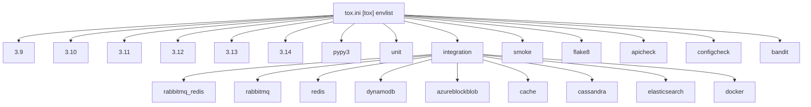
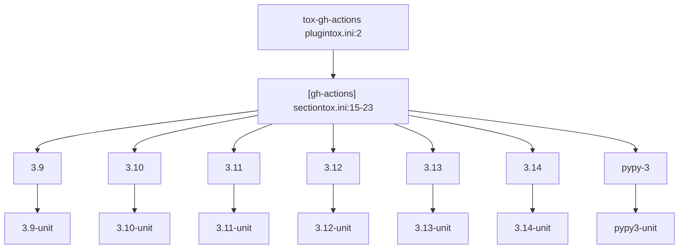
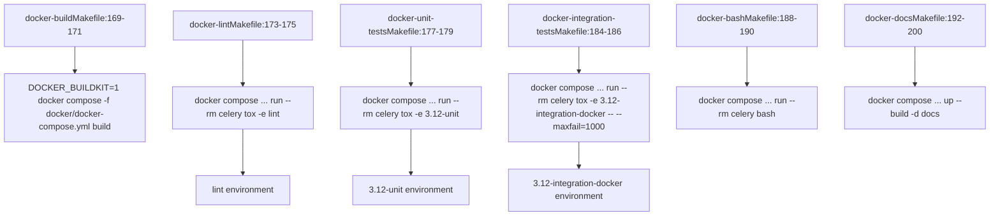

# 测试矩阵与环境 (Test Matrix and Environments)

相关源文件

-   [Makefile](https://github.com/celery/celery/blob/4d068b56/Makefile)
-   [celery/app/backends.py](https://github.com/celery/celery/blob/4d068b56/celery/app/backends.py)
-   [docs/Makefile](https://github.com/celery/celery/blob/4d068b56/docs/Makefile)
-   [docs/_ext/celerydocs.py](https://github.com/celery/celery/blob/4d068b56/docs/_ext/celerydocs.py)
-   [docs/changelog_formatter.py](https://github.com/celery/celery/blob/4d068b56/docs/changelog_formatter.py)
-   [requirements/docs.txt](https://github.com/celery/celery/blob/4d068b56/requirements/docs.txt)
-   [requirements/pkgutils.txt](https://github.com/celery/celery/blob/4d068b56/requirements/pkgutils.txt)
-   [requirements/test-integration.txt](https://github.com/celery/celery/blob/4d068b56/requirements/test-integration.txt)
-   [tox.ini](https://github.com/celery/celery/blob/4d068b56/tox.ini)

本文档描述了 Celery 的测试矩阵、tox 环境配置以及测试执行基础设施。测试矩阵定义了 Python 版本、测试类型以及代理/后端配置的组合，用于验证 Celery 在不同部署场景下的功能。

有关实际测试基础设施（pytest 设置、固件、测试组织）的信息，请参阅[测试基础设施](/celery/celery/10.1-testing-infrastructure)。有关 CI/CD 流水线配置的信息，请参阅[代码质量与文档](/celery/celery/10.4-code-quality-and-documentation)。有关代码质量工具配置的信息，请参阅[代码质量工具](#10.5)。

## 概述

Celery 使用 `tox` 来管理测试环境，并确保在多个 Python 版本和代理/后端组合中进行一致的测试。测试矩阵定义在 [tox.ini1-135](https://github.com/celery/celery/blob/4d068b56/tox.ini#L1-L135) 中，涵盖了：

-   **Python 版本**：3.9, 3.10, 3.11, 3.12, 3.13, 3.14 以及 PyPy3。
-   **测试类型**：单元测试 (unit tests)、集成测试 (integration tests)、冒烟测试 (smoke tests)。
-   **后端组合**：RabbitMQ, Redis, DynamoDB, Azure Block Blob, Cassandra, Elasticsearch 以及各种组合。
-   **质量检查**：flake8, apicheck, configcheck, bandit。

## 测试矩阵维度

测试矩阵根据 `[tox]` 部分的 `envlist` 配置中定义的三个主要维度进行构建，这些维度可以相互组合以创建特定的测试环境。

**Tox 环境列表配置**


**来源**：[tox.ini4-12](https://github.com/celery/celery/blob/4d068b56/tox.ini#L4-L12)

### 环境命名约定

Tox 环境遵循以下模式：`{python_版本}-{测试类型}-{后端配置}`

| 组件 | 值 | 示例 |
| --- | --- | --- |
| Python 版本 | `3.9`, `3.10`, `3.11`, `3.12`, `3.13`, `3.14`, `pypy3` | `3.12` |
| 测试类型 | `unit`, `integration`, `smoke` | `integration` |
| 后端配置 | `rabbitmq_redis`, `redis`, `dynamodb`, `cassandra` 等 | `redis` |

**示例**：

-   `3.12-unit`：在 Python 3.12 上运行单元测试。
-   `3.11-integration-rabbitmq_redis`：在 Python 3.11 上使用 RabbitMQ 代理和 Redis 后端运行集成测试。
-   `pypy3-smoke`：在 PyPy3 上运行冒烟测试。

**来源**：[tox.ini5-7](https://github.com/celery/celery/blob/4d068b56/tox.ini#L5-L7)

## Tox 环境配置

### 基础环境设置

所有测试环境都从 `[testenv]` 部分继承通用配置：

**Testenv 配置结构**

```mermaid
flowchart TD
    TestEnvSection["[testenv] tox.ini:25-99"]
    SitePackages["sitepackages = False"]
    Recreate["recreate = False"]
    UseDevelop["usedevelop = True"]
    TestTxt["-r{toxinidir}/requirements/test.txt"]
    PkgUtilsTxt["-r{toxinidir}/requirements/pkgutils.txt"]
    TestCIDefault["-r{toxinidir}/requirements/test-ci-default.txt"]
    DocsTxt["-r{toxinidir}/requirements/docs.txt"]
    TestIntegration["-r{toxinidir}/requirements/test-integration.txt"]
    PytestXdist["pytest-xdist>=3.5"]
    PreCommit["pre-commit"]
    BanditPkg["bandit"]
    PipExtra["PIP_EXTRA_INDEX_URL=https://celery.github.io/celery-wheelhouse/repo/simple/"]
    BotoConfig["BOTO_CONFIG=/dev/null"]
    WorkerLog["WORKER_LOGLEVEL=INFO"]
    PythonIO["PYTHONIOENCODING=UTF-8"]
    Unbuffered["PYTHONUNBUFFERED=1"]
    NoBytecode["PYTHONDONTWRITEBYTECODE=1"]
    TestBroker["TEST_BROKER="]
    TestBackend["TEST_BACKEND="]
    Py39Map["3.9: python3.9"]
    Py310Map["3.10: python3.10"]
    Py311Map["3.11: python3.11"]
    Py312Map["3.12: python3.12"]
    Py313Map["3.13: python3.13"]
    Py314Map["3.14: python3.14"]
    PyPy3Map["pypy3: pypy3"]

    TestEnvSection --> SitePackages
    TestEnvSection --> Recreate
    TestEnvSection --> UseDevelop
    TestEnvSection --> TestTxt
    TestEnvSection --> PkgUtilsTxt
    TestEnvSection --> TestCIDefault
    TestEnvSection --> DocsTxt
    TestEnvSection --> TestIntegration
    TestEnvSection --> PytestXdist
    TestEnvSection --> PreCommit
    TestEnvSection --> BanditPkg
    TestEnvSection --> PipExtra
    TestEnvSection --> BotoConfig
    TestEnvSection --> WorkerLog
    TestEnvSection --> PythonIO
    TestEnvSection --> Unbuffered
    TestEnvSection --> NoBytecode
    TestEnvSection --> TestBroker
    TestEnvSection --> TestBackend
    TestEnvSection --> Py39Map
    TestEnvSection --> Py310Map
    TestEnvSection --> Py311Map
    TestEnvSection --> Py312Map
    TestEnvSection --> Py313Map
    TestEnvSection --> Py314Map
    TestEnvSection --> PyPy3Map
```


**来源**：[tox.ini25-99](https://github.com/celery/celery/blob/4d068b56/tox.ini#L25-L99)

### Python 版本映射

`basepython` 配置将 tox 环境前缀映射到特定的 Python 可执行文件：

| 环境前缀 | Python 可执行文件 | 行号参考 |
| --- | --- | --- |
| `3.9` | `python3.9` | [tox.ini88](https://github.com/celery/celery/blob/4d068b56/tox.ini#L88-L88) |
| `3.10` | `python3.10` | [tox.ini89](https://github.com/celery/celery/blob/4d068b56/tox.ini#L89-L89) |
| `3.11` | `python3.11` | [tox.ini90](https://github.com/celery/celery/blob/4d068b56/tox.ini#L90-L90) |
| `3.12` | `python3.12` | [tox.ini91](https://github.com/celery/celery/blob/4d068b56/tox.ini#L91-L91) |
| `3.13` | `python3.13` | [tox.ini92](https://github.com/celery/celery/blob/4d068b56/tox.ini#L92-L92) |
| `3.14` | `python3.14` | [tox.ini93](https://github.com/celery/celery/blob/4d068b56/tox.ini#L93-L93) |
| `pypy3` | `pypy3` | [tox.ini94](https://github.com/celery/celery/blob/4d068b56/tox.ini#L94-L94) |
| `mypy` | `python3.13` | [tox.ini95](https://github.com/celery/celery/blob/4d068b56/tox.ini#L95-L95) |
| `lint`, `apicheck`, `linkcheck`, `configcheck`, `bandit` | `python3.13` | [tox.ini96](https://github.com/celery/celery/blob/4d068b56/tox.ini#L96-L96) |

**来源**：[tox.ini87-96](https://github.com/celery/celery/blob/4d068b56/tox.ini#L87-L96)

## 按测试类型划分的配置

### 单元测试 (Unit Tests)

单元测试使用 pytest 运行并生成覆盖率报告：

```bash
# 为单元测试执行的命令
pytest -vv --maxfail=10 --capture=no -v \
    --cov=celery --cov-report=xml \
    --junitxml=junit.xml -o junit_family=legacy \
    --cov-report term {posargs}
```
**关键特性**：

-   停止前的最大失败次数为 10 次 (`--maxfail=10`)。
-   跟踪 `celery` 包的覆盖率。
-   XML 格式和控制台终端格式的覆盖率报告。
-   用于 CI 集成的 JUnit XML 输出。
-   不捕获输出 (`--capture=no`) 以便于调试。

**依赖项**：

-   [requirements/test.txt1](https://github.com/celery/celery/blob/4d068b56/requirements/test.txt#L1-L1) - 核心测试依赖。
-   [requirements/test-ci-default.txt35-37](https://github.com/celery/celery/blob/4d068b56/requirements/test-ci-default.txt#L35-L37) - 针对 CPython 的 CI 特定依赖。
-   [requirements/docs.txt1-9](https://github.com/celery/celery/blob/4d068b56/requirements/docs.txt#L1-L9) - 文档依赖。

**来源**：[tox.ini47](https://github.com/celery/celery/blob/4d068b56/tox.ini#L47-L47) [tox.ini31-37](https://github.com/celery/celery/blob/4d068b56/tox.ini#L31-L37)

### 集成测试 (Integration Tests)

集成测试验证 Celery 与真实代理和后端实现的交互情况：

```bash
# 为集成测试执行的命令
pytest -xsvv t/integration {posargs}
```
**关键特性**：

-   在第一次失败时停止 (`-x`)。
-   详细输出 (`-svv`)。
-   测试目录：`t/integration/`。
-   通过环境变量进行环境特定的代理/后端配置。

**依赖项**：

-   基础测试依赖。
-   [requirements/test-integration.txt1-6](https://github.com/celery/celery/blob/4d068b56/requirements/test-integration.txt#L1-L6) 包含：
    -   Redis extras。
    -   Azure Block Blob extras。
    -   Auth extras。
    -   Memcache extras。
    -   用于处理不稳定测试的 pytest-rerunfailures。
    -   来自 Git 的开发版 Kombu。

**来源**：[tox.ini48](https://github.com/celery/celery/blob/4d068b56/tox.ini#L48-L48) [tox.ini39](https://github.com/celery/celery/blob/4d068b56/tox.ini#L39-L39) [requirements/test-integration.txt1-6](https://github.com/celery/celery/blob/4d068b56/requirements/test-integration.txt#L1-L6)

### 冒烟测试 (Smoke Tests)

冒烟测试是快速验证测试，可以并行运行：

```bash
# 为冒烟测试执行的命令
pytest -xsvv t/smoke --dist=loadscope \
    --reruns 5 --reruns-delay 10 {posargs}
```
**关键特性**：

-   使用 `--dist=loadscope` 并行执行（按测试作用域分发）。
-   失败时自动重试：重试 5 次，每次延迟 10 秒。
-   测试目录：`t/smoke/`。
-   并行执行需要 `pytest-xdist>=3.5`。

**来源**：[tox.ini49](https://github.com/celery/celery/blob/4d068b56/tox.ini#L49-L49) [tox.ini40](https://github.com/celery/celery/blob/4d068b56/tox.ini#L40-L40)

## 后端特定的环境变量

集成测试使用在 `[testenv]` 的 `setenv` 部分配置的 `TEST_BROKER` 和 `TEST_BACKEND` 环境变量，将测试路由到特定的代理和后端实现。

**setenv 配置映射**

```mermaid
flowchart TD
    SetenvSection["[testenv] setenv sectiontox.ini:52-87"]
    CacheBroker["TEST_BROKER=redis://"]
    CacheBackend["TEST_BACKEND=cache+pylibmc://"]
    CassandraBroker["TEST_BROKER=redis://"]
    CassandraBackend["TEST_BACKEND=cassandra://"]
    ElasticBroker["TEST_BROKER=redis://"]
    ElasticBackend["TEST_BACKEND=elasticsearch://@localhost:9200"]
    RabbitBroker["TEST_BROKER=pyamqp://"]
    RabbitBackend["TEST_BACKEND=rpc"]
    RedisBroker["TEST_BROKER=redis://"]
    RedisBackend["TEST_BACKEND=redis://"]
    RabbitRedisBroker["TEST_BROKER=pyamqp://"]
    RabbitRedisBackend["TEST_BACKEND=redis://"]
    DockerBroker["TEST_BROKER=pyamqp://rabbit:5672"]
    DockerBackend["TEST_BACKEND=redis://redis"]
    DynamoBroker["TEST_BROKER=redis://"]
    DynamoBackend["TEST_BACKEND=dynamodb://@localhost:8000"]
    DynamoAWSKey["AWS_ACCESS_KEY_ID=test_aws_key_id"]
    DynamoAWSSecret["AWS_SECRET_ACCESS_KEY=test_aws_secret_key"]
    AzureBroker["TEST_BROKER=redis://"]
    AzureBackend["TEST_BACKEND=azureblockblob://..."]

    SetenvSection --> CacheBroker
    SetenvSection --> CacheBackend
    SetenvSection --> CassandraBroker
    SetenvSection --> CassandraBackend
    SetenvSection --> ElasticBroker
    SetenvSection --> ElasticBackend
    SetenvSection --> RabbitBroker
    SetenvSection --> RabbitBackend
    SetenvSection --> RedisBroker
    SetenvSection --> RedisBackend
    SetenvSection --> RabbitRedisBroker
    SetenvSection --> RabbitRedisBackend
    SetenvSection --> DockerBroker
    SetenvSection --> DockerBackend
    SetenvSection --> DynamoBroker
    SetenvSection --> DynamoBackend
    SetenvSection --> DynamoAWSKey
    SetenvSection --> DynamoAWSSecret
    SetenvSection --> AzureBroker
    SetenvSection --> AzureBackend
```


**来源**：[tox.ini52-87](https://github.com/celery/celery/blob/4d068b56/tox.ini#L52-L87)

### 环境变量详情

| 集成环境因子 | TEST_BROKER | TEST_BACKEND | 附加变量 |
| --- | --- | --- | --- |
| `cache` | `redis://` | `cache+pylibmc://` | - |
| `cassandra` | `redis://` | `cassandra://` | - |
| `elasticsearch` | `redis://` | `elasticsearch://@localhost:9200` | - |
| `rabbitmq` | `pyamqp://` | `rpc` | - |
| `redis` | `redis://` | `redis://` | - |
| `rabbitmq_redis` | `pyamqp://` | `redis://` | - |
| `docker` | `pyamqp://rabbit:5672` | `redis://redis` | - |
| `dynamodb` | `redis://` | `dynamodb://@localhost:8000` | `AWS_ACCESS_KEY_ID=test_aws_key_id`
`AWS_SECRET_ACCESS_KEY=test_aws_secret_key` |
| `azureblockblob` | `redis://` | `azureblockblob://...` | 完整连接字符串在 [tox.ini85](https://github.com/celery/celery/blob/4d068b56/tox.ini#L85-L85) |

**来源**：[tox.ini58-85](https://github.com/celery/celery/blob/4d068b56/tox.ini#L58-L85)

### 透传环境变量

一些环境变量从宿主环境透传：

-   `AZUREBLOCKBLOB_URL` - 自定义 Azure Blob 存储端点 [tox.ini29](https://github.com/celery/celery/blob/4d068b56/tox.ini#L29-L29)。

**来源**：[tox.ini28-29](https://github.com/celery/celery/blob/4d068b56/tox.ini#L28-L29)

## 代码质量环境 (Code Quality Environments)

Celery 包含几个用于代码质量检查的 tox 环境，它们执行工具而不是运行测试：

**质量检查环境命令**

**来源**：[tox.ini101-136](https://github.com/celery/celery/blob/4d068b56/tox.ini#L101-L136)

### Flake8 环境

`flake8` 环境是隐式定义的，对代码库运行风格检查。实际的 flake8 配置位于 `setup.cfg` 或 `.flake8`（未在提供的文件中显示）。

**命令**：通过 `make flakecheck` 执行标准的 flake8 检查 [Makefile94-95](https://github.com/celery/celery/blob/4d068b56/Makefile#L94-L95)。

**来源**：[Makefile86](https://github.com/celery/celery/blob/4d068b56/Makefile#L86-L86) [Makefile94-95](https://github.com/celery/celery/blob/4d068b56/Makefile#L94-L95)

### API 检查环境

`apicheck` 环境使用自定义的 Sphinx 构建器验证 API 参考文档中是否包含了所有模块。

**命令**：

```bash
sphinx-build -j2 -b apicheck -d {envtmpdir}/doctrees docs docs/_build/apicheck
```
**配置**：

-   `PYTHONHASHSEED = 100` 以获得可重现的输出 [tox.ini106](https://github.com/celery/celery/blob/4d068b56/tox.ini#L106-L106)。
-   使用 2 个任务进行并行构建 (`-j2`)。
-   自定义 Sphinx 构建器：`sphinx_celery` 中定义的 `apicheck`。
-   在 [docs/conf.py28-43](https://github.com/celery/celery/blob/4d068b56/docs/conf.py#L28-L43) 中通过 `apicheck_ignore_modules` 配置忽略的模块。
-   需要 [requirements/docs.txt1-9](https://github.com/celery/celery/blob/4d068b56/requirements/docs.txt#L1-L9) 中的依赖项。

`apicheck` 构建器验证 `celery` 包中的所有 Python 模块是否都有相应的 API 文档条目。`apicheck_ignore_modules` 中列出的模块不参与此检查，例如：

-   `celery.__main__`
-   `celery.contrib.testing.*`
-   `celery.bin.*` 模块
-   `celery.fixups.*` 模块

**来源**：[tox.ini104-108](https://github.com/celery/celery/blob/4d068b56/tox.ini#L104-L108) [docs/conf.py28-43](https://github.com/celery/celery/blob/4d068b56/docs/conf.py#L28-L43)

### 配置检查环境

`configcheck` 环境使用自定义的 Sphinx 构建器确保所有配置设置都已记录在档，该构建器会针对 `celery.app.defaults.NAMESPACES` 进行验证。

**命令**：

```bash
sphinx-build -j2 -b configcheck -d {envtmpdir}/doctrees docs docs/_build/configcheck
```
**配置**：

-   使用 2 个任务进行并行构建。
-   自定义 Sphinx 构建器：`sphinx_celery` 中定义的 `configcheck`。
-   通过 `configcheck_project_settings()` 提取设置 [docs/conf.py90-93](https://github.com/celery/celery/blob/4d068b56/docs/conf.py#L90-L93)。
-   在 `ignored_settings` 中定义忽略的设置 [docs/conf.py54-87](https://github.com/celery/celery/blob/4d068b56/docs/conf.py#L54-L87)。
-   设置检查函数：`configcheck_should_ignore()` [docs/conf.py103-104](https://github.com/celery/celery/blob/4d068b56/docs/conf.py#L103-L104)。

该构建器调用 `configcheck_project_settings()`，后者会导入 `celery.app.defaults.NAMESPACES` 并将其展平以获取所有配置选项。`ignored_settings` 中的设置（已弃用的设置）以及带有 `deprecate_by` 属性的设置将从验证中排除。

**来源**：[tox.ini110-112](https://github.com/celery/celery/blob/4d068b56/tox.ini#L110-L112) [docs/conf.py54-104](https://github.com/celery/celery/blob/4d068b56/docs/conf.py#L54-L104)

### Bandit 环境

`bandit` 环境执行安全扫描：

**命令**：

```bash
bandit -b bandit.json -r celery/
```
**配置**：

-   配置文件：`bandit.json`。
-   递归扫描 `celery/` 目录。
-   需要 `bandit` 包。

**来源**：[tox.ini116-118](https://github.com/celery/celery/blob/4d068b56/tox.ini#L116-L118) [tox.ini44](https://github.com/celery/celery/blob/4d068b56/tox.ini#L44-L44)

### Mypy 环境

`mypy` 环境执行类型检查：

**命令**：

```bash
python -m mypy --config-file pyproject.toml
```
**配置**：

-   在 `pyproject.toml` 中配置。
-   使用 Python 3.13 [tox.ini95](https://github.com/celery/celery/blob/4d068b56/tox.ini#L95-L95)。

**来源**：[tox.ini99-100](https://github.com/celery/celery/blob/4d068b56/tox.ini#L99-L100)

### Lint 环境

`lint` 环境运行 pre-commit 钩子：

**命令**：

```bash
pre-commit {posargs:run --all-files --show-diff-on-failure}
```
**配置**：

-   默认运行所有 pre-commit 钩子。
-   失败时显示差异 (diff)。
-   需要 `pre-commit` 包。

**来源**：[tox.ini120-122](https://github.com/celery/celery/blob/4d068b56/tox.ini#L120-L122) [tox.ini43](https://github.com/celery/celery/blob/4d068b56/tox.ini#L43-L43)

### 链接检查环境

`linkcheck` 环境验证文档中的外部链接：

**命令**：

```bash
sphinx-build -j2 -b linkcheck -d {envtmpdir}/doctrees docs docs/_build/linkcheck
```
**来源**：[tox.ini112-114](https://github.com/celery/celery/blob/4d068b56/tox.ini#L112-L114)

### 清理环境 (Clean Environment)

`clean` 环境使用 bash 命令和清理工具移除测试制品和临时文件：

**命令**：

1.  **覆盖率清理** [tox.ini130](https://github.com/celery/celery/blob/4d068b56/tox.ini#L130-L130)：

```bash
bash -c 'files=$(find . -name "*.coverage*" -type f); if [ -n "$files" ]; then echo "Removed coverage file(s):"; echo "$files" | tr " " "\n"; rm $files; fi'
```
2.  **Docker 容器清理** [tox.ini131](https://github.com/celery/celery/blob/4d068b56/tox.ini#L131-L131)：

```bash
bash -c 'containers=$(docker ps -aq --filter label=creator=pytest-docker-tools); if [ -n "$containers" ]; then echo "Removed Docker container(s):"; docker rm -f $containers; fi'
```
3.  **Docker 网络清理** [tox.ini132](https://github.com/celery/celery/blob/4d068b56/tox.ini#L132-L132)：

```bash
bash -c 'networks=$(docker network ls --filter name=pytest- -q); if [ -n "$networks" ]; then echo "Removed Docker network(s):"; docker network rm $networks; fi'
```
4.  **Docker 卷清理** [tox.ini133](https://github.com/celery/celery/blob/4d068b56/tox.ini#L133-L133)：

```bash
bash -c 'volumes=$(docker volume ls --filter name=pytest- -q); if [ -n "$volumes" ]; then echo "Removed Docker volume(s):"; docker volume rm $volumes; fi'
```
5.  **Python 制品** [tox.ini134](https://github.com/celery/celery/blob/4d068b56/tox.ini#L134-L134)：

```bash
python -m cleanpy .
```
6.  **构建制品** [tox.ini135](https://github.com/celery/celery/blob/4d068b56/tox.ini#L135-L135)：

```bash
make clean
```
7.  **测试数据库** [tox.ini136](https://github.com/celery/celery/blob/4d068b56/tox.ini#L136-L136)：

```bash
rm -f test.db statefilename.db
```
**依赖项**：

-   `cleanpy` 包 [tox.ini127](https://github.com/celery/celery/blob/4d068b56/tox.ini#L127-L127)。
-   `bash`, `make`, `rm` 属于许可的可执行文件 [tox.ini128](https://github.com/celery/celery/blob/4d068b56/tox.ini#L128-L128)。

**来源**：[tox.ini126-136](https://github.com/celery/celery/blob/4d068b56/tox.ini#L126-L136)

## GitHub Actions 集成

`tox-gh-actions` 插件会自动通过 `[gh-actions]` 部分将 GitHub Actions 的 Python 版本映射到 tox 环境。

**tox-gh-actions 版本映射**


`[gh-actions]` 部分定义了映射：

```ini
[gh-actions]
python =
    3.9: 3.9-unit
    3.10: 3.10-unit
    3.11: 3.11-unit
    3.12: 3.12-unit
    3.13: 3.13-unit
    3.14: 3.14-unit
    pypy-3: pypy3-unit
```
当在 GitHub Actions 中以特定的 Python 版本运行时，`tox-gh-actions` 会从环境中读取 Python 版本并自动执行相应的 tox 环境。例如，如果 GitHub Actions 矩阵指定了 `python: "3.12"`，tox 将自动运行 `3.12-unit`。

**来源**：[tox.ini2-3](https://github.com/celery/celery/blob/4d068b56/tox.ini#L2-L3) [tox.ini15-23](https://github.com/celery/celery/blob/4d068b56/tox.ini#L15-L23)

## 在本地运行测试

### 运行所有测试

```bash
# 运行所有环境
tox

# 针对特定 Python 版本运行单元测试
tox -e 3.12-unit

# 针对 Redis 后端运行集成测试
tox -e 3.12-integration-redis

# 运行冒烟测试
tox -e 3.12-smoke
```
### 使用 Pytest 参数运行特定测试

Tox 支持使用 `--` 向 pytest 传递参数：

```bash
# 运行特定的测试文件
tox -e 3.12-unit -- t/unit/test_app.py

# 运行特定的测试函数
tox -e 3.12-unit -- t/unit/test_app.py::test_task_decorator

# 使用关键字过滤器运行
tox -e 3.12-unit -- -k "test_redis"

# 增加详细程度
tox -e 3.12-unit -- -vvv
```
**来源**：[tox.ini47-49](https://github.com/celery/celery/blob/4d068b56/tox.ini#L47-L49)

### 运行代码质量检查

```bash
# 运行所有 lint 检查
make lint

# 个别检查
tox -e flake8
tox -e apicheck
tox -e configcheck
tox -e bandit
tox -e mypy
tox -e lint
```
**来源**：[Makefile86](https://github.com/celery/celery/blob/4d068b56/Makefile#L86-L86) [tox.ini9-12](https://github.com/celery/celery/blob/4d068b56/tox.ini#L9-L12)

## 基于 Docker 的测试

Celery 支持在 Docker 容器中运行测试，以通过 Docker Compose 和 Makefile 目标提供一致的环境。

**Makefile Docker 测试目标**


**来源**：[Makefile169-200](https://github.com/celery/celery/blob/4d068b56/Makefile#L169-L200)

### Docker 测试命令

| Makefile 目标 | Docker Compose 命令 | Tox 环境 | 行号参考 |
| --- | --- | --- | --- |
| `docker-build` | `DOCKER_BUILDKIT=1 docker compose -f docker/docker-compose.yml build` | - | [Makefile169-171](https://github.com/celery/celery/blob/4d068b56/Makefile#L169-L171) |
| `docker-lint` | `docker compose ... run --rm -w /home/developer/celery celery tox -e lint` | `lint` | [Makefile173-175](https://github.com/celery/celery/blob/4d068b56/Makefile#L173-L175) |
| `docker-unit-tests` | `docker compose ... run --rm -w /home/developer/celery celery tox -e 3.12-unit -- $(filter-out $@,$(MAKECMDGOALS))` | `3.12-unit` | [Makefile177-179](https://github.com/celery/celery/blob/4d068b56/Makefile#L177-L179) |
| `docker-integration-tests` | `docker compose ... run --rm -w /home/developer/celery celery tox -e 3.12-integration-docker -- --maxfail=1000` | `3.12-integration-docker` | [Makefile184-186](https://github.com/celery/celery/blob/4d068b56/Makefile#L184-L186) |
| `docker-bash` | `docker compose ... run --rm -w /home/developer/celery celery bash` | - | [Makefile188-190](https://github.com/celery/celery/blob/4d068b56/Makefile#L188-L190) |
| `docker-docs` | `docker compose ... up --build -d docs` | - | [Makefile192-200](https://github.com/celery/celery/blob/4d068b56/Makefile#L192-L200) |

**Docker 集成环境配置**：

tox.ini 中的 `docker` 集成因子配置了与 Docker Compose 服务名称匹配的服务主机名：

```ini
docker: TEST_BROKER=pyamqp://rabbit:5672
docker: TEST_BACKEND=redis://redis
```
这些对应于 `docker/docker-compose.yml` 中定义的服务名称：

-   `rabbit` 服务：RabbitMQ 代理。
-   `redis` 服务：Redis 后端。

**集成测试注意**：`docker-integration-tests` 目标允许最多 1000 次失败 (`--maxfail=1000`)，因为 Docker 对集成测试的完整支持仍在开发中 [Makefile181-186](https://github.com/celery/celery/blob/4d068b56/Makefile#L181-L186)。

**来源**：[Makefile169-200](https://github.com/celery/celery/blob/4d068b56/Makefile#L169-L200) [tox.ini78-79](https://github.com/celery/celery/blob/4d068b56/tox.ini#L78-L79)

### Docker 测试示例

```bash
# 在 Docker 中运行特定的单元测试
make docker-unit-tests -- -k test_canvas

# 运行集成测试（允许失败）
make docker-integration-tests
```
在 Docker 中的集成测试允许最多 1000 次失败 (`--maxfail=1000`)，因为完整支持仍在开发中 [Makefile186](https://github.com/celery/celery/blob/4d068b56/Makefile#L186-L186)。

**来源**：[Makefile177-186](https://github.com/celery/celery/blob/4d068b56/Makefile#L177-L186)

## 依赖管理

测试依赖项组织在 `requirements/` 目录中，根据环境类型进行有条件加载。

**需求文件依赖关系**

```mermaid
flowchart TD
    DocsTxt["requirements/docs.txt"]
    SphinxCelery["sphinx_celery>=2.1.1"]
    Sphinx["Sphinx>=7.0.0"]
    SphinxTesting["sphinx-testing~=1.0.1"]
    SphinxClick["sphinx-click==6.0.0"]
    SQLAlchemyExtras["-r extras/sqlalchemy.txt"]
    TestTxtRef["-r test.txt"]
    MockDeps["-r deps/mock.txt"]
    AuthExtrasRef["-r extras/auth.txt"]
    SphinxAutobuildExtras["-r extras/sphinxautobuild.txt"]
    TestIntegrationTxt["requirements/test-integration.txt"]
    RedisExtras["-r extras/redis.txt"]
    AzureExtras["-r extras/azureblockblob.txt"]
    AuthExtras["-r extras/auth.txt"]
    MemcacheExtras["-r extras/memcache.txt"]
    PytestRerun["pytest-rerunfailures>=11.1.2"]
    KombuGit["git+https://github.com/celery/kombu.git"]
    TestCIDefaultTxt["requirements/test-ci-default.txtCI-specific packages"]
    TestTxt["requirements/test.txtpytest, pytest-cov, etc."]
    PkgUtilsTxt["requirements/pkgutils.txtsetuptools, wheel, tox, etc."]
    Setuptools["setuptools>=40.8.0"]
    Wheel["wheel>=0.33.1"]
    Flake8["flake8>=3.8.3"]
    Flake8Docstrings["flake8-docstrings>=1.7.0"]
    Pydocstyle["pydocstyle==6.3.0"]
    ToxPkg["tox>=3.8.4"]
    Sphinx2rst["sphinx2rst>=1.0"]
    Bumpversion["bumpversion==0.6.0"]
    Pyperclip["pyperclip==1.11.0"]

    PkgUtilsTxt --> Setuptools
    PkgUtilsTxt --> Wheel
    PkgUtilsTxt --> Flake8
    PkgUtilsTxt --> Flake8Docstrings
    PkgUtilsTxt --> Pydocstyle
    PkgUtilsTxt --> ToxPkg
    PkgUtilsTxt --> Sphinx2rst
    PkgUtilsTxt --> Bumpversion
    PkgUtilsTxt --> Pyperclip
    DocsTxt --> SphinxCelery
    DocsTxt --> Sphinx
    DocsTxt --> SphinxTesting
    DocsTxt --> SphinxClick
    DocsTxt --> SQLAlchemyExtras
    DocsTxt --> TestTxtRef
    DocsTxt --> MockDeps
    DocsTxt --> AuthExtrasRef
    DocsTxt --> SphinxAutobuildExtras
    TestIntegrationTxt --> RedisExtras
    TestIntegrationTxt --> AzureExtras
    TestIntegrationTxt --> AuthExtras
    TestIntegrationTxt --> MemcacheExtras
    TestIntegrationTxt --> PytestRerun
    TestIntegrationTxt --> KombuGit
```


**来源**：[tox.ini31-44](https://github.com/celery/celery/blob/4d068b56/tox.ini#L31-L44) [requirements/docs.txt1-9](https://github.com/celery/celery/blob/4d068b56/requirements/docs.txt#L1-L9) [requirements/pkgutils.txt1-11](https://github.com/celery/celery/blob/4d068b56/requirements/pkgutils.txt#L1-L11)

### 依赖项加载策略

依赖项根据 Python 版本和测试类型进行有条件加载：

| 条件 | 加载的依赖项 |
| --- | --- |
| 所有环境 | `requirements/test.txt`, `requirements/pkgutils.txt` |
| CPython (3.9-3.14) | `requirements/test-ci-default.txt`, `requirements/docs.txt` |
| PyPy3 | `requirements/test-ci-default.txt` |
| 集成测试 | `requirements/test-integration.txt` |
| 冒烟测试 | `pytest-xdist>=3.5` |
| 文档检查 | `requirements/docs.txt` |
| Lint 环境 | `pre-commit` |
| Bandit 环境 | `bandit` |

**来源**：[tox.ini35-44](https://github.com/celery/celery/blob/4d068b56/tox.ini#L35-L44)

### Celery Wheelhouse

测试环境为预构建的 wheel 包使用自定义的 PyPI 索引：

```bash
PIP_EXTRA_INDEX_URL=https://celery.github.io/celery-wheelhouse/repo/simple/
```
这为 CI 环境提供了经过优化的二进制包，以加快安装速度。

**来源**：[tox.ini51](https://github.com/celery/celery/blob/4d068b56/tox.ini#L51-L51)

## 环境变量参考

在所有测试环境中设置的通用环境变量：

| 变量 | 值 | 目的 |
| --- | --- | --- |
| `PIP_EXTRA_INDEX_URL` | `https://celery.github.io/celery-wheelhouse/repo/simple/` | 自定义 wheelhouse 以加快安装速度 |
| `BOTO_CONFIG` | `/dev/null` | 禁用 AWS 配置文件查找 |
| `WORKER_LOGLEVEL` | `INFO` | 设置工作者日志详细程度 |
| `PYTHONIOENCODING` | `UTF-8` | 强制使用 UTF-8 编码 |
| `PYTHONUNBUFFERED` | `1` | 禁用 Python 输出缓冲 |
| `PYTHONDONTWRITEBYTECODE` | `1` | 不创建 `.pyc` 文件 |

**来源**：[tox.ini50-56](https://github.com/celery/celery/blob/4d068b56/tox.ini#L50-L56)

## 覆盖率报告

单元测试生成多种格式的覆盖率报告：

1.  **XML 报告**：`--cov-report=xml` - 用于 CI 集成和代码覆盖率服务。
2.  **终端报告**：`--cov-report term` - 测试运行期间的即时反馈。
3.  **JUnit XML**：`--junitxml=junit.xml` - 用于 CI 测试结果报告。

覆盖率跟踪针对 `celery` 包：`--cov=celery`。

**来源**：[tox.ini47](https://github.com/celery/celery/blob/4d068b56/tox.ini#L47-L47)

## 特殊测试配置

### 带有重试机制的冒烟测试

冒烟测试使用 `pytest-rerunfailures` 来处理瞬时失败：

```bash
pytest -xsvv t/smoke --dist=loadscope --reruns 5 --reruns-delay 10
```
-   **重试次数 (Reruns)**：每个失败的测试尝试 5 次。
-   **延迟 (Delay)**：重试尝试之间延迟 10 秒。
-   **分发 (Distribution)**：按作用域分发测试以进行并行执行。

**来源**：[tox.ini49](https://github.com/celery/celery/blob/4d068b56/tox.ini#L49-L49)

### 集成测试要求

集成测试需要来自 [requirements/test-integration.txt1-6](https://github.com/celery/celery/blob/4d068b56/requirements/test-integration.txt#L1-L6) 的额外包：

-   Redis 支持：`requirements/extras/redis.txt`。
-   Azure Blob 支持：`requirements/extras/azureblockblob.txt`。
-   身份验证 extras：`requirements/extras/auth.txt`。
-   Memcache 支持：`requirements/extras/memcache.txt`。
-   重试处理：`pytest-rerunfailures>=11.1.2`。
-   开发版 Kombu：`git+https://github.com/celery/kombu.git`。

**来源**：[requirements/test-integration.txt1-6](https://github.com/celery/celery/blob/4d068b56/requirements/test-integration.txt#L1-L6)

## Makefile 集成

Makefile 提供了调用 tox 的便捷目标：

```bash
# 在所有 Python 版本上运行所有测试
make test-all

# 使用当前 Python 版本运行测试
make test

# 运行 lint 检查
make lint

# 个别检查
make apicheck
make configcheck
make flakecheck
```
Makefile 目标最终委托给 tox 或 pytest 命令。

**来源**：[Makefile141-154](https://github.com/celery/celery/blob/4d068b56/Makefile#L141-L154)
