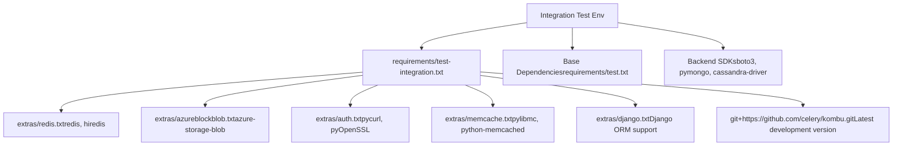
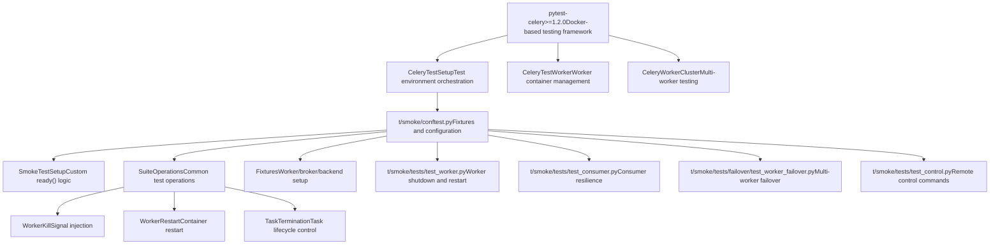
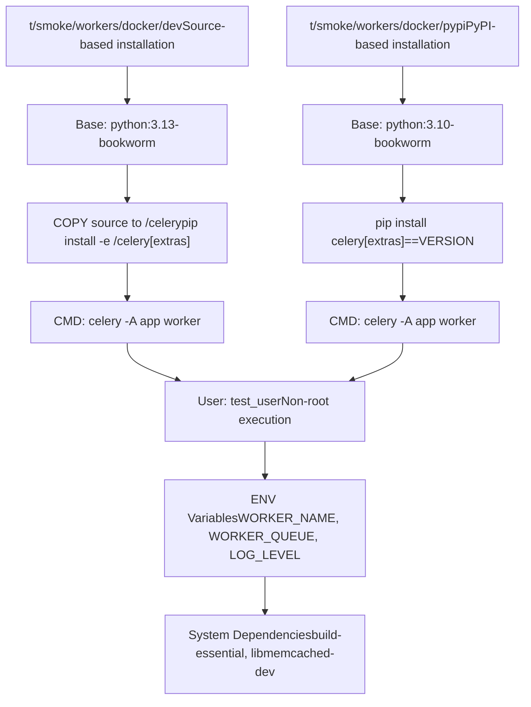
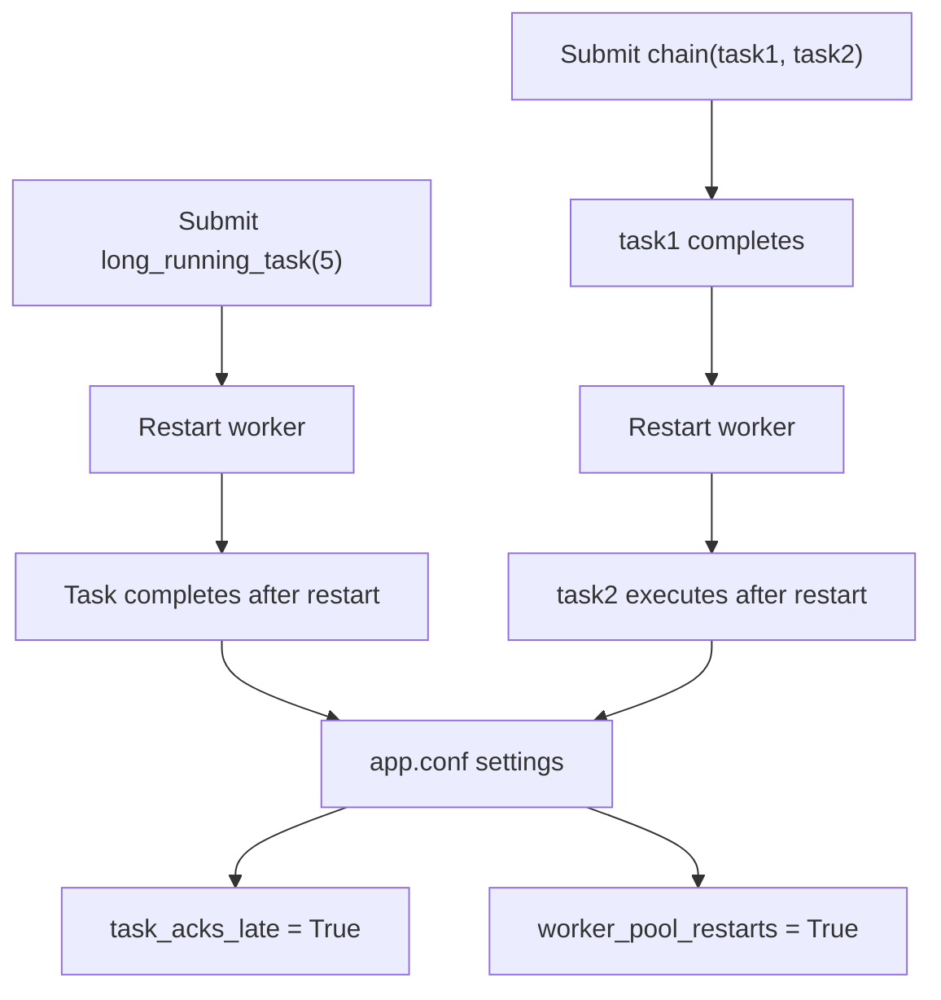
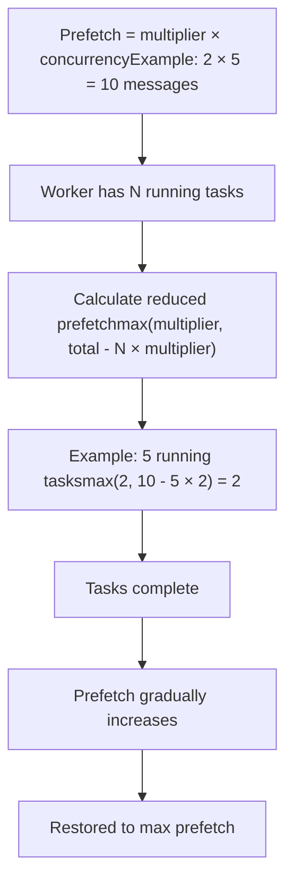
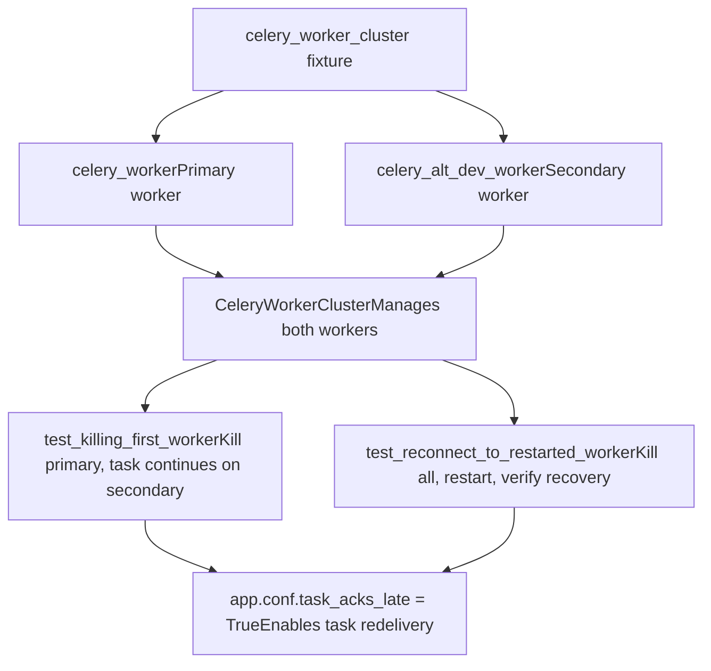
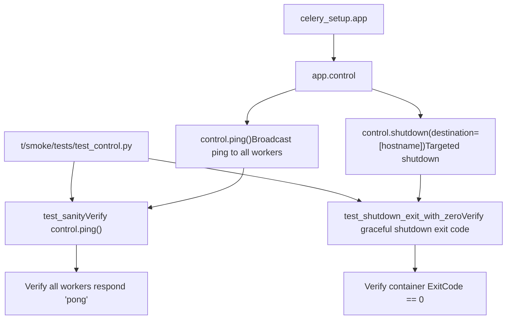

# 集成与冒烟测试 (Integration and Smoke Tests)

相关源文件

-   [Makefile](https://github.com/celery/celery/blob/4d068b56/Makefile)
-   [celery/app/backends.py](https://github.com/celery/celery/blob/4d068b56/celery/app/backends.py)
-   [docs/Makefile](https://github.com/celery/celery/blob/4d068b56/docs/Makefile)
-   [docs/\_ext/celerydocs.py](https://github.com/celery/celery/blob/4d068b56/docs/_ext/celerydocs.py)
-   [docs/changelog\_formatter.py](https://github.com/celery/celery/blob/4d068b56/docs/changelog_formatter.py)
-   [requirements/docs.txt](https://github.com/celery/celery/blob/4d068b56/requirements/docs.txt)
-   [requirements/extras/pytest.txt](https://github.com/celery/celery/blob/4d068b56/requirements/extras/pytest.txt)
-   [requirements/pkgutils.txt](https://github.com/celery/celery/blob/4d068b56/requirements/pkgutils.txt)
-   [requirements/test-integration.txt](https://github.com/celery/celery/blob/4d068b56/requirements/test-integration.txt)
-   [requirements/test.txt](https://github.com/celery/celery/blob/4d068b56/requirements/test.txt)
-   [t/smoke/conftest.py](https://github.com/celery/celery/blob/4d068b56/t/smoke/conftest.py)
-   [t/smoke/operations/\_\_init\_\_.py](https://github.com/celery/celery/blob/4d068b56/t/smoke/operations/__init__.py)
-   [t/smoke/redis.conf](https://github.com/celery/celery/blob/4d068b56/t/smoke/redis.conf)
-   [t/smoke/tasks.py](https://github.com/celery/celery/blob/4d068b56/t/smoke/tasks.py)
-   [t/smoke/tests/\_\_init\_\_.py](https://github.com/celery/celery/blob/4d068b56/t/smoke/tests/__init__.py)
-   [t/smoke/tests/failover/\_\_init\_\_.py](https://github.com/celery/celery/blob/4d068b56/t/smoke/tests/failover/__init__.py)
-   [t/smoke/tests/failover/test\_broker\_failover.py](https://github.com/celery/celery/blob/4d068b56/t/smoke/tests/failover/test_broker_failover.py)
-   [t/smoke/tests/failover/test\_worker\_failover.py](https://github.com/celery/celery/blob/4d068b56/t/smoke/tests/failover/test_worker_failover.py)
-   [t/smoke/tests/test\_consumer.py](https://github.com/celery/celery/blob/4d068b56/t/smoke/tests/test_consumer.py)
-   [t/smoke/tests/test\_control.py](https://github.com/celery/celery/blob/4d068b56/t/smoke/tests/test_control.py)
-   [t/smoke/tests/test\_worker.py](https://github.com/celery/celery/blob/4d068b56/t/smoke/tests/test_worker.py)
-   [t/smoke/workers/docker/dev](https://github.com/celery/celery/blob/4d068b56/t/smoke/workers/docker/dev)
-   [t/smoke/workers/docker/pypi](https://github.com/celery/celery/blob/4d068b56/t/smoke/workers/docker/pypi)
-   [tox.ini](https://github.com/celery/celery/blob/4d068b56/tox.ini)

## 目的与范围

本文档解释了 Celery 的集成与冒烟测试基础设施，这些基础设施针对真实的消息代理（broker）和结果后端（result backend）验证系统行为。集成测试验证与 RabbitMQ、Redis 和各种数据库后端等外部服务的正确交互。冒烟测试验证工作者在不利条件（如代理故障、信号处理和停机场景）下的弹性。

有关单元测试基础设施和固件（fixtures）的信息，请参阅[测试基础设施](/celery/celery/10.1-testing-infrastructure)。有关测试矩阵配置和 CI 执行的信息，请参阅[测试矩阵与环境](/celery/celery/10.2-test-matrix-and-environments)和[代码质量与文档](/celery/celery/10.4-code-quality-and-documentation)。

---

## 测试架构概述

测试基础设施由两组目的和执行特征不同的测试套件组成：

```mermaid
flowchart TD
    ToxIni["tox.iniTest Orchestrator"]
    UnitTests["Unit Testst/unit/"]
    IntegrationTests["Integration Testst/integration/"]
    SmokeTests["Smoke Testst/smoke/"]
    MatrixDef["9 Backend Configs× 7 Python Versions"]
    RabbitMQRedis["rabbitmq_redisAMQP + Redis"]
    RabbitMQ["rabbitmqAMQP + RPC"]
    Redis["redisRedis + Redis"]
    DynamoDB["dynamodbRedis + DynamoDB"]
    Azure["azureblockblobRedis + Azure"]
    Cache["cacheRedis + Cache"]
    Cassandra["cassandraRedis + Cassandra"]
    ES["elasticsearchRedis + Elasticsearch"]
    Docker["dockerContainerized"]
    PytestCelery["pytest-celeryFramework"]
    WorkerContainers["Worker Containerst/smoke/workers/docker/"]
    BrokerContainers["Broker ContainersRabbitMQ/Redis"]
    BackendContainers["Backend ContainersRedis"]
    DevImage["devSource Install"]
    PyPIImage["pypiPyPI Install"]
    ToxConfig["Test Environment Config"]
    TestDeps["requirements/test.txtrequirements/test-integration.txt"]
    EnvVars["Environment VariablesTEST_BROKER, TEST_BACKEND"]
    ExecCmd["Execution Commandspytest with options"]

    ToxIni --> UnitTests
    ToxIni --> IntegrationTests
    ToxIni --> SmokeTests
    IntegrationTests --> MatrixDef
    MatrixDef --> RabbitMQRedis
    MatrixDef --> RabbitMQ
    MatrixDef --> Redis
    MatrixDef --> DynamoDB
    MatrixDef --> Azure
    MatrixDef --> Cache
    MatrixDef --> Cassandra
    MatrixDef --> ES
    MatrixDef --> Docker
    SmokeTests --> PytestCelery
    PytestCelery --> WorkerContainers
    PytestCelery --> BrokerContainers
    PytestCelery --> BackendContainers
    WorkerContainers --> DevImage
    WorkerContainers --> PyPIImage
    ToxConfig --> TestDeps
    ToxConfig --> EnvVars
    ToxConfig --> ExecCmd
    IntegrationTests --> ToxConfig
    SmokeTests --> ToxConfig
```


**集成测试** 验证 Celery 与真实外部服务的交互，测试协议级的通信和数据持久化。

**冒烟测试** 验证工作者在崩溃、信号中断和网络故障等不利条件下的弹性和运行时行为。

来源：[tox.ini1-137](https://github.com/celery/celery/blob/4d068b56/tox.ini#L1-L137) [requirements/test.txt1-20](https://github.com/celery/celery/blob/4d068b56/requirements/test.txt#L1-L20) [requirements/test-integration.txt1-8](https://github.com/celery/celery/blob/4d068b56/requirements/test-integration.txt#L1-L8)

---

## 集成测试

### 配置与执行

集成测试针对真实的消息代理和结果后端执行。测试矩阵在 `tox.ini` 中定义，创建了 63 个测试环境（9 个后端配置 × 7 个 Python 版本）。

```mermaid
flowchart TD
    EnvList["envlistintegration-{...}"]
    SetEnv["setenv SectionBackend-specific vars"]
    RabbitMQRedis["rabbitmq_redisTEST_BROKER=pyamqp://TEST_BACKEND=redis://"]
    RabbitMQ["rabbitmqTEST_BROKER=pyamqp://TEST_BACKEND=rpc"]
    Redis["redisTEST_BROKER=redis://TEST_BACKEND=redis://"]
    Cassandra["cassandraTEST_BROKER=redis://TEST_BACKEND=cassandra://"]
    DynamoDB["dynamodbTEST_BROKER=redis://TEST_BACKEND=dynamodb://@localhost:8000"]
    Azure["azureblockblobTEST_BACKEND=azureblockblob://..."]
    Cache["cacheTEST_BACKEND=cache+pylibmc://"]
    ES["elasticsearchTEST_BACKEND=elasticsearch://@localhost:9200"]
    Docker["dockerTEST_BROKER=pyamqp://rabbit:5672TEST_BACKEND=redis://redis"]
    Command["pytest -xsvv t/integration"]
    TestFiles["t/integration/Test Modules"]
    Fixtures["Backend/BrokerFixtures"]

    EnvList --> SetEnv
    SetEnv --> RabbitMQRedis
    SetEnv --> RabbitMQ
    SetEnv --> Redis
    SetEnv --> Cassandra
    SetEnv --> DynamoDB
    SetEnv --> Azure
    SetEnv --> Cache
    SetEnv --> ES
    SetEnv --> Docker
    Command --> TestFiles
    Command --> Fixtures
    EnvList --> Command
```


每个集成测试环境都会设置 `TEST_BROKER` 和 `TEST_BACKEND` 环境变量，用于配置要使用的服务。测试会读取这些变量以构建适当的连接 URL。

| 后端配置 | 代理 | 后端 | 用例 |
| --- | --- | --- | --- |
| `rabbitmq_redis` | AMQP | Redis | 类似生产环境的设置 |
| `rabbitmq` | AMQP | RPC | 零持久化测试 |
| `redis` | Redis | Redis | 仅 Redis 的部署 |
| `dynamodb` | Redis | DynamoDB | AWS 部署 |
| `azureblockblob` | Redis | Azure Blob | Azure 部署 |
| `cache` | Redis | Memcached | 基于缓存的结果 |
| `cassandra` | Redis | Cassandra | 高吞吐量后端 |
| `elasticsearch` | Redis | Elasticsearch | 搜索集成的结果 |
| `docker` | RabbitMQ (容器) | Redis (容器) | 隔离的容器化测试 |

来源：[tox.ini6-7](https://github.com/celery/celery/blob/4d068b56/tox.ini#L6-L7) [tox.ini52-88](https://github.com/celery/celery/blob/4d068b56/tox.ini#L52-L88)

### 依赖项与 Extras

集成测试需要为每个被测试的后端安装额外的依赖项：


当 tox 检测到环境名称中的 `integration` 因子时，会安装集成测试依赖项：

```ini
deps=
    integration: -r{toxinidir}/requirements/test-integration.txt
```
来源：[tox.ini39](https://github.com/celery/celery/blob/4d068b56/tox.ini#L39-L39) [requirements/test-integration.txt1-8](https://github.com/celery/celery/blob/4d068b56/requirements/test-integration.txt#L1-L8)

### 运行集成测试

集成测试通过 tox 使用以下命令模式执行：

```bash
# 针对特定的 Python 版本运行所有集成测试
tox -e 3.12-integration-redis

# 运行特定的后端配置
tox -e 3.12-integration-rabbitmq_redis

# 使用自定义选项运行
tox -e 3.12-integration-dynamodb -- -v -k test_name
```
`tox.ini` 中的测试命令为：

```bash
integration: pytest -xsvv t/integration {posargs}
```
`-xsvv` 标志提供：

-   `-x`：在第一次失败时停止。
-   `-s`：不捕获输出（显示打印语句）。
-   `-vv`：非常详细的输出。

来源：[tox.ini50](https://github.com/celery/celery/blob/4d068b56/tox.ini#L50-L50)

---

## 冒烟测试 (Smoke Tests)

### 架构与目的

冒烟测试验证工作者的弹性。与验证协议正确性的集成测试不同，冒烟测试验证操作行为，如优雅停机、信号处理、故障转移以及从代理故障中恢复。


`SmokeTestSetup` 类定制了就绪检查（ready check），以跳过 ping 和 control 检查，仅依赖于 Docker 容器状态：

```python
def ready(self, *args, **kwargs) -> bool:
    return super().ready(
        ping=False,
        control=False,
        docker=True,
    )
```
来源：[t/smoke/conftest.py20-32](https://github.com/celery/celery/blob/4d068b56/t/smoke/conftest.py#L20-L32) [requirements/test.txt2](https://github.com/celery/celery/blob/4d068b56/requirements/test.txt#L2-L2)

### Docker 工作者镜像

冒烟测试使用容器化的工作者，以实现对进程生命周期、信号和崩溃的真实测试。提供了两个 Dockerfile 模板：


两个镜像都包含：

-   用于安全测试的非 root 用户 (`test_user`)。
-   用于编译的系统依赖项 (libmemcached-dev, libffi-dev)。
-   用于配置工作者名称和队列的环境变量。
-   针对 Redis、memcache、pydantic 和 SQS 的 extras。

来源：[t/smoke/workers/docker/dev1-52](https://github.com/celery/celery/blob/4d068b56/t/smoke/workers/docker/dev#L1-L52) [t/smoke/workers/docker/pypi1-52](https://github.com/celery/celery/blob/4d068b56/t/smoke/workers/docker/pypi#L1-L52)

### 测试执行与重试

冒烟测试在执行时带有重试逻辑和并行执行：

```bash
smoke: pytest -xsvv t/smoke --dist=loadscope --reruns 5 --reruns-delay 10 {posargs}
```
| 选项 | 目的 |
| --- | --- |
| `--dist=loadscope` | 按作用域（类/模块）在 CPU 核心间分发测试 |
| `--reruns 5` | 对失败的测试最多重试 5 次 |
| `--reruns-delay 10` | 重试之间等待 10 秒 |

这种配置考虑到了由于 Docker 容器启动延迟或网络竞态条件而可能偶尔失败的时间敏感型测试。

来源：[tox.ini51](https://github.com/celery/celery/blob/4d068b56/tox.ini#L51-L51) [tox.ini40](https://github.com/celery/celery/blob/4d068b56/tox.ini#L40-L40)

---

## 工作者弹性测试 (Worker Resilience Tests)

### 停机测试 (Shutdown Tests)

工作者停机测试验证了[工作者生命周期与停机](/celery/celery/5.2-worker-lifecycle-and-shutdown)中记录的三级停机机制（温和、软性、冷）。

> **[Mermaid sequence]**
> *(图表结构无法解析)*

测试类 `test_worker_shutdown` 验证了不同的停机场景：

| 测试方法 | 信号 | 预期行为 |
| --- | --- | --- |
| `test_warm_shutdown` | SIGTERM | 等待任务完成 |
| `test_cold_shutdown` | SIGQUIT | 立即终止 |
| `test_hard_shutdown_from_warm` | SIGTERM → SIGQUIT → SIGQUIT | 升级为硬终止 |
| `test_hard_shutdown_from_cold` | SIGQUIT → SIGQUIT | 在冷关闭后硬终止 |

每个测试都使用了来自 `SuiteOperations` 的助手方法：

-   `self.kill_worker(worker, WorkerKill.Method.SIGTERM)` - 向容器发送信号。
-   `worker.assert_log_exists("message")` - 验证日志消息。
-   `assert_container_exited(worker)` - 等待容器退出。

来源：[t/smoke/tests/test\_worker.py66-144](https://github.com/celery/celery/blob/4d068b56/t/smoke/tests/test_worker.py#L66-L144) [t/smoke/conftest.py35-49](https://github.com/celery/celery/blob/4d068b56/t/smoke/conftest.py#L35-L49)

### 重启测试 (Restart Tests)

工作者重启测试验证了当配置了 `task_acks_late=True` 时，任务能够在工作者重启后继续存在：


重启测试固件为工作者配置了弹性行为：

```python
@pytest.fixture
def default_worker_app(self, default_worker_app: Celery) -> Celery:
    app = default_worker_app
    app.conf.worker_pool_restarts = True
    app.conf.task_acks_late = True
    return app
```
重启方法是参数化的：

```python
@pytest.mark.parametrize("method", list(WorkerRestart.Method))
```
来源：[t/smoke/tests/test\_worker.py28-64](https://github.com/celery/celery/blob/4d068b56/t/smoke/tests/test_worker.py#L28-L64)

### 带有超时的软停机 (Soft Shutdown with Timeout)

`worker_soft_shutdown_timeout` 配置实现了有时间限制的优雅停机：

> **[Mermaid sequence]**
> *(图表结构无法解析)*

测试场景：

| 测试 | 任务时长 | 超时时间 | 预期结果 |
| --- | --- | --- | --- |
| `test_soft_shutdown` | 5s | 10s | 任务完成 |
| `test_task_completes_during_soft_shutdown` | 5s | 10s | 任务完成 |
| `test_hard_shutdown_from_soft` | 420s | 10s | 多次 SIGQUIT → 硬终止 |

来源：[t/smoke/tests/test\_worker.py178-236](https://github.com/celery/celery/blob/4d068b56/t/smoke/tests/test_worker.py#L178-L236)

---

## 消费者弹性测试 (Consumer Resilience Tests)

### 预取计数削减 (Prefetch Count Reduction)

`worker_enable_prefetch_count_reduction` 特性可防止在代理重启时过度获取任务：


测试验证日志消息：

```python
expected_prefetch_reduce_message = (
    f"Temporarily reducing the prefetch count to {expected_reduced_prefetch} "
    f"to avoid over-fetching since {expected_running_tasks_count} tasks are currently being processed."
)
celery_setup.worker.assert_log_exists(expected_prefetch_reduce_message)
```
来源：[t/smoke/tests/test\_consumer.py32-76](https://github.com/celery/celery/blob/4d068b56/t/smoke/tests/test_consumer.py#L32-L76)

### 代理重启恢复 (Broker Restart Recovery)

测试验证了工作者能够从彻底的代理故障中恢复：

> **[Mermaid sequence]**
> *(图表结构无法解析)*

测试会等待特定的重试日志消息：

```python
celery_setup.broker.kill()
celery_setup.worker.wait_for_log("Trying again in 8.00 seconds... (4/100)")
celery_setup.broker.restart()
```
来源：[t/smoke/tests/test\_consumer.py120-148](https://github.com/celery/celery/blob/4d068b56/t/smoke/tests/test_consumer.py#L120-L148)

### 可见性超时重置 (Visibility Timeout Reset)

对于支持可见性超时（visibility timeout）的代理（如 Redis, SQS），测试验证了未确认的消息在停机时会被恢复：

> **[Mermaid sequence]**
> *(图表结构无法解析)*

测试配置设置了较高的可见性超时，以防止自动重新交付：

```python
app.conf.visibility_timeout = 3600  # 1 小时
app.conf.broker_transport_options = {
    "visibility_timeout": app.conf.visibility_timeout,
    "polling_interval": 1,
}
```
来源：[t/smoke/tests/test\_worker.py318-408](https://github.com/celery/celery/blob/4d068b56/t/smoke/tests/test_worker.py#L318-L408)

---

## 多工作者故障转移测试 (Multi-Worker Failover Tests)

### 工作者集群配置

故障转移测试使用 `CeleryWorkerCluster` 来管理多个工作者：


集群固件负责创建和销毁多个工作者：

```python
@pytest.fixture
def celery_worker_cluster(
    celery_worker: CeleryTestWorker,
    celery_alt_dev_worker: CeleryTestWorker,
) -> CeleryWorkerCluster:
    cluster = CeleryWorkerCluster(celery_worker, celery_alt_dev_worker)
    yield cluster
    cluster.teardown()
```
来源：[t/smoke/tests/failover/test\_worker\_failover.py11-19](https://github.com/celery/celery/blob/4d068b56/t/smoke/tests/failover/test_worker_failover.py#L11-L19)

### 故障转移测试执行

> **[Mermaid sequence]**
> *(图表结构无法解析)*

两个工作者共享同一个队列，当一个工作者变得不可用时，允许任务转移到另一个工作者上运行。

来源：[t/smoke/tests/failover/test\_worker\_failover.py22-56](https://github.com/celery/celery/blob/4d068b56/t/smoke/tests/failover/test_worker_failover.py#L22-L56)

---

## 远程控制测试 (Remote Control Tests)

远程控制测试验证了基于广播的命令：


ping 测试验证了来自所有工作者的响应：

```python
r = celery_setup.app.control.ping()
assert all(
    [
        all([res["ok"] == "pong" for _, res in response.items()])
        for response in r
    ]
)
```
停机测试验证了进程的干净退出：

```python
celery_setup.app.control.shutdown(destination=[celery_setup.worker.hostname()])
while celery_setup.worker.container.status != "exited":
    celery_setup.worker.container.reload()
assert celery_setup.worker.container.attrs["State"]["ExitCode"] == 0
```
来源：[t/smoke/tests/test\_control.py1-19](https://github.com/celery/celery/blob/4d068b56/t/smoke/tests/test_control.py#L1-L19)

---

## 自定义固件 (Fixtures) 与配置

### SmokeTestSetup 定制

`SmokeTestSetup` 类覆盖了就绪检查，使其对冒烟测试更加宽松：

```python
class SmokeTestSetup(CeleryTestSetup):
    def ready(self, *args, **kwargs) -> bool:
        # 强制为 False, False, True
        return super().ready(
            ping=False,     # 跳过 ping 检查
            control=False,  # 跳过 control 检查
            docker=True,    # 仅验证 Docker 状态
        )
```
这是必要的，因为冒烟测试经常测试 ping/control 暂时不可用的场景。

来源：[t/smoke/conftest.py20-32](https://github.com/celery/celery/blob/4d068b56/t/smoke/conftest.py#L20-L32)

### 工作者任务注册

所有集成和冒烟测试任务都会自动在工作者容器中注册：

```python
@pytest.fixture
def default_worker_tasks(default_worker_tasks: set) -> set:
    from t.integration import tasks as integration_tests_tasks
    from t.smoke import tasks as smoke_tests_tasks

    default_worker_tasks.add(integration_tests_tasks)
    default_worker_tasks.add(smoke_tests_tasks)
    return default_worker_tasks
```
这允许冒烟测试使用来自这两个测试套件的任务。

来源：[t/smoke/conftest.py51-59](https://github.com/celery/celery/blob/4d068b56/t/smoke/conftest.py#L51-L59)

### Redis 容器配置

为需要 Redis 的集成测试任务配置了专门的 Redis 容器：

```python
redis_test_container: RedisContainer = container(
    image="{redis_image.id}",
    ports=REDIS_PORTS,
    environment=REDIS_ENV,
    network="{default_pytest_celery_network.name}",
    wrapper_class=RedisContainer,
    timeout=REDIS_CONTAINER_TIMEOUT,
    command=redis_command,
    volumes={
        os.path.abspath("t/smoke/redis.conf"): {
            "bind": "/usr/local/etc/redis/redis.conf",
            "mode": "ro",
        }
    },
)
```
Redis 配置文件禁用了持久化以加快测试速度：

```conf
save ""           # 禁用 RDB 快照
appendonly no     # 禁用 AOF
```
来源：[t/smoke/conftest.py66-84](https://github.com/celery/celery/blob/4d068b56/t/smoke/conftest.py#L66-L84) [t/smoke/redis.conf1-7](https://github.com/celery/celery/blob/4d068b56/t/smoke/redis.conf#L1-L7)

### 环境变量传播

测试固件确保了 Redis 连接详情在测试和工作者上下文中都可用：

```python
@pytest.fixture(autouse=True)
def set_redis_test_container(redis_test_container: RedisContainer):
    # 用于测试环境
    os.environ["REDIS_HOST"] = "localhost"
    os.environ["REDIS_PORT"] = str(redis_test_container.port)

@pytest.fixture
def default_worker_env(default_worker_env: dict, redis_test_container: RedisContainer) -> dict:
    # 用于工作者环境
    default_worker_env.update({
        "REDIS_HOST": redis_test_container.hostname,
        "REDIS_PORT": 6379,
    })
    return default_worker_env
```
这确保了任务在工作者容器内执行时能够连接到 Redis。

来源：[t/smoke/conftest.py87-106](https://github.com/celery/celery/blob/4d068b56/t/smoke/conftest.py#L87-L106)

---

## 在本地运行测试

### 前提条件

确保已安装并正在运行 Docker。集成测试可能需要特定的服务：

```bash
# 启动集成测试所需的服务器
docker run -d -p 5672:5672 rabbitmq:3-management
docker run -d -p 6379:6379 redis:7-alpine
docker run -d -p 9042:9042 cassandra:4
docker run -d -p 8000:8000 amazon/dynamodb-local
```
### 执行集成测试

```bash
# 使用默认后端运行所有集成测试
tox -e 3.12-integration-redis

# 运行特定的集成测试
tox -e 3.12-integration-rabbitmq_redis -- -k test_task_name

# 运行并生成覆盖率报告
tox -e 3.12-integration-redis -- --cov=celery --cov-report=html
```
### 执行冒烟测试

```bash
# 运行所有冒烟测试
tox -e 3.12-smoke

# 运行特定的冒烟测试套件
tox -e 3.12-smoke -- t/smoke/tests/test_worker.py

# 运行详细输出
tox -e 3.12-smoke -- -vvv

# 跳过重试以获得快速反馈
tox -e 3.12-smoke -- --reruns 0
```
### 调试失败的测试

使用 pytest 选项进行调试：

```bash
# 在第一次失败时停止并进入调试器
tox -e 3.12-smoke -- -x --pdb

# 显示完整输出
tox -e 3.12-smoke -- -s

# 仅运行上次运行中失败的测试
tox -e 3.12-smoke -- --lf

# 在堆栈跟踪中显示局部变量
tox -e 3.12-smoke -- -l
```
来源：[tox.ini46-51](https://github.com/celery/celery/blob/4d068b56/tox.ini#L46-L51)

---

## 测试矩阵摘要

完整的测试矩阵在 Python 版本和后端配置上提供了全面的覆盖：

| 环境类型 | Python 版本 | 配置项 | 环境总数 |
| --- | --- | --- | --- |
| 单元测试 | 7 (3.9-3.14, pypy3) | 1 | 7 |
| 集成测试 | 7 | 9 种后端 | 63 |
| 冒烟测试 | 7 | 1 | 7 |
| 质量检查 | 1 (3.13) | 4 (flake8, mypy, bandit 等) | 4 |
| **总计** |  |  | **81** |

集成测试矩阵确保 Celery 能够与以下组件正确配合：

-   **消息代理 (Message Brokers)**：RabbitMQ (AMQP), Redis, SQS。
-   **结果后端 (Result Backends)**：RPC, Redis, DynamoDB, Azure Blob Storage, Cassandra, Elasticsearch, Memcached。
-   **Python 版本**：3.9, 3.10, 3.11, 3.12, 3.13, 3.14, PyPy3。

这一庞大的测试矩阵为 Celery 在各种部署场景下的可靠性提供了信心。

来源：[tox.ini4-7](https://github.com/celery/celery/blob/4d068b56/tox.ini#L4-L7)
