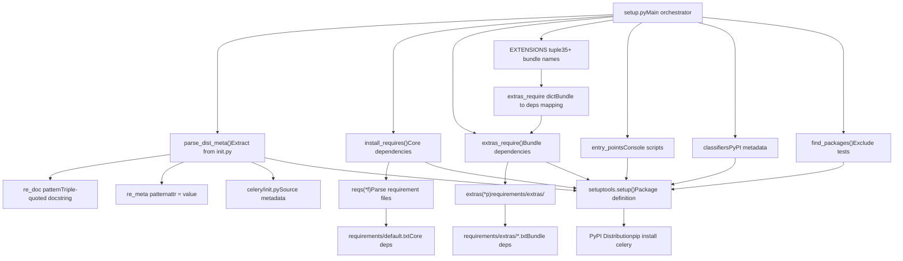
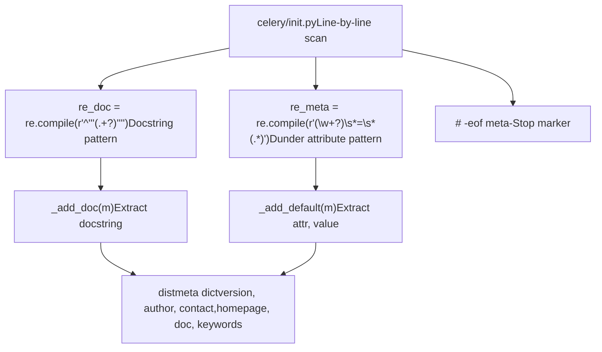
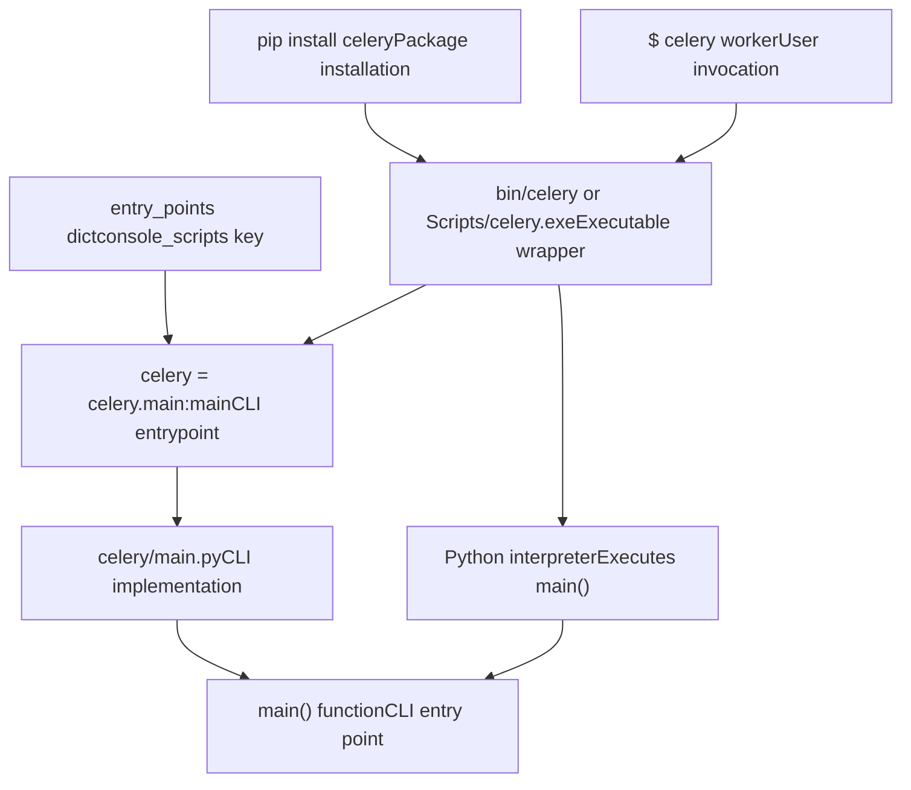

# 包结构 (Package Structure)

相关源文件

-   [docs/includes/installation.txt](https://github.com/celery/celery/blob/4d068b56/docs/includes/installation.txt)
-   [requirements/default.txt](https://github.com/celery/celery/blob/4d068b56/requirements/default.txt)
-   [setup.cfg](https://github.com/celery/celery/blob/4d068b56/setup.cfg)
-   [setup.py](https://github.com/celery/celery/blob/4d068b56/setup.py)

本文档解释了 Celery 如何作为 Python 包进行打包和分发。它涵盖了 `setup.py` 结构、从源文件中提取元数据、依赖解析、入口点（entry point）注册以及 setuptools 集成。有关特定依赖项和扩展捆绑包（extension bundles）的信息，请参阅[依赖与 Extras](/celery/celery/11.2-dependencies-and-extras)。有关版本管理和发布流程，请参阅[版本管理与发布](/celery/celery/11.3-version-management-and-release)。

---

## 概述

Celery 包的分发系统在 [setup.py1-183](https://github.com/celery/celery/blob/4d068b56/setup.py#L1-L183) 中定义，该文件负责编排元数据提取、依赖管理和包配置。安装系统支持：

-   从源代码中**动态提取元数据**。
-   所有安装都需要的**核心依赖项**。
-   **35 个以上可选扩展捆绑包**，用于代理、后端和并发模型等功能。
-   用于 CLI 的**控制台脚本入口点**。
-   **Python 版本约束**和平台元数据。

---

## Setup.py 架构

`setup.py` 文件遵循功能组合模式，将关注点分离到构建包配置的不同函数中。

**Setup.py 组件流**


**来源：** [setup.py1-183](https://github.com/celery/celery/blob/4d068b56/setup.py#L1-L183)

---

## 元数据提取系统

Celery 使用 `parse_dist_meta()` 函数从源代码中动态提取包元数据，从而避免了 `setup.py` 和包的 `__init__.py` 之间的数据冗余。

**元数据提取过程**


[setup.py50-76](https://github.com/celery/celery/blob/4d068b56/setup.py#L50-L76) 中的提取过程：

| 步骤 | 操作 |
| --- | --- |
| 1. 打开 | 打开 `celery/__init__.py` 进行读取 |
| 2. 模式匹配 | 对每一行应用 `re_doc` 和 `re_meta` 正则表达式模式 |
| 3. 处理程序分发 | 根据匹配结果调用 `_add_doc()` 或 `_add_default()` |
| 4. 停止条件 | 在 `# -eof meta-` 标记处中断 |
| 5. 返回 | 返回包含提取值的 `distmeta` 字典 |

这些模式提取的内容包括：

-   **`__version__`** - 包版本字符串
-   **`__author__`** - 作者姓名
-   **`__contact__`** - 联系邮箱
-   **`__homepage__`** - 项目 URL
-   **`__doc__`** - 来自模块 docstring 的包描述
-   **`__keywords__`** - PyPI 的搜索关键词

**来源：** [setup.py50-76](https://github.com/celery/celery/blob/4d068b56/setup.py#L50-L76)

---

## 需求系统 (Requirements System)

需求系统提供了一种分层的方法来解析来自 `requirements/` 目录的依赖文件。

**需求函数链**

```mermaid
flowchart TD
    InstallReqs["install_requires()Returns core deps"]
    ExtrasReqFunc["extras_require()Returns bundle map"]
    ReqsFunc["reqs(*f)Parse arbitrary requirement file"]
    ExtrasFunc["extras(*p)Parse extras/ subdir"]
    PrivReqs["_reqs(*f)Read and split file"]
    StripComments["_strip_comments(l)Remove # comments"]
    PipReq["_pip_requirement(req)Handle -r includes"]
    DefaultTxt["requirements/default.txtbilliard, kombu, vine, click"]
    ExtrasDir["requirements/extras/redis.txt, msgpack.txt, etc."]

    InstallReqs --> ReqsFunc
    ExtrasReqFunc --> ExtrasFunc
    ReqsFunc --> PrivReqs
    ExtrasFunc --> ReqsFunc
    PrivReqs --> StripComments
    PrivReqs --> PipReq
    ReqsFunc --> DefaultTxt
    ExtrasFunc --> ExtrasDir
```


### 核心函数

**`reqs(*f)`** [setup.py100-109](https://github.com/celery/celery/blob/4d068b56/setup.py#L100-L109) - 解析需求文件的主入口点：

```python
# 用法示例：
reqs('default.txt')          # 解析 requirements/default.txt
reqs('extras', 'redis.txt')  # 解析 requirements/extras/redis.txt
```
**`_pip_requirement(req)`** [setup.py85-89](https://github.com/celery/celery/blob/4d068b56/setup.py#L85-L89) - 处理递归包含：

-   处理 `-r path/to/file.txt` 语法。
-   递归加载引用的需求文件。
-   返回扁平化的需求列表。

**`extras(*p)`** [setup.py112-114](https://github.com/celery/celery/blob/4d068b56/setup.py#L112-L114) - 便捷包装器：

-   自动加上 `'extras'` 目录前缀。
-   用于所有扩展捆绑包的依赖项。

### 需求文件处理

| 函数 | 行号范围 | 用途 |
| --- | --- | --- |
| `_strip_comments()` | [setup.py81-82](https://github.com/celery/celery/blob/4d068b56/setup.py#L81-L82) | 从需求行中移除内联注释 |
| `_pip_requirement()` | [setup.py85-89](https://github.com/celery/celery/blob/4d068b56/setup.py#L85-L89) | 处理 `-r` 递归包含 |
| `_reqs()` | [setup.py92-97](https://github.com/celery/celery/blob/4d068b56/setup.py#L92-L97) | 读取文件、去除注释、处理包含 |
| `reqs()` | [setup.py100-109](https://github.com/celery/celery/blob/4d068b56/setup.py#L100-L109) | 展平嵌套的需求列表 |
| `extras()` | [setup.py112-114](https://github.com/celery/celery/blob/4d068b56/setup.py#L112-L114) | 解析 `requirements/extras/` 中的文件 |
| `install_requires()` | [setup.py117-119](https://github.com/celery/celery/blob/4d068b56/setup.py#L117-L119) | 返回核心依赖项 |
| `extras_require()` | [setup.py122-124](https://github.com/celery/celery/blob/4d068b56/setup.py#L122-L124) | 构建捆绑包到依赖项的映射 |

**来源：** [setup.py78-124](https://github.com/celery/celery/blob/4d068b56/setup.py#L78-L124) [requirements/default.txt1-11](https://github.com/celery/celery/blob/4d068b56/requirements/default.txt#L1-L11)

---

## 扩展捆绑包 (Extension Bundles)

Celery 通过 `EXTENSIONS` 元组 [setup.py12-46](https://github.com/celery/celery/blob/4d068b56/setup.py#L12-L46) 定义了 35 个以上的可选扩展捆绑包：

**捆绑包分类**


### 捆绑包到依赖项的映射

`extras_require()` 函数 [setup.py122-124](https://github.com/celery/celery/blob/4d068b56/setup.py#L122-L124) 创建了一个映射字典：

```python
extras_require = {x: extras(x + '.txt') for x in EXTENSIONS}
# 结果示例:
# {
#     'redis': ['redis>=4.5.2,!=4.5.5,<6.0.0'],
#     'msgpack': ['msgpack'],
#     'cassandra': ['cassandra-driver>=3.25.0,<4'],
#     ...
# }
```
每个捆绑包名称对应 `requirements/extras/{bundle}.txt` 中的一个文件，该文件列出了必要的 pip 包。

**安装语法：**

```bash
pip install celery[redis,msgpack]          # 安装多个捆绑包
pip install celery[librabbitmq,auth]        # 组合代理和安全包
```
**来源：** [setup.py12-46](https://github.com/celery/celery/blob/4d068b56/setup.py#L12-L46) [setup.py122-124](https://github.com/celery/celery/blob/4d068b56/setup.py#L122-L124) [docs/includes/installation.txt18-124](https://github.com/celery/celery/blob/4d068b56/docs/includes/installation.txt#L18-L124)

---

## 入口点 (Entry Points)

入口点定义了在包安装时创建的命令行可执行文件。

**入口点配置**


[setup.py154-158](https://github.com/celery/celery/blob/4d068b56/setup.py#L154-L158) 中的入口点定义：

```python
entry_points={
    'console_scripts': [
        'celery = celery.__main__:main',
    ]
}
```
这创建了一个 `celery` 可执行文件，其：

1.  **导入路径**：`celery.__main__`
2.  **函数调用**：`main()`
3.  **可执行文件位置**：
    -   Unix/Linux: `<venv>/bin/celery`
    -   Windows: `<venv>/Scripts/celery.exe`

当用户运行 `celery worker` 或任何其他子命令时，包装脚本会导入 `celery.__main__` 并调用 `main()`，从而初始化 CLI 框架。有关 CLI 实现的详情，请参阅 [CLI 架构](/celery/celery/9.1-cli-architecture)。

**来源：** [setup.py154-158](https://github.com/celery/celery/blob/4d068b56/setup.py#L154-L158)

---

## Setuptools 集成

`setuptools.setup()` 调用 [setup.py137-182](https://github.com/celery/celery/blob/4d068b56/setup.py#L137-L182) 将所有组件集成到包定义中。

**Setup 调用参数**

| 参数 | 来源 | 描述 |
| --- | --- | --- |
| `name` | `NAME` 变量 | 包名称：`'celery'` |
| `packages` | `find_packages()` | 自动发现包，排除测试代码 |
| `version` | `meta['version']` | 来自 `parse_dist_meta()` |
| `description` | `meta['doc']` | 来自模块 docstring 的简短描述 |
| `long_description` | `long_description()` | 来自 README.rst 的完整描述 |
| `keywords` | `meta['keywords']` | PyPI 搜索关键词 |
| `author` | `meta['author']` | 来自元数据的作者姓名 |
| `author_email` | `meta['contact']` | 来自元数据的联系邮箱 |
| `url` | `meta['homepage']` | 项目主页 URL |
| `license` | `'BSD-3-Clause'` | SPDX 许可证标识符 |
| `platforms` | `['any']` | 平台兼容性 |
| `install_requires` | `install_requires()` | 来自 default.txt 的核心依赖项 |
| `python_requires` | `">=3.9"` | 最低 Python 版本要求 |
| `tests_require` | `reqs('test.txt')` | 测试相关的依赖项 |
| `extras_require` | `extras_require()` | 可选的捆绑包依赖项 |
| `include_package_data` | `True` | 包含来自 MANIFEST.in 的文件 |
| `entry_points` | 入口点字典 | 控制台脚本 |
| `project_urls` | URL 字典 | 链接到文档、更新日志、Issue、资助等 |
| `classifiers` | 分类器列表 | 用于过滤和显示的 PyPI 元数据 |

### 包发现

`find_packages()` 调用 [setup.py139](https://github.com/celery/celery/blob/4d068b56/setup.py#L139-L139) 自动发现所有 Python 包：

```python
packages=setuptools.find_packages(exclude=['t', 't.*'])
```
这会：

-   **扫描**项目根目录以查找包（包含 `__init__.py` 的目录）。
-   **排除**测试包（`t` 和 `t.*`）。
-   **包含**所有子包，如 `celery.app`, `celery.worker`, `celery.backends`。

### Python 版本要求

[setup.py150](https://github.com/celery/celery/blob/4d068b56/setup.py#L150-L150) 通过 `python_requires` 强制要求 Python 3.9+：

```python
python_requires=">=3.9"
```
分类器 [setup.py166-181](https://github.com/celery/celery/blob/4d068b56/setup.py#L166-L181) 声明了明确的版本支持：

-   Python 3.9, 3.10, 3.11, 3.12, 3.13。
-   CPython 和 PyPy 实现。

### 项目 URL

[setup.py159-165](https://github.com/celery/celery/blob/4d068b56/setup.py#L159-L165) 定义了补充的项目链接：

```python
project_urls={
    "Documentation": "https://docs.celeryq.dev/en/stable/",
    "Changelog": "https://docs.celeryq.dev/en/stable/changelog.html",
    "Code": "https://github.com/celery/celery",
    "Tracker": "https://github.com/celery/celery/issues",
    "Funding": "https://opencollective.com/celery"
}
```
这些会出现在 PyPI 的包页面上，为用户提供便捷的导航。

**来源：** [setup.py137-182](https://github.com/celery/celery/blob/4d068b56/setup.py#L137-L182)

---

## 附加配置文件

### setup.cfg

[setup.cfg1-44](https://github.com/celery/celery/blob/4d068b56/setup.cfg#L1-L44) 为构建工具提供了额外配置：

**构建配置：**

-   `[build_sphinx]` - Sphinx 文档构建设置。
-   `[flake8]` - 代码 Lint 规则和排除项。
-   `[bdist_rpm]` - RPM 包依赖。
-   `[metadata]` - 许可证文件引用。

**Flake8 Lint 规则** [setup.cfg6-33](https://github.com/celery/celery/blob/4d068b56/setup.cfg#L6-L33)：

-   最大行长：117 个字符。
-   忽略规则：E203 (与 black 兼容), D102/D104/D105/D107/D401/D412 (docstring 规则), E741/E742 (歧义名称)。
-   针对特定文件的忽略：在测试、示例和文档中跳过 docstring 检查。

### 核心依赖项

[requirements/default.txt1-11](https://github.com/celery/celery/blob/4d068b56/requirements/default.txt#L1-L11) 定义了最小依赖：

| 依赖项 | 版本约束 | 用途 |
| --- | --- | --- |
| `billiard` | `>=4.2.1,<5.0` | 多进程池实现 |
| `kombu` | `>=5.6.0` | 用于代理抽象的消息库 |
| `vine` | `>=5.1.0,<6.0` | Promise/futures 实现 |
| `click` | `>=8.1.2,<9.0` | CLI 框架 |
| `click-didyoumean` | `>=0.3.0` | CLI 拼写纠错建议 |
| `click-repl` | `>=0.2.0` | 交互式 REPL 模式 |
| `click-plugins` | `>=1.1.1` | CLI 的插件系统 |
| `python-dateutil` | `>=2.8.2` | 日期/时间实用工具 |
| `exceptiongroup` | `>=1.3.0` | 异常组 (针对 Python <3.11) |
| `tzlocal` | (最新版) | 本地时区检测 |

**来源：** [setup.cfg1-44](https://github.com/celery/celery/blob/4d068b56/setup.cfg#L1-L44) [requirements/default.txt1-11](https://github.com/celery/celery/blob/4d068b56/requirements/default.txt#L1-L11)

---

## 总结

Celery 的包结构实现了一个模块化、可扩展的分发系统：

1.  **动态元数据**：从源代码中提取版本和作者信息，保持单一事实来源。
2.  **分层需求**：将核心依赖与 35 个以上的可选功能捆绑包分开。
3.  **灵活安装**：用户可以通过 pip 捆绑包语法仅安装所需的功能。
4.  **自动发现**：自动寻找包，排除测试目录。
5.  **入口点集成**：通过 setuptools 的 `console_scripts` 创建 CLI 可执行文件。
6.  **丰富的 PyPI 元数据**：提供全面的分类器、项目 URL 和版本约束。

这种架构使 Celery 能够支持多种多样的用例——从仅包含 Redis 的最小化部署，到包含 Cassandra、eventlet 和自定义序列化程序的复杂设置——同时保持清晰的依赖树。
