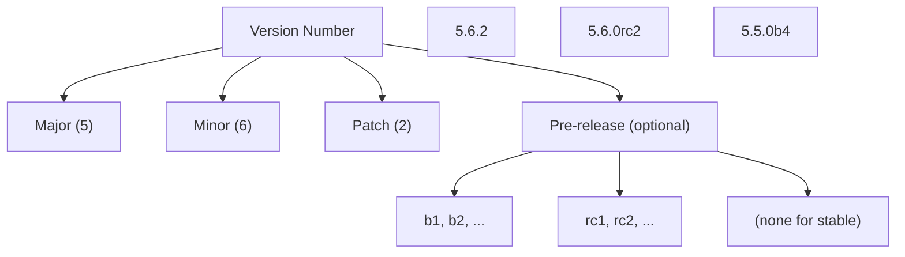
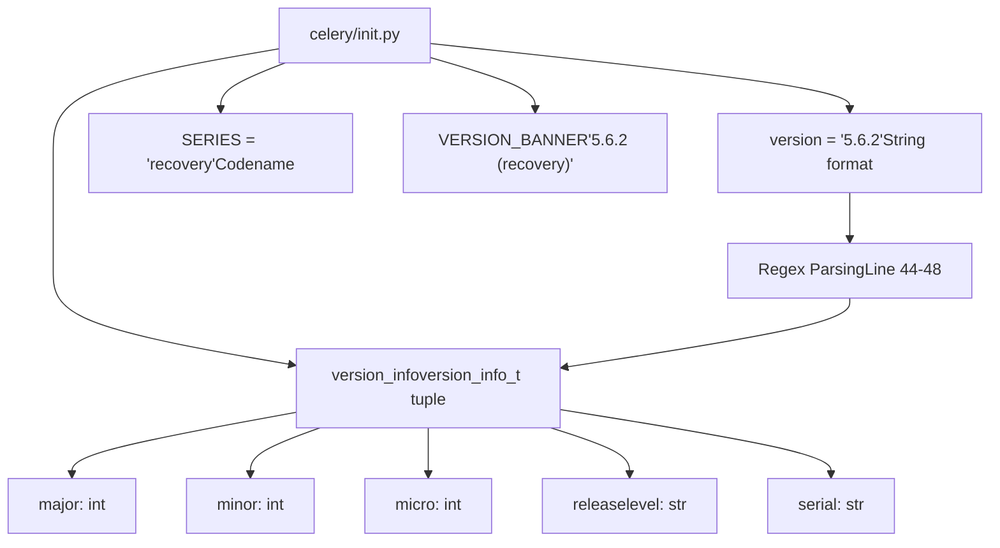
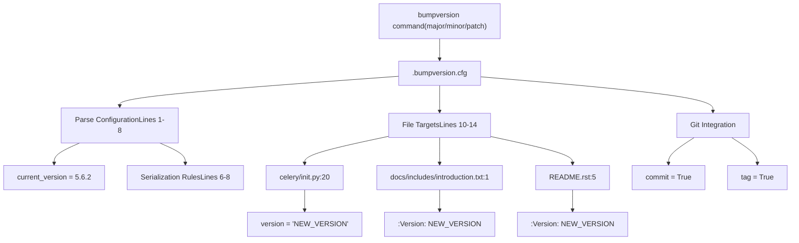
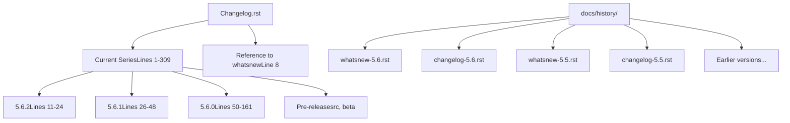
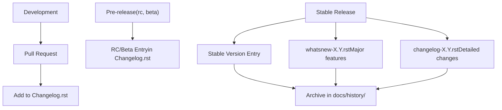
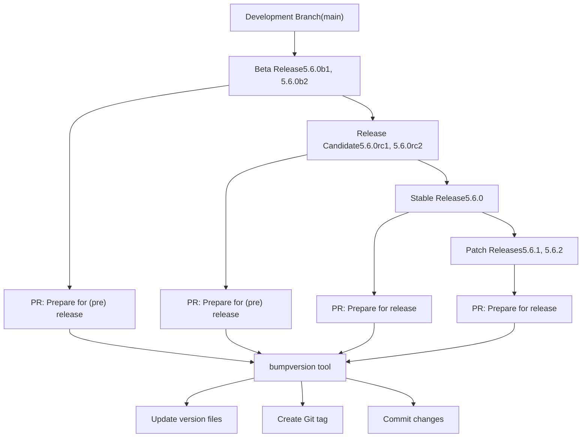
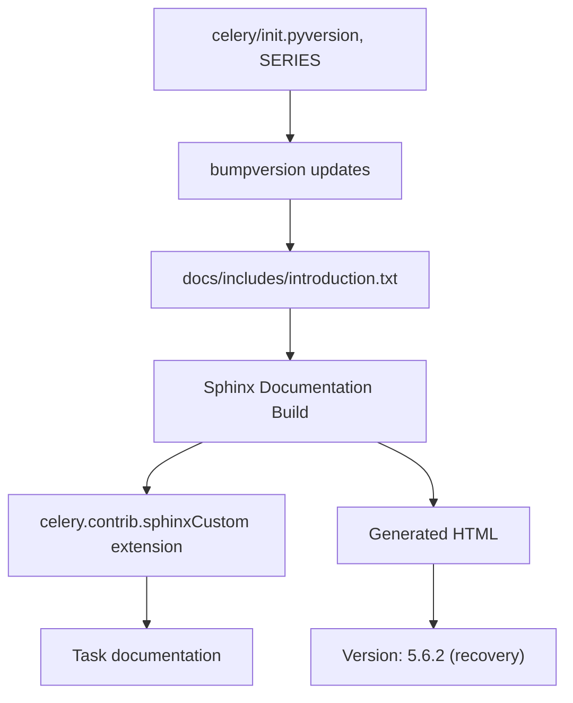

# 版本管理与发布 (Version Management and Release)

相关源文件

-   [.bumpversion.cfg](https://github.com/celery/celery/blob/4d068b56/.bumpversion.cfg)
-   [Changelog.rst](https://github.com/celery/celery/blob/4d068b56/Changelog.rst)
-   [README.rst](https://github.com/celery/celery/blob/4d068b56/README.rst)
-   [celery/\_\_init\_\_.py](https://github.com/celery/celery/blob/4d068b56/celery/__init__.py)
-   [celery/contrib/sphinx.py](https://github.com/celery/celery/blob/4d068b56/celery/contrib/sphinx.py)
-   [docs/getting-started/introduction.rst](https://github.com/celery/celery/blob/4d068b56/docs/getting-started/introduction.rst)
-   [docs/history/changelog-5.5.rst](https://github.com/celery/celery/blob/4d068b56/docs/history/changelog-5.5.rst)
-   [docs/history/changelog-5.6.rst](https://github.com/celery/celery/blob/4d068b56/docs/history/changelog-5.6.rst)
-   [docs/history/index.rst](https://github.com/celery/celery/blob/4d068b56/docs/history/index.rst)
-   [docs/history/whatsnew-5.5.rst](https://github.com/celery/celery/blob/4d068b56/docs/history/whatsnew-5.5.rst)
-   [docs/history/whatsnew-5.6.rst](https://github.com/celery/celery/blob/4d068b56/docs/history/whatsnew-5.6.rst)
-   [docs/includes/introduction.txt](https://github.com/celery/celery/blob/4d068b56/docs/includes/introduction.txt)
-   [docs/includes/resources.txt](https://github.com/celery/celery/blob/4d068b56/docs/includes/resources.txt)
-   [docs/index.rst](https://github.com/celery/celery/blob/4d068b56/docs/index.rst)

本文档描述了版本号如何在 Celery 代码库中进行管理和协调，包括用于版本自增的工具、变更日志（Changelog）的结构以及发布流程。

有关包元数据和分发的信息，请参阅[包结构](/celery/celery/11.1-package-structure)和[依赖与 Extras](/celery/celery/11.2-dependencies-and-extras)。

---

## 目的与范围

Celery 使用集中式的版本管理系统，在多个文件之间同步版本信息。版本号定义在单一位置，并通过自动化工具传播到文档、包元数据和用户面向的文件中。本文档涵盖：

-   版本号方案和语义化版本控制实践。
-   程序化使用的 `version_info_t` 元组结构。
-   用于协调版本更新的 `.bumpversion.cfg` 配置。
-   变更日志的组织和命名约定。
-   从预发布版本到稳定版本的发布流程。

---

## 版本号方案

Celery 遵循语义化版本控制，并针对预发布标识符进行了扩展。版本格式为：

```text
主版本号.次版本号.修订号[预发布标识]
```
**图表：版本号格式**


**来源：** [celery/\_\_init\_\_.py20](https://github.com/celery/celery/blob/4d068b56/celery/__init__.py#L20-L20) [.bumpversion.cfg5](https://github.com/celery/celery/blob/4d068b56/.bumpversion.cfg#L5-L5)

### 系列名称 (Series Names)

每个“主版本.次版本”系列都会被分配一个代号，这些代号源自 Jon Hopkins 的歌曲。系列名称与版本号分开存储：

| 版本系列 | 代号 |
| --- | --- |
| 5.6.x | recovery |
| 5.5.x | immunity |
| 5.4.x | opalescent |

**来源：** [celery/\_\_init\_\_.py18](https://github.com/celery/celery/blob/4d068b56/celery/__init__.py#L18-L18) [docs/history/whatsnew-5.6.rst4](https://github.com/celery/celery/blob/4d068b56/docs/history/whatsnew-5.6.rst#L4-L4) [docs/history/whatsnew-5.5.rst4](https://github.com/celery/celery/blob/4d068b56/docs/history/whatsnew-5.5.rst#L4-L4)

---

## 代码中的版本信息

### 主要版本定义

规范版本在 `celery/__init__.py` 中定义，并通过多种格式公开：

**图表：版本信息结构**


**来源：** [celery/\_\_init\_\_.py18-48](https://github.com/celery/celery/blob/4d068b56/celery/__init__.py#L18-L48)

### version\_info\_t 具名元组

`version_info_t` 具名元组提供了对版本组件的程序化访问：

```python
version_info_t = namedtuple('version_info_t', (
    'major', 'minor', 'micro', 'releaselevel', 'serial',
))
```
版本字符串使用正则表达式进行解析，以填充此元组：

```python
_temp = re.match(
    r'(\d+)\.(\d+)\.(\d+)(.+)?', __version__).groups()
VERSION = version_info = version_info_t(
    int(_temp[0]), int(_temp[1]), int(_temp[2]), _temp[3] or '', '')
```
对于版本 `5.6.2`，这将产生：

-   `major=5`
-   `minor=6`
-   `micro=2`
-   `releaselevel=''`（稳定版为空）
-   `serial=''`

对于版本 `5.6.0rc2`，这将产生：

-   `major=5`
-   `minor=6`
-   `micro=0`
-   `releaselevel='rc2'`
-   `serial=''`

**来源：** [celery/\_\_init\_\_.py38-48](https://github.com/celery/celery/blob/4d068b56/celery/__init__.py#L38-L48)

---

## 使用 bumpversion 自动更新版本

### 配置文件结构

`.bumpversion.cfg` 文件使用 `bumpversion` 工具协调多个文件之间的版本更新：

**图表：Bumpversion 工作流**


**来源：** [.bumpversion.cfg1-14](https://github.com/celery/celery/blob/4d068b56/.bumpversion.cfg#L1-L14)

### 配置详情

配置文件指定了：

1.  **版本解析模式**（第 5 行）：

    ```text
    parse = (?P<major>\d+)\.(?P<minor>\d+)\.(?P<patch>\d+)(?P<releaselevel>[a-z\d]+)?
    ```

    该正则表达式捕获了主版本号、次版本号、修订号以及可选的发布级别组件。

2.  **序列化格式**（第 6-8 行）：

    -   带发布级别：`{major}.{minor}.{patch}{releaselevel}`
    -   无发布级别：`{major}.{minor}.{patch}`
3.  **要更新的文件**（第 10-14 行）：

    -   `celery/__init__.py` - 主要的版本号定义。
    -   `docs/includes/introduction.txt` - 文档版本。
    -   `README.rst` - 面向用户的版本信息。
4.  **Git 集成**（第 3-4 行）：

    -   自动提交更改。
    -   创建版本标签（Tags）。

**来源：** [.bumpversion.cfg1-14](https://github.com/celery/celery/blob/4d068b56/.bumpversion.cfg#L1-L14)

### 版本更新位置

**表：由 bumpversion 更新的文件**

| 文件 | 行号 | 格式 | 示例 |
| --- | --- | --- | --- |
| `celery/__init__.py` | 20 | `__version__ = 'X.Y.Z'` | `__version__ = '5.6.2'` |
| `docs/includes/introduction.txt` | 1 | `:Version: X.Y.Z (系列)` | `:Version: 5.6.2 (recovery)` |
| `README.rst` | 5 | `:Version: X.Y.Z (系列)` | `:Version: 5.6.2 (recovery)` |

**来源：** [celery/\_\_init\_\_.py20](https://github.com/celery/celery/blob/4d068b56/celery/__init__.py#L20-L20) [docs/includes/introduction.txt1](https://github.com/celery/celery/blob/4d068b56/docs/includes/introduction.txt#L1-L1) [README.rst5](https://github.com/celery/celery/blob/4d068b56/README.rst#L5-L5)

---

## 变更日志 (Changelog) 管理

### 变更日志文件结构

**图表：变更日志组织**


**来源：** [Changelog.rst1-309](https://github.com/celery/celery/blob/4d068b56/Changelog.rst#L1-L309) [docs/history/index.rst1-50](https://github.com/celery/celery/blob/4d068b56/docs/history/index.rst#L1-L50)

### 版本条目格式

`Changelog.rst` 中的每个版本条目都遵循一致的结构：

```rst
.. _version-X.Y.Z:

X.Y.Z
=====

:release-date: YYYY-MM-DD
:release-by: 维护者姓名

What's Changed
~~~~~~~~~~~~~~

- 变更描述 (#PR_NUMBER)
- 另一个变更 (#PR_NUMBER)
```
**以 5.6.2 为例：**

```rst
.. _version-5.6.2:

5.6.2
=====

:release-date: 2026-01-04
:release-by: Tomer Nosrati

What's Changed
~~~~~~~~~~~~~~

- Fix recursive WorkController instantiation (#10045)
- Bugfix: Revoked tasks now immediately update backend status (#9869)
- Prepare for release: v5.6.2 (#10049)
```
**来源：** [Changelog.rst11-24](https://github.com/celery/celery/blob/4d068b56/Changelog.rst#L11-L24)

### 预发布版本

预发布版本使用像 `rc1`, `rc2`, `b1`, `b2` 这样的后缀：

-   **发布候选 (Release Candidates, rc)**：`5.6.0rc2`, `5.6.0rc1`。
-   **Beta 版本 (b)**：`5.6.0b2`, `5.6.0b1`。

这些版本遵循相同的变更日志格式，但包含鼓励测试的警告信息：

```rst
5.6.0rc2
========

:release-date: 2025-11-22
:release-by: Tomer Nosrati

Celery v5.6.0 发布候选版 2 (RC2) 现已可供测试。
请帮助我们测试此版本并报告任何问题。
```
**来源：** [Changelog.rst163-182](https://github.com/celery/celery/blob/4d068b56/Changelog.rst#L163-L182)

---

## 发布相关的文档结构

### History 目录组织

`docs/history/` 目录包含了版本化文档：

**表：每个版本的文档文件**

| 版本 | whatsnew 文件 | changelog 文件 | 用途 |
| --- | --- | --- | --- |
| 5.6.x | `whatsnew-5.6.rst` | `changelog-5.6.rst` | 高层概览 vs 详细变更 |
| 5.5.x | `whatsnew-5.5.rst` | `changelog-5.5.rst` | 高层概览 vs 详细变更 |
| 5.4.x | `whatsnew-5.4.rst` | `changelog-5.4.rst` | 高层概览 vs 详细变更 |

**来源：** [docs/history/index.rst14-22](https://github.com/celery/celery/blob/4d068b56/docs/history/index.rst#L14-L22)

### whatsnew 与 changelog 文件的区别

**whatsnew 文件** 提供了叙述性文档：

-   主要功能概览。
-   迁移指南。
-   破坏性变更。
-   升级说明。

**changelog 文件** 包含了粒度化的变更列表：

-   每一个 PR 和 Issue。
-   技术细节。
-   完整的变更历史。
-   对贡献者的引用。

**图表：发布文档流**


**来源：** [docs/history/index.rst1-50](https://github.com/celery/celery/blob/4d068b56/docs/history/index.rst#L1-L50) [Changelog.rst1-10](https://github.com/celery/celery/blob/4d068b56/Changelog.rst#L1-L10)

---

## 发布流程 (Release Process)

### 发布阶段

**图表：发布生命周期**


**来源：** [Changelog.rst24](https://github.com/celery/celery/blob/4d068b56/Changelog.rst#L24-L24) [Changelog.rst182](https://github.com/celery/celery/blob/4d068b56/Changelog.rst#L182-L182) [Changelog.rst309](https://github.com/celery/celery/blob/4d068b56/Changelog.rst#L309-L309)

### 发布准备 PR (Release Preparation PR)

每次发布之前都会有一个“准备发布”或“准备（预）发布”的 PR。这些 PR 负责：

1.  通过 bumpversion 更新版本号。
2.  更新变更日志条目。
3.  更新文档。
4.  创建特定版本的 Git 标签。

**最近发布的示例：**

-   `#10049`：“Prepare for release: v5.6.2”
-   `#10005`：“Prepare for (pre) release: v5.6.0rc2”
-   `#9890`：“Prepare for (pre) release: v5.6.0b1”

**来源：** [Changelog.rst24](https://github.com/celery/celery/blob/4d068b56/Changelog.rst#L24-L24) [Changelog.rst182](https://github.com/celery/celery/blob/4d068b56/Changelog.rst#L182-L182) [Changelog.rst308](https://github.com/celery/celery/blob/4d068b56/Changelog.rst#L308-L308)

### 版本自增规则

**表：版本自增指南**

| 变更类型 | 版本组件 | 示例 | 何时使用 |
| --- | --- | --- | --- |
| 破坏性变更、主功能 | 主版本号 | 5.x.x → 6.0.0 | 新的主发布系列 |
| 新功能、非破坏性 | 次版本号 | 5.5.x → 5.6.0 | 功能发布 |
| 错误修复、补丁 | 修订号 | 5.6.1 → 5.6.2 | 维护发布 |
| 预发布测试 | 预发布后缀 | 5.6.0b1 → 5.6.0b2 | Beta/RC 迭代 |

**来源：** [docs/history/whatsnew-5.6.rst1-287](https://github.com/celery/celery/blob/4d068b56/docs/history/whatsnew-5.6.rst#L1-L287) [docs/history/whatsnew-5.5.rst1-361](https://github.com/celery/celery/blob/4d068b56/docs/history/whatsnew-5.5.rst#L1-L361)

---

## 与 Sphinx 文档集成

Sphinx 文档系统使用自定义的 `celery.contrib.sphinx` 扩展自动生成版本信息：

**来源：** [celery/contrib/sphinx.py1-139](https://github.com/celery/celery/blob/4d068b56/celery/contrib/sphinx.py#L1-L139)

### 文档配置

版本信息从代码流向文档：

1.  `celery/__init__.py` 定义了 `__version__` 和 `SERIES`。
2.  `docs/includes/introduction.txt` 使用这些值（通过 bumpversion）。
3.  Sphinx 读取 `introduction.txt` 进行渲染。
4.  `celery.contrib.sphinx` 扩展提供任务文档支持。

**图表：文档版本集成**


**来源：** [celery/contrib/sphinx.py1-139](https://github.com/celery/celery/blob/4d068b56/celery/contrib/sphinx.py#L1-L139) [docs/includes/introduction.txt1](https://github.com/celery/celery/blob/4d068b56/docs/includes/introduction.txt#L1-L1) [celery/\_\_init\_\_.py18-36](https://github.com/celery/celery/blob/4d068b56/celery/__init__.py#L18-L36)

---

## 关键文件摘要

**表：版本管理文件**

| 文件 | 用途 | 更新者 |
| --- | --- | --- |
| `celery/__init__.py` | 主要的版本定义 | bumpversion |
| `.bumpversion.cfg` | 版本自增配置 | 手动编辑 |
| `Changelog.rst` | 当前系列的变更日志 | 手动编辑 |
| `docs/includes/introduction.txt` | 文档版本信息 | bumpversion |
| `README.rst` | 面向用户的版本信息 | bumpversion |
| `docs/history/whatsnew-X.Y.rst` | 主版本概览 | 手动编辑 |
| `docs/history/changelog-X.Y.rst` | 详细的版本历史 | 手动编辑 |

**来源：** [celery/\_\_init\_\_.py20](https://github.com/celery/celery/blob/4d068b56/celery/__init__.py#L20-L20) [.bumpversion.cfg1-14](https://github.com/celery/celery/blob/4d068b56/.bumpversion.cfg#L1-L14) [Changelog.rst1-309](https://github.com/celery/celery/blob/4d068b56/Changelog.rst#L1-L309) [docs/history/index.rst1-50](https://github.com/celery/celery/blob/4d068b56/docs/history/index.rst#L1-L50)
