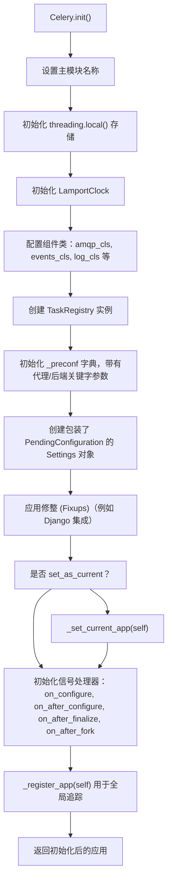
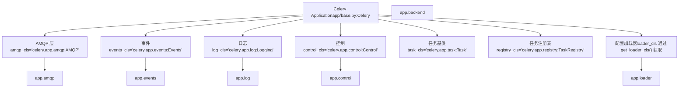
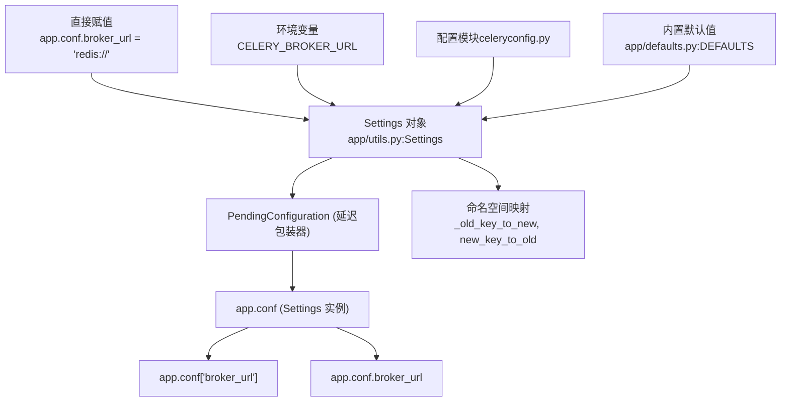
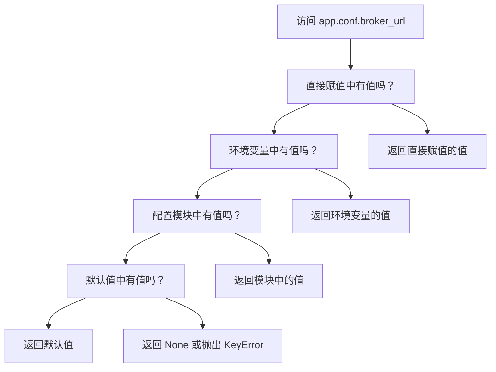
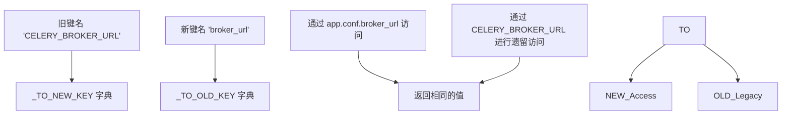
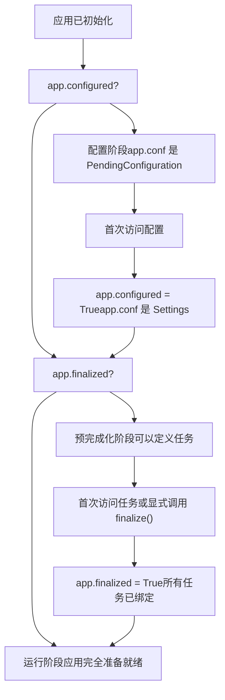
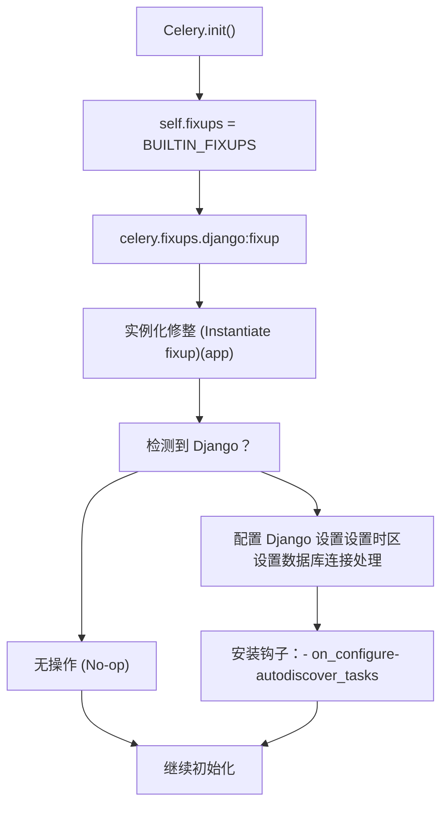

# 应用初始化与配置

相关源文件

-   [celery/app/amqp.py](https://github.com/celery/celery/blob/4d068b56/celery/app/amqp.py)
-   [celery/app/base.py](https://github.com/celery/celery/blob/4d068b56/celery/app/base.py)
-   [celery/app/defaults.py](https://github.com/celery/celery/blob/4d068b56/celery/app/defaults.py)
-   [celery/app/task.py](https://github.com/celery/celery/blob/4d068b56/celery/app/task.py)
-   [celery/canvas.py](https://github.com/celery/celery/blob/4d068b56/celery/canvas.py)
-   [celery/utils/\_\_init\_\_.py](https://github.com/celery/celery/blob/4d068b56/celery/utils/__init__.py)
-   [docs/faq.rst](https://github.com/celery/celery/blob/4d068b56/docs/faq.rst)
-   [docs/getting-started/first-steps-with-celery.rst](https://github.com/celery/celery/blob/4d068b56/docs/getting-started/first-steps-with-celery.rst)
-   [docs/getting-started/next-steps.rst](https://github.com/celery/celery/blob/4d068b56/docs/getting-started/next-steps.rst)
-   [docs/userguide/calling.rst](https://github.com/celery/celery/blob/4d068b56/docs/userguide/calling.rst)
-   [docs/userguide/canvas.rst](https://github.com/celery/celery/blob/4d068b56/docs/userguide/canvas.rst)
-   [docs/userguide/monitoring.rst](https://github.com/celery/celery/blob/4d068b56/docs/userguide/monitoring.rst)
-   [docs/userguide/periodic-tasks.rst](https://github.com/celery/celery/blob/4d068b56/docs/userguide/periodic-tasks.rst)
-   [docs/userguide/routing.rst](https://github.com/celery/celery/blob/4d068b56/docs/userguide/routing.rst)
-   [docs/userguide/tasks.rst](https://github.com/celery/celery/blob/4d068b56/docs/userguide/tasks.rst)
-   [docs/userguide/workers.rst](https://github.com/celery/celery/blob/4d068b56/docs/userguide/workers.rst)
-   [t/integration/conftest.py](https://github.com/celery/celery/blob/4d068b56/t/integration/conftest.py)
-   [t/integration/tasks.py](https://github.com/celery/celery/blob/4d068b56/t/integration/tasks.py)
-   [t/integration/test\_canvas.py](https://github.com/celery/celery/blob/4d068b56/t/integration/test_canvas.py)
-   [t/integration/test\_quorum\_queue\_qos\_cluster\_simulation.py](https://github.com/celery/celery/blob/4d068b56/t/integration/test_quorum_queue_qos_cluster_simulation.py)
-   [t/integration/test\_security.py](https://github.com/celery/celery/blob/4d068b56/t/integration/test_security.py)
-   [t/integration/test\_tasks.py](https://github.com/celery/celery/blob/4d068b56/t/integration/test_tasks.py)
-   [t/smoke/tests/test\_canvas.py](https://github.com/celery/celery/blob/4d068b56/t/smoke/tests/test_canvas.py)
-   [t/unit/app/test\_app.py](https://github.com/celery/celery/blob/4d068b56/t/unit/app/test_app.py)
-   [t/unit/tasks/test\_canvas.py](https://github.com/celery/celery/blob/4d068b56/t/unit/tasks/test_canvas.py)
-   [t/unit/tasks/test\_tasks.py](https://github.com/celery/celery/blob/4d068b56/t/unit/tasks/test_tasks.py)

本文档描述了 Celery 应用（application）是如何初始化和配置的。它涵盖了 `Celery` 应用类、层级化配置系统、配置源与优先级、命名空间组织以及应用完成化（finalization）过程。

有关任务如何注册到应用的信息，请参阅[任务注册](/celery/celery/2.2-task-registration)。有关代理（broker）和后端（backend）配置细节，请参阅[消息代理与路由](/celery/celery/2.3-message-brokers-and-routing)和[结果后端架构](/celery/celery/6.1-backend-architecture)。

## Celery 应用类

`Celery` 类是所有 Celery 功能的核心入口点。每个基于 Celery 的应用都会创建至少一个该类的实例，由它协调任务注册、配置、工作者（worker）管理和消息路由。

### 初始化过程

实例化 `Celery` 类时需要提供几个关键参数，这些参数定义了应用的身份和初始配置：

```
app = Celery(
    main='myapp',                    # 任务命名的主模块名称
    broker='redis://localhost',      # 消息代理 URL
    backend='redis://localhost',     # 结果后端 URL
    config_source='myapp.config',    # 可选的配置模块
    set_as_current=True,             # 设置为线程局部的当前应用
    autofinalize=True                # 首次使用时自动完成化
)
```
初始化序列执行几个关键操作：


**来源：** [celery/app/base.py317-408](https://github.com/celery/celery/blob/4d068b56/celery/app/base.py#L317-L408)

### 关键初始化参数

| 参数 | 类型 | 默认值 | 目的 |
| --- | --- | --- | --- |
| `main` | str | None | 模块名称，用作自动生成任务名称的前缀 |
| `loader` | str/class | 'celery.loaders.app:AppLoader' | 配置加载器（loader）类 |
| `broker` | str | None | 消息代理 URL（在配置中存储为 `broker_url`） |
| `backend` | str | None | 结果后端 URL（在配置中存储为 `result_backend`） |
| `set_as_current` | bool | True | 将此应用设置为线程局部的当前应用 |
| `autofinalize` | bool | True | 在首次访问时自动完成化（finalize）应用 |
| `namespace` | str | None | 配置命名空间前缀（例如 'CELERY'） |
| `config_source` | str/object | None | 要加载的配置模块或对象 |

对于独立脚本，`main` 参数尤为重要。当任务定义在 `__main__` 模块中时，Celery 使用此值生成稳定的任务名称，这些名称在不同的执行上下文中保持一致。

**来源：** [celery/app/base.py230-376](https://github.com/celery/celery/blob/4d068b56/celery/app/base.py#L230-L376) [docs/getting-started/first-steps-with-celery.rst116-151](https://github.com/celery/celery/blob/4d068b56/docs/getting-started/first-steps-with-celery.rst#L116-L151)

### 组件架构

Celery 应用延迟实例化（lazily instantiates）几个组件子系统，每个子系统负责功能的特定方面：


每个组件类都可以通过在初始化期间传递替代类名或类对象来自定义。例如，使用自定义 AMQP 层：

```
app = Celery('myapp', amqp='myapp.amqp:CustomAMQP')
```
**来源：** [celery/app/base.py289-296](https://github.com/celery/celery/blob/4d068b56/celery/app/base.py#L289-L296) [celery/app/base.py410-416](https://github.com/celery/celery/blob/4d068b56/celery/app/base.py#L410-L416)

## 配置系统架构

Celery 的配置系统使用一种层级化的、基于命名空间（namespace）的方法，支持具有明确定义优先级规则的多个配置源。

### 配置流


### Settings 类

`Settings` 类提供了一个支持属性访问、命名空间支持和键兼容性映射的字典式（dict-like）接口：


在应用配置之前，`app.conf` 是一个 `PendingConfiguration` 对象，它推迟了配置完成化。在首次访问时，它会触发完成化，并变成一个由具体字典支持的 `Settings` 对象。

**来源：** [celery/app/base.py186-228](https://github.com/celery/celery/blob/4d068b56/celery/app/base.py#L186-L228) [celery/app/utils.py](https://github.com/celery/celery/blob/4d068b56/celery/app/utils.py)

### 配置状态机

应用配置在其生命周期中经历不同的状态：

> **[Mermaid stateDiagram]**
> *(图表结构无法解析)*

**来源：** [celery/app/base.py349-383](https://github.com/celery/celery/blob/4d068b56/celery/app/base.py#L349-L383) [celery/app/base.py631-651](https://github.com/celery/celery/blob/4d068b56/celery/app/base.py#L631-L651)

## 配置源与优先级

配置可以从多个来源提供。后序来源会按此优先级顺序（从高到低）覆盖前序来源：

### 1. 直接赋值 (最高优先级)

直接对 `app.conf` 赋值的优先级高于所有其他来源：

```
app.conf.broker_url = 'redis://localhost:6379/0'
app.conf.task_serializer = 'json'
app.conf.result_expires = 3600
```
这种方式即使在配置完成化之前也有效，适用于程序化配置。

**来源：** [celery/app/base.py421-424](https://github.com/celery/celery/blob/4d068b56/celery/app/base.py#L421-L424)

### 2. 环境变量

带有 `CELERY_` 前缀（或自定义命名空间，如果已设置）的环境变量会覆盖配置模块中的设置：

```
export CELERY_BROKER_URL='redis://localhost'
export CELERY_RESULT_BACKEND='redis://localhost'
export CELERY_TASK_SERIALIZER='json'
```
加载器（loader）会在配置期间自动读取这些变量。

**来源：** [celery/loaders/base.py](https://github.com/celery/celery/blob/4d068b56/celery/loaders/base.py)

### 3. 配置模块

一个 Python 模块或对象可以提供批量配置：

```
# celeryconfig.py
broker_url = 'redis://localhost:6379/0'
result_backend = 'redis://localhost:6379/1'
task_serializer = 'json'
accept_content = ['json']
timezone = 'Europe/London'

# 加载配置
app.config_from_object('celeryconfig')
# 或者
app.config_from_envvar('CELERY_CONFIG_MODULE')
```
`config_from_object` 方法接受：

-   作为字符串的模块名（例如 `'myapp.celeryconfig'`）
-   模块对象（例如 `import celeryconfig; app.config_from_object(celeryconfig)`）
-   任何带有配置属性的对象

**来源：** [celery/app/base.py677-717](https://github.com/celery/celery/blob/4d068b56/celery/app/base.py#L677-L717) [celery/loaders/base.py](https://github.com/celery/celery/blob/4d068b56/celery/loaders/base.py)

### 4. 内置默认值 (最低优先级)

如果没有其他来源提供值，Celery 将使用在 `NAMESPACES` 结构中定义的内置默认值：

```
# 来自 defaults.py 的默认值示例
broker_connection_timeout = 4.0  # 秒
broker_connection_retry = True
broker_connection_max_retries = 100
task_serializer = 'json'
task_always_eager = False
worker_prefetch_multiplier = 4
```
**来源：** [celery/app/defaults.py66-363](https://github.com/celery/celery/blob/4d068b56/celery/app/defaults.py#L66-L363) [celery/app/defaults.py391-393](https://github.com/celery/celery/blob/4d068b56/celery/app/defaults.py#L391-L393)

### 配置覆盖图


**来源：** [celery/app/utils.py](https://github.com/celery/celery/blob/4d068b56/celery/app/utils.py)

## 配置命名空间

Celery 将配置设置组织到逻辑命名空间中。每个命名空间将相关的设置分在一组，使配置更易于维护和发现。

### 命名空间结构

`defaults.py` 中的 `NAMESPACES` 结构定义了完整的配置架构：

```mermaid
flowchart TD
    Root["配置根节点"]
    Broker["broker_*消息代理设置"]
    Task["task_*任务执行设置"]
    Worker["worker_*工作者进程设置"]
    Result["result_*结果后端设置"]
    Beat["beat_*周期性调度器设置"]
    Redis["redis_*Redis 特定设置"]
    Database["database_*数据库后端设置"]
    Security["security_*消息签名设置"]
    Event["event_*事件监控设置"]
    Control["control_*工作者控制设置"]
    Cache["cache_*缓存后端设置"]
    BrokerUrl["broker_url"]
    BrokerRetry["broker_connection_retry"]
    BrokerTimeout["broker_connection_timeout"]
    TaskSerializer["task_serializer"]
    TaskRoutes["task_routes"]
    TaskQueues["task_queues"]
    TaskAcksLate["task_acks_late"]
    WorkerPool["worker_pool"]
    WorkerConcurrency["worker_concurrency"]
    WorkerPrefetch["worker_prefetch_multiplier"]
    WorkerMaxTasks["worker_max_tasks_per_child"]
    ResultBackend["result_backend"]
    ResultExpires["result_expires"]
    ResultSerializer["result_serializer"]

    Root --> Broker
    Root --> Task
    Root --> Worker
    Root --> Result
    Root --> Beat
    Root --> Redis
    Root --> Database
    Root --> Security
    Root --> Event
    Root --> Control
    Root --> Cache
    Broker --> BrokerUrl
    Broker --> BrokerRetry
    Broker --> BrokerTimeout
    Task --> TaskSerializer
    Task --> TaskRoutes
    Task --> TaskQueues
    Task --> TaskAcksLate
    Worker --> WorkerPool
    Worker --> WorkerConcurrency
    Worker --> WorkerPrefetch
    Worker --> WorkerMaxTasks
    Result --> ResultBackend
    Result --> ResultExpires
    Result --> ResultSerializer
```


### 主要配置命名空间

| 命名空间 | 前缀 | 目的 | 关键设置 |
| --- | --- | --- | --- |
| **Broker** | `broker_` | 消息代理连接与行为 | `broker_url`, `broker_connection_retry`, `broker_connection_timeout`, `broker_heartbeat` |
| **Task** | `task_` | 任务执行与路由 | `task_serializer`, `task_routes`, `task_queues`, `task_acks_late`, `task_time_limit`, `task_soft_time_limit` |
| **Worker** | `worker_` | 工作者进程配置 | `worker_pool`, `worker_concurrency`, `worker_prefetch_multiplier`, `worker_max_tasks_per_child`, `worker_redirect_stdouts` |
| **Result** | `result_` | 结果后端存储 | `result_backend`, `result_expires`, `result_serializer`, `result_compression`, `result_extended` |
| **Beat** | `beat_` | 周期性任务调度器 | `beat_schedule`, `beat_scheduler`, `beat_schedule_filename`, `beat_max_loop_interval` |
| **Security** | `security_` | 消息签名与加密 | `security_key`, `security_certificate`, `security_cert_store`, `security_digest` |
| **Event** | `event_` | 事件监控 | `event_queue_expires`, `event_queue_ttl`, `event_serializer`, `event_exchange` |

**来源：** [celery/app/defaults.py66-363](https://github.com/celery/celery/blob/4d068b56/celery/app/defaults.py#L66-L363)

### Option 类

每个配置选项都使用 `Option` 类定义，该类指定了默认值、类型以及过时的/旧的键名：

```
class Option:
    """描述一个 Celery 配置选项。"""

    def __init__(self, default=None, type='string', old=set(),
                 deprecate_by=None, remove_by=None, alt=None):
        self.default = default
        self.type = type  # 'string', 'int', 'float', 'bool', 'dict', 'tuple', 'any'
        self.old = old  # 已过时的键名集合
        self.deprecate_by = deprecate_by  # 开始过时的版本
        self.remove_by = remove_by  # 移除的版本
        self.alt = alt  # 备用设置名称
```
例如，代理 URL 选项定义如下：

```
broker=Namespace(
    url=Option(None, type='string'),
    read_url=Option(None, type='string'),
    write_url=Option(None, type='string'),
    transport=Option(type='string'),
    connection_timeout=Option(4, type='float'),
    # ... 更多选项
)
```
**来源：** [celery/app/defaults.py42-64](https://github.com/celery/celery/blob/4d068b56/celery/app/defaults.py#L42-L64) [celery/app/defaults.py83-107](https://github.com/celery/celery/blob/4d068b56/celery/app/defaults.py#L83-L107)

### 后向兼容性

Celery 通过映射系统保持与旧配置键名的后向兼容性：


`_TO_NEW_KEY` 和 `_TO_OLD_KEY` 字典（由 `Option` 定义中的 `old` 属性生成）实现了旧键名与新键名之间的无缝转换。

**来源：** [celery/app/defaults.py394-398](https://github.com/celery/celery/blob/4d068b56/celery/app/defaults.py#L394-L398) [celery/app/utils.py](https://github.com/celery/celery/blob/4d068b56/celery/app/utils.py)

## 应用完成化 (Application Finalization)

完成化是应用从配置阶段过渡到运行阶段的过程。在完成化期间，所有待处理的任务都会被注册，组件被初始化，应用准备好执行任务。

### 完成化过程

> **[Mermaid sequence]**
> *(图表结构无法解析)*

### 延迟任务评估 (Lazy Task Evaluation)

在完成化之前通过装饰器定义的任务以 `PromiseProxy` 对象的形式存储在 `_pending` 双端队列（deque）中。在完成化期间，这些 promise 会被评估并创建实际的任务类：

```
# 当在完成化之前使用任务装饰器时
@app.task
def add(x, y):
    return x + y

# 在内部，这会创建一个 PromiseProxy：
ret = PromiseProxy(app._task_from_fun, (add,), options, __doc__=add.__doc__)
app._pending.append(ret)

# 在完成化期间：
while app._pending:
    maybe_evaluate(app._pending.popleft())  # 评估该 promise
```
**来源：** [celery/app/base.py631-651](https://github.com/celery/celery/blob/4d068b56/celery/app/base.py#L631-L651) [celery/app/base.py538-544](https://github.com/celery/celery/blob/4d068b56/celery/app/base.py#L538-L544)

### 手动完成化与自动完成化

| 模式 | 何时使用 | 行为 |
| --- | --- | --- |
| **自动** (`autofinalize=True`) | 默认模式 | 应用在首次访问任务或任务注册表时完成化 |
| **手动** (`autofinalize=False`) | 高级使用场景、测试 | 在使用应用前必须显式调用 `app.finalize()` |

当您需要精确控制初始化顺序或编写测试时，手动完成化非常有用：

```
app = Celery('myapp', autofinalize=False)

# 配置应用
app.conf.broker_url = 'redis://localhost'
app.config_from_object('myconfig')

# 准备就绪后显式完成化
app.finalize()
```
如果您在 `autofinalize=False` 的情况下在完成化前访问任务，将收到 `RuntimeError`：

```
RuntimeError: Contract breach: app not finalized
```
**来源：** [celery/app/base.py345](https://github.com/celery/celery/blob/4d068b56/celery/app/base.py#L345-L345) [celery/app/base.py576-577](https://github.com/celery/celery/blob/4d068b56/celery/app/base.py#L576-L577)

### 完成化状态追踪

应用通过几个布尔标志追踪完成化状态：


**来源：** [celery/app/base.py349](https://github.com/celery/celery/blob/4d068b56/celery/app/base.py#L349-L349) [celery/app/base.py354](https://github.com/celery/celery/blob/4d068b56/celery/app/base.py#L354-L354)

## 加载器 (Loaders) 与修整 (Fixups)

加载器和修整提供了自定义配置加载和与 Django 等框架集成的扩展点。

### 加载器系统

加载器负责从各种来源加载配置。Celery 提供了几个内置加载器：

| 加载器 | 类 | 目的 |
| --- | --- | --- |
| **App Loader** | `celery.loaders.app:AppLoader` | 默认加载器，从对象/模块加载配置 |
| **Default Loader** | `celery.loaders.default:Loader` | 已弃用，用于后向兼容 |

加载器通过 `loader` 参数或 `CELERY_LOADER` 环境变量选择：

```
app = Celery('myapp', loader='celery.loaders.app:AppLoader')
# 或者
os.environ['CELERY_LOADER'] = 'myapp.loader:CustomLoader'
```
**来源：** [celery/app/base.py410-416](https://github.com/celery/celery/blob/4d068b56/celery/app/base.py#L410-L416) [celery/loaders/\_\_init\_\_.py](https://github.com/celery/celery/blob/4d068b56/celery/loaders/__init__.py)

### 修整系统 (Fixup System)

修整是针对特定框架修改应用行为的插件。最常见的修整是针对 Django 的：


Django 修整会自动：

-   检测 Django 是否存在
-   加载 Django 设置
-   根据 Django 的 `TIME_ZONE` 配置时区
-   处理数据库连接清理
-   提供 `autodiscover_tasks()` 用于自动任务发现

**来源：** [celery/app/base.py60-62](https://github.com/celery/celery/blob/4d068b56/celery/app/base.py#L60-L62) [celery/app/base.py384-388](https://github.com/celery/celery/blob/4d068b56/celery/app/base.py#L384-L388) [celery/fixups/django.py](https://github.com/celery/celery/blob/4d068b56/celery/fixups/django.py)

### 自定义修整

您可以在初始化期间提供自定义修整：

```
app = Celery('myapp', fixups=['myapp.fixups:MyFixup'])

# 修整类示例
class MyFixup:
    def __init__(self, app):
        self.app = app

    def on_configure(self):
        """当应用配置时调用"""
        pass

    def autodiscover_tasks(self):
        """返回要扫描任务的包列表"""
        return ['myapp.tasks', 'myapp.jobs']
```
**来源：** [celery/app/base.py385](https://github.com/celery/celery/blob/4d068b56/celery/app/base.py#L385-L385) [celery/fixups/\_\_init\_\_.py](https://github.com/celery/celery/blob/4d068b56/celery/fixups/__init__.py)

## 配置访问模式

配置完成后，可以通过几种模式访问设置：

### 字典式访问

```
# 获取带有默认值的值
broker_url = app.conf.get('broker_url', 'redis://localhost')

# 直接访问（如果缺失则抛出 KeyError）
broker_url = app.conf['broker_url']

# 设置值
app.conf['task_serializer'] = 'json'
```
### 属性式访问

```
# 获取属性
broker_url = app.conf.broker_url

# 设置属性
app.conf.task_serializer = 'json'

# 检查是否存在
if hasattr(app.conf, 'result_backend'):
    backend = app.conf.result_backend
```
### 命名空间遍历

```
# 访问嵌套命名空间设置
broker_timeout = app.conf.get_by_parts('broker', 'connection_timeout')
# 等同于：app.conf.broker_connection_timeout
```
### 批量更新

```
# 一次更新多个设置
app.conf.update(
    broker_url='redis://localhost',
    result_backend='redis://localhost',
    task_serializer='json',
    accept_content=['json'],
)
```
**来源：** [celery/app/utils.py](https://github.com/celery/celery/blob/4d068b56/celery/app/utils.py) [celery/app/base.py720-722](https://github.com/celery/celery/blob/4d068b56/celery/app/base.py#L720-L722)

## 配置最佳实践

1.  **在生产环境使用配置模块**：将配置保持在独立的文件中，而不是硬编码在应用代码中。

2.  **利用环境变量**：使用 `CELERY_*` 环境变量按环境覆盖配置。

3.  **为自定义设置建立命名空间**：如果添加自定义设置，请遵循命名空间模式（例如 `myapp_setting_name`）。

4.  **在测试中显式完成化**：使用 `autofinalize=False` 并显式调用 `finalize()`，以获得更好的测试控制。

5.  **及早校验配置**：在应用启动期间访问配置，以便在工作者启动前发现错误。

6.  **文档化自定义设置**：如果扩展了配置，请记录新设置及其类型和默认值。


**来源：** [docs/userguide/tasks.rst1-435](https://github.com/celery/celery/blob/4d068b56/docs/userguide/tasks.rst#L1-L435) [docs/getting-started/first-steps-with-celery.rst1-397](https://github.com/celery/celery/blob/4d068b56/docs/getting-started/first-steps-with-celery.rst#L1-L397)

---

**主要来源：**

-   [celery/app/base.py1-2800](https://github.com/celery/celery/blob/4d068b56/celery/app/base.py#L1-L2800)
-   [celery/app/defaults.py1-436](https://github.com/celery/celery/blob/4d068b56/celery/app/defaults.py#L1-L436)
-   [celery/app/utils.py](https://github.com/celery/celery/blob/4d068b56/celery/app/utils.py)
-   [celery/loaders/base.py](https://github.com/celery/celery/blob/4d068b56/celery/loaders/base.py)
-   [docs/getting-started/first-steps-with-celery.rst1-397](https://github.com/celery/celery/blob/4d068b56/docs/getting-started/first-steps-with-celery.rst#L1-L397)
-   [docs/userguide/tasks.rst89-436](https://github.com/celery/celery/blob/4d068b56/docs/userguide/tasks.rst#L89-L436)
