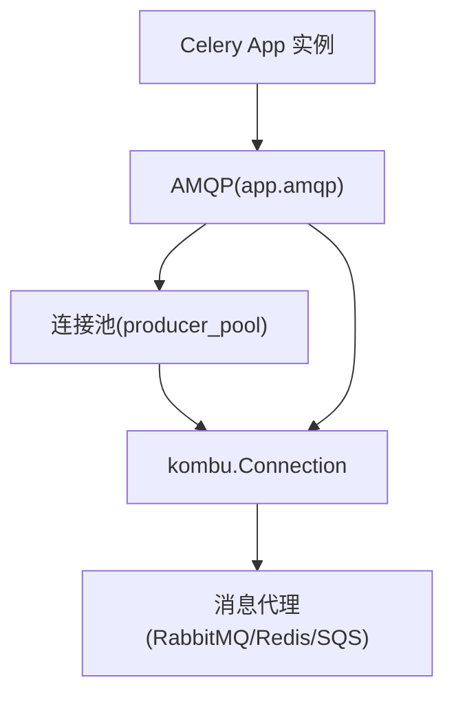
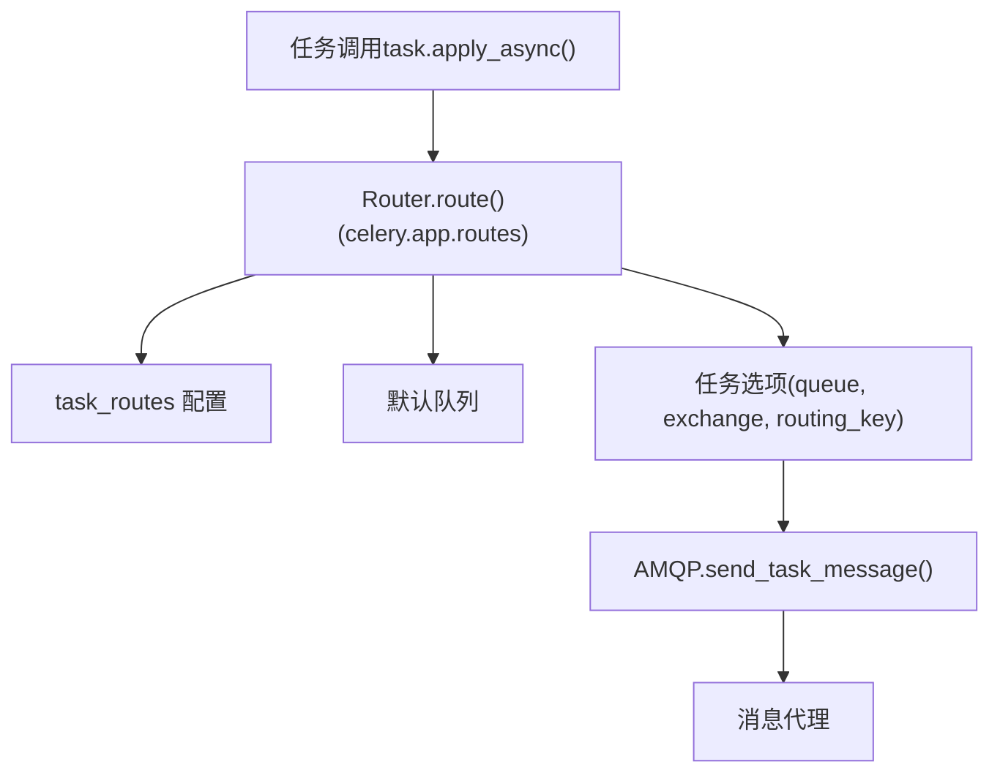

# 消息代理与路由

相关源文件

-   [celery/app/amqp.py](https://github.com/celery/celery/blob/4d068b56/celery/app/amqp.py)
-   [celery/app/base.py](https://github.com/celery/celery/blob/4d068b56/celery/app/base.py)
-   [celery/app/defaults.py](https://github.com/celery/celery/blob/4d068b56/celery/app/defaults.py)
-   [celery/app/task.py](https://github.com/celery/celery/blob/4d068b56/celery/app/task.py)
-   [celery/canvas.py](https://github.com/celery/celery/blob/4d068b56/celery/canvas.py)
-   [celery/utils/\_\_init\_\_.py](https://github.com/celery/celery/blob/4d068b56/celery/utils/__init__.py)
-   [docs/faq.rst](https://github.com/celery/celery/blob/4d068b56/docs/faq.rst)
-   [docs/getting-started/first-steps-with-celery.rst](https://github.com/celery/celery/blob/4d068b56/docs/getting-started/first-steps-with-celery.rst)
-   [docs/getting-started/next-steps.rst](https://github.com/celery/celery/blob/4d068b56/docs/getting-started/next-steps.rst)
-   [docs/userguide/calling.rst](https://github.com/celery/celery/blob/4d068b56/docs/userguide/calling.rst)
-   [docs/userguide/canvas.rst](https://github.com/celery/celery/blob/4d068b56/docs/userguide/canvas.rst)
-   [docs/userguide/monitoring.rst](https://github.com/celery/celery/blob/4d068b56/docs/userguide/monitoring.rst)
-   [docs/userguide/periodic-tasks.rst](https://github.com/celery/celery/blob/4d068b56/docs/userguide/periodic-tasks.rst)
-   [docs/userguide/routing.rst](https://github.com/celery/celery/blob/4d068b56/docs/userguide/routing.rst)
-   [docs/userguide/tasks.rst](https://github.com/celery/celery/blob/4d068b56/docs/userguide/tasks.rst)
-   [docs/userguide/workers.rst](https://github.com/celery/celery/blob/4d068b56/docs/userguide/workers.rst)
-   [t/integration/conftest.py](https://github.com/celery/celery/blob/4d068b56/t/integration/conftest.py)
-   [t/integration/tasks.py](https://github.com/celery/celery/blob/4d068b56/t/integration/tasks.py)
-   [t/integration/test\_canvas.py](https://github.com/celery/celery/blob/4d068b56/t/integration/test_canvas.py)
-   [t/integration/test\_quorum\_queue\_qos\_cluster\_simulation.py](https://github.com/celery/celery/blob/4d068b56/t/integration/test_quorum_queue_qos_cluster_simulation.py)
-   [t/integration/test\_security.py](https://github.com/celery/celery/blob/4d068b56/t/integration/test_security.py)
-   [t/integration/test\_tasks.py](https://github.com/celery/celery/blob/4d068b56/t/integration/test_tasks.py)
-   [t/smoke/tests/test\_canvas.py](https://github.com/celery/celery/blob/4d068b56/t/smoke/tests/test_canvas.py)
-   [t/unit/app/test\_app.py](https://github.com/celery/celery/blob/4d068b56/t/unit/app/test_app.py)
-   [t/unit/tasks/test\_canvas.py](https://github.com/celery/celery/blob/4d068b56/t/unit/tasks/test_canvas.py)
-   [t/unit/tasks/test\_tasks.py](https://github.com/celery/celery/blob/4d068b56/t/unit/tasks/test_tasks.py)

本文档描述了 Celery 的消息代理（message broker）支持和任务路由（task routing）系统。它涵盖了支持的消息代理类型、通过 `Queues` 类进行的队列配置，以及确定哪个队列接收特定任务消息的路由机制。

有关底层 AMQP 协议实现、消息创建和序列化的信息，请参阅 [AMQP 层与消息协议](/celery/celery/2.4-amqp-layer-and-message-protocol)。有关任务定义和执行，请参阅[任务 (Tasks)](/celery/celery/3-tasks)。

---

## 消息代理支持

Celery 使用消息代理来发送和接收任务消息。代理充当中间人，为工作者（workers）消费消息提供排队服务。Celery 支持多种代理类型，每种类型都有不同的特性。

### 支持的代理

主要支持的消息代理包括：

| 代理 | 生产就绪 | 传输类型 (Transport Type) | 配置键 |
| --- | --- | --- | --- |
| RabbitMQ | 是 | AMQP | `broker_url='amqp://...'` |
| Redis | 是 | Redis 协议 | `broker_url='redis://...'` |
| Amazon SQS | 是 | HTTP/SQS API | `broker_url='sqs://...'` |
| Pyro | 实验性 | RPC | `broker_url='pyro://...'` |

**来源：** [docs/getting-started/first-steps-with-celery.rst38-101](https://github.com/celery/celery/blob/4d068b56/docs/getting-started/first-steps-with-celery.rst#L38-L101) [celery/app/defaults.py83-107](https://github.com/celery/celery/blob/4d068b56/celery/app/defaults.py#L83-L107)

### 代理配置

代理连接通过 Celery 应用中的 `broker_url` 设置进行配置：

```
app = Celery('myapp', broker='redis://localhost:6379/0')
```
额外的代理设置可通过 `broker` 命名空间获得：

-   `broker_connection_timeout` - 连接超时时间（以秒为单位，默认值：4）
-   `broker_connection_retry` - 自动重试连接（默认值：True）
-   `broker_connection_max_retries` - 最大连接重试次数（默认值：100）
-   `broker_heartbeat` - AMQP 代理的心跳间隔（默认值：120）
-   `broker_pool_limit` - 连接池大小（默认值：10）
-   `broker_transport_options` - 额外的传输特定选项

**来源：** [celery/app/defaults.py83-107](https://github.com/celery/celery/blob/4d068b56/celery/app/defaults.py#L83-L107) [celery/app/base.py961-976](https://github.com/celery/celery/blob/4d068b56/celery/app/base.py#L961-L976)

### 连接管理 (Connection Management)

`AMQP` 类通过 `Connection` 类（别名自 Kombu）提供代理连接管理：


**图表：代理连接架构**

应用程序维护一个用于任务发布的代理连接池。`AMQP` 实例上的 `producer_pool` 属性提供了对该池的访问。

**来源：** [celery/app/amqp.py219-250](https://github.com/celery/celery/blob/4d068b56/celery/app/amqp.py#L219-L250) [celery/app/base.py961-1000](https://github.com/celery/celery/blob/4d068b56/celery/app/base.py#L961-L1000)

---

## 队列配置 (Queue Configuration)

队列（Queues）定义了任务消息在被工作者消费之前存储的位置。Celery 提供了自动和手动两种队列配置方法。

### Queues 类

`celery.app.amqp.Queues` 类管理队列定义，并提供类字典（dict-like）的接口来访问队列：


**图表：Queues 类结构**

**来源：** [celery/app/amqp.py41-217](https://github.com/celery/celery/blob/4d068b56/celery/app/amqp.py#L41-L217)

### 自动创建队列

当启用 `task_create_missing_queues`（默认值：`True`）时，Celery 会自动创建不存在的队列。`Queues.__missing__` 方法负责处理此操作：

```
def __missing__(self, name):
    if self.create_missing:
        return self.add(self.new_missing(name))
    raise KeyError(name)
```
`new_missing` 方法使用自动默认值创建队列：

-   交换机（Exchange）名称与队列名称匹配
-   交换机类型由 `create_missing_queue_exchange_type` 确定
-   队列类型由 `create_missing_queue_type` 确定（'classic' 或 'quorum'）

**来源：** [celery/app/amqp.py97-210](https://github.com/celery/celery/blob/4d068b56/celery/app/amqp.py#L97-L210) [celery/app/defaults.py266-268](https://github.com/celery/celery/blob/4d068b56/celery/app/defaults.py#L266-L268)

### 手动定义队列

对于生产系统，显式定义队列可以提供更多控制。队列通过 `task_queues` 配置定义：

```
from kombu import Queue, Exchange

app.conf.task_queues = (
    Queue('default', Exchange('default'), routing_key='task.#'),
    Queue('priority', Exchange('priority'), routing_key='priority.#'),
    Queue('feeds', Exchange('feeds', type='topic'), routing_key='feed.#'),
)
```
**配置选项：**

| 设置项 | 类型 | 描述 |
| --- | --- | --- |
| `task_default_queue` | str | 默认队列名称（默认值：'celery'） |
| `task_default_exchange` | str | 默认交换机名称 |
| `task_default_exchange_type` | str | 交换机类型：'direct', 'topic', 'fanout' |
| `task_default_routing_key` | str | 默认路由键 (routing key) |
| `task_create_missing_queues` | bool | 自动创建缺失的队列 |
| `task_create_missing_queue_type` | str | 自动创建队列的类型 ('classic'/'quorum') |
| `task_queue_max_priority` | int | 队列的最大优先级 |

**来源：** [celery/app/defaults.py259-312](https://github.com/celery/celery/blob/4d068b56/celery/app/defaults.py#L259-L312) [celery/app/amqp.py267-300](https://github.com/celery/celery/blob/4d068b56/celery/app/amqp.py#L267-L300) [docs/userguide/routing.rst117-136](https://github.com/celery/celery/blob/4d068b56/docs/userguide/routing.rst#L117-L136)

### 队列选择与消费

工作者可以使用 `-Q` 选项从队列子集中进行消费：

```
celery -A proj worker -Q default,priority,feeds
```
`Queues.select()` 和 `Queues.deselect()` 方法管理哪些队列处于活跃消费状态：

```
queues.select(['default', 'priority'])  # 仅消费这些队列
queues.deselect(['feeds'])  # 排除此队列
```
`consume_from` 属性返回活跃的队列集合。

**来源：** [celery/app/amqp.py168-216](https://github.com/celery/celery/blob/4d068b56/celery/app/amqp.py#L168-216) [docs/userguide/workers.rst36-43](https://github.com/celery/celery/blob/4d068b56/docs/userguide/workers.rst#L36-L43)

---

## 任务路由 (Task Routing)

任务路由决定了哪个队列接收任务消息。Celery 支持多种具有不同控制级别的路由机制。

### 路由流 (Routing Flow)


**图表：任务路由流**

**来源：** [celery/app/base.py820-959](https://github.com/celery/celery/blob/4d068b56/celery/app/base.py#L820-L959) [celery/app/routes.py](https://github.com/celery/celery/blob/4d068b56/celery/app/routes.py)

### Router 类

`celery.app.routes.Router` 类实现了路由逻辑：


**图表：Router 类层级结构**

`Router.route()` 方法按以下顺序处理路由：

1.  检查任务特定的选项 (`queue`, `exchange`, `routing_key`)
2.  查找 `task_routes` 配置
3.  如果没有匹配项，应用默认队列
4.  将队列名称展开为完整的路由选项

**来源：** [celery/app/routes.py](https://github.com/celery/celery/blob/4d068b56/celery/app/routes.py)

### 使用 task\_routes 进行自动路由

`task_routes` 配置提供了基于模式（pattern-based）的路由，无需修改任务代码：

**字典格式：**

```
app.conf.task_routes = {
    'myapp.tasks.add': {'queue': 'math'},
    'myapp.tasks.fetch': {'queue': 'io'},
}
```
**Glob 模式：**

```
app.conf.task_routes = {
    'myapp.tasks.*': {'queue': 'myapp'},
    'feed.tasks.*': {'queue': 'feeds'},
}
```
**列表格式（带有优先级）：**

```
app.conf.task_routes = ([
    ('feed.tasks.*', {'queue': 'feeds'}),
    ('web.tasks.*', {'queue': 'web'}),
    (re.compile(r'(video|image)\.tasks\..*'), {'queue': 'media'}),
],)
```
**路由器函数 (Router function)：**

```
def route_task(name, args, kwargs, options, task=None, **kw):
    if name.startswith('feed.'):
        return {'queue': 'feeds', 'priority': 9}
    return None

app.conf.task_routes = (route_task,)
```
**来源：** [docs/userguide/routing.rst36-61](https://github.com/celery/celery/blob/4d068b56/docs/userguide/routing.rst#L36-L61) [celery/app/defaults.py298](https://github.com/celery/celery/blob/4d068b56/celery/app/defaults.py#L298-L298)

### 在任务代码中直接路由

任务可以通过 `apply_async()` 选项直接指定路由：

```
# 路由到特定队列
task.apply_async(args=[x, y], queue='priority')

# 完整路由规范
task.apply_async(
    args=[x, y],
    exchange='custom',
    routing_key='custom.route',
    priority=5
)
```
`send_task()` 中的路由解析顺序为：

1.  传递给 `apply_async()` 的显式选项
2.  来自 `Router.route()` 的路由（检查 `task_routes`）
3.  任务类默认值（如果有）
4.  来自配置的全局默认值

**来源：** [celery/app/base.py820-959](https://github.com/celery/celery/blob/4d068b56/celery/app/base.py#L820-L959) [celery/app/task.py446-613](https://github.com/celery/celery/blob/4d068b56/celery/app/task.py#L446-L613)

---

## 交换机与路由键

对于 AMQP 代理（如 RabbitMQ），任务通过使用路由键（routing keys）的交换机（exchanges）进行路由。

### 交换机类型

| 类型 | 描述 | 使用场景 |
| --- | --- | --- |
| `direct` | 路由键精确匹配 | 简单队列路由，默认行为 |
| `topic` | 使用通配符进行模式匹配 | 灵活的路由模式（例如 'task.#'） |
| `fanout` | 广播到所有绑定的队列 | 广播消息 |
| `headers` | 按消息头路由 | 复杂的路由逻辑 |

**来源：** [docs/userguide/routing.rst1-11](https://github.com/celery/celery/blob/4d068b56/docs/userguide/routing.rst#L1-L11) [celery/app/amqp.py285-289](https://github.com/celery/celery/blob/4d068b56/celery/app/amqp.py#L285-L289)

### 默认交换机配置

默认交换机配置会创建一个与队列名称匹配的直连（direct）交换机：

```
app.conf.task_default_queue = 'celery'
app.conf.task_default_exchange = 'celery'
app.conf.task_default_exchange_type = 'direct'
app.conf.task_default_routing_key = 'celery'
```
这意味着默认情况下任务使用直连路由路由到 'celery' 队列。

**来源：** [celery/app/defaults.py271-275](https://github.com/celery/celery/blob/4d068b56/celery/app/defaults.py#L271-L275) [celery/app/amqp.py281-300](https://github.com/celery/celery/blob/4d068b56/celery/app/amqp.py#L281-L300)

### 路由键模式 (Routing Key Patterns)

对于主题（topic）交换机，路由键支持通配符：

-   `*` 匹配确切的一个词
-   `#` 匹配零个或多个词

配置示例：

```
Queue('tasks', Exchange('tasks', type='topic'), routing_key='task.#')
Queue('priority', Exchange('tasks', type='topic'), routing_key='task.priority.*')
```
带有路由键 `'task.priority.high'` 的任务将匹配第二个队列。

**来源：** [docs/userguide/routing.rst99-114](https://github.com/celery/celery/blob/4d068b56/docs/userguide/routing.rst#L99-L114)

### AMQP.Queues() 工厂方法

`AMQP.Queues()` 方法使用配置默认值创建一个 `Queues` 实例：

```
def Queues(self, queues, create_missing=None, create_missing_queue_type=None,
           create_missing_queue_exchange_type=None, autoexchange=None,
           max_priority=None):
    conf = self.app.conf
    default_routing_key = conf.task_default_routing_key
    if create_missing is None:
        create_missing = conf.task_create_missing_queues
    # ... 来自 conf 的其他默认值

    return self.queues_cls(
        queues,
        default_exchange=self.default_exchange,
        create_missing=create_missing,
        # ... 其他选项
    )
```
这确保了队列定义继承了应用范围的默认值。

**来源：** [celery/app/amqp.py267-300](https://github.com/celery/celery/blob/4d068b56/celery/app/amqp.py#L267-L300)

---

## 与 send\_task() 的集成

完整的路由过程发生在 `Celery.send_task()` 方法中：

> **[Mermaid sequence]**
> *(图表结构无法解析)*

**图表：send\_task() 路由集成**

关键步骤：

1.  `Router.route()` 根据配置确定路由选项
2.  将选项与显式参数合并（显式选项优先）
3.  `AMQP.send_task_message()` 发布到确定的目标位置

**来源：** [celery/app/base.py820-959](https://github.com/celery/celery/blob/4d068b56/celery/app/base.py#L820-L959) [celery/app/amqp.py401-473](https://github.com/celery/celery/blob/4d068b56/celery/app/amqp.py#L401-L473)

---

## 配置参考

### 代理设置 (Broker Settings)

```
# 核心代理设置
broker_url = 'redis://localhost:6379/0'
broker_connection_timeout = 4
broker_connection_retry = True
broker_connection_max_retries = 100
broker_heartbeat = 120
broker_pool_limit = 10
broker_transport_options = {'visibility_timeout': 3600}
```
**来源：** [celery/app/defaults.py83-107](https://github.com/celery/celery/blob/4d068b56/celery/app/defaults.py#L83-L107)

### 队列设置 (Queue Settings)

```
# 默认队列配置
task_default_queue = 'celery'
task_default_exchange = 'celery'
task_default_exchange_type = 'direct'
task_default_routing_key = 'celery'

# 队列创建
task_create_missing_queues = True
task_create_missing_queue_type = 'classic'  # 或 'quorum'
task_queue_max_priority = 10
```
**来源：** [celery/app/defaults.py259-295](https://github.com/celery/celery/blob/4d068b56/celery/app/defaults.py#L259-L295)

### 路由设置 (Routing Settings)

```
# 路由定义
task_routes = {
    'myapp.tasks.*': {'queue': 'myapp', 'priority': 5},
}

# 手动队列定义
from kombu import Queue, Exchange

task_queues = (
    Queue('default', Exchange('default'), routing_key='default'),
    Queue('priority', Exchange('priority', type='topic'), routing_key='pri.#'),
)
```
**来源：** [celery/app/defaults.py298](https://github.com/celery/celery/blob/4d068b56/celery/app/defaults.py#L298-L298) [docs/userguide/routing.rst117-136](https://github.com/celery/celery/blob/4d068b56/docs/userguide/routing.rst#L117-L136)
