# 任务选项与自定义

相关源文件

-   [celery/app/amqp.py](https://github.com/celery/celery/blob/4d068b56/celery/app/amqp.py)
-   [celery/app/base.py](https://github.com/celery/celery/blob/4d068b56/celery/app/base.py)
-   [celery/app/defaults.py](https://github.com/celery/celery/blob/4d068b56/celery/app/defaults.py)
-   [celery/app/task.py](https://github.com/celery/celery/blob/4d068b56/celery/app/task.py)
-   [celery/canvas.py](https://github.com/celery/celery/blob/4d068b56/celery/canvas.py)
-   [celery/utils/\_\_init\_\_.py](https://github.com/celery/celery/blob/4d068b56/celery/utils/__init__.py)
-   [docs/faq.rst](https://github.com/celery/celery/blob/4d068b56/docs/faq.rst)
-   [docs/getting-started/first-steps-with-celery.rst](https://github.com/celery/celery/blob/4d068b56/docs/getting-started/first-steps-with-celery.rst)
-   [docs/getting-started/next-steps.rst](https://github.com/celery/celery/blob/4d068b56/docs/getting-started/next-steps.rst)
-   [docs/userguide/calling.rst](https://github.com/celery/celery/blob/4d068b56/docs/userguide/calling.rst)
-   [docs/userguide/canvas.rst](https://github.com/celery/celery/blob/4d068b56/docs/userguide/canvas.rst)
-   [docs/userguide/monitoring.rst](https://github.com/celery/celery/blob/4d068b56/docs/userguide/monitoring.rst)
-   [docs/userguide/periodic-tasks.rst](https://github.com/celery/celery/blob/4d068b56/docs/userguide/periodic-tasks.rst)
-   [docs/userguide/routing.rst](https://github.com/celery/celery/blob/4d068b56/docs/userguide/routing.rst)
-   [docs/userguide/tasks.rst](https://github.com/celery/celery/blob/4d068b56/docs/userguide/tasks.rst)
-   [docs/userguide/workers.rst](https://github.com/celery/celery/blob/4d068b56/docs/userguide/workers.rst)
-   [t/integration/conftest.py](https://github.com/celery/celery/blob/4d068b56/t/integration/conftest.py)
-   [t/integration/tasks.py](https://github.com/celery/celery/blob/4d068b56/t/integration/tasks.py)
-   [t/integration/test\_canvas.py](https://github.com/celery/celery/blob/4d068b56/t/integration/test_canvas.py)
-   [t/integration/test\_quorum\_queue\_qos\_cluster\_simulation.py](https://github.com/celery/celery/blob/4d068b56/t/integration/test_quorum_queue_qos_cluster_simulation.py)
-   [t/integration/test\_security.py](https://github.com/celery/celery/blob/4d068b56/t/integration/test_security.py)
-   [t/integration/test\_tasks.py](https://github.com/celery/celery/blob/4d068b56/t/integration/test_tasks.py)
-   [t/smoke/tests/test\_canvas.py](https://github.com/celery/celery/blob/4d068b56/t/smoke/tests/test_canvas.py)
-   [t/unit/app/test\_app.py](https://github.com/celery/celery/blob/4d068b56/t/unit/app/test_app.py)
-   [t/unit/tasks/test\_canvas.py](https://github.com/celery/celery/blob/4d068b56/t/unit/tasks/test_canvas.py)
-   [t/unit/tasks/test\_tasks.py](https://github.com/celery/celery/blob/4d068b56/t/unit/tasks/test_tasks.py)

Celery 任务支持通过选项进行广泛配置，这些选项可控制执行行为、结果处理、序列化和参数校验。选项可以在三个层级进行设置，优先级依次递增：应用配置 → 任务类定义 → 调用时参数。

**相关页面**：有关任务定义基础请参阅 [3.1](https://github.com/celery/celery/blob/4d068b56/3.1)，有关重试机制请参阅 [3.3](https://github.com/celery/celery/blob/4d068b56/3.3)，有关时间与速率限制请参阅 [3.4](https://github.com/celery/celery/blob/4d068b56/3.4)。

## 概览 (Overview)

任务选项控制：

-   **执行控制 (Execution control)**：`acks_late`, `track_started`, `reject_on_worker_lost`
-   **结果处理 (Result handling)**：`ignore_result`, `trail`, `store_errors_even_if_ignored`
-   **序列化 (Serialization)**：`serializer`, `compression`
-   **校验 (Validation)**：`typing`, Pydantic 集成
-   **行为自定义**：自定义任务基类

**来源**：[celery/app/task.py164-336](https://github.com/celery/celery/blob/4d068b56/celery/app/task.py#L164-L336) [celery/app/defaults.py259-312](https://github.com/celery/celery/blob/4d068b56/celery/app/defaults.py#L259-L312)

## 任务选项架构 (Task Options Architecture)

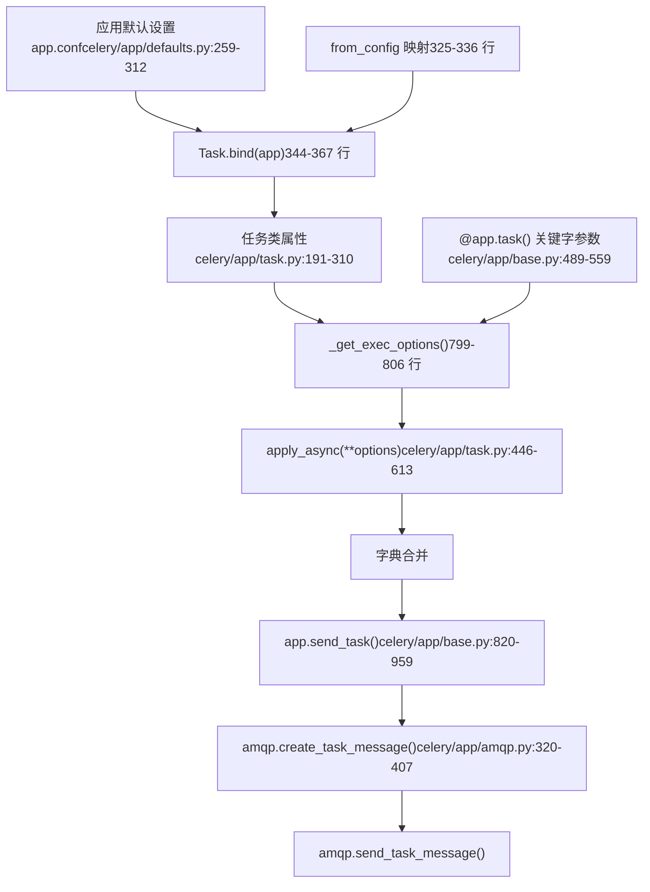
**优先级链**：配置默认值会被任务类属性覆盖，任务类属性会被装饰器参数覆盖，装饰器参数会被 `apply_async()` 选项覆盖。`Task.bind(app)` 方法 [celery/app/task.py344-367](https://github.com/celery/celery/blob/4d068b56/celery/app/task.py#L344-L367) 使用 `from_config` 元组 [celery/app/task.py325-336](https://github.com/celery/celery/blob/4d068b56/celery/app/task.py#L325-L336) 将配置默认值应用于任务属性。

**来源**：[celery/app/task.py325-368](https://github.com/celery/celery/blob/4d068b56/celery/app/task.py#L325-L368) [celery/app/task.py799-806](https://github.com/celery/celery/blob/4d068b56/celery/app/task.py#L799-L806) [celery/app/base.py489-608](https://github.com/celery/celery/blob/4d068b56/celery/app/base.py#L489-L608) [celery/app/base.py820-959](https://github.com/celery/celery/blob/4d068b56/celery/app/base.py#L820-L959) [celery/app/amqp.py320-407](https://github.com/celery/celery/blob/4d068b56/celery/app/amqp.py#L320-L407)

## 任务选项架构

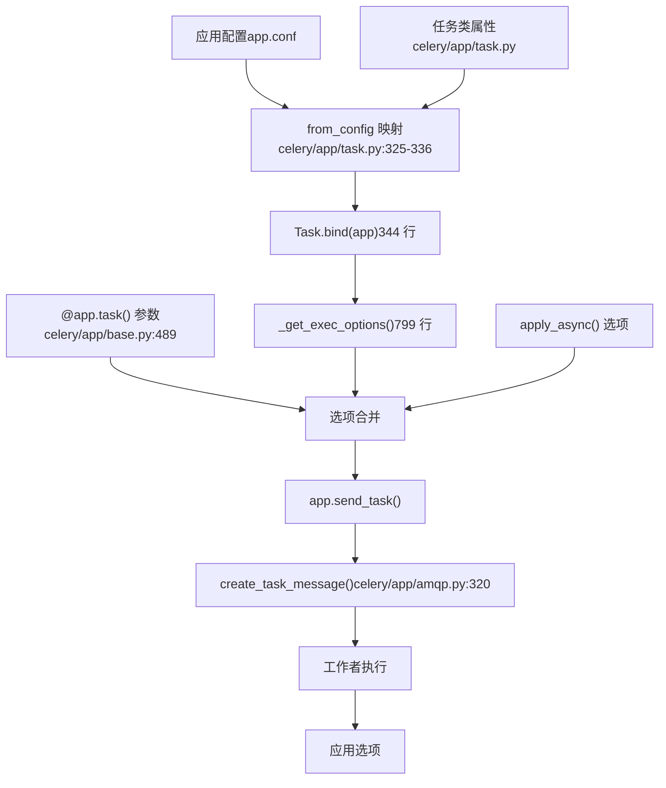
任务选项系统遵循一个优先级链，后序来源会覆盖前序来源：配置 → 任务类 → 装饰器 → `apply_async()`。`Task.bind()` 方法读取配置并相应地设置任务类属性。

**来源**：[celery/app/task.py325-368](https://github.com/celery/celery/blob/4d068b56/celery/app/task.py#L325-L368) [celery/app/task.py799-806](https://github.com/celery/celery/blob/4d068b56/celery/app/task.py#L799-L806) [celery/app/base.py489-608](https://github.com/celery/celery/blob/4d068b56/celery/app/base.py#L489-L608)

## 执行控制选项 (Execution Control Options)

### acks\_late

控制向代理（broker）发送消息确认（acknowledgment）的时机：

| 值 | 确认时机 | 失败行为 |
| --- | --- | --- |
| `False` (默认) | 任务执行前 | 如果工作者崩溃，消息将丢失 |
| `True` | 任务执行后 | 如果工作者崩溃，消息将重新交付 |

**消息确认流 (Message Acknowledgment Flow)**

> **[Mermaid sequence]**
> *(图表结构无法解析)*

配置层级：

```
# 应用范围
app.conf.task_acks_late = True

# 任务类属性
class Task(celery.Task):
    acks_late = True

# 任务装饰器
@app.task(acks_late=True)
def critical_task():
    pass
```
**重要提示**：具有 `acks_late=True` 的任务如果工作者在执行中途崩溃，可能会执行两次。请确保幂等性（idempotency）或与 `reject_on_worker_lost` 结合使用。

**来源**：[celery/app/task.py262-269](https://github.com/celery/celery/blob/4d068b56/celery/app/task.py#L262-L269) [celery/app/defaults.py261](https://github.com/celery/celery/blob/4d068b56/celery/app/defaults.py#L261-L261) [celery/worker/strategy.py](https://github.com/celery/celery/blob/4d068b56/celery/worker/strategy.py) [docs/userguide/tasks.rst28-47](https://github.com/celery/celery/blob/4d068b56/docs/userguide/tasks.rst#L28-L47)

### acks\_on\_failure\_or\_timeout

控制任务失败或超过时间限制时的消息确认。仅在 `acks_late=True` 时有效。

| 值 | 失败/超时行为 | 使用场景 |
| --- | --- | --- |
| `True` (默认) | 确认消息 | 防止重试循环 |
| `False` | 拒绝以重新交付 | 在瞬态错误时自动重试 |

```
@app.task(acks_late=True, acks_on_failure_or_timeout=False)
def auto_retry_task():
    # 失败或超时时消息重新入队
    # 适用于瞬态网络/资源错误
    pass
```
**警告**：如果任务持续失败，设置为 `False` 可能会导致无限重试循环。请结合 `max_retries` 使用或确保是瞬态失败情况。

**来源**：[celery/app/task.py273-280](https://github.com/celery/celery/blob/4d068b56/celery/app/task.py#L273-L280) [celery/app/defaults.py262](https://github.com/celery/celery/blob/4d068b56/celery/app/defaults.py#L262-L262)

### reject\_on\_worker\_lost

控制当工作者进程意外终止（SIGKILL、段错误、OOM）时的消息重新交付。仅在 `acks_late=True` 时适用。

| 值 | 工作者崩溃行为 | 风险 |
| --- | --- | --- |
| `None`/`False` (默认) | 确认消息（任务丢失） | 消息丢失 |
| `True` | 拒绝以重新交付 | 潜在的崩溃循环 |

```
@app.task(acks_late=True, reject_on_worker_lost=True)
def recoverable_task():
    # 如果工作者被 SIGKILL, SIGSEGV, OOM 杀死，则重新入队
    # 在正常停机或任务异常时不会重新入队
    pass
```
**警告**：持续导致工作者崩溃的任务（段错误、OOM）将产生重新交付循环。仅用于由于瞬态系统状况导致崩溃的任务。

**来源**：[celery/app/task.py282-292](https://github.com/celery/celery/blob/4d068b56/celery/app/task.py#L282-L292) [celery/app/defaults.py296](https://github.com/celery/celery/blob/4d068b56/celery/app/defaults.py#L296-L296) [docs/userguide/tasks.rst46-48](https://github.com/celery/celery/blob/4d068b56/docs/userguide/tasks.rst#L46-L48)

### track\_started

控制任务在开始执行时是否向结果后端报告 `STARTED` 状态。

| 值 | 状态报告 | 后端 I/O | 使用场景 |
| --- | --- | --- | --- |
| `False` (默认) | PENDING → SUCCESS/FAILURE | 极小 | 标准任务 |
| `True` | PENDING → STARTED → SUCCESS/FAILURE | 增加 | 长时间运行的任务，进度监控 |

**状态转换图**

配置：

```
# 应用范围
app.conf.task_track_started = True

# 针对每个任务
@app.task(track_started=True)
def long_running_task():
    # result.state == 'STARTED' 立即变为可见
    pass
```
**影响**：启用此项会为每个任务向结果后端增加一次额外的写入。适用于显示活跃任务执行情况的监控面板。

**来源**：[celery/app/task.py247-258](https://github.com/celery/celery/blob/4d068b56/celery/app/task.py#L247-L258) [celery/app/defaults.py310](https://github.com/celery/celery/blob/4d068b56/celery/app/defaults.py#L310-L310) [celery/backends/base.py](https://github.com/celery/celery/blob/4d068b56/celery/backends/base.py)

## 结果存储选项 (Result Storage Options)

### ignore\_result

控制任务返回值的结果后端存储。

| 值 | 后端存储 | 内存影响 | 使用场景 |
| --- | --- | --- | --- |
| `False` (默认) | 存储结果 | 产生结果后端条目 | 工作流，RPC 风格的任务 |
| `True` | 丢弃结果 | 无存储 | 即发即弃 (Fire-and-forget)，事件触发器 |

配置优先级：

```
# 应用范围默认值
app.conf.task_ignore_result = True

# 任务定义（覆盖配置）
@app.task(ignore_result=True)
def background_job():
    send_email()

# 调用时（覆盖任务）
result = background_job.apply_async(ignore_result=False)
```
**实现**：`ignore_result` 标志会被传递给 `backend.store_result()` [celery/backends/base.py](https://github.com/celery/celery/blob/4d068b56/celery/backends/base.py)，并在写入存储前进行检查。

**来源**：[celery/app/task.py210-213](https://github.com/celery/celery/blob/4d068b56/celery/app/task.py#L210-L213) [celery/app/defaults.py281](https://github.com/celery/celery/blob/4d068b56/celery/app/defaults.py#L281-L281) [celery/app/base.py820-959](https://github.com/celery/celery/blob/4d068b56/celery/app/base.py#L820-L959)

### store\_errors\_even\_if\_ignored

即使在 `ignore_result=True` 时也存储错误信息：

```
@app.task(ignore_result=True, store_errors_even_if_ignored=True)
def monitored_fire_and_forget():
    # 成功结果被忽略，但存储错误以便调试
    pass
```
**来源**：[celery/app/task.py228-230](https://github.com/celery/celery/blob/4d068b56/celery/app/task.py#L228-L230) [celery/app/defaults.py309](https://github.com/celery/celery/blob/4d068b56/celery/app/defaults.py#L309-L309)

### trail (踪迹)

控制是否追踪子任务结果：

| 值 | 行为 |
| --- | --- |
| `True` (默认) | 在 `request.children` 中追踪子任务 |
| `False` | 不追踪子任务 |

适用于具有大量子任务的工作流：

```
@app.task(bind=True, trail=True)
def parent_task(self):
    for i in range(10):
        child_task.delay(i)
    # self.request.children 将包含所有子任务 ID
```
**来源**：[celery/app/task.py214-218](https://github.com/celery/celery/blob/4d068b56/celery/app/task.py#L214-L218)

## 序列化选项 (Serialization Options)

### serializer (序列化器)

为任务参数和结果指定消息体序列化格式。

| 序列化器 | 速度 | 大小 | 类型支持 | 安全性 | 使用场景 |
| --- | --- | --- | --- | --- | --- |
| `json` (默认) | 快 | 中 | 有限 (JSON 类型) | 安全 | 通用 |
| `pickle` | 慢 | 大 | 全 Python 类型 | **不安全** | 复杂对象，受信网络 |
| `yaml` | 慢 | 中 | 类 JSON | 安全 | 配置，调试 |
| `msgpack` | 最快 | 最小 | 扩展类型 | 安全 | 高吞吐量 |

**序列化流水线 (Serialization Pipeline)**

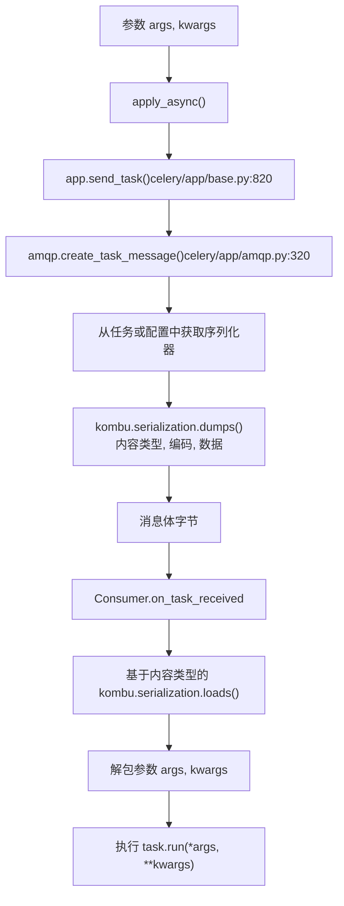
配置层级：

```
# 应用范围
app.conf.task_serializer = 'json'
app.conf.accept_content = ['json']  # 安全性：拒绝 pickle

# 任务类
@app.task(serializer='msgpack')
def high_throughput_task(data):
    pass

# 调用
task.apply_async(args=[data], serializer='json')
```
**安全性**：Pickle 反序列化会执行任意代码。请使用 `app.conf.accept_content` 限制接受的格式。有关 `DEFAULT_ACCEPT_CONTENT` 请参阅 [celery/app/defaults.py67](https://github.com/celery/celery/blob/4d068b56/celery/app/defaults.py#L67-L67)。

**来源**：[celery/app/task.py232-234](https://github.com/celery/celery/blob/4d068b56/celery/app/task.py#L232-L234) [celery/app/defaults.py302](https://github.com/celery/celery/blob/4d068b56/celery/app/defaults.py#L302-L302) [celery/app/amqp.py320-407](https://github.com/celery/celery/blob/4d068b56/celery/app/amqp.py#L320-L407) [kombu/serialization.py](https://github.com/celery/celery/blob/4d068b56/kombu/serialization.py)

### compression (压缩)

在通过 `kombu.compression` 进行代理传输前压缩消息体。

| 方法 | 压缩率 | CPU 开销 | 网络 I/O | 使用场景 |
| --- | --- | --- | --- | --- |
| `None` (默认) | 1:1 | 极小 | 高 | 小消息，快速网络 |
| `zlib` | 中 | 低 | 中 | 通用 |
| `gzip` | 高 | 中 | 低 | 大消息 |
| `bzip2` | 最高 | 高 | 最低 | 最大压缩，可接受较慢的 CPU |

配置：

```
# 应用范围
app.conf.task_compression = 'gzip'

# 针对每个任务 (通过 extract_exec_options 提取)
@app.task(compression='bzip2')
def large_payload_task(dataset):
    pass

# 针对单次调用
task.apply_async(args=[data], compression='zlib')
```
**实现**：压缩在代理传输前的 `kombu.Producer.publish()` 中应用。`compression` 标头指示算法，允许在工作者端自动解压。

**来源**：[celery/app/task.py28-32](https://github.com/celery/celery/blob/4d068b56/celery/app/task.py#L28-L32) [celery/app/defaults.py265](https://github.com/celery/celery/blob/4d068b56/celery/app/defaults.py#L265-L265) [kombu/compression.py](https://github.com/celery/celery/blob/4d068b56/kombu/compression.py)

## 参数校验 (Argument Validation)

### typing 选项

`typing` 选项支持根据函数签名自动进行参数检查：

| 值 | 行为 | 默认值 |
| --- | --- | --- |
| `True` | 检查参数是否匹配签名 | `app.strict_typing` |
| `False` | 跳过参数检查 | \- |
| `None` | 使用应用默认设置 | `app.strict_typing` |

```
# 应用范围
app = Celery('myapp', strict_typing=True)

# 任务层级
@app.task(typing=False)
def lenient_task(x, y):
    # 不进行参数检查
    pass

# 在启用类型检查时 (默认)：
add.delay(2)  # 抛出 TypeError: 缺失必要参数

# 在禁用类型检查时：
lenient_task.delay(2)  # 无错误，工作者将在运行时失败
```
**实现**：参数检查发生在 `Task.apply_async()` [celery/app/task.py567-574](https://github.com/celery/celery/blob/4d068b56/celery/app/task.py#L567-L574) 中，使用了由 `head_from_fun()` [celery/utils/functional.py](https://github.com/celery/celery/blob/4d068b56/celery/utils/functional.py) 创建的 `__header__` 属性。

**来源**：[celery/app/task.py191-195](https://github.com/celery/celery/blob/4d068b56/celery/app/task.py#L191-L195) [celery/app/task.py567-574](https://github.com/celery/celery/blob/4d068b56/celery/app/task.py#L567-L574) [celery/app/base.py347-351](https://github.com/celery/celery/blob/4d068b56/celery/app/base.py#L347-L351) [docs/userguide/tasks.rst500-542](https://github.com/celery/celery/blob/4d068b56/docs/userguide/tasks.rst#L500-L542)

### Pydantic 集成

Celery 使用 Pydantic 模型提供自动校验和序列化。

**配置参数**

| 参数 | 类型 | 默认值 | 描述 |
| --- | --- | --- | --- |
| `pydantic` | `bool` | `False` | 启用 Pydantic 包装器 |
| `pydantic_strict` | `bool` | `True` | 使用严格校验模式 |
| `pydantic_context` | `Dict` | `None` | 传递给校验器的上下文 |
| `pydantic_dump_kwargs` | `Dict` | `{'mode': 'json'}` | `model_dump()` 参数 |

**校验流水线 (Validation Pipeline)**

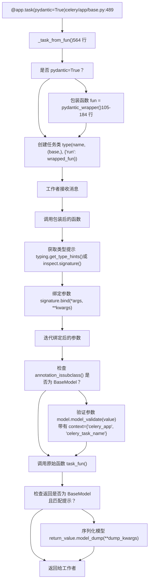
**用法示例**

```
from pydantic import BaseModel

class TaskInput(BaseModel):
    x: int
    y: int

class TaskOutput(BaseModel):
    result: int

@app.task(pydantic=True)
def add(value: TaskInput) -> TaskOutput:
    return TaskOutput(result=value.x + value.y)

# 使用字典调用（自动校验）
result = add.delay({'x': 2, 'y': 3})
result.get()  # {'result': 5}
```
**类型提示解析**：包装器首先尝试 `typing.get_type_hints()` 来解析字符串注解（来自 `from __future__ import annotations`），如果由于循环导入失败，则回退到 `inspect.signature()` [celery/app/base.py131-138](https://github.com/celery/celery/blob/4d068b56/celery/app/base.py#L131-L138)。

**可选类型处理**：`get_optional_arg()` 工具 [celery/utils/annotations.py39-55](https://github.com/celery/celery/blob/4d068b56/celery/utils/annotations.py#L39-L55) 从 `Optional[T]` 注解中提取内部类型，允许 `None` 值而不进行校验。

**校验器中的上下文**

```
from pydantic import field_validator, ValidationInfo

class ValidatedModel(BaseModel):
    value: int

    @field_validator('value')
    @classmethod
    def check_value(cls, v: int, info: ValidationInfo) -> int:
        # 访问 Celery 上下文
        app = info.context['celery_app']
        task_name = info.context['celery_task_name']
        # 自定义校验
        return v

@app.task(
    pydantic=True,
    pydantic_context={'max_value': 100}  # 额外上下文
)
def task(data: ValidatedModel):
    pass
```
**来源**：[celery/app/base.py105-184](https://github.com/celery/celery/blob/4d068b56/celery/app/base.py#L105-L184) [celery/app/base.py564-608](https://github.com/celery/celery/blob/4d068b56/celery/app/base.py#L564-L608) [celery/utils/annotations.py1-70](https://github.com/celery/celery/blob/4d068b56/celery/utils/annotations.py#L1-L70) [t/integration/tasks.py45-56](https://github.com/celery/celery/blob/4d068b56/t/integration/tasks.py#L45-L56) [t/unit/app/test\_app.py1168-1402](https://github.com/celery/celery/blob/4d068b56/t/unit/app/test_app.py#L1168-L1402)

## 自定义任务类 (Custom Task Classes)

自定义任务类通过生命周期钩子和属性自定义来实现专门的行为。

### 基类任务定义

```
import celery

class MyTask(celery.Task):
    """具有钩子的自定义任务基类。"""

    def on_failure(self, exc, task_id, args, kwargs, einfo):
        """当任务失败时调用。"""
        print(f'{task_id} failed: {exc}')

    def on_success(self, retval, task_id, args, kwargs):
        """当任务成功时调用。"""
        print(f'{task_id} succeeded: {retval}')

    def on_retry(self, exc, task_id, args, kwargs, einfo):
        """当任务重试时调用。"""
        print(f'{task_id} retrying: {exc}')

@app.task(base=MyTask)
def custom_task(x, y):
    return x + y
```
### 生命周期钩子参考

**钩子执行流**

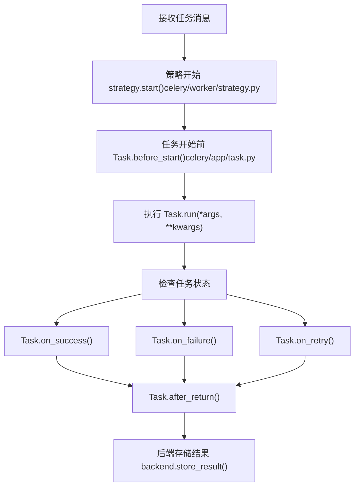
| 钩子方法 | 触发时机 | 参数 | 使用场景 |
| --- | --- | --- | --- |
| `on_bound(app)` | 任务绑定到应用时 | `app` | 初始化应用特定的资源 |
| `before_start(task_id, args, kwargs)` | 执行开始前 | 任务元数据 | 执行前设置，日志记录 |
| `on_success(retval, task_id, args, kwargs)` | 任务成功完成 | 结果 + 元数据 | 成功通知，清理 |
| `on_failure(exc, task_id, args, kwargs, einfo)` | 任务抛出异常 | 异常 + 回溯 | 错误报告，回滚 |
| `on_retry(exc, task_id, args, kwargs, einfo)` | 任务被调度重试 | 异常 + 回溯 | 重试日志，退避调整 |
| `after_return(status, retval, task_id, args, kwargs, einfo)` | 执行后（始终） | 所有元数据 | 通用清理，度量统计 |

**资源管理示例**

```
class DatabaseTask(celery.Task):
    """具有数据库连接管理功能的任务。"""
    _db = None

    @property
    def db(self):
        if self._db is None:
            self._db = create_db_connection()
        return self._db

    def after_return(self, status, retval, task_id, args, kwargs, einfo):
        """任务结束后关闭数据库连接。"""
        if self._db is not None:
            self._db.close()
            self._db = None

@app.task(base=DatabaseTask, bind=True)
def query_database(self, query):
    return self.db.execute(query)
```
### 应用范围的自定义任务类

为所有任务设置默认任务基类：

```
# 方法 1：使用 task_cls 参数
app = celery.Celery('myapp', task_cls='myapp.tasks:MyTask')

# 方法 2：使用 Celery 子类
class MyCelery(celery.Celery):
    task_cls = 'myapp.tasks:MyTask'

app = MyCelery('myapp')

# 方法 3：使用配置
app.conf.task_cls = 'myapp.tasks:MyTask'
```
**注意**：`_custom_task_cls_used` 标志 [celery/app/base.py334-339](https://github.com/celery/celery/blob/4d068b56/celery/app/base.py#L334-L339) 追踪是否使用了自定义任务类，这会影响某些优化。

**来源**：[celery/app/task.py164-406](https://github.com/celery/celery/blob/4d068b56/celery/app/task.py#L164-L406) [celery/app/task.py369-377](https://github.com/celery/celery/blob/4d068b56/celery/app/task.py#L369-L377) [celery/app/base.py295](https://github.com/celery/celery/blob/4d068b56/celery/app/base.py#L295-L295) [celery/app/base.py334-340](https://github.com/celery/celery/blob/4d068b56/celery/app/base.py#L334-L340) [docs/userguide/tasks.rst167-184](https://github.com/celery/celery/blob/4d068b56/docs/userguide/tasks.rst#L167-L184)

## 完整选项参考 (Complete Options Reference)

### 任务类属性 (Task Class Attributes)

在 [celery/app/task.py188-336](https://github.com/celery/celery/blob/4d068b56/celery/app/task.py#L188-L336) 中可配置为任务类属性的选项：

| 属性 | 类型 | 默认值 | 配置键 | 描述 |
| --- | --- | --- | --- | --- |
| `name` | `str` | 自动生成 | \- | 唯一任务标识符 |
| `typing` | `bool` | `None` → `app.strict_typing` | \- | 启用参数校验 |
| `max_retries` | `int` | `3` | \- | 最大重试次数 |
| `default_retry_delay` | `int` | `180` (3 分钟) | \- | 重试间隔秒数 |
| `rate_limit` | `str` | `None` | `task_default_rate_limit` | 速率限制 (例如 `'100/m'`) |
| `ignore_result` | `bool` | `None` → `False` | `task_ignore_result` | 跳过结果存储 |
| `trail` | `bool` | `True` | \- | 追踪子任务 ID |
| `send_events` | `bool` | `True` | \- | 发送监控事件 |
| `store_errors_even_if_ignored` | `bool` | `None` → `False` | `task_store_errors_even_if_ignored` | 即使 `ignore_result=True` 也存储错误 |
| `serializer` | `str` | `None` → `'json'` | `task_serializer` | 消息序列化器 |
| `time_limit` | `float` | `None` | `task_time_limit` | 硬性时间限制（秒） |
| `soft_time_limit` | `float` | `None` | `task_soft_time_limit` | 软性时间限制（秒） |
| `track_started` | `bool` | `None` → `False` | `task_track_started` | 报告 STARTED 状态 |
| `acks_late` | `bool` | `None` → `False` | `task_acks_late` | 执行后确认消息 |
| `acks_on_failure_or_timeout` | `bool` | `None` → `True` | `task_acks_on_failure_or_timeout` | 在失败/超时时确认消息 |
| `reject_on_worker_lost` | `bool` | `None` → `None` | `task_reject_on_worker_lost` | 工作者崩溃时重新入队 |
| `throws` | `tuple` | `()` | \- | 预期异常类型 |
| `expires` | `float`/`datetime` | `None` | \- | 任务过期时间 |
| `priority` | `int` | `None` | `task_default_priority` | 任务优先级 (0-9) |
| `resultrepr_maxsize` | `int` | `1024` | \- | 结果表现形式的最大长度 |

### 执行选项 (Execution Options)

可通过 `extract_exec_options()` [celery/app/task.py28-32](https://github.com/celery/celery/blob/4d068b56/celery/app/task.py#L28-L32) 提取用于消息发布的选项：

| 选项 | 来源 | 用途 |
| --- | --- | --- |
| `queue` | 任务属性/调用 | 路由 |
| `routing_key` | 任务属性/调用 | AMQP 路由 |
| `exchange` | 任务属性/调用 | AMQP 交换机 |
| `priority` | 任务属性/调用 | 消息优先级 |
| `expires` | 任务属性/调用 | 消息生存时间 (TTL) |
| `serializer` | 任务属性/调用 | 序列化 |
| `delivery_mode` | 任务属性/调用 | 持久化 (1=瞬态, 2=持久) |
| `compression` | 任务属性/调用 | 消息压缩 |
| `time_limit` | 任务属性/调用 | 工作者时间限制 |
| `soft_time_limit` | 任务属性/调用 | 工作者软性限制 |

### 配置映射

`from_config` 元组 [celery/app/task.py325-336](https://github.com/celery/celery/blob/4d068b56/celery/app/task.py#L325-L336) 将配置键映射到任务属性：

```
from_config = (
    ('serializer', 'task_serializer'),
    ('rate_limit', 'task_default_rate_limit'),
    ('priority', 'task_default_priority'),
    ('track_started', 'task_track_started'),
    ('acks_late', 'task_acks_late'),
    ('acks_on_failure_or_timeout', 'task_acks_on_failure_or_timeout'),
    ('reject_on_worker_lost', 'task_reject_on_worker_lost'),
    ('ignore_result', 'task_ignore_result'),
    ('store_eager_result', 'task_store_eager_result'),
    ('store_errors_even_if_ignored', 'task_store_errors_even_if_ignored'),
)
```
在 `Task.bind(app)` [celery/app/task.py344-356](https://github.com/celery/celery/blob/4d068b56/celery/app/task.py#L344-L356) 期间应用于值为 `None` 的属性。

**来源**：[celery/app/task.py188-336](https://github.com/celery/celery/blob/4d068b56/celery/app/task.py#L188-L336) [celery/app/task.py325-336](https://github.com/celery/celery/blob/4d068b56/celery/app/task.py#L325-L336) [celery/app/task.py28-32](https://github.com/celery/celery/blob/4d068b56/celery/app/task.py#L28-L32) [celery/app/defaults.py259-312](https://github.com/celery/celery/blob/4d068b56/celery/app/defaults.py#L259-L312)

### 提取执行选项 (Extract Execution Options)

`celery.app.task.extract_exec_options` 函数从任务属性中提取消息发布选项：

```
from celery.app.task import extract_exec_options

task = app.tasks['myapp.add']
options = extract_exec_options(task)
# 返回: {
#     'queue': ..., 'routing_key': ..., 'exchange': ...,
#     'priority': ..., 'expires': ..., 'serializer': ...,
#     'delivery_mode': ..., 'compression': ...,
#     'time_limit': ..., 'soft_time_limit': ...,
# }
```
**来源**：[celery/app/task.py27-32](https://github.com/celery/celery/blob/4d068b56/celery/app/task.py#L27-L32)

## 配置集成

任务选项通过 `from_config` 元组与 Celery 的配置系统集成：

```
# 在 celery/app/task.py 中
from_config = (
    ('serializer', 'task_serializer'),
    ('rate_limit', 'task_default_rate_limit'),
    ('priority', 'task_default_priority'),
    ('track_started', 'task_track_started'),
    ('acks_late', 'task_acks_late'),
    ('acks_on_failure_or_timeout', 'task_acks_on_failure_or_timeout'),
    ('reject_on_worker_lost', 'task_reject_on_worker_lost'),
    ('ignore_result', 'task_ignore_result'),
    ('store_eager_result', 'task_store_eager_result'),
    ('store_errors_even_if_ignored', 'task_store_errors_even_if_ignored'),
)
```
当调用 `Task.bind(app)` 时，任务会读取配置值并相应地设置其属性。这发生在任务注册期间。

**图表：配置到任务属性的流向**

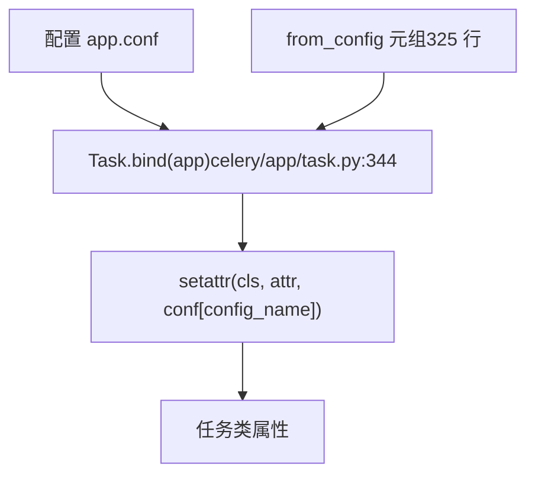
**来源**：[celery/app/task.py325-366](https://github.com/celery/celery/blob/4d068b56/celery/app/task.py#L325-L366) [celery/app/defaults.py259-312](https://github.com/celery/celery/blob/4d068b56/celery/app/defaults.py#L259-L312)

## 配置选项 (Configuration Options)

Pydantic 集成通过带有以下参数的 `@app.task()` 装饰器进行配置：

| 参数 | 类型 | 默认值 | 描述 |
| --- | --- | --- | --- |
| `pydantic` | `bool` | `False` | 启用 Pydantic 校验与序列化 |
| `pydantic_strict` | `bool` | `True` | 使用严格校验模式 |
| `pydantic_context` | `Optional[Dict[str, Any]]` | `None` | 传递给校验器的上下文字典 |
| `pydantic_dump_kwargs` | `Optional[Dict[str, Any]]` | `None` | `model_dump()` 的关键字参数 |

`pydantic_dump_kwargs` 默认为 `{'mode': 'json'}` 以确保与 Celery 的序列化系统兼容。

**来源**：[celery/app/base.py564-574](https://github.com/celery/celery/blob/4d068b56/celery/app/base.py#L564-L574)

## 包装器实现 (Wrapper Implementation)

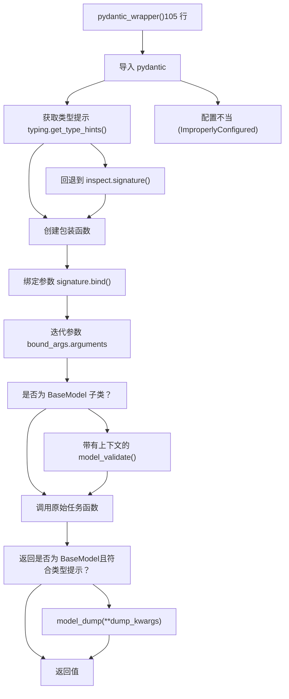
**来源**：[celery/app/base.py105-184](https://github.com/celery/celery/blob/4d068b56/celery/app/base.py#L105-L184)

## 参数校验

包装器通过以下过程验证任务参数：

### 类型提示解析 (Type Hint Resolution)

包装器尝试以两种方式解析类型提示：

1.  **使用 `typing.get_type_hints()`** - 将字符串注解解析为实际类型。
2.  **回退到 `inspect.signature()`** - 如果 get\_type\_hints 失败，则使用原始注解。

这种双重方法可以处理普通类型提示和来自 `from __future__ import annotations` 的字符串注解。

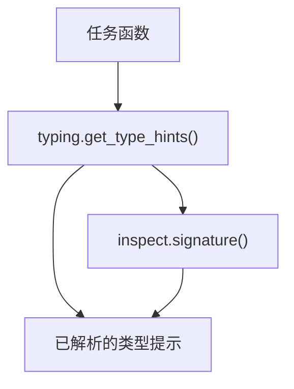
**来源**：[celery/app/base.py131-138](https://github.com/celery/celery/blob/4d068b56/celery/app/base.py#L131-L138)

### 校验步骤

对于每个参数，包装器会：

1.  使用 `inspect.signature.bind()` **绑定参数**，以匹配位置参数和关键字参数。
2.  **检查每个参数的类型注解**。
3.  通过 `get_optional_arg()` 工具提取内部类型来 **处理 Optional 类型**。
4.  通过调用 `model_validate()` **校验 BaseModel 参数**，调用时带有：
    -   参数值
    -   `strict=` 参数（可配置）
    -   包含 `celery_app` 和 `celery_task_name` 的 `context=` 字典

**来源**：[celery/app/base.py139-159](https://github.com/celery/celery/blob/4d068b56/celery/app/base.py#L139-L159) [celery/utils/annotations.py](https://github.com/celery/celery/blob/4d068b56/celery/utils/annotations.py)

### Optional 类型处理

集成妥善处理了 `Optional[Model]` 类型提示：

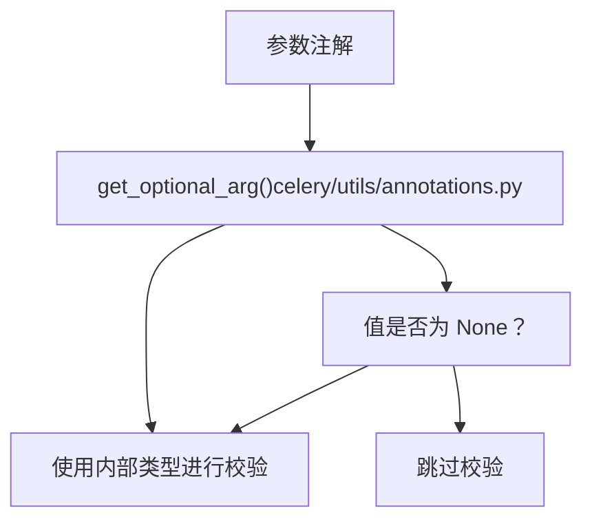
**来源**：[celery/app/base.py149-152](https://github.com/celery/celery/blob/4d068b56/celery/app/base.py#L149-L152) [celery/utils/annotations.py1-38](https://github.com/celery/celery/blob/4d068b56/celery/utils/annotations.py#L1-L38)

## 返回值序列化 (Return Value Serialization)

任务函数执行后，包装器会序列化 Pydantic 模型返回值：

1.  **检查返回类型注解** - 解析返回类型提示。
2.  **处理 Optional 返回类型** - 如果是 Optional，则提取内部类型。
3.  **校验返回值** - 检查该值是否为与类型提示匹配的 BaseModel 实例。
4.  **序列化为字典** - 调用 `model_dump(**dump_kwargs)`，默认使用 mode='json'。

仅在以下情况发生序列化：

-   返回注解是一个类（使用 `annotation_is_class()` 检查）。
-   返回的值是 `BaseModel` 的一个实例。
-   返回的值是带注解的返回类型的一个实例。

**来源**：[celery/app/base.py163-181](https://github.com/celery/celery/blob/4d068b56/celery/app/base.py#L163-L181)

## 上下文与校验器 (Context and Validators)

Pydantic 校验器可以通过 `context` 参数访问 Celery 特定的上下文：

### 内置上下文值

包装器会自动添加：

-   `celery_app` - Celery 应用实例。
-   `celery_task_name` - 正在执行的任务名称。

这些可以通过 `pydantic_context` 参数与用户提供的上下文合并。

### 校验器用法示例

```
from pydantic import BaseModel, field_validator, ValidationInfo

class MyModel(BaseModel):
    value: int

    @field_validator('value')
    @classmethod
    def check_value(cls, v: int, info: ValidationInfo) -> int:
        # 访问 Celery 上下文
        app = info.context.get('celery_app')
        task_name = info.context.get('celery_task_name')
        # 自定义校验逻辑
        return v
```
**来源**：[celery/app/base.py154-158](https://github.com/celery/celery/blob/4d068b56/celery/app/base.py#L154-L158) [t/unit/app/test\_app.py1346-1402](https://github.com/celery/celery/blob/4d068b56/t/unit/app/test_app.py#L1346-L1402)

## 字符串注解支持 (String Annotations Support)

集成支持来自 `from __future__ import annotations` 的字符串注解：

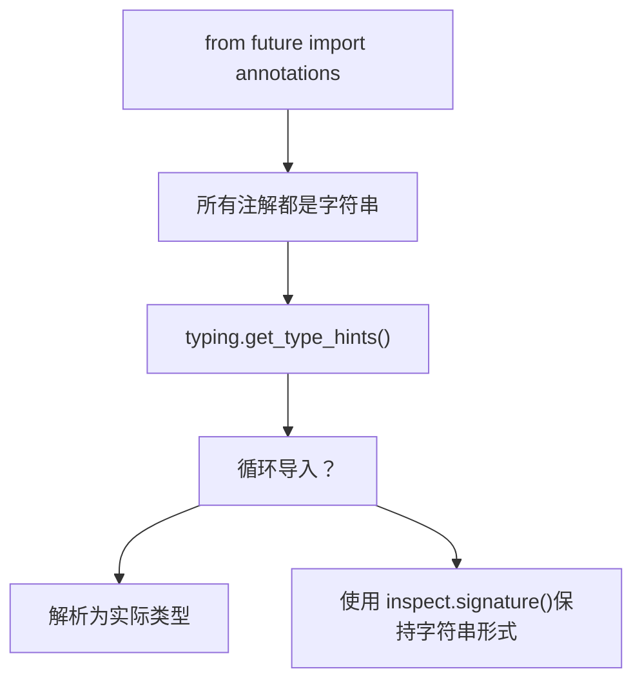
当 `get_type_hints()` 由于循环导入或 `NameError` 失败时，包装器会回退到使用来自 `inspect.signature()` 的原始注解。在许多情况下，Pydantic 仍然可以针对字符串注解进行校验。

**来源**：[celery/app/base.py131-138](https://github.com/celery/celery/blob/4d068b56/celery/app/base.py#L131-L138) [t/integration/tasks.py51-56](https://github.com/celery/celery/blob/4d068b56/t/integration/tasks.py#L51-L56) [t/unit/app/test\_app.py1282-1294](https://github.com/celery/celery/blob/4d068b56/t/unit/app/test_app.py#L1282-L1294)

## 用法示例

### 基本用法

定义 Pydantic 模型并注解任务参数：

```
from pydantic import BaseModel
from celery import Celery

app = Celery()

class AddModel(BaseModel):
    x: int
    y: int

class AddResultModel(BaseModel):
    result: int

@app.task(pydantic=True)
def add(value: AddModel) -> AddResultModel:
    return AddResultModel(result=value.x + value.y)

# 用法
result = add.delay({'x': 1, 'y': 2})
result.get()  # 返回 {'result': 3}
```
**来源**：[t/integration/tasks.py45-50](https://github.com/celery/celery/blob/4d068b56/t/integration/tasks.py#L45-L50)

### 严格模式 (Strict Mode)

控制校验严格程度：

```
@app.task(pydantic=True, pydantic_strict=False)
def lenient_task(value: MyModel) -> MyModel:
    return value
```
在 `pydantic_strict=False` 时，类型强制转换更为宽松（例如，字符串转整数）。

**来源**：[celery/app/base.py571](https://github.com/celery/celery/blob/4d068b56/celery/app/base.py#L571-L571) [t/unit/app/test\_app.py1215-1240](https://github.com/celery/celery/blob/4d068b56/t/unit/app/test_app.py#L1215-L1240)

### 自定义上下文

向校验器传递上下文：

```
@app.task(
    pydantic=True,
    pydantic_context={'max_value': 100}
)
def validated_task(value: MyModel) -> ResultModel:
    return ResultModel(result=value.compute())
```
**来源**：[celery/app/base.py572](https://github.com/celery/celery/blob/4d068b56/celery/app/base.py#L572-L572) [t/unit/app/test\_app.py1346-1402](https://github.com/celery/celery/blob/4d068b56/t/unit/app/test_app.py#L1346-L1402)

### 自定义序列化

控制 `model_dump()` 行为：

```
@app.task(
    pydantic=True,
    pydantic_dump_kwargs={
        'mode': 'json',
        'exclude_none': True,
        'by_alias': True
    }
)
def custom_dump_task(value: InputModel) -> OutputModel:
    return OutputModel(data=value.process())
```
**来源**：[celery/app/base.py573](https://github.com/celery/celery/blob/4d068b56/celery/app/base.py#L573-L573) [celery/app/base.py125](https://github.com/celery/celery/blob/4d068b56/celery/app/base.py#L125-L125)

## 与任务系统集成

Pydantic 包装器在 `_task_from_fun()` 中的任务注册期间应用：

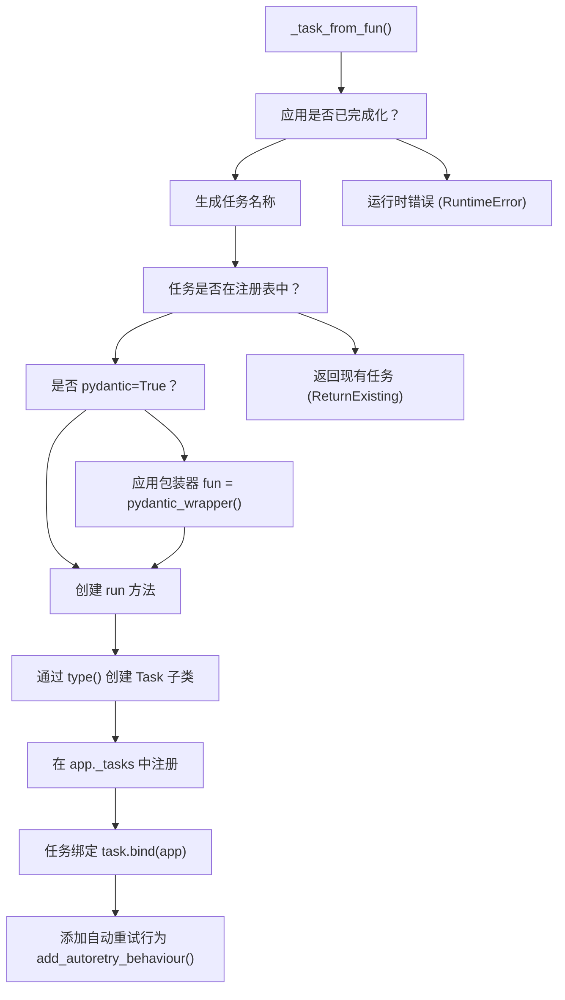
包装器在任务类创建之前应用，因此所有的任务功能（重试、速率限制、时间限制等）对于经 Pydantic 校验的任务均能正常工作。

**来源**：[celery/app/base.py564-608](https://github.com/celery/celery/blob/4d068b56/celery/app/base.py#L564-L608)

## 错误处理

### 导入错误 (Import Error)

如果未安装 Pydantic：

```
try:
    pydantic = importlib.import_module('pydantic')
except ModuleNotFoundError as ex:
    raise ImproperlyConfigured(
        '您需要安装 pydantic 才能使用 pydantic 模型序列化。'
    ) from ex
```
**来源**：[celery/app/base.py114-117](https://github.com/celery/celery/blob/4d068b56/celery/app/base.py#L114-L117)

### 校验错误 (Validation Errors)

Pydantic 校验错误会作为普通的 Python 异常传播，Celery 根据任务的错误处理配置（重试、忽略等）对其进行处理。

**来源**：[t/unit/app/test\_app.py1241-1263](https://github.com/celery/celery/blob/4d068b56/t/unit/app/test_app.py#L1241-L1263)

## 实现细节

### 类型检查工具

集成使用了来自 `celery/utils/annotations.py` 的工具函数：

| 函数 | 目的 |
| --- | --- |
| `get_optional_arg()` | 从 `Optional[T]` 中提取内部类型 |
| `annotation_is_class()` | 检查注解是否为类（非字符串或泛型） |
| `annotation_issubclass()` | 安全地检查注解的子类关系 |

**来源**：[celery/utils/annotations.py1-70](https://github.com/celery/celery/blob/4d068b56/celery/utils/annotations.py#L1-L70)

### 签名保留 (Signature Preservation)

包装器使用 `@functools.wraps(task_fun)` 来保留：

-   函数名 (`__name__`)
-   文档字符串 (`__doc__`)
-   模块 (`__module__`)
-   注解 (`__annotations__`)

这确保了正确的任务内省（introspection）和文档生成。

**来源**：[celery/app/base.py139](https://github.com/celery/celery/blob/4d068b56/celery/app/base.py#L139-L139)

### 线程安全 (Thread Safety)

Pydantic 校验和序列化操作是线程安全的，因为：

-   每次任务调用都会创建一个新的绑定参数对象。
-   Pydantic 模型默认是不可变的。
-   校验/序列化期间不会修改共享状态。

**来源**：[celery/app/base.py140-181](https://github.com/celery/celery/blob/4d068b56/celery/app/base.py#L140-L181)

## 测试

该集成包含全面的测试：

### 单元测试

位于 `t/unit/app/test_app.py`：

-   基础校验与序列化
-   可选参数处理
-   字符串注解支持
-   严格模式行为
-   自定义上下文传递
-   校验错误案例
-   多参数校验
-   返回值类型检查

**来源**：[t/unit/app/test\_app.py1168-1402](https://github.com/celery/celery/blob/4d068b56/t/unit/app/test_app.py#L1168-L1402)

### 集成测试

位于 `t/integration/test_tasks.py`：

-   使用 Pydantic 模型的端到端任务执行
-   工作者处理 Pydantic 任务
-   已序列化值的结果后端存储

**来源**：[t/integration/test\_tasks.py133-159](https://github.com/celery/celery/blob/4d068b56/t/integration/test_tasks.py#L133-L159) [t/integration/tasks.py45-56](https://github.com/celery/celery/blob/4d068b56/t/integration/tasks.py#L45-L56)
