# 工作流原语 (Workflow Primitives)

相关源文件

-   [celery/app/amqp.py](https://github.com/celery/celery/blob/4d068b56/celery/app/amqp.py)
-   [celery/app/base.py](https://github.com/celery/celery/blob/4d068b56/celery/app/base.py)
-   [celery/app/task.py](https://github.com/celery/celery/blob/4d068b56/celery/app/task.py)
-   [celery/canvas.py](https://github.com/celery/celery/blob/4d068b56/celery/canvas.py)
-   [celery/utils/\_\_init\_\_.py](https://github.com/celery/celery/blob/4d068b56/celery/utils/__init__.py)
-   [docs/userguide/canvas.rst](https://github.com/celery/celery/blob/4d068b56/docs/userguide/canvas.rst)
-   [t/integration/conftest.py](https://github.com/celery/celery/blob/4d068b56/t/integration/conftest.py)
-   [t/integration/tasks.py](https://github.com/celery/celery/blob/4d068b56/t/integration/tasks.py)
-   [t/integration/test\_canvas.py](https://github.com/celery/celery/blob/4d068b56/t/integration/test_canvas.py)
-   [t/integration/test\_quorum\_queue\_qos\_cluster\_simulation.py](https://github.com/celery/celery/blob/4d068b56/t/integration/test_quorum_queue_qos_cluster_simulation.py)
-   [t/integration/test\_security.py](https://github.com/celery/celery/blob/4d068b56/t/integration/test_security.py)
-   [t/integration/test\_tasks.py](https://github.com/celery/celery/blob/4d068b56/t/integration/test_tasks.py)
-   [t/smoke/tests/test\_canvas.py](https://github.com/celery/celery/blob/4d068b56/t/smoke/tests/test_canvas.py)
-   [t/unit/app/test\_app.py](https://github.com/celery/celery/blob/4d068b56/t/unit/app/test_app.py)
-   [t/unit/tasks/test\_canvas.py](https://github.com/celery/celery/blob/4d068b56/t/unit/tasks/test_canvas.py)
-   [t/unit/tasks/test\_tasks.py](https://github.com/celery/celery/blob/4d068b56/t/unit/tasks/test_tasks.py)

## 目的与范围

本页面记录了支持在 Celery 中构建复杂任务执行模式的 Canvas 工作流原语。这些原语允许将任务组合成具有并行执行、顺序链式调用、同步点和批量处理能力的工作流。

有关基本任务调用和签名的信息，请参阅[任务定义与调用](/celery/celery/3.1-task-definition-and-invocation)。有关高级 Canvas 特性（如盖章/stamping 和不可变签名）的信息，请参阅[高级 Canvas 特性](/celery/celery/4.3-advanced-canvas-features)。有关 chord 特定实现细节的信息，请参阅[Chord 执行与优化](/celery/celery/4.4-chord-execution)。

## Canvas 原语概览

Canvas 提供了六种用于工作流构建的基础原语：

| 原语 | 用途 | 结果类型 | 示例使用场景 |
| --- | --- | --- | --- |
| `signature` | 使用参数/关键字参数/选项包装任务 | `Signature` | 创建可复用的任务模板 |
| `chain` | 带有结果传递的顺序执行 | `AsyncResult` | 多步骤数据转换 |
| `group` | 独立任务的并行执行 | `GroupResult` | 扇出 (Fan-out) 处理 |
| `chord` | 带有回调的并行执行 | `AsyncResult` | Map-reduce 操作 |
| `chunks` | 带有分区的批量处理 | `GroupResult` | 处理大型数据集 |
| `map`/`starmap` | 对可迭代参数应用任务 | `AsyncResult` | 迭代转换 |

**来源：** [celery/canvas.py36-39](https://github.com/celery/celery/blob/4d068b56/celery/canvas.py#L36-L39) [docs/userguide/canvas.rst250-306](https://github.com/celery/celery/blob/4d068b56/docs/userguide/canvas.rst#L250-L306)

---

## 原语关系

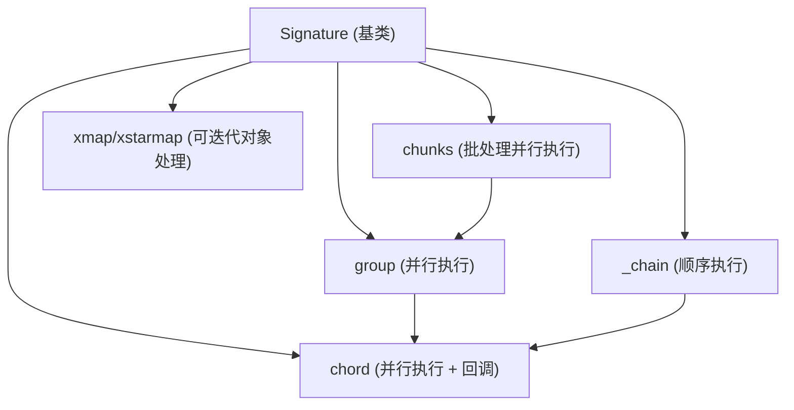
**来源：** [celery/canvas.py232-287](https://github.com/celery/celery/blob/4d068b56/celery/canvas.py#L232-L287) [celery/canvas.py1389-1400](https://github.com/celery/celery/blob/4d068b56/celery/canvas.py#L1389-L1400) [celery/canvas.py1568-1580](https://github.com/celery/celery/blob/4d068b56/celery/canvas.py#L1568-L1580)

---

## Signature：基石

`Signature` 类是所有 Canvas 原语的基础。它以可序列化的形式封装了任务调用及其参数、关键字参数和执行选项。

### 核心 Signature 属性

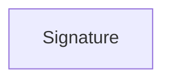
**来源：** [celery/canvas.py232-287](https://github.com/celery/celery/blob/4d068b56/celery/canvas.py#L232-L287)

### 创建签名 (Creating Signatures)

签名可以通过多种方式创建：

1.  **使用 `signature()` 工厂函数：**

    ```
    signature('tasks.add', args=(2, 2), countdown=10)
    ```

2.  **使用任务的 `.s()` 方法（快捷方式）：**

    ```
    add.s(2, 2)
    ```

3.  **使用任务的 `.si()` 方法（不可变）：**

    ```
    add.si(2, 2)  # 参数无法更改
    ```

4.  **使用任务的 `.signature()` 方法：**

    ```
    add.signature((2, 2), countdown=10)
    ```


**来源：** [celery/canvas.py309-321](https://github.com/celery/celery/blob/4d068b56/celery/canvas.py#L309-L321) [celery/app/task.py636-658](https://github.com/celery/celery/blob/4d068b56/celery/app/task.py#L636-L658) [docs/userguide/canvas.rst29-72](https://github.com/celery/celery/blob/4d068b56/docs/userguide/canvas.rst#L29-L72)

### Signature 执行方法

| 方法 | 描述 | 返回值 |
| --- | --- | --- |
| `__call__(*args, **kwargs)` | 在当前进程中本地执行任务 | 任务结果 |
| `delay(*args, **kwargs)` | `apply_async` 的快捷方式 | `AsyncResult` |
| `apply(args, kwargs, **options)` | 本地执行任务（同步） | 任务结果 |
| `apply_async(args, kwargs, **options)` | 向工作者发送任务消息 | `AsyncResult` |
| `freeze(_id, group_id, chord, root_id, parent_id)` | 使用任务 ID 完成化 (finalize) | `AsyncResult` |

**来源：** [celery/canvas.py346-401](https://github.com/celery/celery/blob/4d068b56/celery/canvas.py#L346-L401) [celery/canvas.py472-519](https://github.com/celery/celery/blob/4d068b56/celery/canvas.py#L472-L519)

### 偏函数应用与合并

签名支持偏函数应用，可以在其中预置额外的参数：

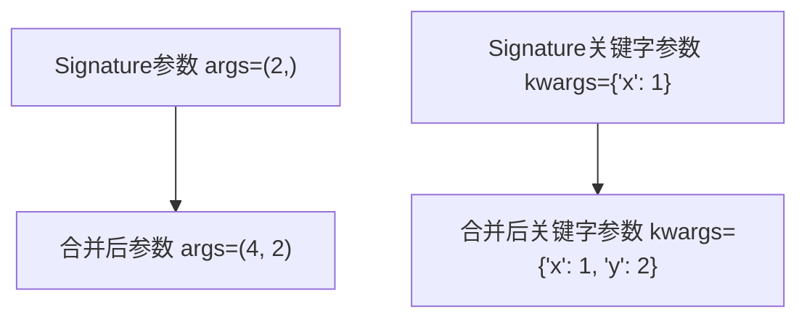
`_merge()` 方法实现了此行为。对于不可变签名，现有的参数/关键字参数会被保留，仅合并选项。

**来源：** [celery/canvas.py402-442](https://github.com/celery/celery/blob/4d068b56/celery/canvas.py#L402-L442)

### 不可变性 (Immutability)

不可变签名防止参数被修改，当回调不应接收父任务的结果时非常有用：

```
# 可变 (默认) - 接收父任务结果
add.apply_async((2, 2), link=log_result.s())

# 不可变 - 不接收父任务结果
add.apply_async((2, 2), link=reset_buffers.si())
```
**来源：** [celery/canvas.py438-442](https://github.com/celery/celery/blob/4d068b56/celery/canvas.py#L438-L442) [docs/userguide/canvas.rst168-190](https://github.com/celery/celery/blob/4d068b56/docs/userguide/canvas.rst#L168-L190)

---

## Chain：顺序执行

`_chain` 类顺序执行任务，将每个任务的结果作为第一个参数传递给下一个任务。

### Chain 结构

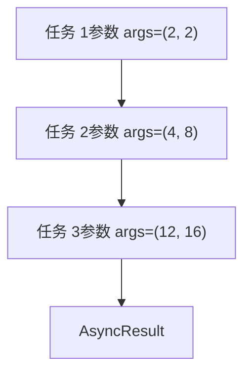
### Chain 实现

链式调用的实现使用了几个关键方法：

| 方法 | 目的 | 位置 |
| --- | --- | --- |
| `__init__(*tasks)` | 使用任务列表初始化链 | [celery/canvas.py1389-1428](https://github.com/celery/celery/blob/4d068b56/celery/canvas.py#L1389-L1428) |
| `unchain_tasks()` | 扁平化嵌套链 | [celery/canvas.py1473-1500](https://github.com/celery/celery/blob/4d068b56/celery/canvas.py#L1473-L1500) |
| `prepare_steps()` | 使用回调链接任务 | [celery/canvas.py1502-1549](https://github.com/celery/celery/blob/4d068b56/celery/canvas.py#L1502-L1549) |
| `apply_async()` | 执行链 | [celery/canvas.py1551-1566](https://github.com/celery/celery/blob/4d068b56/celery/canvas.py#L1551-L1566) |
| `freeze()` | 递归分配任务 ID | [celery/canvas.py1589-1638](https://github.com/celery/celery/blob/4d068b56/celery/canvas.py#L1589-L1638) |

**来源：** [celery/canvas.py1389-1665](https://github.com/celery/celery/blob/4d068b56/celery/canvas.py#L1389-L1665)

### Chain 创建模式

可以使用 `|` 操作符或 `chain()` 函数创建链：

```
# 使用管道操作符
c = add.s(2, 2) | add.s(4) | add.s(8)

# 使用 chain() 构造函数
c = chain(add.s(2, 2), add.s(4), add.s(8))

# 链接到现有链
c1 = add.s(4) | mul.s(2)
c2 = c1 | add.s(8)  # 追加到现有链
```
**来源：** [celery/canvas.py758-779](https://github.com/celery/celery/blob/4d068b56/celery/canvas.py#L758-L779) [celery/canvas.py1389-1428](https://github.com/celery/celery/blob/4d068b56/celery/canvas.py#L1389-L1428) [t/integration/test\_canvas.py188-207](https://github.com/celery/celery/blob/4d068b56/t/integration/test_canvas.py#L188-L207)

### Chain 执行流

> **[Mermaid sequence]**
> *(图表结构无法解析)*

**来源：** [celery/canvas.py1551-1566](https://github.com/celery/celery/blob/4d068b56/celery/canvas.py#L1551-L1566) [celery/canvas.py1502-1549](https://github.com/celery/celery/blob/4d068b56/celery/canvas.py#L1502-L1549)

### Chain 中的错误处理

当链中的某个任务失败时，后续任务将不会执行：

```
# 带有错误处理的链
c = chain(
    add.s(1, 2),
    fail.s(),  # 此任务抛出异常
    add.s(3, 4)  # 此任务将不执行
)
```
可以附加错误回调来处理失败：

```
c = chain(add.s(1, 2), fail.s(), add.s(3, 4))
c.link_error(handle_error.s())
```
**来源：** [t/integration/test\_canvas.py227-244](https://github.com/celery/celery/blob/4d068b56/t/integration/test_canvas.py#L227-L244) [celery/canvas.py715-732](https://github.com/celery/celery/blob/4d068b56/celery/canvas.py#L715-L732)

---

## Group：并行执行

`group` 类并行执行任务，返回一个收集所有任务结果的 `GroupResult`。

### Group 结构

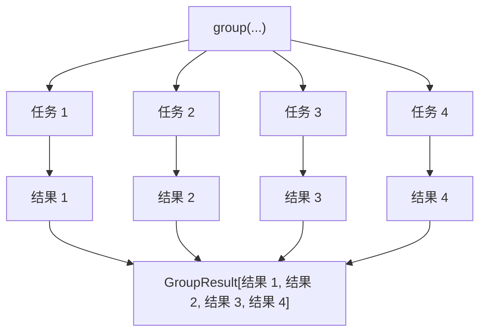
### Group 实现

| 方法 | 目的 | 位置 |
| --- | --- | --- |
| `__init__(*tasks)` | 使用任务列表初始化 | [celery/canvas.py1038-1082](https://github.com/celery/celery/blob/4d068b56/celery/canvas.py#L1038-L1082) |
| `apply_async()` | 并行执行所有任务 | [celery/canvas.py1179-1221](https://github.com/celery/celery/blob/4d068b56/celery/canvas.py#L1179-L1221) |
| `freeze()` | 分配 group\_id 和任务 ID | [celery/canvas.py1261-1316](https://github.com/celery/celery/blob/4d068b56/celery/canvas.py#L1261-L1316) |
| `set_immutable()` | 使所有任务不可变 | [celery/canvas.py1147-1151](https://github.com/celery/celery/blob/4d068b56/celery/canvas.py#L1147-L1151) |

**来源：** [celery/canvas.py1011-1387](https://github.com/celery/celery/blob/4d068b56/celery/canvas.py#L1011-L1387)

### Group 创建

```
# 使用 group() 构造函数
g = group(add.s(i, i) for i in range(10))

# 使用签名列表
g = group([add.s(1, 1), add.s(2, 2), add.s(3, 3)])

# 部分参数组接收父结果
result = add.s(5, 5) | group(add.s(1), add.s(2), add.s(3))
# 组内的每个任务都会接收来自 add.s(5, 5) 的结果
```
**来源：** [celery/canvas.py1038-1082](https://github.com/celery/celery/blob/4d068b56/celery/canvas.py#L1038-L1082) [t/integration/test\_canvas.py266-284](https://github.com/celery/celery/blob/4d068b56/t/integration/test_canvas.py#L266-L284)

### Group 结果收集

`GroupResult` 提供了等待并收集所有任务结果的方法：

| 方法 | 描述 |
| --- | --- |
| `get(timeout)` | 等待所有任务，返回结果列表 |
| `ready()` | 检查是否所有任务都已完成 |
| `successful()` | 检查是否所有任务都已成功 |
| `failed()` | 检查是否有任务失败 |
| `join(timeout)` | 等待所有任务（已弃用，请使用 `get()`） |

**来源：** [celery/result.py](https://github.com/celery/celery/blob/4d068b56/celery/result.py) [t/integration/test\_canvas.py369-378](https://github.com/celery/celery/blob/4d068b56/t/integration/test_canvas.py#L369-L378)

### Group 执行流

> **[Mermaid sequence]**
> *(图表结构无法解析)*

**来源：** [celery/canvas.py1179-1221](https://github.com/celery/celery/blob/4d068b56/celery/canvas.py#L1179-L1221) [celery/canvas.py1261-1316](https://github.com/celery/celery/blob/4d068b56/celery/canvas.py#L1261-L1316)

### 带有不可变任务的 Group

当一个组跟在链中的另一个任务之后，但不应接收父任务的结果时：

```
# 可变组 - 接收父任务结果
result = add.s(4, 4) | group(add.s(1), add.s(2))
# 每个任务变为：add(8, 1) 和 add(8, 2)

# 不可变组 - 不接收父任务结果
result = add.s(4, 4) | group(add.si(1, 1), add.si(2, 2))
# 每个任务保持为：add(1, 1) 和 add(2, 2)
```
**来源：** [celery/canvas.py1147-1151](https://github.com/celery/celery/blob/4d068b56/celery/canvas.py#L1147-L1151) [docs/userguide/canvas.rst456-467](https://github.com/celery/celery/blob/4d068b56/docs/userguide/canvas.rst#L456-L467)

---

## Chord：并行执行 + 回调

`chord` 执行一组并行任务（"header"），然后执行一个接收 header 收集结果的回调任务（"body"）。

### Chord 结构

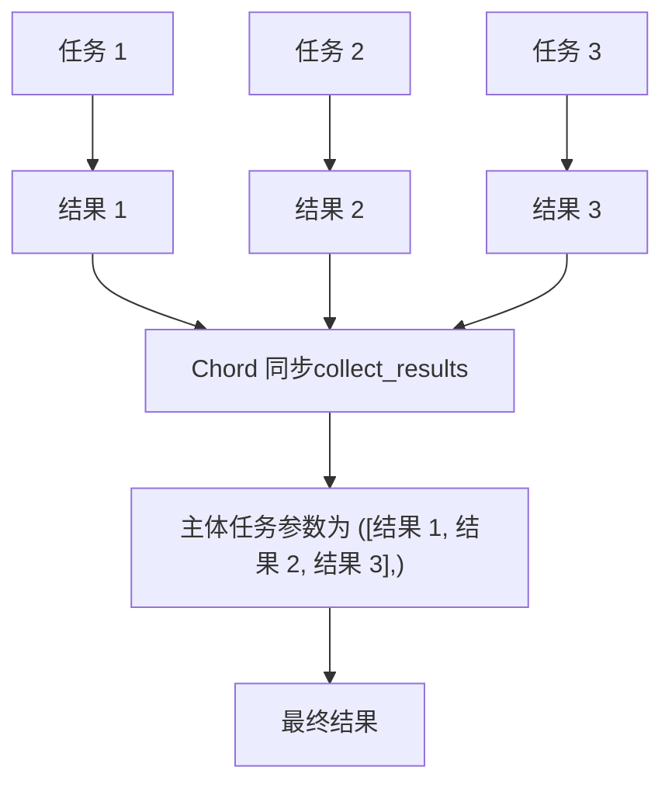
### Chord 实现

| 组件 | 目的 | 位置 |
| --- | --- | --- |
| `chord.__init__()` | 使用 header 和 body 初始化 | [celery/canvas.py1668-1703](https://github.com/celery/celery/blob/4d068b56/celery/canvas.py#L1668-L1703) |
| `chord.apply_async()` | 执行 header 并注册 body | [celery/canvas.py1797-1831](https://github.com/celery/celery/blob/4d068b56/celery/canvas.py#L1797-L1831) |
| `chord.freeze()` | 在 header 选项中设置 chord body | [celery/canvas.py1770-1779](https://github.com/celery/celery/blob/4d068b56/celery/canvas.py#L1770-L1779) |
| 后端同步 | 追踪 header 的完成情况 | [celery/backends/base.py](https://github.com/celery/celery/blob/4d068b56/celery/backends/base.py) |

**来源：** [celery/canvas.py1668-1925](https://github.com/celery/celery/blob/4d068b56/celery/canvas.py#L1668-L1925)

### Chord 创建

```
# 使用 chord() 构造函数
c = chord([add.s(1, 1), add.s(2, 2), add.s(3, 3)], body=tsum.s())

# 使用管道操作符 (group | task 变为 chord)
c = group(add.s(i, i) for i in range(10)) | tsum.s()

# 带有不可变 body 的 Chord
c = chord([task1.s(), task2.s()], body=callback.si())
```
**来源：** [celery/canvas.py1668-1703](https://github.com/celery/celery/blob/4d068b56/celery/canvas.py#L1668-L1703) [docs/userguide/canvas.rst379-406](https://github.com/celery/celery/blob/4d068b56/docs/userguide/canvas.rst#L379-L406)

### Chord 执行流

> **[Mermaid sequence]**
> *(图表结构无法解析)*

**来源：** [celery/canvas.py1797-1831](https://github.com/celery/celery/blob/4d068b56/celery/canvas.py#L1797-L1831) [celery/backends/base.py](https://github.com/celery/celery/blob/4d068b56/celery/backends/base.py)

### Chord 后端要求

Chord 需要后端支持来进行协调：

| 后端 | 原生支持 | 实现方式 |
| --- | --- | --- |
| Redis | 是 | 使用原子操作的原生 join |
| RPC/AMQP | 是 | 基于消息的同步 |
| Database | 是 | 基于行的追踪 |
| Memcached | 否 | 不支持 |
| Cache | 否 | 不支持 |

检查后端是否支持 chord：

```
try:
    app.backend.ensure_chords_allowed()
except NotImplementedError:
    # 不支持 Chord
    pass
```
**来源：** [celery/backends/base.py](https://github.com/celery/celery/blob/4d068b56/celery/backends/base.py) [t/integration/test\_canvas.py362-366](https://github.com/celery/celery/blob/4d068b56/t/integration/test_canvas.py#L362-L366)

### Chord 错误传播

如果任何 header 任务失败，body 任务将不会执行：

```
# 带有失败 header 任务的 Chord
c = chord([add.s(1, 1), fail.s(), add.s(3, 3)], body=tsum.s())
result = c()

# 结果将包含来自 fail.s() 的异常
try:
    result.get()
except ExpectedException:
    pass
```
**来源：** [t/integration/test\_canvas.py1096-1137](https://github.com/celery/celery/blob/4d068b56/t/integration/test_canvas.py#L1096-L1137) [celery/canvas.py1833-1872](https://github.com/celery/celery/blob/4d068b56/celery/canvas.py#L1833-L1872)

---

## Chunks：分区批量处理

`chunks` 原语将一个大型的可迭代参数拆分为较小的块（chunks），并并行处理每个块。

### Chunks 结构

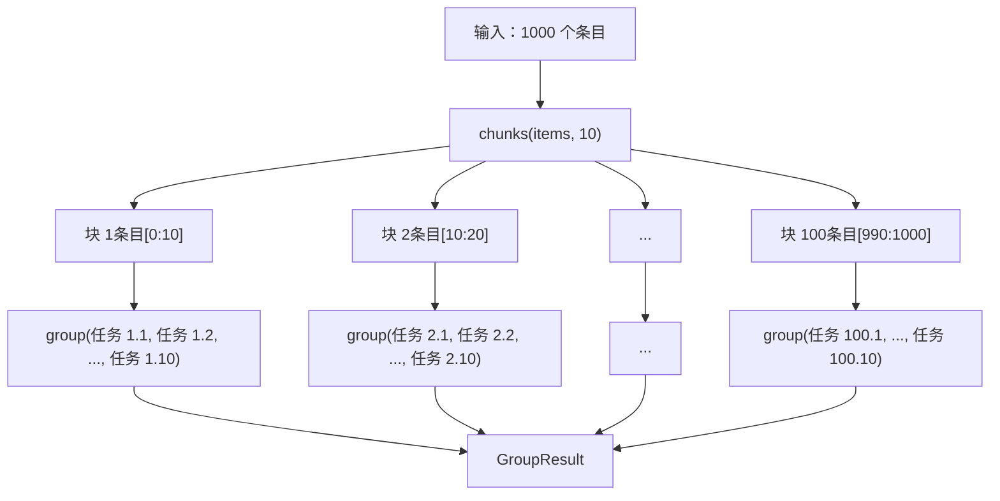
### Chunks 实现

| 方法 | 目的 | 位置 |
| --- | --- | --- |
| `__init__(task, it, n)` | 使用任务、条目、块大小初始化 | [celery/canvas.py967-976](https://github.com/celery/celery/blob/4d068b56/celery/canvas.py#L967-L976) |
| `apply_chunks()` | 为每个块创建一个组 | [celery/canvas.py978-984](https://github.com/celery/celery/blob/4d068b56/celery/canvas.py#L978-L984) |
| `group()` 属性 | 返回块组的组 | [celery/canvas.py993-997](https://github.com/celery/celery/blob/4d068b56/celery/canvas.py#L993-L997) |

**来源：** [celery/canvas.py951-1008](https://github.com/celery/celery/blob/4d068b56/celery/canvas.py#L951-L1008)

### Chunks 创建

```
# chunks 基本用法
items = list(range(1000))
result = add.chunks(zip(items, items), 10)

# 这将创建 100 个组，每个组处理 10 个条目
# 总计：100 个组 * 每个组 10 个任务 = 1000 个任务
```
**来源：** [celery/canvas.py967-976](https://github.com/celery/celery/blob/4d068b56/celery/canvas.py#L967-L976) [docs/userguide/canvas.rst294-305](https://github.com/celery/celery/blob/4d068b56/docs/userguide/canvas.rst#L294-L305)

### Chunks 执行模式

> **[Mermaid sequence]**
> *(图表结构无法解析)*

**来源：** [celery/canvas.py978-997](https://github.com/celery/celery/blob/4d068b56/celery/canvas.py#L978-L997)

### Chunks vs Map

| 方法 | 并行度 | 任务数量 | 使用场景 |
| --- | --- | --- | --- |
| `chunks` | 组级别 | N 个组，每个组 M 个任务 | 大型数据集，控制粒度 |
| `map` | 单个任务 | 1 个任务处理所有条目 | 简单的迭代，开销较小 |

**来源：** [celery/canvas.py951-1008](https://github.com/celery/celery/blob/4d068b56/celery/canvas.py#L951-L1008) [celery/canvas.py849-948](https://github.com/celery/celery/blob/4d068b56/celery/canvas.py#L849-L948)

---

## Map 与 Starmap：可迭代对象处理

`xmap` 和 `xstarmap` 原语将任务应用于一系列参数，类似于 Python 内置的 `map()` 函数。

### Map vs Starmap

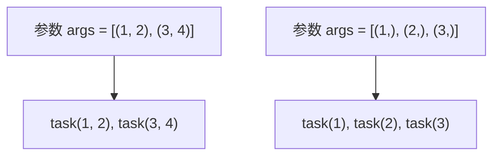
| 原语 | 参数展开 | 示例 |
| --- | --- | --- |
| `xmap` | 单个参数 | `add.map([1, 2, 3])` → `[add(1), add(2), add(3)]` |
| `xstarmap` | 星号参数 (Star args) | `add.starmap([(1,2), (3,4)])` → `[add(1,2), add(3,4)]` |

**来源：** [celery/canvas.py849-948](https://github.com/celery/celery/blob/4d068b56/celery/canvas.py#L849-L948)

### Map 实现

| 方法 | 目的 | 位置 |
| --- | --- | --- |
| `__init__(task, it)` | 使用任务和可迭代对象初始化 | [celery/canvas.py860-866](https://github.com/celery/celery/blob/4d068b56/celery/canvas.py#L860-L866) |
| `apply_async()` | 执行 map 任务 | [celery/canvas.py868-873](https://github.com/celery/celery/blob/4d068b56/celery/canvas.py#L868-L873) |

**来源：** [celery/canvas.py849-903](https://github.com/celery/celery/blob/4d068b56/celery/canvas.py#L849-L903)

### Map 创建与用法

```
# 使用 map
result = add.map([1, 2, 3, 4, 5])
# 等同于: [add(1), add(2), add(3), add(4), add(5)]

# 使用 starmap
result = add.starmap([(1, 1), (2, 2), (3, 3)])
# 等同于: [add(1, 1), add(2, 2), add(3, 3)]
```
**来源：** [celery/canvas.py849-948](https://github.com/celery/celery/blob/4d068b56/celery/canvas.py#L849-L948) [docs/userguide/canvas.rst272-292](https://github.com/celery/celery/blob/4d068b56/docs/userguide/canvas.rst#L272-L292)

### Map 执行

Map 操作被实现为一个处理所有条目的临时任务：

> **[Mermaid sequence]**
> *(图表结构无法解析)*

**来源：** [celery/canvas.py868-873](https://github.com/celery/celery/blob/4d068b56/celery/canvas.py#L868-L873) [t/unit/tasks/test\_canvas.py353-369](https://github.com/celery/celery/blob/4d068b56/t/unit/tasks/test_canvas.py#L353-L369)

---

## 构建与嵌套 (Composition and Nesting)

Canvas 原语可以被构建和嵌套，以创建复杂的工作流。

### 构建模式

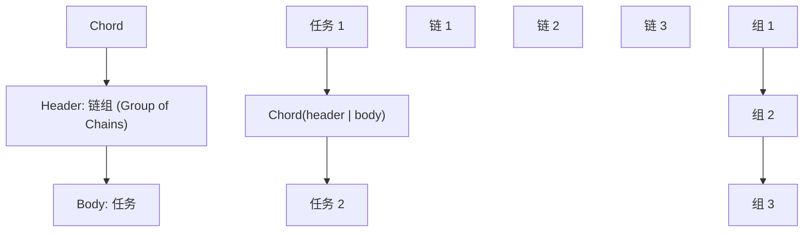
### 自动升级为 Chord

当一个组被链式连接到另一个任务时，它会自动变为一个 chord：

```
# 这种 group | task 模式
sig = group(add.s(i, i) for i in range(10)) | tsum.s()

# 等同于显式的 chord
sig = chord(group(add.s(i, i) for i in range(10)), body=tsum.s())
```
**来源：** [celery/canvas.py770-775](https://github.com/celery/celery/blob/4d068b56/celery/canvas.py#L770-L775) [docs/userguide/canvas.rst432-440](https://github.com/celery/celery/blob/4d068b56/docs/userguide/canvas.rst#L432-L440)

### 复杂构建示例

```
# 多阶段工作流：chord 链
workflow = (
    # 第 1 阶段：并行处理批次
    group(process_batch.s(batch) for batch in batches) |

    # 第 2 阶段：聚合批次结果
    aggregate_results.s() |

    # 第 3 阶段：分析每个聚合后的结果
    group(analyze.s(i) for i in range(10)) |

    # 第 4 阶段：最终总结
    create_summary.s()
)
```
**来源：** [t/integration/test\_canvas.py395-457](https://github.com/celery/celery/blob/4d068b56/t/integration/test_canvas.py#L395-L457)

### 嵌套工作流图

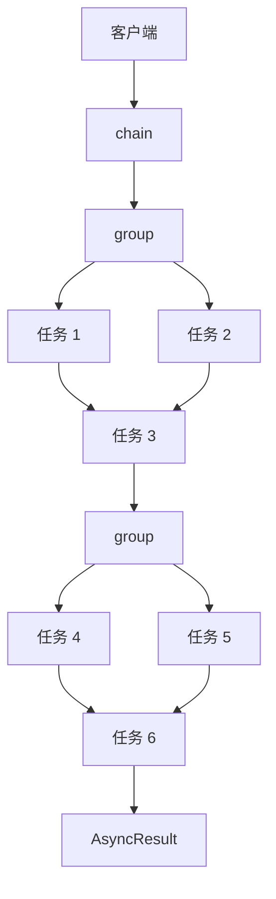
**来源：** [t/integration/test\_canvas.py409-507](https://github.com/celery/celery/blob/4d068b56/t/integration/test_canvas.py#L409-L507)

---

## 盖章与标头传播 (Stamping and Header Propagation)

盖章 visitor 模式允许在 Canvas 工作流中传播自定义元数据。

### StampingVisitor 模式

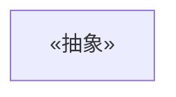
**来源：** [celery/canvas.py118-229](https://github.com/celery/celery/blob/4d068b56/celery/canvas.py#L118-L229)

### 盖章实现 (Stamping Implementation)

| 方法 | 目的 | 位置 |
| --- | --- | --- |
| `stamp(visitor, append_stamps, **headers)` | 使用标头对签名进行盖章 | [celery/canvas.py613-633](https://github.com/celery/celery/blob/4d068b56/celery/canvas.py#L613-L633) |
| `stamp_links(visitor, append_stamps, **headers)` | 对回调和错误回调进行盖章 | [celery/canvas.py635-682](https://github.com/celery/celery/blob/4d068b56/celery/canvas.py#L635-L682) |
| `_stamp_headers(visitor_headers, ...)` | 合并盖章标头 | [celery/canvas.py553-611](https://github.com/celery/celery/blob/4d068b56/celery/canvas.py#L553-L611) |

**来源：** [celery/canvas.py553-682](https://github.com/celery/celery/blob/4d068b56/celery/canvas.py#L553-L682)

### 盖章用法

```
class CustomVisitor(StampingVisitor):
    def on_signature(self, sig, **headers):
        return {'custom_id': generate_id(), **headers}

# 将盖章应用于工作流
workflow = chain(task1.s(), task2.s(), task3.s())
workflow.stamp(visitor=CustomVisitor())
```
**来源：** [celery/canvas.py118-229](https://github.com/celery/celery/blob/4d068b56/celery/canvas.py#L118-L229) [t/integration/test\_canvas.py772-839](https://github.com/celery/celery/blob/4d068b56/t/integration/test_canvas.py#L772-L839)

### 标头传播流

> **[Mermaid sequence]**
> *(图表结构无法解析)*

**来源：** [celery/canvas.py613-682](https://github.com/celery/celery/blob/4d068b56/celery/canvas.py#L613-L682) [t/integration/test\_canvas.py772-839](https://github.com/celery/celery/blob/4d068b56/t/integration/test_canvas.py#L772-L839)

---

## 原语类型注册 (Primitive Type Registration)

Canvas 原语使用注册系统进行序列化和反序列化。

### 类型注册表

```
# 注册自定义原语类型
@Signature.register_type()
class custom_primitive(Signature):
    def __init__(self, *args, **kwargs):
        super().__init__(*args, **kwargs)
        self.subtask_type = "custom_primitive"
```
**来源：** [celery/canvas.py295-307](https://github.com/celery/celery/blob/4d068b56/celery/canvas.py#L295-L307)

### 已注册类型

| 类型名称 | 类 | 目的 |
| --- | --- | --- |
| `"chain"` | `_chain` | 顺序执行 |
| `"group"` | `group` | 并行执行 |
| `"chord"` | `chord` | 带有回调的并行执行 |
| `"chunks"` | `chunks` | 批量处理 |
| `"xmap"` | `xmap` | Map 操作 |
| `"xstarmap"` | `xstarmap` | Starmap 操作 |

**来源：** [celery/canvas.py289-307](https://github.com/celery/celery/blob/4d068b56/celery/canvas.py#L289-L307) [celery/canvas.py1389-1665](https://github.com/celery/celery/blob/4d068b56/celery/canvas.py#L1389-L1665) [celery/canvas.py1668-1925](https://github.com/celery/celery/blob/4d068b56/celery/canvas.py#L1668-L1925)

### 类型序列化

`from_dict()` 类方法从序列化形式重构原语：

```
# 序列化签名
sig = chain(add.s(1, 1), mul.s(2))
d = dict(sig)

# 使用类型注册表进行反序列化
restored = Signature.from_dict(d, app=app)
assert isinstance(restored, _chain)
```
**来源：** [celery/canvas.py310-320](https://github.com/celery/celery/blob/4d068b56/celery/canvas.py#L310-L320)

---

## 原语测试

Canvas 原语包含展示用法模式的全面测试覆盖。

### 集成测试结构

| 测试类 | 重点 | 位置 |
| --- | --- | --- |
| `test_chain` | 链式执行模式 | [t/integration/test\_canvas.py186-577](https://github.com/celery/celery/blob/4d068b56/t/integration/test_canvas.py#L186-L577) |
| `test_group` | 组执行与结果 | [t/integration/test\_canvas.py18-26](https://github.com/celery/celery/blob/4d068b56/t/integration/test_canvas.py#L18-L26) |
| `test_chord` | Chord 同步 | [t/integration/test\_canvas.py72-182](https://github.com/celery/celery/blob/4d068b56/t/integration/test_canvas.py#L72-L182) |
| `test_stamping` | 盖章传播 | [t/integration/test\_canvas.py772-1020](https://github.com/celery/celery/blob/4d068b56/t/integration/test_canvas.py#L772-L1020) |

**来源：** [t/integration/test\_canvas.py1-1942](https://github.com/celery/celery/blob/4d068b56/t/integration/test_canvas.py#L1-L1942)

### 单元测试覆盖率

| 测试模块 | 覆盖范围 |
| --- | --- |
| `test_Signature` | 签名创建、合并、链接 |
| `test_chain` | 链式构建与扁平化 |
| `test_group` | 组创建与冻结 |
| `test_chord` | Chord 结构与回调 |

**来源：** [t/unit/tasks/test\_canvas.py1-2536](https://github.com/celery/celery/blob/4d068b56/t/unit/tasks/test_canvas.py#L1-L2536)

### 示例测试模式

```
# 测试链式结果传播
def test_simple_chain(manager):
    c = add.s(4, 4) | add.s(8) | add.s(16)
    assert c().get(timeout=TIMEOUT) == 32

# 测试组并行执行
def test_group(celery_setup):
    sig = group(add.si(1, 1), add.si(2, 2))
    res = sig.apply_async()
    assert res.get(timeout=TIMEOUT) == [2, 4]

# 测试带有回调的 chord
def test_chord(manager):
    c = chord([add.s(i, i) for i in range(10)], body=tsum.s())
    res = c()
    assert res.get(timeout=TIMEOUT) == 90
```
**来源：** [t/integration/test\_canvas.py188-191](https://github.com/celery/celery/blob/4d068b56/t/integration/test_canvas.py#L188-L191) [t/smoke/tests/test\_canvas.py17-25](https://github.com/celery/celery/blob/4d068b56/t/smoke/tests/test_canvas.py#L17-L25) [t/smoke/tests/test\_canvas.py71-105](https://github.com/celery/celery/blob/4d068b56/t/smoke/tests/test_canvas.py#L71-L105)
