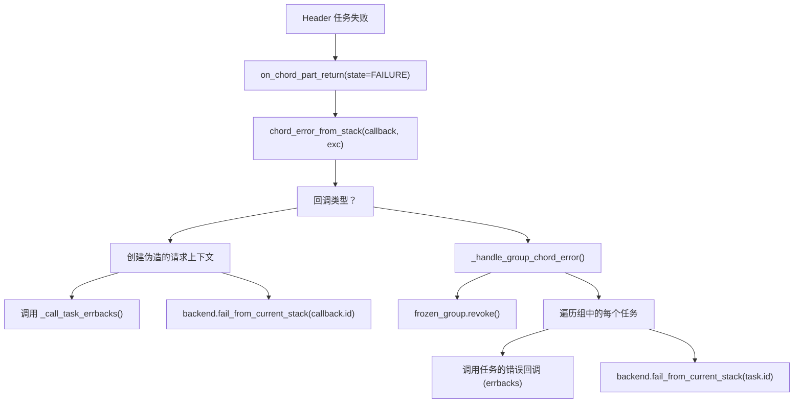
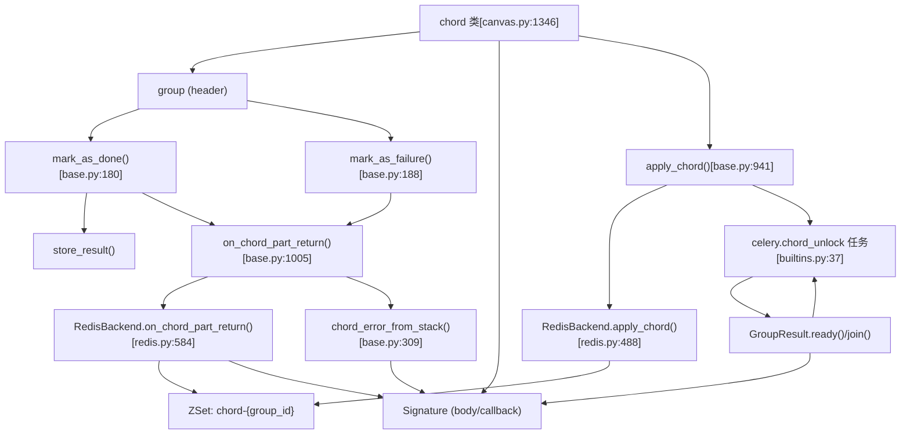

# Chord 执行

相关源文件

-   [celery/app/amqp.py](https://github.com/celery/celery/blob/4d068b56/celery/app/amqp.py)
-   [celery/app/base.py](https://github.com/celery/celery/blob/4d068b56/celery/app/base.py)
-   [celery/app/builtins.py](https://github.com/celery/celery/blob/4d068b56/celery/app/builtins.py)
-   [celery/app/task.py](https://github.com/celery/celery/blob/4d068b56/celery/app/task.py)
-   [celery/backends/base.py](https://github.com/celery/celery/blob/4d068b56/celery/backends/base.py)
-   [celery/backends/redis.py](https://github.com/celery/celery/blob/4d068b56/celery/backends/redis.py)
-   [celery/canvas.py](https://github.com/celery/celery/blob/4d068b56/celery/canvas.py)
-   [celery/result.py](https://github.com/celery/celery/blob/4d068b56/celery/result.py)
-   [celery/utils/\_\_init\_\_.py](https://github.com/celery/celery/blob/4d068b56/celery/utils/__init__.py)
-   [docs/userguide/canvas.rst](https://github.com/celery/celery/blob/4d068b56/docs/userguide/canvas.rst)
-   [docs/userguide/configuration.rst](https://github.com/celery/celery/blob/4d068b56/docs/userguide/configuration.rst)
-   [t/integration/conftest.py](https://github.com/celery/celery/blob/4d068b56/t/integration/conftest.py)
-   [t/integration/tasks.py](https://github.com/celery/celery/blob/4d068b56/t/integration/tasks.py)
-   [t/integration/test\_canvas.py](https://github.com/celery/celery/blob/4d068b56/t/integration/test_canvas.py)
-   [t/integration/test\_quorum\_queue\_qos\_cluster\_simulation.py](https://github.com/celery/celery/blob/4d068b56/t/integration/test_quorum_queue_qos_cluster_simulation.py)
-   [t/integration/test\_security.py](https://github.com/celery/celery/blob/4d068b56/t/integration/test_security.py)
-   [t/integration/test\_tasks.py](https://github.com/celery/celery/blob/4d068b56/t/integration/test_tasks.py)
-   [t/smoke/tests/test\_canvas.py](https://github.com/celery/celery/blob/4d068b56/t/smoke/tests/test_canvas.py)
-   [t/unit/app/test\_app.py](https://github.com/celery/celery/blob/4d068b56/t/unit/app/test_app.py)
-   [t/unit/backends/test\_base.py](https://github.com/celery/celery/blob/4d068b56/t/unit/backends/test_base.py)
-   [t/unit/backends/test\_redis.py](https://github.com/celery/celery/blob/4d068b56/t/unit/backends/test_redis.py)
-   [t/unit/tasks/test\_canvas.py](https://github.com/celery/celery/blob/4d068b56/t/unit/tasks/test_canvas.py)
-   [t/unit/tasks/test\_chord.py](https://github.com/celery/celery/blob/4d068b56/t/unit/tasks/test_chord.py)
-   [t/unit/tasks/test\_result.py](https://github.com/celery/celery/blob/4d068b56/t/unit/tasks/test_result.py)
-   [t/unit/tasks/test\_tasks.py](https://github.com/celery/celery/blob/4d068b56/t/unit/tasks/test_tasks.py)

## 目的与范围

本页面记录了 Celery 中 chord 执行的实现细节。一个 chord 由一组并行任务（header）和一个回调任务（body）组成，当所有 header 任务完成后，回调任务就会执行。本页面涵盖了不同结果后端（result backends）用于追踪任务完成情况并触发回调的协调机制。

有关基础 chord 用法和构建模式，请参阅[工作流原语](/celery/celery/4.2-workflow-primitives)。有关签名操作和冻结，请参阅[签名 (Signatures)](/celery/celery/4.1-signatures)。

---

## Chord 架构

一个 chord 由两个组件组成：

-   **Header**：一组并行执行的任务 (group)
-   **Body**：一个接收 header 汇总结果的回调 `Signature`

chord 类定义在 [celery/canvas.py1346-1722](https://github.com/celery/celery/blob/4d068b56/celery/canvas.py#L1346-L1722) 中，并继承自 `Signature`。当应用一个 chord 时，header 任务会被立即分发，后端负责追踪它们的完成情况，并使用聚合后的结果调用 body 回调。

**关键架构概念：**

| 组件 | 描述 | 实现 |
| --- | --- | --- |
| `chord` 类 | 结合了组 (group) + 回调的 Canvas 原语 | [celery/canvas.py1346](https://github.com/celery/canvas.py#L1346-L1346) |
| `apply_chord()` | 用于注册 chord 协调的后端方法 | [celery/backends/base.py941-1003](https://github.com/celery/celery/blob/4d068b56/celery/backends/base.py#L941-L1003) |
| `on_chord_part_return()` | 当每个 header 任务完成时调用的后端方法 | [celery/backends/base.py1005-1152](https://github.com/celery/celery/blob/4d068b56/celery/backends/base.py#L1005-L1152) |
| `chord_unlock` 任务 | 针对不具备原生支持的后端的轮询任务 | [celery/app/builtins.py37-98](https://github.com/celery/celery/blob/4d068b56/celery/app/builtins.py#L37-L98) |

来源：[celery/canvas.py1346-1722](https://github.com/celery/celery/blob/4d068b56/celery/canvas.py#L1346-L1722) [celery/backends/base.py941-1152](https://github.com/celery/celery/blob/4d068b56/celery/backends/base.py#L941-L1152) [celery/app/builtins.py37-98](https://github.com/celery/celery/blob/4d068b56/celery/app/builtins.py#L37-L98)

---

## 后端协调机制 (Backend Coordination Mechanisms)

Celery 支持两种 chord 执行方法，具体取决于结果后端的的能力。

### 原生 Chord 支持 (Native Chord Support)

当 `supports_native_join = True` 时，后端直接使用后端特定的特性实现 chord 协调。这些后端必须重写 `apply_chord()` 和 `on_chord_part_return()` 方法。

**具有原生支持的后端：**

-   **RedisBackend**：使用有序集合 (ZSets) 进行原子完成情况追踪 [celery/backends/redis.py584-677](https://github.com/celery/celery/blob/4d068b56/celery/backends/redis.py#L584-L677)
-   **RPCBackend**：使用 AMQP 消息传递进行实时协调
-   **DatabaseBackend**：使用数据库事务确保一致性

Redis 实现将 chord 状态存储在 ZSets 中，其中分数 (score) 代表任务的状态，成员 (member) 是任务 ID。当所有成员的分数都指示已完成时，就会触发回调。

来源：[celery/backends/base.py119-121](https://github.com/celery/celery/blob/4d068b56/celery/backends/base.py#L119-L121) [celery/backends/redis.py207](https://github.com/celery/celery/blob/4d068b56/celery/backends/redis.py#L207-L207) [celery/backends/redis.py584-677](https://github.com/celery/celery/blob/4d068b56/celery/backends/redis.py#L584-L677)

### 非原生支持（Unlock 任务）

不具备原生 chord 支持的后端通过 `celery.chord_unlock` 任务使用轮询机制。该任务通过调用 `GroupResult.ready()` 定期检查所有 header 任务是否已完成。

**Unlock 任务：**

1.  通过 `add_unlock_chord_task()` 自动注册 [celery/app/builtins.py37-98](https://github.com/celery/celery/blob/4d068b56/celery/app/builtins.py#L37-L98)
2.  接收 `group_id`、`callback` 和结果元数据
3.  使用 `result_chord_retry_interval` 配置的指数退避进行重试
4.  当就绪时调用 `GroupResult.join()` 并执行回调

**配置设置：**

-   `result_chord_retry_interval`：unlock 任务重试之间的延迟（默认来自配置）
-   `result_chord_join_timeout`：聚合 header 结果的超时时间

来源：[celery/app/builtins.py37-98](https://github.com/celery/celery/blob/4d068b56/celery/app/builtins.py#L37-L98) [celery/backends/base.py941-1003](https://github.com/celery/celery/blob/4d068b56/celery/backends/base.py#L941-L1003)

---

## Chord 应用流 (Chord Application Flow)

> **[Mermaid sequence]**
> *(图表结构无法解析)*

**Chord 应用工作流：**

来源：[celery/canvas.py1550-1722](https://github.com/celery/celery/blob/4d068b56/celery/canvas.py#L1550-L1722) [celery/backends/base.py941-1152](https://github.com/celery/celery/blob/4d068b56/celery/backends/base.py#L941-L1152) [celery/app/builtins.py48-98](https://github.com/celery/celery/blob/4d068b56/celery/app/builtins.py#L48-L98)

---

## 完成情况追踪机制

### Redis ZSet 实现

Redis 后端使用有序集合 (ZSets) 追踪 chord 完成情况，其中：

-   **键 (Key)**：`{key_prefix}chord-{group_id}`
-   **分数 (Score)**：以整数编码的任务状态 (SUCCESS=1, FAILURE=-1 等)
-   **成员 (Member)**：任务 ID

**追踪逻辑** [celery/backends/redis.py584-677](https://github.com/celery/celery/blob/4d068b56/celery/backends/redis.py#L584-L677)：

```
# on_chord_part_return() 检查完成情况
with pipeline.watch(chord_key):
    ready = pipeline.zcount(chord_key, '-inf', '+inf') == 0
    if ready:
        # 所有任务已完成，触发回调
```
原子性的 `ZCOUNT` 操作确保了线程安全的完成情况检测。后端在存储完结果后会从 ZSet 中移除已完成的任务 ID。

**关键操作：**

-   `ZADD`：将带有初始状态的任务添加到追踪集合
-   `ZREM`：任务成功完成时将其移除
-   `ZCOUNT`：统计剩余的未完成任务
-   `EXPIRE`：在 chord 元数据上设置生存时间 (TTL)

来源：[celery/backends/redis.py584-677](https://github.com/celery/celery/blob/4d068b56/celery/backends/redis.py#L584-L677) [celery/backends/redis.py488-552](https://github.com/celery/celery/blob/4d068b56/celery/backends/redis.py#L488-L552)

### 基于计数器的实现

某些后端使用简单的计数器键来追踪完成情况：

```
counter_key = f'{key_prefix}chord-{group_id}-count'
# 每个任务完成时递减计数器
remaining = backend.decrement(counter_key)
if remaining == 0:
    # 触发回调
```
这种方法较简单，但如果没有原子操作，可能会产生竞态条件 (race conditions)。

来源：[celery/backends/base.py1005-1152](https://github.com/celery/celery/blob/4d068b56/celery/backends/base.py#L1005-L1152)

### 轮询实现（非原生）

`chord_unlock` 任务会定期轮询组结果：

```
deps = GroupResult(group_id, results, app=app)
if not deps.ready():
    raise self.retry(countdown=interval, max_retries=max_retries)

# 全部就绪，合并并触发回调
ret = deps.join(timeout=app.conf.result_chord_join_timeout, propagate=True)
callback.delay(ret)
```
这种方法适用于任何后端，但延迟较高，且轮询会增加后端负载。

来源：[celery/app/builtins.py56-98](https://github.com/celery/celery/blob/4d068b56/celery/app/builtins.py#L56-L98)

---

## 错误处理

### Chord 错误传播

当 header 任务失败时，后端的 `on_chord_part_return()` 方法会检测到失败并调用 `chord_error_from_stack()` [celery/backends/base.py309-336](https://github.com/celery/celery/blob/4d068b56/celery/backends/base.py#L309-L336)。

**错误处理流：**


**针对组回调 (Group Callbacks) 的特殊处理** [celery/backends/base.py337-403](https://github.com/celery/celery/blob/4d068b56/celery/backends/base.py#L337-L403)：

当 chord body 本身也是一个 `group` 时，错误处理器必须防止所有 body 任务无限期挂起。`_handle_group_chord_error()` 方法会：

1.  冻结组以获得具体的任务 ID
2.  撤销组 body 中所有待处理的任务
3.  使用原始异常将每个任务标记为失败
4.  分别为每个任务调用错误回调

这防止了 GitHub issue #8786 中描述的问题，即在 chord header 失败后组 body 任务会挂起。

来源：[celery/backends/base.py309-403](https://github.com/celery/celery/blob/4d068b56/celery/backends/base.py#L309-L403) [celery/backends/base.py68-77](https://github.com/celery/celery/blob/4d068b56/celery/backends/base.py#L68-L77)

### 错误辅助函数

代码库提供了辅助函数以实现一致的错误处理：

**`_create_chord_error_with_cause(message, original_exc)`** [celery/backends/base.py68-77](https://github.com/celery/celery/blob/4d068b56/celery/backends/base.py#L68-L77)：创建一个以原始异常作为 `__cause__` 的 `ChordError`，保留异常链以便调试。

**`_create_fake_task_request(task_id, errbacks, task_name, **extra)`** [celery/backends/base.py80-92](https://github.com/celery/celery/blob/4d068b56/celery/backends/base.py#L80-L92)：在实际任务上下文不可用时，创建一个模拟任务请求的 `Context` 对象，用于调用错误回调。

来源：[celery/backends/base.py68-92](https://github.com/celery/celery/blob/4d068b56/celery/backends/base.py#L68-L92)

---

## 配置与选项

### Chord 特定设置

| 设置项 | 描述 | 默认值 |
| --- | --- | --- |
| `result_chord_retry_interval` | unlock 任务重试之间的延迟 | 取决于后端 |
| `result_chord_join_timeout` | 聚合 header 结果的超时时间 | 取决于后端 |
| `task_allow_error_cb_on_chord_header` | 允许在 chord header 任务上使用错误回调 (errbacks) | 取决于后端 |

### 冻结与任务 ID 分配

当应用 chord 时，header 任务会被“冻结”以分配具体的任务 ID [celery/canvas.py1611-1643](https://github.com/celery/celery/blob/4d068b56/celery/canvas.py#L1611-L1643)：

```
# 每个 header 任务获得一个唯一 ID，并共享 group_id
for task_sig in header.tasks:
    task_sig.freeze(
        group_id=group_id,
        chord=body_sig,  # 引用回调
        root_id=options.get('root_id'),
        parent_id=options.get('parent_id')
    )
```
每个 header 任务元数据中的 `chord` 选项将其链接到 chord 协调系统。

来源：[celery/canvas.py1611-1643](https://github.com/celery/celery/blob/4d068b56/celery/canvas.py#L1611-L1643) [celery/canvas.py472-519](https://github.com/celery/celery/blob/4d068b56/celery/canvas.py#L472-L519)

---

## 与任务执行集成

### 工作者端协调

当工作者完成一个 header 任务时，会调用后端的 `mark_as_done()` 或 `mark_as_failure()` 方法 [celery/backends/base.py180-186](https://github.com/celery/celery/blob/4d068b56/celery/backends/base.py#L180-L186) [celery/backends/base.py188-242](https://github.com/celery/celery/blob/4d068b56/celery/backends/base.py#L188-L242)：

```
def mark_as_done(self, task_id, result, request=None, ...):
    if store_result:
        self.store_result(task_id, result, state, request=request)
    if request and request.chord:
        # 任务是某个 chord header 的一部分
        self.on_chord_part_return(request, state, result)
```
`request.chord` 属性包含回调签名，指示该任务是 chord header 的一部分。

来源：[celery/backends/base.py180-242](https://github.com/celery/celery/blob/4d068b56/celery/backends/base.py#L180-L242)

### 回调调用

一旦所有 header 任务完成：

**原生后端**：直接使用聚合后的结果通过 `callback.apply_async()` 或 `callback.delay()` 调用回调。

**非原生后端**：由 `chord_unlock` 任务调用回调 [celery/app/builtins.py77-97](https://github.com/celery/celery/blob/4d068b56/celery/app/builtins.py#L77-L97)：

```
try:
    with allow_join_result():
        ret = j(timeout=app.conf.result_chord_join_timeout, propagate=True)
except Exception as exc:
    # 处理 header 失败
    chord_error = _create_chord_error_with_cause(...)
    app.backend.chord_error_from_stack(callback=callback, exc=chord_error)
else:
    try:
        callback.delay(ret)
    except Exception as exc:
        # 处理回调分发失败
        chord_error = _create_chord_error_with_cause(...)
        app.backend.chord_error_from_stack(callback=callback, exc=chord_error)
```
来源：[celery/app/builtins.py77-97](https://github.com/celery/celery/blob/4d068b56/celery/app/builtins.py#L77-L97)

---

## 后端特定实现

### RedisBackend

**关键方法：**

-   `apply_chord()` [celery/backends/redis.py488-552](https://github.com/celery/celery/blob/4d068b56/celery/backends/redis.py#L488-L552)：设置 ZSet 追踪
-   `on_chord_part_return()` [celery/backends/redis.py584-677](https://github.com/celery/celery/blob/4d068b56/celery/backends/redis.py#L584-L677)：使用 ZSets 进行原子完成情况检查
-   `_create_chord_zset()`：初始化追踪结构
-   `_remove_from_chord()`：从 ZSet 中移除已完成的任务

**优势：**

-   原子操作防止竞态条件
-   低延迟的回调触发
-   极小的轮询开销

来源：[celery/backends/redis.py488-677](https://github.com/celery/celery/blob/4d068b56/celery/backends/redis.py#L488-L677)

### DatabaseBackend

使用 `chord_unlock` 轮询任务，因为单凭数据库事务无法在不产生过度锁定的情况下提供高效的完成情况追踪。

来源：[celery/backends/database.py](https://github.com/celery/celery/blob/4d068b56/celery/backends/database.py)（已引用，但未在提供的文件中）

### RPCBackend

使用 AMQP 队列实现 header 任务完成时的实时通知。每个 header 任务发布到一个由回调分发器监控的协调队列。

来源：[celery/backends/rpc.py](https://github.com/celery/celery/blob/4d068b56/celery/backends/rpc.py)（已引用，但未在提供的文件中）

---

## 测试与调试

### 集成测试

测试套件包含了广泛的 chord 测试场景 [t/integration/test\_canvas.py312-877](https://github.com/celery/celery/blob/4d068b56/t/integration/test_canvas.py#L312-L877)：

-   基础 chord 执行
-   嵌套 chord (chord 包含 chord)
-   带有回调和错误回调的 chord
-   从 header 到 body 的错误传播
-   带有 chord header 的组 body
-   带有空组的 chord
-   chord header 中被替换的任务

**示例测试模式：**

```
def test_chord_on_error():
    c = chord([add.s(1, 2), fail.s(), add.s(3, 4)], body=add.s(0))
    res = c.delay()

    with pytest.raises(ExpectedException):
        res.get(propagate=True)
```
来源：[t/integration/test\_canvas.py312-877](https://github.com/celery/celery/blob/4d068b56/t/integration/test_canvas.py#L312-L877)

### 常见问题

1.  **Chord 无限期挂起**：通常表示后端不支持 chord，或者 `chord_unlock` 任务未注册。
2.  **回调未被调用**：检查是否所有 header 任务都已完成，以及后端追踪是否正常工作。
3.  **竞态条件**：确保后端使用原子操作进行完成情况追踪。
4.  **组主体在出错时挂起**：已通过 [celery/backends/base.py337-403](https://github.com/celery/celery/blob/4d068b56/celery/backends/base.py#L337-L403) 中的 `_handle_group_chord_error()` 修复。

来源：[t/integration/test\_canvas.py](https://github.com/celery/celery/blob/4d068b56/t/integration/test_canvas.py) [celery/backends/base.py337-403](https://github.com/celery/celery/blob/4d068b56/celery/backends/base.py#L337-L403)

---

## 总结：Chord 执行代码实体映射


来源：[celery/canvas.py1346-1722](https://github.com/celery/celery/blob/4d068b56/celery/canvas.py#L1346-L1722) [celery/backends/base.py180-1152](https://github.com/celery/celery/blob/4d068b56/celery/backends/base.py#L180-L1152) [celery/backends/redis.py488-677](https://github.com/celery/celery/blob/4d068b56/celery/backends/redis.py#L488-L677) [celery/app/builtins.py37-98](https://github.com/celery/celery/blob/4d068b56/celery/app/builtins.py#L37-L98)
