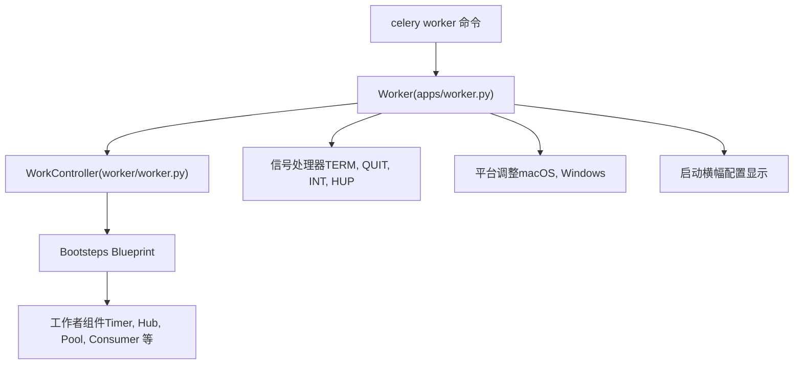
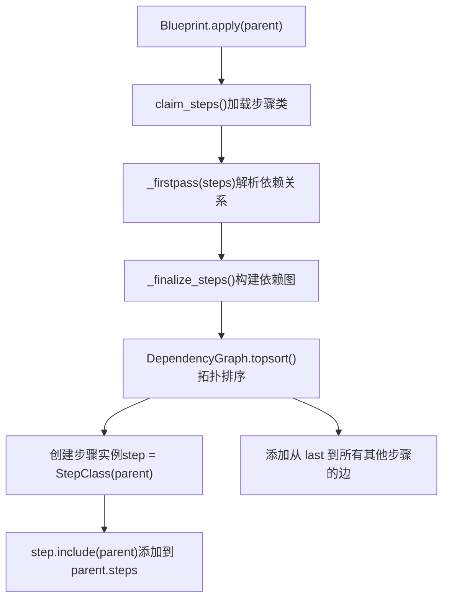
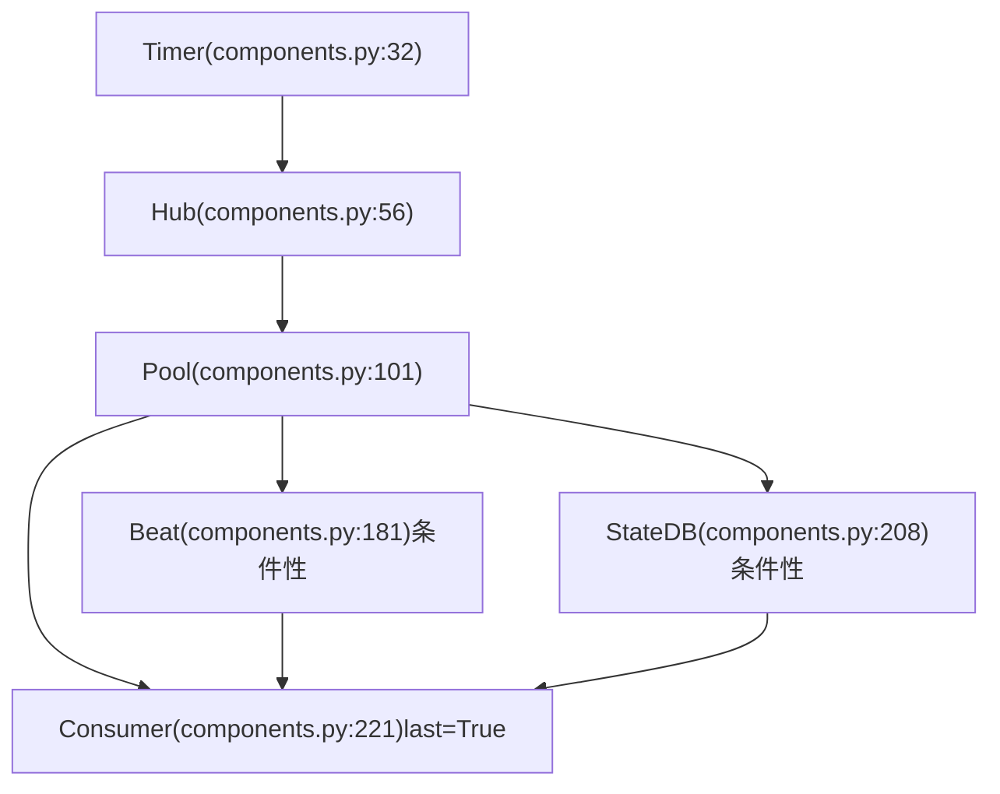
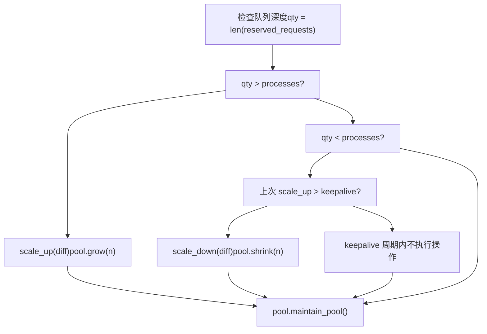
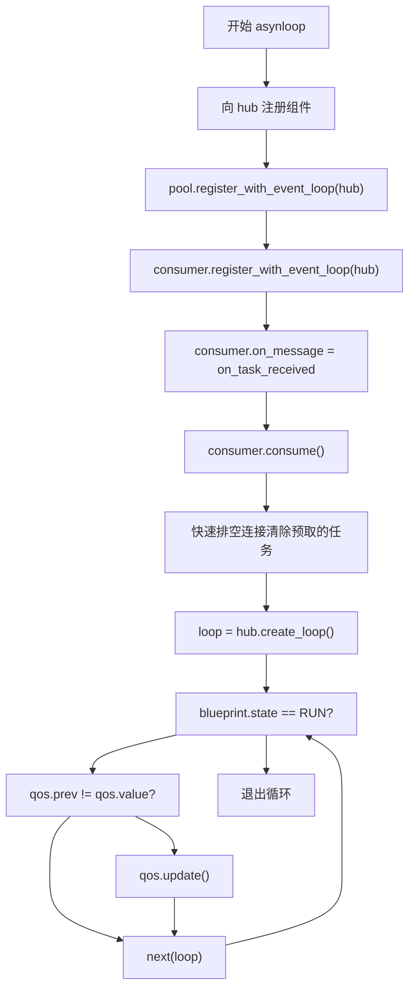
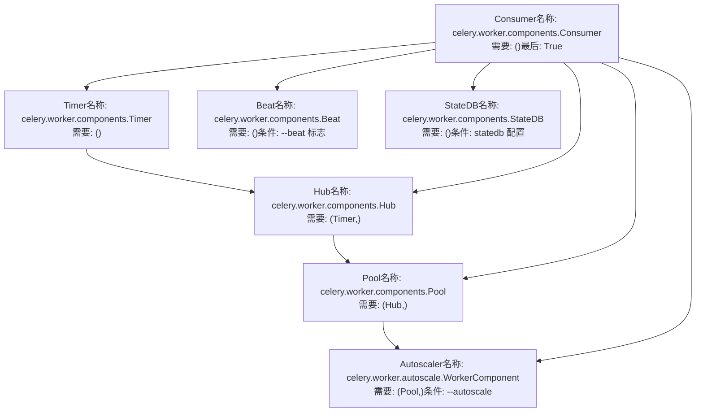

# 工作者架构与 Bootsteps

相关源文件

-   [celery/bootsteps.py](https://github.com/celery/celery/blob/4d068b56/celery/bootsteps.py)
-   [celery/worker/autoscale.py](https://github.com/celery/celery/blob/4d068b56/celery/worker/autoscale.py)
-   [celery/worker/components.py](https://github.com/celery/celery/blob/4d068b56/celery/worker/components.py)
-   [celery/worker/loops.py](https://github.com/celery/celery/blob/4d068b56/celery/worker/loops.py)

## 目的与范围

本文件描述了 Celery 工作者的内部架构以及管理组件初始化的 Bootsteps 框架。它涵盖了基于依赖的初始化系统、核心工作者组件，以及它们如何组装成一个运行中的工作者进程。

有关工作者生命周期和停机机制的信息，请参阅[工作者生命周期与停机](/celery/celery/5.2-worker-lifecycle-and-shutdown)。有关进程池实现的详细信息，请参阅[并发模型](/celery/celery/5.3-concurrency-models)。有关消费者事件循环的详细信息，请参阅[消费者与事件循环](/celery/celery/5.5-consumer-and-event-loops)。

## WorkController 与 Worker 类

工作者系统使用两个主要的类，它们具有不同的职责：

**WorkController** 作为核心工作者实现，负责管理组件的初始化与协调。它位于 `celery/worker/worker.py`，并通过 [celery/worker/\_\_init\_\_.py2](https://github.com/celery/celery/blob/4d068b56/celery/worker/__init__.py#L2-L2) 导出。

**Worker** 是一个程序级包装器，添加了信号处理器、特定平台的调整以及命令行界面功能。它继承自 `WorkController`，定义在 [celery/apps/worker.py85](https://github.com/celery/celery/blob/4d068b56/celery/apps/worker.py#L85-L85) 中。


**图表：工作者类层级**

`Worker` 类通过生命周期钩子添加了应用级特性：

-   `on_before_init`：设置工作者优化并发送初始化信号 [celery/apps/worker.py88-98](https://github.com/celery/celery/blob/4d068b56/celery/apps/worker.py#L88-L98)
-   `on_after_init`：配置日志记录和输出重定向 [celery/apps/worker.py100-114](https://github.com/celery/celery/blob/4d068b56/celery/apps/worker.py#L100-L114)
-   `on_init_blueprint`：完成化应用并应用任务执行优化 [celery/apps/worker.py116-120](https://github.com/celery/celery/blob/4d068b56/celery/apps/worker.py#L116-L120)
-   `on_start`：显示启动横幅并安装特定平台的信号处理器 [celery/apps/worker.py122-161](https://github.com/celery/celery/blob/4d068b56/celery/apps/worker.py#L122-L161)

来源：[celery/worker/\_\_init\_\_.py1-5](https://github.com/celery/celery/blob/4d068b56/celery/worker/__init__.py#L1-L5) [celery/apps/worker.py85-280](https://github.com/celery/celery/blob/4d068b56/celery/apps/worker.py#L85-L280)

## Bootsteps 框架

Bootsteps 框架提供了一个基于有向无环图 (DAG) 的初始化系统，用于管理组件依赖关系和启动顺序。

### 核心类

该框架由三个主要类组成：

| 类 | 用途 | 文件位置 |
| --- | --- | --- |
| `Blueprint` | 步骤容器，管理初始化顺序 | [celery/bootsteps.py74-264](https://github.com/celery/celery/blob/4d068b56/celery/bootsteps.py#L74-L264) |
| `Step` | 组件基类 | [celery/bootsteps.py288-353](https://github.com/celery/celery/blob/4d068b56/celery/bootsteps.py#L288-L353) |
| `StartStopStep` | 具有生命周期方法（启动/停止/终止）的步骤 | [celery/bootsteps.py355-384](https://github.com/celery/celery/blob/4d068b56/celery/bootsteps.py#L355-L384) |
| `ConsumerStep` | 启动消息消费者的步骤 | [celery/bootsteps.py386-416](https://github.com/celery/celery/blob/4d068b56/celery/bootsteps.py#L386-L416) |

### Blueprint 初始化过程


**图表：Blueprint 初始化流**

Blueprint 按此顺序应用步骤：

1.  **Claim Steps**：从类型集合中加载步骤类 [celery/bootsteps.py251-256](https://github.com/celery/celery/blob/4d068b56/celery/bootsteps.py#L251-L256)
2.  **First Pass**：解析符号依赖并添加隐式要求 [celery/bootsteps.py224-233](https://github.com/celery/celery/blob/4d068b56/celery/bootsteps.py#L224-L233)
3.  **Build Graph**：创建一个包含所有步骤及其依赖关系的 `DependencyGraph` [celery/bootsteps.py235-241](https://github.com/celery/celery/blob/4d068b56/celery/bootsteps.py#L235-L241)
4.  **Topological Sort**：确定尊重依赖关系的初始化顺序 [celery/bootsteps.py247-249](https://github.com/celery/celery/blob/4d068b56/celery/bootsteps.py#L247-L249)
5.  **Instantiate**：创建步骤实例并添加到父组件 [celery/bootsteps.py205-212](https://github.com/celery/celery/blob/4d068b56/celery/bootsteps.py#L205-L212)

来源：[celery/bootsteps.py186-212](https://github.com/celery/celery/blob/4d068b56/celery/bootsteps.py#L186-L212) [celery/bootsteps.py224-249](https://github.com/celery/celery/blob/4d068b56/celery/bootsteps.py#L224-L249)

### 步骤属性

每个步骤类可以定义这些属性：

| 属性 | 类型 | 目的 |
| --- | --- | --- |
| `name` | str | 完全限定的步骤名称（由 module.class 自动生成） |
| `label` | str | 在日志和图中显示的简短名称 |
| `requires` | tuple | 依赖项（其他步骤类或字符串路径） |
| `conditional` | bool | 步骤是否被条件性包含 |
| `last` | bool | 将此步骤标记为终端步骤（每个 blueprint 仅允许一个） |
| `enabled` | bool | `include_if()` 断言的默认值 |

`last` 属性非常特殊：当设置为 `True` 时，blueprint 会添加从该步骤到所有其他步骤的边，确保它最后启动 [celery/bootsteps.py242-245](https://github.com/celery/celery/blob/4d068b56/celery/bootsteps.py#L242-L245)。

来源：[celery/bootsteps.py288-353](https://github.com/celery/celery/blob/4d068b56/celery/bootsteps.py#L288-L353)

### Blueprint 状态

Blueprint 会在生命周期中追踪其状态：

> **[Mermaid stateDiagram]**
> *(图表结构无法解析)*

**图表：Blueprint 状态机**

状态常量定义为：

-   `RUN = 0x1`：Blueprint 正在运行 [celery/bootsteps.py24](https://github.com/celery/celery/blob/4d068b56/celery/bootsteps.py#L24-L24)
-   `CLOSE = 0x2`：Blueprint 正在关闭 [celery/bootsteps.py25](https://github.com/celery/celery/blob/4d068b56/celery/bootsteps.py#L25-L25)
-   `TERMINATE = 0x3`：Blueprint 正在终止 [celery/bootsteps.py26](https://github.com/celery/celery/blob/4d068b56/celery/bootsteps.py#L26-L26)

来源：[celery/bootsteps.py23-27](https://github.com/celery/celery/blob/4d068b56/celery/bootsteps.py#L23-L27) [celery/bootsteps.py89-97](https://github.com/celery/celery/blob/4d068b56/celery/bootsteps.py#L89-L97)

## 工作者组件 (Worker Components)

工作者 blueprint 包含六个核心组件，每个组件都在 [celery/worker/components.py](https://github.com/celery/worker/components.py) 中作为 bootstep 实现：

### 组件概览


**图表：工作者组件依赖关系**

### Timer 组件

`Timer` 组件创建一个计时器实例用于调度延迟操作。它根据工作者是否使用事件循环选择两种计时器实现之一：

-   **事件循环模式**：使用 `kombu.asynchronous.timer.Timer`，最大间隔为 10 秒 [celery/worker/components.py38](https://github.com/celery/celery/blob/4d068b56/celery/worker/components.py#L38-L38)
-   **非事件循环模式**：使用池特定的计时器（例如，prefork 使用 `billiard.pool.Timer`） [celery/worker/components.py43](https://github.com/celery/celery/blob/4d068b56/celery/worker/components.py#L43-L43)

计时器在 `create()` 方法中创建，并带有用于监控的错误和 tick 回调 [celery/worker/components.py35-47](https://github.com/celery/celery/blob/4d068b56/celery/worker/components.py#L35-L47)。

来源：[celery/worker/components.py32-54](https://github.com/celery/celery/blob/4d068b56/celery/worker/components.py#L32-L54)

### Hub 组件

`Hub` 组件管理用于异步操作的事件循环。它是一个 `StartStopStep`，具备以下特性：

**需要**：`Timer` 组件 [celery/worker/components.py59](https://github.com/celery/celery/blob/4d068b56/celery/worker/components.py#L59-L59)

**条件性**：仅在 `worker.use_eventloop` 为 true 时包含 [celery/worker/components.py65-66](https://github.com/celery/celery/blob/4d068b56/celery/worker/components.py#L65-L66)

**创建**：获取或创建一个 `kombu.asynchronous.Hub` 实例并修补线程原语 [celery/worker/components.py68-74](https://github.com/celery/celery/blob/4d068b56/celery/worker/components.py#L68-L74)

hub 的轮询器在 `start()` 方法中初始化，以确保在事件循环开始前准备就绪 [celery/worker/components.py77-81](https://github.com/celery/celery/blob/4d068b56/celery/worker/components.py#L77-L81)。

线程原语修补将锁替换为 `DummyLock`，以便单线程事件循环运行 [celery/worker/components.py89-98](https://github.com/celery/celery/blob/4d068b56/celery/worker/components.py#L89-L98)。

来源：[celery/worker/components.py56-99](https://github.com/celery/celery/blob/4d068b56/celery/worker/components.py#L56-L99)

### Pool 组件

`Pool` 组件管理用于任务执行的进程/线程池：

**需要**：`Hub` 组件 [celery/worker/components.py115](https://github.com/celery/celery/blob/4d068b56/celery/worker/components.py#L115-L115)

**设置的属性**：

-   `worker.pool`：池实例
-   `worker.max_concurrency`：最大工作者数（用于自动伸缩）
-   `worker.min_concurrency`：最小工作者数（通常等于 `concurrency`）

池实例化时带有以下关键参数：

-   `maxtasksperchild`：进程回收阈值 [celery/worker/components.py157](https://github.com/celery/celery/blob/4d068b56/celery/worker/components.py#L157-L157)
-   `max_memory_per_child`：基于内存的回收阈值 [celery/worker/components.py158](https://github.com/celery/celery/blob/4d068b56/celery/worker/components.py#L158-L158)
-   `timeout`/`soft_timeout`：任务时间限制 [celery/worker/components.py159-160](https://github.com/celery/celery/blob/4d068b56/celery/worker/components.py#L159-L160)
-   `semaphore`：针对非线程池的有界信号量 (bounded semaphore) [celery/worker/components.py147](https://github.com/celery/celery/blob/4d068b56/celery/worker/components.py#L147-L147)

对于非事件循环池，`LaxBoundedSemaphore` 控制并发任务执行 [celery/worker/components.py147-149](https://github.com/celery/celery/blob/4d068b56/celery/worker/components.py#L147-L149)。

来源：[celery/worker/components.py101-179](https://github.com/celery/celery/blob/4d068b56/celery/worker/components.py#L101-L179)

### Beat 组件

`Beat` 组件在工作者进程内嵌入一个 Beat 调度器：

**条件性**：仅在提供 `--beat` 参数时启用 [celery/worker/components.py190-193](https://github.com/celery/celery/blob/4d068b56/celery/worker/components.py#L190-L193)

**错误检查**：如果与 eventlet/gevent 池一起使用，则抛出 `ImproperlyConfigured` [celery/worker/components.py198-201](https://github.com/celery/celery/blob/4d068b56/celery/worker/components.py#L198-L201)

**创建**：带有调度文件名和调度器类的 `celery.beat.EmbeddedService` 实例 [celery/worker/components.py202-204](https://github.com/celery/celery/blob/4d068b56/celery/worker/components.py#L202-L204)

此组件允许工作者在不运行单独 Beat 进程的情况下调度周期性任务，但与绿线程池（green thread pools）不兼容。

来源：[celery/worker/components.py181-206](https://github.com/celery/celery/blob/4d068b56/celery/worker/components.py#L181-L206)

### StateDB 组件

`StateDB` 组件管理跨重启的持久化工作者状态：

**条件性**：仅在配置了 `worker.statedb` 时启用 [celery/worker/components.py212](https://github.com/celery/celery/blob/4d068b56/celery/worker/components.py#L212-L212)

**创建**：将状态保存到数据库文件的 `worker.state.Persistent` 实例 [celery/worker/components.py217](https://github.com/celery/celery/blob/4d068b56/celery/worker/components.py#L217-L217)

**持久化**：注册 `atexit` 处理器以便在工作者退出时保存状态 [celery/worker/components.py218](https://github.com/celery/celery/blob/4d068b56/celery/worker/components.py#L218-L218)

状态数据库存储了有关已撤销任务的信息以及其他应在重启后保留的工作者状态。

来源：[celery/worker/components.py208-219](https://github.com/celery/celery/blob/4d068b56/celery/worker/components.py#L208-L219)

### Consumer 组件

`Consumer` 组件是工作者的核心，处理消息消费和任务执行：

**需要**：之前的所有组件（通过依赖关系）

**最后**：标记为 `last = True`，确保它在所有其他组件之后启动 [celery/worker/components.py224](https://github.com/celery/celery/blob/4d068b56/celery/worker/components.py#L224-L224)

**预取计算**：根据并发数和乘数计算初始预取计数：

```
if w.max_concurrency:
    prefetch_count = max(w.max_concurrency, 1) * w.prefetch_multiplier
else:
    prefetch_count = w.concurrency * w.prefetch_multiplier
```
[celery/worker/components.py227-230](https://github.com/celery/celery/blob/4d068b56/celery/worker/components.py#L227-L230)

消费者在实例化时带有对池、计时器、hub 和任务处理器回调的引用 [celery/worker/components.py231-245](https://github.com/celery/celery/blob/4d068b56/celery/worker/components.py#L231-L245)。

来源：[celery/worker/components.py221-247](https://github.com/celery/celery/blob/4d068b56/celery/worker/components.py#L221-L247)

## 自动伸缩器组件 (Autoscaler Component)

`Autoscaler` 是一个可选组件，可根据队列深度动态调整池大小。它定义在 [celery/worker/autoscale.py](https://github.com/celery/celery/blob/4d068b56/celery/worker/autoscale.py) 中。

### WorkerComponent Bootstep

自动伸缩器通过 `WorkerComponent` bootstep 集成：

**需要**：`Pool` 组件 [celery/worker/autoscale.py36](https://github.com/celery/celery/blob/4d068b56/celery/worker/autoscale.py#L36-L36)

**条件性**：仅在设置了 `worker.autoscale` 时启用（来自 `--autoscale` 选项） [celery/worker/autoscale.py39](https://github.com/celery/celery/blob/4d068b56/celery/worker/autoscale.py#L39-L39)

**双模式运行**：

-   **非事件循环**：将自动伸缩器创建为后台线程 [celery/worker/autoscale.py48](https://github.com/celery/celery/blob/4d068b56/celery/worker/autoscale.py#L48-L48)
-   **事件循环**：在 hub 计时器中注册伸缩回调 [celery/worker/autoscale.py50-54](https://github.com/celery/celery/blob/4d068b56/celery/worker/autoscale.py#L50-L54)

来源：[celery/worker/autoscale.py31-59](https://github.com/celery/celery/blob/4d068b56/celery/worker/autoscale.py#L31-L59)

### 自动伸缩器算法


**图表：自动伸缩器决策流**

自动伸缩器使用 keepalive 周期（默认 30 秒）来防止快速的伸缩震荡 [celery/worker/autoscale.py28](https://github.com/celery/celery/blob/4d068b56/celery/worker/autoscale.py#L28-L28) [celery/worker/autoscale.py116-118](https://github.com/celery/celery/blob/4d068b56/celery/worker/autoscale.py#L116-L118)。

队列深度通过 `len(state.reserved_requests)` 确定，代表当前已预留或正在执行的任务 [celery/worker/autoscale.py149-150](https://github.com/celery/celery/blob/4d068b56/celery/worker/autoscale.py#L149-L150)。

来源：[celery/worker/autoscale.py61-155](https://github.com/celery/celery/blob/4d068b56/celery/worker/autoscale.py#L61-L155)

## 组件初始化流 (Component Initialization Flow)

由 blueprint 编排的完整工作者初始化序列：

> **[Mermaid sequence]**
> *(图表结构无法解析)*

**图表：工作者组件初始化序列**

初始化分为三个阶段：

1.  **实例化 (Instantiation)**：调用每个步骤的 `__init__` 以设置初始状态 [celery/bootsteps.py205](https://github.com/celery/celery/blob/4d068b56/celery/bootsteps.py#L205-L205)
2.  **创建 (Creation)**：每个步骤的 `create()` 方法实例化其管理的实体对象 [celery/bootsteps.py206](https://github.com/celery/celery/blob/4d068b56/celery/bootsteps.py#L206-L206)
3.  **启动 (Startup)**：每个步骤的 `start()` 方法激活组件 [celery/bootsteps.py113-117](https://github.com/celery/celery/blob/4d068b56/celery/bootsteps.py#L113-L117)

来源：[celery/bootsteps.py109-117](https://github.com/celery/celery/blob/4d068b56/celery/bootsteps.py#L109-L117) [celery/bootsteps.py199-212](https://github.com/celery/celery/blob/4d068b56/celery/bootsteps.py#L199-L212)

## 事件循环选择

工作者支持由 `use_eventloop` 标志决定的两种事件循环策略：

### 异步循环 (asynloop)

在以下情况使用：

-   传输支持异步操作（例如 AMQP, Redis）
-   池类型是非阻塞的（eventlet, gevent, 或带有 hub 的 prefork）

异步循环在 hub 中注册回调，并使用 `hub.create_loop()` 进行迭代 [celery/worker/loops.py50-98](https://github.com/celery/celery/blob/4d068b56/celery/worker/loops.py#L50-L98)：


**图表：异步事件循环流**

关键特性：

-   使用 hub 轮询器的非阻塞运行 [celery/worker/loops.py82-98](https://github.com/celery/celery/blob/4d068b56/celery/worker/loops.py#L82-L98)
-   在迭代之间分批更新 QoS [celery/worker/loops.py92-93](https://github.com/celery/celery/blob/4d068b56/celery/worker/loops.py#L92-L93)
-   通过 hub 计时器进行心跳监控 [celery/worker/loops.py59](https://github.com/celery/celery/blob/4d068b56/celery/worker/loops.py#L59-L59)

来源：[celery/worker/loops.py50-98](https://github.com/celery/celery/blob/4d068b56/celery/worker/loops.py#L50-L98)

### 同步循环 (synloop)

在以下情况使用：

-   传输不支持异步（例如 SQS, 某些自定义传输）
-   池需要阻塞操作

同步循环使用带有超时的 `connection.drain_events()` [celery/worker/loops.py101-136](https://github.com/celery/celery/blob/4d068b56/celery/worker/loops.py#L101-L136)：

| 操作 | 异步循环 | 同步循环 |
| --- | --- | --- |
| 消息获取 | Hub 轮询器回调 | `drain_events(timeout=2.0)` |
| QoS 更新 | 在 hub 迭代之间 | 在每次排空 (drain) 之前 |
| 心跳 | Hub 计时器回调 | 绿池计时器或禁用 |
| 阻塞情况 | 非阻塞 | 2 秒超时 |

同步循环在每次排空前调用 `perform_pending_operations()`，以处理控制消息和其他挂起的工作 [celery/worker/loops.py124](https://github.com/celery/celery/blob/4d068b56/celery/worker/loops.py#L124-L124)。

来源：[celery/worker/loops.py101-136](https://github.com/celery/celery/blob/4d068b56/celery/worker/loops.py#L101-L136)

## 实践示例：组件依赖

为了说明依赖系统，以下是实际工作者组件相互依赖的情况：


**图表：实际工作者组件依赖图**

`Consumer` 步骤的 `last=True` 属性会导致 blueprint 添加从 Consumer 到所有其他步骤的隐式依赖关系，从而确保它最后初始化 [celery/bootsteps.py242-245](https://github.com/celery/celery/blob/4d068b56/celery/bootsteps.py#L242-L245)。

条件步骤 (`Beat`, `StateDB`, `Autoscaler`) 仅在满足其条件时才会被包含 [celery/worker/components.py190-193](https://github.com/celery/celery/blob/4d068b56/celery/worker/components.py#L190-L193) [celery/worker/components.py212](https://github.com/celery/celery/blob/4d068b56/celery/worker/components.py#L212-L212) [celery/worker/autoscale.py39](https://github.com/celery/celery/blob/4d068b56/celery/worker/autoscale.py#L39-L39)。

来源：[celery/worker/components.py16-247](https://github.com/celery/celery/blob/4d068b56/celery/worker/components.py#L16-L247) [celery/worker/autoscale.py31-59](https://github.com/celery/celery/blob/4d068b56/celery/worker/autoscale.py#L31-L59) [celery/bootsteps.py221-249](https://github.com/celery/celery/blob/4d068b56/celery/bootsteps.py#L221-L249)

## Blueprint 可视化

Blueprint 可以生成 DOT 图形表现形式，以便调试初始化顺序：

```
# 示例：打印工作者 blueprint 图
from celery import Celery
from celery.worker import WorkController

app = Celery()
worker = WorkController(app=app, hostname='worker@example')
print(worker.blueprint.graph)
```
`StepFormatter` 类为 bootsteps 提供了专门的渲染：

-   Blueprint 步骤 (last=True) 使用平行四边形形状，带有 `⧉` 前缀 [celery/bootsteps.py42-48](https://github.com/celery/celery/blob/4d068b56/celery/bootsteps.py#L42-L48)
-   条件步骤使用圆圈前缀 `∘` [celery/bootsteps.py43](https://github.com/celery/celery/blob/4d068b56/celery/bootsteps.py#L43-L43)
-   标准依赖边使用带箭头的线条显示
-   最后步骤的边显示时不带箭头 [celery/bootsteps.py68-71](https://github.com/celery/celery/blob/4d068b56/celery/bootsteps.py#L68-L71)

来源：[celery/bootsteps.py39-72](https://github.com/celery/celery/blob/4d068b56/celery/bootsteps.py#L39-L72)
