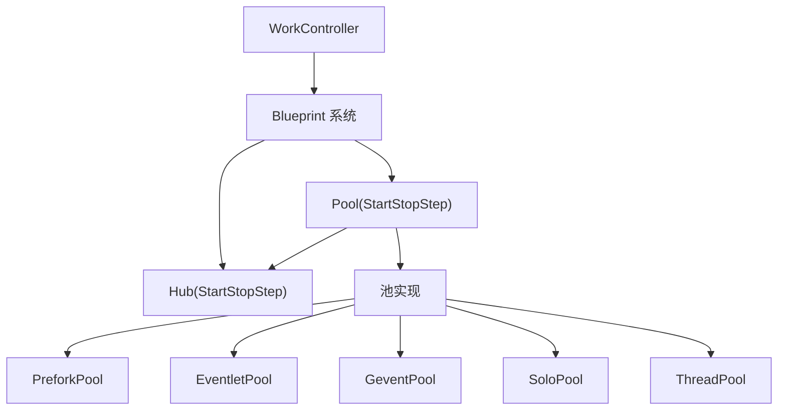
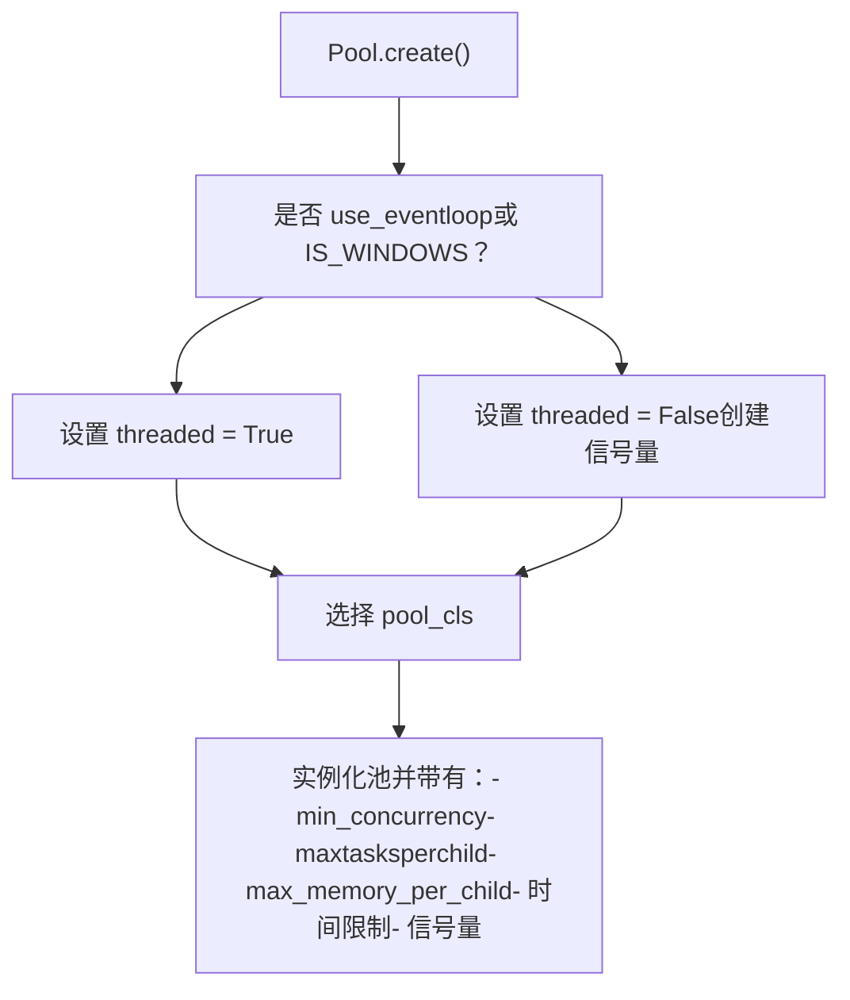
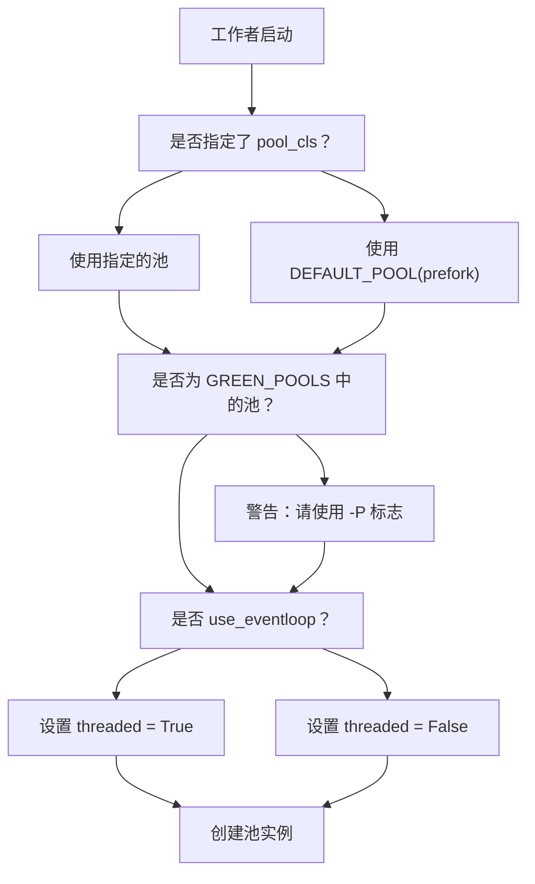
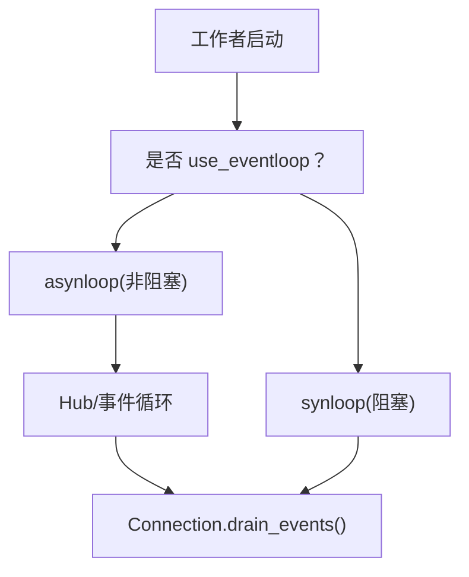

# 并发模型 (Concurrency Models)

相关源文件

-   [.bumpversion.cfg](https://github.com/celery/celery/blob/4d068b56/.bumpversion.cfg)
-   [Changelog.rst](https://github.com/celery/celery/blob/4d068b56/Changelog.rst)
-   [README.rst](https://github.com/celery/celery/blob/4d068b56/README.rst)
-   [celery/__init__.py](https://github.com/celery/celery/blob/4d068b56/celery/__init__.py)
-   [celery/bootsteps.py](https://github.com/celery/celery/blob/4d068b56/celery/bootsteps.py)
-   [celery/contrib/sphinx.py](https://github.com/celery/celery/blob/4d068b56/celery/contrib/sphinx.py)
-   [celery/worker/autoscale.py](https://github.com/celery/celery/blob/4d068b56/celery/worker/autoscale.py)
-   [celery/worker/components.py](https://github.com/celery/celery/blob/4d068b56/celery/worker/components.py)
-   [celery/worker/loops.py](https://github.com/celery/celery/blob/4d068b56/celery/worker/loops.py)
-   [docs/getting-started/introduction.rst](https://github.com/celery/celery/blob/4d068b56/docs/getting-started/introduction.rst)
-   [docs/history/changelog-5.5.rst](https://github.com/celery/celery/blob/4d068b56/docs/history/changelog-5.5.rst)
-   [docs/history/changelog-5.6.rst](https://github.com/celery/celery/blob/4d068b56/docs/history/changelog-5.6.rst)
-   [docs/history/index.rst](https://github.com/celery/celery/blob/4d068b56/docs/history/index.rst)
-   [docs/history/whatsnew-5.5.rst](https://github.com/celery/celery/blob/4d068b56/docs/history/whatsnew-5.5.rst)
-   [docs/history/whatsnew-5.6.rst](https://github.com/celery/celery/blob/4d068b56/docs/history/whatsnew-5.6.rst)
-   [docs/includes/introduction.txt](https://github.com/celery/celery/blob/4d068b56/docs/includes/introduction.txt)
-   [docs/includes/resources.txt](https://github.com/celery/celery/blob/4d068b56/docs/includes/resources.txt)
-   [docs/index.rst](https://github.com/celery/celery/blob/4d068b56/docs/index.rst)

## 目的与范围

本文件描述了 Celery 工作者执行任务时可用的并发模型。并发模型决定了工作者进程如何同时执行多个任务。Celery 支持多种池 (pool) 实现，提供了针对各种工作负载类型优化的不同并发策略。

有关工作者架构和生命周期的信息，请参阅[工作者架构与 Bootsteps](/celery/celery/5.1-worker-architecture-and-bootsteps)。有关工作者配置选项，请参阅[工作者配置与控制](/celery/celery/5.4-worker-configuration-and-control)。

## 概览 (Overview)

Celery 工作者使用 **池 (pool)** 抽象来管理并发执行。池充当工作者消费者（负责接收任务消息）与实际任务执行之间的层。不同的池实现提供了不同的并发策略：

-   **prefork**：使用多进程（multiprocessing）实现并行执行（默认）
-   **eventlet**：通过绿线程（green threads）使用协作式多任务
-   **gevent**：通过 greenlets 使用协作式多任务
-   **solo**：在主进程中同步执行任务
-   **threads**：使用多线程实现并发执行

来源：[celery/app/defaults.py11](https://github.com/celery/celery/blob/4d068b56/celery/app/defaults.py#L11-L11) [celery/worker/components.py18](https://github.com/celery/celery/blob/4d068b56/celery/worker/components.py#L18-L18) [docs/userguide/workers.rst392-410](https://github.com/celery/celery/blob/4d068b56/docs/userguide/workers.rst#L392-L410)

## 池架构 (Pool Architecture)

### 池的 Bootstep 集成

池组件通过 bootsteps 系统与工作者集成。它是一个管理池生命周期的 `StartStopStep`。


**图表：通过 Bootsteps 集成池**

来源：[celery/worker/components.py101-179](https://github.com/celery/celery/blob/4d068b56/celery/worker/components.py#L101-L179) [celery/bootsteps.py355-384](https://github.com/celery/celery/blob/4d068b56/celery/bootsteps.py#L355-L384)

### 池的 Bootstep 实现

池的 bootstep 定义在 `celery.worker.components.Pool` 中：

| 方法 | 描述 |
| --- | --- |
| `__init__` | 解析自动伸缩（autoscale）设置，初始化池属性 |
| `create` | 实例化选定的池实现 |
| `close` | 优雅地关闭池 |
| `terminate` | 强制终止池 |
| `register_with_event_loop` | 向事件循环注册池（针对异步池） |

`create` 方法根据工作者设置确定池配置：


**图表：池创建流程**

来源：[celery/worker/components.py138-172](https://github.com/celery/celery/blob/4d068b56/celery/worker/components.py#L138-L172)

## 可用的并发模型

### Prefork 池 (默认)

prefork 池使用 Python 的 `multiprocessing` 模块创建独立的工作者进程。这是默认且最常用的池类型。

**特性：**

-   **并发性**：使用独立进程实现真正的并行
-   **隔离性**：每个任务都在具有独立内存空间的独立进程中运行
-   **CPU 密集型任务**：非常适合 CPU 密集型工作负载
-   **内存**：由于进程独立，内存开销较高
-   **信号处理**：支持通过信号控制时间限制

**配置：**

```
# 默认配置
worker_pool = 'prefork'  # 或省略，因为这是默认值
worker_concurrency = None  # 默认使用 CPU 核心数
```
**默认设置：**

| 设置项 | 默认值 | 描述 |
| --- | --- | --- |
| `DEFAULT_POOL` | `'prefork'` | 默认池类型 |
| `worker_concurrency` | `None` | 如果为 None，则为 CPU 核心数 |
| `worker_max_tasks_per_child` | `None` | 在执行 N 个任务后重启工作者 |
| `worker_max_memory_per_child` | `None` | 在达到内存限制后重启工作者 |

**进程管理：**

-   支持自动伸缩（参见[自动伸缩](/celery/celery/5.6-autoscaling)）
-   支持用于定期重启工作者的 `maxtasksperchild`
-   支持用于基于内存限制重启工作者的 `max_memory_per_child`

来源：[celery/app/defaults.py11](https://github.com/celery/celery/blob/4d068b56/celery/app/defaults.py#L11-L11) [celery/app/defaults.py338-340](https://github.com/celery/celery/blob/4d068b56/celery/app/defaults.py#L338-L340) [docs/userguide/workers.rst392-410](https://github.com/celery/celery/blob/4d068b56/docs/userguide/workers.rst#L392-L410)

### Eventlet 池

eventlet 池通过绿线程使用协作式多任务。任务在 I/O 操作期间让出控制权，从而允许成千上万个并发连接。

**特性：**

-   **并发性**：协作式多任务（非并行）
-   **I/O 密集型任务**：非常适合 I/O 密集型工作负载
-   **内存**：内存开销低
-   **可扩展性**：可以处理成千上万个并发任务
-   **局限性**：没有真正的并行；CPU 密集型任务会阻塞整个池

**要求：**

```
pip install celery[eventlet]
```
**用法：**

```
celery -A proj worker -P eventlet -c 1000
```
**重要注意事项：**

-   必须通过 `-P` 标志指定，而非 `worker_pool` 配置项
-   Monkey patching（猴子补丁）在工作者启动早期应用
-   与嵌入式 Beat 调度器 (`-B` 标志) 不兼容
-   时间限制的工作方式与 prefork 不同

来源：[celery/worker/components.py18](https://github.com/celery/celery/blob/4d068b56/celery/worker/components.py#L18-L18) [celery/worker/components.py20-23](https://github.com/celery/celery/blob/4d068b56/celery/worker/components.py#L20-L23) [docs/userguide/workers.rst396-397](https://github.com/celery/celery/blob/4d068b56/docs/userguide/workers.rst#L396-L397)

### Gevent 池

gevent 池与 eventlet 类似，但使用 gevent 库进行协作式多任务。

**特性：**

-   **并发性**：使用 greenlets 的协作式多任务
-   **I/O 密集型任务**：非常适合 I/O 密集型工作负载
-   **API**：与 eventlet 类似，但底层实现不同
-   **兼容性**：与某些 C 扩展的兼容性更好

**要求：**

```
pip install celery[gevent]
```
**用法：**

```
celery -A proj worker -P gevent -c 1000
```
**Gevent vs Eventlet：**

-   Gevent 使用 libev 作为事件循环（速度更快）
-   更好的 C 扩展兼容性
-   不同的 monkey patching 行为
-   类似的使用场景和局限性

来源：[celery/worker/components.py18](https://github.com/celery/celery/blob/4d068b56/celery/worker/components.py#L18-L18) [docs/getting-started/introduction.rst116](https://github.com/celery/celery/blob/4d068b56/docs/getting-started/introduction.rst#L116-L116)

### Solo 池

solo 池在主工作者进程中同步执行任务，不具任何并发性。

**特性：**

-   **并发性**：无（顺序执行）
-   **使用场景**：开发、调试或测试
-   **简洁性**：没有进程/线程管理的开销
-   **局限性**：一次只能执行一个任务；远程控制命令可能会阻塞

**用法：**

```
celery -A proj worker -P solo
```
**何时使用：**

-   使用调试器调试任务
-   孤立测试任务行为
-   在资源受限的环境中简化部署
-   必须不能并发运行的任务

**远程控制局限性：**

> solo 池支持远程控制命令，但任何正在执行的任务都会阻塞任何等待中的控制命令，因此如果工作者非常繁忙，其用途有限。

来源：[docs/userguide/workers.rst425-451](https://github.com/celery/celery/blob/4d068b56/docs/userguide/workers.rst#L425-L451)

### Threads 池

threads 池使用 Python 线程进行并发执行。

**特性：**

-   **并发性**：并发但非并行（受限于 GIL）
-   **使用场景**：Windows 上的 I/O 密集型任务
-   **GIL**：受限于 Python 的全局解释器锁 (Global Interpreter Lock)
-   **兼容性**：适用于包括 Windows 在内的所有平台

**用法：**

```
celery -A proj worker -P threads
```
**注意事项：**

-   对于 CPU 密集型任务受限于 Python GIL
-   优于 solo，但对于 I/O 而言不如 eventlet/gevent 高效
-   在 Windows 上且事件循环不可用时的默认选择

来源：[celery/worker/components.py143](https://github.com/celery/celery/blob/4d068b56/celery/worker/components.py#L143-L143)

## 池的选择与配置

### 选择过程


**图表：池选择流程**

来源：[celery/worker/components.py138-172](https://github.com/celery/celery/blob/4d068b56/celery/worker/components.py#L138-L172)

### 配置选项

**命令行选择：**

```
# 使用 prefork (默认)
celery -A proj worker

# 使用 eventlet
celery -A proj worker -P eventlet -c 1000

# 使用 gevent
celery -A proj worker -P gevent -c 500

# 使用 solo
celery -A proj worker -P solo

# 使用 threads
celery -A proj worker -P threads -c 10
```
**并发配置：**

```
# 设置并发级别
celery -A proj worker -P prefork -c 4

# 使用自动伸缩 (仅限 prefork)
celery -A proj worker --autoscale=10,3  # 最大=10, 最小=3
```
**配置设置项：**

| 设置项 | 类型 | 默认值 | 描述 |
| --- | --- | --- | --- |
| `worker_pool` | str | `'prefork'` | 池实现类 |
| `worker_concurrency` | int | CPU 核心数 | 并发工作者数量 |
| `worker_autoscaler` | str | `'celery.worker.autoscale:Autoscaler'` | 自动伸缩器类 |
| `worker_pool_putlocks` | bool | `True` | 在池中使用 putlocks |
| `worker_pool_restarts` | bool | `False` | 允许池重启 |

来源：[celery/app/defaults.py313-362](https://github.com/celery/celery/blob/4d068b56/celery/app/defaults.py#L313-L362) [celery/worker/components.py117-172](https://github.com/celery/celery/blob/4d068b56/celery/worker/components.py#L117-L172)

### 关于绿池 (Green Pools) 的警告

如果您在配置中将 `worker_pool` 设置为 `'eventlet'` 或 `'gevent'`，Celery 将发出警告：

> worker_pool 设置不应用于选择 eventlet/gevent 池，相反，您*必须使用 -P* 参数，以便尽早应用补丁。

这是因为 eventlet 和 gevent 要求对标准库模块进行猴子补丁 (monkey patching)，这必须在其他导入之前发生。

来源：[celery/worker/components.py25-29](https://github.com/celery/celery/blob/4d068b56/celery/worker/components.py#L25-L29) [celery/worker/components.py141-142](https://github.com/celery/celery/blob/4d068b56/celery/worker/components.py#L141-L142)

## 池执行模型

### 任务执行流

> **[Mermaid sequence]**
> *(图表结构无法解析)*

**图表：跨池类型的任务执行**

来源：[celery/worker/loops.py50-99](https://github.com/celery/celery/blob/4d068b56/celery/worker/loops.py#L50-L99) [celery/worker/components.py138-172](https://github.com/celery/celery/blob/4d068b56/celery/worker/components.py#L138-L172)

### 线程模式 vs 非线程模式

池 bootstep 决定是以“线程 (threaded)”模式还是“非线程”模式运行：

```
threaded = not w.use_eventloop or IS_WINDOWS
```
**非线程模式 (异步 I/O)：**

-   在事件循环可用时与 prefork 池配合使用
-   使用信号量进行流控制 (`LaxBoundedSemaphore`)
-   通过异步 I/O 将任务发送到池进程
-   效率更高，但需要事件循环支持

**线程模式：**

-   与绿池 (eventlet/gevent) 配合使用或在 Windows 上运行
-   使用线程原语进行同步
-   在事件循环不可用时的回退方案
-   启用 `pool_putlocks` 以实现线程安全的队列操作

来源：[celery/worker/components.py143-153](https://github.com/celery/celery/blob/4d068b56/celery/worker/components.py#L143-L153)

### 信号量与流控制 (Semaphore and Flow Control)

在非线程模式下，Celery 使用 `LaxBoundedSemaphore` 来控制任务流：

```
if not threaded:
    semaphore = w.semaphore = LaxBoundedSemaphore(procs)
    w._quick_acquire = w.semaphore.acquire
    w._quick_release = w.semaphore.release
```
这可以防止工作者根据池进程的数量接受超过其处理能力的更多任务。

来源：[celery/worker/components.py144-153](https://github.com/celery/celery/blob/4d068b56/celery/worker/components.py#L144-L153)

## 对比与使用场景

### 特性对比

| 特性 | Prefork | Eventlet | Gevent | Solo | Threads |
| --- | --- | --- | --- | --- | --- |
| **真正并行** | ✓ | ✗ | ✗ | ✗ | ✗ (受限 GIL) |
| **CPU 密集型任务** | 优秀 | 差 | 优秀 | 差 | 差 |
| **I/O 密集型任务** | 良好 | 优秀 | 优秀 | 差 | 良好 |
| **内存效率** | 中等 | 高 | 高 | 高 | 高 |
| **并发规模** | 10s-100s | 成千上万 | 成千上万 | 1 | 10s |
| **时间限制** | 硬性+软性 | 仅限软性 | 仅限软性 | 两者皆有 | 仅限软性 |
| **进程隔离** | ✓ | ✗ | ✗ | ✗ | ✗ |
| **自动伸缩** | ✓ | ✗ | ✗ | ✗ | ✗ |
| **Windows 支持** | ✓ | ✗ | ✗ | ✓ | ✓ |
| **调试** | 较难 | 较难 | 较难 | 容易 | 中等 |

### 使用建议

**在以下情况使用 Prefork：**

-   任务是 CPU 密集型的
-   您需要进程隔离
-   内存使用不是约束条件
-   您需要自动伸缩支持
-   您需要通过信号控制硬性时间限制

**在以下情况使用 Eventlet/Gevent：**

-   任务是 I/O 密集型的（HTTP 请求、数据库查询）
-   您需要处理成千上万个并发连接
-   内存效率至关重要
-   任务在 I/O 操作期间让出控制权
-   您不需要 CPU 密集型操作

**在以下情况使用 Solo：**

-   使用调试器调试任务
-   在开发环境下运行
-   测试任务行为
-   任务绝对不能并发运行
-   简化部署

**在以下情况使用 Threads：**

-   在没有 eventlet/gevent 的 Windows 上运行
-   具有中等并发需求的 I/O 密集型任务
-   您需要线程安全库

来源：[docs/userguide/workers.rst392-410](https://github.com/celery/celery/blob/4d068b56/docs/userguide/workers.rst#L392-L410) [docs/userguide/workers.rst695-733](https://github.com/celery/celery/blob/4d068b56/docs/userguide/workers.rst#L695-L733)

## 时间限制支持 (Time Limits Support)

时间限制在不同池类型中的行为有所不同：

| 池类型 | 硬性时间限制 | 软性时间限制 |
| --- | --- | --- |
| **Prefork** | ✓ (SIGKILL) | ✓ (SoftTimeLimitExceeded) |
| **Gevent** | ✗ | ✓ (greenlet.kill) |
| **Eventlet** | ✗ | ✓ (超时) |
| **Solo** | ✓ (SIGKILL) | ✓ (SoftTimeLimitExceeded) |
| **Threads** | ✗ | ✓ (异常) |

**Prefork 池：**

-   软性时间限制在任务中抛出 `SoftTimeLimitExceeded`
-   硬性时间限制向工作者进程发送 `SIGKILL`

**绿池 (Green Pools)：**

-   仅支持软性时间限制
-   使用 greenlet/eventlet 超时机制
-   无法强制终止 greenlets

来源：[docs/userguide/workers.rst695-733](https://github.com/celery/celery/blob/4d068b56/docs/userguide/workers.rst#L695-L733)

## 事件循环集成

### 事件循环 vs 同步循环

根据池类型和代理支持，Celery 工作者使用异步事件循环 (`asynloop`) 或同步循环 (`synloop`)：


**图表：事件循环选择**

**Asynloop (非阻塞)：**

-   在传输支持异步 I/O 时使用
-   与 kombu Hub 集成
-   对于带有 AMQP/Redis 的 prefork 效率更高
-   池通过 `register_with_event_loop()` 向事件循环注册

**Synloop (阻塞)：**

-   针对不支持异步的传输的回退方案
-   使用 `connection.drain_events(timeout=2.0)` 阻塞调用
-   更简单但效率较低

来源：[celery/worker/loops.py50-136](https://github.com/celery/celery/blob/4d068b56/celery/worker/loops.py#L50-L136) [celery/worker/components.py177-178](https://github.com/celery/celery/blob/4d068b56/celery/worker/components.py#L177-L178)

### 池的事件循环注册

池 bootstep 提供了一个 `register_with_event_loop()` 方法：

```
def register_with_event_loop(self, w, hub):
    w.pool.register_with_event_loop(hub)
```
这允许池与用于异步 I/O 操作的 Hub 集成。prefork 池将其用于非阻塞任务提交。

来源：[celery/worker/components.py177-178](https://github.com/celery/celery/blob/4d068b56/celery/worker/components.py#L177-L178)

## 池进程管理

### 工作者进程生命周期 (Prefork)

> **[Mermaid stateDiagram]**
> *(图表结构无法解析)*

**图表：Prefork 池进程生命周期**

### 池配置参数

池 bootstep 使用以下参数实例化池：

```
pool = self.instantiate(
    w.pool_cls, w.min_concurrency,
    initargs=(w.app, w.hostname),
    maxtasksperchild=w.max_tasks_per_child,
    max_memory_per_child=w.max_memory_per_child,
    timeout=w.time_limit,
    soft_timeout=w.soft_time_limit,
    putlocks=w.pool_putlocks and threaded,
    lost_worker_timeout=w.worker_lost_wait,
    threads=threaded,
    max_restarts=max_restarts,
    allow_restart=allow_restart,
    forking_enable=True,
    semaphore=semaphore,
    sched_strategy=self.optimization,
    app=w.app,
)
```
| 参数 | 描述 |
| --- | --- |
| `min_concurrency` | 工作者进程的初始数量 |
| `initargs` | 传递给工作者进程初始化的参数 |
| `maxtasksperchild` | 在执行 N 个任务后重启工作者（防止泄漏） |
| `max_memory_per_child` | 达到内存限制后重启工作者 |
| `timeout` | 任务的硬性时间限制 |
| `soft_timeout` | 任务的软性时间限制 |
| `putlocks` | 在任务队列操作中使用锁 |
| `lost_worker_timeout` | 认为工作者丢失前的超时时间 |
| `threads` | 是否使用线程模式或异步模式 |
| `max_restarts` | 池的最大重启次数（非线程模式下为 100） |
| `allow_restart` | 允许池在失败时重启 |
| `semaphore` | 用于流控制的信号量（仅限非线程模式） |
| `sched_strategy` | 调度策略（公平/默认） |

来源：[celery/worker/components.py154-170](https://github.com/celery/celery/blob/4d068b56/celery/worker/components.py#L154-L170)

## 实现说明

### 绿池限制 (Green Pool Restrictions)

绿池 (eventlet/gevent) 具有特殊限制：

1.  **必须使用 `-P` 标志**：由于猴子补丁的要求，不能通过 `worker_pool` 配置进行设置。
2.  **不能使用嵌入式 Beat**：绿池无法使用 `-B` 标志。
3.  **不同的线程原语**：Hub 使用 `DummyLock` 而非真正的锁。

```
GREEN_POOLS = {'eventlet', 'gevent'}

if w.app.conf.worker_pool in GREEN_POOLS:
    warnings.warn(UserWarning(W_POOL_SETTING))
```
尝试使用嵌入式 Beat 时的错误消息：

```
ERR_B_GREEN = """
-B 选项不适用于 eventlet/gevent 池：\请改用独立运行的 beat。\n"""
```
来源：[celery/worker/components.py18](https://github.com/celery/celery/blob/4d068b56/celery/worker/components.py#L18-L18) [celery/worker/components.py20-23](https://github.com/celery/celery/blob/4d068b56/celery/worker/components.py#L20-L23) [celery/worker/components.py141-142](https://github.com/celery/celery/blob/4d068b56/celery/worker/components.py#L141-L142) [celery/worker/components.py198-201](https://github.com/celery/celery/blob/4d068b56/celery/worker/components.py#L198-L201)

### Hub 与 Timer 集成

Hub bootstep 创建用于异步操作的事件循环：

```python
def create(self, w):
    w.hub = get_event_loop()
    if w.hub is None:
        required_hub = getattr(w._conninfo, 'requires_hub', None)
        w.hub = set_event_loop((
            required_hub if required_hub else _Hub)(w.timer))
    self._patch_thread_primitives(w)
    return self
```
使用事件循环时，线程原语会被修补以使用伪锁：

```python
def _patch_thread_primitives(self, w):
    # 使时钟使用伪锁
    w.app.clock.mutex = DummyLock()
```
来源：[celery/worker/components.py56-99](https://github.com/celery/celery/blob/4d068b56/celery/worker/components.py#L56-L99)

### 任务 Join 行为

池会设置一个标志，指示对任务的 join 操作是否会阻塞：

```python
from celery._state import _set_task_join_will_block

_set_task_join_will_block(pool.task_join_will_block)
```
这会影响结果的检索方式，以及工作者是否可以安全地 join 任务结果。

来源：[celery/worker/components.py171](https://github.com/celery/celery/blob/4d068b56/celery/worker/components.py#L171-L171)

## 总结

Celery 的并发模型系统为不同类型的工作负载提供了选择合适执行策略的灵活性。池 bootstep 通过 bootsteps 框架管理池的生命周期，同时支持从并行多进程到协作式多任务的多种池实现。

**关键要点：**

-   **Prefork** 是默认值，最适合 CPU 密集型任务。
-   **Eventlet/Gevent** 在高并发的 I/O 密集型任务中表现出色。
-   **Solo** 最适合调试和开发。
-   **Threads** 提供了一个折中方案，尤其是在 Windows 上。
-   池的选择会影响内存使用、并发规模以及特性的可用性。
-   事件循环集成可为兼容的传输实现高效的异步 I/O。

来源：[celery/worker/components.py101-179](https://github.com/celery/celery/blob/4d068b56/celery/worker/components.py#L101-L179) [celery/app/defaults.py11](https://github.com/celery/celery/blob/4d068b56/celery/app/defaults.py#L11-L11) [docs/userguide/workers.rst392-410](https://github.com/celery/celery/blob/4d068b56/docs/userguide/workers.rst#L392-L410)
