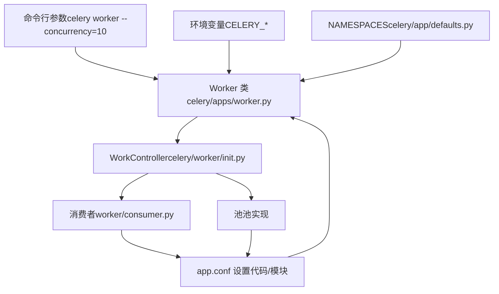
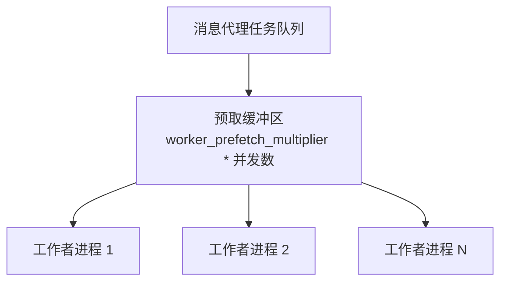
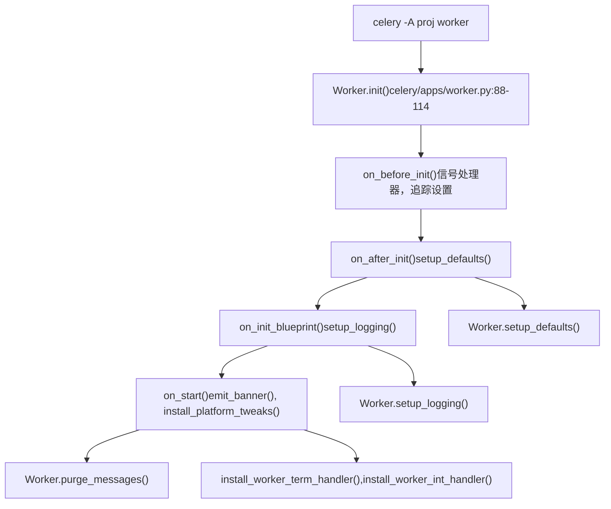

# 工作者配置与控制

相关源文件

-   [celery/app/defaults.py](https://github.com/celery/celery/blob/4d068b56/celery/app/defaults.py)
-   [docs/faq.rst](https://github.com/celery/celery/blob/4d068b56/docs/faq.rst)
-   [docs/getting-started/first-steps-with-celery.rst](https://github.com/celery/celery/blob/4d068b56/docs/getting-started/first-steps-with-celery.rst)
-   [docs/getting-started/next-steps.rst](https://github.com/celery/celery/blob/4d068b56/docs/getting-started/next-steps.rst)
-   [docs/userguide/calling.rst](https://github.com/celery/celery/blob/4d068b56/docs/userguide/calling.rst)
-   [docs/userguide/monitoring.rst](https://github.com/celery/celery/blob/4d068b56/docs/userguide/monitoring.rst)
-   [docs/userguide/periodic-tasks.rst](https://github.com/celery/celery/blob/4d068b56/docs/userguide/periodic-tasks.rst)
-   [docs/userguide/routing.rst](https://github.com/celery/celery/blob/4d068b56/docs/userguide/routing.rst)
-   [docs/userguide/tasks.rst](https://github.com/celery/celery/blob/4d068b56/docs/userguide/tasks.rst)
-   [docs/userguide/workers.rst](https://github.com/celery/celery/blob/4d068b56/docs/userguide/workers.rst)

本页面记录了工作者配置选项以及用于在运行时管理 Celery 工作者的远程控制机制。它涵盖了配置源、可用设置、命令行选项以及用于远程工作者管理的控制 (control)/检查 (inspect) API。

有关工作者架构与初始化，请参阅第 5.1 页。有关工作者生命周期与停机程序，请参阅第 5.2 页。有关并发池实现，请参阅第 5.3 页。

---

## 配置源与优先级

工作者配置从多个来源加载，并具有特定的优先级顺序。来自高优先级源的设置会覆盖来自低优先级源的设置。位于 [celery/apps/worker.py85-280](https://github.com/celery/celery/blob/4d068b56/celery/apps/worker.py#L85-L280) 的 `Worker` 类在初始化期间处理这些配置。

### 通过工作者组件的配置流


**来源：** [celery/apps/worker.py85-280](https://github.com/celery/celery/blob/4d068b56/celery/apps/worker.py#L85-L280) [celery/app/defaults.py1-436](https://github.com/celery/celery/blob/4d068b56/celery/app/defaults.py#L1-L436)

### 配置命名空间

工作者配置被组织到由 [celery/app/defaults.py66-363](https://github.com/celery/celery/blob/4d068b56/celery/app/defaults.py#L66-L363) 中的 `NAMESPACES` 对象定义的命名空间中。每个命名空间将相关的 `Option` 实例分组：

| 命名空间 | 前缀 | 用途 | 定义位置 |
| --- | --- | --- | --- |
| `worker` | `worker_*` | 工作者进程行为与资源 | [celery/app/defaults.py313-362](https://github.com/celery/celery/blob/4d068b56/celery/app/defaults.py#L313-L362) |
| `task` | `task_*` | 影响工作者的任务执行设置 | [celery/app/defaults.py259-312](https://github.com/celery/celery/blob/4d068b56/celery/app/defaults.py#L259-L312) |
| `broker` | `broker_*` | 消息代理连接设置 | [celery/app/defaults.py83-107](https://github.com/celery/celery/blob/4d068b56/celery/app/defaults.py#L83-L107) |
| `result` | `result_*` | 结果后端设置 | [celery/app/defaults.py204-229](https://github.com/celery/celery/blob/4d068b56/celery/app/defaults.py#L204-L229) |
| `event` | `event_*` | 事件监控设置 | [celery/app/defaults.py178-188](https://github.com/celery/celery/blob/4d068b56/celery/app/defaults.py#L178-L188) |

**来源：** [celery/app/defaults.py66-363](https://github.com/celery/celery/blob/4d068b56/celery/app/defaults.py#L66-L363)

---

## 工作者配置设置

### 核心工作者设置

下表描述了来自 [celery/app/defaults.py313-362](https://github.com/celery/celery/blob/4d068b56/celery/app/defaults.py#L313-L362) 中 `worker` 命名空间的基本工作者配置选项。每个设置项都被定义为具有默认值和类型的 `Option` 实例。

| 设置项 | 类型 | 默认值 | 描述 | Option 行号 |
| --- | --- | --- | --- | --- |
| `worker_concurrency` | int | None | 工作者进程/线程的数量 | [322 行](https://github.com/celery/celery/blob/4d068b56/celery/app/defaults.py#L322-L322) |
| `worker_pool` | str | `'prefork'` | 池实现 (prefork, eventlet, gevent, solo, thread) | [340 行](https://github.com/celery/celery/blob/4d068b56/celery/app/defaults.py#L340-L340) |
| `worker_prefetch_multiplier` | int | 4 | 每个工作者进程预取 (prefetch) 的任务数 | [344 行](https://github.com/celery/celery/blob/4d068b56/celery/app/defaults.py#L344-L344) |
| `worker_max_tasks_per_child` | int | None | 在执行 N 个任务后重启工作者 | [339 行](https://github.com/celery/celery/blob/4d068b56/celery/app/defaults.py#L339-L339) |
| `worker_max_memory_per_child` | int | None | 达到内存限制 (KB) 后重启工作者 | [338 行](https://github.com/celery/celery/blob/4d068b56/celery/app/defaults.py#L338-L338) |
| `worker_lost_wait` | float | 10.0 | 等待丢失的工作者进程的秒数 | [337 行](https://github.com/celery/celery/blob/4d068b56/celery/app/defaults.py#L337-L337) |
| `worker_disable_rate_limits` | bool | False | 禁用所有速率限制 | [325-327 行](https://github.com/celery/celery/blob/4d068b56/celery/app/defaults.py#L325-L327) |
| `worker_enable_remote_control` | bool | True | 启用远程控制命令 | [331-333 行](https://github.com/celery/celery/blob/4d068b56/celery/app/defaults.py#L331-L333) |
| `worker_send_task_events` | bool | False | 发出任务监控事件 | [354-356 行](https://github.com/celery/celery/blob/4d068b56/celery/app/defaults.py#L354-L356) |
| `worker_state_db` | str | None | 持久化状态数据库文件路径 | [357 行](https://github.com/celery/celery/blob/4d068b56/celery/app/defaults.py#L357-L357) |
| `worker_autoscaler` | str | `'celery.worker.autoscale:Autoscaler'` | 自动伸缩器类 | [316 行](https://github.com/celery/celery/blob/4d068b56/celery/app/defaults.py#L316-L316) |
| `worker_consumer` | str | `'celery.worker.consumer:Consumer'` | 消费者类 | [323 行](https://github.com/celery/celery/blob/4d068b56/celery/app/defaults.py#L323-L323) |

**来源：** [celery/app/defaults.py313-362](https://github.com/celery/celery/blob/4d068b56/celery/app/defaults.py#L313-L362) [docs/userguide/workers.rst331-390](https://github.com/celery/celery/blob/4d068b56/docs/userguide/workers.rst#L331-L390)

### 预取 (Prefetch) 与 QoS 设置


`worker_prefetch_multiplier` 决定了每个工作者进程从代理中预留多少消息：

-   **默认值：4** —— 每个工作者预取 4 条消息
-   **总预取量** = `并发数 * prefetch_multiplier`
-   **示例**：8 个工作者 × 4 预取 = 预留 32 条消息

完全禁用预取（不推荐）：

```
app.conf.worker_disable_prefetch = True
```
**来源：** [celery/app/defaults.py344-347](https://github.com/celery/celery/blob/4d068b56/celery/app/defaults.py#L344-L347) [docs/userguide/workers.rst391-410](https://github.com/celery/celery/blob/4d068b56/docs/userguide/workers.rst#L391-L410)

### 工作者生命周期设置

| 设置项 | 类型 | 默认值 | 描述 |
| --- | --- | --- | --- |
| `worker_soft_shutdown_timeout` | float | 0.0 | 在冷停机前的限时热停机时间（秒） |
| `worker_enable_soft_shutdown_on_idle` | bool | False | 即使没有任务运行也启用软停机 |
| `worker_cancel_long_running_tasks_on_connection_loss` | bool | False | 代理连接丢失时取消任务 |
| `worker_proc_alive_timeout` | float | 4.0 | 验证工作者进程存活的超时时间 |
| `worker_pool_restarts` | bool | False | 启用自动池重启 |

**来源：** [celery/app/defaults.py318-343](https://github.com/celery/celery/blob/4d068b56/celery/app/defaults.py#L318-L343)

### 日志与监控设置

| 设置项 | 类型 | 默认值 | 描述 |
| --- | --- | --- | --- |
| `worker_log_format` | str | 见默认值 | 工作者日志消息格式 |
| `worker_log_color` | bool | 取决于环境 | 启用彩色日志输出 |
| `worker_hijack_root_logger` | bool | True | 将根日志记录器重定向到 Celery |
| `worker_redirect_stdouts` | bool | True | 将 stdout/stderr 重定向到日志记录器 |
| `worker_redirect_stdouts_level` | str | `'WARNING'` | 重定向输出的日志级别 |
| `worker_task_log_format` | str | 见默认值 | 任务执行消息的日志格式 |

**来源：** [celery/app/defaults.py334-358](https://github.com/celery/celery/blob/4d068b56/celery/app/defaults.py#L334-L358)

### 任务执行设置

这些任务级设置会影响工作者执行任务的方式：

| 设置项 | 类型 | 默认值 | 描述 |
| --- | --- | --- | --- |
| `task_acks_late` | bool | False | 在执行后确认任务（而非执行前） |
| `task_acks_on_failure_or_timeout` | bool | True | 确认失败/超时的任务 |
| `task_reject_on_worker_lost` | bool | None | 如果工作者进程死亡则拒绝任务 |
| `task_track_started` | bool | False | 向结果后端报告 STARTED 状态 |
| `task_time_limit` | float | None | 硬性时间限制（秒） |
| `task_soft_time_limit` | float | None | 软性时间限制（抛出异常） |
| `task_default_rate_limit` | str | None | 默认速率限制（例如 '100/m'） |
| `task_remote_tracebacks` | bool | False | 在任务消息中发送异常回溯 |

**来源：** [celery/app/defaults.py259-311](https://github.com/celery/celery/blob/4d068b56/celery/app/defaults.py#L259-L311) [docs/userguide/tasks.rst1020-1100](https://github.com/celery/celery/blob/4d068b56/docs/userguide/tasks.rst#L1020-L1100)

---

## 命令行选项

工作者接受许多覆盖配置设置的命令行选项。`celery worker` 命令提供了主要接口，由 [celery/apps/worker.py85-280](https://github.com/celery/celery/blob/4d068b56/celery/apps/worker.py#L85-L280) 中的 `Worker` 类实现。

### 从命令行初始化工作者


**来源：** [celery/apps/worker.py88-161](https://github.com/celery/celery/blob/4d068b56/celery/apps/worker.py#L88-L161)

### 基本命令行选项

| 选项 | 短选项 | 类型 | 示例 | 描述 |
| --- | --- | --- | --- | --- |
| `--concurrency` | `-c` | int | `-c 8` | 工作者进程数量 |
| `--pool` | `-P` | str | `-P eventlet` | 池实现 |
| `--hostname` | `-n` | str | `-n worker1@%h` | 工作者节点名称 |
| `--loglevel` | `-l` | str | `-l INFO` | 日志级别 |
| `--queues` | `-Q` | str | `-Q celery,priority` | 要消费的队列 |
| `--autoscale` |  | str | `--autoscale=10,3` | 自动伸缩 (max,min) |
| `--max-tasks-per-child` |  | int | `--max-tasks-per-child=1000` | N 次任务后重启 |
| `--max-memory-per-child` |  | int | `--max-memory-per-child=200000` | 内存限制后重启 (KB) |
| `--time-limit` |  | float | `--time-limit=300` | 硬性时间限制（秒） |
| `--soft-time-limit` |  | float | `--soft-time-limit=240` | 软性时间限制（秒） |
| `--statedb` |  | str | `--statedb=/var/celery/worker.db` | 状态持久化文件 |
| `--purge` |  | flag | `--purge` | 启动时清除消息 |
| `--task-events` | `-E` | flag | `-E` | 启用任务事件监控 |

**来源：** [docs/userguide/workers.rst11-62](https://github.com/celery/celery/blob/4d068b56/docs/userguide/workers.rst#L11-L62) [celery/apps/worker.py85-280](https://github.com/celery/celery/blob/4d068b56/celery/apps/worker.py#L85-L280)

### 主机名变量展开 (Hostname Variable Expansion)

`--hostname` 选项支持针对多工作者部署的变量展开：

| 变量 | 展开内容 | 示例 |
| --- | --- | --- |
| `%h` | 带有域名的完整主机名 | `worker@host.example.com` |
| `%n` | 仅主机名 | `worker@host` |
| `%d` | 仅域名 | `worker@example.com` |
| `%i` | 池进程索引 (主进程为 0) | `worker-1` |
| `%I` | 带有分隔符的池进程索引 | `worker-1` (主进程为空) |

启动多个工作者的示例：

```
celery -A proj worker -n worker1@%h -c 4 -Q queue1
celery -A proj worker -n worker2@%h -c 4 -Q queue2
```
**来源：** [docs/userguide/workers.rst36-62](https://github.com/celery/celery/blob/4d068b56/docs/userguide/workers.rst#L36-L62) [docs/userguide/workers.rst331-390](https://github.com/celery/celery/blob/4d068b56/docs/userguide/workers.rst#L331-L390)

---

## 远程控制命令 (Remote Control Commands)

Celery 提供了一个用于在运行时管理工作者的控制 API。命令通过使用代理的控制交换机 (control exchange) 的广播机制发送。控制接口通过 `app.control` 方法暴露。

### 控制消息流

```mermaid
flowchart TD
    CLIENT["app.control.broadcast()app.control.inspect()"]
    CTRL_EX["控制交换机control_exchange 设置"]
    CTRL_Q1["celery@worker1.celery.pidbox"]
    CTRL_Q2["celery@worker2.celery.pidbox"]
    CTRL_QN["celery@workerN.celery.pidbox"]
    CONSUMER1["消费者 Consumer.controlworker/consumer/control.py"]
    CONSUMER2["消费者 Consumer.controlworker/consumer/control.py"]
    CONSUMERN["消费者 Consumer.controlworker/consumer/control.py"]
    HANDLER1["控制面板 Control.Panel命令处理器"]
    HANDLER2["控制面板 Control.Panel命令处理器"]
    HANDLERN["控制面板 Control.Panel命令处理器"]
    REPLY_Q["响应队列临时的 pidbox 队列"]

    CLIENT --> CTRL_EX
    CTRL --> EX_CTRL_Q1
    CTRL --> EX_CTRL_Q2
    CTRL --> EX_CTRL_QN
    CTRL --> Q1_CONSUMER1
    CTRL --> Q2_CONSUMER2
    CTRL --> QN_CONSUMERN
    CONSUMER1 --> HANDLER1
    CONSUMER2 --> HANDLER2
    CONSUMERN --> HANDLERN
    HANDLER1 --> REPLY_Q
    HANDLER2 --> REPLY_Q
    HANDLERN --> REPLY_Q
    REPLY --> Q_CLIENT
```


**来源：** [docs/userguide/workers.rst412-497](https://github.com/celery/celery/blob/4d068b56/docs/userguide/workers.rst#L412-L497) [docs/userguide/monitoring.rst23-205](https://github.com/celery/celery/blob/4d068b56/docs/userguide/monitoring.rst#L23-L205)

### 控制交换机配置

控制交换机通过 [celery/app/defaults.py150-156](https://github.com/celery/celery/blob/4d068b56/celery/app/defaults.py#L150-L156) 中的 `control` 命名空间进行配置。这些设置控制远程控制消息队列的行为：

| 设置项 | 类型 | 默认值 | 描述 | Option 行号 |
| --- | --- | --- | --- | --- |
| `control_exchange` | str | `'celery'` | 控制交换机名称 | [155 行](https://github.com/celery/celery/blob/4d068b56/celery/app/defaults.py#L155-L155) |
| `control_queue_ttl` | float | 300.0 | 控制队列 TTL（秒） | [151 行](https://github.com/celery/celery/blob/4d068b56/celery/app/defaults.py#L151-L151) |
| `control_queue_expires` | float | 10.0 | 控制队列过期时间（秒） | [152 行](https://github.com/celery/celery/blob/4d068b56/celery/app/defaults.py#L152-L152) |
| `control_queue_exclusive` | bool | False | 排他性控制队列 | [153 行](https://github.com/celery/celery/blob/4d068b56/celery/app/defaults.py#L153-L153) |
| `control_queue_durable` | bool | False | 持久性控制队列 | [154 行](https://github.com/celery/celery/blob/4d068b56/celery/app/defaults.py#L154-L154) |

控制队列名称格式为 `{exchange}@{hostname}.celery.pidbox`，其中 exchange 默认为 `'celery'`，hostname 是工作者的节点名称。

**来源：** [celery/app/defaults.py150-156](https://github.com/celery/celery/blob/4d068b56/celery/app/defaults.py#L150-L156) [docs/userguide/workers.rst412-497](https://github.com/celery/celery/blob/4d068b56/docs/userguide/workers.rst#L412-L497)

### 检查命令 (Inspect Commands - 只读)

检查命令查询工作者状态而不修改它。所有检查命令都通过 `app.control.inspect()` 访问，并支持通过 `destination` 参数针对特定工作者。

#### 命令参考

| 命令 | 描述 | 返回值 | CLI 命令 |
| --- | --- | --- | --- |
| `active()` | 列出当前正在执行的任务 | 每个工作者的任务信息字典 | `celery -A proj inspect active` |
| `scheduled()` | 列出具有 ETA/countdown 的任务 | 每个工作者的已调度任务字典 | `celery -A proj inspect scheduled` |
| `reserved()` | 列出正在等待执行的预取任务 | 每个工作者的预留任务字典 | `celery -A proj inspect reserved` |
| `stats()` | 工作者统计数据与指标 | 每个工作者的统计信息字典 | `celery -A proj inspect stats` |
| `registered()` | 列出已注册的任务名称 | 每个工作者的任务名称列表 | `celery -A proj inspect registered` |
| `active_queues()` | 列出正在被消费的队列 | 每个工作者的队列信息列表 | `celery -A proj inspect active_queues` |
| `conf()` | 工作者配置设置 | 每个工作者的配置字典 | `celery -A proj inspect conf` |
| `query_task(task_ids)` | 查询有关特定任务的信息 | 如果找到，返回任务信息字典 | `celery -A proj inspect query_task <id>` |
| `revoked()` | 列出已撤销的任务 ID | 每个工作者的已撤销任务 ID 集合 | `celery -A proj inspect revoked` |

#### 用法示例

```
# 从所有工作者获取统计数据
>>> app.control.inspect().stats()
{'worker1@host': {'total': {...}, 'pool': {...}},
 'worker2@host': {'total': {...}, 'pool': {...}}}

# 从特定工作者获取活跃任务
>>> i = app.control.inspect(destination=['worker1@host'])
>>> i.active()
{'worker1@host': [{'id': 'task-id', 'name': 'myapp.tasks.add', ...}]}

# 按 ID 查询任务
>>> app.control.inspect().query_task('task-id-123')
{'worker1@host': {'id': 'task-id-123', 'name': '...', 'state': 'RUNNING'}}
```
命令行等效操作：

```
# 检查活跃任务
celery -A proj inspect active

# 针对特定工作者
celery -A proj inspect active -d worker1@host
```
**来源：** [docs/userguide/monitoring.rst101-159](https://github.com/celery/celery/blob/4d068b56/docs/userguide/monitoring.rst#L101-L159) [docs/userguide/workers.rst412-497](https://github.com/celery/celery/blob/4d068b56/docs/userguide/workers.rst#L412-L497)

### 工作者统计数据结构 (Worker Statistics Structure)

`stats()` 命令返回详细的工作者指标：

```
{
    'worker1@host': {
        'total': {
            'tasks.add': 1234,  # 每个任务类型的计数
            # ...
        },
        'pool': {
            'max-concurrency': 8,
            'processes': [12345, 12346, ...],
            'max-tasks-per-child': 1000,
            'put-guarded-by-semaphore': True,
            'timeouts': (0.1, 0.1),
        },
        'clock': '12345',
        'uptime': 3600,
        'rusage': {...},  # 资源使用情况
        'prefetch_count': 4,
        'broker': {
            'hostname': 'localhost',
            'port': 5672,
            'transport': 'amqp',
        },
    }
}
```
**来源：** [docs/userguide/monitoring.rst140-144](https://github.com/celery/celery/blob/4d068b56/docs/userguide/monitoring.rst#L140-L144)

### 控制命令 (Control Commands - 写操作)

控制命令修改工作者状态或触发操作。

#### 池管理 (Pool Management)

| 命令 | 参数 | 描述 | CLI 命令 |
| --- | --- | --- | --- |
| `pool_grow(n)` | `n`: int | 向池中添加 n 个工作者进程 | `celery -A proj control pool_grow <n>` |
| `pool_shrink(n)` | `n`: int | 从池中移除 n 个工作者进程 | `celery -A proj control pool_shrink <n>` |
| `autoscale(max, min)` | `max`, `min`: int | 更改自动伸缩设置 | `celery -A proj control autoscale <max> <min>` |
| `pool_restart()` | 无 | 重启工作者池 | `celery -A proj control pool_restart` |

```
# 将池扩大 2 个进程
>>> app.control.pool_grow(2)

# 设置自动伸缩限制
>>> app.control.autoscale(max=10, min=3)
```
命令行等效操作：

```
# 扩大池
celery -A proj control pool_grow 2

# 自动伸缩
celery -A proj control autoscale 10 3
```
**来源：** [docs/userguide/monitoring.rst161-210](https://github.com/celery/celery/blob/4d068b56/docs/userguide/monitoring.rst#L161-L210)

#### 队列管理 (Queue Management)

| 命令 | 参数 | 描述 | CLI 命令 |
| --- | --- | --- | --- |
| `add_consumer(queue)` | `queue`: str, `exchange`, `routing_key`, `exchange_type` | 开始从队列消费 | `celery -A proj control add_consumer <queue>` |
| `cancel_consumer(queue)` | `queue`: str | 停止从队列消费 | `celery -A proj control cancel_consumer <queue>` |

```
# 开始从新队列消费
>>> app.control.add_consumer('priority', reply=True)
{'worker1@host': {'ok': 'now consuming from priority'}}

# 停止从队列消费
>>> app.control.cancel_consumer('low-priority')
```
命令行等效操作：

```
# 添加消费者
celery -A proj control add_consumer priority

# 取消消费者
celery -A proj control cancel_consumer low-priority
```
**来源：** [docs/userguide/monitoring.rst161-210](https://github.com/celery/celery/blob/4d068b56/docs/userguide/monitoring.rst#L161-L210)

#### 速率限制 (Rate Limiting)

| 命令 | 参数 | 描述 | CLI 命令 |
| --- | --- | --- | --- |
| `rate_limit(task_name, rate_limit)` | `task_name`: str, `rate_limit`: str | 设置任务速率限制 | `celery -A proj control rate_limit <task> <limit>` |
| `time_limit(task_name, soft, hard)` | `task_name`: str, `soft`: float, `hard`: float | 设置任务时间限制 | `celery -A proj control time_limit <task> <soft> <hard>` |

```
# 将速率限制设置为每分钟 100 个任务
>>> app.control.rate_limit('myapp.tasks.process', '100/m')

# 设置时间限制 (soft=60s, hard=120s)
>>> app.control.time_limit('myapp.tasks.slow', soft=60, hard=120)
```
命令行等效操作：

```
# 设置速率限制
celery -A proj control rate_limit myapp.tasks.process 100/m

# 设置时间限制
celery -A proj control time_limit myapp.tasks.slow 60 120
```
**来源：** [docs/userguide/workers.rst462-496](https://github.com/celery/celery/blob/4d068b56/docs/userguide/workers.rst#L462-L496) [docs/getting-started/first-steps-with-celery.rst401-414](https://github.com/celery/celery/blob/4d068b56/docs/getting-started/first-steps-with-celery.rst#L401-L414)

#### 事件监控 (Event Monitoring)

| 命令 | 描述 |
| --- | --- |
| `enable_events()` | 启用任务事件监控 |
| `disable_events()` | 禁用任务事件监控 |

```
# 在所有工作者上启用事件
>>> app.control.enable_events()

# 在特定工作者上禁用事件
>>> app.control.broadcast('disable_events',
...                       destination=['worker1@host'])
```
#### 任务撤销 (Task Revocation)

| 命令 | 参数 | 描述 |
| --- | --- | --- |
| `revoke(task_id)` | `task_id`: str, `terminate`: bool, `signal`: str | 按 ID 撤销任务 |
| `revoke_by_stamped_headers(headers)` | `headers`: dict | 按盖章标头撤销任务 |

```
# 撤销任务 (如果处于待处理状态则不会执行)
>>> app.control.revoke('task-id-123')

# 撤销并终止正在运行的任务
>>> app.control.revoke('task-id-123', terminate=True, signal='SIGKILL')

# 按标头撤销
>>> app.control.revoke_by_stamped_headers({'header': 'value'})
```
**来源：** [docs/userguide/workers.rst498-645](https://github.com/celery/celery/blob/4d068b56/docs/userguide/workers.rst#L498-L645)

#### 工作者管理 (Worker Management)

| 命令 | 参数 | 描述 | CLI 命令 |
| --- | --- | --- | --- |
| `shutdown()` | 无 | 启动热停机 | `celery -A proj control shutdown` |
| `heartbeat()` | 无 | 请求心跳响应 | 不适用 (自动) |
| `ping()` | 无 | 检查工作者是否存活 | `celery -A proj inspect ping` |
| `election()` | 无 | 选举主工作者 | `celery -A proj control election` |

```
# Ping 所有工作者 (在超时内返回)
>>> app.control.ping(timeout=1.0)
[{'worker1@host': {'ok': 'pong'}},
 {'worker2@host': {'ok': 'pong'}}]

# 关闭特定工作者
>>> app.control.broadcast('shutdown', destination=['worker1@host'])

# 关闭所有工作者
>>> app.control.shutdown()
```
命令行等效操作：

```
# Ping 工作者
celery -A proj inspect ping

# 关闭工作者
celery -A proj control shutdown
```
**来源：** [docs/userguide/monitoring.rst59-64](https://github.com/celery/celery/blob/4d068b56/docs/userguide/monitoring.rst#L59-L64)

### 广播 API (Broadcast API)

`broadcast()` 方法提供了对控制系统的底层访问，用于向工作者发送命令：

```
app.control.broadcast(
    command,              # 命令名称 (str)
    arguments=None,       # 命令参数 (dict)
    destination=None,     # 目标工作者 (主机名列表)
    reply=False,          # 是否等待回复 (bool)
    timeout=1.0,          # 回复超时时间 (float)
    limit=None,           # 最大回复数量 (int)
    callback=None,        # 回复回调 (callable)
)
```
发送自定义控制命令的示例：

```
>>> app.control.broadcast(
...     'rate_limit',
...     arguments={'task_name': 'myapp.tasks.add', 'rate_limit': '200/m'},
...     destination=['worker1@host', 'worker2@host'],
...     reply=True
... )
[{'worker1@host': {'ok': 'rate limit set'}},
 {'worker2@host': {'ok': 'rate limit set'}}]
```
`destination` 参数接受：

-   `None` —— 广播到所有工作者（默认）
-   `['worker1@host']` —— 单个工作者
-   `['worker1@host', 'worker2@host']` —— 多个工作者

`timeout` 参数（默认 1.0）决定了等待回复的时间。对于慢速网络或繁忙的工作者，请增加此值。

**来源：** [docs/userguide/workers.rst453-496](https://github.com/celery/celery/blob/4d068b56/docs/userguide/workers.rst#L453-L496)

---

## 配置模式

### 通过 Python 模块进行配置

创建一个 `celeryconfig.py` 模块：

```python
# celeryconfig.py
broker_url = 'amqp://localhost'
result_backend = 'redis://localhost'

# 工作者设置
worker_concurrency = 8
worker_prefetch_multiplier = 4
worker_max_tasks_per_child = 1000
worker_max_memory_per_child = 200000  # 200MB (以 KB 为单位)
worker_send_task_events = True
worker_state_db = '/var/celery/worker.db'

# 任务设置
task_acks_late = True
task_track_started = True
task_time_limit = 300
task_soft_time_limit = 240
```
加载配置：

```python
app.config_from_object('celeryconfig')
```
**来源：** [docs/getting-started/first-steps-with-celery.rst299-414](https://github.com/celery/celery/blob/4d068b56/docs/getting-started/first-steps-with-celery.rst#L299-L414)

### 环境变量配置

所有设置都可以通过使用 `CELERY_` 前缀的环境变量进行覆盖：

```bash
export CELERY_BROKER_URL='amqp://localhost'
export CELERY_WORKER_CONCURRENCY=8
export CELERY_WORKER_PREFETCH_MULTIPLIER=4
export CELERY_WORKER_MAX_TASKS_PER_CHILD=1000
```
### 运行时配置示例

完整的带配置的工作者启动：

```bash
# 启动具有全面配置的工作者
celery -A myapp worker \
  --hostname=worker1@%h \
  --concurrency=8 \
  --pool=prefork \
  --autoscale=10,3 \
  --max-tasks-per-child=1000 \
  --max-memory-per-child=200000 \
  --time-limit=300 \
  --soft-time-limit=240 \
  --loglevel=INFO \
  --logfile=/var/log/celery/worker1.log \
  --pidfile=/var/run/celery/worker1.pid \
  --statedb=/var/celery/worker1.db \
  --queues=celery,priority \
  --task-events
```
**来源：** [docs/userguide/workers.rst11-62](https://github.com/celery/celery/blob/4d068b56/docs/userguide/workers.rst#L11-L62) [celery/apps/worker.py85-280](https://github.com/celery/celery/blob/4d068b56/celery/apps/worker.py#L85-L280)

### 多工作者管理

`celery multi` 命令管理多个工作者：

```bash
# 启动多个工作者
celery multi start worker1 worker2 worker3 \
  -A myapp \
  --concurrency=8 \
  --logfile=/var/log/celery/%n%I.log \
  --pidfile=/var/run/celery/%n.pid

# 重启特定工作者
celery multi restart worker1 \
  -A myapp \
  --concurrency=8

# 停止所有工作者
celery multi stopwait worker1 worker2 worker3
```
**来源：** [docs/getting-started/next-steps.rst146-220](https://github.com/celery/celery/blob/4d068b56/docs/getting-started/next-steps.rst#L146-L220)

---

## 工作者状态持久化 (Worker State Persistence)

工作者可以使用 `--statedb` 选项将状态持久化到磁盘。这会保留：

-   已撤销的任务 ID
-   任务执行统计信息
-   工作者时钟状态

### 状态数据库配置

```python
# 配置
app.conf.worker_state_db = '/var/celery/worker.db'
```
或者通过命令行：

```bash
celery -A myapp worker --statedb=/var/run/celery/worker.state
```
### 已撤销任务的持久化

已撤销的任务存储在状态数据库中（当配置了 `--statedb` 时），并在启动时与其他工作者同步：

```python
# 带有持久化的撤销任务
>>> app.control.revoke('task-id-123')

# 工作者重启后，撤销状态被维持
>>> app.control.inspect().revoked()
{'worker1@host': ['task-id-123', ...]}`
```
环境变量控制撤销限制：

-   `CELERY_WORKER_REVOKES_MAX`：内存中保留的最大已撤销任务 ID 数量（默认：50000）
-   `CELERY_WORKER_REVOKE_EXPIRES`：撤销过期时间（秒，默认：10800，即 3 小时）

当超过撤销限制时，旧的撤销记录将在配置的时间后过期。类似地，成功任务的 ID 也可以通过以下方式限制：

-   `CELERY_WORKER_SUCCESSFUL_MAX`：最大成功任务 ID 数量（默认：1000）
-   `CELERY_WORKER_SUCCESSFUL_EXPIRES`：成功任务过期时间（默认：10800）

**来源：** [docs/userguide/workers.rst509-524](https://github.com/celery/celery/blob/4d068b56/docs/userguide/workers.rst#L509-L524) [docs/userguide/workers.rst597-624](https://github.com/celery/celery/blob/4d068b56/docs/userguide/workers.rst#L597-L624)

---

## 总结

Celery 中的工作者配置通过以下方式提供了对工作者行为的广泛控制：

1.  **配置源**：CLI 参数、环境变量、代码配置、配置模块以及具有明确优先级的默认值
2.  **工作者设置**：控制并发数、池类型、资源限制、监控和生命周期行为
3.  **任务设置**：配置确认 (acknowledgment)、时间限制、速率限制和状态追踪
4.  **命令行界面**：丰富的用于工作者启动和配置的选项集
5.  **远程控制**：用于运行时管理而无需重启的控制 (control) 与检查 (inspect) 命令
6.  **状态持久化**：使用状态数据库跨重启维护工作者状态

控制 API 通过代理的控制交换机实现了动态工作者管理，支持用于池管理、队列管理、速率限制和任务撤销的只读检查和写操作。

**来源：** [celery/app/defaults.py1-436](https://github.com/celery/celery/blob/4d068b56/celery/app/defaults.py#L1-L436) [celery/apps/worker.py1-518](https://github.com/celery/celery/blob/4d068b56/celery/apps/worker.py#L1-L518) [docs/userguide/workers.rst1-1500](https://github.com/celery/celery/blob/4d068b56/docs/userguide/workers.rst#L1-L1500) [docs/userguide/monitoring.rst1-650](https://github.com/celery/celery/blob/4d068b56/docs/userguide/monitoring.rst#L1-L650)
