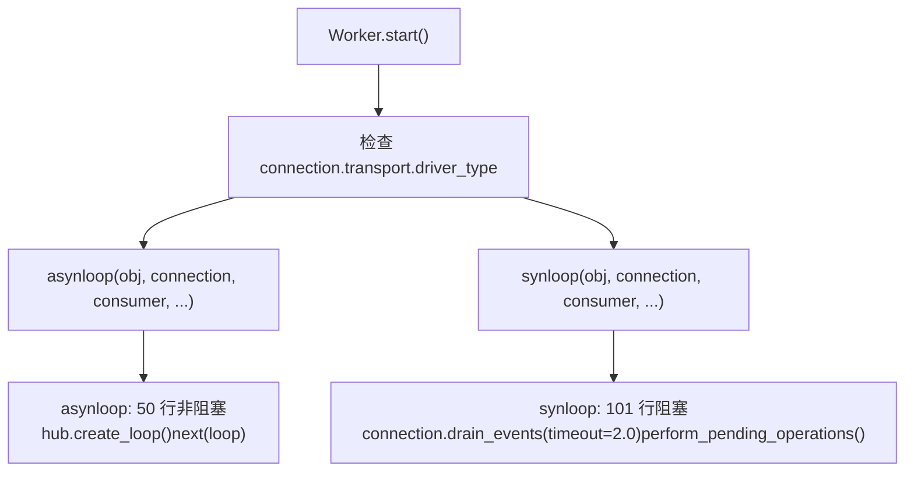
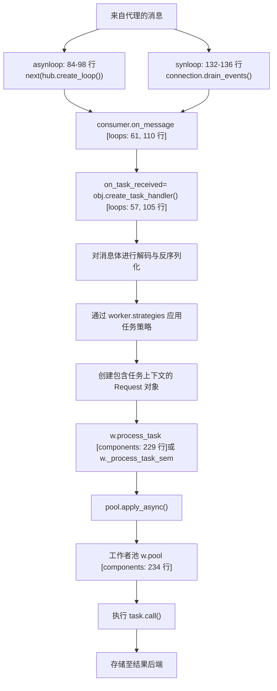
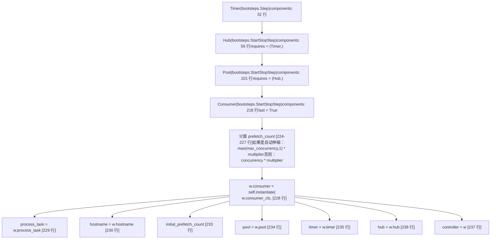
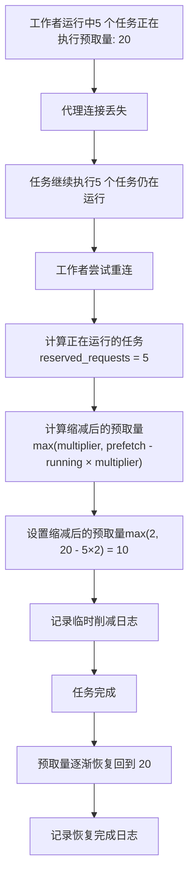
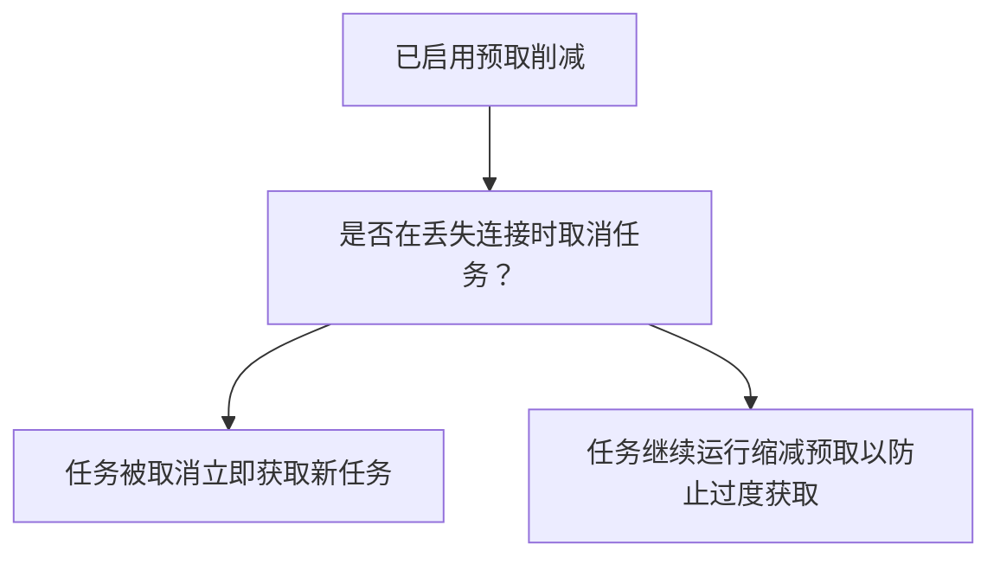
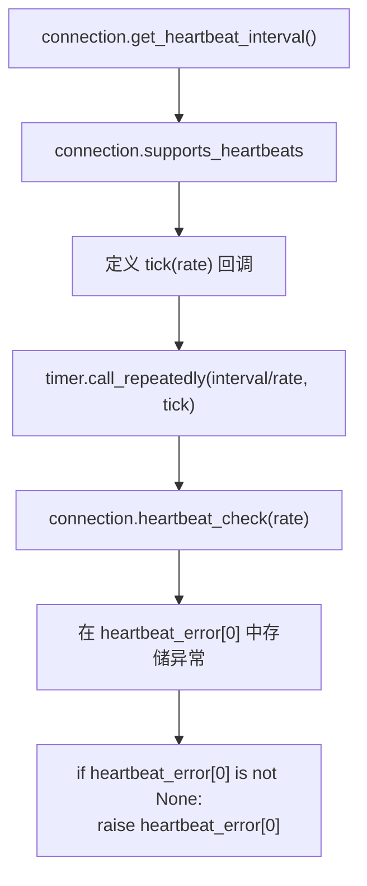

# 消费者与事件循环

相关源文件

-   [celery/bootsteps.py](https://github.com/celery/celery/blob/4d068b56/celery/bootsteps.py)
-   [celery/worker/autoscale.py](https://github.com/celery/celery/blob/4d068b56/celery/worker/autoscale.py)
-   [celery/worker/components.py](https://github.com/celery/celery/blob/4d068b56/celery/worker/components.py)
-   [celery/worker/loops.py](https://github.com/celery/celery/blob/4d068b56/celery/worker/loops.py)

本页面记录了 `Consumer` 组件以及驱动 Celery 工作者中消息消费的事件循环实现（`asynloop` 和 `synloop`）。它涵盖了消息处理流程、服务质量 (QoS) 管理、预取计数 (prefetch count) 处理以及连接恢复机制。

有关整体工作者架构以及 `Consumer` 组件如何初始化的信息，请参阅第 5.1 页。有关工作者生命周期事件的详细信息，请参阅第 5.2 页。有关自动伸缩集成的信息，请参阅第 5.6 页。

## 概览 (Overview)

定义在 [celery/worker/components.py218-243](https://github.com/celery/celery/blob/4d068b56/celery/worker/components.py#L218-L243) 中的 `Consumer` 类是工作者 blueprint 中的最后一个 bootstep。它被标记为 `last = True`，以确保它在所有基础设施组件（Timer, Hub, Pool）准备就绪后启动。`Consumer` 实例化了实际的消费者实现（通过 `w.consumer_cls`）并管理从代理（broker）中获取消息。

初始化后，消费者进入定义在 [celery/worker/loops.py](https://github.com/celery/celery/blob/4d068b56/celery/worker/loops.py) 中的两个事件循环实现之一：

| 事件循环 | 函数 | 传输支持 | 阻塞模型 |
| --- | --- | --- | --- |
| **asynloop** | 50 行的 `asynloop()` | AMQP, 异步 Redis | 使用 `hub.create_loop()` 的非阻塞模式 |
| **synloop** | 101 行的 `synloop()` | 所有传输（回退方案） | 使用 `connection.drain_events()` 的阻塞模式 |

事件循环负责处理：

-   与 `kombu.asynchronous.Hub` 集成以进行 I/O 多路复用
-   用于背压控制 (backpressure control) 的 QoS/预取计数管理
-   带有指数退避的自动代理重新连接
-   与执行池协调以进行任务分发

**来源：** [celery/worker/components.py218-243](https://github.com/celery/celery/blob/4d068b56/celery/worker/components.py#L218-L243) [celery/worker/loops.py1-11](https://github.com/celery/celery/blob/4d068b56/celery/worker/loops.py#L1-L11) [celery/worker/loops.py50](https://github.com/celery/celery/blob/4d068b56/celery/worker/loops.py#L50-L50) [celery/worker/loops.py101](https://github.com/celery/celery/blob/4d068b56/celery/worker/loops.py#L101-L101)

## 事件循环：asynloop vs synloop

根据代理传输的能力，Celery 工作者使用两种事件循环实现之一。事件循环是持续从代理获取并处理消息的核心机制。

### 事件循环选择

图表：基于传输类型的事件循环选择


**来源：** [celery/worker/loops.py50-99](https://github.com/celery/celery/blob/4d068b56/celery/worker/loops.py#L50-L99) [celery/worker/loops.py101-136](https://github.com/celery/celery/blob/4d068b56/celery/worker/loops.py#L101-L136)

### asynloop：非阻塞事件循环

`asynloop` 函数使用 Hub 的轮询器实现非阻塞事件循环，用于 I/O 多路复用。它适用于支持异步操作的传输。

**函数签名：**

```python
def asynloop(obj, connection, consumer, blueprint, hub, qos,
             heartbeat, clock, hbrate=2.0):
    """非阻塞事件循环。"""
```
**关键特性：**

| 维度 | 实现方式 |
| --- | --- |
| **阻塞策略** | 非阻塞，使用 `hub.create_loop()` 迭代器 |
| **I/O 模型** | 带有 Hub 集成的事件驱动轮询 |
| **QoS 更新** | 当没有挂起的消息时批量处理 |
| **心跳 (Heartbeat)** | 通过计时器回调处理 AMQP 心跳 |
| **集成** | 向事件循环注册消费者和控制器 |

图表：带有代码实体引用的 asynloop 执行流

**来源：** [celery/worker/loops.py50-98](https://github.com/celery/celery/blob/4d068b56/celery/worker/loops.py#L50-L98)

**asynloop 实现细节：**

1.  **初始化 (53-65 行)：**

    -   通过 `obj.create_task_handler()` 创建任务处理器
    -   使用 `_enable_amqheartbeats()` 设置 AMQP 心跳监控
    -   将处理器分配给 `consumer.on_message`
    -   向 Hub 注册消费者和控制器
    -   调用 `consumer.consume()` 开始消费
    -   调用 `obj.on_ready()` 回调
2.  **事件循环 (84-98 行)：**

    -   每次迭代检查 `blueprint.state == RUN` 和 `obj.connection`
    -   调用 `state.maybe_shutdown()` 检查停机信号
    -   通过 `heartbeat_error[0]` 验证心跳状态
    -   当 `qos.prev != qos.value` 时更新 QoS（延迟批量处理）
    -   调用 `next(loop)` 处理来自 Hub 的下一个事件
    -   在 `StopIteration` 时重新创建循环
3.  **池验证 (70-71 行)：**

    -   在首次启动 (`restart_count == 0`) 时，验证池是否启动成功
    -   如果池进程启动失败，则抛出 `WorkerLostError`
4.  **AMQP 快速排空 (Quick Drain) (76-77 行)：**

    -   对于 AMQP 传输，在消费后执行快速排空以清除预取的消息
    -   使用 `hub.call_soon(_quick_drain, connection)`

**来源：** [celery/worker/loops.py50-98](https://github.com/celery/celery/blob/4d068b56/celery/worker/loops.py#L50-L98)

### synloop：阻塞式回退循环 (Fallback Loop)

`synloop` 函数为不支持异步操作的传输实现了阻塞式事件循环。它使用带有超时的 `connection.drain_events()`。

**函数签名：**

```python
def synloop(obj, connection, consumer, blueprint, hub, qos,
            heartbeat, clock, hbrate=2.0, **kwargs):
    """针对不支持 AIO 的传输的回退阻塞式事件循环。"""
```
**关键特性：**

| 维度 | 实现方式 |
| --- | --- |
| **阻塞策略** | 阻塞，使用 `connection.drain_events(timeout=2.0)` |
| **I/O 模型** | 带有超时的阻塞模式 |
| **QoS 更新** | 每次迭代时检查 |
| **心跳** | 仅为绿池 (green pools)（eventlet/gevent）启用 |
| **集成** | 无需 Hub 注册 |

图表：带有代码实体引用的 synloop 执行流

**来源：** [celery/worker/loops.py101-136](https://github.com/celery/celery/blob/4d068b56/celery/worker/loops.py#L101-L136)

**synloop 实现细节：**

1.  **初始化 (105-113 行)：**

    -   通过 `obj.create_task_handler()` 创建任务处理器
    -   通过 `_enable_amqheartbeats()` 仅为绿池启用心跳
    -   将处理器分配给 `consumer.on_message`
    -   调用 `consumer.consume()` 开始消费
    -   调用 `obj.on_ready()` 回调
2.  **循环周期函数 (115-130 行)：**

    -   `_loop_cycle()` 执行一次迭代：
        -   检查心跳错误，如有则抛出
        -   如果需要，更新 QoS (`qos.prev != qos.value`)
        -   为周期性任务调用 `obj.perform_pending_operations()`
        -   调用 `connection.drain_events(timeout=2.0)` 阻塞等待消息
        -   优雅处理 `socket.timeout`（在没有消息时属于正常现象）
        -   仅在 `RUN` 状态下抛出 `OSError`
3.  **主循环 (132-136 行)：**

    -   在 `blueprint.state == RUN` 且 `obj.connection` 存在期间继续运行
    -   在每次迭代前调用 `state.maybe_shutdown()`
    -   在 finally 块中执行 `_loop_cycle()` 以确保其运行

**来源：** [celery/worker/loops.py101-136](https://github.com/celery/celery/blob/4d068b56/celery/worker/loops.py#L101-L136)

### 事件循环对比

| 特性 | asynloop | synloop |
| --- | --- | --- |
| **阻塞模型** | 非阻塞（事件驱动） | 阻塞，带有超时 |
| **传输支持** | AMQP, 异步 Redis | 所有传输（回退方案） |
| **Hub 集成** | 是，向 Hub 注册 | 无 Hub 注册 |
| **循环机制** | `next(hub.create_loop())` | `connection.drain_events(timeout=2.0)` |
| **QoS 更新** | 延迟处理（无消息时） | 每次迭代 |
| **心跳** | 始终通过计时器启用 | 仅限绿池 |
| **池验证** | 是（首次启动时） | 否 |
| **AMQP 快速排空** | 是（消费后） | 否 |
| **性能** | 较高（I/O 多路复用） | 较低（每个连接都会阻塞） |
| **使用场景** | 生产环境下的 AMQP/Redis | 回退方案/简单传输 |

**来源：** [celery/worker/loops.py50-136](https://github.com/celery/celery/blob/4d068b56/celery/worker/loops.py#L50-L136)

## 消息处理流程

一旦事件循环从代理中获取了一条消息，它就会流经消费者的消息处理流水线。

图表：带有代码实体的消息处理流水线


**来源：** [celery/worker/loops.py57-61](https://github.com/celery/celery/blob/4d068b56/celery/worker/loops.py#L57-L61) [celery/worker/loops.py105-110](https://github.com/celery/celery/blob/4d068b56/celery/worker/loops.py#L105-L110) [celery/worker/components.py228-234](https://github.com/celery/celery/blob/4d068b56/celery/worker/components.py#L228-L234)

### 任务处理器创建

任务处理器在事件循环设置期间通过 `obj.create_task_handler()` 创建。该处理器被分配给 `consumer.on_message` 以处理传入消息：

```python
# 在 asynloop 中
on_task_received = obj.create_task_handler()
consumer.on_message = on_task_received

# 在 synloop 中
on_task_received = obj.create_task_handler()
consumer.on_message = on_task_received
```
处理器验证消息，创建任务请求上下文，并使用适当的策略分发到池中。

**来源：** [celery/worker/loops.py57-61](https://github.com/celery/celery/blob/4d068b56/celery/worker/loops.py#L57-L61) [celery/worker/loops.py105-110](https://github.com/celery/celery/blob/4d068b56/celery/worker/loops.py#L105-L110)

### QoS 更新与消息优先级

两个事件循环都实现了延迟 QoS 更新以优化性能：

**asynloop QoS 策略 (89-93 行)：**

```python
# 我们仅在没有更多消息可读取时才更新 QoS。
# 这将 QoS 调用分组在一起，并确保
# 远程控制命令的优先级高于任务消息。
if qos.prev != qos.value:
    update_qos()
```
**synloop QoS 策略 (121-122 行)：**

```python
if qos.prev != qos.value:
    qos.update()
```
这种延迟更新策略：

-   批量处理 QoS 更新以减少代理往返。
-   确保在处理任务消息之前处理远程控制命令。
-   仅在 QoS 值发生变化时才更新。

**来源：** [celery/worker/loops.py89-93](https://github.com/celery/celery/blob/4d068b56/celery/worker/loops.py#L89-L93) [celery/worker/loops.py121-122](https://github.com/celery/celery/blob/4d068b56/celery/worker/loops.py#L121-L122)

### 挂起的操作 (Pending Operations)

`synloop` 在每次迭代中显式调用 `obj.perform_pending_operations()` 来处理周期性任务，例如：

-   计时器回调
-   心跳检查
-   状态持久化
-   池维护

`asynloop` 通过 Hub 集成隐式处理这些操作。

**来源：** [celery/worker/loops.py106](https://github.com/celery/celery/blob/4d068b56/celery/worker/loops.py#L106-L106) [celery/worker/loops.py124](https://github.com/celery/celery/blob/4d068b56/celery/worker/loops.py#L124-L124)

## 消费者组件架构

消费者 (Consumer) 作为一个 bootstep 实现，在工作者的初始化序列中始终是最后一个启动的组件。这确保了在消息消费开始之前，所有基础设施组件（Timer, Hub, Pool）均已就绪。

图表：带有代码实体的消费者 Bootstep 初始化


**来源：** [celery/worker/components.py218-243](https://github.com/celery/celery/blob/4d068b56/celery/worker/components.py#L218-L243) [celery/worker/components.py32-48](https://github.com/celery/celery/blob/4d068b56/celery/worker/components.py#L32-L48) [celery/worker/components.py56-99](https://github.com/celery/celery/blob/4d068b56/celery/worker/components.py#L56-L99) [celery/worker/components.py101-179](https://github.com/celery/celery/blob/4d068b56/celery/worker/components.py#L101-L179) [celery/bootsteps.py313-314](https://github.com/celery/celery/blob/4d068b56/celery/bootsteps.py#L313-L314)

**消费者类定义：**

[celery/worker/components.py218-243](https://github.com/celery/celery/blob/4d068b56/celery/worker/components.py#L218-L243) 中的 `Consumer` 类是一个 `StartStopStep`，它：

1.  **标记为最后** (`last = True`) —— 确保它在其所有依赖项之后启动。
2.  **计算预取计数** —— 基于并发数和自动伸缩设置。
3.  **实例化消费者实例** —— 使用所有必需参数创建实际的消费者。
4.  **注册组件** —— 传递对池、计时器、hub 和控制器的引用。

**传递给消费者的关键参数：**

| 参数 | 来源 | 目的 |
| --- | --- | --- |
| `process_task` | `w.process_task` | 消息处理函数 |
| `hostname` | `w.hostname` | 用于标识的工作者主机名 |
| `task_events` | `w.task_events` | 启用任务事件发布 |
| `init_callback` | `w.ready_callback` | 消费者就绪时的回调 |
| `initial_prefetch_count` | 计算得出 | 初始 QoS 预取计数 |
| `pool` | `w.pool` | 执行池引用 |
| `timer` | `w.timer` | 用于周期性操作的计时器 |
| `app` | `w.app` | Celery 应用实例 |
| `controller` | `w` | 工作者控制器引用 |
| `hub` | `w.hub` | 事件循环 hub (如果是异步) |

**来源：** [celery/worker/components.py224-242](https://github.com/celery/celery/blob/4d068b56/celery/worker/components.py#L224-L242)

## QoS 与预取计数管理 (QoS and Prefetch Count Management)

服务质量 (QoS) 和预取计数控制消费者在确认 (acknowledgment) 前从代理中获取多少条消息。这实现了背压 (backpressure)，以防止工作者被超过其处理能力的消息淹没。

### 预取计数计算

初始预取计数在 [celery/worker/components.py224-227](https://github.com/celery/celery/blob/4d068b56/celery/worker/components.py#L224-L227) 中根据工作者并发数计算：

| 配置 | 公式 | 示例 (并发数=5, 乘数=4) |
| --- | --- | --- |
| **未开启自动伸缩** | `并发数 × prefetch_multiplier` | 5 × 4 = 20 |
| **开启自动伸缩** | `max(max_concurrency, 1) × prefetch_multiplier` | max(10, 1) × 4 = 40 |

**计算逻辑：**

```python
if w.max_concurrency:
    prefetch_count = max(w.max_concurrency, 1) * w.prefetch_multiplier
else:
    prefetch_count = w.concurrency * w.prefetch_multiplier
```
预取乘数默认为 4，但可以通过 `worker_prefetch_multiplier` 进行配置。

**来源：** [celery/worker/components.py224-227](https://github.com/celery/celery/blob/4d068b56/celery/worker/components.py#L224-L227)

### QoS 更新策略

事件循环实现了延迟 QoS 更新以优化性能。更新仅在 QoS 值改变且没有挂起消息时发生：

**在 asynloop 中：**

```python
# 89-93 行
# 我们仅在没有更多消息可读取时才更新 QoS。
# 这将 QoS 调用分组在一起，并确保
# 远程控制命令的优先级高于任务消息。
if qos.prev != qos.value:
    update_qos()
```
**在 synloop 中：**

```python
# 121-122 行
if qos.prev != qos.value:
    qos.update()
```
该策略：

-   批量处理 QoS 更新以减少代理通信开销。
-   确保在任务消息之前处理远程控制命令。
-   仅在预取计数实际改变时才更新。

**来源：** [celery/worker/loops.py89-93](https://github.com/celery/celery/blob/4d068b56/celery/worker/loops.py#L89-L93) [celery/worker/loops.py121-122](https://github.com/celery/celery/blob/4d068b56/celery/worker/loops.py#L121-L122)

## 代理重连时的预取计数削减 (Prefetch Count Reduction)

当代理连接丢失且工作者重新连接时，Celery 可以自动减少预取计数，以防止在任务已经在运行时过度获取消息。此功能由 `worker_enable_prefetch_count_reduction` 配置项控制。

### 预取削减流


**来源：** [t/smoke/tests/test_consumer.py32-76](https://github.com/celery/celery/blob/4d068b56/t/smoke/tests/test_consumer.py#L32-L76)

### 削减公式

临时预取计数计算如下：

```python
reduced_prefetch = max(
    prefetch_multiplier,
    max_prefetch - (running_tasks_count × prefetch_multiplier)
)
```
其中：

-   `max_prefetch` = 原始预取计数 (例如 20)
-   `running_tasks_count` = 当前正在执行的任务数 (来自 `state.reserved_requests`)
-   `prefetch_multiplier` = 已配置的乘数 (例如 2)

**示例：** 设 `max_prefetch=20`, `prefetch_multiplier=2`, 且有 5 个正在运行的任务：

```python
reduced_prefetch = max(2, 20 - (5 × 2)) = max(2, 10) = 10
```
**来源：** [t/smoke/tests/test_consumer.py39-61](https://github.com/celery/celery/blob/4d068b56/t/smoke/tests/test_consumer.py#L39-L61)

### 日志消息

工作者在预取计数削减期间记录以下消息：

| 事件 | 日志消息示例 |
| --- | --- |
| **应用削减** | `"Temporarily reducing the prefetch count to 10 to avoid over-fetching since 5 tasks are currently being processed."` |
| **恢复通知** | `"The prefetch count will be gradually restored to 20 as the tasks complete processing."` |
| **完全恢复** | `"Resuming normal operations following a restart.
Prefetch count has been restored to the maximum of 20"` |

**来源：** [t/smoke/tests/test_consumer.py52-75](https://github.com/celery/celery/blob/4d068b56/t/smoke/tests/test_consumer.py#L52-L75)

### 配置

| 设置项 | 类型 | 默认值 | 描述 |
| --- | --- | --- | --- |
| `worker_enable_prefetch_count_reduction` | bool | False | 启用在重连时自动减少预取计数 |
| `worker_prefetch_multiplier` | int | 4 | 用于计算预取计数的乘数 |
| `worker_cancel_long_running_tasks_on_connection_loss` | bool | False | 在连接丢失时取消长时间运行的任务 |

**来源：** [t/smoke/tests/test_consumer.py34-37](https://github.com/celery/celery/blob/4d068b56/t/smoke/tests/test_consumer.py#L34-L37) [t/smoke/tests/test_consumer.py79-84](https://github.com/celery/celery/blob/4d068b56/t/smoke/tests/test_consumer.py#L79-L84) [t/smoke/tests/test_consumer.py99-105](https://github.com/celery/celery/blob/4d068b56/t/smoke/tests/test_consumer.py#L99-L105)

### 与任务取消的交互

当与 `worker_cancel_long_running_tasks_on_connection_loss = True` 结合使用时，消费者可以在重连期间取消正在运行的任务，从而允许立即获取新任务：


**来源：** [t/smoke/tests/test_consumer.py77-94](https://github.com/celery/celery/blob/4d068b56/t/smoke/tests/test_consumer.py#L77-L94)

## 停机期间的可见性超时重置 (Visibility Timeout Reset)

在使用支持可见性超时的代理（如 SQS, Redis）时，未确认的消息在指定时间内对其他消费者不可见。在工作者停机期间，Celery 会重置未确认消息的可见性超时，使其立即对其他工作者可用。

### 可见性超时机制

> **[Mermaid sequence]**
> *(图表结构无法解析)*

**来源：** [t/smoke/tests/test_worker.py318-407](https://github.com/celery/celery/blob/4d068b56/t/smoke/tests/test_worker.py#L318-L407)

### 可见性超时配置

| 配置项 | 位置 | 描述 |
| --- | --- | --- |
| `visibility_timeout` | app.conf | 全局可见性超时（秒） |
| `broker_transport_options['visibility_timeout']` | app.conf | 代理特定的可见性超时 |
| `result_backend_transport_options['visibility_timeout']` | app.conf | 后端特定的可见性超时 |

**配置示例：**

```python
app.conf.visibility_timeout = 3600  # 1 小时
app.conf.broker_transport_options = {
    "visibility_timeout": 3600,
    "polling_interval": 1,
}
```
**来源：** [t/smoke/tests/test_worker.py323-333](https://github.com/celery/celery/blob/4d068b56/t/smoke/tests/test_worker.py#L323-L333)

### 带有可见性超时重置的停机行为

在软停机期间（`SIGQUIT` 或通过 `REMAP_SIGTERM` 配置）：

1.  **启动停机**：工作者收到停机信号。
2.  **软停机周期**：工作者等待 `worker_soft_shutdown_timeout` 秒。
3.  **任务追踪**：工作者追踪未确认的消息。
4.  **可见性重置**：对于未确认的消息，将其可见性超时重置为 0。
5.  **日志记录**：工作者记录：`"Restoring N unacknowledged message(s)"`。
6.  **退出**：工作者退出，允许消息被其他工作者消费。

**来源：** [t/smoke/tests/test_worker.py335-354](https://github.com/celery/celery/blob/4d068b56/t/smoke/tests/test_worker.py#L335-L354)

### 测试场景

以下场景展示了可见性超时重置行为：

| 场景 | 描述 | 预期行为 |
| --- | --- | --- |
| **单个长任务** | 一个任务运行时间长于停机超时 | 任务被中断，消息被恢复，重新交付给重启后的工作者 |
| **组 - 部分完成** | 一个组包含一个短任务（完成）和一个长任务（未完成） | 短任务被确认，长任务消息被恢复 (1 条消息) |
| **组 - 未完成** | 一个组包含的所有长任务均未完成 | 所有消息均被恢复 (2 条消息) |

**来源：** [t/smoke/tests/test_worker.py335-407](https://github.com/celery/celery/blob/4d068b56/t/smoke/tests/test_worker.py#L335-L407)

### 示例日志输出

```
worker: Soft shutdown (MainProcess)
Initiating Soft Shutdown, terminating in 10 seconds
worker: Cold shutdown (MainProcess)
Restoring 1 unacknowledged message(s)
```
**来源：** [t/smoke/tests/test_worker.py351 行](https://github.com/celery/celery/blob/4d068b56/t/smoke/tests/test_worker.py#L351-L351)

## 连接管理与恢复

事件循环通过自动重连和状态验证处理代理连接故障。

### 心跳监控 (Heartbeat Monitoring)

两个事件循环都通过 [celery/worker/loops.py28-47](https://github.com/celery/celery/blob/4d068b56/celery/worker/loops.py#L28-L47) 中的 `_enable_amqheartbeats()` 辅助函数支持 AMQP 心跳监控。

**心跳配置：**


**来源：** [celery/worker/loops.py28-47](https://github.com/celery/celery/blob/4d068b56/celery/worker/loops.py#L28-L47)

**心跳实现：**

`_enable_amqheartbeats()` 函数：

1.  从连接中检索协商的心跳间隔。
2.  验证代理是否支持心跳。
3.  通过计时器以 `heartbeat/rate` 的间隔调度 `connection.heartbeat_check(rate)`。
4.  将任何异常存储在 `heartbeat_error` 列表中（通过引用传递）。
5.  事件循环检查 `heartbeat_error[0]`，如果不为 None 则抛出。

**asynloop 用法 (59 行)：**

```python
heartbeat_error = _enable_amqheartbeats(hub.timer, connection, rate=hbrate)
```
**synloop 用法 (108-109 行)：**

```python
if getattr(obj.pool, 'is_green', False):
    heartbeat_error = _enable_amqheartbeats(obj.timer, connection, rate=hbrate)
```
注意：`synloop` 仅为绿池（eventlet/gevent）启用心跳，以避免阻塞。

**来源：** [celery/worker/loops.py28-47](https://github.com/celery/celery/blob/4d068b56/celery/worker/loops.py#L28-L47) [celery/worker/loops.py59](https://github.com/celery/celery/blob/4d068b56/celery/worker/loops.py#L59-L59) [celery/worker/loops.py108-109](https://github.com/celery/celery/blob/4d068b56/celery/worker/loops.py#L108-L109)

### 连接状态验证

事件循环持续验证连接状态和工作者状态：

**Blueprint 状态检查：**

```python
while blueprint.state == RUN and obj.connection:
    # 处理消息
```
两个循环均检查：

-   `blueprint.state == RUN` —— 工作者不处于停机模式。
-   `obj.connection` —— 连接依然存在。
-   `state.maybe_shutdown()` —— 检查停机信号。

**来源：** [celery/worker/loops.py84](https://github.com/celery/celery/blob/4d068b56/celery/worker/loops.py#L84-L84) [celery/worker/loops.py132](https://github.com/celery/celery/blob/4d068b56/celery/worker/loops.py#L132-L132)

### 池进程验证 (仅限 asynloop)

`asynloop` 在首次运行时验证池进程是否成功启动：

```python
# 70-71 行
if not obj.restart_count and not obj.pool.did_start_ok():
    raise WorkerLostError('Could not start worker processes')
```
此检查：

-   仅在首次启动 (`restart_count == 0`) 时运行。
-   如果池进程启动失败，防止进入无限循环。
-   抛出 `WorkerLostError` 以触发优雅停机。

**来源：** [celery/worker/loops.py70-71](https://github.com/celery/celery/blob/4d068b56/celery/worker/loops.py#L70-L71)

### 代理重连 (Broker Reconnection)

当代理连接失败时，工作者会使用指数退避自动重连：

1.  **检测**：事件循环在消息排空期间检测到连接错误。
2.  **重试循环**：Kombu 连接层实现指数退避。
3.  **日志记录**：工作者记录 `"Trying again in X.XX seconds... (N/100)"`。
4.  **重连**：当代理可用时建立新连接。
5.  **预取调整**：应用已启用的预取计数削减（参见第 5.6 页）。
6.  **恢复**：事件循环继续处理消息。

**重试配置：**

| 参数 | 默认值 | 描述 |
| --- | --- | --- |
| `broker_connection_retry` | True | 启用自动重连 |
| `broker_connection_max_retries` | 100 | 最大重连尝试次数 |
| `broker_connection_retry_on_startup` | True | 在启动期间重试连接 |

**来源：** [celery/worker/loops.py84-98](https://github.com/celery/celery/blob/4d068b56/celery/worker/loops.py#L84-L98) [celery/worker/loops.py132-136](https://github.com/celery/celery/blob/4d068b56/celery/worker/loops.py#L132-L136)

## Hub 与事件循环集成

Hub（来自 kombu.asynchronous）提供了驱动 `asynloop` 的 I/O 多路复用层。它管理文件描述符、计时器和事件轮询机制。

### Hub 注册

组件在 `asynloop` 初始化期间向 Hub 注册：

```python
# 62-63 行
obj.controller.register_with_event_loop(hub)
obj.register_with_event_loop(hub)
```
注册允许组件：

-   为 I/O 轮询注册文件描述符。
-   在事件循环上调度回调。
-   与 Hub 的轮询器集成。

**来源：** [celery/worker/loops.py62-63](https://github.com/celery/celery/blob/4d068b56/celery/worker/loops.py#L62-L63)

### Hub 循环机制

Hub 创建一个在每次 I/O 事件时 yield 的迭代器：

```python
# 82-98 行
hub.propagate_errors = errors
loop = hub.create_loop()

while blueprint.state == RUN and obj.connection:
    # ... 状态与 QoS 检查 ...
    try:
        next(loop)
    except StopIteration:
        loop = hub.create_loop()
```
`hub.create_loop()` 方法：

-   返回一个轮询已注册文件描述符的迭代器。
-   在每次 I/O 事件后让出控制权。
-   当轮询器需要重置时抛出 `StopIteration`。
-   在 `StopIteration` 后重新创建。

**来源：** [celery/worker/loops.py82-98](https://github.com/celery/celery/blob/4d068b56/celery/worker/loops.py#L82-L98)

### AMQP 的快速排空

对于 AMQP 传输，`asynloop` 在消费后执行快速排空，以清除任何预取的消息：

```python
# 76-77 行
if connection.transport.driver_type == 'amqp':
    hub.call_soon(_quick_drain, connection)
```
`_quick_drain()` 辅助函数 (19-25 行)：

```python
def _quick_drain(connection, timeout=0.1):
    try:
        connection.drain_events(timeout=timeout)
    except Exception as exc:
        exc_errno = getattr(exc, 'errno', None)
        if exc_errno is not None and exc_errno != errno.EAGAIN:
            raise
```
这确保了消费者以没有任何缓存消息的干净状态启动。

**来源：** [celery/worker/loops.py76-77](https://github.com/celery/celery/blob/4d068b56/celery/worker/loops.py#L76-L77) [celery/worker/loops.py19-25](https://github.com/celery/celery/blob/4d068b56/celery/worker/loops.py#L19-L25)

## 自动伸缩集成 (Autoscaling Integration)

消费者与自动伸缩器 (Autoscaler) 组件集成（参见第 5.6 页），以便在工作者并发数改变时动态调整预取计数。

### 自动伸缩器注册

[celery/worker/autoscale.py31-58](https://github.com/celery/celery/blob/4d068b56/celery/worker/autoscale.py#L31-L58) 中的 `WorkerComponent` bootstep 将自动伸缩器注册到事件循环中：

**WorkerComponent.register_with_event_loop() 实现：**

```python
# celery/worker/autoscale.py:50-54
def register_with_event_loop(self, w, hub):
    w.consumer.on_task_message.add(w.autoscaler.maybe_scale)
    hub.call_repeatedly(
        w.autoscaler.keepalive, w.autoscaler.maybe_scale,
    )
```
此方法：

-   将 `w.autoscaler.maybe_scale` 添加到 `consumer.on_task_message` 信号中，在每次收到任务消息时触发伸缩检查。
-   通过 `hub.call_repeatedly()` 以 `keepalive` 间隔（默认为 30 秒，来自 28 行的 `AUTOSCALE_KEEPALIVE`）调度周期性的 `maybe_scale()` 调用。

**伸缩逻辑**：[celery/worker/autoscale.py94-96](https://github.com/celery/celery/blob/4d068b56/celery/worker/autoscale.py#L94-L96) 中的 `Autoscaler.maybe_scale()` 方法检查是否需要伸缩，并在做出调整后调用 `pool.maintain_pool()`。

**来源：** [celery/worker/autoscale.py28](https://github.com/celery/celery/blob/4d068b56/celery/worker/autoscale.py#L28-L28) [celery/worker/autoscale.py31-58](https://github.com/celery/celery/blob/4d068b56/celery/worker/autoscale.py#L31-L58) [celery/worker/autoscale.py50-54](https://github.com/celery/celery/blob/4d068b56/celery/worker/autoscale.py#L50-L54) [celery/worker/autoscale.py94-96](https://github.com/celery/celery/blob/4d068b56/celery/worker/autoscale.py#L94-L96)

### 预取计数更新

当 `Autoscaler` 通过 [celery/worker/autoscale.py98-109](https://github.com/celery/celery/blob/4d068b56/celery/worker/autoscale.py#L98-L109) 中的 `update()` 方法更改最大并发数时，它会更新消费者的预取计数：

**Autoscaler._update_consumer_prefetch_count() 实现：**

```python
# celery/worker/autoscale.py:133-138
def _update_consumer_prefetch_count(self, new_max):
    diff = new_max - self.max_concurrency
    if diff:
        self.worker.consumer._update_prefetch_count(diff)
```
此方法：

-   计算新旧最大并发数之间的差异。
-   调用 `consumer._update_prefetch_count(diff)` 来增量调整预取。
-   维持以下关系：`prefetch_count = max_concurrency × prefetch_multiplier`。

当提供了 `max` 参数时，在 103 行从 `Autoscaler.update()` 调用该更新。

**来源：** [celery/worker/autoscale.py98-109](https://github.com/celery/celery/blob/4d068b56/celery/worker/autoscale.py#L98-L109) [celery/worker/autoscale.py133-138](https://github.com/celery/celery/blob/4d068b56/celery/worker/autoscale.py#L133-L138)

## 配置参考

### 消费者与事件循环设置

| 设置项 | 类型 | 默认值 | 描述 |
| --- | --- | --- | --- |
| `worker_prefetch_multiplier` | int | 4 | 从并发数计算预取计数的乘数 |
| `worker_concurrency` | int | CPU 核心数 | 工作者进程/线程的数量 |
| `worker_pool` | str | 'prefork' | 池实现 (prefork, eventlet, gevent, solo, threads) |
| `broker_connection_retry` | bool | True | 启用自动代理重连 |
| `broker_connection_max_retries` | int | 100 | 最大重连尝试次数 |
| `broker_heartbeat` | int | 120 | AMQP 心跳间隔（秒，0 表示禁用） |
| `task_acks_late` | bool | False | 在任务执行后确认消息 |
| `worker_disable_rate_limits` | bool | False | 禁用任务速率限制 |

**来源：** [celery/worker/components.py224-242](https://github.com/celery/celery/blob/4d068b56/celery/worker/components.py#L224-L242) [celery/worker/loops.py28-47](https://github.com/celery/celery/blob/4d068b56/celery/worker/loops.py#L28-L47)

### 传输特定的设置

| 传输 (Transport) | 事件循环 | 心跳支持 | 配置说明 |
| --- | --- | --- | --- |
| **AMQP (RabbitMQ)** | asynloop | 是 | 原生异步支持，使用 Hub |
| **Redis** | asynloop/synloop | 否（使用轮询） | 异步 Redis 使用 asynloop |
| **SQS** | synloop | 否 | 基于轮询，阻塞循环 |
| **Kafka** | synloop | 否 | 需要阻塞式排空 |

**来源：** [celery/worker/loops.py50](https://github.com/celery/celery/blob/4d068b56/celery/worker/loops.py#L50-L50) [celery/worker/loops.py101](https://github.com/celery/celery/blob/4d068b56/celery/worker/loops.py#L101-L101)

### 事件循环选择

事件循环根据以下因素选择：

1.  **传输驱动类型** —— AMQP 传输使用 asynloop。
2.  **池类型** —— 绿池（eventlet/gevent）可能使用带有心跳的 synloop。
3.  **工作者配置** —— 可能会受到池选择的影响。

要显式选择事件循环特性：

-   对于 asynloop，使用 `-P prefork` 配合 AMQP。
-   对于 synloop，使用 `-P solo` 或 `-P threads` 配合非 AMQP 传输。
-   绿池 (eventlet/gevent) 使用 synloop，但带有绿色心跳。

**来源：** [celery/worker/loops.py1-11](https://github.com/celery/celery/blob/4d068b56/celery/worker/loops.py#L1-L11) [celery/worker/loops.py108-109](https://github.com/celery/celery/blob/4d068b56/celery/worker/loops.py#L108-L109)

## 测试消费者行为

Celery 测试套件包含了针对消费者行为的全面冒烟测试：

### 测试覆盖范围

| 测试类别 | 文件 | 关键测试项 |
| --- | --- | --- |
| **预取计数削减** | [t/smoke/tests/test_consumer.py](https://github.com/celery/celery/blob/4d068b56/t/smoke/tests/test_consumer.py) | `test_reducing_prefetch_count`, `test_prefetch_count_restored` |
| **可见性超时** | [t/smoke/tests/test_worker.py 318-407 行](https://github.com/celery/celery/blob/4d068b56/t/smoke/tests/test_worker.py#L318-L407) | `test_soft_shutdown_reset_visibility_timeout` |
| **代理恢复** | [t/smoke/tests/test_consumer.py 121-147 行](https://github.com/celery/celery/blob/4d068b56/t/smoke/tests/test_consumer.py#L121-L147) | `test_worker_consume_tasks_after_redis_broker_restart` |
| **任务取消** | [t/smoke/tests/test_consumer.py 77-94 行](https://github.com/celery/celery/blob/4d068b56/t/smoke/tests/test_consumer.py#L77-L94) | `test_max_prefetch_passed_on_broker_restart` |

**来源：** [t/smoke/tests/test_consumer.py](https://github.com/celery/celery/blob/4d068b56/t/smoke/tests/test_consumer.py) [t/smoke/tests/test_worker.py](https://github.com/celery/celery/blob/4d068b56/t/smoke/tests/test_worker.py)

### 示例测试配置

冒烟测试使用特定的工作者配置来验证消费者行为：

```python
# 预取计数削减测试配置
app.conf.worker_prefetch_multiplier = 2
app.conf.worker_concurrency = 5
app.conf.worker_enable_prefetch_count_reduction = True
app.conf.visibility_timeout = 3600
app.conf.broker_transport_options = {
    "visibility_timeout": 3600,
    "polling_interval": 1,
}
```
**来源：** [t/smoke/tests/test_consumer.py14-29](https://github.com/celery/celery/blob/4d068b56/t/smoke/tests/test_consumer.py#L14-L29)

---

**页面来源：** [celery/worker/components.py](https://github.com/celery/celery/blob/4d068b56/celery/worker/components.py) [celery/worker/autoscale.py](https://github.com/celery/celery/blob/4d068b56/celery/worker/autoscale.py) [celery/bootsteps.py](https://github.com/celery/celery/blob/4d068b56/celery/bootsteps.py) [t/smoke/tests/test_consumer.py](https://github.com/celery/celery/blob/4d068b56/t/smoke/tests/test_consumer.py) [t/smoke/tests/test_worker.py](https://github.com/celery/celery/blob/4d068b56/t/smoke/tests/test_worker.py) [t/smoke/conftest.py](https://github.com/celery/celery/blob/4d068b56/t/smoke/conftest.py)
