# 后端架构 (Backend Architecture)

相关源文件

-   [Makefile](https://github.com/celery/celery/blob/4d068b56/Makefile)
-   [celery/app/backends.py](https://github.com/celery/celery/blob/4d068b56/celery/app/backends.py)
-   [celery/app/builtins.py](https://github.com/celery/celery/blob/4d068b56/celery/app/builtins.py)
-   [celery/backends/base.py](https://github.com/celery/celery/blob/4d068b56/celery/backends/base.py)
-   [celery/backends/redis.py](https://github.com/celery/celery/blob/4d068b56/celery/backends/redis.py)
-   [celery/result.py](https://github.com/celery/celery/blob/4d068b56/celery/result.py)
-   [docs/Makefile](https://github.com/celery/celery/blob/4d068b56/docs/Makefile)
-   [docs/\_ext/celerydocs.py](https://github.com/celery/celery/blob/4d068b56/docs/_ext/celerydocs.py)
-   [docs/changelog\_formatter.py](https://github.com/celery/celery/blob/4d068b56/docs/changelog_formatter.py)
-   [docs/userguide/configuration.rst](https://github.com/celery/celery/blob/4d068b56/docs/userguide/configuration.rst)
-   [requirements/docs.txt](https://github.com/celery/celery/blob/4d068b56/requirements/docs.txt)
-   [requirements/pkgutils.txt](https://github.com/celery/celery/blob/4d068b56/requirements/pkgutils.txt)
-   [requirements/test-integration.txt](https://github.com/celery/celery/blob/4d068b56/requirements/test-integration.txt)
-   [t/unit/backends/test\_base.py](https://github.com/celery/celery/blob/4d068b56/t/unit/backends/test_base.py)
-   [t/unit/backends/test\_redis.py](https://github.com/celery/celery/blob/4d068b56/t/unit/backends/test_redis.py)
-   [t/unit/tasks/test\_chord.py](https://github.com/celery/celery/blob/4d068b56/t/unit/tasks/test_chord.py)
-   [t/unit/tasks/test\_result.py](https://github.com/celery/celery/blob/4d068b56/t/unit/tasks/test_result.py)
-   [tox.ini](https://github.com/celery/celery/blob/4d068b56/tox.ini)

本页面记录了 Celery 结果后端（result backend）系统的架构设计，包括基类、接口和支持任务结果可插拔存储的模式。有关特定后端实现（Redis、数据库等）的信息，请参阅[后端实现](/celery/celery/6.2-backend-implementations)。有关结果如何序列化和检索的细节，请参阅[结果序列化与检索](/celery/celery/6.3-result-storage-and-retrieval)。

## 目的与范围

后端架构提供了一个灵活、可扩展的系统，用于存储和检索任务结果。它定义了具体后端实现继承的抽象接口和基类，在支持 20 多种不同存储系统的同时，保持了 API 的一致性。

## 类层级 (Class Hierarchy)

后端系统采用多层继承模式来提供通用功能，同时允许后端选择启用特定特性。

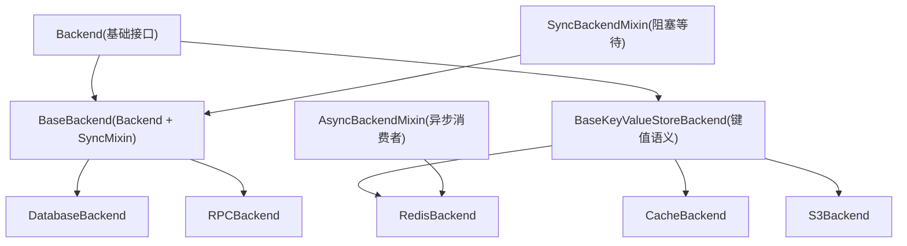
来源：[celery/backends/base.py108-906](https://github.com/celery/celery/blob/4d068b56/celery/backends/base.py#L108-L906)

## 后端基类 (Backend Base Class)

`Backend` 类定义了所有结果后端必须实现的核心接口。它提供了存储和检索任务元数据的契约。

### 核心接口方法

| 方法 | 目的 | 是否需要实现 |
| --- | --- | --- |
| `store_result()` | 存储带有状态的任务结果 | 通过 `_store_result()` 实现抽象 |
| `get_task_meta()` | 检索任务元数据 | 通过 `_get_task_meta_for()` 实现抽象 |
| `forget()` | 移除任务结果 | 通过 `_forget()` 实现抽象 |
| `_save_group()` | 持久化组结果 | 可选 |
| `_restore_group()` | 检索组结果 | 可选 |
| `on_chord_part_return()` | 处理 chord 协调 | 可选 |

### 状态管理方法

`Backend` 类提供了用于将任务标记为不同状态的便捷方法：

```mermaid
flowchart TD
    mark_as_started["mark_as_started()"]
    mark_as_done["mark_as_done()"]
    mark_as_failure["mark_as_failure()"]
    mark_as_retry["mark_as_retry()"]
    mark_as_revoked["mark_as_revoked()"]
    store_result["store_result()(STARTED)"]
    store_result2["store_result()(SUCCESS)"]
    store_result3["store_result()(FAILURE)"]
    store_result4["store_result()(RETRY)"]
    store_result5["store_result()(REVOKED)"]
    on_chord_part_return["on_chord_part_return()"]

    mark --> as_started_store_result
    mark --> as_done_store_result2
    mark --> as_failure_store_result3
    mark --> as_retry_store_result4
    mark --> as_revoked_store_result5
    mark --> as_done_on_chord_part_return
    mark --> as_failure_on_chord_part_return
    mark --> as_revoked_on_chord_part_return
```
来源：[celery/backends/base.py176-298](https://github.com/celery/celery/blob/4d068b56/celery/backends/base.py#L176-L298)

### 后端初始化 (Backend Initialization)

`Backend.__init__()` 方法配置了：

-   **序列化器 (Serializer)**：确定编码格式（json, pickle, msgpack, yaml）
-   **接受内容 (Accept Content)**：反序列化时接受的内容类型
-   **过期时间 (Expires)**：结果 TTL 配置
-   **缓存 (Cache)**：结果对象的 LRU 缓存
-   **重试策略 (Retry Policy)**：针对瞬态错误的指数退避配置

来源：[celery/backends/base.py138-166](https://github.com/celery/celery/blob/4d068b56/celery/backends/base.py#L138-L166)

## SyncBackendMixin 与 AsyncBackendMixin

Celery 提供了两种等待结果的模式：同步轮询和异步事件驱动。

### SyncBackendMixin

同步后端模式使用轮询来等待结果。这是大多数后端的默认模式。

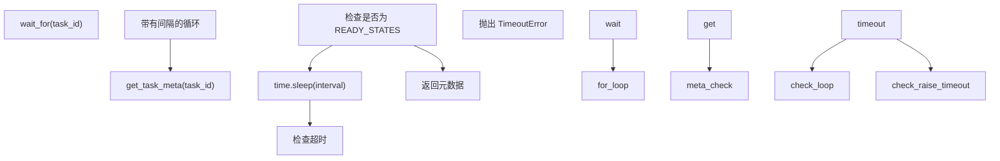
**关键方法：**

-   `wait_for()`：轮询后端直到任务达到就绪状态
-   `wait_for_pending()`：等待挂起的结果
-   `get_many()`：基类中未实现（同步后端分别轮询）

来源：[celery/backends/base.py825-901](https://github.com/celery/celery/blob/4d068b56/celery/backends/base.py#L825-L901)

### AsyncBackendMixin

异步模式使用消费者通过发布/订阅（pub/sub）或消息队列接收结果更新。

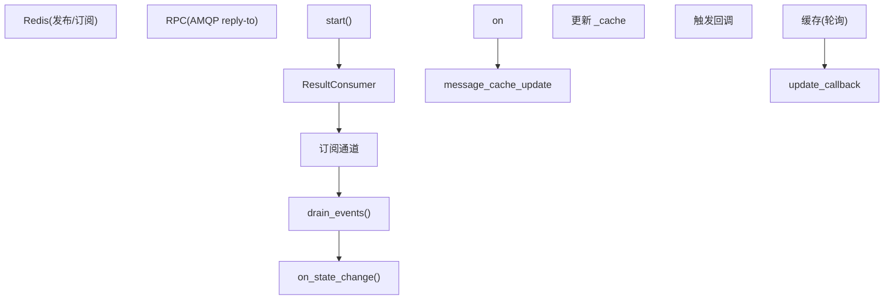
**关键组件：**

-   `ResultConsumer`：监听结果更新的事件循环
-   `add_pending_result()`：注册对某个任务结果的关注
-   `iter_native()`：当结果可用时生成 (yield) 结果

来源：[celery/backends/asynchronous.py](https://github.com/celery/celery/blob/4d068b56/celery/backends/asynchronous.py)（在 redis.py 中引用），[celery/backends/redis.py83-188](https://github.com/celery/celery/blob/4d068b56/celery/backends/redis.py#L83-L188)

## BaseKeyValueStoreBackend

许多后端基于键值语义运行。`BaseKeyValueStoreBackend` 为这些后端提供了一个通用的抽象。

### 键命名规范

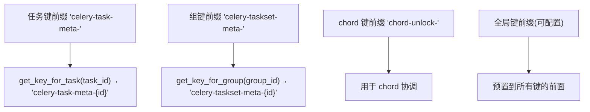
**子类的抽象方法：**

-   `get(key)`：按键检索值
-   `set(key, value)`：在键处存储值
-   `mget(keys)`：检索多个键
-   `delete(key)`：移除键

来源：[celery/backends/base.py910-1055](https://github.com/celery/celery/blob/4d068b56/celery/backends/base.py#L910-L1055)

### 带有递增计数器的 Chord 支持

支持原子递增操作的键值后端可以使用 `_apply_chord_incr()` 进行高效的 chord 协调：

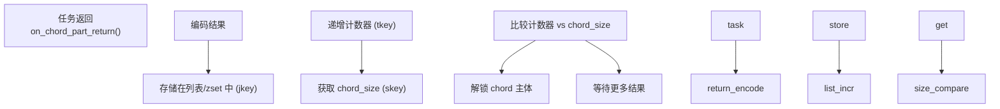
**键值操作：**

-   `jkey` (join key)：存储编码后的任务结果（列表或有序集合）
-   `tkey` (counter key)：已完成任务的原子计数器
-   `skey` (size key)：预期的 chord 大小

来源：[celery/backends/base.py1145-1230](https://github.com/celery/celery/blob/4d068b56/celery/backends/base.py#L1145-L1230) [celery/backends/redis.py507-578](https://github.com/celery/celery/blob/4d068b56/celery/backends/redis.py#L507-L578)

## 结果缓存 (Result Caching)

后端使用 LRU（最近最少使用）缓存来避免对已完成任务的冗余后端查询。

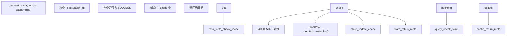
**配置：**

-   `result_cache_max`：最大缓存结果数（默认来自配置）
-   `-1`：禁用缓存（使用 `_nulldict`）
-   缓存仅存储 `SUCCESS` 状态的结果

来源：[celery/backends/base.py148](https://github.com/celery/celery/blob/4d068b56/celery/backends/base.py#L148-L148) [celery/backends/base.py692-729](https://github.com/celery/celery/blob/4d068b56/celery/backends/base.py#L692-L729)

## 序列化与编码

后端负责任务结果的序列化，包括对异常的特殊处理。

### 异常序列化

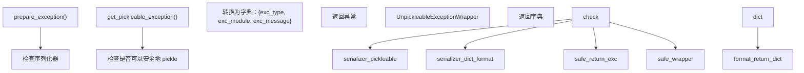
**安全性考量：**

`exception_to_python()` 方法验证反序列化的异常确实是 `BaseException` 的子类，以防止代码执行漏洞。

来源：[celery/backends/base.py424-503](https://github.com/celery/celery/blob/4d068b56/celery/backends/base.py#L424-L503) [celery/backends/base.py434-503](https://github.com/celery/celery/blob/4d068b56/celery/backends/base.py#L434-L503)

### 结果编码

| 步骤 | 方法 | 目的 |
| --- | --- | --- |
| 1. 准备 | `encode_result()` | 将结果转换为可序列化形式 |
| 2. 编码 | `_encode()` / `encode()` | 应用序列化 (json/pickle/等) |
| 3. 存储 | `_store_result()` | 后端特定的存储 |

针对检索：

| 步骤 | 方法 | 目的 |
| --- | --- | --- |
| 1. 检索 | `_get_task_meta_for()` | 后端特定的检索 |
| 2. 解码 | `decode()` | 反序列化载荷 |
| 3. 转换 | `meta_from_decoded()` | 异常重构 |

来源：[celery/backends/base.py505-553](https://github.com/celery/celery/blob/4d068b56/celery/backends/base.py#L505-L553)

## 后端选择 (Backend Selection)

通过 URL 协议或名称使用后端注册表来选择后端。

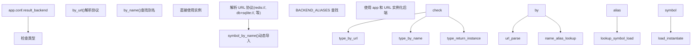
**常用 URL 协议：**

-   `redis://` → RedisBackend
-   `rediss://` → RedisBackend (SSL)
-   `rpc://` → RPCBackend
-   `db+postgresql://` → DatabaseBackend
-   `cache+memcached://` → CacheBackend
-   `s3://` → S3Backend

来源：[celery/app/backends.py](https://github.com/celery/celery/blob/4d068b56/celery/app/backends.py) (已引用)，[celery/backends/base.py167-175](https://github.com/celery/celery/blob/4d068b56/celery/backends/base.py#L167-L175)

## 重试与弹性 (Retry and Resilience)

基础后端针对瞬态故障实现了指数退避重试。

### 重试配置

```
retry_policy = {
    'max_retries': 20,
    'interval_start': 0,
    'interval_step': 1,
    'interval_max': 1,
}
```
通过以下项配置：

-   `result_backend_always_retry`：启用自动重试
-   `result_backend_max_retries`：覆盖最大重试次数
-   `result_backend_base_sleep_between_retries_ms`：初始退避延迟
-   `result_backend_max_sleep_between_retries_ms`：最大退避延迟

### 存储/检索重试逻辑

`store_result()` 和 `get_task_meta()` 都实现了重试循环：

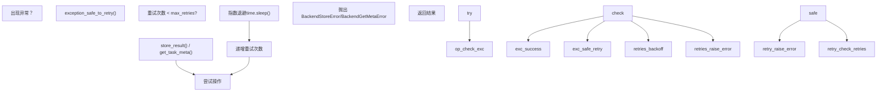
**后端特定重试：**

后端会重写 `exception_safe_to_retry()` 来确定哪些异常是瞬态的（例如网络错误）还是永久性的（例如认证失败）。

来源：[celery/backends/base.py612-645](https://github.com/celery/celery/blob/4d068b56/celery/backends/base.py#L612-L645) [celery/backends/base.py692-725](https://github.com/celery/celery/blob/4d068b56/celery/backends/base.py#L692-L725) [celery/backends/base.py682-690](https://github.com/celery/celery/blob/4d068b56/celery/backends/base.py#L682-L690)

## 与应用集成

后端由 Celery 应用程序进行初始化和管理。

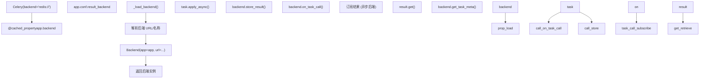
**关键集成点：**

1.  **任务执行**：工作者在任务执行后调用 `mark_as_done()` / `mark_as_failure()`。
2.  **结果检索**：`AsyncResult.get()` 调用 `backend.wait_for_pending()`。
3.  **Chord 协调**：工作者为 chord 任务调用 `on_chord_part_return()`。
4.  **清理**：`backend.cleanup()` 移除过期的结果（如果非自动过期）。

来源：[celery/app/base.py](https://github.com/celery/celery/blob/4d068b56/celery/app/base.py) (用于加载后端的引用)，[celery/backends/base.py772-773](https://github.com/celery/celery/blob/4d068b56/celery/backends/base.py#L772-L773)

## 线程安全 (Thread Safety)

可以将后端配置为线程安全模式：

**配置：**

-   `result_backend_thread_safe`：启用线程安全模式（默认值：False）

启用后，后端必须确保对连接池和共享状态的线程安全访问。这对于以下情况尤为重要：

-   多线程工作者 (`--pool=threads`)
-   并发的结果检索
-   连接池管理

来源：[celery/backends/base.py161](https://github.com/celery/celery/blob/4d068b56/celery/backends/base.py#L161-L161)

## 总结

后端架构提供了：

1.  **可插拔设计**：抽象接口支持 20 多种后端实现。
2.  **灵活的等待模式**：支持同步（轮询）和异步（事件驱动）。
3.  **高效缓存**：LRU 缓存减少了后端负载。
4.  **健壮的重试**：针对瞬态故障的指数退避。
5.  **安全序列化**：校验机制防止代码执行攻击。
6.  **Chord 协调**：内置对复杂工作流的支持。

分层继承模型允许后端在实现特定存储优化的同时共享通用功能。这一设计使 Celery 能够通过一致的 API 支持从简单的基于文件的存储到分布式云服务的各种系统。
