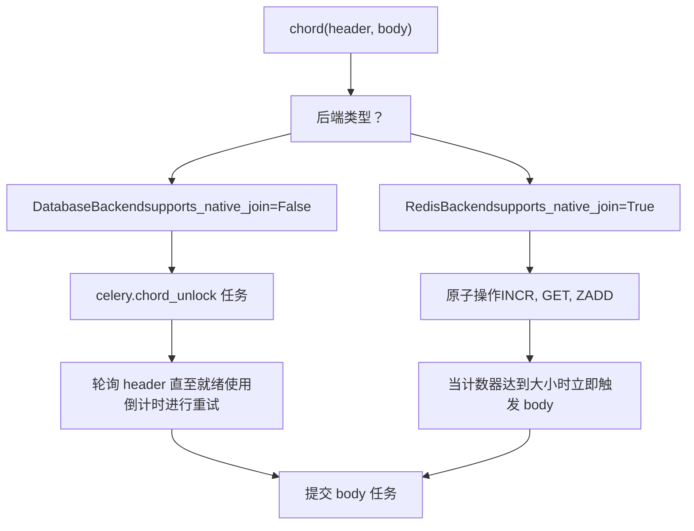
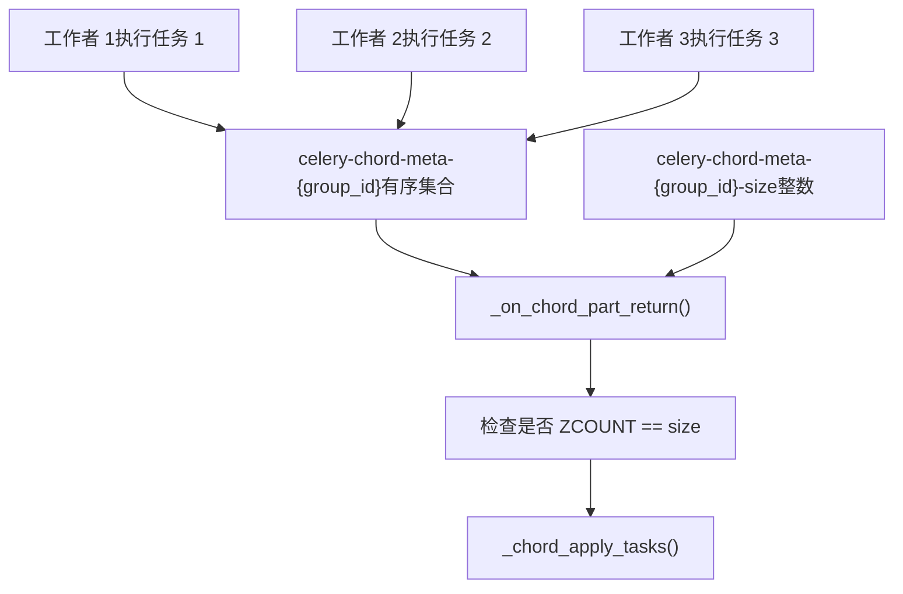
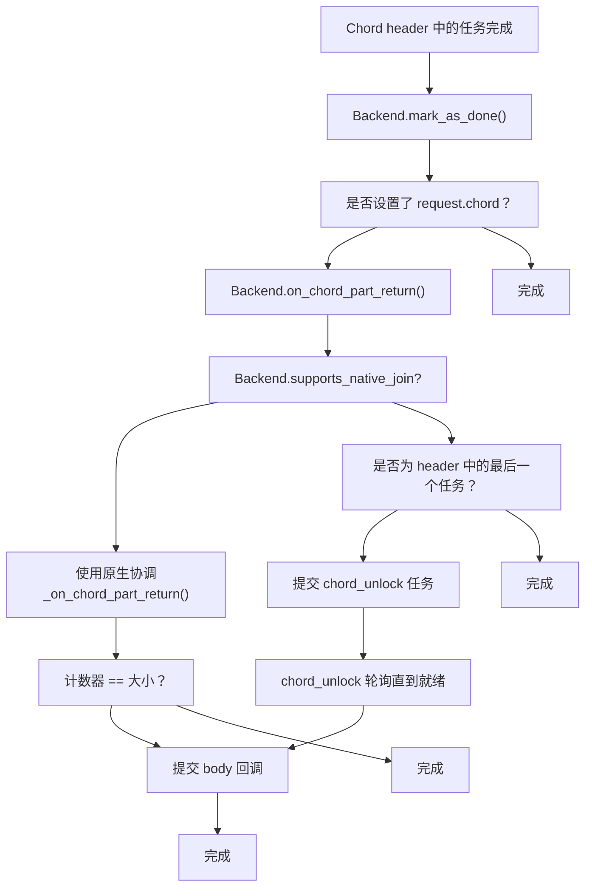
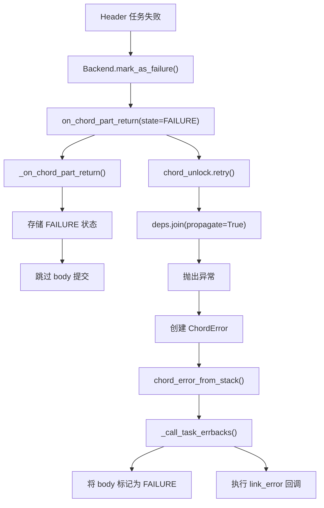
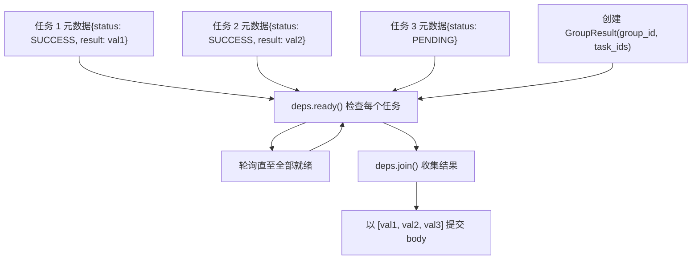

# Chord 协调 (Chord Coordination)

相关源文件

-   [celery/app/builtins.py](https://github.com/celery/celery/blob/4d068b56/celery/app/builtins.py)
-   [celery/backends/base.py](https://github.com/celery/celery/blob/4d068b56/celery/backends/base.py)
-   [celery/backends/redis.py](https://github.com/celery/celery/blob/4d068b56/celery/backends/redis.py)
-   [celery/result.py](https://github.com/celery/celery/blob/4d068b56/celery/result.py)
-   [docs/userguide/configuration.rst](https://github.com/celery/celery/blob/4d068b56/docs/userguide/configuration.rst)
-   [t/unit/backends/test\_base.py](https://github.com/celery/celery/blob/4d068b56/t/unit/backends/test_base.py)
-   [t/unit/backends/test\_redis.py](https://github.com/celery/celery/blob/4d068b56/t/unit/backends/test_redis.py)
-   [t/unit/tasks/test\_chord.py](https://github.com/celery/celery/blob/4d068b56/t/unit/tasks/test_chord.py)
-   [t/unit/tasks/test\_result.py](https://github.com/celery/celery/blob/4d068b56/t/unit/tasks/test_result.py)

## 目的与范围

本页面记录了 Celery 中的 chord 协调机制，该机制确保当一个 chord（一组任务后跟一个回调任务）执行时，只有在所有 header 任务成功完成后才运行回调任务。根据后端的的能力，chord 协调的实现方式有所不同：像 Redis 这样的后端使用原生的原子操作，而其他后端则使用回退轮询 (fallback polling) 机制。

有关 chord 和 Canvas 工作流的通用信息，请参阅[工作流原语](/celery/celery/4.2-workflow-primitives)。有关 chord 执行的详细信息，请参阅[Chord 执行](/celery/celery/4.4-chord-execution)。本页面专门关注跨不同结果后端追踪 chord 完成情况的协调机制。

---

## Chord 协调概览

一个 chord 由两部分组成：

-   **Header**：一个并行执行的任务组 (`group`)
-   **Body**：一个接收所有 header 任务结果的回调任务

协调方面的挑战在于确保 body 任务仅在所有 header 任务完成后才被提交且仅执行一次，即使任务是在分布式工作者之间以任意顺序完成的。

> **[Mermaid sequence]**
> *(图表结构无法解析)*

**来源：** [celery/canvas.py1718-1800](https://github.com/celery/celery/blob/4d068b56/celery/canvas.py#L1718-L1800) [celery/backends/base.py185-187](https://github.com/celery/celery/blob/4d068b56/celery/backends/base.py#L185-L187)

---

## 原生 vs 回退 Chord 实现 (Native vs Fallback Chord Implementations)

Celery 根据后端的的能力提供两种 chord 协调策略：

| 策略 | 后端 | 机制 | 关键特性 |
| --- | --- | --- | --- |
| **原生 (Native)** | Redis, Memcached | 原子计数器操作 | 实时，无轮询 |
| **回退 (Fallback)** | 数据库, RPC, MongoDB 等 | `celery.chord_unlock` 轮询任务 | 定期轮询 |


**来源：** [celery/backends/redis.py207](https://github.com/celery/celery/blob/4d068b56/celery/backends/redis.py#L207-L207) [celery/backends/base.py120-121](https://github.com/celery/celery/blob/4d068b56/celery/backends/base.py#L120-L121) [celery/app/builtins.py37-98](https://github.com/celery/celery/blob/4d068b56/celery/app/builtins.py#L37-L98)

---

## Redis 后端中的原生 Chord 支持

Redis 后端使用原生的 Redis 原子操作实现 chord 协调。每个任务完成时都会递增一个计数器，当计数器达到预期大小时，body 任务会立即被提交。

### Redis Chord 追踪架构


### 关键 Redis 后端方法

`RedisBackend` 中的以下方法负责处理 chord 协调：

**`_on_chord_apply(group_id, body, result)`** [celery/backends/redis.py400-430](https://github.com/celery/celery/blob/4d068b56/celery/backends/redis.py#L400-L430)

-   在 chord 首次应用时被调用
-   设置预期的 chord 大小：`self.client.setnx(size_key, len(result))`
-   为大小键 (size key) 设置过期时间
-   返回 body 回调签名

**`_on_chord_part_return(request, state, result)`** [celery/backends/redis.py432-490](https://github.com/celery/celery/blob/4d068b56/celery/backends/redis.py#L432-L490)

-   每次 header 任务完成时被调用
-   原子性地将任务添加到有序集合中：`self.client.zadd(jkey, {encoded_task_result: now})`
-   检查完成情况：`self.client.zcount(jkey, 0, "+inf") >= size`
-   如果完成，检索所有结果并触发 body

**`_chord_apply_tasks(header_result_args, body, **kwargs)`** [celery/backends/redis.py582-611](https://github.com/celery/celery/blob/4d068b56/celery/backends/redis.py#L582-L611)

-   使用收集到的结果提交 body 回调任务
-   如果任何 header 任务失败，处理错误传播

### Redis Chord 状态机

> **[Mermaid stateDiagram]**
> *(图表结构无法解析)*

**来源：** [celery/backends/redis.py400-611](https://github.com/celery/celery/blob/4d068b56/celery/backends/redis.py#L400-L611) [celery/backends/base.py1078-1130](https://github.com/celery/celery/blob/4d068b56/celery/backends/base.py#L1078-L1130)

---

## 回退式 Chord 支持 (chord\_unlock)

对于不支持原子操作的后端，Celery 使用由 `celery.chord_unlock` 任务实现的轮询机制。

### Chord Unlock 任务流

> **[Mermaid sequence]**
> *(图表结构无法解析)*

### chord\_unlock 任务实现

`unlock_chord` 任务定义在 [celery/app/builtins.py37-98](https://github.com/celery/celery/blob/4d068b56/celery/app/builtins.py#L37-L98)：

```
@app.task(name='celery.chord_unlock', max_retries=None,
          default_retry_delay=app.conf.result_chord_retry_interval,
          ignore_result=True, lazy=False, bind=True)
def unlock_chord(self, group_id, callback, interval=None,
                 max_retries=None, result=None, **kwargs):
```
**关键行为：**

1.  **轮询循环**：检查 `deps.ready()`，如果未完成则进行重试。
2.  **配置**：使用 `result_chord_retry_interval`（默认 1 秒）。
3.  **无重试限制**：`max_retries=None` 表示它将无限期轮询。
4.  **结果收集**：以 `result_chord_join_timeout` 调用 `deps.join()`。

### 回退式 Chord 决策树 (Fallback Chord Decision Tree)


**来源：** [celery/app/builtins.py37-98](https://github.com/celery/celery/blob/4d068b56/celery/app/builtins.py#L37-L98) [celery/backends/base.py185-187](https://github.com/celery/celery/blob/4d068b56/celery/backends/base.py#L185-L187)

---

## Chord 错误处理

当 chord header 中的任务失败或抛出异常时，Celery 必须处理错误传播，以防止 body 任务带着不完整的结果执行。

### 错误传播机制


### 后端错误处理方法

**`chord_error_from_stack(callback, exc)`** [celery/backends/base.py309-335](https://github.com/celery/celery/blob/4d068b56/celery/backends/base.py#L309-L335)

-   为回调任务创建一个伪造的请求。
-   调用错误回调 (`link_error`)。
-   使用 `fail_from_current_stack()` 将回调任务标记为失败。

**`_handle_group_chord_error(group_callback, backend, exc)`** [celery/backends/base.py337-403](https://github.com/celery/celery/blob/4d068b56/celery/backends/base.py#L337-L403)

-   当 chord body 本身是一个组 (group) 时的特殊处理（防止挂起，见 issue #8786）。
-   撤销组主体中的所有任务。
-   使用原始异常将每项标记为失败。
-   为每个任务执行错误回调。

**`_call_task_errbacks(request, exc, traceback)`** [celery/backends/base.py244-288](https://github.com/celery/celery/blob/4d068b56/celery/backends/base.py#L244-L288)

-   执行 `link_error` 回调。
-   同时处理旧式（仅 task\_id）和新式（request, exc, traceback）错误回调。
-   优雅处理未注册的任务。

### Chord 错误示例流

> **[Mermaid sequence]**
> *(图表结构无法解析)*

**来源：** [celery/backends/base.py309-403](https://github.com/celery/celery/blob/4d068b56/celery/backends/base.py#L309-L403) [celery/app/builtins.py82-97](https://github.com/celery/celery/blob/4d068b56/celery/app/builtins.py#L82-L97)

---

## Chord 状态追踪

Chord 协调需要追踪哪些任务已完成以及它们的结果。原生后端与回退后端的实现有所不同。

### Redis 原生追踪

Redis 为每个 chord 使用两个键：

| 键模式 | 类型 | 用途 | 过期时间 |
| --- | --- | --- | --- |
| `celery-chord-meta-{group_id}` | 有序集合 | 存储带有时间戳的已完成任务结果 | 所有任务完成后设置 |
| `celery-chord-meta-{group_id}-size` | 字符串 (整数) | 预期的 header 任务数量 | 与结果过期时间一致 |

**操作：**

1.  **初始化**：`SETNX` 设置大小（仅当不存在时）。
2.  **任务完成**：`ZADD` 添加带时间戳作为分数的结果。
3.  **计数检查**：`ZCOUNT` 检查已完成任务的数量。
4.  **结果检索**：完成后 `ZRANGE` 获取所有结果。
5.  **清理**：基于 `result_expires` 配置，键会自动过期。

### 回退式状态追踪 (Fallback State Tracking)

回退机制依赖于后端现有的结果存储：


### Chord 请求上下文

chord header 中的每个任务都设置了 `request.chord` 及其协调元数据：

```
# Context.chord 中存储的结构 (来自任务标头)
{
    'task_id': body_task_id,      # 回调任务的 ID
    'group_id': group_id,          # chord header 组的 ID
    'options': body_options,       # body 任务执行选项
}
```
这被以下项使用：

-   `Backend.mark_as_done()` → `on_chord_part_return()` [celery/backends/base.py185-187](https://github.com/celery/celery/blob/4d068b56/celery/backends/base.py#L185-L187)
-   `Backend.mark_as_failure()` → `on_chord_part_return()` [celery/backends/base.py198-199](https://github.com/celery/celery/blob/4d068b56/celery/backends/base.py#L198-L199)
-   `Backend.mark_as_revoked()` → `on_chord_part_return()` [celery/backends/base.py296-297](https://github.com/celery/celery/blob/4d068b56/celery/backends/base.py#L296-L297)

**来源：** [celery/backends/redis.py400-490](https://github.com/celery/celery/blob/4d068b56/celery/backends/redis.py#L400-L490) [celery/app/task.py68-69](https://github.com/celery/celery/blob/4d068b56/celery/app/task.py#L68-L69) [celery/result.py550-687](https://github.com/celery/celery/blob/4d068b56/celery/result.py#L550-L687)

---

## 配置选项

Chord 协调行为由多个配置设置项控制：

| 设置项 | 默认值 | 描述 | 适用范围 |
| --- | --- | --- | --- |
| `result_chord_retry_interval` | 1.0 | `chord_unlock` 重试之间的秒数 | 仅限回退方案 |
| `result_chord_join_timeout` | 3.0 | 合并 chord header 结果的超时时间 | 仅限回退方案 |
| `result_expires` | 86400 (24h) | Chord 元数据过期时间 | 两者皆适用 |
| `task_allow_error_cb_on_chord_header` | False | 是否允许在 header 任务上使用错误回调 | 两者皆适用 |

**配置示例：**

```
# 针对回退式后端使用更快的轮询
app.conf.result_chord_retry_interval = 0.5

# 针对较慢的 header 任务使用更长的超时
app.conf.result_chord_join_timeout = 10.0

# 允许在 header 任务上使用错误回调 (Celery 5.0+)
app.conf.task_allow_error_cb_on_chord_header = True
```
**来源：** [docs/userguide/configuration.rst400-800](https://github.com/celery/celery/blob/4d068b56/docs/userguide/configuration.rst#L400-L800) [celery/app/builtins.py48-79](https://github.com/celery/celery/blob/4d068b56/celery/app/builtins.py#L48-L79)

---

## 实现对比表

| 维度 | 原生 (Redis) | 回退 (chord\_unlock) |
| --- | --- | --- |
| **触发机制** | 原子计数器检查 | 轮询任务 |
| **延迟** | 在最后一个任务完成后立即触发 | `result_chord_retry_interval` 延迟 |
| **开销** | 极小（少量 Redis 操作） | 每个 chord 额外增加一个任务 |
| **可扩展性** | 极佳 | 良好（受轮询频率限制） |
| **失败检测** | 立即检测 | 在下一次轮询尝试时检测 |
| **后端支持** | Redis, Memcached | 数据库, RPC, MongoDB 等 |
| **关键方法** | `_on_chord_part_return()` [celery/backends/redis.py432-490](https://github.com/celery/celery/blob/4d068b56/celery/backends/redis.py#L432-L490) | `unlock_chord()` [celery/app/builtins.py37-98](https://github.com/celery/celery/blob/4d068b56/celery/app/builtins.py#L37-L98) |

**来源：** [celery/backends/redis.py190-611](https://github.com/celery/celery/blob/4d068b56/celery/backends/redis.py#L190-L611) [celery/app/builtins.py37-98](https://github.com/celery/celery/blob/4d068b56/celery/app/builtins.py#L37-L98) [celery/backends/base.py120-121](https://github.com/celery/celery/blob/4d068b56/celery/backends/base.py#L120-L121)
