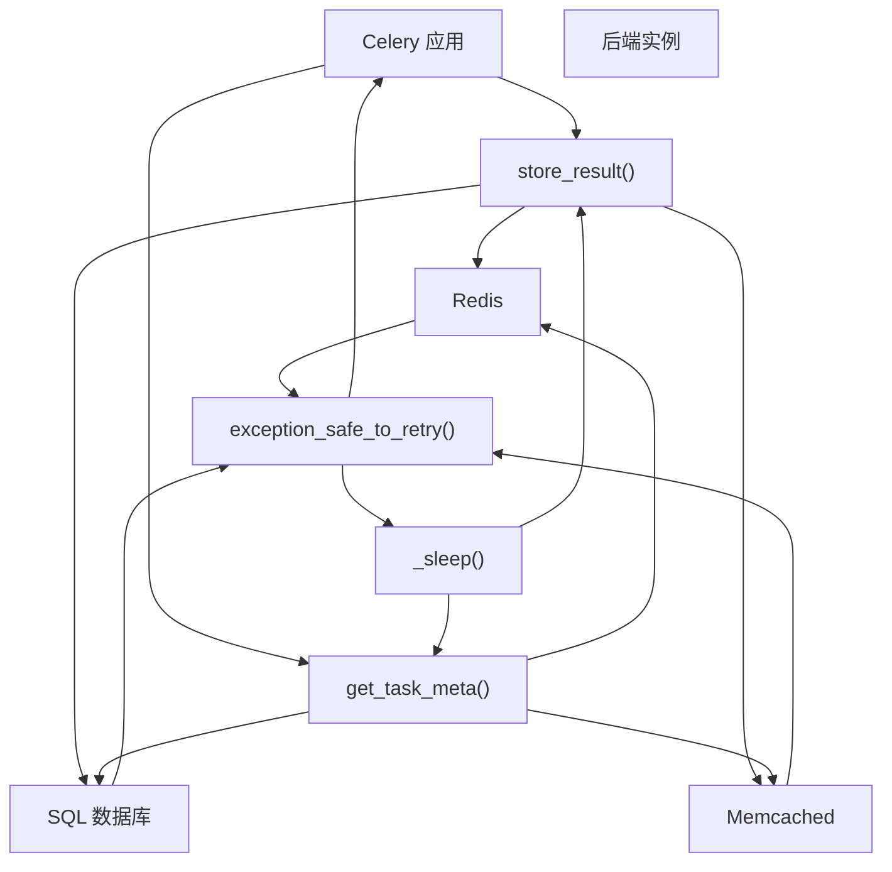
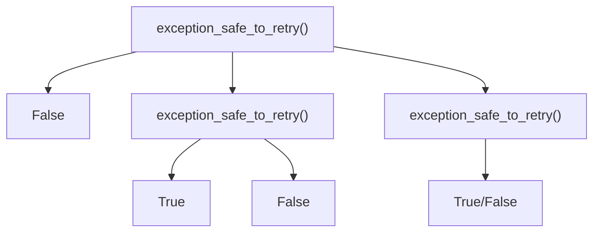
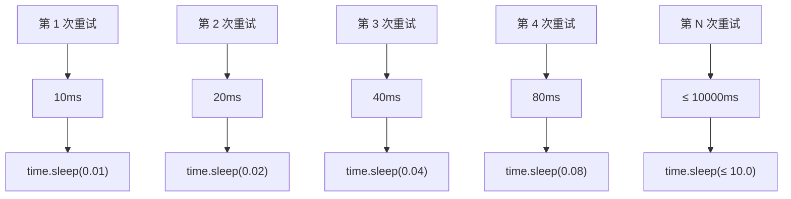
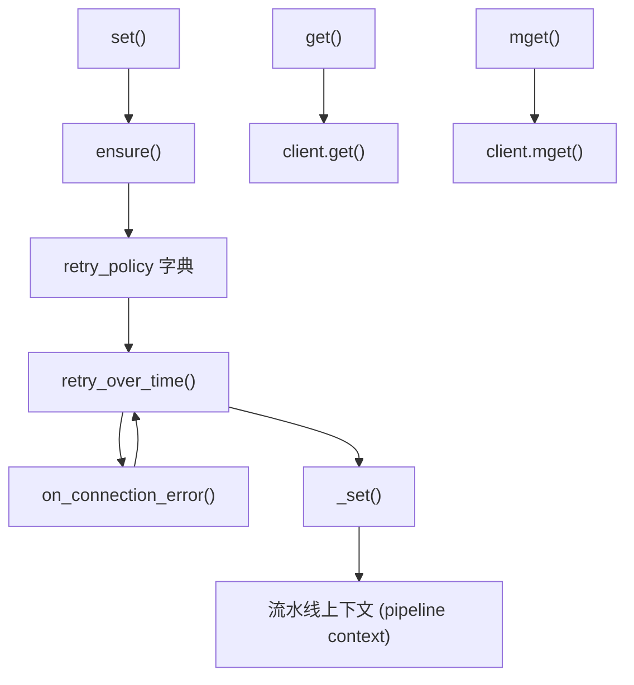

# 错误处理与弹性 (Error Handling and Resilience)

相关源文件

-   [celery/app/builtins.py](https://github.com/celery/celery/blob/4d068b56/celery/app/builtins.py)
-   [celery/backends/base.py](https://github.com/celery/celery/blob/4d068b56/celery/backends/base.py)
-   [celery/backends/redis.py](https://github.com/celery/celery/blob/4d068b56/celery/backends/redis.py)
-   [celery/result.py](https://github.com/celery/celery/blob/4d068b56/celery/result.py)
-   [docs/userguide/configuration.rst](https://github.com/celery/celery/blob/4d068b56/docs/userguide/configuration.rst)
-   [t/unit/backends/test\_base.py](https://github.com/celery/celery/blob/4d068b56/t/unit/backends/test_base.py)
-   [t/unit/backends/test\_redis.py](https://github.com/celery/celery/blob/4d068b56/t/unit/backends/test_redis.py)
-   [t/unit/tasks/test\_chord.py](https://github.com/celery/celery/blob/4d068b56/t/unit/tasks/test_chord.py)
-   [t/unit/tasks/test\_result.py](https://github.com/celery/celery/blob/4d068b56/t/unit/tasks/test_result.py)

本文件描述了 Celery 结果后端（result backend）系统中的错误处理和弹性（resilience）机制。这些机制确保了即使在任务执行期间后端服务经历瞬态故障、连接错误或意外异常时，系统也能可靠运行。

有关结果后端的架构和实现，请参阅[后端架构](/celery/celery/6.1-backend-architecture)和[后端实现](/celery/celery/6.2-backend-implementations)。有关结果检索模式，请参阅[结果序列化与检索](/celery/celery/6.3-result-storage-and-retrieval)。

## 概览 (Overview)

结果后端与外部存储系统（Redis、数据库、缓存等）交互，这些系统可能会经历瞬态网络问题、连接超时或临时不可用。重试与弹性系统提供了：

-   **自动重试**失败的后端操作
-   **指数退避 (Exponential backoff)** 以避免压垮故障服务
-   **可配置的限制**，针对重试尝试和延迟
-   **后端特定的异常分类**，以确定哪些错误是可重试的

此系统应用于两项关键操作：存储任务结果 (`store_result`) 和检索任务元数据 (`get_task_meta`)。

**来源：** [celery/backends/base.py612-644](https://github.com/celery/celery/blob/4d068b56/celery/backends/base.py#L612-L644) [celery/backends/base.py682-725](https://github.com/celery/celery/blob/4d068b56/celery/backends/base.py#L682-L725)

## 配置选项

重试行为由五个通过 `app.conf` 访问的配置设置项控制：

| 设置项 | 类型 | 默认值 | 描述 |
| --- | --- | --- | --- |
| `result_backend_always_retry` | bool | `False` | 启用针对可恢复后端异常的自动重试 |
| `result_backend_base_sleep_between_retries_ms` | int | `10` | 指数退避的基础休眠时间（毫秒） |
| `result_backend_max_sleep_between_retries_ms` | int | `10000` | 最大休眠时间（毫秒，即 10 秒） |
| `result_backend_max_retries` | float | `float("inf")` | 抛出错误前的最大重试尝试次数 |
| `result_backend_thread_safe` | bool | `False` | 为并发访问启用线程安全的后端操作 |

这些设置在 [celery/backends/base.py138-161](https://github.com/celery/celery/blob/4d068b56/celery/backends/base.py#L138-L161) 处的 `Backend.__init__` 方法中进行初始化。

**来源：** [celery/backends/base.py138-161](https://github.com/celery/celery/blob/4d068b56/celery/backends/base.py#L138-L161)

## 重试流架构 (Retry Flow Architecture)


**来源：** [celery/backends/base.py612-644](https://github.com/celery/celery/blob/4d068b56/celery/backends/base.py#L612-L644) [celery/backends/base.py692-725](https://github.com/celery/celery/blob/4d068b56/celery/backends/base.py#L692-L725)

## 结果存储重试机制 (Store Result Retry Mechanism)

当 `result_backend_always_retry` 启用时，`store_result` 方法将实际的后端存储操作包装在重试循环中：

> **[Mermaid stateDiagram]**
> *(图表结构无法解析)*

**来源：** [celery/backends/base.py612-644](https://github.com/celery/celery/blob/4d068b56/celery/backends/base.py#L612-L644)

## 任务元数据获取重试机制 (Get Task Meta Retry Mechanism)

`get_task_meta` 方法在检索任务元数据时使用相同的重试逻辑：

> **[Mermaid stateDiagram]**
> *(图表结构无法解析)*

**来源：** [celery/backends/base.py692-729](https://github.com/celery/celery/blob/4d068b56/celery/backends/base.py#L692-L729)

## 异常分类 (Exception Classification)

`exception_safe_to_retry` 方法确定哪些异常值得进行重试。`BaseBackend` 中的基础实现较为保守，对所有异常均返回 `False`：


后端实现必须重写此方法以识别其特定的瞬态错误：

**RedisBackend 实现：**

```
def exception_safe_to_retry(self, exc):
    if isinstance(exc, self.connection_errors):
        return True
    return False
```
`connection_errors` 元组由 `get_redis_error_classes()` 填充，其中包含了 Redis 特定的连接异常。

**来源：** [celery/backends/base.py682-690](https://github.com/celery/celery/blob/4d068b56/celery/backends/base.py#L682-L690) [celery/backends/redis.py401-404](https://github.com/celery/celery/blob/4d068b56/celery/backends/redis.py#L401-L404)

## 指数退避策略 (Exponential Backoff Strategy)

重试机制使用指数退避来逐步增加尝试之间的等待时间，从而防止压垮故障服务：


退避计算由来自 `celery.utils.time` 的 `get_exponential_backoff_interval` 执行：

```
sleep_amount = get_exponential_backoff_interval(
    self.base_sleep_between_retries_ms,  # 默认 10ms
    retries,                               # 当前重试次数
    self.max_sleep_between_retries_ms,    # 上限 10000ms
    True                                   # 完全抖动 (Full jitter)
) / 1000  # 转换为秒
```
由于 `time.sleep()` 接受浮点数以实现亚秒级精度，因此休眠量会从毫秒转换为秒。

**来源：** [celery/backends/base.py635-638](https://github.com/celery/celery/blob/4d068b56/celery/backends/base.py#L635-L638) [celery/backends/base.py716-719](https://github.com/celery/celery/blob/4d068b56/celery/backends/base.py#L716-L719)

## 后端特定的重试实现

### Redis 后端 Ensure 模式

Redis 后端使用带有 `retry_over_time` 的 `ensure` 方法实现了额外的重试层：


`ensure` 方法将操作包装在重试逻辑中：

```
def ensure(self, fun, args, **policy):
    retry_policy = dict(self.retry_policy, **policy)
    max_retries = retry_policy.get('max_retries')
    return retry_over_time(
        fun, self.connection_errors, args, {},
        partial(self.on_connection_error, max_retries),
        **retry_policy)
```
`retry_policy` 字典包含：

-   `max_retries`: 20 (默认)
-   `interval_start`: 0
-   `interval_step`: 1
-   `interval_max`: 1

**来源：** [celery/backends/redis.py425-431](https://github.com/celery/celery/blob/4d068b56/celery/backends/redis.py#L425-L431) [celery/backends/base.py131-136](https://github.com/celery/celery/blob/4d068b56/celery/backends/base.py#L131-L136)

## 错误处理与限制

当超过重试限制时，将抛出带有上下文的特定异常：

### BackendStoreError

在 `store_result` 耗尽重试尝试时抛出：

```
raise_with_context(
    BackendStoreError(
        "无法在后端存储结果",
        task_id=task_id,
        state=state
    ),
)
```
### BackendGetMetaError

在 `get_task_meta` 耗尽重试尝试时抛出：

```
raise_with_context(
    BackendGetMetaError(
        "获取元数据失败",
        task_id=task_id
    ),
)
```
两者都使用 `raise_with_context` 来将原始异常保留为 `__cause__`，从而为调试提供完整的错误链。

**来源：** [celery/backends/base.py640-642](https://github.com/celery/celery/blob/4d068b56/celery/backends/base.py#L640-L642) [celery/backends/base.py721-723](https://github.com/celery/celery/blob/4d068b56/celery/backends/base.py#L721-L723)

## 可测试的重试行为

`_sleep` 方法被分离为一个实例方法，以便于在没有实际延迟的情况下进行测试：

```
def _sleep(self, amount):
    time.sleep(amount)
```
测试代码可以对 `_sleep` 进行 mock，以验证重试逻辑而无需等待：

```
backend._sleep = Mock()
# 在没有实际休眠延迟的情况下验证重试行为
```
**来源：** [celery/backends/base.py609-610](https://github.com/celery/celery/blob/4d068b56/celery/backends/base.py#L609-L610)

## 配置示例

要启用带有自定义限制的弹性后端操作：

```
app.conf.result_backend_always_retry = True
app.conf.result_backend_max_retries = 10
app.conf.result_backend_base_sleep_between_retries_ms = 50
app.conf.result_backend_max_sleep_between_retries_ms = 5000
```
该配置：

-   启用针对可恢复故障的自动重试
-   将每个操作限制为最多重试 10 次
-   重试间隔从 50 毫秒开始
-   延迟上限为 5 秒

**来源：** [celery/backends/base.py157-161](https://github.com/celery/celery/blob/4d068b56/celery/backends/base.py#L157-L161)
