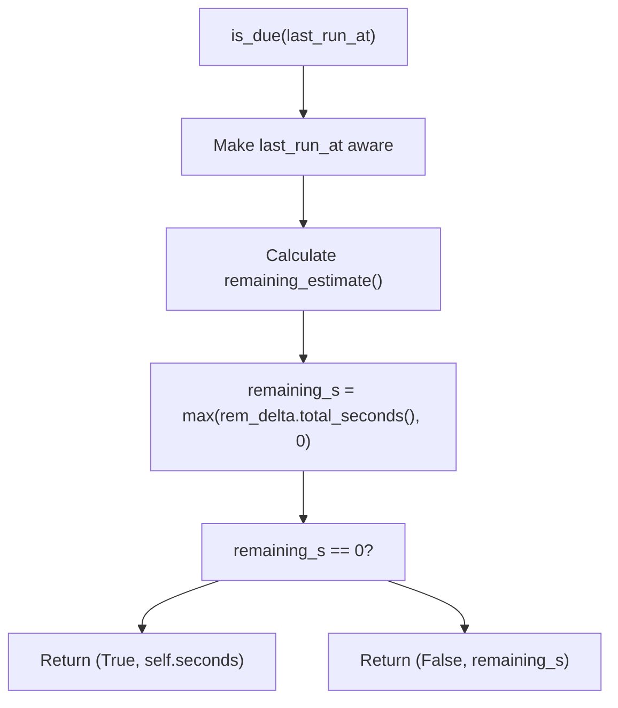
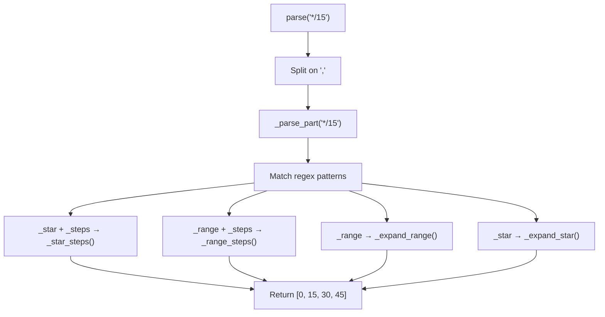
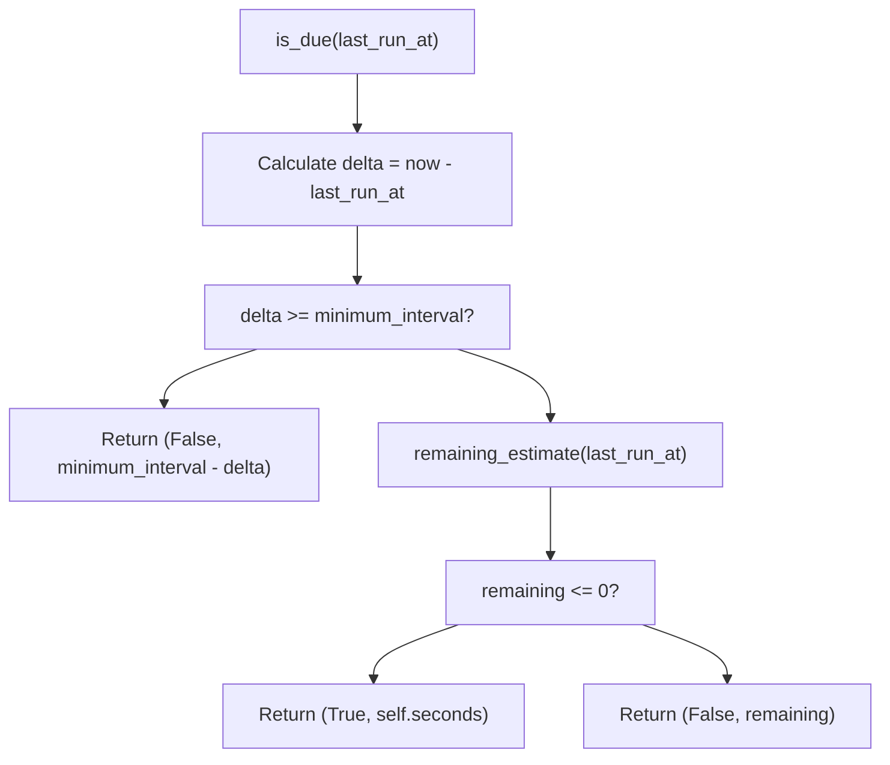
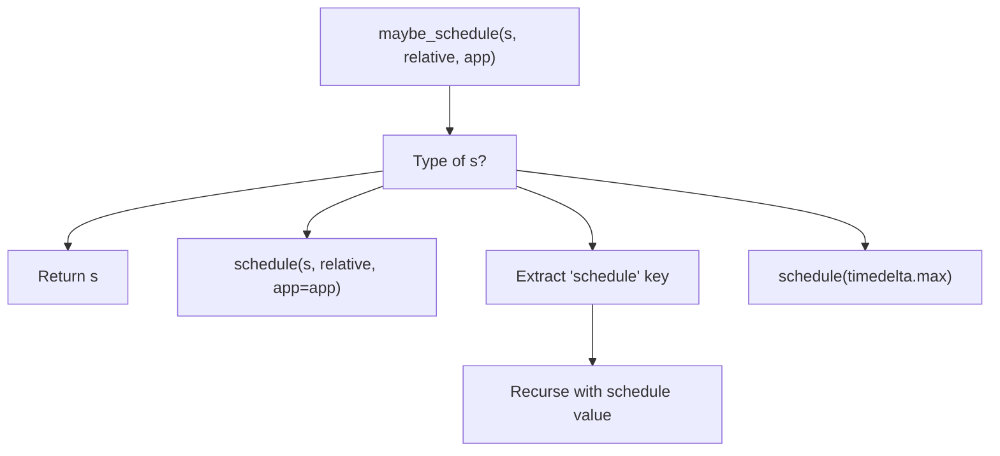
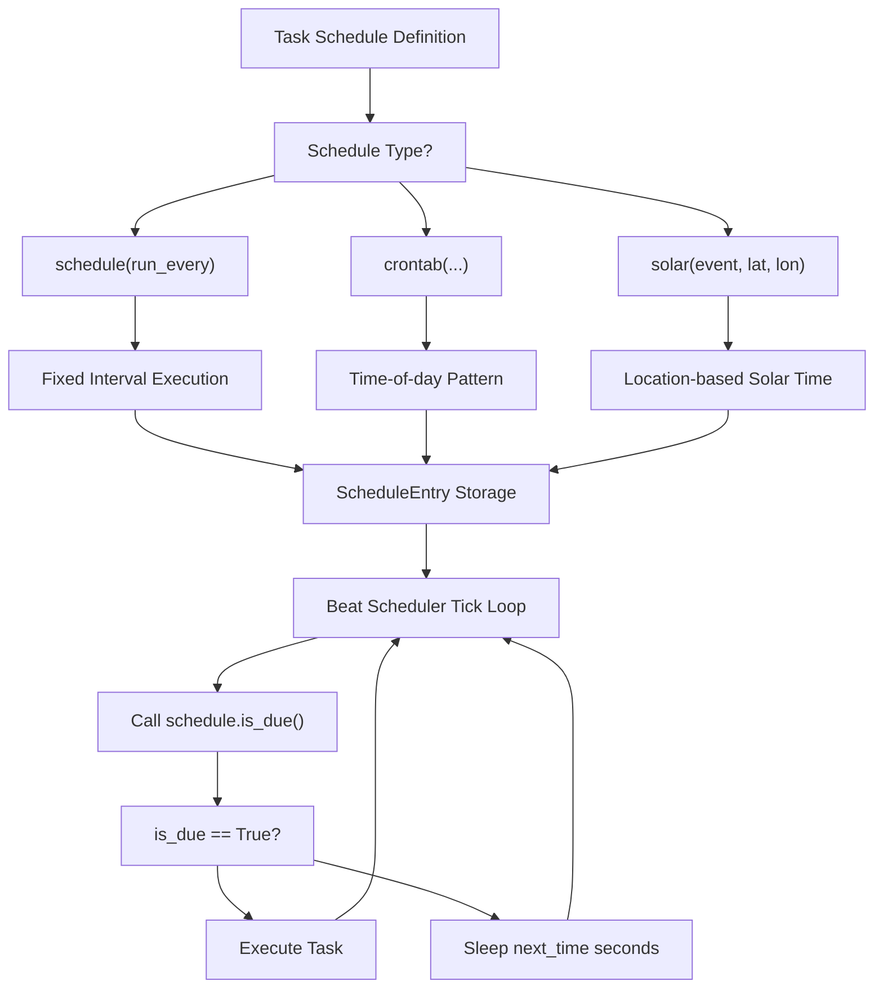

# 调度类型 (Schedule Types)

相关源文件

-   [CONTRIBUTORS.txt](https://github.com/celery/celery/blob/4d068b56/CONTRIBUTORS.txt)
-   [celery/beat.py](https://github.com/celery/celery/blob/4d068b56/celery/beat.py)
-   [celery/schedules.py](https://github.com/celery/celery/blob/4d068b56/celery/schedules.py)
-   [celery/utils/iso8601.py](https://github.com/celery/celery/blob/4d068b56/celery/utils/iso8601.py)
-   [celery/utils/time.py](https://github.com/celery/celery/blob/4d068b56/celery/utils/time.py)
-   [docs/AUTHORS.txt](https://github.com/celery/celery/blob/4d068b56/docs/AUTHORS.txt)
-   [t/unit/app/test\_beat.py](https://github.com/celery/celery/blob/4d068b56/t/unit/app/test_beat.py)
-   [t/unit/app/test\_schedules.py](https://github.com/celery/celery/blob/4d068b56/t/unit/app/test_schedules.py)
-   [t/unit/backends/test\_cache.py](https://github.com/celery/celery/blob/4d068b56/t/unit/backends/test_cache.py)
-   [t/unit/utils/test\_serialization.py](https://github.com/celery/celery/blob/4d068b56/t/unit/utils/test_serialization.py)
-   [t/unit/utils/test\_time.py](https://github.com/celery/celery/blob/4d068b56/t/unit/utils/test_time.py)

本页面记录了 Celery Beat 中的三种调度类型实现：`schedule`（固定间隔）、`crontab`（cron 表达式）和 `solar`（天文事件）。这些类定义了周期性任务应该何时执行。

有关 Beat 调度器架构以及如何使用这些调度的信息，请参阅[Beat 调度器架构](/celery/celery/7.1-beat-scheduler-architecture)。有关调度所使用的时区处理实用程序，请参阅[时间与时区处理](/celery/celery/7.3-time-and-timezone-handling)。

## 概述

所有调度类型都继承自 `BaseSchedule` 并实现两个关键方法：

-   `is_due(last_run_at)` - 返回 `(is_due: bool, next_check_time: float)`
-   `remaining_estimate(last_run_at)` - 返回距离下次执行的 `timedelta`

调度实例存储在 `ScheduleEntry` 对象中，并由 Beat 服务的滴答（tick）循环进行求值。

**来源：** [celery/schedules.py1-22](https://github.com/celery/celery/blob/4d068b56/celery/schedules.py#L1-L22) [celery/beat.py82-199](https://github.com/celery/celery/blob/4d068b56/celery/beat.py#L82-L199)

## BaseSchedule 基础


`BaseSchedule` 类为所有调度类型提供时区感知的底层支持。它维护着对 Celery 应用的引用以访问时区配置，并提供在无时区（naive）和感知时区（aware）的 datetime 之间进行转换的实用程序。

| 属性 | 类型 | 目的 |
| --- | --- | --- |
| `nowfun` | `Callable` 或 `None` | 获取当前时间的自定义函数（默认为 `app.now()`） |
| `_app` | `Celery` 或 `None` | 对 Celery 应用程序实例的引用 |
| `tz` | `tzinfo` (缓存) | 来自 `app.conf.timezone` 的时区 |
| `utc_enabled` | `bool` (缓存) | `app.conf.enable_utc` 的值 |

`maybe_make_aware()` 方法确保 datetime 对象包含时区信息，它使用了 `celery.utils.time.maybe_make_aware()` 以及调度配置的时区。

**来源：** [celery/schedules.py65-109](https://github.com/celery/celery/blob/4d068b56/celery/schedules.py#L65-L109) [celery/utils/time.py1-41](https://github.com/celery/celery/blob/4d068b56/celery/utils/time.py#L1-L41)

## schedule: 固定间隔调度

`schedule` 类按照由 `timedelta` 或浮点数（秒）定义的固定时间间隔执行任务。

### 基本用法

```python
from datetime import timedelta
from celery.schedules import schedule

# 每 30 秒
s = schedule(run_every=30.0)

# 每 5 分钟
s = schedule(run_every=timedelta(minutes=5))

# 相对定时（取整到间隔分辨率）
s = schedule(run_every=60.0, relative=True)
```
### 关键属性与方法

| 成员 | 类型 | 描述 |
| --- | --- | --- |
| `run_every` | `timedelta` | 执行之间的间隔（通过 `maybe_timedelta()` 转换） |
| `relative` | `bool` | 如果为 `True`，则将执行时间取整到间隔分辨率 |
| `seconds` | `float` (属性) | `run_every` 中的总秒数（最小为 0） |
| `human_seconds` | `str` (属性) | 人类可读的间隔（通过 `humanize_seconds()` 转换） |

### is\_due() 实现


`is_due()` 方法：

1.  将 `last_run_at` 转换为时区感知的 datetime。
2.  调用 `remaining_estimate()` 计算距离下次运行的时间。
3.  如果现在到期则返回 `(True, next_interval)`，否则返回 `(False, seconds_to_wait)`。

`remaining_estimate()` 使用了 `celery.utils.time.remaining()`，当 `relative=True` 时它能处理夏令时 (DST) 转换。

**来源：** [celery/schedules.py111-194](https://github.com/celery/celery/blob/4d068b56/celery/schedules.py#L111-L194) [celery/utils/time.py133-175](https://github.com/celery/celery/blob/4d068b56/celery/utils/time.py#L133-L175) [docs/userguide/periodic-tasks.rst133-160](https://github.com/celery/celery/blob/4d068b56/docs/userguide/periodic-tasks.rst#L133-L160)

## crontab: Cron 表达式调度

`crontab` 类提供类似于 cron 的调度，支持标准 crontab 语法及扩展。

### Crontab 语法

每个字段接受：

-   **整数**：特定值（例如 `7` 代表上午 7 点）
-   **列表**：多个值（例如 `[0, 12]` 代表午夜和正午）
-   **字符串**：Cron 模式（例如 `'*/15'` 代表每 15 个单位）

| 字段 | 范围 | 字符串示例 |
| --- | --- | --- |
| `minute` | 0-59 | `'*/15'` (每 15 分钟), `'0,30'` (整点和半点) |
| `hour` | 0-23 | `'*/3'` (每 3 小时), `'8-17'` (工作时间) |
| `day_of_week` | 0-6 (周日=0) | `'mon-fri'`, `'*/2'` (每个偶数日) |
| `day_of_month` | 1-31 | `'1-7'` (第一周), `'*/2'` (奇数日) |
| `month_of_year` | 1-12 | `'*/3'` (每季度), `'jan,apr,jul,oct'` |

### 用法示例

```python
from celery.schedules import crontab

# 每周一早上 7:30
crontab(hour=7, minute=30, day_of_week=1)

# 每 15 分钟
crontab(minute='*/15')

# 工作日的午夜
crontab(hour=0, minute=0, day_of_week='mon-fri')

# 每个月的第一和第三个周一的早上 7:30
crontab(hour=7, minute=30, day_of_week=1, day_of_month='1-7,15-21')
```
**来源：** [celery/schedules.py323-408](https://github.com/celery/celery/blob/4d068b56/celery/schedules.py#L323-L408) [docs/userguide/periodic-tasks.rst106-109](https://github.com/celery/celery/blob/4d068b56/docs/userguide/periodic-tasks.rst#L106-L109)

## crontab\_parser: 表达式解析器

`crontab_parser` 类将 crontab 表达式解析为整数集合。它在 `crontab` 内部使用，但也可以独立使用。

### BNF 范式

```
digit   :: '0'..'9'
dow     :: 'a'..'z'
number  :: digit+ | dow+
steps   :: number
range   :: number ( '-' number ) ?
numspec :: '*' | range
expr    :: numspec ( '/' steps ) ?
groups  :: expr ( ',' expr ) *
```
### 解析器初始化

```python
# 用于 分钟/小时 (0-59, 0-23)
parser = crontab_parser(max_=60, min_=0)

# 用于 一个月中的哪天 (1-31)
parser = crontab_parser(max_=31, min_=1)

# 用于 月份 (1-12)
parser = crontab_parser(max_=12, min_=1)
```
### 解析模式


| 模式 | 示例 | 结果 |
| --- | --- | --- |
| `'*'` | 所有值 | `[0, 1, 2, ..., max]` |
| `'*/n'` | 步进值 | `[0, n, 2n, 3n, ...]` |
| `'a-b'` | 范围 | `[a, a+1, ..., b]` |
| `'a-b/n'` | 带步进的范围 | `[a, a+n, a+2n, ...]` |
| `'a,b,c'` | 多个值 | `[a, b, c]` |

### 特殊处理

解析器能识别文本格式的星期和月份名称：

-   星期：`'sun'`, `'mon'`, `'tue'`, `'wed'`, `'thu'`, `'fri'`, `'sat'`（通过 `weekday()` 映射）
-   月份：`'jan'`, `'feb'`, ..., `'dec'`（通过 `yearmonth()` 映射）

**来源：** [celery/schedules.py196-321](https://github.com/celery/celery/blob/4d068b56/celery/schedules.py#L196-L321) [celery/utils/time.py44-48](https://github.com/celery/celery/blob/4d068b56/celery/utils/time.py#L44-L48)

## crontab: 执行逻辑

### 内部状态

初始化时，`crontab` 将所有字段解析为整数集合：

```python
# 初始化
crontab(minute='*/15', hour='8-17')
# 展开为：
# _minute = {0, 15, 30, 45}
# _hour = {8, 9, 10, 11, 12, 13, 14, 15, 16, 17}
```
存储为：

-   `_orig_*` 属性：原始输入（用于 repr/比较）
-   `_*` 属性：解析后的整数集合（用于匹配）

### is\_due() 算法


最小间隔根据最细粒度的 cron 字段计算：

-   如果分钟为 `'*'`: 60 秒
-   否则：60 秒
-   根据小时/日期模式进行调整

`remaining_estimate()` 方法使用 `ffwd()` 快速推进时间，检查每个潜在的执行点：

1.  从 `last_run_at` 开始。
2.  按最小单位（分钟、小时或天，取决于模式）递增。
3.  检查当前时间是否匹配所有 cron 字段。
4.  找到匹配项时返回时间差（delta）。

**来源：** [celery/schedules.py408-650](https://github.com/celery/celery/blob/4d068b56/celery/schedules.py#L408-L650) [celery/utils/time.py177-267](https://github.com/celery/celery/blob/4d068b56/celery/utils/time.py#L177-L267)

## solar: 太阳事件调度

`solar` 类根据天文事件（如日出/日落）调度任务。需要 `ephem` 库。

### 支持的事件

| 事件 | 描述 |
| --- | --- |
| `'dawn_astronomical'` | 太阳位于地平线以下 18°（早晨） |
| `'dawn_nautical'` | 太阳位于地平线以下 12°（早晨） |
| `'dawn_civil'` | 太阳位于地平线以下 6°（早晨） |
| `'sunrise'` | 太阳越过地平线（早晨） |
| `'solar_noon'` | 太阳处于最高点 |
| `'sunset'` | 太阳越过地平线（傍晚） |
| `'dusk_civil'` | 太阳位于地平线以下 6°（傍晚） |
| `'dusk_nautical'` | 太阳位于地平线以下 12°（傍晚） |
| `'dusk_astronomical'` | 太阳位于地平线以下 18°（傍晚） |

### 用法

```python
from celery.schedules import solar

# 在奥斯陆 (60°N, 10°E) 日出时执行
s = solar('sunrise', 60, 10)

# 在纽约 (40.7°N, 74.0°W) 日落时执行
s = solar('sunset', 40.7, -74.0)
```
### 实现

`solar` 类：

1.  使用指定的纬度/经度创建一个 `ephem.Observer`。
2.  计算当前日期的事件时间。
3.  计算距离事件的剩余时间。
4.  每天更新计算（事件时间全年都在变化）。

地理坐标必须有效：

-   纬度：-90° 到 90°
-   经度：-180° 到 180°

无效值将抛出描述性错误消息，引用 `SOLAR_INVALID_LATITUDE` 或 `SOLAR_INVALID_LONGITUDE`。

**来源：** [celery/schedules.py650-800](https://github.com/celery/celery/blob/4d068b56/celery/schedules.py#L650-L800) [docs/userguide/periodic-tasks.rst267-308](https://github.com/celery/celery/blob/4d068b56/docs/userguide/periodic-tasks.rst#L267-L308)

## 调度与 Beat 的集成

### maybe\_schedule() 转换


`celery.beat` 中的 `maybe_schedule()` 函数将各种输入转换为调度实例：

-   现有的 `schedule` 对象直接通过。
-   数字/timedelta 变为 `schedule` 实例。
-   字典提取 `'schedule'` 键。
-   `None` 变为一个永不运行的调度。

### 在 ScheduleEntry 中的使用

```python
from celery.beat import ScheduleEntry
from celery.schedules import crontab

entry = ScheduleEntry(
    name='morning-task',
    task='tasks.morning_routine',
    schedule=crontab(hour=7, minute=0),
    args=(),
    kwargs={},
    app=app
)

# ScheduleEntry.is_due() 委托给 schedule.is_due()
is_due, next_time = entry.is_due()
```
由于 `maybe_schedule()` 的转换，`ScheduleEntry.schedule` 属性在初始化后始终包含一个调度实例。

**来源：** [celery/beat.py82-199](https://github.com/celery/celery/blob/4d068b56/celery/beat.py#L82-L199) [celery/schedules.py800-820](https://github.com/celery/celery/blob/4d068b56/celery/schedules.py#L800-L820)

## 公共调度接口

所有调度类型共享此接口：

| 方法 | 参数 | 返回值 | 目的 |
| --- | --- | --- | --- |
| `is_due(last_run_at)` | `datetime` | `(bool, float)` | 检查现在是否到期，返回距离下次检查的秒数 |
| `remaining_estimate(last_run_at)` | `datetime` | `timedelta` | 距离下次执行的剩余时间 |
| `now()` | \- | `datetime` | 当前时间（来自 `nowfun` 或 `app.now()`） |
| `maybe_make_aware(dt)` | `datetime` | `datetime` | 确保 datetime 包含时区信息 |

### 序列化支持

所有调度都支持通过 `__reduce__()` 进行 pickle 序列化：

```python
from pickle import dumps, loads
from celery.schedules import crontab

c = crontab(hour=7, minute=30)
data = dumps(c)
restored = loads(data)
assert restored == c
```
归约（reduction）内容包括：

-   `schedule`: `(run_every, relative, nowfun)`
-   `crontab`: `(minute, hour, day_of_week, day_of_month, month_of_year, nowfun, app)`
-   `solar`: `(event, lat, lon, nowfun, app)`

**来源：** [celery/schedules.py183-185](https://github.com/celery/celery/blob/4d068b56/celery/schedules.py#L183-L185) [celery/schedules.py650-700](https://github.com/celery/celery/blob/4d068b56/celery/schedules.py#L650-L700) [t/unit/app/test\_schedules.py38-40](https://github.com/celery/celery/blob/4d068b56/t/unit/app/test_schedules.py#L38-L40)

## 调度类型选择流程


**来源：** [celery/beat.py219-473](https://github.com/celery/celery/blob/4d068b56/celery/beat.py#L219-L473) [celery/schedules.py1-820](https://github.com/celery/celery/blob/4d068b56/celery/schedules.py#L1-L820) [docs/userguide/periodic-tasks.rst79-243](https://github.com/celery/celery/blob/4d068b56/docs/userguide/periodic-tasks.rst#L79-L243)
