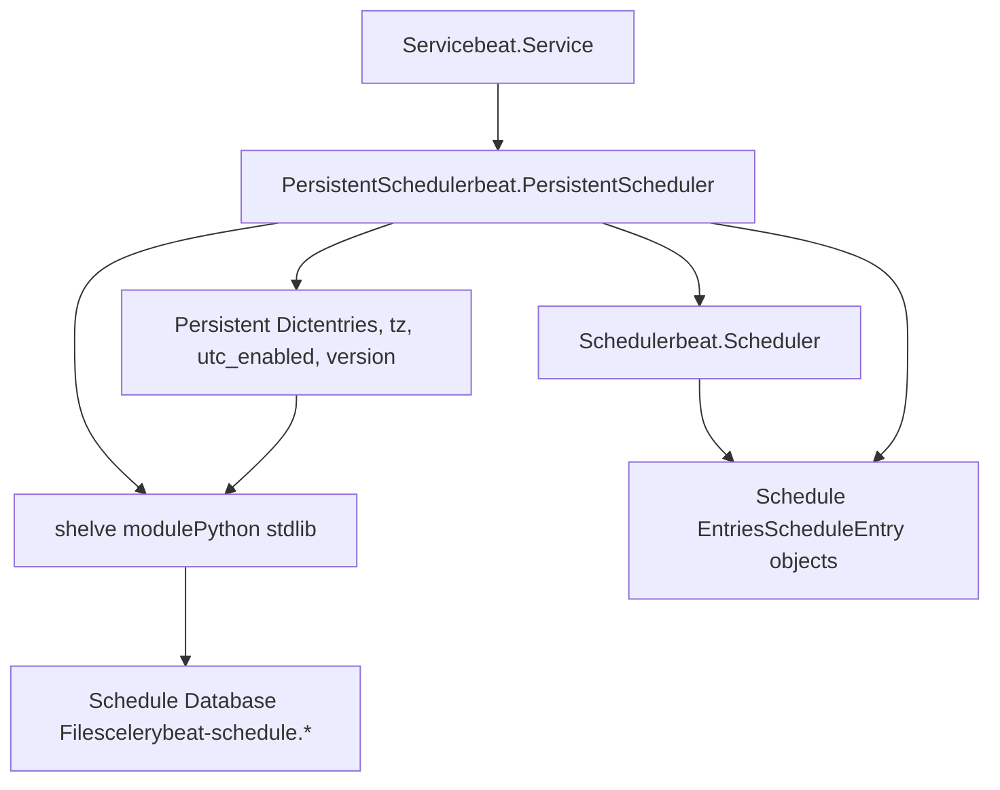
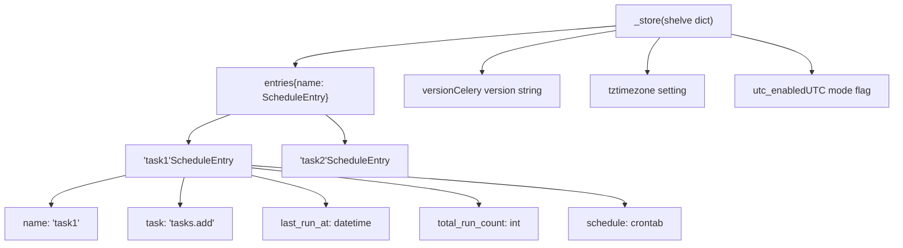
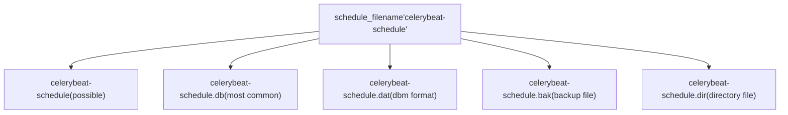
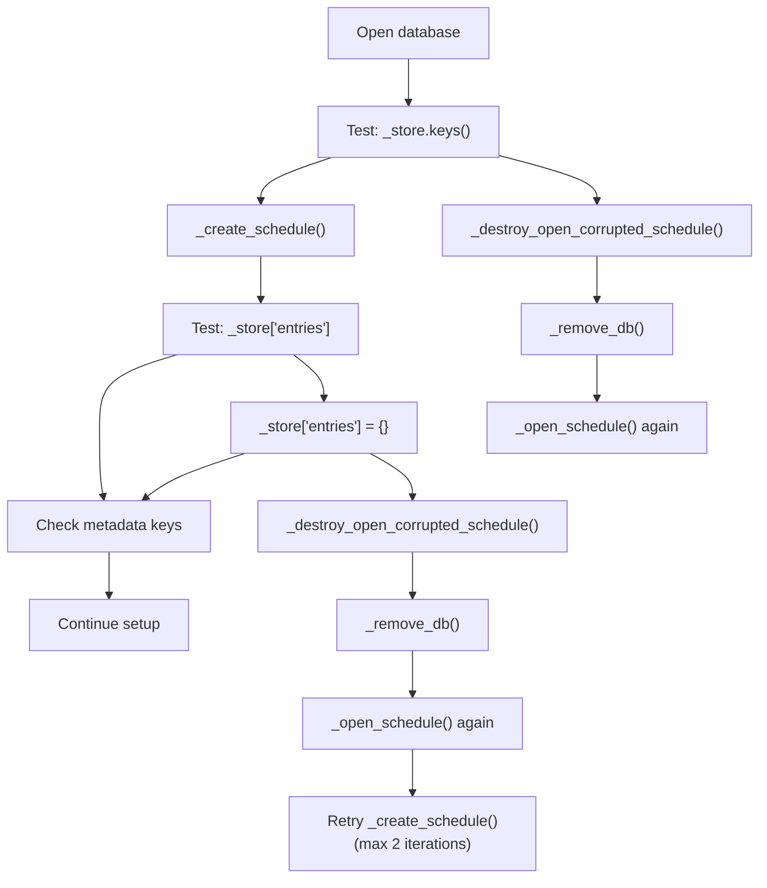

# 持久化存储 (Persistent Storage)

相关源文件

-   [CONTRIBUTORS.txt](https://github.com/celery/celery/blob/4d068b56/CONTRIBUTORS.txt)
-   [celery/beat.py](https://github.com/celery/celery/blob/4d068b56/celery/beat.py)
-   [celery/schedules.py](https://github.com/celery/celery/blob/4d068b56/celery/schedules.py)
-   [celery/utils/iso8601.py](https://github.com/celery/celery/blob/4d068b56/celery/utils/iso8601.py)
-   [celery/utils/time.py](https://github.com/celery/celery/blob/4d068b56/celery/utils/time.py)
-   [docs/AUTHORS.txt](https://github.com/celery/celery/blob/4d068b56/docs/AUTHORS.txt)
-   [t/unit/app/test\_beat.py](https://github.com/celery/celery/blob/4d068b56/t/unit/app/test_beat.py)
-   [t/unit/app/test\_schedules.py](https://github.com/celery/celery/blob/4d068b56/t/unit/app/test_schedules.py)
-   [t/unit/backends/test\_cache.py](https://github.com/celery/celery/blob/4d068b56/t/unit/backends/test_cache.py)
-   [t/unit/utils/test\_serialization.py](https://github.com/celery/celery/blob/4d068b56/t/unit/utils/test_serialization.py)
-   [t/unit/utils/test\_time.py](https://github.com/celery/celery/blob/4d068b56/t/unit/utils/test_time.py)

本文档涵盖了 Celery Beat 调度器用于在重启后保持调度状态的持久化存储系统。主题包括基于 shelve 的存储机制、版本管理、时区迁移、损坏恢复，以及用于动态任务参数的 `BeatLazyFunc` 实用程序。

有关 Beat 调度器架构和滴答（tick）循环的信息，请参阅[Beat 调度器架构](/celery/celery/7.1-beat-scheduler-architecture)。有关调度类型定义的信息，请参阅[调度类型](/celery/celery/7.2-schedule-types)。

## 目的与范围

Celery Beat 中的持久化存储系统解决了一个关键问题：在进程重启后保持调度状态。如果没有持久化，每当 Beat 重启时，所有调度条目都会重置为初始状态，导致任务在错误的时间运行，或者完全跳过预定的执行。

`PersistentScheduler` 扩展了基础 `Scheduler` 类，通过 Python 的 `shelve` 模块增加了一个持久化存储层。这使得 Beat 能够：

-   记住每个调度任务的上次运行时间 (`last_run_at`)
-   跟踪每个条目的总运行次数 (`total_run_count`)
-   检测需要重置调度的时区和配置更改
-   优雅地从数据库损坏中恢复
-   通过 `BeatLazyFunc` 支持动态任务参数

来源：[celery/beat.py505-610](https://github.com/celery/celery/blob/4d068b56/celery/beat.py#L505-L610) [celery/beat.py50-78](https://github.com/celery/celery/blob/4d068b56/celery/beat.py#L50-L78)

## 架构概览

持久化存储系统通过 `PersistentScheduler` 类实现，该类在基础 `Scheduler` 功能之上包装了一个由 shelve 支持的持久化字典。


**图表：PersistentScheduler 类层次结构与存储层**

关键组件包括：

-   **`PersistentScheduler`**：实现持久化的主类 ([celery/beat.py505](https://github.com/celery/celery/blob/4d068b56/celery/beat.py#L505-L505))。
-   **`persistence` 属性**：提供 shelve 接口的模块（默认：`shelve`）([celery/beat.py508](https://github.com/celery/celery/blob/4d068b56/celery/beat.py#L508-L508))。
-   **`_store` 属性**：已打开的 shelve 数据库 ([celery/beat.py511](https://github.com/celery/celery/blob/4d068b56/celery/beat.py#L511-L511))。
-   **`schedule_filename` 属性**：数据库文件的路径 ([celery/beat.py514](https://github.com/celery/celery/blob/4d068b56/celery/beat.py#L514-L514))。

来源：[celery/beat.py505-516](https://github.com/celery/celery/blob/4d068b56/celery/beat.py#L505-L516)

## 存储结构

shelve 数据库存储一个包含特定键的字典，用于维护调度数据和用于更改检测的元数据。


**图表：持久化存储数据结构**

存储的数据包括：

| 键 | 类型 | 目的 |
| --- | --- | --- |
| `entries` | `dict[str, ScheduleEntry]` | 调度条目名称到条目对象的映射 |
| `__version__` | `str` | Celery 版本（例如 "5.3.0"），用于迁移检测 |
| `tz` | `str` 或 `tzinfo` | 配置的时区，用于更改检测 |
| `utc_enabled` | `bool` | UTC 模式设置，用于更改检测 |

`entries` 字典中的每个 `ScheduleEntry` 包含：

-   `name`: 条目名称/标识符
-   `task`: 要执行的任务名称
-   `schedule`: 调度对象（例如 `crontab`, `schedule`）
-   `args`: 任务的位置参数
-   `kwargs`: 任务的关键字参数
-   `options`: 任务执行选项
-   `last_run_at`: 上次执行的时间戳
-   `total_run_count`: 已执行的次数

来源：[celery/beat.py557-568](https://github.com/celery/celery/blob/4d068b56/celery/beat.py#L557-L568) [celery/beat.py592-596](https://github.com/celery/celery/blob/4d068b56/celery/beat.py#L592-L596)

## 数据库文件格式

shelve 模块使用 `dbm` 库，根据底层的 DBM 实现，它会创建多个具有不同后缀的文件。


**图表：已知的数据库文件后缀**

`known_suffixes` 列表定义了所有可能的文件扩展名 ([celery/beat.py509](https://github.com/celery/celery/blob/4d068b56/celery/beat.py#L509-L509))：

-   `''`: 无后缀（某些 DBM 实现）。
-   `.db`: 最常见，由 dbm.gnu 及其他实现使用。
-   `.dat`: 某些 DBM 格式的数据文件。
-   `.bak`: 基于哈希格式的备份文件。
-   `.dir`: 基于哈希格式的目录文件。

移除数据库时，必须删除所有变体以确保彻底删除 ([celery/beat.py517-520](https://github.com/celery/celery/blob/4d068b56/celery/beat.py#L517-L520))。

来源：[celery/beat.py509](https://github.com/celery/celery/blob/4d068b56/celery/beat.py#L509-L509) [celery/beat.py517-520](https://github.com/celery/celery/blob/4d068b56/celery/beat.py#L517-L520)

## 数据库生命周期

持久化调度器通过不同的生命周期阶段管理数据库：设置、同步和关闭。

### 设置阶段

> **[Mermaid sequence]**
> *(图表结构无法解析)*

**图表：数据库设置序列**

设置阶段 ([celery/beat.py531-568](https://github.com/celery/celery/blob/4d068b56/celery/beat.py#L531-L568))：

1.  **打开数据库**：调用 `_open_schedule()` 获取一个 `writeback=True` 的 shelve 字典。
2.  **验证结构**：尝试读取 `_store.keys()` 以尽早检测损坏。
3.  **处理损坏**：如果发生错误，调用 `_destroy_open_corrupted_schedule()` 移除并重新创建。
4.  **创建调度**：调用 `_create_schedule()` 确保 `entries` 键存在。
5.  **检测更改**：检查 `tz` 或 `utc_enabled` 是否与存储的值不同。
6.  **更改时重置**：如果时区或 UTC 设置发生更改，则清除整个存储。
7.  **合并配置**：应用来自 `app.conf.beat_schedule` 的配置。
8.  **更新元数据**：存储当前的 `__version__`、`tz` 和 `utc_enabled`。
9.  **同步**：将更改写入磁盘。

来源：[celery/beat.py531-568](https://github.com/celery/celery/blob/4d068b56/celery/beat.py#L531-L568)

### 同步阶段

调度器通过 `sync()` 方法定期将内存中的状态同步到磁盘：

```python
def sync(self):
    if self._store is not None:
        self._store.sync()
```
同步发生的时机：

-   如果 `should_sync()` 返回 `True`，在每次任务执行后 ([celery/beat.py417-418](https://github.com/celery/celery/blob/4d068b56/celery/beat.py#L417-L418))。
-   当 `sync_every` 秒已经过去 ([celery/beat.py381-387](https://github.com/celery/celery/blob/4d068b56/celery/beat.py#L381-L387))。
-   当 `sync_every_tasks` 个任务已经执行 ([celery/beat.py385-386](https://github.com/celery/celery/blob/4d068b56/celery/beat.py#L385-L386))。
-   显式调用 `close()` 时 ([celery/beat.py603-605](https://github.com/celery/celery/blob/4d068b56/celery/beat.py#L603-L605))。

`sync()` 方法委托给 `shelve.sync()`，后者使用底层 DBM 的同步机制将内存状态写入磁盘。

来源：[celery/beat.py599-601](https://github.com/celery/celery/blob/4d068b56/celery/beat.py#L599-L601) [celery/beat.py381-387](https://github.com/celery/celery/blob/4d068b56/celery/beat.py#L381-L387) [celery/beat.py417-418](https://github.com/celery/celery/blob/4d068b56/celery/beat.py#L417-L418)

### 关闭阶段

```python
def close(self):
    self.sync()
    self._store.close()
```
关机时，调度器会：

1.  调用 `sync()` 以刷新待处理的更改。
2.  调用 `_store.close()` 正确关闭 shelve 数据库。

这确保了所有调度状态在进程退出前都已持久化。

来源：[celery/beat.py603-605](https://github.com/celery/celery/blob/4d068b56/celery/beat.py#L603-L605)

## 损坏检测与恢复

持久化调度器实现了强大的损坏检测和恢复机制，以处理受损或不兼容的数据库文件。


**图表：损坏检测与恢复流程**

### 检测点

调度器在多个点检测损坏：

1.  **初始打开**：打开后立即测试 `_store.keys()` ([celery/beat.py539](https://github.com/celery/celery/blob/4d068b56/celery/beat.py#L539-L539))。
2.  **条目访问**：创建期间访问 `_store['entries']` ([celery/beat.py572](https://github.com/celery/celery/blob/4d068b56/celery/beat.py#L572-L572))。
3.  **条目创建**：写入新的条目字典 ([celery/beat.py576](https://github.com/celery/celery/blob/4d068b56/celery/beat.py#L576-L576))。

检测到的异常 ([celery/beat.py540](https://github.com/celery/celery/blob/4d068b56/celery/beat.py#L540-L540) [celery/beat.py573](https://github.com/celery/celery/blob/4d068b56/celery/beat.py#L573-L573) [celery/beat.py577](https://github.com/celery/celery/blob/4d068b56/celery/beat.py#L577-L577)) 包括：

-   `KeyError`：缺失必要的键。
-   `UnicodeDecodeError`：存储数据中的编码问题。
-   `TypeError`：版本不兼容导致的类型不匹配。
-   `UnpicklingError`：Pickle 反序列化失败。
-   `dbm.error`：DBM 级别的损坏。

### 恢复过程

`_destroy_open_corrupted_schedule()` 方法处理恢复 ([celery/beat.py525-529](https://github.com/celery/celery/blob/4d068b56/celery/beat.py#L525-L529))：

```python
def _destroy_open_corrupted_schedule(self, exc):
    error('Removing corrupted schedule file %r: %r',
          self.schedule_filename, exc, exc_info=True)
    self._remove_db()
    return self._open_schedule()
```
步骤：

1.  记录包含完整异常详情的错误。
2.  调用 `_remove_db()` 删除所有数据库文件变体。
3.  使用 `_open_schedule()` 重新打开，创建一个全新的数据库。

`_remove_db()` 方法移除所有可能的文件夹后缀 ([celery/beat.py517-520](https://github.com/celery/celery/blob/4d068b56/celery/beat.py#L517-L520))：

```python
def _remove_db(self):
    for suffix in self.known_suffixes:
        with platforms.ignore_errno(errno.ENOENT):
            os.remove(self.schedule_filename + suffix)
```
这确保了即使 DBM 实现使用多个文件，也能完成彻底清理。

### 重试逻辑

`_create_schedule()` 方法使用循环在恢复后进行重试 ([celery/beat.py569-590](https://github.com/celery/celery/blob/4d068b56/celery/beat.py#L569-L590))：

```python
def _create_schedule(self):
    for _ in (1, 2):  # 尝试两次
        try:
            self._store['entries']
        except (KeyError, UnicodeDecodeError, TypeError, UnpicklingError):
            try:
                self._store['entries'] = {}
            except (...) as exc:
                self._store = self._destroy_open_corrupted_schedule(exc)
                continue  # 重试
        else:
            # 成功，检查版本字段
            if '__version__' not in self._store:
                warning('DB Reset: Account for new __version__ field')
                self._store.clear()
            # ... 对 'tz' 和 'utc_enabled' 进行类似的检查
        break
```
该循环允许在损坏恢复后重试一次，提供对瞬时问题的弹性。

来源：[celery/beat.py525-590](https://github.com/celery/celery/blob/4d068b56/celery/beat.py#L525-L590) [celery/beat.py517-520](https://github.com/celery/celery/blob/4d068b56/celery/beat.py#L517-L520)

## 元数据管理

持久化调度器跟踪元数据以检测需要重置调度的配置更改。

### 版本跟踪

`__version__` 字段存储 Celery 版本字符串 ([celery/beat.py561](https://github.com/celery/celery/blob/4d068b56/celery/beat.py#L561-L561))：

```python
self._store.update({
    '__version__': __version__,
    'tz': tz,
    'utc_enabled': utc,
})
```
当旧数据库缺失此字段时，调度将被清除 ([celery/beat.py581-583](https://github.com/celery/celery/blob/4d068b56/celery/beat.py#L581-L583))：

```python
if '__version__' not in self._store:
    warning('DB Reset: Account for new __version__ field')
    self._store.clear()
```
这使得在版本之间调度格式发生变化时能够进行未来的迁移。

### 时区变化检测

调度器将存储的时区与当前配置进行比较 ([celery/beat.py545-549](https://github.com/celery/celery/blob/4d068b56/celery/beat.py#L545-L549))：

```python
tz = self.app.conf.timezone
stored_tz = self._store.get('tz')
if stored_tz is not None and stored_tz != tz:
    warning('Reset: Timezone changed from %r to %r', stored_tz, tz)
    self._store.clear()
```
时区变化会影响调度计算，因此全面重置可防止错误的执行时间。

### UTC 模式检测

类似地，UTC 模式更改会触发重置 ([celery/beat.py550-556](https://github.com/celery/celery/blob/4d068b56/celery/beat.py#L550-L556))：

```python
utc = self.app.conf.enable_utc
stored_utc = self._store.get('utc_enabled')
if stored_utc is not None and stored_utc != utc:
    choices = {True: 'enabled', False: 'disabled'}
    warning('Reset: UTC changed from %s to %s',
            choices[stored_utc], choices[utc])
    self._store.clear()
```
在 UTC 和本地时间之间切换会从根本上改变时间计算，需要重置调度。

来源：[celery/beat.py545-564](https://github.com/celery/celery/blob/4d068b56/celery/beat.py#L545-L564) [celery/beat.py581-589](https://github.com/celery/celery/blob/4d068b56/celery/beat.py#L581-L589)

## 使用 BeatLazyFunc 的动态参数

`BeatLazyFunc` 类实现了任务参数的延迟求值，允许调度条目在执行时动态计算值，而不是在调度定义时计算。

### 目的与用例

考虑一种场景，您希望在每次任务运行时向其发送当前时间戳。如果没有 `BeatLazyFunc`，时间戳在定义调度时就固定了：

```python
# 静态方法 - 时间戳在定义时固定
beat_schedule = {
    'task-with-timestamp': {
        'task': 'tasks.process',
        'schedule': 300,
        'kwargs': {
            'timestamp': datetime.datetime.now()  # 固定值！
        }
    }
}
```
使用 `BeatLazyFunc`，每次发送任务时都会调用该函数：

```python
# 动态方法 - 时间戳在执行时求值
beat_schedule = {
    'task-with-timestamp': {
        'task': 'tasks.process',
        'schedule': 300,
        'kwargs': {
            'timestamp': BeatLazyFunc(datetime.datetime.now)  # 每次都会调用！
        }
    }
}
```
来源：[celery/beat.py50-78](https://github.com/celery/celery/blob/4d068b56/celery/beat.py#L50-L78)

### 实现

`BeatLazyFunc` 类是一个简单的可调用对象包装器：


**图表：BeatLazyFunc 求值流程**

该类存储一个可调用对象及其参数 ([celery/beat.py50-78](https://github.com/celery/celery/blob/4d068b56/celery/beat.py#L50-L78))：

-   `_func`：要调用的函数。
-   `_func_params`：包含函数 'args' 和 'kwargs' 的字典。
-   `__call__()` 和 `delay()`：都会使用存储的参数调用存储的函数。

来源：[celery/beat.py50-78](https://github.com/celery/celery/blob/4d068b56/celery/beat.py#L50-L78)

### 执行时求值

当调度器准备发送任务时，它会对条目参数中的任何 `BeatLazyFunc` 实例进行求值：

> **[Mermaid sequence]**
> *(图表结构无法解析)*

**图表：BeatLazyFunc 求值序列**

求值函数 ([celery/beat.py201-216](https://github.com/celery/celery/blob/4d068b56/celery/beat.py#L201-L216))：

**`_evaluate_entry_args(entry_args)`**：

```python
def _evaluate_entry_args(entry_args):
    if not entry_args:
        return []
    return [
        v() if isinstance(v, BeatLazyFunc) else v
        for v in entry_args
    ]
```
**`_evaluate_entry_kwargs(entry_kwargs)`**：

```python
def _evaluate_entry_kwargs(entry_kwargs):
    if not entry_kwargs:
        return {}
    return {
        k: v() if isinstance(v, BeatLazyFunc) else v
        for k, v in entry_kwargs.items()
    }
```
这些函数在任务提交前的 `Scheduler.apply_async()` 中被调用 ([celery/beat.py393-410](https://github.com/celery/celery/blob/4d068b56/celery/beat.py#L393-L410))：

```python
def apply_async(self, entry, producer=None, advance=True, **kwargs):
    entry = self.reserve(entry) if advance else entry
    task = self.app.tasks.get(entry.task)

    try:
        entry_args = _evaluate_entry_args(entry.args)
        entry_kwargs = _evaluate_entry_kwargs(entry.kwargs)
        if task:
            return task.apply_async(entry_args, entry_kwargs,
                                    producer=producer,
                                    **entry.options)
        # ...
```
来源：[celery/beat.py201-216](https://github.com/celery/celery/blob/4d068b56/celery/beat.py#L201-L216) [celery/beat.py393-410](https://github.com/celery/celery/blob/4d068b56/celery/beat.py#L393-L410)

### 持久化行为

`BeatLazyFunc` 实例与调度条目的其余部分一起存储在 shelve 数据库中。由于它们使用 pickle 序列化：

-   被包装的函数必须是可 pickle 的（在模块级别可导入）。
-   不能使用 Lambda 函数（它们无法 pickle）。
-   如果实例也是可 pickle 的，则实例方法也可以工作。

有效和无效用法的示例：

```python
# 有效：模块级函数
def get_current_time():
    return datetime.datetime.now()

beat_schedule = {
    'task1': {
        'task': 'tasks.process',
        'schedule': 300,
        'kwargs': {
            'time': BeatLazyFunc(get_current_time)  # ✓ 有效
        }
    }
}

# 无效：Lambda 函数
beat_schedule = {
    'task2': {
        'task': 'tasks.process',
        'schedule': 300,
        'kwargs': {
            'time': BeatLazyFunc(lambda: datetime.datetime.now())  # ✗ 无法 pickle
        }
    }
}
```
当调度器加载数据库时，它会反序列化（unpickle）`BeatLazyFunc` 实例，然后在求值期间正常工作。

来源：[celery/beat.py50-78](https://github.com/celery/celery/blob/4d068b56/celery/beat.py#L50-L78) [celery/beat.py201-216](https://github.com/celery/celery/blob/4d068b56/celery/beat.py#L201-L216)

## 配置

持久化调度器通过初始化参数和应用程序配置接受配置。

### 调度文件名

数据库文件路径由以下代码确定 ([celery/beat.py623-624](https://github.com/celery/celery/blob/4d068b56/celery/beat.py#L623-L624))：

```python
self.schedule_filename = (
    schedule_filename or app.conf.beat_schedule_filename)
```
默认配置 ([celery/app/defaults.py](https://github.com/celery/celery/blob/4d068b56/celery/app/defaults.py))：

-   设置项：`beat_schedule_filename`
-   默认值：`'celerybeat-schedule'`
-   类型：`str`

文件名可以是：

-   相对路径：在当前工作目录中创建数据库。
-   绝对路径：在指定位置创建数据库。

### 调度器类选择

`Service` 类使用别名系统加载调度器 ([celery/beat.py666-675](https://github.com/celery/celery/blob/4d068b56/celery/beat.py#L666-L675))：

```python
def get_scheduler(self, lazy=False,
                  extension_namespace='celery.beat_schedulers'):
    filename = self.schedule_filename
    aliases = dict(load_extension_class_names(extension_namespace))
    return symbol_by_name(self.scheduler_cls, aliases=aliases)(
        app=self.app,
        schedule_filename=filename,
        max_interval=self.max_interval,
        lazy=lazy,
    )
```
默认调度器类为 `PersistentScheduler` ([celery/beat.py615](https://github.com/celery/celery/blob/4d068b56/celery/beat.py#L615-L615))：

```python
class Service:
    scheduler_cls = PersistentScheduler
```
可以通过以下方式指定自定义调度器：

-   `Service` 的 `scheduler_cls` 参数。
-   带有调度器别名的应用程序配置。

来源：[celery/beat.py514](https://github.com/celery/celery/blob/4d068b56/celery/beat.py#L514-L514) [celery/beat.py623-624](https://github.com/celery/celery/blob/4d068b56/celery/beat.py#L623-L624) [celery/beat.py615](https://github.com/celery/celery/blob/4d068b56/celery/beat.py#L615-L615) [celery/beat.py666-675](https://github.com/celery/celery/blob/4d068b56/celery/beat.py#L666-L675)

## 调度属性访问

`PersistentScheduler` 覆盖了 `schedule` 属性，以提供对持久化条目的访问：

```python
def get_schedule(self):
    return self._store['entries']

def set_schedule(self, schedule):
    self._store['entries'] = schedule

schedule = property(get_schedule, set_schedule)
```
此属性：

-   从 shelve 数据库返回 `entries` 字典。
-   允许更新整个调度字典。
-   在修改时触发 shelve 的写回（writeback）机制（当 `writeback=True` 时）。

基础 `Scheduler` 类使用 `self.data` 进行调度存储，而 `PersistentScheduler` 重定向到 `self._store['entries']`，创建了一个透明的持久化层。

来源：[celery/beat.py592-597](https://github.com/celery/celery/blob/4d068b56/celery/beat.py#L592-L597)

## info 属性

`info` 属性提供了有关持久化存储的诊断信息 ([celery/beat.py607-609](https://github.com/celery/celery/blob/4d068b56/celery/beat.py#L607-L609))：

```python
@property
def info(self):
    return f'    . db -> {self.schedule_filename}'
```
这会出现在 Beat 的启动输出中，向操作员显示正在使用哪个数据库文件。在调试配置问题或验证是否加载了正确的数据库时，这非常有用。

来源：[celery/beat.py607-609](https://github.com/celery/celery/blob/4d068b56/celery/beat.py#L607-L609)

## 与基础调度器的集成

持久化调度器在增加持久化的同时保持了与基础 `Scheduler` 接口的兼容性：

| 方法 | 基础调度器 (Base Scheduler) | 持久化调度器 (PersistentScheduler) |
| --- | --- | --- |
| `__init__` | 初始化内存调度 | 同时打开 shelve 数据库 |
| `setup_schedule()` | 从 `app.conf.beat_schedule` 加载 | 从数据库加载，合并配置，处理元数据 |
| `sync()` | 空操作 (no-op) | 调用 `_store.sync()` 刷新到磁盘 |
| `close()` | 调用 `sync()` | 调用 `sync()` 然后调用 `_store.close()` |
| `schedule` 属性 | 返回 `self.data` | 返回 `self._store['entries']` |

继承结构允许在不更改 `Service` 或滴答循环逻辑的情况下交换调度器。

来源：[celery/beat.py219-503](https://github.com/celery/celery/blob/4d068b56/celery/beat.py#L219-L503) [celery/beat.py505-610](https://github.com/celery/celery/blob/4d068b56/celery/beat.py#L505-L610)
