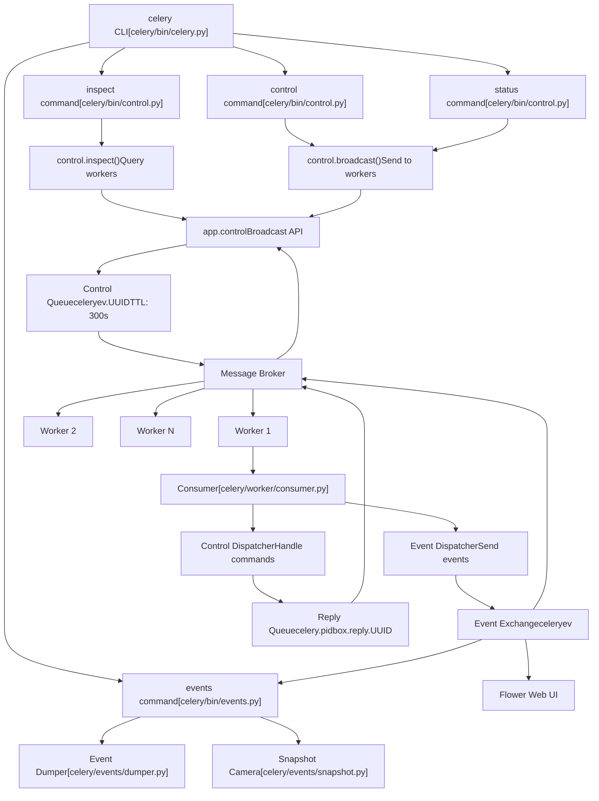
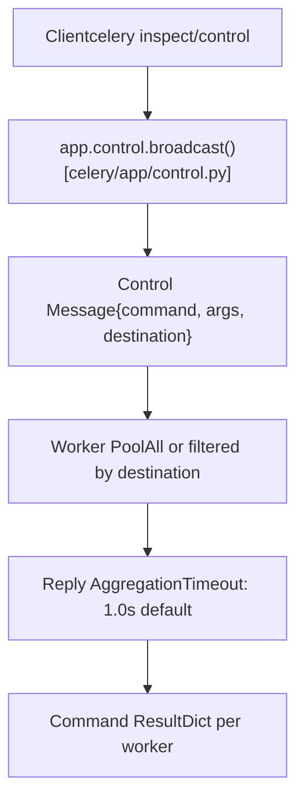
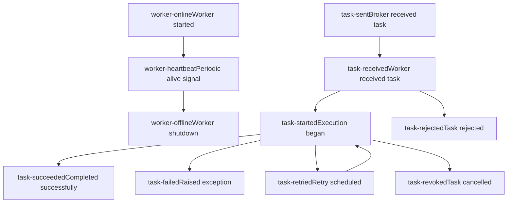
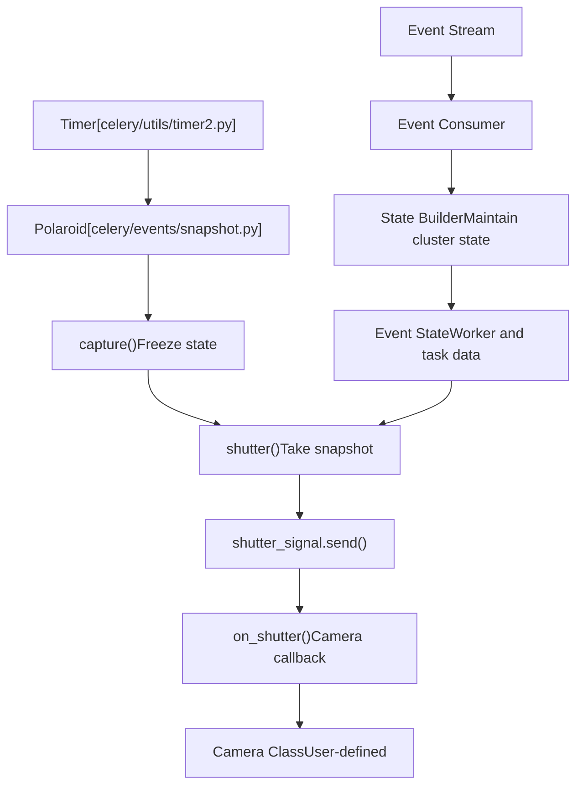
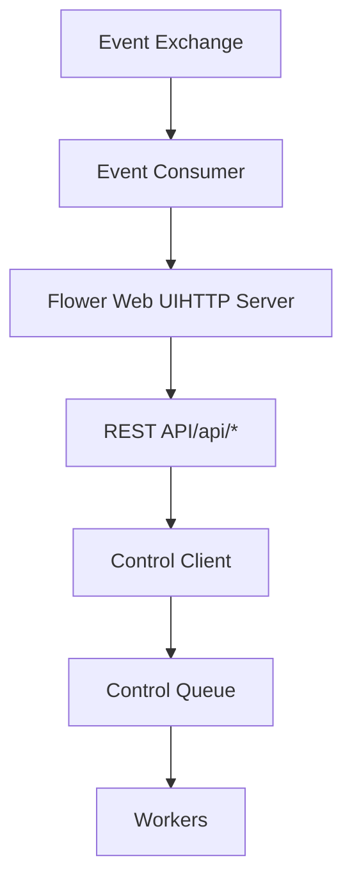
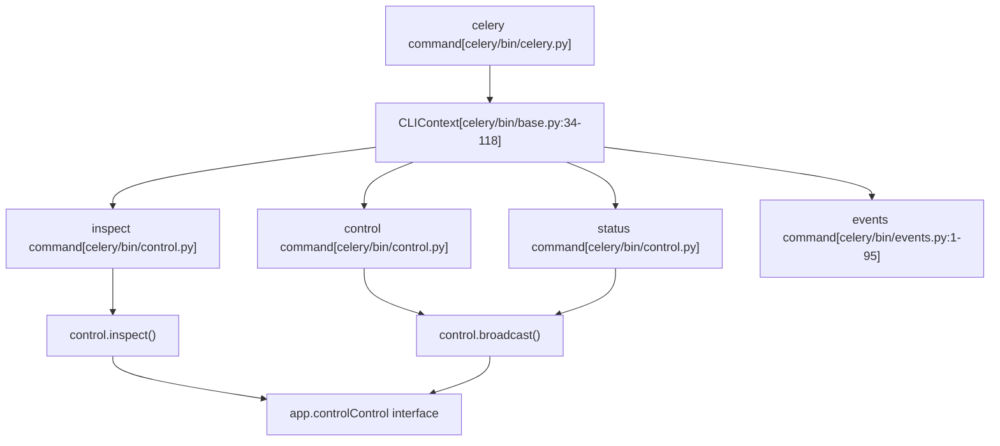

# 监控与控制 (Monitoring and Control)

相关源文件

-   [celery/app/defaults.py](https://github.com/celery/celery/blob/4d068b56/celery/app/defaults.py)
-   [celery/bin/base.py](https://github.com/celery/celery/blob/4d068b56/celery/bin/base.py)
-   [celery/bin/beat.py](https://github.com/celery/celery/blob/4d068b56/celery/bin/beat.py)
-   [celery/bin/celery.py](https://github.com/celery/celery/blob/4d068b56/celery/bin/celery.py)
-   [celery/bin/events.py](https://github.com/celery/celery/blob/4d068b56/celery/bin/events.py)
-   [celery/bin/worker.py](https://github.com/celery/celery/blob/4d068b56/celery/bin/worker.py)
-   [celery/events/snapshot.py](https://github.com/celery/celery/blob/4d068b56/celery/events/snapshot.py)
-   [docs/faq.rst](https://github.com/celery/celery/blob/4d068b56/docs/faq.rst)
-   [docs/getting-started/first-steps-with-celery.rst](https://github.com/celery/celery/blob/4d068b56/docs/getting-started/first-steps-with-celery.rst)
-   [docs/getting-started/next-steps.rst](https://github.com/celery/celery/blob/4d068b56/docs/getting-started/next-steps.rst)
-   [docs/userguide/calling.rst](https://github.com/celery/celery/blob/4d068b56/docs/userguide/calling.rst)
-   [docs/userguide/monitoring.rst](https://github.com/celery/celery/blob/4d068b56/docs/userguide/monitoring.rst)
-   [docs/userguide/periodic-tasks.rst](https://github.com/celery/celery/blob/4d068b56/docs/userguide/periodic-tasks.rst)
-   [docs/userguide/routing.rst](https://github.com/celery/celery/blob/4d068b56/docs/userguide/routing.rst)
-   [docs/userguide/tasks.rst](https://github.com/celery/celery/blob/4d068b56/docs/userguide/tasks.rst)
-   [docs/userguide/workers.rst](https://github.com/celery/celery/blob/4d068b56/docs/userguide/workers.rst)

本页面记录了 Celery 的监控与控制能力，这些能力提供了对集群运行状况的运行时可见性，并实现了对工作者（worker）节点的远程管理。这些功能允许管理员在不重启进程的情况下，检查工作者状态、管理任务执行、收集实时事件以及控制工作者行为。

有关工作者架构和生命周期的信息，请参阅[工作者 (Workers)](/celery/celery/5-workers)。有关 Beat 调度的详细信息，请参阅[周期性任务 (Beat)](/celery/celery/7-periodic-tasks-(beat))。有关与监控相关的配置选项，请参阅[应用初始化与配置](/celery/celery/2.1-application-initialization-and-configuration)。

## 概述

Celery 提供了三种主要的监控与控制机制：

1.  **远程控制命令** - 通过 `celery inspect` 和 `celery control` 命令行界面直接向工作者节点发送指令，用于检查或控制节点。
2.  **事件监控** - 通过 `celery events` 命令捕获实时事件流，并由监控工具消费。
3.  **外部工具** - 第三方监控解决方案（如 Flower），提供基于 Web 的仪表板。

这三种机制都基于代理（broker）的消息基础设施运行，其中控制命令使用专用的高优先级队列，而事件则使用单独的事件交换机（exchange）。

## 监控架构


**控制队列与事件交换机架构**

来源：[docs/userguide/monitoring.rst1-527](https://github.com/celery/celery/blob/4d068b56/docs/userguide/monitoring.rst#L1-L527) [celery/app/defaults.py150-188](https://github.com/celery/celery/blob/4d068b56/celery/app/defaults.py#L150-L188) [celery/bin/celery.py1-228](https://github.com/celery/celery/blob/4d068b56/celery/bin/celery.py#L1-L228)

## 远程控制命令

远程控制命令使用广播消息模式与工作者节点通信。命令发送到一个所有工作者都会消费的高优先级控制队列（`celery.pidbox`），从而实现集群范围或针对特定工作者的操作。

### 命令执行模型


**远程控制命令执行流**

控制系统支持两类命令：

-   **`inspect` 命令** - 只读查询，返回工作者状态而不产生副作用。
-   **`control` 命令** - 修改工作者行为或配置的操作。

### Inspect 命令

Inspect 命令查询工作者状态，并返回有关任务、队列和工作者配置的信息。所有 inspect 命令都是只读的。

| 命令 | 描述 | 输出格式 |
| --- | --- | --- |
| `active` | 当前正在执行的任务 | 包含 id、name、args、kwargs、worker\_pid 的任务字典列表 |
| `scheduled` | 已预留且带有 ETA/倒计时的任务 | 包含 eta、priority 的任务字典列表 |
| `reserved` | 已预取并等待执行的任务 | 任务字典列表 |
| `registered` | 所有已注册的任务名称 | 全限定任务名称列表 |
| `stats` | 工作者统计信息 | 包含 pool、broker 连接、总量计数的字典 |
| `active_queues` | 当前正在消费的队列 | 包含 name、exchange、routing\_key 的队列字典列表 |
| `revoked` | 已撤销的任务 ID | 任务 UUID 字符串集合 |
| `query_task` | 特定任务 ID 的状态 | 任务 ID 到任务信息的映射字典 |
| `conf` | 工作者配置 | 所有配置键的字典 |

**示例：查询活动任务**

```bash
$ celery -A proj inspect active
-> worker1@example.com: OK
    * {
        'id': '4e196aa4-0141-4601-8138-7aa33db0f577',
        'name': 'tasks.add',
        'args': [4, 4],
        'kwargs': {},
        'worker_pid': 12345
    }
```
**示例：针对特定工作者**

```bash
$ celery -A proj inspect -d worker1@example.com,worker2@example.com registered
```
`-d`（destination）标志将命令过滤到特定的工作者。如果不带该标志，命令将广播给所有工作者。

来源：[docs/userguide/monitoring.rst101-161](https://github.com/celery/celery/blob/4d068b56/docs/userguide/monitoring.rst#L101-L161) [docs/userguide/workers.rst412-497](https://github.com/celery/celery/blob/4d068b56/docs/userguide/workers.rst#L412-L497)

### Control 命令

Control 命令修改工作者行为或触发操作。这些命令具有副作用，在生产环境中应谨慎使用。

| 命令 | 描述 | 参数 |
| --- | --- | --- |
| `enable_events` | 开始发送任务事件 | 无 |
| `disable_events` | 停止发送任务事件 | 无 |
| `shutdown` | 优雅地关闭工作者 | 无 |
| `pool_restart` | 重启工作者池进程 | 无 |
| `pool_grow` | 增加工作者池进程 | `n` (int) |
| `pool_shrink` | 减少工作者池进程 | `n` (int) |
| `autoscale` | 设置自动伸缩参数 | `max`, `min` (int) |
| `revoke` | 按 ID 撤销任务 | `task_id`, `terminate`, `signal` |
| `terminate` | 按 ID 终止任务 (SIGTERM) | `task_id`, `signal` |
| `rate_limit` | 设置任务类型的速率限制 | `task_name`, `rate_limit` |
| `time_limit` | 设置任务类型的时间限制 | `task_name`, `soft`, `hard` |
| `add_consumer` | 开始从队列消费 | `queue`, `exchange`, `routing_key` |
| `cancel_consumer` | 停止从队列消费 | `queue` |
| `heartbeat` | 发送心跳事件 | 无 |
| `election` | 触发领导者选举 | 无 |

**示例：动态速率限制**

```bash
$ celery -A proj control rate_limit tasks.heavy_task 10/m
worker@example.com: OK
    new rate limit set successfully
```
**示例：撤销任务**

```bash
$ celery -A proj control revoke 4e196aa4-0141-4601-8138-7aa33db0f577
$ celery -A proj control revoke 4e196aa4-0141-4601-8138-7aa33db0f577 --terminate
```
`--terminate` 标志向正在执行任务的工作者进程发送 `SIGTERM` 信号。

来源：[docs/userguide/workers.rst498-683](https://github.com/celery/celery/blob/4d068b56/docs/userguide/workers.rst#L498-L683) [docs/userguide/monitoring.rst161-205](https://github.com/celery/celery/blob/4d068b56/docs/userguide/monitoring.rst#L161-L205)

### 控制配置 (Control Configuration)

控制队列配置在应用程序设置中定义：

```python
# 控制队列设置
control.queue_ttl = 300.0          # 队列存活时间（秒）
control.queue_expires = 10.0       # 队列闲置后过期时间（秒）
control.queue_exclusive = False    # 排他性队列标志
control.queue_durable = False      # 持久性队列标志
control.exchange = 'celery'        # 控制交换机名称
```
来源：[celery/app/defaults.py150-157](https://github.com/celery/celery/blob/4d068b56/celery/app/defaults.py#L150-L157)

## 事件监控系统

Celery 工作者可以为状态更改和任务生命周期事件发出事件消息。这些事件构成了一个实时流，监控工具通过消费该流来跟踪集群活动。

### 事件类型与生命周期


**任务与工作者事件生命周期**

事件默认禁用以减少消息开销。可以为每个工作者单独启用：

```bash
$ celery -A proj worker -E
$ celery -A proj worker --task-events
```
或者使用控制命令动态启用：

```bash
$ celery -A proj control enable_events
$ celery -A proj control disable_events
```
### 事件消息格式

事件消息包含标准字段：

```json
{
    "type": "task-started",          // 事件类型
    "uuid": "task-id-here",          // 任务 UUID
    "hostname": "worker@example.com", // 工作者主机名
    "timestamp": 1634567890.123,     // Unix 时间戳
    "local_received": 1634567890.125, // 本地接收时间
    "clock": 42,                     // 逻辑时钟
    // 任务特定字段：
    "name": "tasks.add",             // 任务名称
    "args": "[2, 2]",                // 任务位置参数（序列化后）
    "kwargs": "{}",                  // 任务关键字参数（序列化后）
    "runtime": 0.123,                // 执行时长（针对已完成任务）
    "result": "4",                   // 任务结果（针对成功任务）
    "exception": "ValueError...",    // 异常（针对失败任务）
    "traceback": "..."               // 堆栈跟踪（针对失败任务）
}
```
来源：[docs/userguide/monitoring.rst485-527](https://github.com/celery/celery/blob/4d068b56/docs/userguide/monitoring.rst#L485-L527) [celery/app/defaults.py178-188](https://github.com/celery/celery/blob/4d068b56/celery/app/defaults.py#L178-L188)

### 事件配置

事件系统配置：

```python
# 事件设置
event.queue_expires = 60.0        # 事件队列在 60 秒后过期
event.queue_ttl = 5.0             # 事件消息存活时间（TTL）
event.queue_prefix = 'celeryev'   # 事件队列名称前缀
event.queue_exclusive = False     # 排他性队列标志
event.queue_durable = False       # 持久性队列标志
event.serializer = 'json'         # 事件序列化格式
event.exchange = 'celeryev'       # 事件交换机名称

# 工作者设置
worker.send_task_events = False   # 启用任务事件（默认：False）
```
来源：[celery/app/defaults.py178-188](https://github.com/celery/celery/blob/4d068b56/celery/app/defaults.py#L178-L188) [celery/app/defaults.py313-362](https://github.com/celery/celery/blob/4d068b56/celery/app/defaults.py#L313-L362)

## celery events 命令

`celery events` 命令提供了三种消费和处理事件的模式：

### 事件转储模式 (Event Dumper Mode)

将事件实时转储到标准输出：

```bash
$ celery -A proj events --dump
task-received: tasks.add[d7e24d36-c5e8-4e0c-bf55-79a5eee7e69b] eta:None expires:None
task-started: tasks.add[d7e24d36-c5e8-4e0c-bf55-79a5eee7e69b]
task-succeeded: tasks.add[d7e24d36-c5e8-4e0c-bf55-79a5eee7e69b] runtime:0.123 result:4
```
实现：[celery/events/dumper.py](https://github.com/celery/celery/blob/4d068b56/celery/events/dumper.py)

### Curses 监控模式 (evtop)

基于交互式 curses 的终端 UI，显示实时工作者和任务活动：

```bash
$ celery -A proj events
```
这将显示一个持续更新的仪表板，包含：

-   活动的工作者及其统计信息
-   最近的任务执行及其状态
-   任务历史记录和堆栈跟踪

实现：[celery/events/cursesmon.py](https://github.com/celery/celery/blob/4d068b56/celery/events/cursesmon.py)

### 照相机/快照模式 (Camera/Snapshot Mode)

使用自定义照相机类定期捕获集群状态快照：

```bash
$ celery -A proj events --camera=myapp.MyCamera --frequency=2.0
```
照相机是一个处理定期状态快照的类：

```python
from celery.events.snapshot import Polaroid

class MyCamera(Polaroid):
    def on_shutter(self, state):
        # 每 `frequency` 秒调用一次
        # `state` 包含当前的集群状态
        print(f"活动任务数: {len(state.tasks)}")
        print(f"活动工作者数: {len(state.workers)}")
```
快照系统使用 `Polaroid` 类来管理定期捕获：


**事件快照/照相机架构**

来源：[celery/events/snapshot.py1-97](https://github.com/celery/celery/blob/4d068b56/celery/events/snapshot.py#L1-L97) [celery/bin/events.py1-95](https://github.com/celery/celery/blob/4d068b56/celery/bin/events.py#L1-L95) [docs/userguide/monitoring.rst485-527](https://github.com/celery/celery/blob/4d068b56/docs/userguide/monitoring.rst#L485-L527)

## 工作者统计信息 (Worker Statistics)

`inspect stats` 命令返回全面的工作者统计信息：

```bash
$ celery -A proj inspect stats
```
**统计输出结构：**

```json
{
    "worker@example.com": {
        "broker": {
            "hostname": "localhost",
            "port": 5672,
            "transport": "amqp",
            "virtual_host": "/",
            "connect_timeout": 4,
            "heartbeat": 120
        },
        "clock": 12345,                    // 逻辑时钟值
        "pool": {
            "implementation": "prefork",    // 池类型
            "max-concurrency": 8,           // 最大并发工作者
            "processes": [1234, 1235, ...], // 工作者进程 PID
            "max-tasks-per-child": null,
            "put-guarded-by-semaphore": true,
            "timeouts": [0, 0]             // 软性、硬性时间限制
        },
        "prefetch_count": 32,              // 预取乘数 * 并发数
        "total": {                         // 生命周期内的计数器
            "tasks.add": 42,               // 按任务名称计数
            "tasks.mul": 13
        },
        "rusage": {                        // 资源使用情况 (仅限 Unix)
            "utime": 1.234,                // 用户 CPU 时间
            "stime": 0.567,                // 系统 CPU 时间
            "maxrss": 123456,              // 最大驻留集大小 (RSS)
            "ixrss": 0,
            "idrss": 0,
            "isrss": 0,
            "minflt": 1234,
            "majflt": 0,
            "nswap": 0,
            "inblock": 0,
            "oublock": 0,
            "msgsnd": 0,
            "msgrcv": 0,
            "nsignals": 0,
            "nvcsw": 123,
            "nivcsw": 456
        }
    }
}
```
来源：[docs/userguide/monitoring.rst140-144](https://github.com/celery/celery/blob/4d068b56/docs/userguide/monitoring.rst#L140-L144)

## 第三方监控工具

### Flower

Flower 是 Celery 官方推荐的基于 Web 的监控和管理工具。它提供了实时仪表板、任务管理和 HTTP API。

**安装与使用：**

```bash
$ pip install flower
$ celery -A proj flower
```
通过 `http://localhost:5555` 访问（默认端口）。

**关键特性：**

-   实时任务和工作者监控。
-   任务历史记录和详情查看。
-   工作者池管理（重启、增加、减少、自动伸缩）。
-   队列管理（添加/取消消费者）。
-   任务撤销与终止。
-   速率限制和时间限制配置。
-   用于程序化访问的 HTTP API。
-   支持 OpenID 身份验证。

**Flower 集成：**

Flower 从事件交换机消费事件，并通过 app.control 接口提供控制能力：


**Flower 架构与 Celery 集成**

来源：[docs/userguide/monitoring.rst207-317](https://github.com/celery/celery/blob/4d068b56/docs/userguide/monitoring.rst#L207-L317)

## 代理特定监控 (Broker-Specific Monitoring)

### RabbitMQ 监控

RabbitMQ 通过 `rabbitmqctl` 提供原生监控工具：

**队列检查：**

```bash
# 列出带有消息计数的队列
$ rabbitmqctl list_queues name messages messages_ready messages_unacknowledged

# 列出每个队列的活动消费者
$ rabbitmqctl list_queues name consumers

# 列出队列内存使用情况
$ rabbitmqctl list_queues name memory
```
**连接与信道检查：**

```bash
# 列出连接
$ rabbitmqctl list_connections name peer_host peer_port state

# 列出信道
$ rabbitmqctl list_channels connection name number consumer_count
```
来源：[docs/userguide/monitoring.rst364-420](https://github.com/celery/celery/blob/4d068b56/docs/userguide/monitoring.rst#L364-L420)

### Redis 监控

Redis 监控使用 `redis-cli` 来检查队列长度：

```bash
# 获取队列长度
$ redis-cli -h HOST -p PORT -n DATABASE llen celery

# 列出所有键（包含所有队列）
$ redis-cli -h HOST -p PORT -n DATABASE keys \*

# 获取队列内容（前 10 项）
$ redis-cli -h HOST -p PORT -n DATABASE lrange celery 0 9
```
**注意：** 队列键仅在存在任务时才存在。缺失键表示队列为空。

来源：[docs/userguide/monitoring.rst422-461](https://github.com/celery/celery/blob/4d068b56/docs/userguide/monitoring.rst#L422-L461)

## 命令行界面结构

监控命令通过 Celery 的 CLI 框架实现：


**监控 CLI 架构**

CLI 为所有监控命令提供了通用选项：

-   `--timeout` - 响应超时秒数（默认：1.0）。
-   `--destination` / `-d` - 通过主机名针对特定工作者。
-   `--json` - 以 JSON 格式输出结果。

来源：[celery/bin/celery.py1-228](https://github.com/celery/celery/blob/4d068b56/celery/bin/celery.py#L1-L228) [celery/bin/base.py34-118](https://github.com/celery/celery/blob/4d068b56/celery/bin/base.py#L34-L118) [docs/userguide/monitoring.rst183-205](https://github.com/celery/celery/blob/4d068b56/docs/userguide/monitoring.rst#L183-L205)

## 平台集成

### 信号处理

工作者响应平台信号进行监控和控制：

| 信号 | 效果 | 处理器位置 |
| --- | --- | --- |
| `SIGUSR1` | 转储所有线程的堆栈跟踪 | 工作者进程 |
| `SIGUSR2` | 远程调试 (celery.contrib.rdb) | 工作者进程 |
| `SIGTERM` | 温和关闭 (Warm shutdown) | 工作者进程 |
| `SIGQUIT` | 冷关闭 (Cold shutdown) | 工作者进程 |
| `SIGINT` | 首先温和关闭，第二次冷关闭 | 工作者进程 |

来源：[docs/userguide/workers.rst314-330](https://github.com/celery/celery/blob/4d068b56/docs/userguide/workers.rst#L314-L330) [celery/platforms.py1-820](https://github.com/celery/celery/blob/4d068b56/celery/platforms.py#L1-L820)

### 进程管理

用于监控集成的平台实用程序：

-   **Pidfile 管理** - [celery/platforms.py125-273](https://github.com/celery/celery/blob/4d068b56/celery/platforms.py#L125-L273) - `Pidfile` 类，用于锁文件。
-   **守护进程化 (Daemonization)** - [celery/platforms.py310-430](https://github.com/celery/celery/blob/4d068b56/celery/platforms.py#L310-L430) - `DaemonContext` 类，用于后台进程。
-   **信号工具** - [celery/platforms.py594-699](https://github.com/celery/celery/blob/4d068b56/celery/platforms.py#L594-L699) - `Signals` 类，用于跨平台信号处理。

来源：[celery/platforms.py1-820](https://github.com/celery/celery/blob/4d068b56/celery/platforms.py#L1-L820)

## 总结

Celery 的监控与控制系统提供了全面的可见性和管理能力：

-   **远程控制** - 用于查询和控制工作者的同步请求/回复模式。
-   **事件流** - 用于实时监控的异步事件广播。
-   **CLI 工具** - 适用于所有操作的统一命令行界面。
-   **第三方集成** - 支持像 Flower 这样工具的开放架构。
-   **代理集成** - 使用代理特定工具的原生监控。

这种架构既支持人工交互式监控（CLI、Flower），也支持用于生产部署场景的程序化集成（事件消费者、照相机）。
