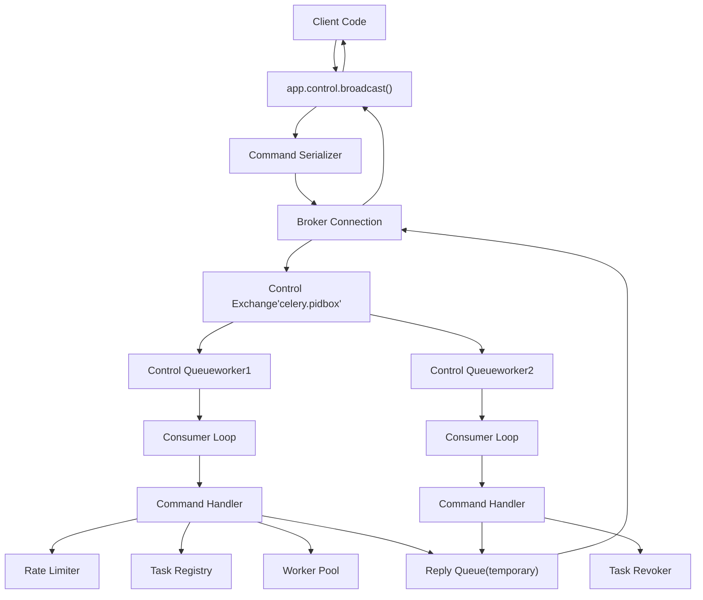

# 远程控制命令 (Remote Control Commands)

相关源文件

-   [celery/app/defaults.py](https://github.com/celery/celery/blob/4d068b56/celery/app/defaults.py)
-   [docs/faq.rst](https://github.com/celery/celery/blob/4d068b56/docs/faq.rst)
-   [docs/getting-started/first-steps-with-celery.rst](https://github.com/celery/celery/blob/4d068b56/docs/getting-started/first-steps-with-celery.rst)
-   [docs/getting-started/next-steps.rst](https://github.com/celery/celery/blob/4d068b56/docs/getting-started/next-steps.rst)
-   [docs/userguide/calling.rst](https://github.com/celery/celery/blob/4d068b56/docs/userguide/calling.rst)
-   [docs/userguide/monitoring.rst](https://github.com/celery/celery/blob/4d068b56/docs/userguide/monitoring.rst)
-   [docs/userguide/periodic-tasks.rst](https://github.com/celery/celery/blob/4d068b56/docs/userguide/periodic-tasks.rst)
-   [docs/userguide/routing.rst](https://github.com/celery/celery/blob/4d068b56/docs/userguide/routing.rst)
-   [docs/userguide/tasks.rst](https://github.com/celery/celery/blob/4d068b56/docs/userguide/tasks.rst)
-   [docs/userguide/workers.rst](https://github.com/celery/celery/blob/4d068b56/docs/userguide/workers.rst)

远程控制命令提供了一种在运行时管理和控制 Celery 工作者的机制，而无需停止或重启它们。这些命令作为高优先级的广播消息通过代理（broker）发送给一个或多个工作者节点，从而实现诸如撤销任务、调整速率限制、关闭工作者以及修改池并发量等操作。

有关查询工作者状态（活动任务、已注册任务、统计信息）的信息，请参阅[工作者检查](/celery/celery/8.2-worker-inspection)。有关通过事件监控工作者活动的信息，请参阅[事件监控工具](/celery/celery/8.3-event-system)。

---

## 系统架构

远程控制系统使用专用的高优先级消息队列，将指令从客户端应用程序传递到工作者节点。工作者会持续监听该队列，并在收到命令后立即执行。

### 控制消息流

> **[Mermaid sequence]**
> *(图表结构无法解析)*

**来源：** [docs/userguide/workers.rst414-461](https://github.com/celery/celery/blob/4d068b56/docs/userguide/workers.rst#L414-L461) [docs/userguide/monitoring.rst25-205](https://github.com/celery/celery/blob/4d068b56/docs/userguide/monitoring.rst#L25-L205)

### 池 (Pool) 和代理 (Broker) 支持

远程控制系统的支持程度因工作者池类型和消息代理而异：

| 组件 | 支持程度 |
| --- | --- |
| **池类型** | prefork, eventlet, gevent, thread (完全支持)
solo (受限 - 会发生阻塞) |
| **代理** | RabbitMQ/AMQP (完全支持)
Redis (完全支持)
其他代理 (受限或不支持) |

**注意：** solo 池支持远程控制，但任何正在执行的任务都会阻塞控制命令直到其完成。在使用带有长时间运行任务的 solo 池时，请增加回复超时时间。

**来源：** [docs/userguide/workers.rst425-451](https://github.com/celery/celery/blob/4d068b56/docs/userguide/workers.rst#L425-L451)

---

## 控制配置

控制命令使用专用的交换机和队列，并具有特定的配置选项：

```python
# 控制系统的配置选项
control_queue_ttl = 300.0          # 消息存活时间（秒）
control_queue_expires = 10.0       # 队列自动删除超时（秒）
control_queue_exclusive = False    # 排他性队列标志
control_queue_durable = False      # 队列持久性
control_exchange = 'celery'        # 控制交换机名称
```
这些设置控制了控制消息队列的行为，包括消息过期和队列生命周期。

**来源：** [celery/app/defaults.py150-156](https://github.com/celery/celery/blob/4d068b56/celery/app/defaults.py#L150-L156)

---

## 广播函数 (The Broadcast Function)

`control.broadcast()` 方法是所有远程控制命令的基础。它向一个或多个工作者发送命令，并可选地收集回复。

### 方法签名

```python
app.control.broadcast(
    command,              # 命令名称 (string)
    arguments=None,       # 命令参数 (dict)
    destination=None,     # 目标工作者 (list)，None 代表所有
    connection=None,      # 自定义连接
    reply=False,          # 是否等待回复
    timeout=1.0,          # 回复超时（秒）
    limit=None,           # 最大回复数量
    callback=None,        # 回复回调函数
    channel=None          # 自定义信道
)
```
### 基本用法

```python
# 发送命令而不等待回复（异步）
app.control.broadcast('rate_limit',
                      arguments={'task_name': 'myapp.mytask',
                                'rate_limit': '200/m'})

# 发送命令并等待回复
replies = app.control.broadcast('rate_limit',
                                arguments={'task_name': 'myapp.mytask',
                                          'rate_limit': '200/m'},
                                reply=True)
# 返回示例：[{'worker1.example.com': 'New rate limit set successfully'},
#           {'worker2.example.com': 'New rate limit set successfully'}]

# 发送到特定工作者
replies = app.control.broadcast('rate_limit',
                                arguments={'task_name': 'myapp.mytask',
                                          'rate_limit': '200/m'},
                                reply=True,
                                destination=['worker1@example.com'])
```
**来源：** [docs/userguide/workers.rst453-496](https://github.com/celery/celery/blob/4d068b56/docs/userguide/workers.rst#L453-L496)

---

## 控制命令参考

### 任务撤销命令

#### revoke

通过 ID 撤销一个或多个任务，防止其执行或终止正在运行的任务。

```python
# 撤销单个任务
app.control.revoke('d9078da5-9915-40a0-bfa1-392c7bde42ed')

# 如果任务已经在执行，则撤销并终止（仅限 prefork, eventlet, gevent）
app.control.revoke('d9078da5-9915-40a0-bfa1-392c7bde42ed',
                   terminate=True)

# 使用自定义信号撤销
app.control.revoke('d9078da5-9915-40a0-bfa1-392c7bde42ed',
                   terminate=True,
                   signal='SIGKILL')

# 撤销多个任务
app.control.revoke([
    '7993b0aa-1f0b-4780-9af0-c47c0858b3f2',
    'f565793e-b041-4b2b-9ca4-dca22762a55d',
    'd9d35e03-2997-42d0-a13e-64a66b88a618'
])

# CLI 用法
celery -A proj control revoke <task_id>
celery -A proj control revoke <task_id> --terminate --signal=SIGKILL
```
**行为：**

-   被撤销的任务 ID 存储在工作者内存中（最多 `CELERY_WORKER_REVOKES_MAX`，默认 50,000）。
-   带有 ETA/倒计时的任务会立即在结果后端中被撤销（自 v5.6 起）。
-   可以使用 `--statedb` 选项启用持久化撤销。
-   当超过限制时，撤销列表会在 10,800 秒（3 小时）后过期。

**来源：** [docs/userguide/workers.rst501-628](https://github.com/celery/celery/blob/4d068b56/docs/userguide/workers.rst#L501-L628)

#### revoke\_by\_stamped\_headers

根据标记的 header 键值对撤销任务。

```python
# 撤销所有带有特定 header 的任务
app.control.revoke_by_stamped_headers({'header_key': 'header_value'})

# CLI 用法
celery -A proj control revoke_by_stamped_headers header=value
```
**警告：** 撤销的 header 映射在工作者重启后不会持久化。

**来源：** [docs/userguide/workers.rst630-700](https://github.com/celery/celery/blob/4d068b56/docs/userguide/workers.rst#L630-L700)

---

### 工作者生命周期命令

#### shutdown

优雅或立即关闭一个或多个工作者。

```python
# 关闭所有工作者
app.control.shutdown()

# 关闭特定工作者
app.control.shutdown(destination=['worker1@example.com'])

# CLI 用法
celery -A proj control shutdown
celery -A proj control shutdown -d worker1@example.com
```
**来源：** [docs/userguide/workers.rst498-499](https://github.com/celery/celery/blob/4d068b56/docs/userguide/workers.rst#L498-L499)

#### pool\_restart

重启工作者池进程，而不关闭主工作者进程。

```python
# 重启所有工作者的池
app.control.pool_restart()

# 重启特定工作者的池
app.control.pool_restart(destination=['worker1@example.com'])

# CLI 用法
celery -A proj control pool_restart
```
这对于在不完全重启工作者的情况下，从内存泄漏或其他池相关问题中恢复非常有用。

**来源：** [docs/userguide/workers.rst498-499](https://github.com/celery/celery/blob/4d068b56/docs/userguide/workers.rst#L498-L499)

---

### 并发管理命令

#### pool\_grow

增加池进程的数量。

```python
# 向池中添加 3 个进程
app.control.pool_grow(n=3)

# CLI 用法
celery -A proj control pool_grow 3
```
#### pool\_shrink

减少池进程的数量。

```python
# 从池中移除 2 个进程
app.control.pool_shrink(n=2)

# CLI 用法
celery -A proj control pool_shrink 2
```
#### autoscale

动态调整自动伸缩的最小/最大池大小。

```python
# 设置自动伸缩参数：最大 10，最小 3
app.control.autoscale(max=10, min=3)

# CLI 用法
celery -A proj control autoscale 10 3
```
**来源：** [docs/userguide/workers.rst498-499](https://github.com/celery/celery/blob/4d068b56/docs/userguide/workers.rst#L498-L499)

---

### 速率限制命令

#### rate\_limit

在运行时设置或修改特定任务类型的速率限制。

```python
# 设置速率限制为每分钟 200 个任务
app.control.rate_limit('myapp.mytask', '200/m')

# 设置速率限制为每秒 10 个任务
app.control.rate_limit('myapp.mytask', '10/s')

# 设置速率限制为每小时 5 个任务
app.control.rate_limit('myapp.mytask', '5/h')

# 禁用速率限制
app.control.rate_limit('myapp.mytask', None)

# CLI 用法
celery -A proj control rate_limit myapp.mytask 200/m
```
**速率限制格式：**

-   `<number>/<unit>`，其中单位可以是 `s`（秒）、`m`（分钟）或 `h`（小时）。
-   速率限制针对每个工作者实例，而不是全局。
-   任务在时间段内均匀分布。

**来源：** [docs/userguide/workers.rst460-461](https://github.com/celery/celery/blob/4d068b56/docs/userguide/workers.rst#L460-L461) [docs/getting-started/first-steps-with-celery.rst400-409](https://github.com/celery/celery/blob/4d068b56/docs/getting-started/first-steps-with-celery.rst#L400-L409)

#### time\_limit

在运行时更改任务类型的软性和硬性时间限制。

```python
# 设置硬性时间限制为 60 秒，软性为 50 秒
app.control.time_limit('myapp.mytask', hard=60, soft=50)

# CLI 用法
celery -A proj control time_limit myapp.mytask 60 50
```
**来源：** [docs/userguide/workers.rst498-499](https://github.com/celery/celery/blob/4d068b56/docs/userguide/workers.rst#L498-L499)

---

### 队列管理命令

#### add\_consumer

在运行中的工作者上开始消费新队列。

```python
# 开始消费 'new_queue'
app.control.add_consumer('new_queue')

# 以特定的路由键和交换机开始消费
app.control.add_consumer(
    queue='new_queue',
    exchange='custom_exchange',
    exchange_type='topic',
    routing_key='custom.routing.key'
)

# CLI 用法
celery -A proj control add_consumer new_queue
```
#### cancel\_consumer

停止消费队列而不移除它。

```python
# 停止消费队列
app.control.cancel_consumer('old_queue')

# CLI 用法
celery -A proj control cancel_consumer old_queue
```
#### active\_queues

列出工作者当前正在消费的队列。

```python
# 获取所有工作者的活动队列
queues = app.control.active_queues()

# CLI 用法
celery -A proj control active_queues
```
**来源：** [docs/userguide/workers.rst498-499](https://github.com/celery/celery/blob/4d068b56/docs/userguide/workers.rst#L498-L499)

---

### 事件管理命令

#### enable\_events

启用任务事件广播以进行监控。

```python
# 在所有工作者上启用事件
app.control.enable_events()

# CLI 用法
celery -A proj control enable_events
```
#### disable\_events

禁用任务事件广播。

```python
# 在所有工作者上禁用事件
app.control.disable_events()

# CLI 用法
celery -A proj control disable_events
```
监控工具（如 Flower 和 `celery events`）会使用事件。启用它们会有性能开销，因为每个任务状态更改都会生成一条消息。

**来源：** [docs/userguide/monitoring.rst161-171](https://github.com/celery/celery/blob/4d068b56/docs/userguide/monitoring.rst#L161-L171)

---

### 选举命令

#### election

触发工作者集群中的领导者选举（某些功能内部使用）。

```python
# 触发选举
app.control.election()
```
**来源：** [docs/userguide/workers.rst498-499](https://github.com/celery/celery/blob/4d068b56/docs/userguide/workers.rst#L498-L499)

---

## 命令行界面

`celery control` 命令提供了远程控制命令的 CLI 访问。

### 基本语法

```bash
celery -A <app> control <command> [options] [arguments]
```
### 常用选项

| 选项 | 描述 |
| --- | --- |
| `-d`, `--destination` | 针对特定工作者（逗号分隔） |
| `-t`, `--timeout` | 回复超时时间，单位秒（默认：1.0） |
| `-j`, `--json` | 以 JSON 格式输出回复 |

### 示例

```bash
# 撤销任务
celery -A proj control revoke d9078da5-9915-40a0-bfa1-392c7bde42ed

# 向特定工作者设置速率限制
celery -A proj control rate_limit tasks.add 100/m -d worker1@host,worker2@host

# 关闭特定工作者
celery -A proj control shutdown -d worker1@example.com

# 为响应缓慢的命令增加超时时间
celery -A proj control pool_restart -t 5.0

# 获取控制命令的帮助信息
celery control --help
```
**来源：** [celery/bin/celery.py1-228](https://github.com/celery/celery/blob/4d068b56/celery/bin/celery.py#L1-L228) [docs/userguide/monitoring.rst25-205](https://github.com/celery/celery/blob/4d068b56/docs/userguide/monitoring.rst#L25-L205)

---

## 针对性工作者 (Targeting Workers)

可以使用 `destination` 参数将命令定向到所有工作者或特定子集。

### 目标格式

```python
# 所有工作者（默认）
app.control.revoke(task_id)

# 通过主机名指定单个工作者
app.control.revoke(task_id, destination=['worker1@example.com'])

# 多个工作者
app.control.revoke(task_id, destination=[
    'worker1@example.com',
    'worker2@example.com'
])

# CLI 格式
celery -A proj control shutdown -d worker1@host,worker2@host
```
### 主机名模式

工作者主机名遵循以下模式：`<nodename>@<hostname>`

-   `%h` - 带有域名的完整主机名（例如 `worker1@server.example.com`）
-   `%n` - 仅主机名（例如 `worker1@server`）
-   `%d` - 仅域名（例如 `worker1@example.com`）

**来源：** [docs/userguide/monitoring.rst193-205](https://github.com/celery/celery/blob/4d068b56/docs/userguide/monitoring.rst#L193-L205) [docs/userguide/workers.rst37-61](https://github.com/celery/celery/blob/4d068b56/docs/userguide/workers.rst#L37-L61)

---

## 超时与回复处理

### 默认超时行为

```python
# 默认 1 秒超时
replies = app.control.broadcast('rate_limit',
                                arguments={'task_name': 'tasks.add',
                                          'rate_limit': '200/m'},
                                reply=True)

# 针对慢速网络或繁忙工作者的自定义超时
replies = app.control.broadcast('rate_limit',
                                arguments={'task_name': 'tasks.add',
                                          'rate_limit': '200/m'},
                                reply=True,
                                timeout=5.0)
```
### 回复限制

```python
# 等待所有工作者的回复
replies = app.control.broadcast('ping', reply=True, limit=None)

# 仅等待前 3 个回复
replies = app.control.broadcast('ping', reply=True, limit=3)

# 当指定了 destination 时，limit 默认为 len(destination)
replies = app.control.broadcast('ping',
                                reply=True,
                                destination=['w1@host', 'w2@host'])
# limit 自动设为 2
```
### 理解缺失的回复

工作者在超时时间内未回复并不一定意味着：

-   工作者已死亡
-   工作者未收到命令
-   工作者未执行命令

它可能仅仅表示：

-   网络延迟
-   工作者正忙于处理命令
-   solo 池被长时间运行的任务阻塞了

**建议：** 根据您的网络状况和工作者负载调整超时时间。

**来源：** [docs/userguide/workers.rst428-451](https://github.com/celery/celery/blob/4d068b56/docs/userguide/workers.rst#L428-L451)

---

## 控制命令执行流


**来源：** [docs/userguide/workers.rst414-496](https://github.com/celery/celery/blob/4d068b56/docs/userguide/workers.rst#L414-L496)

---

## 实践示例

### 协调的任务撤销

```python
# 在整个集群中撤销某个任务的所有实例
def revoke_task_everywhere(task_id):
    """在所有工作者上撤销任务并确认。"""
    replies = app.control.revoke(
        task_id,
        reply=True,
        timeout=3.0
    )

    successful = [r for r in replies if r.get('ok')]
    print(f"已在 {len(successful)} 个工作者上撤销")
    return replies
```
### 动态速率限制调整

```python
# 根据系统负载调整速率限制
def adjust_rate_limits(task_name, requests_per_minute):
    """动态调整任务的速率限制。"""
    rate_limit = f"{requests_per_minute}/m"

    replies = app.control.rate_limit(
        task_name,
        rate_limit,
        reply=True,
        timeout=2.0
    )

    return all('ok' in r for r in replies)
```
### 优雅的工作者缩容

```python
# 安全地缩减工作者数量
def scale_down_worker(worker_hostname):
    """停止消费并关闭工作者。"""
    # 首先停止消费新任务
    app.control.cancel_consumer(
        'celery',
        destination=[worker_hostname]
    )

    # 等待现有任务完成（应用程序逻辑）
    time.sleep(30)

    # 然后关闭
    app.control.shutdown(destination=[worker_hostname])
```
### 带有超时调整的紧急关闭

```python
# 为响应缓慢的工作者增加超时时间并执行关闭
def emergency_shutdown_all():
    """使用延长的超时时间关闭所有工作者。"""
    replies = app.control.shutdown(
        reply=True,
        timeout=10.0  # 给工作者足够时间响应
    )

    worker_count = len(replies)
    print(f"已在 {worker_count} 个工作者上启动关闭程序")
    return replies
```
**来源：** [docs/userguide/workers.rst453-496](https://github.com/celery/celery/blob/4d068b56/docs/userguide/workers.rst#L453-L496) [docs/getting-started/first-steps-with-celery.rst400-414](https://github.com/celery/celery/blob/4d068b56/docs/getting-started/first-steps-with-celery.rst#L400-L414)

---

## 局限性与注意事项

### Solo 池的局限性

使用 solo 池时，控制命令可能会被长时间运行的任务阻塞，因为工作者在同一个线程中处理命令和任务执行。解决方案：

1.  增加超时时间：`timeout=30.0` 或更高。
2.  在生产环境中使用不同的池类型（prefork, eventlet, gevent）。
3.  接受命令执行的延迟。

**来源：** [docs/userguide/workers.rst446-451](https://github.com/celery/celery/blob/4d068b56/docs/userguide/workers.rst#L446-L451)

### 代理 (Broker) 要求

并非所有代理都完全支持控制命令：

| 代理 | 支持程度 |
| --- | --- |
| RabbitMQ/AMQP | 完全支持 - 推荐使用 |
| Redis | 完全支持 |
| Amazon SQS | 受限 - 无广播 |
| 其他代理 | 视情况而定 |

**来源：** [docs/userguide/workers.rst426-427](https://github.com/celery/celery/blob/4d068b56/docs/userguide/workers.rst#L426-L427) [docs/userguide/workers.rst627-628](https://github.com/celery/celery/blob/4d068b56/docs/userguide/workers.rst#L627-L628)

### 内存注意事项

撤销的任务 ID 存储在工作者内存中，具有以下限制：

-   `CELERY_WORKER_REVOKES_MAX`：最大撤销 ID 数量（默认：50,000）。
-   `CELERY_WORKER_REVOKE_EXPIRES`：超过限制时的过期时间（默认：10,800 秒）。

为了在重启后持久化撤销状态，请使用 `--statedb` 选项：

```bash
celery -A proj worker --statedb=/var/run/celery/worker.state
```
**来源：** [docs/userguide/workers.rst515-520](https://github.com/celery/celery/blob/4d068b56/docs/userguide/workers.rst#L515-L520) [docs/userguide/workers.rst597-624](https://github.com/celery/celery/blob/4d068b56/docs/userguide/workers.rst#L597-L624)

### 网络延迟

应根据网络状况调整命令超时时间：

-   本地网络：1-2 秒足够。
-   远程/慢速网络：建议 5-10 秒。
-   分布式环境：可能需要 10-30 秒。

缺失的回复并不总是表示失败——它可能仅仅表示超时。

**来源：** [docs/userguide/workers.rst434-440](https://github.com/celery/celery/blob/4d068b56/docs/userguide/workers.rst#L434-L440)
