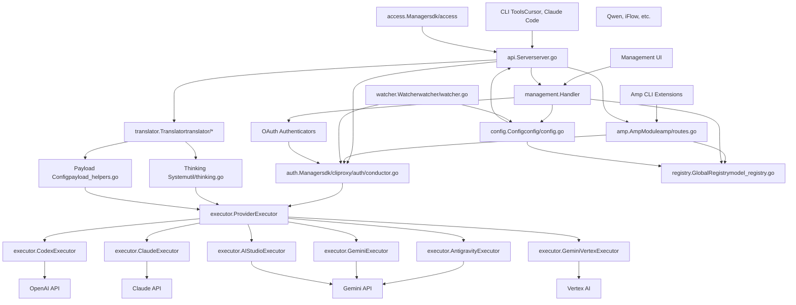
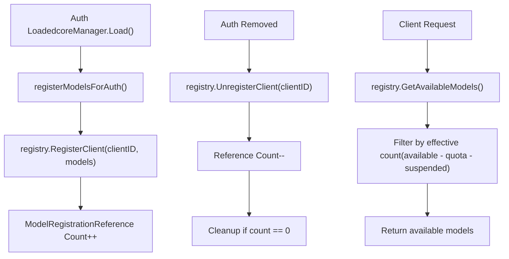

# 概述

相关源文件

-   [README.md](https://github.com/router-for-me/CLIProxyAPI/blob/c66cb0af/README.md)
-   [README\_CN.md](https://github.com/router-for-me/CLIProxyAPI/blob/c66cb0af/README_CN.md)
-   [cmd/server/main.go](https://github.com/router-for-me/CLIProxyAPI/blob/c66cb0af/cmd/server/main.go)
-   [config.example.yaml](https://github.com/router-for-me/CLIProxyAPI/blob/c66cb0af/config.example.yaml)
-   [go.mod](https://github.com/router-for-me/CLIProxyAPI/blob/c66cb0af/go.mod)
-   [go.sum](https://github.com/router-for-me/CLIProxyAPI/blob/c66cb0af/go.sum)
-   [internal/api/handlers/management/auth\_files.go](https://github.com/router-for-me/CLIProxyAPI/blob/c66cb0af/internal/api/handlers/management/auth_files.go)
-   [internal/api/handlers/management/config\_basic.go](https://github.com/router-for-me/CLIProxyAPI/blob/c66cb0af/internal/api/handlers/management/config_basic.go)
-   [internal/api/handlers/management/config\_lists.go](https://github.com/router-for-me/CLIProxyAPI/blob/c66cb0af/internal/api/handlers/management/config_lists.go)
-   [internal/api/handlers/management/logs.go](https://github.com/router-for-me/CLIProxyAPI/blob/c66cb0af/internal/api/handlers/management/logs.go)
-   [internal/api/server.go](https://github.com/router-for-me/CLIProxyAPI/blob/c66cb0af/internal/api/server.go)
-   [internal/config/config.go](https://github.com/router-for-me/CLIProxyAPI/blob/c66cb0af/internal/config/config.go)
-   [internal/managementasset/updater.go](https://github.com/router-for-me/CLIProxyAPI/blob/c66cb0af/internal/managementasset/updater.go)
-   [internal/store/gitstore.go](https://github.com/router-for-me/CLIProxyAPI/blob/c66cb0af/internal/store/gitstore.go)
-   [internal/store/postgresstore.go](https://github.com/router-for-me/CLIProxyAPI/blob/c66cb0af/internal/store/postgresstore.go)
-   [internal/watcher/watcher.go](https://github.com/router-for-me/CLIProxyAPI/blob/c66cb0af/internal/watcher/watcher.go)
-   [sdk/cliproxy/service.go](https://github.com/router-for-me/CLIProxyAPI/blob/c66cb0af/sdk/cliproxy/service.go)
-   [test/amp\_management\_test.go](https://github.com/router-for-me/CLIProxyAPI/blob/c66cb0af/test/amp_management_test.go)

## 用途

CLIProxyAPI 是一个统一的多 AI 供应商 API 代理网关，向 CLI 工具和 IDE 扩展暴露兼容 OpenAI 的端点。它提供多账户管理、OAuth 身份验证、请求转换、动态配置热重载以及自动凭证故障转移。

该系统充当客户端应用程序（Cursor、Claude Code、Cline、Amp CLI）与 AI 供应商（Google Gemini、Anthropic Claude、OpenAI Codex、Qwen、iFlow、Antigravity）之间的中间件，将特定供应商的身份验证和 API 格式差异抽象在统一接口之后。

**核心特性：**

-   兼容 OpenAI/Gemini/Claude/Codex 的 API 端点
-   多供应商身份验证（OAuth、API 密钥、服务账户）
-   OpenAI、Claude、Gemini 和 Antigravity 协议之间的格式转换
-   无需重启服务即可热重载配置
-   多账户负载均衡（轮询、优先填满策略）
-   带配额管理（Quota Management）的模型可用性跟踪
-   适用于 AI Studio 的 WebSocket 运行时身份验证
-   用于运行时配置的管理 API

有关特定子系统的详细信息，请参阅：

-   安装与设置：[入门指南](/router-for-me/CLIProxyAPI/2-getting-started)
-   内部架构：[核心架构](/router-for-me/CLIProxyAPI/3-core-architecture)
-   API 端点：[API 参考](/router-for-me/CLIProxyAPI/4-api-reference)
-   配置：[配置指南](/router-for-me/CLIProxyAPI/5-configuration-guide)
-   供应商设置：[供应商集成](/router-for-me/CLIProxyAPI/6-provider-integration)
-   身份验证：[身份验证流程](/router-for-me/CLIProxyAPI/7-authentication-flows)
-   高级功能：[高级功能](/router-for-me/CLIProxyAPI/8-advanced-features)

来源：[README.md1-58](https://github.com/router-for-me/CLIProxyAPI/blob/c66cb0af/README.md#L1-L58) [internal/api/server.go1-6](https://github.com/router-for-me/CLIProxyAPI/blob/c66cb0af/internal/api/server.go#L1-L6) [sdk/cliproxy/service.go1-4](https://github.com/router-for-me/CLIProxyAPI/blob/c66cb0af/sdk/cliproxy/service.go#L1-L4)

## 系统架构概览

CLIProxyAPI 采用分层架构，将关注点分离在 HTTP API、身份验证、路由、转换和供应商执行层。系统通过 `cliproxy.Builder` 模式设计以实现可扩展性，并通过 `watcher.Watcher` 实现热重载（Hot-Reload）能力。

### 主要组件

| 组件 | 代码实体 | 用途 |
| --- | --- | --- |
| **服务 (Service)** | `cliproxy.Service` | 应用程序生命周期协调器，集成所有子系统 |
| **API 服务器** | `api.Server` | Gin HTTP 引擎、CORS 中间件、路由注册 |
| **核心认证管理器** | `auth.Manager` (SDK) | 凭证生命周期、OAuth 刷新、选择器（Selector）委派 |
| **访问管理器** | `access.Manager` | 通过 API 密钥或自定义供应商进行请求身份验证 |
| **模型注册表** | `registry.GlobalRegistry` | 引用计数的模型可用性跟踪 |
| **供应商执行器** | `executor.*Executor` | 针对每个供应商的 HTTP 请求执行实现 |
| **转换器 (Translators)** | `translator.*Translator` | 双向格式转换（OpenAI↔Claude↔Gemini） |
| **文件观察器** | `watcher.Watcher` | 基于 fsnotify 的配置/认证热重载，具备防抖功能 |
| **WebSocket 网关** | `wsrelay.Manager` | 通过 WebSocket 进行运行时 AI Studio 身份验证 |
| **管理 API** | `management.Handler` | 运行时配置控制端点 |
| **配置管理器** | `config.Config` | 支持热重载的 YAML 配置结构 |
| **令牌存储** | `auth.Store` 接口 | 可插拔的存储后端（文件/postgres/git/S3） |

来源：[internal/api/server.go114-173](https://github.com/router-for-me/CLIProxyAPI/blob/c66cb0af/internal/api/server.go#L114-L173) [sdk/cliproxy/service.go29-92](https://github.com/router-for-me/CLIProxyAPI/blob/c66cb0af/sdk/cliproxy/service.go#L29-L92) [internal/config/config.go26-118](https://github.com/router-for-me/CLIProxyAPI/blob/c66cb0af/internal/config/config.go#L26-L118) [internal/watcher/watcher.go30-55](https://github.com/router-for-me/CLIProxyAPI/blob/c66cb0af/internal/watcher/watcher.go#L30-L55)

## 系统架构图

下图使用存储库中的实际代码实体展示了主要组件及其关系：


**系统架构：组件关系**

此图将高级概念映射到具体的代码实体。搜索实体名称（例如 `api.Server`、`executor.ClaudeExecutor`）以在代码库中查找实现。

来源：[internal/api/server.go1-1000](https://github.com/router-for-me/CLIProxyAPI/blob/c66cb0af/internal/api/server.go#L1-L1000) [sdk/cliproxy/auth/](https://github.com/router-for-me/CLIProxyAPI/blob/c66cb0af/sdk/cliproxy/auth/) [internal/runtime/executor/](https://github.com/router-for-me/CLIProxyAPI/blob/c66cb0af/internal/runtime/executor/) [internal/registry/](https://github.com/router-for-me/CLIProxyAPI/blob/c66cb0af/internal/registry/) [internal/watcher/watcher.go1-149](https://github.com/router-for-me/CLIProxyAPI/blob/c66cb0af/internal/watcher/watcher.go#L1-L149)

## 请求流程图

以下序列图显示了客户端请求如何流经系统，并引用了实际的代码路径：

> **[Mermaid sequence]**
> *(图表结构无法解析)*

**请求流程：客户端到供应商**

此图追踪了从客户端请求到供应商响应的执行路径，展示了组件交互和关键转换步骤。

来源：[internal/api/server.go308-349](https://github.com/router-for-me/CLIProxyAPI/blob/c66cb0af/internal/api/server.go#L308-L349) [sdk/api/handlers/openai/](https://github.com/router-for-me/CLIProxyAPI/blob/c66cb0af/sdk/api/handlers/openai/) [sdk/cliproxy/auth/](https://github.com/router-for-me/CLIProxyAPI/blob/c66cb0af/sdk/cliproxy/auth/) [internal/runtime/executor/](https://github.com/router-for-me/CLIProxyAPI/blob/c66cb0af/internal/runtime/executor/)

---

## 核心能力

### 多供应商支持

CLIProxyAPI 通过 `executor.ProviderExecutor` 接口集成多个 AI 供应商。每个供应商都有由 `auth.Manager` 注册的专用执行器实现：

| 供应商 | 执行器类 | 身份验证方法 | 处理器类型 |
| --- | --- | --- | --- |
| Google Gemini | `executor.GeminiExecutor` | API 密钥, CLI OAuth | OpenAI, Gemini |
| Google Vertex AI | `executor.GeminiVertexExecutor` | 服务账户 JSON, API 密钥 | OpenAI, Gemini |
| Anthropic Claude | `executor.ClaudeExecutor` | API 密钥, OAuth | OpenAI, Claude |
| OpenAI Codex | `executor.CodexExecutor` | OAuth | OpenAI, 响应 |
| Qwen Code | `executor.QwenExecutor` | 设备流 OAuth | OpenAI |
| iFlow | `executor.IFlowExecutor` | OAuth, Cookie 认证 | OpenAI |
| Antigravity | `executor.AntigravityExecutor` | OAuth | OpenAI, Claude |
| AI Studio | `executor.AIStudioExecutor` | WebSocket 运行时认证 | OpenAI, Gemini |
| Kimi | `executor.KimiExecutor` | OAuth | OpenAI |
| OpenAI-兼容 | `executor.OpenAICompatExecutor` | 可配置 API 密钥 | OpenAI |

每个执行器为其供应商实现请求准备、身份验证注入、HTTP 传输、响应解析和使用情况报告。

来源：[internal/runtime/executor/](https://github.com/router-for-me/CLIProxyAPI/blob/c66cb0af/internal/runtime/executor/) [sdk/cliproxy/service.go359-410](https://github.com/router-for-me/CLIProxyAPI/blob/c66cb0af/sdk/cliproxy/service.go#L359-L410)

### 热重载系统

`watcher.Watcher` 使用 `fsnotify.Watcher` 监视 `config.yaml` 和身份验证文件，实现具有差分更新的防抖重载：

**防抖策略：**

-   `configReloadDebounce = 150ms`：对快速的配置文件写入进行分组
-   `replaceCheckDelay = 50ms`：检测原子重命名操作
-   `authRemoveDebounceWindow = 1s`：推迟身份验证删除，以区分移动与移除

**变更检测：**

-   SHA256 哈希比较防止内容未变时的冗余重载
-   YAML 快照差分识别确切的配置变更
-   身份验证文件内容比较触发定向更新

**更新传播：**

-   `server.UpdateClients(cfg)`：将新配置应用到 `api.Server`
-   `coreManager.SetConfig(cfg)`：更新身份验证管理器
-   `ampModule.OnConfigUpdated(cfg)`：重新加载 Amp 模型映射
-   组件特定更新（日志记录器、使用情况统计、冷却配置）

零停机热重载支持在不中断请求的情况下进行运行时配置更改。

来源：[internal/watcher/watcher.go1-149](https://github.com/router-for-me/CLIProxyAPI/blob/c66cb0af/internal/watcher/watcher.go#L1-L149) [internal/api/server.go859-975](https://github.com/router-for-me/CLIProxyAPI/blob/c66cb0af/internal/api/server.go#L859-L975) [sdk/cliproxy/service.go531-583](https://github.com/router-for-me/CLIProxyAPI/blob/c66cb0af/sdk/cliproxy/service.go#L531-L583)

### 格式转换

转换层通过 `translator.Translator` 接口实现不同 AI API 格式之间的双向转换：

-   **OpenAI ↔ Claude**：消息格式转换、工具响应处理
-   **OpenAI ↔ Gemini**：内容结构转换、函数响应分组
-   **Claude ↔ Antigravity**：基于签名的验证、思考块（Thinking Block）解析
-   **Gemini ↔ Antigravity**：工具响应分组、格式标准化

来源：[internal/translator/](https://github.com/router-for-me/CLIProxyAPI/blob/c66cb0af/internal/translator/) 系统架构图 6

### 身份验证架构

CLIProxyAPI 实现了双层身份验证：

**请求身份验证** (`access.Manager`)：

-   通过 `AuthMiddleware` 验证传入的客户端 API 密钥
-   支持多个访问供应商（基于配置、自定义）
-   在路由前的 HTTP 中间件层应用

**供应商身份验证** (`auth.Manager`)：

-   管理 OAuth 令牌、API 密钥、服务账户凭证
-   实现具有指数退避的自动令牌刷新
-   按凭证跟踪配额限制和冷却期
-   通过 `auth.Selector` 选择凭证（轮询或优先填满）

**凭证生命周期：**

-   OAuth 令牌在过期前自动刷新
-   失败请求触发冷却（401 为 30 分钟，404 为 12 小时）
-   配额超限暂时标记凭证不可用
-   优先级（Priority）字段支持在多个匹配时首选凭证

**存储后端：**

-   `auth.FileTokenStore`：本地文件存储
-   `store.PostgresStore`：PostgreSQL 驱动的持久化
-   `store.GitTokenStore`：Git 存储库版本控制
-   `store.ObjectTokenStore`：兼容 S3 的对象存储

来源：[sdk/cliproxy/auth/](https://github.com/router-for-me/CLIProxyAPI/blob/c66cb0af/sdk/cliproxy/auth/) [sdk/access/](https://github.com/router-for-me/CLIProxyAPI/blob/c66cb0af/sdk/access/) [internal/api/server.go850-857](https://github.com/router-for-me/CLIProxyAPI/blob/c66cb0af/internal/api/server.go#L850-L857) [internal/store/](https://github.com/router-for-me/CLIProxyAPI/blob/c66cb0af/internal/store/)

---

## 存储后端架构

CLIProxyAPI 通过 `auth.Store` 接口支持可插拔的存储后端：

| 后端 | 实现类 | 使用场景 |
| --- | --- | --- |
| **文件 (File)** | `FileTokenStore` | 本地开发、单服务器 |
| **PostgreSQL** | `PostgresStore` | 多实例部署、共享状态 |
| **Git** | `GitTokenStore` | 版本控制、审计追踪 |
| **兼容 S3 (S3-compatible)** | `ObjectTokenStore` | 云端部署、容器化 |

所有存储后端均实现凭证持久化，并通环境变量（`PGSTORE_DSN`、`GITSTORE_GIT_URL`、`OBJECTSTORE_ENDPOINT` 等）进行配置。

来源：[internal/store/](https://github.com/router-for-me/CLIProxyAPI/blob/c66cb0af/internal/store/) [cmd/server/main.go115-442](https://github.com/router-for-me/CLIProxyAPI/blob/c66cb0af/cmd/server/main.go#L115-L442)

---

## 配置系统

`config.Config` 结构从 `config.yaml` 加载，并支持通过 `watcher.Watcher` 进行热重载：

### 关键配置部分

| 部分 | 用途 | 是否可热重载 |
| --- | --- | --- |
| `host`, `port` | 服务器绑定地址 | 否 (需重启) |
| `tls` | HTTPS 证书配置 | 否 (需重启) |
| `remote-management` | 管理 API 密钥 | 是 |
| `auth-dir` | 身份验证文件存储路径 | 否 |
| `api-keys` | 客户端请求身份验证 | 是 |
| `debug` | 调试日志级别 | 是 |
| `pprof` | pprof 调试服务器设置 | 是 |
| `logging-to-file` | 日志输出目的地 | 是 |
| `usage-statistics-enabled` | 使用情况跟踪开关 | 是 |
| `request-retry` | 失败请求重试次数 | 是 |
| `max-retry-interval` | 最大冷却等待时间 | 是 |
| `quota-exceeded` | 自动切换行为 | 是 |
| `routing.strategy` | 凭证选择（轮询/优先填满） | 是 |
| `ws-auth` | WebSocket 身份验证要求 | 是 |
| `gemini-api-key` | 带有模型/别名的 Gemini API 密钥 | 是 |
| `claude-api-key` | 带有模型/别名的 Claude API 密钥 | 是 |
| `codex-api-key` | 带有模型/别名的 Codex API 密钥 | 是 |
| `openai-compatibility` | 自定义兼容 OpenAI 的供应商 | 是 |
| `vertex-api-key` | 兼容 Vertex 的端点 | 是 |
| `ampcode` | Amp CLI 上游/映射配置 | 是 |
| `oauth-model-alias` | 全局 OAuth 模型名称别名 | 是 |
| `oauth-excluded-models` | 每个供应商的模型排除 | 是 |
| `payload` | 请求转换规则 | 是 |

**热重载机制：**

-   `watcher.Watcher` 监视 `config.yaml`，防抖时间为 150ms
-   YAML 快照差分识别已变更的部分
-   `server.UpdateClients(cfg)` 将更新传播到子系统
-   凭证配置触发模型重新注册

来源：[internal/config/config.go26-118](https://github.com/router-for-me/CLIProxyAPI/blob/c66cb0af/internal/config/config.go#L26-L118) [config.example.yaml1-314](https://github.com/router-for-me/CLIProxyAPI/blob/c66cb0af/config.example.yaml#L1-L314) [internal/watcher/watcher.go1-149](https://github.com/router-for-me/CLIProxyAPI/blob/c66cb0af/internal/watcher/watcher.go#L1-L149)

---

## 服务生命周期

`cliproxy.Service` 使用生成器（Builder）模式管理完整的应用程序生命周期：

> **[Mermaid stateDiagram]**
> *(图表结构无法解析)*

**图表：服务生命周期状态机**

来源：[sdk/cliproxy/service.go403-658](https://github.com/router-for-me/CLIProxyAPI/blob/c66cb0af/sdk/cliproxy/service.go#L403-L658) [cmd/server/main.go448-482](https://github.com/router-for-me/CLIProxyAPI/blob/c66cb0af/cmd/server/main.go#L448-L482)

---

## 模型注册与路由

`registry.GlobalRegistry` 使用引用计数跟踪所有供应商的模型可用性：

### 模型注册流程


**图表：模型注册引用计数**

每个凭证在全局注册表中注册其可用模型。当请求到达时，注册表仅报告至少有一个活动凭证的模型。

来源：[internal/registry/registry.go](https://github.com/router-for-me/CLIProxyAPI/blob/c66cb0af/internal/registry/registry.go) [sdk/cliproxy/service.go678-833](https://github.com/router-for-me/CLIProxyAPI/blob/c66cb0af/sdk/cliproxy/service.go#L678-L833)

---

## 管理 API

管理 API (`/v0/management/*`) 通过 `management.Handler` 提供运行时控制。所有端点都需要通过 `secret-key`（使用 bcrypt 哈希）或 `MANAGEMENT_PASSWORD` 环境变量进行身份验证。

### 管理端点类别

**配置 (Configuration)：**

-   `GET /v0/management/config`：检索当前配置
-   `GET /v0/management/config.yaml`：下载带有注释的原始 YAML
-   `PUT /v0/management/config.yaml`：上传新配置（应用前经过验证）
-   `GET /v0/management/debug`：调试模式状态
-   `PUT /v0/management/debug`：启用/禁用调试日志记录
-   `GET /v0/management/request-log`：请求日志记录状态
-   `PUT /v0/management/request-log`：启用/禁用请求日志记录

**身份验证文件 (Authentication Files)：**

-   `GET /v0/management/auth-files`：列出身份验证文件
-   `GET /v0/management/auth-files/models`：获取每个凭证的可用模型
-   `GET /v0/management/auth-files/download?filename=...`：下载凭证文件
-   `POST /v0/management/auth-files`：上传新凭证文件
-   `DELETE /v0/management/auth-files?filename=...`：移除凭证
-   `PATCH /v0/management/auth-files/status`：启用/禁用凭证

**OAuth 流程：**

-   `GET /v0/management/anthropic-auth-url`：启动 Claude OAuth
-   `GET /v0/management/codex-auth-url`：启动 Codex OAuth
-   `GET /v0/management/gemini-cli-auth-url`：启动 Gemini CLI OAuth
-   `GET /v0/management/antigravity-auth-url`：启动 Antigravity OAuth
-   `GET /v0/management/qwen-auth-url`：启动 Qwen OAuth
-   `GET /v0/management/iflow-auth-url`：启动 iFlow OAuth
-   `POST /v0/management/oauth-callback`：完成 OAuth 流程

**使用情况统计 (Usage Statistics)：**

-   `GET /v0/management/usage`：检索聚合的使用情况统计信息
-   `GET /v0/management/usage/export`：以 JSON 格式导出使用数据
-   `POST /v0/management/usage/import`：导入使用数据

**API 密钥 (API Keys)：**

-   `GET /v0/management/api-keys`：列出配置的 API 密钥
-   `PUT /v0/management/api-keys`：替换 API 密钥
-   `PATCH /v0/management/api-keys`：添加 API 密钥
-   `DELETE /v0/management/api-keys`：移除 API key

**Amp 集成：**

-   `GET /v0/management/ampcode/model-mappings`：列出模型映射
-   `PUT /v0/management/ampcode/model-mappings`：替换映射
-   `PATCH /v0/management/ampcode/model-mappings`：添加映射
-   `DELETE /v0/management/ampcode/model-mappings`：移除映射

**中间件保护：**

-   `management.Handler.Middleware()`：通过恒定时间比较验证密钥（Secret Key）
-   当 `remote-management.allow-remote = false` 时仅限本地主机访问
-   仅在配置了 `secret-key` 或 `MANAGEMENT_PASSWORD` 时注册路由

来源：[internal/api/handlers/management/](https://github.com/router-for-me/CLIProxyAPI/blob/c66cb0af/internal/api/handlers/management/) [internal/api/server.go465-632](https://github.com/router-for-me/CLIProxyAPI/blob/c66cb0af/internal/api/server.go#L465-L632)

---

## 入口点

`main.go` 入口点通过命令行标志支持多种操作模式：

| 模式 | 标志 | 入口函数 | 用途 |
| --- | --- | --- | --- |
| **HTTP 服务器** | (默认) | `cmd.StartService()` | 运行带热重载的 API 服务器 |
| **Gemini OAuth** | `--login` | `cmd.DoLogin()` | 验证 Google 账户 |
| **Codex OAuth** | `--codex-login` | `cmd.DoCodexLogin()` | 验证 OpenAI 账户 |
| **Claude OAuth** | `--claude-login` | `cmd.DoClaudeLogin()` | 验证 Anthropic 账户 |
| **Qwen OAuth** | `--qwen-login` | `cmd.DoQwenLogin()` | 验证 Qwen 账户 |
| **iFlow OAuth** | `--iflow-login` | `cmd.DoIFlowLogin()` | 验证 iFlow 账户 |
| **iFlow Cookie** | `--iflow-cookie` | `cmd.DoIFlowCookieAuth()` | 基于 iFlow Cookie 的身份验证 |
| **Antigravity OAuth** | `--antigravity-login` | `cmd.DoAntigravityLogin()` | 验证 Antigravity 账户 |
| **Kimi OAuth** | `--kimi-login` | `cmd.DoKimiLogin()` | 验证 Kimi 账户 |
| **Vertex 导入** | `--vertex-import <path>` | `cmd.DoVertexImport()` | 导入服务账户 JSON |

**配置路径：**

-   `--config <path>`：指定配置文件位置（默认：`./config.yaml`）
-   环境：`DEPLOY=cloud` 启用云部署待机模式

**存储后端选择：**

-   `PGSTORE_DSN`：启用 PostgreSQL 存储后端
-   `GITSTORE_GIT_URL`：启用 Git 存储库后端
-   `OBJECTSTORE_ENDPOINT`：启用兼容 S3 的对象存储
-   默认：通过 `auth.FileTokenStore` 进行本地文件存储

来源：[cmd/server/main.go50-486](https://github.com/router-for-me/CLIProxyAPI/blob/c66cb0af/cmd/server/main.go#L50-L486) [internal/cmd/](https://github.com/router-for-me/CLIProxyAPI/blob/c66cb0af/internal/cmd/)

---

## SDK 集成

可以使用 `cliproxy.Builder` 模式将 CLIProxyAPI 嵌入到 Go 应用程序中：

```
// 示例：在您的应用程序中嵌入 CLIProxyAPIcfg, _ := config.LoadConfig("config.yaml") builder := cliproxy.NewBuilder(cfg).    WithConfigPath("config.yaml").    WithServerOptions(        api.WithMiddleware(customMiddleware),        api.WithKeepAliveEndpoint(5*time.Minute, onTimeout),    ) service := builder.Build()if err := service.Run(ctx); err != nil {    log.Fatal(err)}
```
**SDK 组件：**

| 包 | 用途 |
| --- | --- |
| `sdk/cliproxy` | 服务生成器和生命周期管理 |
| `sdk/api/handlers` | OpenAI/Claude/Gemini 处理器实现 |
| `sdk/auth` | 令牌存储接口和身份验证器 |
| `sdk/access` | 请求身份验证供应商接口 |
| `sdk/cliproxy/auth` | 核心认证管理器和选择器 |
| `sdk/cliproxy/usage` | 使用情况跟踪插件接口 |
| `sdk/config` | 配置结构定义 |

**扩展点：**

-   为自定义 AI 供应商实现 `executor.ProviderExecutor`
-   为新的 API 格式转换实现 `translator.Translator`
-   为自定义使用情况跟踪注册 `usage.Plugin`
-   为自定义请求身份验证实现 `access.Provider`
-   为自定义凭证存储实现 `auth.Store`

**生成器（Builder）选项：**

-   `WithConfigPath(path)`：覆盖配置文件位置
-   `WithServerOptions(...ServerOption)`：添加 Gin 中间件、保持活动（Keep-alive）端点
-   `WithTokenProvider(provider)`：自定义令牌客户端加载
-   `WithAPIKeyProvider(provider)`：自定义 API 密钥客户端加载

来源：[sdk/cliproxy/builder.go](https://github.com/router-for-me/CLIProxyAPI/blob/c66cb0af/sdk/cliproxy/builder.go) [sdk/cliproxy/service.go1-707](https://github.com/router-for-me/CLIProxyAPI/blob/c66cb0af/sdk/cliproxy/service.go#L1-L707) [docs/sdk-usage.md](https://github.com/router-for-me/CLIProxyAPI/blob/c66cb0af/docs/sdk-usage.md)

---

## 下一步

-   **安装与部署**：参阅 [入门指南](/router-for-me/CLIProxyAPI/2-getting-started) 了解安装方法和初始设置
-   **配置详细信息**：参阅 [配置指南](/router-for-me/CLIProxyAPI/5-configuration-guide) 了解全面的配置选项
-   **API 端点**：参阅 [API 参考](/router-for-me/CLIProxyAPI/4-api-reference) 了解端点文档
-   **供应商设置**：参阅 [供应商集成](/router-for-me/CLIProxyAPI/6-provider-integration) 了解特定供应商的设置指南
-   **身份验证设置**：参阅 [身份验证流程](/router-for-me/CLIProxyAPI/7-authentication-flows) 了解 OAuth 和 API 密钥配置
-   **高级功能**：参阅 [高级功能](/router-for-me/CLIProxyAPI/8-advanced-features) 了解凭证路由、模型映射、思考配置等
