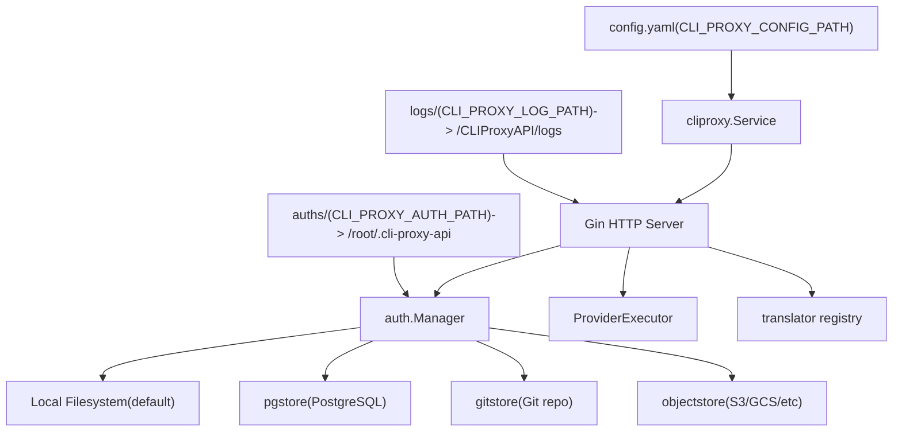
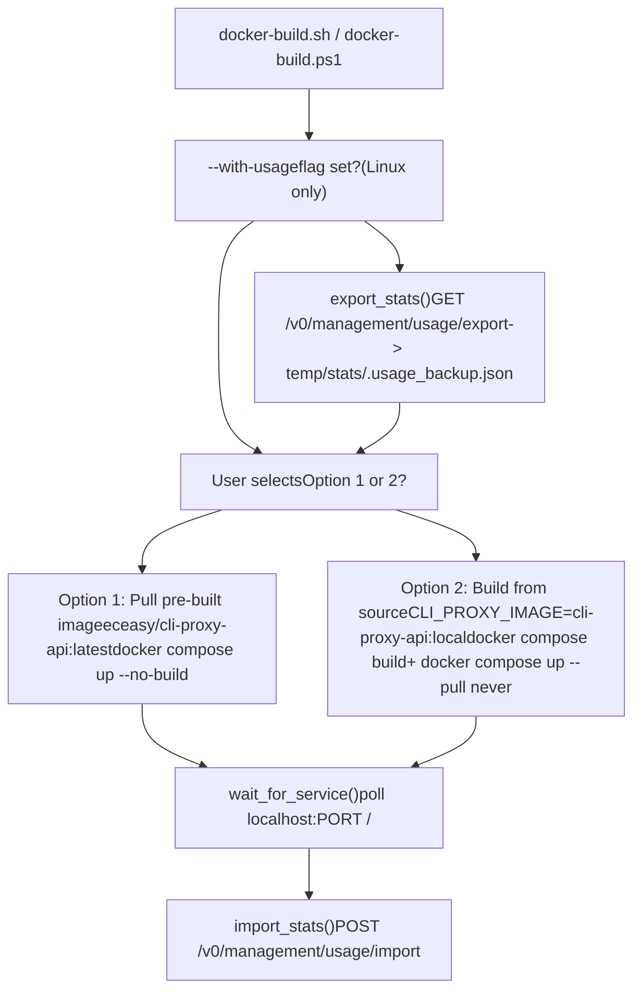

# 部署方案

相关源文件

-   [.dockerignore](https://github.com/router-for-me/CLIProxyAPI/blob/c66cb0af/.dockerignore)
-   [.gitignore](https://github.com/router-for-me/CLIProxyAPI/blob/c66cb0af/.gitignore)
-   [auths/.gitkeep](https://github.com/router-for-me/CLIProxyAPI/blob/c66cb0af/auths/.gitkeep)
-   [docker-build.ps1](https://github.com/router-for-me/CLIProxyAPI/blob/c66cb0af/docker-build.ps1)
-   [docker-build.sh](https://github.com/router-for-me/CLIProxyAPI/blob/c66cb0af/docker-build.sh)
-   [docker-compose.yml](https://github.com/router-for-me/CLIProxyAPI/blob/c66cb0af/docker-compose.yml)

本章节涵盖了在不同环境和不同规模下运行 CLIProxyAPI 的实践部署指南。它介绍了支持的部署模式、涉及的基础设施组件，并帮助您为您的场景选择正确的拓扑结构。

有关适用于所有部署的配置文件设置，请参阅[配置指南](/router-for-me/CLIProxyAPI/5-configuration-guide)。有关存储后端的具体信息，请参阅[存储后端选项](/router-for-me/CLIProxyAPI/5.2-storage-backend-options)。有关基于 Go SDK 的编程式部署，请参阅[使用 Go SDK](/router-for-me/CLIProxyAPI/9.1-using-the-go-sdk)。

---

## 部署模式

CLIProxyAPI 支持三种主要的部署拓扑：

| 部署模式 | 状态存储 | 实例数量 | 适用场景 |
| --- | --- | --- | --- |
| 单服务器 (Single-Server) | 本地文件系统 | 1 | 个人使用、小团队 |
| 云原生 (Cloud-Native) | 外部存储 (PostgreSQL, Git, 对象存储) | 1 | 云环境、托管基础设施 |
| 高可用 (High Availability) | 外部存储 (共享) | 多个 | 大团队、高请求量 |

拓扑结构的选择主要由两个因素驱动：**您需要运行多少个实例**，以及**身份验证凭证和使用情况统计存储在哪里**。当运行多个实例时，需要外部存储后端（PostgreSQL、Git、对象存储），因为身份验证令牌和配置必须对所有节点均可访问。

来源：[.gitignore16-19](https://github.com/router-for-me/CLIProxyAPI/blob/c66cb0af/.gitignore#L16-L19) [docker-compose.yml1-28](https://github.com/router-for-me/CLIProxyAPI/blob/c66cb0af/docker-compose.yml#L1-L28)

---

## 核心基础设施组件

无论采用何种拓扑结构，每个 CLIProxyAPI 部署都共享相同的内部组件。下图将概念组件映射到其具体的代码级表示。

**图表：CLIProxyAPI 部署组件映射**

来源：[docker-compose.yml24-27](https://github.com/router-for-me/CLIProxyAPI/blob/c66cb0af/docker-compose.yml#L24-L27) [.gitignore16-19](https://github.com/router-for-me/CLIProxyAPI/blob/c66cb0af/.gitignore#L16-L19)

---

## 暴露的端口

所有端口都在 `docker-compose.yml` 中声明并暴露在宿主机上。不同的 AI CLI 工具连接到不同的端口。

| 宿主机端口 | 容器端口 | 协议 / 用途 |
| --- | --- | --- |
| `8317` | `8317` | 主要 API 端口（默认，可通过 config.yaml 中的 `port` 配置） |
| `8085` | `8085` | Gemini CLI / AI Studio 兼容端点 |
| `1455` | `1455` | Claude API 端点 |
| `54545` | `54545` | Codex / OpenAI Responses 端点 |
| `51121` | `51121` | Amp CLI 控制平面代理 |
| `11451` | `11451` | 额外的供应商端点 |

来源：[docker-compose.yml17-23](https://github.com/router-for-me/CLIProxyAPI/blob/c66cb0af/docker-compose.yml#L17-L23)

---

## 卷挂载与路径覆盖

在运行 `docker compose` 之前，可以将三个目录挂载到容器中，并可以通过环境变量进行覆盖。

| 环境变量 | 默认值 | 容器内的挂载目标 |
| --- | --- | --- |
| `CLI_PROXY_CONFIG_PATH` | `./config.yaml` | `/CLIProxyAPI/config.yaml` |
| `CLI_PROXY_AUTH_PATH` | `./auths` | `/root/.cli-proxy-api` |
| `CLI_PROXY_LOG_PATH` | `./logs` | `/CLIProxyAPI/logs` |

`auths/` 目录（挂载到 `/root/.cli-proxy-api`）保存由 `auth.Manager` 管理的 OAuth 令牌文件和 API 密钥凭证文件。`config.yaml` 在启动时被读取，并由文件观察器监视更改（参见[热重载与配置更新](/router-for-me/CLIProxyAPI/3.7-hot-reload-and-configuration-updates)）。

`DEPLOY` 环境变量 [docker-compose.yml16](https://github.com/router-for-me/CLIProxyAPI/blob/c66cb0af/docker-compose.yml#L16-L16) 被传递到容器中，以便在使用云原生或高可用（HA）配置时选择部署配置文件。

来源：[docker-compose.yml24-27](https://github.com/router-for-me/CLIProxyAPI/blob/c66cb0af/docker-compose.yml#L24-L27) [.gitignore25-26](https://github.com/router-for-me/CLIProxyAPI/blob/c66cb0af/.gitignore#L25-L26)

---

## 构建与运行脚本

提供了两个构建脚本以简化部署周期。

**图表：docker-build.sh 和 docker-build.ps1 执行流**

`docker-build.sh` 上的 `--with-usage` 标志通过在重建之前将统计数据导出到 `temp/stats/.usage_backup.json`，并在新容器启动后通过管理 API 重新导入，从而在容器重建过程中保留使用情况统计信息。管理 API 密钥从 `temp/stats/.api_secret`（首次使用时创建）中读取。该机制仅在 `docker-build.sh` (Linux/macOS) 中可用；Windows 版 `docker-build.ps1` 不包含使用情况保留逻辑。

来源：[docker-build.sh1-180](https://github.com/router-for-me/CLIProxyAPI/blob/c66cb0af/docker-build.sh#L1-L180) [docker-build.ps11-53](https://github.com/router-for-me/CLIProxyAPI/blob/c66cb0af/docker-build.ps1#L1-L53)

---

## 部署方案对比

下图展示了三种部署场景在存储使用和服务拓扑方面的差异。

**图表：部署拓扑对比**

```mermaid
flowchart TD
    ha_lb["Load Balancer"]
    ha_p1["cli-proxy-apiInstance 1"]
    ha_p2["cli-proxy-apiInstance 2"]
    ha_shared["Shared External Storage(pgstore / gitstore / objectstore)"]
    cn_client["AI CLI Client"]
    cn_proxy["cli-proxy-api(Cloud Container)"]
    cn_ext["External Storage(pgstore / gitstore / objectstore)"]
    ss_client["AI CLI Client"]
    ss_proxy["cli-proxy-api(Docker Compose)"]
    ss_fs["Local auths/Local logs/"]

    ha --> lb_ha_p1
    ha --> lb_ha_p2
    ha --> p1_ha_shared
    ha --> p2_ha_shared
    cn --> client_cn_proxy
    cn --> proxy_cn_ext
    ss --> client_ss_proxy
    ss --> proxy_ss_fs
```

来源：[.gitignore16-19](https://github.com/router-for-me/CLIProxyAPI/blob/c66cb0af/.gitignore#L16-L19) [docker-compose.yml1-28](https://github.com/router-for-me/CLIProxyAPI/blob/c66cb0af/docker-compose.yml#L1-L28)

---

## 选择部署方案

根据您的需求，使用下表选择合适的子页面。

| 需求 | 推荐方案 |
| --- | --- |
| 个人使用或单个开发人员 | [单服务器部署](/router-for-me/CLIProxyAPI/10.1-single-server-deployment) |
| 在 AWS/GCP/Azure 中运行并使用托管数据库 | [云原生部署](/router-for-me/CLIProxyAPI/10.2-cloud-native-deployment) |
| 多个用户，需要高可用性 | [高可用与扩展](/router-for-me/CLIProxyAPI/10.3-high-availability-and-scaling) |
| 需要跨实例共享身份验证令牌 | [高可用与扩展](/router-for-me/CLIProxyAPI/10.3-high-availability-and-scaling) |
| 最简单的设置 | [单服务器部署](/router-for-me/CLIProxyAPI/10.1-single-server-deployment) |
| 使用 PostgreSQL 或对象存储 | [云原生部署](/router-for-me/CLIProxyAPI/10.2-cloud-native-deployment) 或 [HA](/router-for-me/CLIProxyAPI/10.3-high-availability-and-scaling) |

外部存储后端（在[存储后端选项](/router-for-me/CLIProxyAPI/5.2-storage-backend-options)中介绍）是云原生和高可用部署的关键促成因素。当在大型 Go 应用程序中嵌入 CLIProxyAPI 时，可以使用 `Builder` API（在[使用 Go SDK](/router-for-me/CLIProxyAPI/9.1-using-the-go-sdk) 中介绍）以编程方式配置部署，而无需 `config.yaml`。
