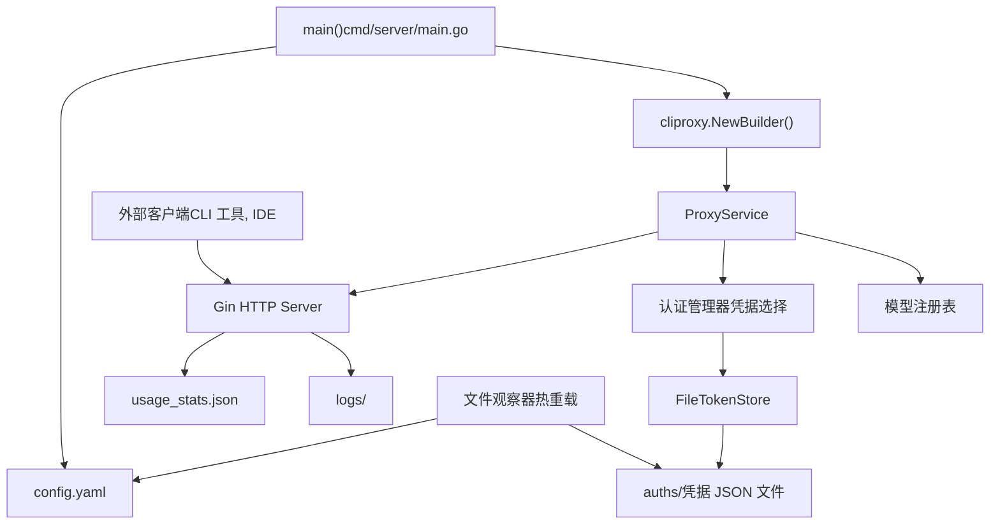
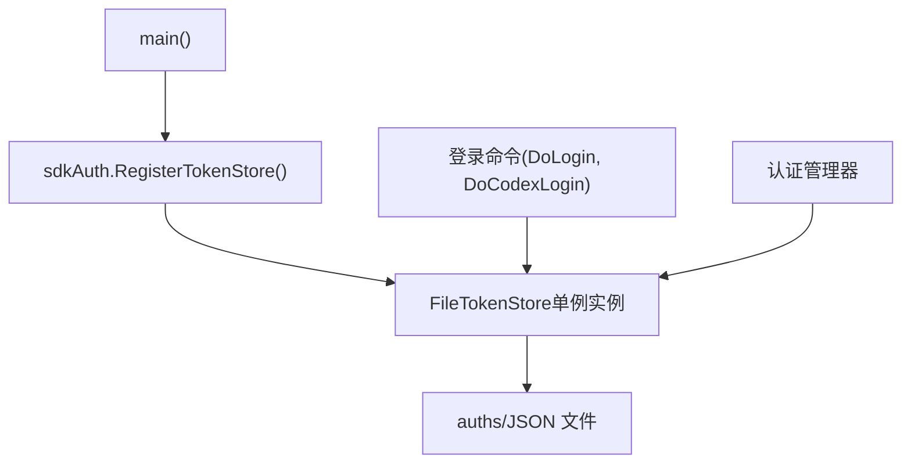
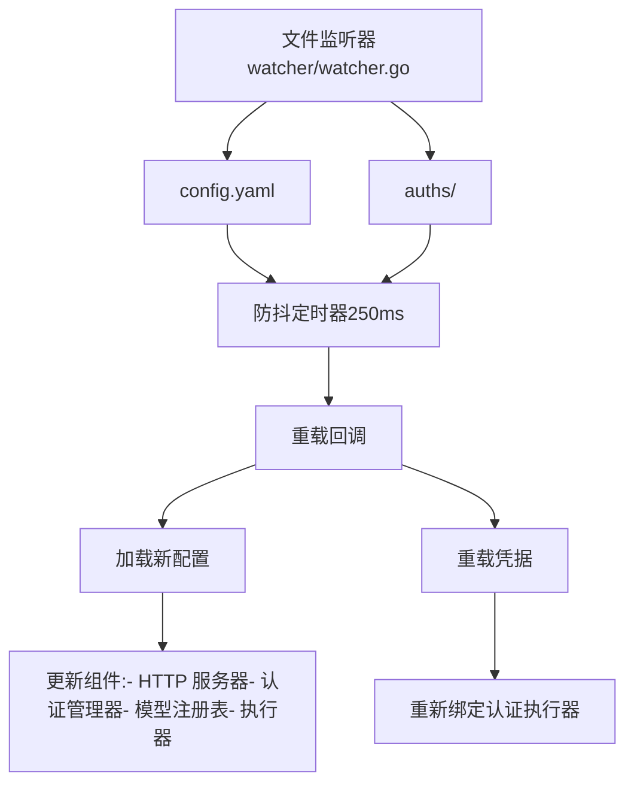

# 单服务器部署

相关源文件

-   [.dockerignore](https://github.com/router-for-me/CLIProxyAPI/blob/c66cb0af/.dockerignore)
-   [.gitignore](https://github.com/router-for-me/CLIProxyAPI/blob/c66cb0af/.gitignore)
-   [auths/.gitkeep](https://github.com/router-for-me/CLIProxyAPI/blob/c66cb0af/auths/.gitkeep)
-   [cmd/server/main.go](https://github.com/router-for-me/CLIProxyAPI/blob/c66cb0af/cmd/server/main.go)
-   [docker-build.ps1](https://github.com/router-for-me/CLIProxyAPI/blob/c66cb0af/docker-build.ps1)
-   [docker-build.sh](https://github.com/router-for-me/CLIProxyAPI/blob/c66cb0af/docker-build.sh)
-   [docker-compose.yml](https://github.com/router-for-me/CLIProxyAPI/blob/c66cb0af/docker-compose.yml)
-   [go.mod](https://github.com/router-for-me/CLIProxyAPI/blob/c66cb0af/go.mod)
-   [go.sum](https://github.com/router-for-me/CLIProxyAPI/blob/c66cb0af/go.sum)
-   [internal/api/handlers/management/logs.go](https://github.com/router-for-me/CLIProxyAPI/blob/c66cb0af/internal/api/handlers/management/logs.go)
-   [internal/managementasset/updater.go](https://github.com/router-for-me/CLIProxyAPI/blob/c66cb0af/internal/managementasset/updater.go)
-   [internal/store/gitstore.go](https://github.com/router-for-me/CLIProxyAPI/blob/c66cb0af/internal/store/gitstore.go)
-   [internal/store/postgresstore.go](https://github.com/router-for-me/CLIProxyAPI/blob/c66cb0af/internal/store/postgresstore.go)

## 用途与范围

本文档涵盖了如何使用 Docker Compose 和本地文件存储在单台服务器上部署 CLIProxyAPI。它详细介绍了 Docker Compose 配置、卷挂载路径、提供的构建脚本（`docker-build.sh` 和 `docker-build.ps1`），以及如何在容器重建后保留使用情况统计信息。

有关采用外部存储后端的云端部署，请参阅第 10.2 页。有关带有负载均衡的高可用配置，请参阅第 10.3 页。

## 部署架构

单服务器部署使用本地文件系统满足所有存储需求。服务器进程处理所有 HTTP 请求，管理本地文件中的凭据，并本地存储配置和使用情况统计信息。


**来源：** [cmd/server/main.go1-486](https://github.com/router-for-me/CLIProxyAPI/blob/c66cb0af/cmd/server/main.go#L1-L486) [internal/cmd/run.go1-71](https://github.com/router-for-me/CLIProxyAPI/blob/c66cb0af/internal/cmd/run.go#L1-L71)

## 文件系统布局

单服务器部署按以下结构组织文件：

| 路径 | 用途 | 创建者 |
| --- | --- | --- |
| `config.yaml` | 主配置文件 | 用户/初始化引导 |
| `config.example.yaml` | 配置模板 | 仓库 |
| `auths/` | 包含凭据 JSON 文件的目录 | OAuth 流程或手动创建 |
| `auths/*.json` | 单个凭据文件 (例如 `gemini_user@example.com.json`) | 登录命令 |
| `usage_stats.json` | 令牌使用情况跟踪 (可选) | 启用后的运行时 |
| `logs/` | 日志文件 (可选) | 配置了文件日志记录时的运行时 |
| `.env` | 环境变量 (可选) | 用户 |

工作目录在启动时确定，所有相对路径均由此解析。

**来源：** [cmd/server/main.go144-156](https://github.com/router-for-me/CLIProxyAPI/blob/c66cb0af/cmd/server/main.go#L144-L156) [cmd/server/main.go369-387](https://github.com/router-for-me/CLIProxyAPI/blob/c66cb0af/cmd/server/main.go#L369-L387)

## 前提条件

部署前，请确保满足以下要求：

### 系统要求

-   **操作系统**：Linux, macOS, 或 Windows
-   **Go 运行时**：Go 1.21+ (若从源码构建)
-   **网络**：具有访问 AI 供应商 API 的出站 HTTPS 权限
-   **端口**：一个可用的 TCP 端口 (默认 8080，可配置)

### 二进制安装

从发布页面下载适用于您平台的二进制文件，或从源码构建：

```
# 克隆仓库git clone https://github.com/router-for-me/CLIProxyAPI.gitcd CLIProxyAPI # 构建二进制文件go build -o cliproxyapi ./cmd/server
```
生成的 `cliproxyapi` 二进制文件是自包含的，可以移动到任何位置。

**来源：** [README.md59-61](https://github.com/router-for-me/CLIProxyAPI/blob/c66cb0af/README.md#L59-L61) [cmd/server/main.go1-4](https://github.com/router-for-me/CLIProxyAPI/blob/c66cb0af/cmd/server/main.go#L1-L4)

## 初始化序列

服务器在启动时遵循特定的初始化序列：

> **[Mermaid sequence]**
> *(图表结构无法解析)*

**来源：** [cmd/server/main.go53-486](https://github.com/router-for-me/CLIProxyAPI/blob/c66cb0af/cmd/server/main.go#L53-L486) [internal/cmd/run.go27-56](https://github.com/router-for-me/CLIProxyAPI/blob/c66cb0af/internal/cmd/run.go#L27-L56)

## 初始配置

### 创建配置文件

如果 `config.yaml` 不存在，请根据示例模板创建：

```
cp config.example.yaml config.yaml
```
编辑 `config.yaml` 设置基础服务器参数：

```
port: 8080                    # HTTP 端口host: "0.0.0.0"               # 绑定地址 (仅限本地访问请使用 127.0.0.1)auth_dir: "./auths"           # 凭据文件目录log_level: "info"             # 日志详细程度: debug, info, warn, errorusage_statistics_enabled: true # 跟踪令牌使用情况
```
服务器在启动时读取此配置。配置文件会被监控变更，并在无需重启的情况下自动重载。

### 环境变量

或者，通过在工作目录创建 `.env` 文件来使用环境变量：

```
# .env 文件PORT=8080HOST=0.0.0.0AUTH_DIR=./authsLOG_LEVEL=info
```
服务器启动时若存在 `.env` 文件会自动加载。

**来源：** [cmd/server/main.go150-155](https://github.com/router-for-me/CLIProxyAPI/blob/c66cb0af/cmd/server/main.go#L150-L155) [cmd/server/main.go369-387](https://github.com/router-for-me/CLIProxyAPI/blob/c66cb0af/cmd/server/main.go#L369-L387)

### 配置加载优先级

配置系统遵循以下优先级：

1.  命令行标志 (`--config`)
2.  Postgres 存储 (若设置了 `PGSTORE_DSN` 环境变量)
3.  对象存储 (若设置了 `OBJECTSTORE_ENDPOINT` 环境变量)
4.  Git 存储 (若设置了 `GITSTORE_GIT_URL` 环境变量)
5.  本地文件 (工作目录下的 `config.yaml`)

对于单服务器部署，请使用选项 5 (本地文件)。

**来源：** [cmd/server/main.go168-380](https://github.com/router-for-me/CLIProxyAPI/blob/c66cb0af/cmd/server/main.go#L168-L380)

## 启动服务

### 基础启动

使用默认设置启动服务器：

```
./cliproxyapi
```
服务器将会：

1.  从当前目录加载 `config.yaml`
2.  初始化指向 `./auths` 的 FileTokenStore
3.  在配置的端口启动 HTTP 服务器
4.  开始监听配置变更

预期输出：

```
CLIProxyAPI Version: <版本>, Commit: <提交哈希>, BuiltAt: <日期>
INFO[0000] CLIProxyAPI Version: <版本>, Commit: <提交哈希>, BuiltAt: <日期>
INFO[0000] Listening on 0.0.0.0:8080
```
### 指定自定义配置启动

指定自定义配置文件的位置：

```
./cliproxyapi --config /path/to/config.yaml
```
`--config` 标志会覆盖默认的配置路径。

### 云部署模式 (Cloud Deploy Mode)

若环境变量 `DEPLOY=cloud` 已设置且不存在有效配置，服务器将进入待命模式：

```
export DEPLOY=cloud./cliproxyapi
```
输出：

```
INFO[0000] Cloud deploy mode: No config found; standing by for configuration. API server is not started. Press Ctrl+C to exit.
```
在此模式下，服务器等待通过管理 API 提供有效配置后才启动 HTTP 服务。这对于在启动后注入配置的容器化部署非常有用。

**来源：** [cmd/server/main.go219-223](https://github.com/router-for-me/CLIProxyAPI/blob/c66cb0af/cmd/server/main.go#L219-L223) [cmd/server/main.go389-408](https://github.com/router-for-me/CLIProxyAPI/blob/c66cb0af/cmd/server/main.go#L389-L408) [internal/cmd/run.go58-70](https://github.com/router-for-me/CLIProxyAPI/blob/c66cb0af/internal/cmd/run.go#L58-L70)

## 身份验证设置

启动服务器后，为 AI 供应商配置身份验证。单服务器部署使用 FileTokenStore，它将凭据以 JSON 文件形式保存到 `auth_dir` 中。

### 文件令牌存储注册

FileTokenStore 在初始化期间被注册为全局令牌存储：


**来源：** [cmd/server/main.go437-445](https://github.com/router-for-me/CLIProxyAPI/blob/c66cb0af/cmd/server/main.go#L437-L445)

### 供应商身份验证流程

每个供应商都有专用的登录命令来执行 OAuth 流程，并将凭据保存到 FileTokenStore：

> **[Mermaid sequence]**
> *(图表结构无法解析)*

**来源：** [internal/cmd/login.go51-183](https://github.com/router-for-me/CLIProxyAPI/blob/c66cb0af/internal/cmd/login.go#L51-L183) [cmd/server/main.go450-475](https://github.com/router-for-me/CLIProxyAPI/blob/c66cb0af/cmd/server/main.go#L450-L475)

### 供应商专用登录命令

| 供应商 | 命令 | 输出文件模式 |
| --- | --- | --- |
| Google Gemini | `--login` | `gemini_<email>_<project_id>.json` |
| OpenAI Codex | `--codex-login` | `codex_<email>.json` |
| Claude | `--claude-login` | `claude_<email>.json` |
| Qwen | `--qwen-login` | `qwen_<email>.json` |
| iFlow | `--iflow-login` | `iflow_<email>.json` |
| Antigravity | `--antigravity-login` | `antigravity_<email>.json` |
| Kimi | `--kimi-login` | `kimi_<email>.json` |

### 示例：Google Gemini 登录

```
# 带有项目选择的交互式登录./cliproxyapi --login # 使用特定项目 ID 登录./cliproxyapi --login --project_id my-project-123 # 不打开浏览器的登录 (显示 URL 以便手动打开)./cliproxyapi --login --no-browser
```
登录过程：

1.  打开浏览器访问 Google OAuth 同意页面
2.  提示从可用的 GCP 项目中选择项目
3.  为选定的项目执行 Gemini CLI 入职 (onboarding)
4.  将凭据保存到 `auths/gemini_user@example.com_my-project-123.json`

**来源：** [internal/cmd/login.go51-183](https://github.com/router-for-me/CLIProxyAPI/blob/c66cb0af/internal/cmd/login.go#L51-L183) [cmd/server/main.go455-457](https://github.com/router-for-me/CLIProxyAPI/blob/c66cb0af/cmd/server/main.go#L455-L457)

### Vertex AI 服务账号导入

对于 Vertex AI，导入服务账号密钥而非使用 OAuth：

```
./cliproxyapi --vertex-import /path/to/service-account-key.json
```
此命令将服务账号 JSON 拷贝到 `auths/` 目录，并采用合适的命名约定。

**来源：** [cmd/server/main.go452-454](https://github.com/router-for-me/CLIProxyAPI/blob/c66cb0af/cmd/server/main.go#L452-L454)

### 多账号

要为同一供应商添加多个账号，请多次运行登录命令。每个账号都会保存为一个独立的 JSON 文件。认证管理器将根据配置的策略（轮询或优先填满）在不同账号间分配请求。

具有多个 Gemini 账号的示例：

```
auths/
├── gemini_user1@example.com_project-a.json
├── gemini_user2@example.com_project-b.json
└── gemini_user3@example.com_project-c.json
```
**来源：** [README.md47-56](https://github.com/router-for-me/CLIProxyAPI/blob/c66cb0af/README.md#L47-L56)

## 运行时文件监听与热重载

单服务器部署包含一个文件监听器，用于监控以下变更：


对 `config.yaml` 或 `auths/` 目录下文件的更改会被自动检测并应用，无需重启服务器。防抖定时器可防止在快速连续更改（例如原子文件写入）期间进行过多的重载。

**来源：** 基于系统架构图，图表 4 "配置管理与热重载系统"

## 服务验证

### 健康检查

验证服务器是否正在运行：

```
curl http://localhost:8080/v1/models
```
预期响应：

```
{  "object": "list",  "data": [...]}
```
此端点列出基于已注册凭据的所有可用模型。

### 检查已注册模型

如果 `auths/` 目录中存在身份验证文件，模型端点将列出可用模型。如果目录为空，则仅显示静态定义的模型，但 API 调用将因缺少有效凭据而失败。

### 测试 API 请求

发送一个测试补全请求：

```
curl http://localhost:8080/v1/chat/completions \  -H "Content-Type: application/json" \  -d '{    "model": "gemini-2.0-flash-exp",    "messages": [{"role": "user", "content": "Hello"}]  }'
```
成功的响应表明系统已完全投入运行。

## 服务管理

### 优雅停机

服务器处理 `SIGINT` 和 `SIGTERM` 信号以实现优雅停机：

```
# 发送中断信号 (在终端按 Ctrl+C)kill -INT <pid> # 或发送终止信号kill -TERM <pid>
```
停机过程：

1.  停止接受新的 HTTP 连接
2.  等待正在进行的请求完成
3.  关闭所有持久连接
4.  干净地退出

**来源：** [internal/cmd/run.go33-34](https://github.com/router-for-me/CLIProxyAPI/blob/c66cb0af/internal/cmd/run.go#L33-L34)

### 查看日志

默认情况下，日志写入 `stdout`。在 `config.yaml` 中配置基于文件的日志记录：

```
log_output: "./logs/cliproxyapi.log"
```
日志级别：`debug`, `info`, `warn`, `error`

### 使用情况统计

若配置中 `usage_statistics_enabled: true`，令牌使用情况将在 `usage_stats.json` 中被跟踪。此文件随着请求处理而实时更新。

查看使用数据：

```
cat usage_stats.json
```
或使用管理 API 端点：

```
curl http://localhost:8080/v0/management/usage-stats/export
```
**来源：** [cmd/server/main.go409-410](https://github.com/router-for-me/CLIProxyAPI/blob/c66cb0af/cmd/server/main.go#L409-L410)

## 目录权限

确保进程具有适当的文件系统权限：

| 路径 | 所需权限 | 用途 |
| --- | --- | --- |
| `config.yaml` | 读/写 | 配置加载与更新 |
| `auths/` | 读/写 | 凭据存储与更新 |
| `usage_stats.json` | 读/写 | 使用情况跟踪 (若启用) |
| `logs/` | 写 | 日志文件输出 (若配置) |
| 工作目录 | 读/写 | 常规操作 |

服务器在调用用户的权限下运行。除非必要，请避免以 root 身份运行。

## 故障排除

### 配置未加载

**现象**：服务器已启动，但对 config.yaml 的更改未体现。

**解决**：验证配置文件路径：

```
./cliproxyapi --config $(pwd)/config.yaml
```
检查日志（debug 级别）确认文件监听器是否已激活。

### 找不到身份验证文件

**现象**：尽管运行了登录命令，但 API 请求返回身份验证错误。

**解决**：验证 `config.yaml` 中的 `auth_dir` 是否与登录命令保存文件的位置一致：

```
ls -la ./auths/
```
确保路径是绝对路径，或者相对于工作目录的正确相对路径。

### 端口已被占用

**现象**：启动时提示 `bind: address already in use` 错误。

**解决**：在 `config.yaml` 中更改端口：

```
port: 8081
```
或者识别并停止冲突的进程：

```
lsof -i :8080
```
## 局限性

单服务器部署具有以下局限性：

1.  **单点故障**：若服务器进程崩溃或主机不可用，服务将完全中断。
2.  **可扩展性**：所有请求由一个进程处理，限制了吞吐量。
3.  **文件系统依赖**：配置和凭据存储在本地，使得迁移到另一台主机需要手动传输文件。
4.  **无内置备份**：身份验证令牌和配置必须手动备份。
5.  **本地管理访问**：出于安全考虑，管理 API 端点默认限制为仅限本地主机访问。

对于需要高可用性的生产部署，请考虑[高可用与扩展](/router-for-me/CLIProxyAPI/10.3-high-availability-and-scaling)。

## 后续步骤

-   在 `config.yaml` 中配置供应商特定设置 (见[配置文件结构](/router-for-me/CLIProxyAPI/5.1-configuration-file-structure))
-   设置有效负载操作规则 (见[有效负载配置规则](/router-for-me/CLIProxyAPI/5.4-payload-configuration-rules))
-   配置模型映射与排除 (见[模型映射与排除](/router-for-me/CLIProxyAPI/8.2-model-mapping-and-exclusion))
-   启用请求日志进行调试 (见[请求与响应日志](/router-for-me/CLIProxyAPI/8.4-request-and-response-logging))
-   探索管理 API (见[管理 API](/router-for-me/CLIProxyAPI/4.4-management-api))

**来源：** [README.md1-170](https://github.com/router-for-me/CLIProxyAPI/blob/c66cb0af/README.md#L1-L170) [cmd/server/main.go1-486](https://github.com/router-for-me/CLIProxyAPI/blob/c66cb0af/cmd/server/main.go#L1-L486) [internal/cmd/run.go1-71](https://github.com/router-for-me/CLIProxyAPI/blob/c66cb0af/internal/cmd/run.go#L1-L71)
