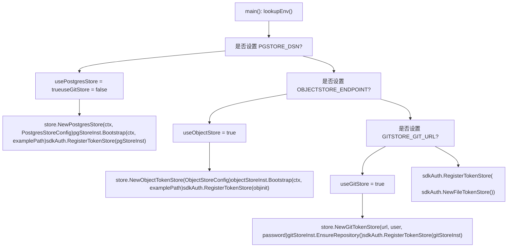

# 云原生部署

相关源文件

-   [.dockerignore](https://github.com/router-for-me/CLIProxyAPI/blob/c66cb0af/.dockerignore)
-   [.env.example](https://github.com/router-for-me/CLIProxyAPI/blob/c66cb0af/.env.example)
-   [.gitignore](https://github.com/router-for-me/CLIProxyAPI/blob/c66cb0af/.gitignore)
-   [auths/.gitkeep](https://github.com/router-for-me/CLIProxyAPI/blob/c66cb0af/auths/.gitkeep)
-   [cmd/server/main.go](https://github.com/router-for-me/CLIProxyAPI/blob/c66cb0af/cmd/server/main.go)
-   [docker-build.ps1](https://github.com/router-for-me/CLIProxyAPI/blob/c66cb0af/docker-build.ps1)
-   [docker-build.sh](https://github.com/router-for-me/CLIProxyAPI/blob/c66cb0af/docker-build.sh)
-   [docker-compose.yml](https://github.com/router-for-me/CLIProxyAPI/blob/c66cb0af/docker-compose.yml)
-   [go.mod](https://github.com/router-for-me/CLIProxyAPI/blob/c66cb0af/go.mod)
-   [go.sum](https://github.com/router-for-me/CLIProxyAPI/blob/c66cb0af/go.sum)
-   [internal/api/handlers/management/logs.go](https://github.com/router-for-me/CLIProxyAPI/blob/c66cb0af/internal/api/handlers/management/logs.go)
-   [internal/managementasset/updater.go](https://github.com/router-for-me/CLIProxyAPI/blob/c66cb0af/internal/managementasset/updater.go)
-   [internal/store/gitstore.go](https://github.com/router-for-me/CLIProxyAPI/blob/c66cb0af/internal/store/gitstore.go)
-   [internal/store/objectstore.go](https://github.com/router-for-me/CLIProxyAPI/blob/c66cb0af/internal/store/objectstore.go)
-   [internal/store/postgresstore.go](https://github.com/router-for-me/CLIProxyAPI/blob/c66cb0af/internal/store/postgresstore.go)

## 用途与范围

本页面介绍了在需要外部化、持久化状态的云环境中部署 CLIProxyAPI 的方法。它详细说明了 `DEPLOY=cloud` 启动模式、三种外部存储后端（PostgreSQL、Git 仓库和 S3 兼容的对象存储），以及如何通过环境变量配置这些后端。

有关单服务器 Docker Compose 设置，请参阅[单服务器部署](/zh/10-deployment-scenarios/10.1-single-server-deployment.md)。有关运行共享状态的多个 CLIProxyAPI 实例，请参阅[高可用与扩展](/zh/10-deployment-scenarios/10.3-high-availability-and-scaling.md)。有关所有存储后端选项及其权衡的参考，请参阅[存储后端选项](/zh/5-configuration-guide/5.2-storage-backend-options.md)。

---

## 云部署模式 (Cloud Deploy Mode)

在环境中设置 `DEPLOY=cloud` 会改变启动行为。激活此模式且未找到有效的 `config.yaml`（本地或通过配置的远程存储均未找到）时，服务器不会退出。相反，它会调用 `cmd.WaitForCloudDeploy()` 并阻塞，直到接收到 OS 停机信号。这使得容器在操作员通过管理 API 提供配置时保持存活。

**云部署模式启动流**

**来源：** [cmd/server/main.go228-416](https://github.com/router-for-me/CLIProxyAPI/blob/c66cb0af/cmd/server/main.go#L228-L416) [cmd/server/main.go486-570](https://github.com/router-for-me/CLIProxyAPI/blob/c66cb0af/cmd/server/main.go#L486-L570)

在以下情况下，有效性检查会认为配置文件缺失：

-   磁盘上不存在该文件路径
-   路径指向一个目录
-   文件存在但 `cfg.Port == 0`（文件为空或无法解析）

---

## 存储后端选择

运行时仅有一个令牌存储处于活动状态。`main()` 中的启动代码按固定优先级顺序检查环境变量，并使用 `sdkAuth.RegisterTokenStore()` 注册所选存储。设置 `PGSTORE_DSN` 还会显式设置 `useGitStore = false`，从而在同时设置了 `GITSTORE_GIT_URL` 的情况下禁用 Git。

**存储后端选择 —— 代码级视图**


**来源：** [cmd/server/main.go176-453](https://github.com/router-for-me/CLIProxyAPI/blob/c66cb0af/cmd/server/main.go#L176-L453)

| 优先级 | 激活变量 | 类型 |
| --- | --- | --- |
| 1 (最高) | `PGSTORE_DSN` | `*store.PostgresStore` |
| 2 | `OBJECTSTORE_ENDPOINT` | `*store.ObjectTokenStore` |
| 3 | `GITSTORE_GIT_URL` | `*store.GitTokenStore` |
| 4 (默认) | *(无)* | `sdkAuth.FileTokenStore` |

---

## PostgreSQL 后端

`internal/store/postgresstore.go` 中的 `PostgresStore` 在两个数据库表中存储配置 YAML 和认证令牌，同时将所有内容镜像到本地缓冲 (spool) 目录，以便应用程序的其余部分可以使用标准的基于文件的流程。

### 环境变量

| 变量 | 别名 | 是否必填 | 描述 |
| --- | --- | --- | --- |
| `PGSTORE_DSN` | `pgstore_dsn` | 是 | PostgreSQL 连接字符串 |
| `PGSTORE_SCHEMA` | `pgstore_schema` | 否 | 数据库架构 (默认为 `public`) |
| `PGSTORE_LOCAL_PATH` | `pgstore_local_path` | 否 | 本地缓冲根目录 (默认为工作目录) |

### 数据库架构

`Bootstrap()` 调用 `EnsureSchema()`，后者创建以下表（使用 `CREATE TABLE IF NOT EXISTS`）：

| 表常量 | 默认名称 | 主键 | 数据列 |
| --- | --- | --- | --- |
| `defaultConfigTable` | `config_store` | `id TEXT` | `content TEXT` |
| `defaultAuthTable` | `auth_store` | `id TEXT` | `content JSONB` |

两个表均包含 `created_at TIMESTAMPTZ` 和 `updated_at TIMESTAMPTZ`。更新操作 (Upserts) 使用 `ON CONFLICT (id) DO UPDATE SET content = EXCLUDED.content`。

**来源：** [internal/store/postgresstore.go22-144](https://github.com/router-for-me/CLIProxyAPI/blob/c66cb0af/internal/store/postgresstore.go#L22-L144)

### 初始化序列

**`PostgresStore` 引导 (Bootstrap) 序列**

**来源：** [internal/store/postgresstore.go49-158](https://github.com/router-for-me/CLIProxyAPI/blob/c66cb0af/internal/store/postgresstore.go#L49-L158) [internal/store/postgresstore.go394-476](https://github.com/router-for-me/CLIProxyAPI/blob/c66cb0af/internal/store/postgresstore.go#L394-L476)

### 本地缓冲布局

```
{PGSTORE_LOCAL_PATH}/pgstore/
├── config/
│   └── config.yaml          ← 从 config_store 表镜像
└── auths/
    └── *.json               ← 从 auth_store 表镜像
```
---

## Git 后端

`internal/store/gitstore.go` 中的 `GitTokenStore` 使用远程 Git 仓库来持久化配置和认证文件。每次保存令牌时，该文件都会被提交并推送到远程仓库。

### 环境变量

| 变量 | 别名 | 是否必填 | 描述 |
| --- | --- | --- | --- |
| `GITSTORE_GIT_URL` | `gitstore_git_url` | 是 | 远程仓库 URL |
| `GITSTORE_GIT_USERNAME` | `gitstore_git_username` | 否 | Git 用户名 |
| `GITSTORE_GIT_TOKEN` | `gitstore_git_token` | 否 | 个人访问令牌或密码 |
| `GITSTORE_LOCAL_PATH` | `gitstore_local_path` | 否 | 本地克隆根目录 (默认为工作目录) |

> **注意**：如果 `GITSTORE_GIT_URL` 引用的是 GitHub 仓库，则 `GITSTORE_GIT_TOKEN` 也会在从 `github.com` 获取管理面板资源时用作 GitHub API 的 Bearer 令牌。

**来源：** [internal/managementasset/updater.go336-339](https://github.com/router-for-me/CLIProxyAPI/blob/c66cb0af/internal/managementasset/updater.go#L336-L339)

### 仓库布局

```
{GITSTORE_LOCAL_PATH}/gitstore/
├── .git/
├── auths/           ← 认证 JSON 文件 (cfg.AuthDir)
│   ├── .gitkeep
│   └── *.json
└── config/          ← 配置
    ├── .gitkeep
    └── config.yaml
```
### 初始化

`EnsureRepository()` 执行以下逻辑：

1.  若 `.git/` 不存在：通过 `git.PlainClone()` 克隆。如果远程仓库为空 (`transport.ErrEmptyRemoteRepository`)，则初始化一个全新的仓库，创建 `auths/` 和 `config/` 目录，并推送初始提交。
2.  若 `.git/` 存在：打开仓库并运行 `git pull`。非致命的拉取错误（已是最新、未暂存的更改、非快进合并）将被静默忽略。

每次调用 `Save()` 都会以 `commitAndPushLocked()` 结束，每次凭据更新产生一次提交。`PersistAuthFiles()` 和 `PersistConfig()` 遵循相同的模式。

**来源：** [internal/store/gitstore.go92-213](https://github.com/router-for-me/CLIProxyAPI/blob/c66cb0af/internal/store/gitstore.go#L92-L213) [internal/store/gitstore.go215-399](https://github.com/router-for-me/CLIProxyAPI/blob/c66cb0af/internal/store/gitstore.go#L215-L399)

---

## 对象存储后端

`internal/store/objectstore.go` 中的 `ObjectTokenStore` 通过 `minio-go/v7` 客户端使用任何 S3 兼容的服务。配置和认证令牌作为对象存储在单个存储桶 (bucket) 中。

### 环境变量

| 变量 | 别名 | 是否必填 | 描述 |
| --- | --- | --- | --- |
| `OBJECTSTORE_ENDPOINT` | `objectstore_endpoint` | 是 | S3 端点 URL |
| `OBJECTSTORE_ACCESS_KEY` | `objectstore_access_key` | 是 | 访问密钥 ID |
| `OBJECTSTORE_SECRET_KEY` | `objectstore_secret_key` | 是 | 私有访问密钥 |
| `OBJECTSTORE_BUCKET` | `objectstore_bucket` | 是 | 存储桶名称 |
| `OBJECTSTORE_LOCAL_PATH` | `objectstore_local_path` | 否 | 本地镜像根目录 (默认为工作目录) |

端点接受 `http://` 或 `https://` 协议前缀；协议决定是否启用 SSL。若未提供协议，默认启用 SSL。始终使用路径风格的存储桶访问 (`BucketLookupPath`)。

**来源：** [cmd/server/main.go275-303](https://github.com/router-for-me/CLIProxyAPI/blob/c66cb0af/cmd/server/main.go#L275-L303) [internal/store/objectstore.go95-110](https://github.com/router-for-me/CLIProxyAPI/blob/c66cb0af/internal/store/objectstore.go#L95-L110)

### 存储桶布局

| 对象键 | 内容 |
| --- | --- |
| `config/config.yaml` | 配置 YAML |
| `auths/{relative}.json` | 认证令牌 JSON 文件 |

### 初始化序列

**`ObjectTokenStore` 引导 (Bootstrap) 序列**

> **[Mermaid sequence]**
> *(图表结构无法解析)*

**来源：** [internal/store/objectstore.go55-156](https://github.com/router-for-me/CLIProxyAPI/blob/c66cb0af/internal/store/objectstore.go#L55-L156) [internal/store/objectstore.go327-438](https://github.com/router-for-me/CLIProxyAPI/blob/c66cb0af/internal/store/objectstore.go#L327-L438)

> 认证同步过程中刻意避免对本地镜像目录执行 `os.RemoveAll()`。清空目录会触发文件观察器的删除事件，从而导致删除操作传播回远程存储桶（这是一种竞态条件）。

**来源：** [internal/store/objectstore.go388-395](https://github.com/router-for-me/CLIProxyAPI/blob/c66cb0af/internal/store/objectstore.go#L388-L395)

---

## 环境变量参考

所有变量都可以在工作目录下的 `.env` 文件中定义（通过 `godotenv.Load()` 加载），或者作为容器环境变量。仓库提供了 `.env.example` 作为带注释的模板。

| 变量 | 激活功能 | 备注 |
| --- | --- | --- |
| `DEPLOY` | 云部署模式 | 必须为 `cloud` |
| `PGSTORE_DSN` | PostgreSQL 后端 | 同时禁用 Git 后端 |
| `PGSTORE_SCHEMA` | PostgreSQL 后端 | 可选 |
| `PGSTORE_LOCAL_PATH` | PostgreSQL 后端 | 可选 |
| `GITSTORE_GIT_URL` | Git 后端 |  |
| `GITSTORE_GIT_USERNAME` | Git 后端 | 可选 |
| `GITSTORE_GIT_TOKEN` | Git 后端 | 同时也用于管理面板资源更新程序的 GitHub API 认证 |
| `GITSTORE_LOCAL_PATH` | Git 后端 | 可选 |
| `OBJECTSTORE_ENDPOINT` | 对象存储 | 接受 `http://` 或 `https://` 前缀 |
| `OBJECTSTORE_ACCESS_KEY` | 对象存储 |  |
| `OBJECTSTORE_SECRET_KEY` | 对象存储 |  |
| `OBJECTSTORE_BUCKET` | 对象存储 |  |
| `OBJECTSTORE_LOCAL_PATH` | 对象存储 | 可选 |
| `MANAGEMENT_STATIC_PATH` | 管理面板 | 覆盖默认的静态资源位置 |

**来源：** [cmd/server/main.go176-232](https://github.com/router-for-me/CLIProxyAPI/blob/c66cb0af/cmd/server/main.go#L176-L232) [.env.example1-35](https://github.com/router-for-me/CLIProxyAPI/blob/c66cb0af/.env.example#L1-L35)

---

## 本地缓冲目录

每个远程后端在磁盘上维护一个本地镜像。应用程序内部基于文件的机制（文件观察器、认证管理器、配置重载）针对这些镜像路径操作，而无需了解远程后端。

| 后端 | 缓冲根目录 | 配置文件 | 认证目录 |
| --- | --- | --- | --- |
| PostgreSQL | `{PGSTORE_LOCAL_PATH}/pgstore/` | `pgstore/config/config.yaml` | `pgstore/auths/` |
| Git | `{GITSTORE_LOCAL_PATH}/gitstore/` | `gitstore/config/config.yaml` | `gitstore/auths/` |
| 对象存储 | `{OBJECTSTORE_LOCAL_PATH}/objectstore/` | `objectstore/config/config.yaml` | `objectstore/auths/` |

如果未设置 `*_LOCAL_PATH` 变量，则回退到 `util.WritablePath()` 返回的路径；若该路径也无法获取，则回退到当前工作目录。

**来源：** [cmd/server/main.go180-225](https://github.com/router-for-me/CLIProxyAPI/blob/c66cb0af/cmd/server/main.go#L180-L225) [internal/store/postgresstore.go62-100](https://github.com/router-for-me/CLIProxyAPI/blob/c66cb0af/internal/store/postgresstore.go#L62-L100) [internal/store/objectstore.go75-119](https://github.com/router-for-me/CLIProxyAPI/blob/c66cb0af/internal/store/objectstore.go#L75-L119)

---

## Docker Compose 配置

默认的 `docker-compose.yml` 从宿主环境传递 `DEPLOY` 变量。对于云部署，请在 `environment` 块中添加后端环境变量，或者取消注释并使用 `env_file` 指令：

```
services:  cli-proxy-api:    environment:      DEPLOY: ${DEPLOY:-}    # env_file:    #   - .env
```
配置远程存储后端后，不需要为 `config.yaml` 和 `auths/` 挂载卷 —— 后端会在内部提供这些路径。日志卷挂载仍然有用。

**来源：** [docker-compose.yml1-28](https://github.com/router-for-me/CLIProxyAPI/blob/c66cb0af/docker-compose.yml#L1-L28)

---

## 管理面板资源

`managementasset.StartAutoUpdater()` 运行一个后台 goroutine，启动时下载 `management.html` 并每 3 小时检查一次更新。在云环境中，资源默认写入 `{writable_path}/static/management.html`。设置 `MANAGEMENT_STATIC_PATH` 可覆盖此位置（可指向文件或其父目录）。

**来源：** [internal/managementasset/updater.go57-107](https://github.com/router-for-me/CLIProxyAPI/blob/c66cb0af/internal/managementasset/updater.go#L57-L107) [internal/managementasset/updater.go128-173](https://github.com/router-for-me/CLIProxyAPI/blob/c66cb0af/internal/managementasset/updater.go#L128-L173)

---

## 多实例部署

当多个 CLIProxyAPI 实例指向同一个 PostgreSQL 数据库或同一个对象存储桶时，它们会共享配置和认证令牌状态。这实现了水平扩展。有关负载均衡、副本协调以及用于程序化部署的 `Builder` SDK API 的指导，请参阅[高可用与扩展](/zh/10-deployment-scenarios/10.3-high-availability-and-scaling.md)。
