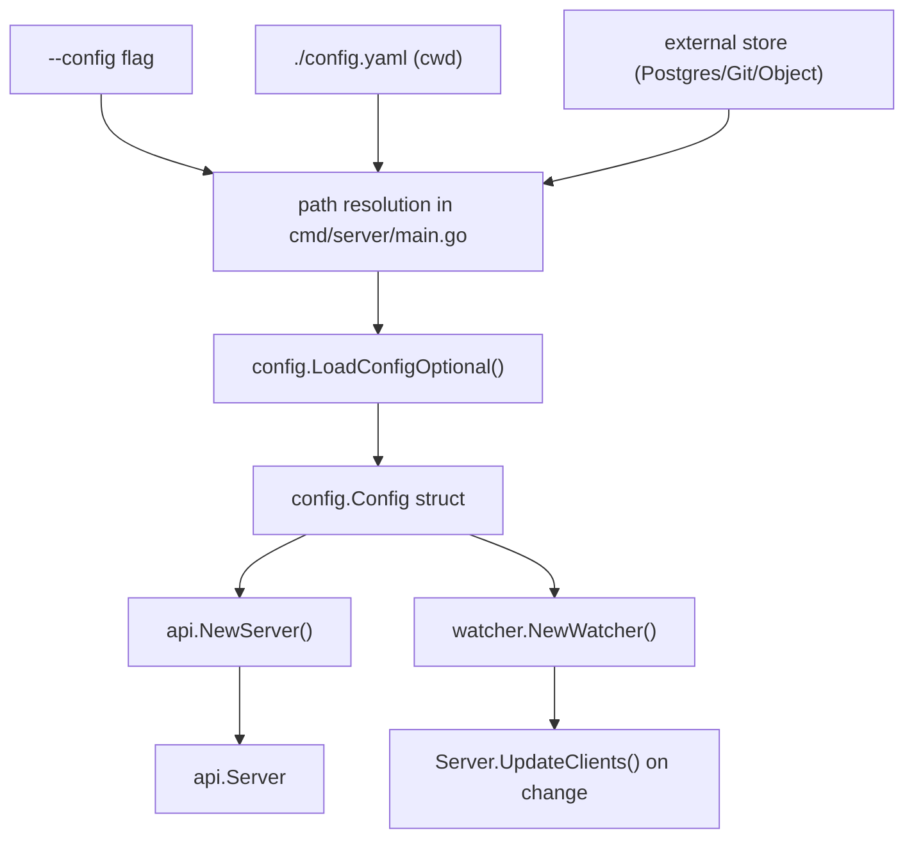
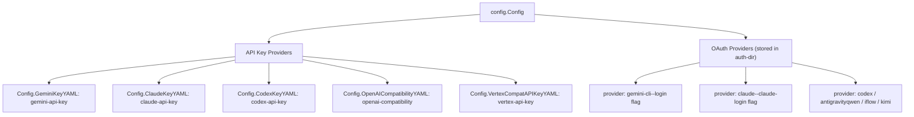

# 初始配置

相关源文件

-   [cmd/server/main.go](https://github.com/router-for-me/CLIProxyAPI/blob/c66cb0af/cmd/server/main.go)
-   [config.example.yaml](https://github.com/router-for-me/CLIProxyAPI/blob/c66cb0af/config.example.yaml)
-   [go.mod](https://github.com/router-for-me/CLIProxyAPI/blob/c66cb0af/go.mod)
-   [go.sum](https://github.com/router-for-me/CLIProxyAPI/blob/c66cb0af/go.sum)
-   [internal/api/handlers/management/config\_basic.go](https://github.com/router-for-me/CLIProxyAPI/blob/c66cb0af/internal/api/handlers/management/config_basic.go)
-   [internal/api/handlers/management/config\_lists.go](https://github.com/router-for-me/CLIProxyAPI/blob/c66cb0af/internal/api/handlers/management/config_lists.go)
-   [internal/api/handlers/management/logs.go](https://github.com/router-for-me/CLIProxyAPI/blob/c66cb0af/internal/api/handlers/management/logs.go)
-   [internal/api/server.go](https://github.com/router-for-me/CLIProxyAPI/blob/c66cb0af/internal/api/server.go)
-   [internal/config/config.go](https://github.com/router-for-me/CLIProxyAPI/blob/c66cb0af/internal/config/config.go)
-   [internal/managementasset/updater.go](https://github.com/router-for-me/CLIProxyAPI/blob/c66cb0af/internal/managementasset/updater.go)
-   [internal/store/gitstore.go](https://github.com/router-for-me/CLIProxyAPI/blob/c66cb0af/internal/store/gitstore.go)
-   [internal/store/postgresstore.go](https://github.com/router-for-me/CLIProxyAPI/blob/c66cb0af/internal/store/postgresstore.go)
-   [internal/watcher/watcher.go](https://github.com/router-for-me/CLIProxyAPI/blob/c66cb0af/internal/watcher/watcher.go)
-   [sdk/cliproxy/service.go](https://github.com/router-for-me/CLIProxyAPI/blob/c66cb0af/sdk/cliproxy/service.go)
-   [test/amp\_management\_test.go](https://github.com/router-for-me/CLIProxyAPI/blob/c66cb0af/test/amp_management_test.go)

本页面介绍了在 `config.yaml` 中使 CLIProxyAPI 开始接受请求所需的最小设置。它涵盖了配置文件的位置、服务器绑定、身份验证令牌目录、客户端访问控制以及至少连接一个 AI 供应商。

有关每个字段的完整参考，请参阅[配置文件结构](/router-for-me/CLIProxyAPI/5.1-configuration-file-structure)。有关特定部署的设置（Docker Compose、卷），请参阅[安装与部署](/router-for-me/CLIProxyAPI/2.1-installation-and-deployment)。有关在服务器运行后添加 OAuth 凭证，请参阅[身份验证设置](/router-for-me/CLIProxyAPI/2.3-authentication-setup)。

---

## 配置文件如何定位

在启动时，服务器按以下顺序解析配置文件路径：

1.  通过 `--config` 命令行标志提供的路径
2.  当前工作目录中的 `config.yaml`（默认）
3.  由外部存储后端（PostgreSQL、Git 或对象存储 — 参见[存储后端选项](/router-for-me/CLIProxyAPI/5.2-storage-backend-options)）管理的路径

该文件由 [internal/config/config.go515-652](https://github.com/router-for-me/CLIProxyAPI/blob/c66cb0af/internal/config/config.go#L515-L652) 中的 `config.LoadConfigOptional` 解析，并填充到 `config.Config` 结构体中。该结构体被传递给 `api.NewServer` 以构建 HTTP 服务器，并传递给 `watcher.NewWatcher` 以支持热重载（hot-reload）。

**配置加载管道**


来源：[cmd/server/main.go233-392](https://github.com/router-for-me/CLIProxyAPI/blob/c66cb0af/cmd/server/main.go#L233-L392) [internal/config/config.go508-652](https://github.com/router-for-me/CLIProxyAPI/blob/c66cb0af/internal/config/config.go#L508-L652) [sdk/cliproxy/service.go506](https://github.com/router-for-me/CLIProxyAPI/blob/c66cb0af/sdk/cliproxy/service.go#L506-L506) [internal/watcher/watcher.go82-108](https://github.com/router-for-me/CLIProxyAPI/blob/c66cb0af/internal/watcher/watcher.go#L82-L108)

---

## YAML 键映射到 `config.Config`

文件被解析为 `config.Config`（定义在 [internal/config/config.go27-122](https://github.com/router-for-me/CLIProxyAPI/blob/c66cb0af/internal/config/config.go#L27-L122)）。`SDKConfig` 被内联嵌入到 `Config` 中，并提供 `api-keys` 和 `proxy-url` 字段。

**YAML 键到 Go 结构体字段**

```mermaid
flowchart TD
    y_port["port"]
    y_host["host"]
    y_authdir["auth-dir"]
    y_apikeys["api-keys"]
    y_gemini["gemini-api-key"]
    y_claude["claude-api-key"]
    y_codex["codex-api-key"]
    y_openai["openai-compatibility"]
    y_vertex["vertex-api-key"]
    y_mgmt["remote-management"]
    g_port["Config.Port int"]
    g_host["Config.Host string"]
    g_authdir["Config.AuthDir string"]
    g_apikeys["SDKConfig.APIKeys string-slice"]
    g_gemini["Config.GeminiKey GeminiKey-slice"]
    g_claude["Config.ClaudeKey ClaudeKey-slice"]
    g_codex["Config.CodexKey CodexKey-slice"]
    g_openai["Config.OpenAICompatibility slice"]
    g_vertex["Config.VertexCompatAPIKey slice"]
    g_mgmt["Config.RemoteManagement struct"]

    y --> port_g_port
    y --> host_g_host
    y --> authdir_g_authdir
    y --> apikeys_g_apikeys
    y --> gemini_g_gemini
    y --> claude_g_claude
    y --> codex_g_codex
    y --> openai_g_openai
    y --> vertex_g_vertex
    y --> mgmt_g_mgmt
```


来源：[internal/config/config.go27-122](https://github.com/router-for-me/CLIProxyAPI/blob/c66cb0af/internal/config/config.go#L27-L122) [config.example.yaml1-50](https://github.com/router-for-me/CLIProxyAPI/blob/c66cb0af/config.example.yaml#L1-L50)

---

## 最小必需字段

| YAML 键 | Go 字段 | 是否必需 | 默认值 | 备注 |
| --- | --- | --- | --- | --- |
| `port` | `Config.Port` | **是** | 无 | 例如 `8317` |
| `auth-dir` | `Config.AuthDir` | **是** | 无 | 支持 `~` 扩展 |
| (任一供应商键) | 多个 | **是** | 无 | 参见下文供应商部分 |
| `api-keys` | `SDKConfig.APIKeys` | 否 | 无 | 推荐设置；缺省则接受所有请求 |
| `host` | `Config.Host` | 否 | `""` | 为空则绑定所有接口 |

来源：[internal/config/config.go31-42](https://github.com/router-for-me/CLIProxyAPI/blob/c66cb0af/internal/config/config.go#L31-L42) [config.example.yaml1-38](https://github.com/router-for-me/CLIProxyAPI/blob/c66cb0af/config.example.yaml#L1-L38)

---

## 服务器绑定

```
# 绑定所有接口 (默认)：host: "" # 仅限本地主机访问：host: "127.0.0.1" port: 8317
```
`Config.Host` 和 `Config.Port` 构成了传递给 `http.Server.Addr` 的监听地址 `"host:port"` [internal/api/server.go311-314](https://github.com/router-for-me/CLIProxyAPI/blob/c66cb0af/internal/api/server.go#L311-L314)。空的 `host` 会绑定到所有接口（IPv4 和 IPv6）。

### TLS (可选)

```
tls:  enable: true  cert: "/path/to/cert.pem"  key: "/path/to/key.pem"
```
当 `tls.enable` 为 `true` 时，服务器调用 `ListenAndServeTLS` 而不是 `ListenAndServe` [internal/api/server.go795-806](https://github.com/router-for-me/CLIProxyAPI/blob/c66cb0af/internal/api/server.go#L795-L806)。`cert` 和 `key` 都必须非空，否则服务器将返回错误。

来源：[internal/config/config.go31-36](https://github.com/router-for-me/CLIProxyAPI/blob/c66cb0af/internal/config/config.go#L31-L36) [internal/config/config.go133-141](https://github.com/router-for-me/CLIProxyAPI/blob/c66cb0af/internal/config/config.go#L133-L141) [config.example.yaml1-12](https://github.com/router-for-me/CLIProxyAPI/blob/c66cb0af/config.example.yaml#L1-L12) [internal/api/server.go311-314](https://github.com/router-for-me/CLIProxyAPI/blob/c66cb0af/internal/api/server.go#L311-L314)

---

## 身份验证目录 (Auth Directory)

```
auth-dir: "~/.cli-proxy-api"
```
`Config.AuthDir` 指定了存储和监视 OAuth 令牌 JSON 文件的位置。在启动时，服务会：

1.  创建该目录（如果不存在）（通过 [sdk/cliproxy/service.go715-731](https://github.com/router-for-me/CLIProxyAPI/blob/c66cb0af/sdk/cliproxy/service.go#L715-L731) 中的 `ensureAuthDir`）
2.  监视新添加、更改或移除的 JSON 文件（通过 `watcher.Watcher`）
3.  向核心身份验证管理器注册发现的凭证

`~` 前缀由 `util.ResolveAuthDir` 扩展为用户主目录 [cmd/server/main.go430-435](https://github.com/router-for-me/CLIProxyAPI/blob/c66cb0af/cmd/server/main.go#L430-L435)。

> 基于 OAuth 的供应商（Gemini, Claude, Codex, Antigravity, Qwen, iFlow, Kimi）将其凭证存储在此处。这些凭证通过运行登录命令或通过管理 API 创建 — 请参阅[身份验证设置](/router-for-me/CLIProxyAPI/2.3-authentication-setup)。

来源：[internal/config/config.go42](https://github.com/router-for-me/CLIProxyAPI/blob/c66cb0af/internal/config/config.go#L42-L42) [sdk/cliproxy/service.go715-731](https://github.com/router-for-me/CLIProxyAPI/blob/c66cb0af/sdk/cliproxy/service.go#L715-L731) [config.example.yaml32-33](https://github.com/router-for-me/CLIProxyAPI/blob/c66cb0af/config.example.yaml#L32-L33)

---

## 客户端访问控制

```
api-keys:  - "your-proxy-key-1"  - "your-proxy-key-2"
```
当此列表非空时，发送到 `/v1/*`、`/v1beta/*` 和其他 API 路由的每个请求都必须在 `Authorization` 标头中提供一个匹配的 Bearer 令牌。

如果 `api-keys` 为空或省略，服务器允许所有请求且无需身份验证。这仅适用于孤立的本地设置。

该检查由 [internal/api/server.go1030-1050](https://github.com/router-for-me/CLIProxyAPI/blob/c66cb0af/internal/api/server.go#L1030-L1050) 中的 `AuthMiddleware` 执行，该中间件在 `setupRoutes` 期间应用于路由组 [internal/api/server.go321-439](https://github.com/router-for-me/CLIProxyAPI/blob/c66cb0af/internal/api/server.go#L321-L439)。

来源：[config.example.yaml35-38](https://github.com/router-for-me/CLIProxyAPI/blob/c66cb0af/config.example.yaml#L35-L38) [internal/api/server.go1030-1050](https://github.com/router-for-me/CLIProxyAPI/blob/c66cb0af/internal/api/server.go#L1030-L1050) [internal/api/server.go330-345](https://github.com/router-for-me/CLIProxyAPI/blob/c66cb0af/internal/api/server.go#L330-L345)

---

## 连接供应商

必须至少配置一个 AI 供应商。供应商分为两类：

-   **API 密钥供应商** — 直接在 `config.yaml` 中配置
-   **OAuth 供应商** — 通过运行登录流程创建凭证；文件存储在 `auth-dir` 中

**供应商类型及其 config.Config 字段**


来源：[internal/config/config.go85-102](https://github.com/router-for-me/CLIProxyAPI/blob/c66cb0af/internal/config/config.go#L85-L102) [sdk/cliproxy/service.go399-428](https://github.com/router-for-me/CLIProxyAPI/blob/c66cb0af/sdk/cliproxy/service.go#L399-L428) [config.example.yaml101-198](https://github.com/router-for-me/CLIProxyAPI/blob/c66cb0af/config.example.yaml#L101-L198)

### Gemini API 密钥

```
gemini-api-key:  - api-key: "AIzaSy..."
```
最小化形式。服务器为此密钥使用所有默认的 Gemini 模型。可选的逐条目字段：

| 字段 | 类型 | 用途 |
| --- | --- | --- |
| `base-url` | 字符串 | 覆盖 Gemini API 端点 |
| `proxy-url` | 字符串 | 逐密钥的代理覆盖 |
| `prefix` | 字符串 | 为模型设置命名空间（例如 `"myteam/gemini-3-pro"`） |
| `models` | 列表 | 定义上游模型名称和客户端别名 |
| `excluded-models` | 列表 | 为此密钥隐藏的模型；支持通配符 (`*`) |

来源：[internal/config/config.go406-448](https://github.com/router-for-me/CLIProxyAPI/blob/c66cb0af/internal/config/config.go#L406-L448) [config.example.yaml101-117](https://github.com/router-for-me/CLIProxyAPI/blob/c66cb0af/config.example.yaml#L101-L117)

### Claude API 密钥

```
claude-api-key:  - api-key: "sk-ant-..."
```
官方 Anthropic API 不需要 `base-url`。仅在路由到兼容的第三方端点时设置 `base-url`。所有 `ClaudeKey` 字段定义在 [internal/config/config.go310-341](https://github.com/router-for-me/CLIProxyAPI/blob/c66cb0af/internal/config/config.go#L310-L341)。

来源：[internal/config/config.go310-341](https://github.com/router-for-me/CLIProxyAPI/blob/c66cb0af/internal/config/config.go#L310-L341) [config.example.yaml136-162](https://github.com/router-for-me/CLIProxyAPI/blob/c66cb0af/config.example.yaml#L136-L162)

### Codex API 密钥

```
codex-api-key:  - api-key: "sk-..."    base-url: "https://api.example.com"
```
Codex 密钥**必须**提供 `base-url`。缺少该字段的条目会被 `Config.SanitizeCodexKeys` 默默丢弃。请参阅 [internal/config/config.go358-389](https://github.com/router-for-me/CLIProxyAPI/blob/c66cb0af/internal/config/config.go#L358-L389) 了解 `CodexKey` 结构体。

来源：[internal/config/config.go358-389](https://github.com/router-for-me/CLIProxyAPI/blob/c66cb0af/internal/config/config.go#L358-L389) [config.example.yaml119-134](https://github.com/router-for-me/CLIProxyAPI/blob/c66cb0af/config.example.yaml#L119-L134)

### 兼容 OpenAI 的供应商

```
openai-compatibility:  - name: "openrouter"    base-url: "https://openrouter.ai/api/v1"    api-key-entries:      - api-key: "sk-or-v1-..."    models:      - name: "moonshotai/kimi-k2:free"        alias: "kimi-k2"
```
`name` 和 `base-url` 都是必需的。`base-url` 也是**必需**的 — 缺少它的条目会被 `Config.SanitizeOpenAICompatibility` 丢弃。必须在 `models` 下显式列出模型。`OpenAICompatibility` 结构体定义在 [internal/config/config.go450-493](https://github.com/router-for-me/CLIProxyAPI/blob/c66cb0af/internal/config/config.go#L450-L493)。

来源：[internal/config/config.go450-493](https://github.com/router-for-me/CLIProxyAPI/blob/c66cb0af/internal/config/config.go#L450-L493) [config.example.yaml172-185](https://github.com/router-for-me/CLIProxyAPI/blob/c66cb0af/config.example.yaml#L172-L185)

### 兼容 Vertex 的 API 密钥

```
vertex-api-key:  - api-key: "vk-123..."    base-url: "https://example.com/api"    models:      - name: "gemini-2.5-pro"        alias: "vertex-pro"
```
用于暴露 Vertex AI 风格 API 路径并使用简单 API 密钥身份验证的服务。`base-url` 是必需的。参见 [config.example.yaml187-199](https://github.com/router-for-me/CLIProxyAPI/blob/c66cb0af/config.example.yaml#L187-L199)。

来源：[internal/config/config.go100-102](https://github.com/router-for-me/CLIProxyAPI/blob/c66cb0af/internal/config/config.go#L100-L102) [config.example.yaml187-199](https://github.com/router-for-me/CLIProxyAPI/blob/c66cb0af/config.example.yaml#L187-L199)

### 基于 OAuth 的供应商

OAuth 凭证不存储在 `config.yaml` 中。在服务器运行后运行相应的登录命令：

```
# Google Gemini (gemini-cli channel)
./server --login --config config.yaml

# Claude
./server --claude-login --config config.yaml

# Codex (授权码流程)
./server --codex-login --config config.yaml

# Codex (设备流流程)
./server --codex-device-login --config config.yaml
```
令牌文件会被写入 `auth-dir` 并自动被读取。完整设置说明请参阅[身份验证设置](/router-for-me/CLIProxyAPI/2.3-authentication-setup)。

来源：[cmd/server/main.go463-486](https://github.com/router-for-me/CLIProxyAPI/blob/c66cb0af/cmd/server/main.go#L463-L486) [internal/config/config.go42](https://github.com/router-for-me/CLIProxyAPI/blob/c66cb0af/internal/config/config.go#L42-L42)

---

## 管理 API (可选)

管理 API (`/v0/management/*`) **默认禁用** — 除非设置了 `secret-key`，否则所有路由都返回 404。

```
remote-management:  allow-remote: false       # false = 仅限本地主机访问  secret-key: "plaintext"   # 首次启动时哈希为 bcrypt  disable-control-panel: false
```
当以明文形式提供 `secret-key` 时，`LoadConfigOptional` 会对其进行 bcrypt 哈希处理，并在服务器启动前将哈希值写回 `config.yaml` [internal/config/config.go582-592](https://github.com/router-for-me/CLIProxyAPI/blob/c66cb0af/internal/config/config.go#L582-L592)。后续启动会检测到 `$2a$`/`$2b$` 前缀并跳过重新哈希。

只有在存在密钥时，`registerManagementRoutes` 才会注册管理路由 [internal/api/server.go299-304](https://github.com/router-for-me/CLIProxyAPI/blob/c66cb0af/internal/api/server.go#L299-L304)。也可以通过 `MANAGEMENT_PASSWORD` 环境变量提供密钥。

详情请参阅[管理 API](/router-for-me/CLIProxyAPI/4.4-management-api) 了解端点参考。

来源：[internal/config/config.go151-162](https://github.com/router-for-me/CLIProxyAPI/blob/c66cb0af/internal/config/config.go#L151-L162) [internal/config/config.go582-592](https://github.com/router-for-me/CLIProxyAPI/blob/c66cb0af/internal/config/config.go#L582-L592) [config.example.yaml14-29](https://github.com/router-for-me/CLIProxyAPI/blob/c66cb0af/config.example.yaml#L14-L29) [internal/api/server.go299-304](https://github.com/router-for-me/CLIProxyAPI/blob/c66cb0af/internal/api/server.go#L299-L304)

---

## 最小工作示例

**绝对最小化**（无客户端认证，单个 Gemini 密钥）：

```
port: 8317auth-dir: "~/.cli-proxy-api" gemini-api-key:  - api-key: "AIzaSy..."
```
**推荐最小化**（包含客户端认证，启用管理 API）：

```
host: "127.0.0.1"port: 8317auth-dir: "~/.cli-proxy-api" api-keys:  - "your-proxy-access-key" remote-management:  secret-key: "your-management-secret"  allow-remote: false gemini-api-key:  - api-key: "AIzaSy..."
```
来源：[config.example.yaml1-50](https://github.com/router-for-me/CLIProxyAPI/blob/c66cb0af/config.example.yaml#L1-L50) [internal/config/config.go508-652](https://github.com/router-for-me/CLIProxyAPI/blob/c66cb0af/internal/config/config.go#L508-L652)

---

## 加载时的清理 (Sanitization)

解析后，`config.LoadConfigOptional` 在返回结构体之前会运行以下清理步骤：

| 方法 | 效果 |
| --- | --- |
| `Config.SanitizeGeminiKeys()` | 丢弃格式错误的 Gemini 密钥条目 |
| `Config.SanitizeCodexKeys()` | 丢弃缺少 `base-url` 的 Codex 条目 |
| `Config.SanitizeClaudeKeys()` | 规范化 Claude 密钥上的标头映射 |
| `Config.SanitizeOpenAICompatibility()` | 丢弃缺少 `base-url` 的 OpenAI 兼容条目 |
| `Config.SanitizeVertexCompatKeys()` | 丢弃缺少 `base-url` 的 Vertex 条目 |
| `Config.SanitizePayloadRules()` | 丢弃具有无效 JSON 值的有效负载规则 |

无效条目会产生日志警告，但不会阻止启动。

来源：[internal/config/config.go612-635](https://github.com/router-for-me/CLIProxyAPI/blob/c66cb0af/internal/config/config.go#L612-L635)

---

## 热重载

启动后，对 `config.yaml` 的更改由 `watcher.Watcher`（使用 `fsnotify`）检测到，并通过 [sdk/cliproxy/service.go556-608](https://github.com/router-for-me/CLIProxyAPI/blob/c66cb0af/sdk/cliproxy/service.go#L556-L608) 中的 `reloadCallback` 无需重启即可应用。该回调函数会调用 `server.UpdateClients` 将新的 `config.Config` 传播到正在运行的 `api.Server`。对 `auth-dir` 内文件的更改同样会被监视并增量应用。

详情请参阅[热重载与配置更新](/router-for-me/CLIProxyAPI/3.7-hot-reload-and-configuration-updates)了解详细机制。

来源：[internal/watcher/watcher.go82-108](https://github.com/router-for-me/CLIProxyAPI/blob/c66cb0af/internal/watcher/watcher.go#L82-L108) [sdk/cliproxy/service.go556-608](https://github.com/router-for-me/CLIProxyAPI/blob/c66cb0af/sdk/cliproxy/service.go#L556-L608) [internal/api/server.go879-1016](https://github.com/router-for-me/CLIProxyAPI/blob/c66cb0af/internal/api/server.go#L879-L1016)
