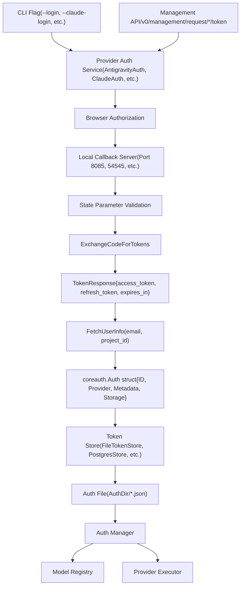
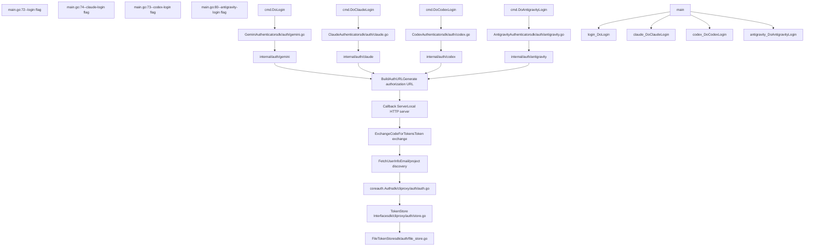

# 身份验证设置

相关源文件

-   [README.md](https://github.com/router-for-me/CLIProxyAPI/blob/c66cb0af/README.md)
-   [README\_CN.md](https://github.com/router-for-me/CLIProxyAPI/blob/c66cb0af/README_CN.md)
-   [internal/api/handlers/management/auth\_files.go](https://github.com/router-for-me/CLIProxyAPI/blob/c66cb0af/internal/api/handlers/management/auth_files.go)
-   [internal/auth/antigravity/auth.go](https://github.com/router-for-me/CLIProxyAPI/blob/c66cb0af/internal/auth/antigravity/auth.go)
-   [internal/auth/claude/token.go](https://github.com/router-for-me/CLIProxyAPI/blob/c66cb0af/internal/auth/claude/token.go)
-   [internal/auth/codex/token.go](https://github.com/router-for-me/CLIProxyAPI/blob/c66cb0af/internal/auth/codex/token.go)
-   [internal/auth/gemini/gemini\_token.go](https://github.com/router-for-me/CLIProxyAPI/blob/c66cb0af/internal/auth/gemini/gemini_token.go)
-   [internal/auth/iflow/iflow\_token.go](https://github.com/router-for-me/CLIProxyAPI/blob/c66cb0af/internal/auth/iflow/iflow_token.go)
-   [internal/auth/kimi/token.go](https://github.com/router-for-me/CLIProxyAPI/blob/c66cb0af/internal/auth/kimi/token.go)
-   [internal/auth/qwen/qwen\_token.go](https://github.com/router-for-me/CLIProxyAPI/blob/c66cb0af/internal/auth/qwen/qwen_token.go)
-   [internal/cmd/anthropic\_login.go](https://github.com/router-for-me/CLIProxyAPI/blob/c66cb0af/internal/cmd/anthropic_login.go)
-   [internal/cmd/iflow\_login.go](https://github.com/router-for-me/CLIProxyAPI/blob/c66cb0af/internal/cmd/iflow_login.go)
-   [internal/cmd/openai\_login.go](https://github.com/router-for-me/CLIProxyAPI/blob/c66cb0af/internal/cmd/openai_login.go)
-   [internal/cmd/qwen\_login.go](https://github.com/router-for-me/CLIProxyAPI/blob/c66cb0af/internal/cmd/qwen_login.go)
-   [internal/misc/credentials.go](https://github.com/router-for-me/CLIProxyAPI/blob/c66cb0af/internal/misc/credentials.go)
-   [sdk/auth/antigravity.go](https://github.com/router-for-me/CLIProxyAPI/blob/c66cb0af/sdk/auth/antigravity.go)
-   [sdk/auth/claude.go](https://github.com/router-for-me/CLIProxyAPI/blob/c66cb0af/sdk/auth/claude.go)
-   [sdk/auth/codex.go](https://github.com/router-for-me/CLIProxyAPI/blob/c66cb0af/sdk/auth/codex.go)
-   [sdk/auth/iflow.go](https://github.com/router-for-me/CLIProxyAPI/blob/c66cb0af/sdk/auth/iflow.go)
-   [sdk/auth/qwen.go](https://github.com/router-for-me/CLIProxyAPI/blob/c66cb0af/sdk/auth/qwen.go)

本页面将引导您在完成初始服务器安装和配置后，设置您的第一个供应商身份验证。您将学习如何使用 OAuth 流程或 API 密钥向 AI 服务供应商进行身份验证、保存凭证并验证模型是否可访问。

有关身份验证架构和凭证管理内部机制的全面详细信息，请参阅[身份验证与凭证管理](/router-for-me/CLIProxyAPI/3.3-authentication-and-credential-management)。有关存储后端配置选项，请参阅[存储后端选项](/router-for-me/CLIProxyAPI/5.2-storage-backend-options)。有关供应商特定的身份验证详细信息和 OAuth 设置程序，请参阅[身份验证流程](/router-for-me/CLIProxyAPI/7-authentication-flows)。

---

## 概览

CLIProxyAPI 支持三种主要的身份验证方法：

| 方法 | 使用场景 | 供应商 |
| --- | --- | --- |
| **OAuth 2.0** | 基于浏览器的个人账户授权 | Gemini CLI, Claude Code, Codex, Qwen, iFlow, Antigravity |
| **API 密钥** | 使用现有密钥直接访问 API | Gemini (AI Studio), Claude (API), 兼容 OpenAI 的上游供应商 |
| **服务账号** | Google Cloud 服务账号 JSON 文件 | Vertex AI |

身份验证后，凭据将持久化到配置的存储后端（默认为文件系统），并注册到身份验证管理器（Auth Manager）以供立即使用。

来源：[README.md36-58](https://github.com/router-for-me/CLIProxyAPI/blob/c66cb0af/README.md#L36-L58) [cmd/server/main.go56-85](https://github.com/router-for-me/CLIProxyAPI/blob/c66cb0af/cmd/server/main.go#L56-L85)

---

## 身份验证方法

### 命令行指令 (CLI Commands)

服务器二进制文件为每个供应商的 OAuth 身份验证提供了专用标志：

```
# Google Gemini CLI OAuth./cliproxyapi --login [--project_id PROJECT_ID] # Claude Code OAuth  ./cliproxyapi --claude-login # OpenAI Codex OAuth./cliproxyapi --codex-login # Qwen Code OAuth./cliproxyapi --qwen-login # iFlow OAuth./cliproxyapi --iflow-login # Antigravity OAuth./cliproxyapi --antigravity-login # Vertex AI 服务账号导入./cliproxyapi --vertex-import path/to/service-account.json
```
每个命令都会启动一个供应商特定的 OAuth 流程，并将生成的凭据保存到 `config.yaml` 中配置的 `AuthDir`。

**可选标志：**

-   `--no-browser`：禁用自动打开浏览器；打印 URL 以便手动身份验证
-   `--oauth-callback-port PORT`：覆盖默认的 OAuth 回调端口

来源：[cmd/server/main.go72-84](https://github.com/router-for-me/CLIProxyAPI/blob/c66cb0af/cmd/server/main.go#L72-L84) [cmd/server/main.go448-471](https://github.com/router-for-me/CLIProxyAPI/blob/c66cb0af/cmd/server/main.go#L448-L471)

### 管理 API (Management API)

对于基于 Web 的集成或远程管理，管理 API 暴露了 OAuth 发起端点：

| 端点 | 供应商 | 方法 |
| --- | --- | --- |
| `/v0/management/request/gemini/token` | Gemini CLI | GET |
| `/v0/management/request/anthropic/token` | Claude Code | GET |
| `/v0/management/request/codex/token` | Codex | GET |
| `/v0/management/request/qwen/token` | Qwen | GET |
| `/v0/management/request/iflow/token` | iFlow | GET |
| `/v0/management/request/antigravity/token` | Antigravity | GET |

这些端点返回一个授权 URL 和一个状态令牌（state token）。客户端在浏览器中打开该 URL，完成 OAuth 流程，并轮询完成结果。

查询参数 `?is_webui=true` 启用了向管理服务器端口的回调转发，允许 Web UI 直接处理回调。

来源：[internal/api/handlers/management/auth\_files.go869-1011](https://github.com/router-for-me/CLIProxyAPI/blob/c66cb0af/internal/api/handlers/management/auth_files.go#L869-L1011) [internal/api/handlers/management/auth\_files.go1013-1299](https://github.com/router-for-me/CLIProxyAPI/blob/c66cb0af/internal/api/handlers/management/auth_files.go#L1013-L1299)

---

## 身份验证流程架构


**身份验证流程阶段：**

1.  **发起**：用户调用 CLI 命令或管理 API 端点
2.  **OAuth 流程**：供应商特定的身份验证服务生成授权 URL，启动本地回调服务器，并打开浏览器
3.  **令牌交换**：用授权码交换访问/刷新令牌；获取用户信息（邮箱、项目 ID）
4.  **持久化**：令牌封装在 `Auth` 结构体中，并通过配置的令牌存储进行保存
5.  **注册**：认证管理器注册凭据，使模型立即可用

来源：[sdk/auth/antigravity.go36-215](https://github.com/router-for-me/CLIProxyAPI/blob/c66cb0af/sdk/auth/antigravity.go#L36-L215) [internal/auth/antigravity/auth.go50-108](https://github.com/router-for-me/CLIProxyAPI/blob/c66cb0af/internal/auth/antigravity/auth.go#L50-L108)

---

## 设置您的第一次身份验证

### 步骤 1：选择供应商

根据您现有的订阅或偏好的模型选择一个供应商。最常见的起点是：

-   **Gemini CLI**：提供免费层级，通过 OAuth 支持 Gemini 模型
-   **Claude Code**：需要有效的 Claude 订阅
-   **Codex**：需要 ChatGPT Plus 或 Pro 订阅

### 步骤 2：运行身份验证命令

**示例：Gemini CLI OAuth**

```
./cliproxyapi --login
```
预期输出：

```
CLIProxyAPI Version: v6.x.x, Commit: xxxxx, BuiltAt: 2024-xx-xx
Initializing Google authentication...
Opening browser for authentication
Waiting for authentication callback...
```
浏览器会打开 Google 的 OAuth 同意屏幕。授权后，您将看到：

```
Authenticated user email: user@example.com
Authentication successful! Token saved to /path/to/auth/gemini-user@example.com.json
You can now use Gemini services through this CLI
```
**示例：无浏览器模式（针对 SSH/远程服务器）**

```
./cliproxyapi --antigravity-login --no-browser
```
输出包含 SSH 隧道的说明：

```
To authenticate on a remote server via SSH:
  ssh -L 8085:localhost:8085 user@remote-server
Visit the following URL to continue authentication:
https://accounts.google.com/o/oauth2/v2/auth?access_type=offline&client_id=...
```
来源：[cmd/server/main.go448-471](https://github.com/router-for-me/CLIProxyAPI/blob/c66cb0af/cmd/server/main.go#L448-L471) [sdk/auth/antigravity.go72-86](https://github.com/router-for-me/CLIProxyAPI/blob/c66cb0af/sdk/auth/antigravity.go#L72-L86)

### 步骤 3：验证凭据文件

检查您的 `AuthDir` 中是否创建了凭据文件：

```
ls -la /path/to/auth/
```
预期文件：

```
-rw------- 1 user user 2048 Jan 15 10:30 gemini-user@example.com.json
-rw------- 1 user user 1856 Jan 15 10:31 claude-user@example.com.json
```
每个文件都包含供应商类型、令牌和元数据：

```
{  "type": "gemini",  "access_token": "ya29.xxx...",  "refresh_token": "1//xxx...",  "email": "user@example.com",  "project_id": "project-123456",  "token_uri": "https://oauth2.googleapis.com/token",  "expired": "2024-01-15T11:30:00Z"}
```
来源：[internal/api/handlers/management/auth\_files.go1142-1177](https://github.com/router-for-me/CLIProxyAPI/blob/c66cb0af/internal/api/handlers/management/auth_files.go#L1142-L1177)

---

## 凭据持久化流程

> **[Mermaid sequence]**
> *(图表结构无法解析)*

**持久化组件：**

-   **`Auth` 结构体**：核心凭据表示 ([sdk/cliproxy/auth/auth.go1-100](https://github.com/router-for-me/CLIProxyAPI/blob/c66cb0af/sdk/cliproxy/auth/auth.go#L1-L100))
-   **令牌存储 (Token Store) 接口**：可插拔的持久化层 ([sdk/cliproxy/auth/store.go1-50](https://github.com/router-for-me/CLIProxyAPI/blob/c66cb0af/sdk/cliproxy/auth/store.go#L1-L50))
-   **文件令牌存储 (File Token Store)**：编写 JSON 文件的默认实现 ([sdk/auth/file\_store.go1-200](https://github.com/router-for-me/CLIProxyAPI/blob/c66cb0af/sdk/auth/file_store.go#L1-L200))
-   **认证管理器 (Auth Manager)**：跟踪所有凭据的中央注册表 ([internal/auth/manager.go1-500](https://github.com/router-for-me/CLIProxyAPI/blob/c66cb0af/internal/auth/manager.go#L1-L500))

来源：[sdk/auth/antigravity.go151-215](https://github.com/router-for-me/CLIProxyAPI/blob/c66cb0af/sdk/auth/antigravity.go#L151-L215) [internal/api/handlers/management/auth\_files.go680-742](https://github.com/router-for-me/CLIProxyAPI/blob/c66cb0af/internal/api/handlers/management/auth_files.go#L680-L742)

---

## 测试连通性

### 使用管理 API

列出所有已注册的身份验证文件：

```
curl http://localhost:8080/v0/management/auth/files
```
响应：

```
{  "files": [    {      "id": "gemini-user@example.com.json",      "name": "gemini-user@example.com.json",      "type": "gemini",      "provider": "gemini",      "email": "user@example.com",      "status": "active",      "disabled": false,      "source": "file",      "size": 2048,      "created_at": "2024-01-15T10:30:00Z"    }  ]}
```
`status` 字段指示凭据的健康状态：

-   `active`：准备就绪
-   `cooling`：暂时的速率限制冷却期
-   `quota_exceeded`：配额已耗尽（5 分钟超时）
-   `disabled`：手动禁用或移除

来源：[internal/api/handlers/management/auth\_files.go249-271](https://github.com/router-for-me/CLIProxyAPI/blob/c66cb0af/internal/api/handlers/management/auth_files.go#L249-L271) [internal/api/handlers/management/auth\_files.go355-428](https://github.com/router-for-me/CLIProxyAPI/blob/c66cb0af/internal/api/handlers/management/auth_files.go#L355-L428)

### 检查可用模型

查询特定凭证可访问的模型：

```
curl "http://localhost:8080/v0/management/auth/models?name=gemini-user@example.com.json"
```
响应：

```
{  "models": [    {      "id": "gemini-1.5-pro",      "display_name": "Gemini 1.5 Pro",      "type": "chat",      "owned_by": "google"    },    {      "id": "gemini-2.0-flash-exp",      "display_name": "Gemini 2.0 Flash Experimental",      "type": "chat",      "owned_by": "google"    }  ]}
```
来源：[internal/api/handlers/management/auth\_files.go273-319](https://github.com/router-for-me/CLIProxyAPI/blob/c66cb0af/internal/api/handlers/management/auth_files.go#L273-L319)

---

## 代码实体映射


**关键代码实体：**

| 实体 | 文件路径 | 用途 |
| --- | --- | --- |
| `Authenticator` 接口 | [sdk/auth/auth.go1-50](https://github.com/router-for-me/CLIProxyAPI/blob/c66cb0af/sdk/auth/auth.go#L1-L50) | 定义了 `Login()`, `Provider()`, `RefreshLead()` 方法 |
| `AntigravityAuthenticator` | [sdk/auth/antigravity.go21-28](https://github.com/router-for-me/CLIProxyAPI/blob/c66cb0af/sdk/auth/antigravity.go#L21-L28) | 实现 Antigravity 的 OAuth 流程 |
| `AntigravityAuth` 服务 | [internal/auth/antigravity/auth.go32-48](https://github.com/router-for-me/CLIProxyAPI/blob/c66cb0af/internal/auth/antigravity/auth.go#L32-L48) | 处理向 Google OAuth 的 API 请求 |
| `Auth` 结构体 | [sdk/cliproxy/auth/auth.go1-100](https://github.com/router-for-me/CLIProxyAPI/blob/c66cb0af/sdk/cliproxy/auth/auth.go#L1-L100) | 内存中的凭据表示 |
| `Store` 接口 | [sdk/cliproxy/auth/store.go1-50](https://github.com/router-for-me/CLIProxyAPI/blob/c66cb0af/sdk/cliproxy/auth/store.go#L1-L50) | 定义了 `Save()`, `Load()`, `Delete()` 操作 |
| `FileTokenStore` | [sdk/auth/file\_store.go1-200](https://github.com/router-for-me/CLIProxyAPI/blob/c66cb0af/sdk/auth/file_store.go#L1-L200) | 默认的基于文件的存储实现 |

来源：[sdk/auth/antigravity.go20-28](https://github.com/router-for-me/CLIProxyAPI/blob/c66cb0af/sdk/auth/antigravity.go#L20-L28) [internal/auth/antigravity/auth.go33-48](https://github.com/router-for-me/CLIProxyAPI/blob/c66cb0af/internal/auth/antigravity/auth.go#L33-L48)

---

## 管理 API 身份验证端点

管理 API 为基于 Web 的客户端提供了对 OAuth 流程的程序化访问：

> **[Mermaid sequence]**
> *(图表结构无法解析)*

**回调转发器（Callback Forwarder）架构：**

当设置 `is_webui=true` 时，管理 API 会在供应商的默认回调端口（例如 Claude 为 54545，Gemini 为 8085）上启动一个临时的 HTTP 服务器，将 OAuth 回调重定向到管理服务器的端口。这允许 Web UI 处理回调，而无需用户配置重定向 URI。

转发器在 OAuth 流程完成或超时后自动停止。

来源：[internal/api/handlers/management/auth\_files.go131-234](https://github.com/router-for-me/CLIProxyAPI/blob/c66cb0af/internal/api/handlers/management/auth_files.go#L131-L234) [internal/api/handlers/management/auth\_files.go869-1011](https://github.com/router-for-me/CLIProxyAPI/blob/c66cb0af/internal/api/handlers/management/auth_files.go#L869-L1011)

---

## 常见身份验证场景

### 场景 1：同一供应商有多个账号

您可以对多个账号进行身份验证以实现负载均衡：

```
# 第一个账号./cliproxyapi --claude-login# 保存为：claude-user1@example.com.json # 第二个账号  ./cliproxyapi --claude-login# 保存为：claude-user2@example.com.json
```
认证管理器会自动发现这两个凭据，并使用配置的选择器策略（轮询或优先填满）来分配请求。

### 场景 2：Vertex AI 服务账号

对于 Vertex AI，导入服务账号 JSON 文件：

```
./cliproxyapi --vertex-import /path/to/service-account.json
```
该命令将文件复制到 `AuthDir` 并向认证管理器注册。与 OAuth 凭据不同，服务账号密钥不会过期，但应为了安全定期轮换。

### 场景 3：远程服务器身份验证

在通过 SSH 在远程服务器上进行身份验证时：

1.  为回调端口创建 SSH 隧道：

    ```
    ssh -L 8085:localhost:8085 user@remote-server
    ```

2.  运行带有 `--no-browser` 标志的登录命令：

    ```
    ./cliproxyapi --login --no-browser
    ```

3.  复制授权 URL 并在本地浏览器中打开

4.  授权后，回调将通过 SSH 隧道转发到远程服务器。


来源：[sdk/auth/antigravity.go72-86](https://github.com/router-for-me/CLIProxyAPI/blob/c66cb0af/sdk/auth/antigravity.go#L72-L86)

---

## 身份验证故障排查

### 问题："Failed to start callback server"

**原因**：回调端口已被占用。

**解决方案**：指定不同的端口：

```
./cliproxyapi --antigravity-login --oauth-callback-port 9999
```
### 问题："Authentication timed out"

**原因**：OAuth 流程未在 5 分钟超时时间内完成。

**解决方案**：重试身份验证命令。如果使用远程服务器，请检查防火墙规则。

### 问题：认证文件存在但状态为 "cooling"

**原因**：最近的速率限制（rate limit）或配额错误触发了冷却期。

**解决方案**：等待冷却期结束（401 错误为 30 分钟，404 错误为 12 小时）。检查供应商控制台中的配额限制。

来源：[sdk/cliproxy/auth/manager.go1-500](https://github.com/router-for-me/CLIProxyAPI/blob/c66cb0af/sdk/cliproxy/auth/manager.go#L1-L500)

### 问题：身份验证后显示 "No models available"

**原因**：

1.  未设置项目 ID (Project ID)（Gemini/Antigravity）
2.  订阅未激活
3.  未在供应商控制台中启用模型

**解决方案**：

1.  对于 Gemini，使用 `--project_id` 标志重新进行身份验证
2.  在供应商仪表板中验证订阅状态
3.  在 Google Cloud 控制台中启用所需的 API

---

## 下一步

成功身份验证后：

1.  **配置模型映射**：参阅[模型映射与排除](/router-for-me/CLIProxyAPI/8.2-model-mapping-and-exclusion)以设置模型别名
2.  **测试请求**：使用[兼容 OpenAI 的端点](/router-for-me/CLIProxyAPI/4.1-openai-compatible-endpoints)文档中的端点
3.  **设置多个账号**：添加额外的凭据以实现负载均衡
4.  **配置存储后端**：为生产部署切换到 PostgresStore 或 GitStore ([存储后端选项](/router-for-me/CLIProxyAPI/5.2-storage-backend-options))
