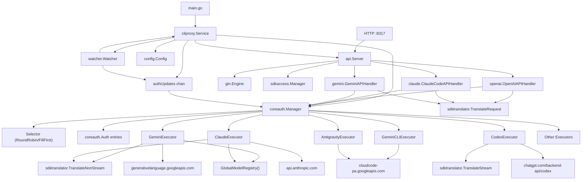
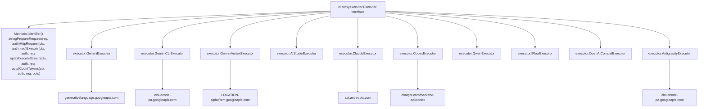
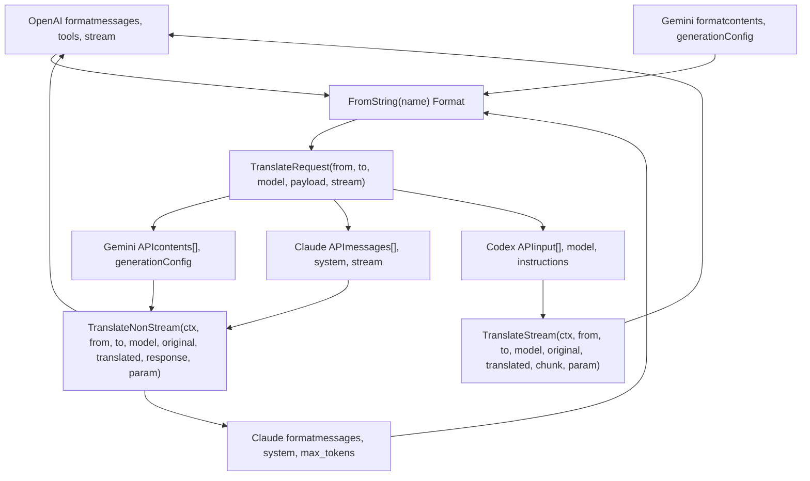
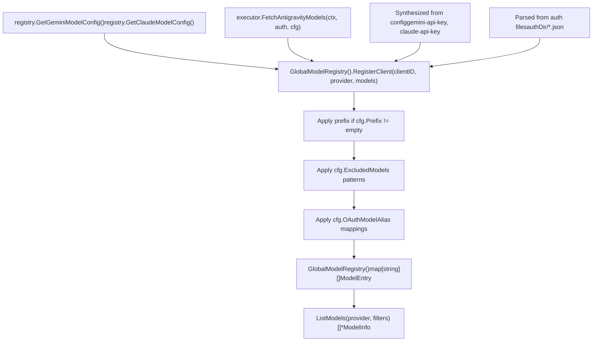

# 核心架构

相关源文件

-   [config.example.yaml](https://github.com/router-for-me/CLIProxyAPI/blob/c66cb0af/config.example.yaml)
-   [docs/sdk-access.md](https://github.com/router-for-me/CLIProxyAPI/blob/c66cb0af/docs/sdk-access.md)
-   [docs/sdk-access\_CN.md](https://github.com/router-for-me/CLIProxyAPI/blob/c66cb0af/docs/sdk-access_CN.md)
-   [internal/access/config\_access/provider.go](https://github.com/router-for-me/CLIProxyAPI/blob/c66cb0af/internal/access/config_access/provider.go)
-   [internal/access/reconcile.go](https://github.com/router-for-me/CLIProxyAPI/blob/c66cb0af/internal/access/reconcile.go)
-   [internal/api/handlers/management/config\_basic.go](https://github.com/router-for-me/CLIProxyAPI/blob/c66cb0af/internal/api/handlers/management/config_basic.go)
-   [internal/api/handlers/management/config\_lists.go](https://github.com/router-for-me/CLIProxyAPI/blob/c66cb0af/internal/api/handlers/management/config_lists.go)
-   [internal/api/server.go](https://github.com/router-for-me/CLIProxyAPI/blob/c66cb0af/internal/api/server.go)
-   [internal/config/config.go](https://github.com/router-for-me/CLIProxyAPI/blob/c66cb0af/internal/config/config.go)
-   [internal/watcher/watcher.go](https://github.com/router-for-me/CLIProxyAPI/blob/c66cb0af/internal/watcher/watcher.go)
-   [sdk/access/errors.go](https://github.com/router-for-me/CLIProxyAPI/blob/c66cb0af/sdk/access/errors.go)
-   [sdk/access/manager.go](https://github.com/router-for-me/CLIProxyAPI/blob/c66cb0af/sdk/access/manager.go)
-   [sdk/access/registry.go](https://github.com/router-for-me/CLIProxyAPI/blob/c66cb0af/sdk/access/registry.go)
-   [sdk/cliproxy/builder.go](https://github.com/router-for-me/CLIProxyAPI/blob/c66cb0af/sdk/cliproxy/builder.go)
-   [sdk/cliproxy/service.go](https://github.com/router-for-me/CLIProxyAPI/blob/c66cb0af/sdk/cliproxy/service.go)
-   [sdk/config/config.go](https://github.com/router-for-me/CLIProxyAPI/blob/c66cb0af/sdk/config/config.go)
-   [test/amp\_management\_test.go](https://github.com/router-for-me/CLIProxyAPI/blob/c66cb0af/test/amp_management_test.go)

## 用途与范围

本文档提供了 CLIProxyAPI 核心架构的高级概览，描述了主要组件及其交互。它涵盖了服务生命周期、HTTP 服务器结构、身份验证流程、供应商执行模型、请求翻译管道和模型注册表。有关每个子系统的具体实现细节，请参阅子页面：[服务生命周期与初始化 (3.1)](/router-for-me/CLIProxyAPI/3.1-service-lifecycle-and-initialization)、[HTTP 服务器与请求管道 (3.2)](/router-for-me/CLIProxyAPI/3.2-http-server-and-request-pipeline)、[身份验证与凭证管理 (3.3)](/router-for-me/CLIProxyAPI/3.3-authentication-and-credential-management)、[供应商执行器系统 (3.4)](/router-for-me/CLIProxyAPI/3.4-provider-executor-system)、[请求翻译系统 (3.5)](/router-for-me/CLIProxyAPI/3.5-request-translation-system)、[模型注册与选择 (3.6)](/router-for-me/CLIProxyAPI/3.6-model-registry-and-selection) 以及 [热重载与配置更新 (3.7)](/router-for-me/CLIProxyAPI/3.7-hot-reload-and-configuration-updates)。

CLIProxyAPI 是一个统一的代理服务器，负责在多个 AI 服务供应商（Gemini、Claude、Codex、Qwen、iFlow、兼容 OpenAI 的服务）之间翻译和路由请求。系统提供 API 兼容层、凭证管理、热重载配置和使用情况跟踪。

**来源：** [internal/api/server.go1-40](https://github.com/router-for-me/CLIProxyAPI/blob/c66cb0af/internal/api/server.go#L1-L40) [sdk/cliproxy/service.go1-40](https://github.com/router-for-me/CLIProxyAPI/blob/c66cb0af/sdk/cliproxy/service.go#L1-L40)

---

## 系统架构概览

该架构由五个主要层组成：**入口点 (Entry Points)**、**服务编排 (Service Orchestration)**、**请求处理 (Request Processing)**、**供应商执行 (Provider Execution)** 和 **外部集成 (External Integration)**。

**架构分层图**

**来源：** [sdk/cliproxy/service.go32-89](https://github.com/router-for-me/CLIProxyAPI/blob/c66cb0af/sdk/cliproxy/service.go#L32-L89) [internal/api/server.go114-174](https://github.com/router-for-me/CLIProxyAPI/blob/c66cb0af/internal/api/server.go#L114-L174) [internal/watcher/watcher.go30-54](https://github.com/router-for-me/CLIProxyAPI/blob/c66cb0af/internal/watcher/watcher.go#L30-L54) [internal/watcher/watcher.go56-70](https://github.com/router-for-me/CLIProxyAPI/blob/c66cb0af/internal/watcher/watcher.go#L56-L70)

---

## 组件职责

### 服务编排层

| 组件 | 类型 | 职责 |
| --- | --- | --- |
| `cliproxy.Builder` | 结构体 | 流式生成器，通过 `Build()` 构建并验证 `Service` |
| `cliproxy.Service` | 结构体 | 管理完整的生命周期：`Run()`、`Shutdown()`、组件协调 |
| `watcher.Watcher` | 结构体 | 使用 `fsnotify.Watcher` 监视文件系统，发出 `AuthUpdate` 事件 |
| `config.Config` | 结构体 | 保存解析后的 YAML 配置，支持通过 `LoadConfig()` 进行热重载 |
| `authUpdates chan` | 通道 | 缓冲通道 (256)，用于异步处理身份验证变更 |
| `coreauth.Manager` | 结构体 | 运行时凭证池，具备 `Register()`、`Update()`、`GetByID()` 功能 |

`cliproxy.Builder` 是构建服务的主要入口点。它提供流式设置器 (`WithConfig()`、`WithConfigPath()`、`WithCoreAuthManager()`、`WithServerOptions()` 等)，并在 `Build()` 中验证输入，为任何未设置的供应商应用默认值。生成的 `cliproxy.Service` 编排所有子系统：它初始化 `api.Server`、`coreauth.Manager`、`sdkaccess.Manager`、`watcher.Watcher` 和供应商执行器。该服务一直运行直到上下文取消，并通过 `Shutdown()` 处理优雅关闭。

**来源：** [sdk/cliproxy/builder.go21-51](https://github.com/router-for-me/CLIProxyAPI/blob/c66cb0af/sdk/cliproxy/builder.go#L21-L51) [sdk/cliproxy/builder.go167-242](https://github.com/router-for-me/CLIProxyAPI/blob/c66cb0af/sdk/cliproxy/builder.go#L167-L242) [sdk/cliproxy/service.go32-89](https://github.com/router-for-me/CLIProxyAPI/blob/c66cb0af/sdk/cliproxy/service.go#L32-L89) [sdk/cliproxy/service.go111-147](https://github.com/router-for-me/CLIProxyAPI/blob/c66cb0af/sdk/cliproxy/service.go#L111-L147) [internal/watcher/watcher.go30-54](https://github.com/router-for-me/CLIProxyAPI/blob/c66cb0af/internal/watcher/watcher.go#L30-L54) [internal/config/config.go24-113](https://github.com/router-for-me/CLIProxyAPI/blob/c66cb0af/internal/config/config.go#L24-L113)

### HTTP 服务器层

| 组件 | 类型 | 职责 |
| --- | --- | --- |
| `api.Server` | 结构体 | 管理 `gin.Engine`，通过 `setupRoutes()` 路由，HTTP 生命周期 |
| `AuthMiddleware()` | 函数 | 通过 `sdkaccess.Manager` 验证凭证，设置 Gin 上下文 |
| `openai.OpenAIAPIHandler` | 结构体 | 处理 `/v1/chat/completions`、`/v1/completions` |
| `claude.ClaudeCodeAPIHandler` | 结构体 | 处理 `/v1/messages`、`/v1/messages/count_tokens` |
| `gemini.GeminiAPIHandler` | 结构体 | 处理 `/v1beta/models/*`、Gemini API 格式 |
| `managementHandlers.Handler` | 结构体 | 处理 `/v0/management/*` 配置端点 |

`api.Server` 使用中间件层（`corsMiddleware()`、`logging.GinLogrusLogger()`、身份验证）配置 `gin.Engine`，并通过 `setupRoutes()` 注册路由。`UpdateClients()` 方法支持在不重启的情况下热重载配置。

**来源：** [internal/api/server.go114-174](https://github.com/router-for-me/CLIProxyAPI/blob/c66cb0af/internal/api/server.go#L114-L174) [internal/api/server.go308-426](https://github.com/router-for-me/CLIProxyAPI/blob/c66cb0af/internal/api/server.go#L308-L426) [internal/api/server.go850-920](https://github.com/router-for-me/CLIProxyAPI/blob/c66cb0af/internal/api/server.go#L850-L920)

### 身份验证与执行层

| 组件 | 类型 | 职责 |
| --- | --- | --- |
| `coreauth.Manager` | 结构体 | 内存凭证池，支持带路由策略的 `Select()` |
| `coreauth.Selector` | 接口 | 策略接口：`RoundRobinSelector`、`FillFirstSelector` |
| `coreauth.Auth` | 结构体 | 包含元数据、状态、属性的单个凭证 |
| `sdkaccess.Manager` | 结构体 | 请求时的 API 密钥验证（通过配置的供应商） |
| `cliproxyexecutor.Executor` | 接口 | 执行器接口：`Execute()`、`ExecuteStream()`、`CountTokens()` |

`coreauth.Manager` 维护一个从文件存储加载或从配置合成的 `coreauth.Auth` 条目的运行时池。`Select()` 方法使用 `Selector` 实现（通过 `SetSelector()` 配置）来选择凭证。每个执行器实现 `PrepareRequest()` 用于凭证注入，以及 `HttpRequest()` 用于直接 HTTP 执行。

**来源：** [sdk/cliproxy/service.go340-389](https://github.com/router-for-me/CLIProxyAPI/blob/c66cb0af/sdk/cliproxy/service.go#L340-L389) [internal/runtime/executor/gemini\_executor.go40-57](https://github.com/router-for-me/CLIProxyAPI/blob/c66cb0af/internal/runtime/executor/gemini_executor.go#L40-L57) [internal/runtime/executor/claude\_executor.go33-42](https://github.com/router-for-me/CLIProxyAPI/blob/c66cb0af/internal/runtime/executor/claude_executor.go#L33-L42) [internal/runtime/executor/antigravity\_executor.go59-76](https://github.com/router-for-me/CLIProxyAPI/blob/c66cb0af/internal/runtime/executor/antigravity_executor.go#L59-L76)

---

## 请求处理流程

此图显示了客户端请求如何从 HTTP 入口流经系统到供应商 API 响应。

**请求流程图**

> **[Mermaid sequence]**
> *(图表结构无法解析)*

**来源：** [internal/api/server.go308-349](https://github.com/router-for-me/CLIProxyAPI/blob/c66cb0af/internal/api/server.go#L308-L349) [sdk/api/handlers/openai/openai\_handler.go1-100](https://github.com/router-for-me/CLIProxyAPI/blob/c66cb0af/sdk/api/handlers/openai/openai_handler.go#L1-L100) [internal/runtime/executor/gemini\_executor.go59-90](https://github.com/router-for-me/CLIProxyAPI/blob/c66cb0af/internal/runtime/executor/gemini_executor.go#L59-L90) [internal/runtime/executor/gemini\_executor.go105-204](https://github.com/router-for-me/CLIProxyAPI/blob/c66cb0af/internal/runtime/executor/gemini_executor.go#L105-L204)

---

## 核心组件详情

### cliproxy.Service

`cliproxy.Service` 结构体是位于 [sdk/cliproxy/service.go32-89](https://github.com/router-for-me/CLIProxyAPI/blob/c66cb0af/sdk/cliproxy/service.go#L32-L89) 的根生命周期管理器。关键字段和方法：

**字段：**

-   `cfg *config.Config` - 带有 `sync.RWMutex` 保护的配置
-   `server *api.Server` - HTTP API 服务器实例
-   `coreManager *coreauth.Manager` - 运行时凭证池
-   `accessManager *sdkaccess.Manager` - 请求身份验证供应商
-   `watcher *WatcherWrapper` - 文件系统监视器
-   `wsGateway *wsrelay.Manager` - AI Studio 的 Websocket 中继
-   `authUpdates chan watcher.AuthUpdate` - 异步身份验证变更的缓冲通道 (256)
-   `authQueueStop context.CancelFunc` - 身份验证队列处理的取消函数

**方法：**

-   `Run(ctx context.Context) error` - 启动所有子系统，阻塞直到上下文取消
-   `Shutdown(ctx context.Context) error` - 带有超时的优雅关闭
-   `ensureAuthUpdateQueue(ctx)` - 通过 `consumeAuthUpdates()` 初始化身份验证更新处理
-   `handleAuthUpdate(ctx, update)` - 处理添加/修改/删除身份验证事件
-   `ensureExecutorsForAuth(auth)` - 根据 `auth.Provider` 绑定供应商执行器
-   `rebindExecutors()` - 在配置重载时重新注册所有执行器

`Run()` 方法序列：加载身份验证存储 → 加载令牌/API 密钥客户端 → 创建 `api.Server` → 启动 websocket 网关 → 启动 HTTP 服务器 → 启动文件监视器 → 启动自动刷新 → 阻塞于上下文/错误。

**来源：** [sdk/cliproxy/service.go32-89](https://github.com/router-for-me/CLIProxyAPI/blob/c66cb0af/sdk/cliproxy/service.go#L32-L89) [sdk/cliproxy/service.go111-124](https://github.com/router-for-me/CLIProxyAPI/blob/c66cb0af/sdk/cliproxy/service.go#L111-L124) [sdk/cliproxy/service.go126-147](https://github.com/router-for-me/CLIProxyAPI/blob/c66cb0af/sdk/cliproxy/service.go#L126-L147) [sdk/cliproxy/service.go340-389](https://github.com/router-for-me/CLIProxyAPI/blob/c66cb0af/sdk/cliproxy/service.go#L340-L389) [sdk/cliproxy/service.go402-594](https://github.com/router-for-me/CLIProxyAPI/blob/c66cb0af/sdk/cliproxy/service.go#L402-L594)

### api.Server

[internal/api/server.go114-174](https://github.com/router-for-me/CLIProxyAPI/blob/c66cb0af/internal/api/server.go#L114-L174) 中的 `api.Server` 结构体管理 HTTP 服务：

**字段：**

-   `engine *gin.Engine` - Gin Web 框架实例
-   `server *http.Server` - 底层 HTTP 服务器
-   `handlers *handlers.BaseAPIHandler` - 带有 `coreauth.Manager` 的基础处理器
-   `cfg *config.Config` - 当前配置
-   `accessManager *sdkaccess.Manager` - 请求认证供应商
-   `mgmt *managementHandlers.Handler` - 管理 API 处理器
-   `ampModule *ampmodule.AmpModule` - Amp CLI 集成模块

**关键方法：**

-   `NewServer(cfg, authManager, accessManager, configPath, opts)` - 带有选项的构造函数
-   `setupRoutes()` - 注册所有 HTTP 路由
-   `Start() error` - 开始监听（基于 `cfg.TLS.Enable` 选择 HTTP 或 HTTPS）
-   `Stop(ctx) error` - 带有超时的优雅关闭
-   `UpdateClients(newCfg)` - 热重载处理器，更新配置并重新绑定组件
-   `AttachWebsocketRoute(path, handler)` - 注册 websocket 升级处理器

**路由结构：**

| 路径 | 方法 | 处理器 |
| --- | --- | --- |
| `/v1/chat/completions` | POST | `openai.OpenAIAPIHandler.ChatCompletions` |
| `/v1/completions` | POST | `openai.OpenAIAPIHandler.Completions` |
| `/v1/models` | GET | `unifiedModelsHandler` (通过 `User-Agent` 路由到 OpenAI 或 Claude) |
| `/v1/messages` | POST | `claude.ClaudeCodeAPIHandler.ClaudeMessages` |
| `/v1/messages/count_tokens` | POST | `claude.ClaudeCodeAPIHandler.ClaudeCountTokens` |
| `/v1/responses` | POST/GET | `openai.OpenAIResponsesAPIHandler` (GET 升级到 WebSocket) |
| `/v1/responses/compact` | POST | `openai.OpenAIResponsesAPIHandler.Compact` |
| `/v1beta/models/*` | GET/POST | `gemini.GeminiAPIHandler` |
| `/v1internal:method` | POST | `gemini.GeminiCLIAPIHandler.CLIHandler` |
| `/v0/management/*` | 混合 | `managementHandlers.Handler` (需要 secret key) |
| `/anthropic/callback`, `/codex/callback` 等 | GET | OAuth 回调处理器 |

当 `cfg.TLS.Enable == true` 时服务器支持 TLS，并绑定到 `cfg.Host:cfg.Port`。

**来源：** [internal/api/server.go114-174](https://github.com/router-for-me/CLIProxyAPI/blob/c66cb0af/internal/api/server.go#L114-L174) [internal/api/server.go175-306](https://github.com/router-for-me/CLIProxyAPI/blob/c66cb0af/internal/api/server.go#L175-L306) [internal/api/server.go308-426](https://github.com/router-for-me/CLIProxyAPI/blob/c66cb0af/internal/api/server.go#L308-L426) [internal/api/server.go761-791](https://github.com/router-for-me/CLIProxyAPI/blob/c66cb0af/internal/api/server.go#L761-L791) [internal/api/server.go850-920](https://github.com/router-for-me/CLIProxyAPI/blob/c66cb0af/internal/api/server.go#L850-L920)

### watcher.Watcher

[internal/watcher/watcher.go30-54](https://github.com/router-for-me/CLIProxyAPI/blob/c66cb0af/internal/watcher/watcher.go#L30-L54) 中的 `watcher.Watcher` 结构体监视文件系统更改：

**字段：**

-   `watcher *fsnotify.Watcher` - fsnotify 实例
-   `configPath string` - config.yaml 的路径
-   `authDir string` - 包含身份验证 JSON 文件的目录
-   `reloadCallback func(*config.Config)` - 在配置更改时调用
-   `authQueue chan<- AuthUpdate` - 身份验证事件的输出通道
-   `lastAuthHashes map[string]string` - 用于检测更改的 SHA256 哈希
-   `configReloadTimer *time.Timer` - 防抖定时器 (150ms)

**常量：**

-   `replaceCheckDelay = 50ms` - 用于区分文件替换和删除的延迟
-   `configReloadDebounce = 150ms` - 配置重载防抖间隔
-   `authRemoveDebounceWindow = 1s` - 抑制重复删除事件的窗口

**关键方法：**

-   `NewWatcher(configPath, authDir, reloadCallback)` - 构造函数，创建 `fsnotify.Watcher`
-   `Start(ctx) error` - 通过 `start(ctx)` 开始监视
-   `Stop() error` - 关闭 fsnotify 监视器
-   `SetAuthUpdateQueue(queue)` - 为 `AuthUpdate` 事件设置输出通道
-   `DispatchRuntimeAuthUpdate(update) bool` - 允许外部身份验证更新（例如，websocket）

监视器使用 `replaceCheckDelay` 窗口区分原子文件替换（临时文件重命名）和真实的删除。它计算 YAML 哈希以避免虚假的配置重载，并发出结构化的 `AuthUpdate` 事件（添加/修改/删除）。

**来源：** [internal/watcher/watcher.go30-54](https://github.com/router-for-me/CLIProxyAPI/blob/c66cb0af/internal/watcher/watcher.go#L30-L54) [internal/watcher/watcher.go56-78](https://github.com/router-for-me/CLIProxyAPI/blob/c66cb0af/internal/watcher/watcher.go#L56-L78) [internal/watcher/watcher.go80-147](https://github.com/router-for-me/CLIProxyAPI/blob/c66cb0af/internal/watcher/watcher.go#L80-L147)

### coreauth.Manager

`coreauth.Manager` 管理运行时凭证状态。虽然其实现在 SDK 包中，但服务通过 [sdk/cliproxy/service.go271-310](https://github.com/router-for-me/CLIProxyAPI/blob/c66cb0af/sdk/cliproxy/service.go#L271-L310) 对其进行协调：

**核心职责：**

-   **凭证池 (Credential Pool)**：以 ID 为索引的 `coreauth.Auth` 条目的内存映射
-   **选择策略 (Selection Strategy)**：通过 `SetSelector(selector Selector)` 可配置 - 支持 `RoundRobinSelector`（默认）和 `FillFirstSelector`
-   **健康跟踪 (Health Tracking)**：每个 `Auth` 都有 `Status` 字段（Active/QuotaExceeded/Disabled）
-   **自动刷新 (Auto-Refresh)**：后台 goroutine 在过期前对 OAuth 凭证调用 `Refresh()`
-   **执行器注册表 (Executor Registry)**：将供应商名称映射到 `cliproxyexecutor.Executor` 实现

**选择流程（通过 `Select(provider, model, filters)`）：**

1.  按 `provider` 字段过滤凭证
2.  按模型可用性过滤（通过注册的执行器的模型）
3.  按健康状态过滤（排除禁用的，可选地跳过配额超限的）
4.  应用路由策略 (`Selector.Select(auths)`)
5.  返回选择的 `*coreauth.Auth` 或错误

**与服务的集成：** 服务在 [sdk/cliproxy/service.go340-389](https://github.com/router-for-me/CLIProxyAPI/blob/c66cb0af/sdk/cliproxy/service.go#L340-L389) 通过 `ensureExecutorsForAuth()` 绑定执行器，该方法检查 `auth.Provider` 并使用适当的实现（例如 `GeminiExecutor`、`ClaudeExecutor`）调用 `coreManager.RegisterExecutor()`。

**来源：** [sdk/cliproxy/service.go271-310](https://github.com/router-for-me/CLIProxyAPI/blob/c66cb0af/sdk/cliproxy/service.go#L271-L310) [sdk/cliproxy/service.go340-389](https://github.com/router-for-me/CLIProxyAPI/blob/c66cb0af/sdk/cliproxy/service.go#L340-L389) [sdk/cliproxy/service.go508-559](https://github.com/router-for-me/CLIProxyAPI/blob/c66cb0af/sdk/cliproxy/service.go#L508-L559)

---

## 供应商执行器架构

执行器实现 `ProviderExecutor` 接口，在异构 AI 供应商 API 之上提供统一抽象。

**执行器接口与实现**

每个执行器都是无状态的，并通过构造函数接收 `*config.Config`。凭证通过 `*cliproxyauth.Auth` 参数逐请求传递。

**通用执行器模式：**

-   `Identifier() string` - 返回供应商密钥（例如 "gemini"、"claude"、"codex"）
-   `PrepareRequest()` - 将凭证注入 `http.Request` 头
-   `Execute()` - 带有 `sdktranslator.TranslateNonStream()` 的非流式请求
-   `ExecuteStream()` - 带有 `sdktranslator.TranslateStream()` 的流式请求
-   `thinking.ApplyThinking()` - 注入扩展推理配置
-   `applyPayloadConfigWithRoot()` - 应用基于配置的参数默认值/覆盖

**来源：** [internal/runtime/executor/gemini\_executor.go40-57](https://github.com/router-for-me/CLIProxyAPI/blob/c66cb0af/internal/runtime/executor/gemini_executor.go#L40-L57) [internal/runtime/executor/claude\_executor.go33-50](https://github.com/router-for-me/CLIProxyAPI/blob/c66cb0af/internal/runtime/executor/claude_executor.go#L33-L50) [internal/runtime/executor/codex\_executor.go32-40](https://github.com/router-for-me/CLIProxyAPI/blob/c66cb0af/internal/runtime/executor/codex_executor.go#L32-L40) [internal/runtime/executor/antigravity\_executor.go59-92](https://github.com/router-for-me/CLIProxyAPI/blob/c66cb0af/internal/runtime/executor/antigravity_executor.go#L59-L92) [internal/runtime/executor/openai\_compat\_executor.go23-37](https://github.com/router-for-me/CLIProxyAPI/blob/c66cb0af/internal/runtime/executor/openai_compat_executor.go#L23-L37)

---

## 翻译层

翻译层使用 `sdktranslator` 包在 API 格式（OpenAI、Claude、Gemini）之间进行转换。

**翻译流程**

**翻译函数：**

-   `FromString(name string) Format` - 从字符串（"openai"、"claude"、"gemini"、"codex" 等）创建格式标识符
-   `TranslateRequest(from, to Format, model string, payload []byte, stream bool) []byte` - 双向请求翻译
-   `TranslateNonStream(ctx, from, to Format, model, original, translated, response, *param) string` - 非流式的响应转换
-   `TranslateStream(ctx, from, to Format, model, original, translated, chunk, *param) []string` - 流式的 SSE 分块转换
-   `TranslateTokenCount(ctx, from, to Format, count int64, response []byte) string` - 令牌计数响应格式化

**翻译能力：**

-   **双向 (Bidirectional)**：OpenAI ↔ Gemini、OpenAI ↔ Claude、Claude ↔ Antigravity 等。
-   **流式感知 (Streaming Aware)**：针对流式 (`stream: true`) 与非流式请求采用不同逻辑
-   **思考/推理 (Thinking/Reasoning)**：在 `thinkingBudget` (Gemini)、`thinking` (Claude)、`reasoning.effort` (Codex) 之间转换
-   **工具调用 (Tool Calling)**：在不同格式间映射 `tools`/`tool_choice`
-   **内容部分 (Content Parts)**：处理文本、图像、函数调用内容类型

**来源：** [internal/runtime/executor/gemini\_executor.go105-131](https://github.com/router-for-me/CLIProxyAPI/blob/c66cb0af/internal/runtime/executor/gemini_executor.go#L105-L131) [internal/runtime/executor/claude\_executor.go86-116](https://github.com/router-for-me/CLIProxyAPI/blob/c66cb0af/internal/runtime/executor/claude_executor.go#L86-L116) [internal/runtime/executor/codex\_executor.go75-104](https://github.com/router-for-me/CLIProxyAPI/blob/c66cb0af/internal/runtime/executor/codex_executor.go#L75-L104)

---

## 模型注册表

`GlobalModelRegistry` 提供了跨所有供应商和凭证的统一模型目录。

**模型注册流程**

**注册触发器：**

1.  **服务启动**：`Run()` 为每个加载的凭证调用 `registerModelsForAuth(auth)`
2.  **身份验证文件更改**：`handleAuthUpdate()` 在添加/修改时调用 `registerModelsForAuth()`
3.  **配置重载**：`UpdateClients()` 为基于配置的凭证重新注册模型

**模型处理步骤（在 `registerModelsForAuth()` 中）：**

1.  通过执行器的模型源（静态或动态）获取模型
2.  如果已配置则应用 `prefix`（例如 `"teamA/" + modelName`）
3.  应用 `excluded-models` 通配符模式（精确匹配、前缀 `*`、后缀 `*`、子串 `*`）
4.  应用 `oauth-model-alias` 映射（重命名、分叉）
5.  调用 `GlobalModelRegistry().RegisterClient(auth.ID, auth.Provider, models)`

**注册表函数：**

-   `GlobalModelRegistry() *ModelRegistry` - 返回单例注册表实例
-   `RegisterClient(clientID, provider string, models []*ModelInfo)` - 为客户端注册模型
-   `UnregisterClient(clientID string)` - 移除客户端的所有模型
-   `ListModels(provider string, filters ...FilterFunc) []*ModelInfo` - 带过滤器查询模型

**来源：** [sdk/cliproxy/service.go677-766](https://github.com/router-for-me/CLIProxyAPI/blob/c66cb0af/sdk/cliproxy/service.go#L677-L766) [internal/runtime/executor/antigravity\_executor.go931-1033](https://github.com/router-for-me/CLIProxyAPI/blob/c66cb0af/internal/runtime/executor/antigravity_executor.go#L931-L1033)

---

## 配置热重载

配置更改由 `watcher.Watcher` 检测，并在无需重启的情况下通过系统传播。

**热重载事件流**

> **[Mermaid sequence]**
> *(图表结构无法解析)*

**可热重载的配置字段：**

-   `debug` → 日志级别更新
-   `usage-statistics-enabled` → 切换使用情况跟踪
-   `request-retry`, `max-retry-interval` → 通过 `SetRetryConfig()` 更新重试配置
-   `routing.strategy` → 选择器更新：`RoundRobinSelector` 或 `FillFirstSelector`
-   `api-keys` → 访问供应商重新初始化
-   `gemini-api-key`, `claude-api-key` 等 → 凭证合成与重新注册
-   `oauth-model-alias`, `oauth-excluded-models` → 模型过滤更新
-   `ampcode.*` → Amp 模块配置（映射、上游）
-   `proxy-url` → 所有上游请求的 HTTP 客户端代理配置

**不可热重载（需要重启）：**

-   `host`, `port` → 服务器绑定地址
-   `auth-dir` → 监视器路径配置
-   `tls.*` → HTTPS 证书配置

**来源：** [sdk/cliproxy/service.go508-559](https://github.com/router-for-me/CLIProxyAPI/blob/c66cb0af/sdk/cliproxy/service.go#L508-L559) [internal/api/server.go850-920](https://github.com/router-for-me/CLIProxyAPI/blob/c66cb0af/internal/api/server.go#L850-L920) [internal/watcher/watcher.go1-147](https://github.com/router-for-me/CLIProxyAPI/blob/c66cb0af/internal/watcher/watcher.go#L1-L147)

---

## 总结

CLIProxyAPI 的架构将关注点分离在五个层：入口点、服务编排、HTTP 处理、身份验证/执行以及翻译/注册表。`cliproxy.Service` 协调所有子系统，`api.Server` 处理 HTTP 路由和中间件，`coreauth.Manager` 管理凭证选择，供应商执行器抽象 API 差异，翻译层实现多格式兼容。热重载支持允许在不中断服务的情况下更新运行时配置。

有关每个子系统的详细信息，请参阅子页面：[服务生命周期与热重载](/router-for-me/CLIProxyAPI/3.1-service-lifecycle-and-initialization)、[HTTP 服务器与请求管道](/router-for-me/CLIProxyAPI/3.2-http-server-and-request-pipeline)、[身份验证与凭证管理](/router-for-me/CLIProxyAPI/3.3-authentication-and-credential-management)、[供应商执行器系统](/router-for-me/CLIProxyAPI/3.4-provider-executor-system)、[请求翻译系统](/router-for-me/CLIProxyAPI/3.5-request-translation-system) 和 [模型注册与选择](/router-for-me/CLIProxyAPI/3.6-model-registry-and-selection)。
