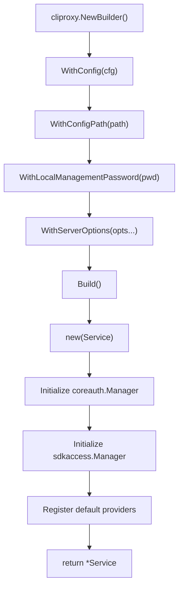
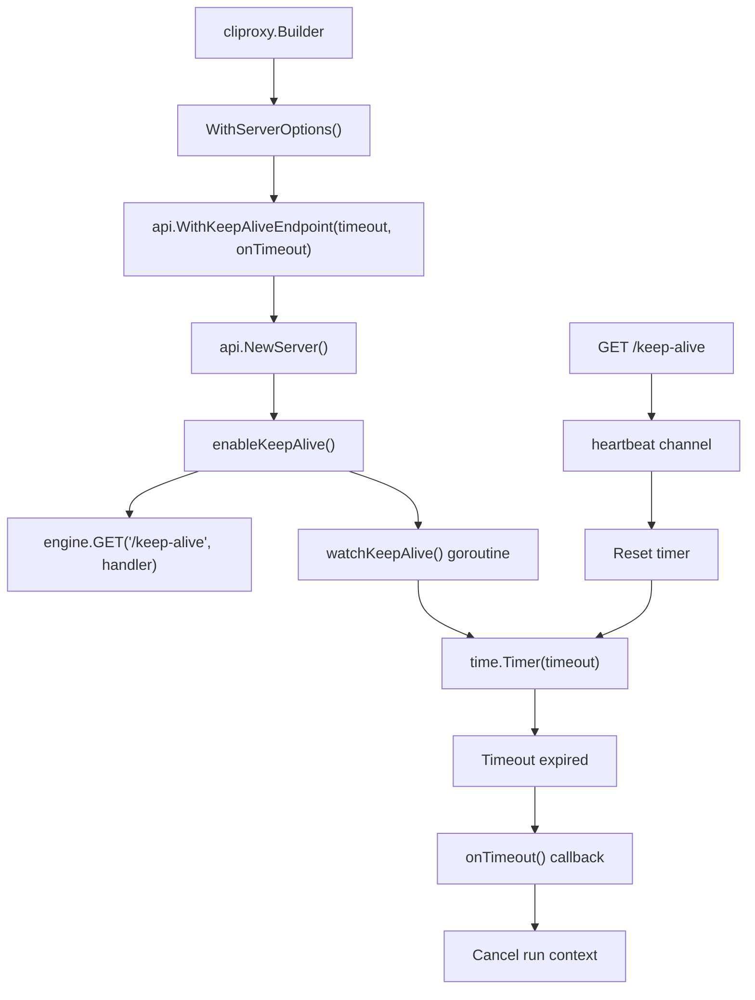
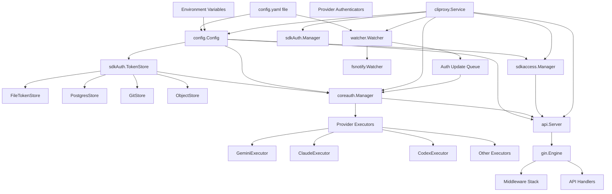
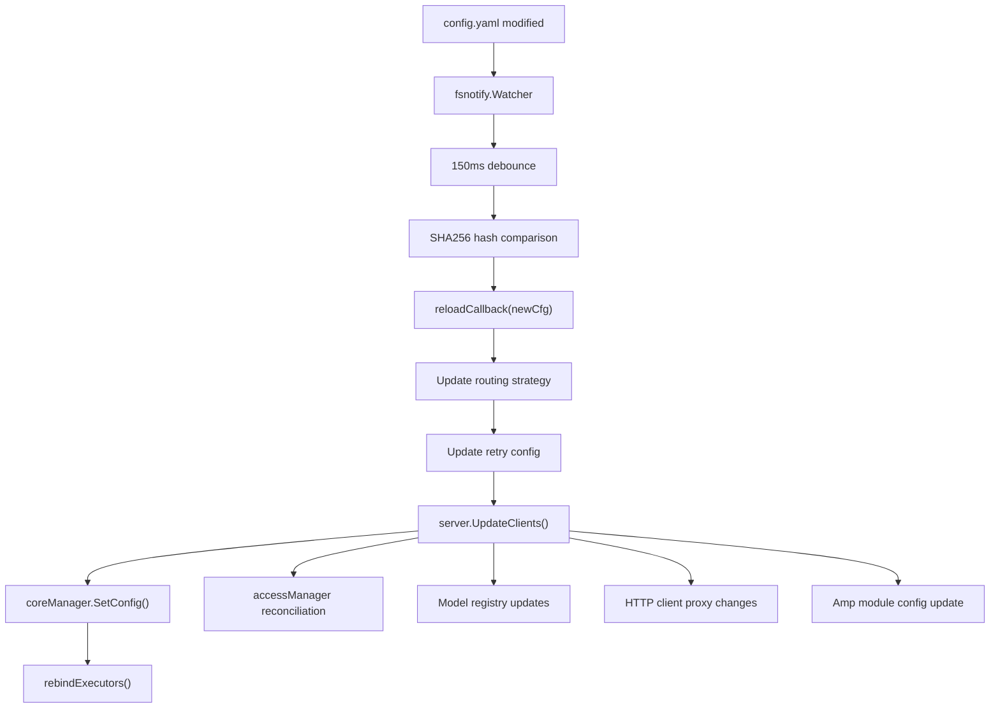

# 服务生命周期与初始化

相关源文件

-   [config.example.yaml](https://github.com/router-for-me/CLIProxyAPI/blob/c66cb0af/config.example.yaml)
-   [docs/sdk-access.md](https://github.com/router-for-me/CLIProxyAPI/blob/c66cb0af/docs/sdk-access.md)
-   [docs/sdk-access\_CN.md](https://github.com/router-for-me/CLIProxyAPI/blob/c66cb0af/docs/sdk-access_CN.md)
-   [internal/access/config\_access/provider.go](https://github.com/router-for-me/CLIProxyAPI/blob/c66cb0af/internal/access/config_access/provider.go)
-   [internal/access/reconcile.go](https://github.com/router-for-me/CLIProxyAPI/blob/c66cb0af/internal/access/reconcile.go)
-   [internal/api/handlers/management/config\_basic.go](https://github.com/router-for-me/CLIProxyAPI/blob/c66cb0af/internal/api/handlers/management/config_basic.go)
-   [internal/api/handlers/management/config\_lists.go](https://github.com/router-for-me/CLIProxyAPI/blob/c66cb0af/internal/api/handlers/management/config_lists.go)
-   [internal/api/server.go](https://github.com/router-for-me/CLIProxyAPI/blob/c66cb0af/internal/api/server.go)
-   [internal/cmd/login.go](https://github.com/router-for-me/CLIProxyAPI/blob/c66cb0af/internal/cmd/login.go)
-   [internal/cmd/run.go](https://github.com/router-for-me/CLIProxyAPI/blob/c66cb0af/internal/cmd/run.go)
-   [internal/config/config.go](https://github.com/router-for-me/CLIProxyAPI/blob/c66cb0af/internal/config/config.go)
-   [internal/watcher/watcher.go](https://github.com/router-for-me/CLIProxyAPI/blob/c66cb0af/internal/watcher/watcher.go)
-   [sdk/access/errors.go](https://github.com/router-for-me/CLIProxyAPI/blob/c66cb0af/sdk/access/errors.go)
-   [sdk/access/manager.go](https://github.com/router-for-me/CLIProxyAPI/blob/c66cb0af/sdk/access/manager.go)
-   [sdk/access/registry.go](https://github.com/router-for-me/CLIProxyAPI/blob/c66cb0af/sdk/access/registry.go)
-   [sdk/cliproxy/builder.go](https://github.com/router-for-me/CLIProxyAPI/blob/c66cb0af/sdk/cliproxy/builder.go)
-   [sdk/cliproxy/service.go](https://github.com/router-for-me/CLIProxyAPI/blob/c66cb0af/sdk/cliproxy/service.go)
-   [sdk/config/config.go](https://github.com/router-for-me/CLIProxyAPI/blob/c66cb0af/sdk/config/config.go)
-   [test/amp\_management\_test.go](https://github.com/router-for-me/CLIProxyAPI/blob/c66cb0af/test/amp_management_test.go)

本文档描述了 CLIProxyAPI 服务的完整生命周期，从初始配置到优雅关闭。它涵盖了用于服务构建的生成器（Builder）模式、多阶段初始化序列、组件依赖关系以及关闭过程。

有关配置文件如何加载和验证的信息，请参阅[初始配置](/router-for-me/CLIProxyAPI/2.2-initial-configuration)。有关初始化后 HTTP 服务器请求管道的详情，请参阅[HTTP 服务器与请求管道](/router-for-me/CLIProxyAPI/3.2-http-server-and-request-pipeline)。有关身份验证凭证生命周期管理的详情，请参阅[身份验证与凭证管理](/router-for-me/CLIProxyAPI/3.3-authentication-and-credential-management)。

---

## 概览

CLIProxyAPI 服务使用**生成器（Builder）模式**进行构建，并遵循定义明确的初始化序列，确保所有组件在接受请求之前均已就绪。服务通过四个不同的阶段管理其生命周期：

1.  **构建阶段 (Construction Phase)**：通过 `Builder` 进行配置、选项累积、组件工厂注册。
2.  **初始化阶段 (Initialization Phase)**：身份验证、HTTP 服务器、文件观察器和后台工作程序的顺序启动。
3.  **运行阶段 (Runtime Phase)**：请求处理、热重载、信号监控。
4.  **关闭阶段 (Shutdown Phase)**：具有基于上下文（context）超时控制的优雅清理。

主要入口点是 [\`cliproxy.NewBuilder()\`](https://github.com/router-for-me/CLIProxyAPI/blob/c66cb0af/`cliproxy.NewBuilder()`)，它返回一个用于累积配置选项的 `Builder` 实例。一旦构建完成，[\`Service.Run()\`](https://github.com/router-for-me/CLIProxyAPI/blob/c66cb0af/`Service.Run()`) 方法将执行初始化序列并阻塞，直到收到关闭信号。

**来源**：[sdk/cliproxy/service.go1-677](https://github.com/router-for-me/CLIProxyAPI/blob/c66cb0af/sdk/cliproxy/service.go#L1-L677) [internal/cmd/run.go1-71](https://github.com/router-for-me/CLIProxyAPI/blob/c66cb0af/internal/cmd/run.go#L1-L71)

---

## 生成器模式与服务构建

### 生成器配置

[\`sdk/cliproxy/builder.go\`](https://github.com/router-for-me/CLIProxyAPI/blob/c66cb0af/`sdk/cliproxy/builder.go`) 中的 `Builder` 类型实现了一个流式 API，用于在初始化前配置服务。关键的生成器方法包括：

| 方法 | 用途 | 配置目标 |
| --- | --- | --- |
| `WithConfig()` | 设置应用程序配置 | [\`config.Config\`](https://github.com/router-for-me/CLIProxyAPI/blob/c66cb0af/`config.Config`) |
| `WithConfigPath()` | 设置 config.yaml 的路径 | 文件系统位置 |
| `WithLocalManagementPassword()` | 设置仅限运行时的管理密码 | 管理 API 身份验证 |
| `WithServerOptions()` | 添加 HTTP 服务器自定义 | [\`api.ServerOption\`](https://github.com/router-for-me/CLIProxyAPI/blob/c66cb0af/`api.ServerOption`) 变长参数函数 |
| `WithHooks()` | 注册生命周期回调 | `OnBeforeStart`, `OnAfterStart` |

生成器将实际构建推迟到调用 `Build()` 时，从而允许从多个来源（命令行标志、环境变量、默认值）累积选项。


**图表 1**：服务构建的生成器模式流程。生成器在创建 Service 实例之前累积选项。

**来源**：[sdk/cliproxy/builder.go](https://github.com/router-for-me/CLIProxyAPI/blob/c66cb0af/sdk/cliproxy/builder.go) [internal/cmd/run.go27-56](https://github.com/router-for-me/CLIProxyAPI/blob/c66cb0af/internal/cmd/run.go#L27-L56)

### Service 结构体组件

[\`Service\`](https://github.com/router-for-me/CLIProxyAPI/blob/c66cb0af/`Service`) 结构体封装了所有运行时组件：

```
type Service struct {    cfg          *config.Config           // 当前配置    configPath   string                   // config.yaml 路径    server       *api.Server              // HTTP API 服务器    watcher      *WatcherWrapper          // 文件系统观察器    authManager  *sdkAuth.Manager         // 旧版身份验证管理器    accessManager *sdkaccess.Manager      // 请求身份验证    coreManager  *coreauth.Manager        // 核心认证与执行    wsGateway    *wsrelay.Manager         // WebSocket 网关    // ... 用于生命周期控制的其他字段}
```
每个组件都有特定的初始化顺序和生命周期管理职责。

**来源**：[sdk/cliproxy/service.go29-89](https://github.com/router-for-me/CLIProxyAPI/blob/c66cb0af/sdk/cliproxy/service.go#L29-L89)

---

## 初始化序列

### 启动流程

[\`Service.Run(ctx)\`](https://github.com/router-for-me/CLIProxyAPI/blob/c66cb0af/`Service.Run(ctx)`) 方法编排完整的初始化序列。下图显示了主要组件的顺序初始化过程：

> **[Mermaid sequence]**
> *(图表结构无法解析)*

**图表 2**：从生成器构建到运行状态的完整初始化序列。

**来源**：[sdk/cliproxy/service.go412-594](https://github.com/router-for-me/CLIProxyAPI/blob/c66cb0af/sdk/cliproxy/service.go#L412-L594) [internal/cmd/run.go27-56](https://github.com/router-for-me/CLIProxyAPI/blob/c66cb0af/internal/cmd/run.go#L27-L56)

### 详细初始化步骤

#### 步骤 1：使用情况统计初始化

[\`usage.StartDefault(ctx)\`](https://github.com/router-for-me/CLIProxyAPI/blob/c66cb0af/`usage.StartDefault(ctx)`) 初始化全局使用情况跟踪子系统，当配置中 `usage-statistics-enabled` 为 true 时，该子系统会聚合令牌消耗和请求指标。

**来源**：[sdk/cliproxy/service.go420](https://github.com/router-for-me/CLIProxyAPI/blob/c66cb0af/sdk/cliproxy/service.go#L420-L420)

#### 步骤 2：身份验证目录创建

[\`ensureAuthDir()\`](https://github.com/router-for-me/CLIProxyAPI/blob/c66cb0af/`ensureAuthDir()`) 验证配置的 `auth-dir` 是否存在且为目录，如果缺失则以 `0755` 权限创建。此目录存储 OAuth 令牌文件和服务账号 JSON 文件。

**来源**：[sdk/cliproxy/service.go430-676](https://github.com/router-for-me/CLIProxyAPI/blob/c66cb0af/sdk/cliproxy/service.go#L430-L676)

#### 步骤 3：重试配置

[\`applyRetryConfig(cfg)\`](https://github.com/router-for-me/CLIProxyAPI/blob/c66cb0af/`applyRetryConfig(cfg)`) 将配置中的 `request-retry` 和 `max-retry-interval` 设置传播到核心身份验证管理器，后者在执行供应商请求时使用这些值。

**来源**：[sdk/cliproxy/service.go434](https://github.com/router-for-me/CLIProxyAPI/blob/c66cb0af/sdk/cliproxy/service.go#L434-L434)

#### 步骤 4：核心认证管理器加载

[\`coreManager.Load(ctx)\`](https://github.com/router-for-me/CLIProxyAPI/blob/c66cb0af/`coreManager.Load(ctx)`) 从配置的令牌存储后端（文件、Postgres、Git 或 S3）读取现有的身份验证凭证。每个加载的凭证都在核心认证管理器的内部注册表中注册。

**来源**：[sdk/cliproxy/service.go436-440](https://github.com/router-for-me/CLIProxyAPI/blob/c66cb0af/sdk/cliproxy/service.go#L436-L440)

#### 步骤 5：令牌与 API 密钥供应商

服务委派给供应商接口来加载凭证：

-   [\`TokenClientProvider.Load(ctx, cfg)\`](https://github.com/router-for-me/CLIProxyAPI/blob/c66cb0af/`TokenClientProvider.Load(ctx, cfg)`): 从令牌存储加载基于 OAuth 的客户端。
-   [\`APIKeyClientProvider.Load(ctx, cfg)\`](https://github.com/router-for-me/CLIProxyAPI/blob/c66cb0af/`APIKeyClientProvider.Load(ctx, cfg)`): 从配置中加载基于 API 密钥的客户端。

这些供应商返回的结果在历史上用于创建旧版客户端对象，但在当前实现中，凭证由核心认证管理器管理。

**来源**：[sdk/cliproxy/service.go442-456](https://github.com/router-for-me/CLIProxyAPI/blob/c66cb0af/sdk/cliproxy/service.go#L442-L456)

#### 步骤 6：HTTP 服务器创建

[\`api.NewServer(cfg, coreManager, accessManager, configPath, opts...)\`](https://github.com/router-for-me/CLIProxyAPI/blob/c66cb0af/`api.NewServer(cfg, coreManager, accessManager, configPath, opts...)`) 构建包含所有组件的 HTTP 服务器：

1.  **Gin 引擎设置**：根据 `cfg.Debug` 设置 release/debug 模式 [(185-201)](https://github.com/router-for-me/CLIProxyAPI/blob/c66cb0af/(185-201))。
2.  **中间件注册**：添加日志记录、恢复（recovery）、CORS、请求日志记录 [(202-226)](https://github.com/router-for-me/CLIProxyAPI/blob/c66cb0af/(202-226))。
3.  **处理器（Handler）初始化**：创建 OpenAI、Gemini、Claude API 处理器 [(238-239)](https://github.com/router-for-me/CLIProxyAPI/blob/c66cb0af/(238-239))。
4.  **路由注册**：调用 `setupRoutes()` 定义所有 API 端点 [(268)](https://github.com/router-for-me/CLIProxyAPI/blob/c66cb0af/(268))。
5.  **管理路由**：如果配置了 secret key，则有条件地注册管理 API [(287-292)](https://github.com/router-for-me/CLIProxyAPI/blob/c66cb0af/(287-292))。
6.  **HTTP 服务器创建**：将 Gin 引擎包装在 `http.Server` 中 [(298-302)](https://github.com/router-for-me/CLIProxyAPI/blob/c66cb0af/(298-302))。

**来源**：[internal/api/server.go185-305](https://github.com/router-for-me/CLIProxyAPI/blob/c66cb0af/internal/api/server.go#L185-L305) [sdk/cliproxy/service.go461](https://github.com/router-for-me/CLIProxyAPI/blob/c66cb0af/sdk/cliproxy/service.go#L461-L461)

#### 步骤 7：WebSocket 网关设置

[\`ensureWebsocketGateway()\`](https://github.com/router-for-me/CLIProxyAPI/blob/c66cb0af/`ensureWebsocketGateway()`) 为 AI Studio 运行时身份验证创建一个 WebSocket 中继管理器。该网关附加到 `/v1/ws` 处的 HTTP 服务器，并管理基于 WebSocket 的供应商的临时凭证。

**来源**：[sdk/cliproxy/service.go467-486](https://github.com/router-for-me/CLIProxyAPI/blob/c66cb0af/sdk/cliproxy/service.go#L467-L486)

#### 步骤 8：服务器启动

HTTP 服务器在后台 goroutine 中启动 [(493-499)](https://github.com/router-for-me/CLIProxyAPI/blob/c66cb0af/(493-499))，允许主初始化序列继续。服务器在调用 `Start()` 后立即开始接受连接。

**来源**：[sdk/cliproxy/service.go493-502](https://github.com/router-for-me/CLIProxyAPI/blob/c66cb0af/sdk/cliproxy/service.go#L493-L502)

#### 步骤 9：文件观察器初始化

观察器通过工厂函数创建 [(562-566)](https://github.com/router-for-me/CLIProxyAPI/blob/c66cb0af/(562-566)) 并使用其自身的上下文启动 [(573-577)](https://github.com/router-for-me/CLIProxyAPI/blob/c66cb0af/(573-577))。它监视：

-   **配置文件**：当 `config.yaml` 更改时触发 `reloadCallback`。
-   **身份验证目录**：检测新/修改/删除的身份验证文件并发出 `AuthUpdate` 事件。

**来源**：[sdk/cliproxy/service.go562-579](https://github.com/router-for-me/CLIProxyAPI/blob/c66cb0af/sdk/cliproxy/service.go#L562-L579) [internal/watcher/watcher.go1-148](https://github.com/router-for-me/CLIProxyAPI/blob/c66cb0af/internal/watcher/watcher.go#L1-L148)

#### 步骤 10：自动刷新工作程序

[\`coreManager.StartAutoRefresh(ctx, 15\*time.Minute)\`](https://github.com/router-for-me/CLIProxyAPI/blob/c66cb0af/`coreManager.StartAutoRefresh(ctx, 15*time.Minute)`) 启动一个后台 goroutine，定期检查所有已注册凭证的令牌过期情况，并在其失效前进行刷新。

**来源**：[sdk/cliproxy/service.go581-585](https://github.com/router-for-me/CLIProxyAPI/blob/c66cb0af/sdk/cliproxy/service.go#L581-L585)

---

## 信号处理与保持活动 (Keep-Alive)

### 通过信号优雅关闭

服务使用 `signal.NotifyContext()` 监听操作系统信号 [(33-34)](https://github.com/router-for-me/CLIProxyAPI/blob/c66cb0af/(33-34))：

```
ctxSignal, cancel := signal.NotifyContext(context.Background(),     syscall.SIGINT, syscall.SIGTERM)defer cancel()
```
当收到信号时，上下文将被取消，并级联到所有组件：

1.  `Service.Run()` 退出其阻塞的 select 语句 [(587-593)](https://github.com/router-for-me/CLIProxyAPI/blob/c66cb0af/(587-593))。
2.  延迟调用的 `Shutdown(ctx)` 执行清理 [(423-428)](https://github.com/router-for-me/CLIProxyAPI/blob/c66cb0af/(423-428))。
3.  所有后台工作程序观察到上下文取消并终止。

**来源**：[internal/cmd/run.go33-34](https://github.com/router-for-me/CLIProxyAPI/blob/c66cb0af/internal/cmd/run.go#L33-L34) [sdk/cliproxy/service.go587-593](https://github.com/router-for-me/CLIProxyAPI/blob/c66cb0af/sdk/cliproxy/service.go#L587-L593)

### 保持活动 (Keep-Alive) 机制

保持活动特性支持在一段时间不活动后自动关闭，这对于开发环境或短期运行的服务器实例非常有用。


**图表 3**：不活动后自动关闭的保持活动机制。

#### 保持活动实现

保持活动端点通过 [\`api.WithKeepAliveEndpoint(timeout, onTimeout)\`](https://github.com/router-for-me/CLIProxyAPI/blob/c66cb0af/`api.WithKeepAliveEndpoint(timeout, onTimeout)`) 配置：

```
builder.WithServerOptions(api.WithKeepAliveEndpoint(10*time.Second, func() {    log.Warn("保持活动端点空闲 10 秒，正在关闭")    keepAliveCancel() // 取消运行上下文}))
```
启用后，服务器会：

1.  注册一个 `GET /keep-alive` 端点 [(681)](https://github.com/router-for-me/CLIProxyAPI/blob/c66cb0af/(681))。
2.  启动一个带有定时器的 `watchKeepAlive()` goroutine [(718-746)](https://github.com/router-for-me/CLIProxyAPI/blob/c66cb0af/(718-746))。
3.  在每次对 `/keep-alive` 的请求时重置定时器 [(734-741)](https://github.com/router-for-me/CLIProxyAPI/blob/c66cb0af/(734-741))。
4.  如果定时器到期且未重置，则调用 `onTimeout()` 回调 [(728-732)](https://github.com/router-for-me/CLIProxyAPI/blob/c66cb0af/(728-732))。

**来源**：[internal/api/server.go95-746](https://github.com/router-for-me/CLIProxyAPI/blob/c66cb0af/internal/api/server.go#L95-L746) [internal/cmd/run.go38-44](https://github.com/router-for-me/CLIProxyAPI/blob/c66cb0af/internal/cmd/run.go#L38-L44)

---

## 组件依赖关系

下图展示了初始化期间主要服务组件之间的依赖关系：


**图表 4**：显示初始化顺序约束的组件依赖图。组件按自上而下的顺序初始化，并遵循依赖关系。

**来源**：[sdk/cliproxy/service.go29-89](https://github.com/router-for-me/CLIProxyAPI/blob/c66cb0af/sdk/cliproxy/service.go#L29-L89) [internal/api/server.go114-173](https://github.com/router-for-me/CLIProxyAPI/blob/c66cb0af/internal/api/server.go#L114-L173)

---

## 关闭序列

### 优雅关闭过程

[\`Service.Shutdown(ctx)\`](https://github.com/router-for-me/CLIProxyAPI/blob/c66cb0af/`Service.Shutdown(ctx)`) 方法确保所有组件都被清洁地停止：

> **[Mermaid sequence]**
> *(图表结构无法解析)*

**图表 5**：确保所有组件都被清洁地停止的优雅关闭序列。

**来源**：[sdk/cliproxy/service.go605-658](https://github.com/router-for-me/CLIProxyAPI/blob/c66cb0af/sdk/cliproxy/service.go#L605-L658)

### 关闭步骤详情

1.  **观察器上下文取消** [(617-619)](https://github.com/router-for-me/CLIProxyAPI/blob/c66cb0af/(617-619)): 立即停止文件系统监控。
2.  **核心认证自动刷新停止** [(620-622)](https://github.com/router-for-me/CLIProxyAPI/blob/c66cb0af/(620-622)): 终止令牌刷新工作程序。
3.  **观察器停止** [(623-628)](https://github.com/router-for-me/CLIProxyAPI/blob/c66cb0af/(623-628)): 关闭 fsnotify 观察器并进行清理。
4.  **WebSocket 网关停止** [(629-636)](https://github.com/router-for-me/CLIProxyAPI/blob/c66cb0af/(629-636)): 终止所有活动的 WebSocket 连接。
5.  **身份验证队列取消** [(637-640)](https://github.com/router-for-me/CLIProxyAPI/blob/c66cb0af/(637-640)): 停止身份验证更新处理 goroutine。
6.  **HTTP 服务器优雅关闭** [(644-653)](https://github.com/router-for-me/CLIProxyAPI/blob/c66cb0af/(644-653)): 等待最多 30 秒以完成活动请求。
7.  **使用情况统计停止** [(655)](https://github.com/router-for-me/CLIProxyAPI/blob/c66cb0af/(655)): 刷盘（flush）聚合的统计数据。

关闭过程使用 [\`sync.Once\`](https://github.com/router-for-me/CLIProxyAPI/blob/c66cb0af/`sync.Once`) 来确保幂等关闭——多次调用 `Shutdown()` 是安全的。

**来源**：[sdk/cliproxy/service.go605-658](https://github.com/router-for-me/CLIProxyAPI/blob/c66cb0af/sdk/cliproxy/service.go#L605-L658)

### HTTP 服务器关闭详情

HTTP 服务器的 [\`Stop(ctx)\`](https://github.com/router-for-me/CLIProxyAPI/blob/c66cb0af/`Stop(ctx)`) 方法：

1.  发信号通知保持活动（keep-alive）观察器终止 [(810-815)](https://github.com/router-for-me/CLIProxyAPI/blob/c66cb0af/(810-815))。
2.  使用提供的上下文调用 `http.Server.Shutdown(ctx)` [(818)](https://github.com/router-for-me/CLIProxyAPI/blob/c66cb0af/(818))。
3.  等待所有活动连接关闭或上下文超时。
4.  如果关闭失败则返回错误 [(818-820)](https://github.com/router-for-me/CLIProxyAPI/blob/c66cb0af/(818-820))。

默认关闭超时时间为 30 秒 [(422)](https://github.com/router-for-me/CLIProxyAPI/blob/c66cb0af/(422))，但可以由传递给 `Shutdown()` 的上下文覆盖。

**来源**：[internal/api/server.go807-824](https://github.com/router-for-me/CLIProxyAPI/blob/c66cb0af/internal/api/server.go#L807-L824) [sdk/cliproxy/service.go422](https://github.com/router-for-me/CLIProxyAPI/blob/c66cb0af/sdk/cliproxy/service.go#L422-L422)

---

## 配置重载

### 热重载架构

文件观察器触发配置重载而无需重启服务。当 `config.yaml` 更改时，观察器调用一个回调函数来更新所有组件：


**图表 6**：由文件系统事件触发的配置热重载流程。更新会传播到所有组件而无需重启服务。

**来源**：[sdk/cliproxy/service.go508-560](https://github.com/router-for-me/CLIProxyAPI/blob/c66cb0af/sdk/cliproxy/service.go#L508-L560) [internal/watcher/watcher.go1-148](https://github.com/router-for-me/CLIProxyAPI/blob/c66cb0af/internal/watcher/watcher.go#L1-L148)

### 重载回调实现

`Service.Run()` 中的 [\`reloadCallback\`](https://github.com/router-for-me/CLIProxyAPI/blob/c66cb0af/`reloadCallback`) 函数：

1.  **策略更新** [(510-546)](https://github.com/router-for-me/CLIProxyAPI/blob/c66cb0af/(510-546)): 更改凭证选择策略（轮询 ↔ 优先填满）。
2.  **重试配置** [(548)](https://github.com/router-for-me/CLIProxyAPI/blob/c66cb0af/(548)): 更新重试次数和间隔。
3.  **服务器更新** [(549-551)](https://github.com/router-for-me/CLIProxyAPI/blob/c66cb0af/(549-551)): 调用 `server.UpdateClients()` 来刷新所有处理器。
4.  **核心认证配置** [(552-558)](https://github.com/router-for-me/CLIProxyAPI/blob/c66cb0af/(552-558)): 更新配置和 OAuth 模型别名。
5.  **执行器重新绑定** [(559)](https://github.com/router-for-me/CLIProxyAPI/blob/c66cb0af/(559)): 使用更新后的配置重新注册执行器。

`server.UpdateClients()` 方法 [(internal/api/server.go861-1002](https://github.com/router-for-me/CLIProxyAPI/blob/c66cb0af/(internal/api/server.go#L861-L1002)) 执行广泛的差分更新：

-   访问供应商协调
-   请求日志记录器启用/禁用
-   日志输出重新配置
-   基于 secret key 更改的管理路由启用/禁用
-   Amp 模块配置更新

有关热重载系统的完整详情，请参阅[热重载与配置更新](/router-for-me/CLIProxyAPI/3.7-hot-reload-and-configuration-updates)。

**来源**：[sdk/cliproxy/service.go508-560](https://github.com/router-for-me/CLIProxyAPI/blob/c66cb0af/sdk/cliproxy/service.go#L508-L560) [internal/api/server.go861-1002](https://github.com/router-for-me/CLIProxyAPI/blob/c66cb0af/internal/api/server.go#L861-L1002)

---

## 错误处理与恢复

### 初始化错误处理

初始化序列使用感知上下文（context-aware）的错误处理。如果任何关键组件初始化失败，服务将从 `Run()` 返回错误：

```
if err := s.ensureAuthDir(); err != nil {    return err  // 致命：没有身份验证目录无法继续} if errLoad := s.coreManager.Load(ctx); errLoad != nil {    log.Warnf("无法加载认证存储: %v", errLoad)    // 非致命：使用空的认证存储继续}
```
关键故障（身份验证目录、服务器绑定）会终止初始化。非关键故障（身份验证存储加载、观察器启动问题）会被记录下来，但允许服务继续运行。

**来源**：[sdk/cliproxy/service.go430-577](https://github.com/router-for-me/CLIProxyAPI/blob/c66cb0af/sdk/cliproxy/service.go#L430-L577)

### 运行时错误恢复

HTTP 服务器包含了 Gin 的恢复中间件 [(205)](https://github.com/router-for-me/CLIProxyAPI/blob/c66cb0af/(205))，该中间件会：

1.  捕获请求处理器中的 panic。
2.  记录带有堆栈跟踪的 panic。
3.  向客户端返回 `500 Internal Server Error`。
4.  防止 panic 导致整个服务器崩溃。

这确保了单个请求中的错误不会影响其他并发请求，也不会导致服务中断。

**来源**：[internal/api/server.go205](https://github.com/router-for-me/CLIProxyAPI/blob/c66cb0af/internal/api/server.go#L205-L205)

### 关闭错误聚合

`Shutdown()` 方法聚合来自所有组件关闭的错误 [(609, 626-627, 632-634, 648-651)](https://github.com/router-for-me/CLIProxyAPI/blob/c66cb0af/(609, 626-627, 632-634, 648-651))，返回遇到的第一个错误，同时继续关闭剩余组件。这确保了即使某些组件关闭失败，也会尝试对所有组件进行清理。

**来源**：[sdk/cliproxy/service.go605-658](https://github.com/router-for-me/CLIProxyAPI/blob/c66cb0af/sdk/cliproxy/service.go#L605-L658)

---

## 总结

CLIProxyAPI 服务生命周期遵循定义明确的模式：

1.  **构建**：生成器模式累积配置选项。
2.  **初始化**：顺序启动确保依赖顺序。
3.  **运行时**：并发请求处理、热重载、信号监控。
4.  **关闭**：带有超时控制的优雅清理。

核心设计原则：

-   **快速失败 (Fail Fast)**：关键初始化失败将中止启动。
-   **优雅降级 (Degrade Gracefully)**：非关键失败允许部分运行。
-   **上下文传播 (Context Propagation)**：取消信号级联到所有组件。
-   **幂等关闭 (Idempotent Shutdown)**：通过 `sync.Once` 可以安全地多次调用。
-   **热重载 (Hot Reload)**：配置更改无需重启即可传播。

服务通过差分重载回调实现零停机配置更新，并支持长期运行的服务器部署以及带有保持活动（keep-alive）超时的开发场景。

**来源**：[sdk/cliproxy/service.go1-677](https://github.com/router-for-me/CLIProxyAPI/blob/c66cb0af/sdk/cliproxy/service.go#L1-L677) [internal/api/server.go1-1049](https://github.com/router-for-me/CLIProxyAPI/blob/c66cb0af/internal/api/server.go#L1-L1049) [internal/cmd/run.go1-71](https://github.com/router-for-me/CLIProxyAPI/blob/c66cb0af/internal/cmd/run.go#L1-L71)
