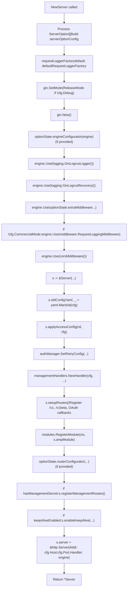
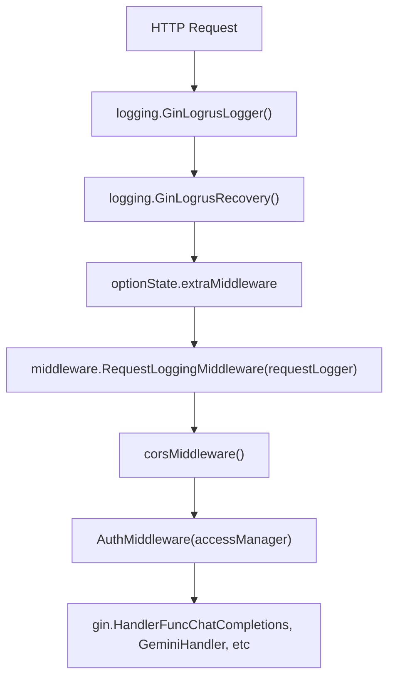
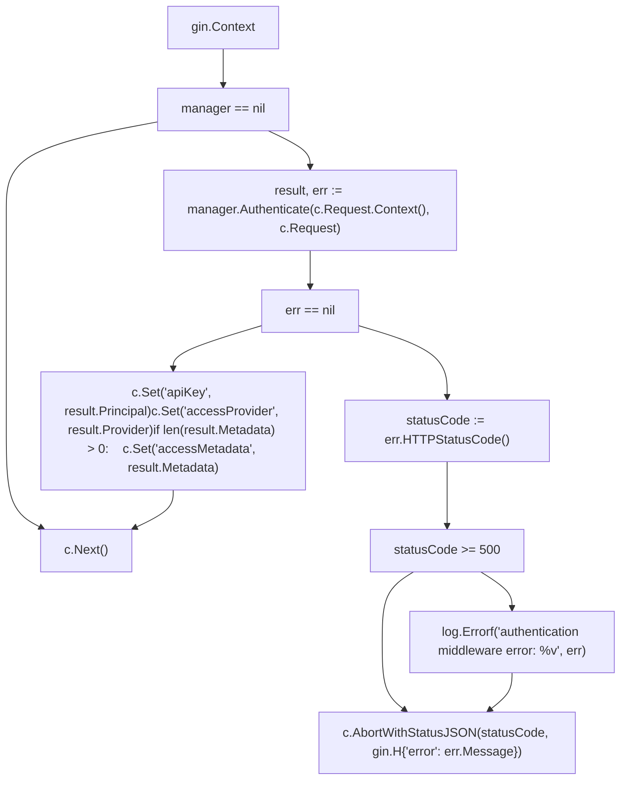
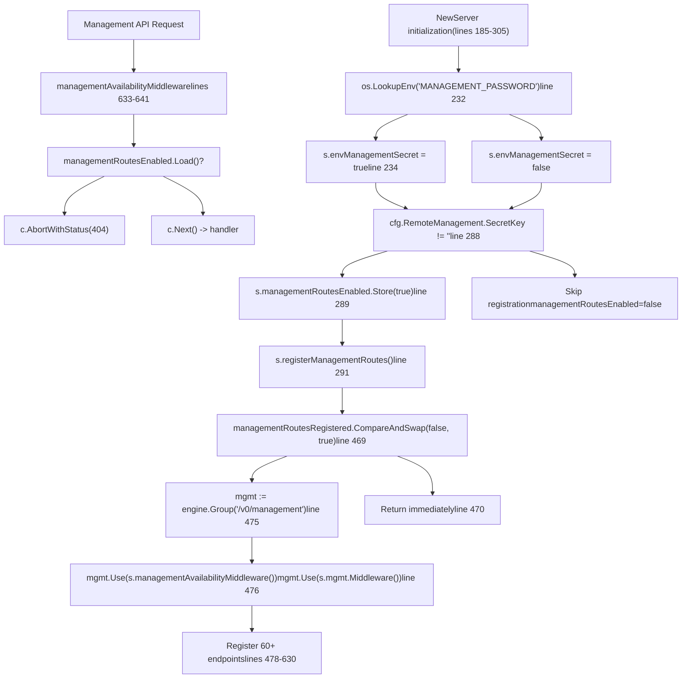
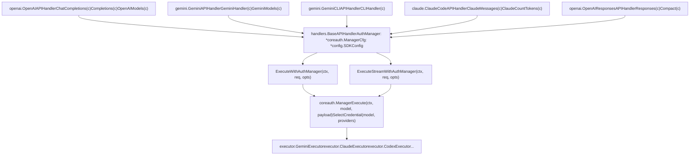
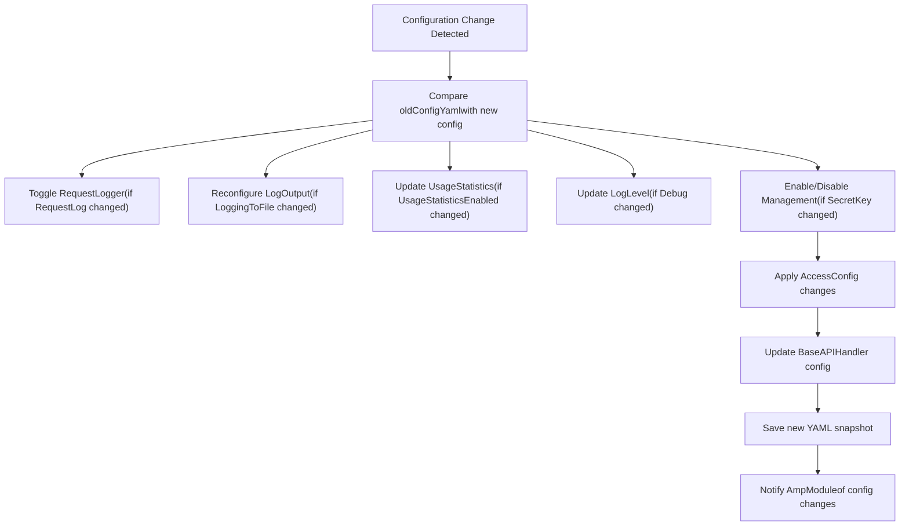
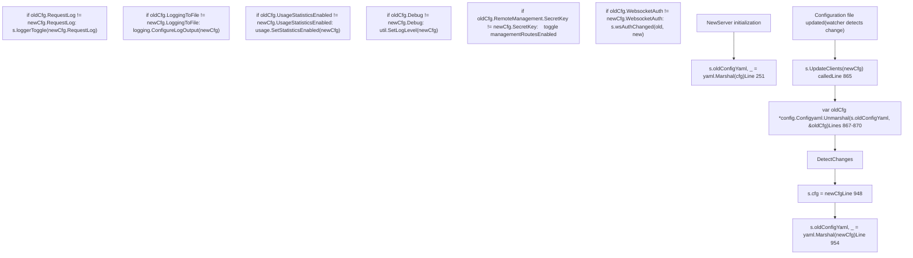

# HTTP 服务器与请求管道

相关源文件

-   [config.example.yaml](https://github.com/router-for-me/CLIProxyAPI/blob/c66cb0af/config.example.yaml)
-   [internal/api/handlers/management/config\_basic.go](https://github.com/router-for-me/CLIProxyAPI/blob/c66cb0af/internal/api/handlers/management/config_basic.go)
-   [internal/api/handlers/management/config\_lists.go](https://github.com/router-for-me/CLIProxyAPI/blob/c66cb0af/internal/api/handlers/management/config_lists.go)
-   [internal/api/middleware/request\_logging\_test.go](https://github.com/router-for-me/CLIProxyAPI/blob/c66cb0af/internal/api/middleware/request_logging_test.go)
-   [internal/api/middleware/response\_writer\_test.go](https://github.com/router-for-me/CLIProxyAPI/blob/c66cb0af/internal/api/middleware/response_writer_test.go)
-   [internal/api/server.go](https://github.com/router-for-me/CLIProxyAPI/blob/c66cb0af/internal/api/server.go)
-   [internal/config/config.go](https://github.com/router-for-me/CLIProxyAPI/blob/c66cb0af/internal/config/config.go)
-   [internal/config/sdk\_config.go](https://github.com/router-for-me/CLIProxyAPI/blob/c66cb0af/internal/config/sdk_config.go)
-   [internal/runtime/executor/codex\_websockets\_executor.go](https://github.com/router-for-me/CLIProxyAPI/blob/c66cb0af/internal/runtime/executor/codex_websockets_executor.go)
-   [internal/watcher/watcher.go](https://github.com/router-for-me/CLIProxyAPI/blob/c66cb0af/internal/watcher/watcher.go)
-   [sdk/api/handlers/claude/code\_handlers.go](https://github.com/router-for-me/CLIProxyAPI/blob/c66cb0af/sdk/api/handlers/claude/code_handlers.go)
-   [sdk/api/handlers/gemini/gemini\_handlers.go](https://github.com/router-for-me/CLIProxyAPI/blob/c66cb0af/sdk/api/handlers/gemini/gemini_handlers.go)
-   [sdk/api/handlers/handlers.go](https://github.com/router-for-me/CLIProxyAPI/blob/c66cb0af/sdk/api/handlers/handlers.go)
-   [sdk/api/handlers/handlers\_stream\_bootstrap\_test.go](https://github.com/router-for-me/CLIProxyAPI/blob/c66cb0af/sdk/api/handlers/handlers_stream_bootstrap_test.go)
-   [sdk/api/handlers/header\_filter.go](https://github.com/router-for-me/CLIProxyAPI/blob/c66cb0af/sdk/api/handlers/header_filter.go)
-   [sdk/api/handlers/header\_filter\_test.go](https://github.com/router-for-me/CLIProxyAPI/blob/c66cb0af/sdk/api/handlers/header_filter_test.go)
-   [sdk/api/handlers/openai/openai\_handlers.go](https://github.com/router-for-me/CLIProxyAPI/blob/c66cb0af/sdk/api/handlers/openai/openai_handlers.go)
-   [sdk/api/handlers/openai/openai\_responses\_handlers.go](https://github.com/router-for-me/CLIProxyAPI/blob/c66cb0af/sdk/api/handlers/openai/openai_responses_handlers.go)
-   [sdk/api/handlers/openai/openai\_responses\_handlers\_stream\_error\_test.go](https://github.com/router-for-me/CLIProxyAPI/blob/c66cb0af/sdk/api/handlers/openai/openai_responses_handlers_stream_error_test.go)
-   [sdk/api/handlers/openai/openai\_responses\_websocket.go](https://github.com/router-for-me/CLIProxyAPI/blob/c66cb0af/sdk/api/handlers/openai/openai_responses_websocket.go)
-   [sdk/api/handlers/openai\_responses\_stream\_error.go](https://github.com/router-for-me/CLIProxyAPI/blob/c66cb0af/sdk/api/handlers/openai_responses_stream_error.go)
-   [sdk/api/handlers/openai\_responses\_stream\_error\_test.go](https://github.com/router-for-me/CLIProxyAPI/blob/c66cb0af/sdk/api/handlers/openai_responses_stream_error_test.go)
-   [sdk/cliproxy/auth/conductor\_executor\_replace\_test.go](https://github.com/router-for-me/CLIProxyAPI/blob/c66cb0af/sdk/cliproxy/auth/conductor_executor_replace_test.go)
-   [sdk/cliproxy/service.go](https://github.com/router-for-me/CLIProxyAPI/blob/c66cb0af/sdk/cliproxy/service.go)
-   [test/amp\_management\_test.go](https://github.com/router-for-me/CLIProxyAPI/blob/c66cb0af/test/amp_management_test.go)

本文档详细介绍了 CLIProxyAPI 中的 HTTP 服务器架构和请求处理管道。它涵盖了服务器初始化、中间件栈、路由注册，以及请求从客户端流向供应商执行器（Provider Executor）的过程。

有关身份验证和凭据管理的详情，请参阅[身份验证与凭证管理](/router-for-me/CLIProxyAPI/3.3-authentication-and-credential-management)。有关供应商执行器的实现，请参阅[供应商执行器系统](/router-for-me/CLIProxyAPI/3.4-provider-executor-system)。有关配置热重载机制，请参阅[服务生命周期与热重载](/router-for-me/CLIProxyAPI/3.1-service-lifecycle-and-initialization)。

---

## 概览

HTTP 服务器基于 Gin Web 框架构建，提供了多个 API 表面：

-   **兼容 OpenAI 的端点** (`/v1/*`)：用于聊天完成（Chat Completions）、完成（Completions）和响应（Responses）API
-   **Gemini 端点** (`/v1beta/*`)：用于原生 Gemini API 格式
-   **Claude 端点** (`/v1/messages`)：用于 Anthropic 风格的 Messages API
-   **管理 API** (`/v0/management/*`)：用于配置和管理
-   **Amp 集成路由** (`/api/provider/:provider/*`)：用于 Amp CLI 代理支持
-   **OAuth 回调端点**：用于完成身份验证流程
-   **WebSocket 中继** (`/v1/ws`)：用于 AI Studio 供应商连接

服务器支持 TLS、热重载、条件中间件和多协议请求翻译。

**来源：** [internal/api/server.go1-307](https://github.com/router-for-me/CLIProxyAPI/blob/c66cb0af/internal/api/server.go#L1-L307)

---

## 服务器结构与初始化

### Server 结构体

`api.Server` 结构体封装了 HTTP 服务器的状态和依赖项：

**标题：Server 结构体字段及其职责**

```mermaid
flowchart TD
    KeepAlive["keepAliveHeartbeatchan struct{}Heartbeat signal"]
    KeepAliveStop["keepAliveStopchan struct{}Shutdown signal"]
    Amp["ampModule*ampmodule.AmpModuleAmp CLI routing"]
    WSRoutes["wsRoutesmap[string]struct{}Registered WS paths"]
    WSAuthEnabled["wsAuthEnabledatomic.BoolWebSocket auth toggle"]
    Engine["engine*gin.EngineRoutes & middleware"]
    HTTPServer["server*http.ServerTCP listener"]
    Handlers["handlers*handlers.BaseAPIHandlerProtocol handlers"]
    AccessMgr["accessManager*sdkaccess.ManagerRequest authentication"]
    ReqLogger["requestLoggerlogging.RequestLoggerRequest/response capture"]
    Config["cfg*config.ConfigCurrent config snapshot"]
    OldYAML["oldConfigYaml[]byteYAML snapshot for diff"]
    ConfigPath["configFilePathstringAbsolute config path"]
    Mgmt["mgmt*managementHandlers.HandlerAdmin API logic"]
    MgmtEnabled["managementRoutesEnabledatomic.BoolDynamic enable/disable"]
    MgmtRegistered["managementRoutesRegisteredatomic.BoolRegistration guard"]
    EnvSecret["envManagementSecretboolMANAGEMENT_PASSWORD set"]

    Engine --> Handlers
    Handlers --> AccessMgr
    Config --> Mgmt
    Mgmt --> MgmtEnabled
```


| 字段 | 类型 | 用途 |
| --- | --- | --- |
| `engine` | `*gin.Engine` | 管理路由和中间件的 Gin 框架实例 |
| `server` | `*http.Server` | 底层带有 TCP 监听器的 Go HTTP 服务器 |
| `handlers` | `*handlers.BaseAPIHandler` | 提供 `ExecuteWithAuthManager` 和 `ExecuteStreamWithAuthManager` 的基础处理器 |
| `cfg` | `*config.Config` | 当前配置快照 |
| `oldConfigYaml` | `[]byte` | 上一个配置的 YAML 序列化快照，用于检测变更 |
| `accessManager` | `*sdkaccess.Manager` | 请求身份验证供应商管理器 |
| `requestLogger` | `logging.RequestLogger` | 请求/响应捕获日志子系统（如果为 `CommercialMode` 则为 nil） |
| `loggerToggle` | `func(bool)` | 通过 `SetEnabled(bool)` 切换请求日志记录器 |
| `configFilePath` | `string` | 用于持久化的 config.yaml 绝对路径 |
| `mgmt` | `*managementHandlers.Handler` | 带有认证中间件的管理 API 处理器 |
| `ampModule` | `*ampmodule.AmpModule` | 用于模型映射和上游代理的 Amp CLI 集成 |
| `managementRoutesRegistered` | `atomic.Bool` | 幂等守卫，防止重复注册路由 |
| `managementRoutesEnabled` | `atomic.Bool` | 运行时标志，控制管理端点的可用性（由中间件检查） |
| `envManagementSecret` | `bool` | 指示是否设置了 `MANAGEMENT_PASSWORD` 环境变量 |
| `wsRoutes` | `map[string]struct{}` | 跟踪已注册的 WebSocket 升级路径 |
| `wsAuthEnabled` | `atomic.Bool` | 与 `cfg.WebsocketAuth` 同步，用于动态切换 WebSocket 认证 |
| `keepAliveHeartbeat` | `chan struct{}` | 向看门狗（watchdog）goroutine 发送心跳信号 |
| `keepAliveStop` | `chan struct{}` | 向看门狗 goroutine 发送关闭信号 |

**来源：** [internal/api/server.go114-173](https://github.com/router-for-me/CLIProxyAPI/blob/c66cb0af/internal/api/server.go#L114-L173)

### NewServer 构造函数

`NewServer` 函数通过分层配置初始化服务器：

```
func NewServer(    cfg *config.Config,    authManager *auth.Manager,    accessManager *sdkaccess.Manager,    configFilePath string,    opts ...ServerOption) *Server
```
**标题：NewServer 初始化流程**


初始化序列：

1.  **选项处理** - 将 `ServerOption` 函数收集到 `serverOptionConfig` 中 (第 186-191 行)
2.  **模式选择** - 除非 `cfg.Debug` 为 true，否则调用 `gin.SetMode(gin.ReleaseMode)` (第 193-195 行)
3.  **引擎创建** - 通过 `gin.New()` 创建 `gin.Engine` (第 198 行)
4.  **引擎配置** - 在设置中间件之前应用可选的 `engineConfigurator` (第 199-201 行)
5.  **中间件附加** - 按顺序应用中间件 (第 204-226 行)：
    -   `logging.GinLogrusLogger()` - 使用 Logrus 进行请求开始/结束日志记录
    -   `logging.GinLogrusRecovery()` - 带有堆栈跟踪日志记录的 Panic 恢复
    -   来自 `optionState.extraMiddleware` 的自定义中间件
    -   `middleware.RequestLoggingMiddleware(requestLogger)` - 详细的请求/响应捕获（如果 `cfg.CommercialMode` 则跳过）
    -   `corsMiddleware()` - CORS 标头注入
6.  **Server 结构体创建** - 初始化包含所有字段的 `Server` (第 237-248 行)
7.  **初始状态** - 保存 YAML 快照，应用访问配置，设置重试配置 (第 250-257 行)
8.  **处理器初始化** - 通过 `handlers.NewBaseAPIHandlers(&cfg.SDKConfig, authManager)` 创建基础 API 处理器 (第 239 行)
9.  **管理处理器** - 通过 `managementHandlers.NewHandler(cfg, configFilePath, authManager)` 初始化 (第 259 行)
10.  **路由注册** - 调用 `s.setupRoutes()` 注册所有端点 (第 268 行)
11.  **模块注册** - 通过 `modules.RegisterModule(ctx, s.ampModule)` 注册 Amp 模块 (第 278 行)
12.  **自定义路由配置** - 应用可选的 `routerConfigurator` (第 283-285 行)
13.  **管理路由注册** - 如果配置了 `hasManagementSecret` 则有条件地注册 (第 288-292 行)
14.  **保持活动（Keep-alive）设置** - 如果有请求则启用保持活动端点 (第 294-296 行)
15.  **HTTP 服务器创建** - 将引擎封装在具有配置地址的 `http.Server` 中 (第 298-302 行)

**来源：** [internal/api/server.go185-305](https://github.com/router-for-me/CLIProxyAPI/blob/c66cb0af/internal/api/server.go#L185-L305)

### ServerOption 模式

服务器支持功能选项以进行自定义：

| 选项 | 用途 |
| --- | --- |
| `WithMiddleware(mw ...gin.HandlerFunc)` | 追加额外的 Gin 中间件 |
| `WithEngineConfigurator(fn)` | 在中间件设置之前更改引擎 |
| `WithRouterConfigurator(fn)` | 在默认路由之后注册自定义路由 |
| `WithLocalManagementPassword(password)` | 为本地主机设置运行时管理密码 |
| `WithKeepAliveEndpoint(timeout, onTimeout)` | 启用保持活动监控端点 |
| `WithRequestLoggerFactory(factory)` | 自定义请求日志记录器创建 |

**来源：** [internal/api/server.go44-111](https://github.com/router-for-me/CLIProxyAPI/blob/c66cb0af/internal/api/server.go#L44-L111)

---

## 中间件栈 (Middleware Stack)

### 中间件执行顺序

**标题：Gin 中间件栈执行顺序**

请求按以下顺序穿过中间件：


**全局中间件（应用于所有路由）：**

| 顺序 | 中间件函数 | 位置 | 用途 |
| --- | --- | --- | --- |
| 1 | `logging.GinLogrusLogger()` | [internal/api/server.go204](https://github.com/router-for-me/CLIProxyAPI/blob/c66cb0af/internal/api/server.go#L204-L204) | 使用 Logrus 进行请求日志记录（开始/结束、状态、延迟） |
| 2 | `logging.GinLogrusRecovery()` | [internal/api/server.go205](https://github.com/router-for-me/CLIProxyAPI/blob/c66cb0af/internal/api/server.go#L205-L205) | 带有堆栈跟踪日志记录的 Panic 恢复 |
| 3 | 自定义中间件 | [internal/api/server.go206-208](https://github.com/router-for-me/CLIProxyAPI/blob/c66cb0af/internal/api/server.go#L206-L208) | 来自 `ServerOption` 的用户定义中间件 |
| 4 | `middleware.RequestLoggingMiddleware(requestLogger)` | [internal/api/server.go219](https://github.com/router-for-me/CLIProxyAPI/blob/c66cb0af/internal/api/server.go#L219-L219) | 请求/响应体捕获（如果 `cfg.CommercialMode` 则跳过） |
| 5 | `corsMiddleware()` | [internal/api/server.go226](https://github.com/router-for-me/CLIProxyAPI/blob/c66cb0af/internal/api/server.go#L226-L226) | CORS 标头注入 |

**路由组中间件（按组应用）：**

| 组 | 中间件 | 应用点 | 用途 |
| --- | --- | --- | --- |
| `/v1` | `AuthMiddleware(s.accessManager)` | [internal/api/server.go319](https://github.com/router-for-me/CLIProxyAPI/blob/c66cb0af/internal/api/server.go#L319-L319) | 为 OpenAI/Claude 端点验证 API 密钥 |
| `/v1beta` | `AuthMiddleware(s.accessManager)` | [internal/api/server.go332](https://github.com/router-for-me/CLIProxyAPI/blob/c66cb0af/internal/api/server.go#L332-L332) | 为 Gemini 端点验证 API 密钥 |
| `/v0/management` | `s.managementAvailabilityMiddleware()` + `s.mgmt.Middleware()` | [internal/api/server.go476](https://github.com/router-for-me/CLIProxyAPI/blob/c66cb0af/internal/api/server.go#L476-L476) | 动态启用/禁用 + 管理密钥验证 |

**来源：** [internal/api/server.go203-226](https://github.com/router-for-me/CLIProxyAPI/blob/c66cb0af/internal/api/server.go#L203-L226) [internal/api/server.go319](https://github.com/router-for-me/CLIProxyAPI/blob/c66cb0af/internal/api/server.go#L319-L319) [internal/api/server.go332](https://github.com/router-for-me/CLIProxyAPI/blob/c66cb0af/internal/api/server.go#L332-L332) [internal/api/server.go476](https://github.com/router-for-me/CLIProxyAPI/blob/c66cb0af/internal/api/server.go#L476-L476)

### CORS 中间件

`corsMiddleware` 函数在所有响应中注入宽松的 CORS 标头：

-   `Access-Control-Allow-Origin: *`
-   `Access-Control-Allow-Methods: GET, POST, PUT, PATCH, DELETE, OPTIONS`
-   `Access-Control-Allow-Headers: *`

预检（Preflight） `OPTIONS` 请求会立即返回 `204 No Content`。

**来源：** [internal/api/server.go826-839](https://github.com/router-for-me/CLIProxyAPI/blob/c66cb0af/internal/api/server.go#L826-L839)

### 身份验证中间件

`AuthMiddleware` 通过 `v1.Use()` 和 `v1beta.Use()` 按路由组应用。函数签名如下：

```
func AuthMiddleware(manager *sdkaccess.Manager) gin.HandlerFunc
```
**标题：AuthMiddleware 请求处理流程**


**成功时设置的上下文变量：**

| 键 | 来源 | 类型 | 用途 |
| --- | --- | --- | --- |
| `apiKey` | `result.Principal` | `string` | 已认证的 API 密钥或用户标识符 |
| `accessProvider` | `result.Provider` | `string` | 验证凭证的供应商名称 |
| `accessMetadata` | `result.Metadata` | `map[string]any` | 可选的供应商特定元数据（仅在非空时设置） |

这些上下文值由处理器通过 `c.Get("apiKey")` 检索，用于使用情况跟踪和日志记录。

**来源：** [internal/api/server.go1016-1042](https://github.com/router-for-me/CLIProxyAPI/blob/c66cb0af/internal/api/server.go#L1016-L1042)

### 请求日志记录中间件

当启用 `cfg.RequestLog` 且 `cfg.CommercialMode` 为 false 时，`RequestLoggingMiddleware` 捕获：

-   请求标头、方法、路径、查询参数
-   请求体（针对 POST/PUT/PATCH）
-   响应状态码
-   响应体
-   耗时信息

该记录器可通过 `SetEnabled(bool)` 接口进行热重载。

**来源：** [internal/api/server.go214-223](https://github.com/router-for-me/CLIProxyAPI/blob/c66cb0af/internal/api/server.go#L214-L223) [internal/api/middleware/request\_logging.go](https://github.com/router-for-me/CLIProxyAPI/blob/c66cb0af/internal/api/middleware/request_logging.go)

---

## 路由注册

### setupRoutes 概览

`setupRoutes` 方法注册所有 HTTP 端点：

```mermaid
flowchart TD
    OAuthAnth["engine.GET('/anthropic/callback')"]
    OAuthCodex["engine.GET('/codex/callback')"]
    OAuthGoogle["engine.GET('/google/callback')"]
    OAuthIFlow["engine.GET('/iflow/callback')"]
    OAuthAntigrav["engine.GET('/antigravity/callback')"]
    Root["engine.GET('/')"]
    MgmtHTML["engine.GET('/management.html')"]
    KeepAlive["engine.GET('/keep-alive')(if keepAliveEnabled)"]
    Internal["engine.POST('/v1internal:method')"]
    V1["v1 := engine.Group('/v1')"]
    V1Beta["v1beta := engine.Group('/v1beta')"]
    Mgmt["mgmt := engine.Group('/v0/management')"]
    V1Handlers["openaiHandlers.claudeCodeHandlers.openaiResponsesHandlers.*"]
    GeminiHandlers["geminiHandlers.*"]
    MgmtHandlers["s.mgmt.Get*/Put*/Post*/Delete*"]

    V1 --> V1Handlers
    V1Beta --> GeminiHandlers
    Mgmt --> MgmtHandlers
```


**来源：** [internal/api/server.go309-427](https://github.com/router-for-me/CLIProxyAPI/blob/c66cb0af/internal/api/server.go#L309-L427) [internal/api/server.go466-626](https://github.com/router-for-me/CLIProxyAPI/blob/c66cb0af/internal/api/server.go#L466-L626)

### 兼容 OpenAI 的路由 (/v1)

`/v1` 路由组在 [internal/api/server.go318](https://github.com/router-for-me/CLIProxyAPI/blob/c66cb0af/internal/api/server.go#L318-L318) 创建，并提供兼容 OpenAI 和 Claude API 的端点：

```
v1 := s.engine.Group("/v1")v1.Use(AuthMiddleware(s.accessManager))
```
**已注册端点：**

| 方法 | 路径 | 处理器 | 处理器类型 | 行号 |
| --- | --- | --- | --- | --- |
| GET | `/v1/models` | `s.unifiedModelsHandler(openaiHandlers, claudeCodeHandlers)` | `func(c *gin.Context)` | [internal/api/server.go321](https://github.com/router-for-me/CLIProxyAPI/blob/c66cb0af/internal/api/server.go#L321-L321) |
| POST | `/v1/chat/completions` | `openaiHandlers.ChatCompletions` | `*openai.OpenAIAPIHandler` | [internal/api/server.go322](https://github.com/router-for-me/CLIProxyAPI/blob/c66cb0af/internal/api/server.go#L322-L322) |
| POST | `/v1/completions` | `openaiHandlers.Completions` | `*openai.OpenAIAPIHandler` | [internal/api/server.go323](https://github.com/router-for-me/CLIProxyAPI/blob/c66cb0af/internal/api/server.go#L323-L323) |
| POST | `/v1/messages` | `claudeCodeHandlers.ClaudeMessages` | `*claude.ClaudeCodeAPIHandler` | [internal/api/server.go324](https://github.com/router-for-me/CLIProxyAPI/blob/c66cb0af/internal/api/server.go#L324-L324) |
| POST | `/v1/messages/count_tokens` | `claudeCodeHandlers.ClaudeCountTokens` | `*claude.ClaudeCodeAPIHandler` | [internal/api/server.go325](https://github.com/router-for-me/CLIProxyAPI/blob/c66cb0af/internal/api/server.go#L325-L325) |
| POST | `/v1/responses` | `openaiResponsesHandlers.Responses` | `*openai.OpenAIResponsesAPIHandler` | [internal/api/server.go326](https://github.com/router-for-me/CLIProxyAPI/blob/c66cb0af/internal/api/server.go#L326-L326) |
| POST | `/v1/responses/compact` | `openaiResponsesHandlers.Compact` | `*openai.OpenAIResponsesAPIHandler` | [internal/api/server.go327](https://github.com/router-for-me/CLIProxyAPI/blob/c66cb0af/internal/api/server.go#L327-L327) |

所有 `/v1` 路由都从该组继承 `AuthMiddleware(s.accessManager)`。

**来源：** [internal/api/server.go318-328](https://github.com/router-for-me/CLIProxyAPI/blob/c66cb0af/internal/api/server.go#L318-L328)

### 统一模型处理器 (Unified Models Handler)

`/v1/models` 端点使用 User-Agent 路由：

-   User-Agent 以 `claude-cli` 开头 → 路由到 `claudeHandler.ClaudeModels`
-   否则 → 路由到 `openaiHandler.OpenAIModels`

这允许 Claude CLI 客户端接收 Claude 格式的模型列表，而 OpenAI 客户端接收 OpenAI 格式的列表。

**来源：** [internal/api/server.go743-760](https://github.com/router-for-me/CLIProxyAPI/blob/c66cb0af/internal/api/server.go#L743-L760)

### Gemini 路由 (/v1beta)

`/v1beta` 组提供 Gemini 原生 API 格式：

| 方法 | 路径 | 处理器 | 描述 |
| --- | --- | --- | --- |
| GET | `/v1beta/models` | `geminiHandlers.GeminiModels` | 列出 Gemini 模型 |
| POST | `/v1beta/models/*action` | `geminiHandlers.GeminiHandler` | Gemini 操作 (generateContent 等) |
| GET | `/v1beta/models/*action` | `geminiHandlers.GeminiGetHandler` | Gemini GET 操作 (模型信息) |

通配符 `*action` 捕获模型 ID 和方法，例如 `/v1beta/models/gemini-pro:generateContent`。

**来源：** [internal/api/server.go331-338](https://github.com/router-for-me/CLIProxyAPI/blob/c66cb0af/internal/api/server.go#L331-L338)

### Gemini CLI 内部路由

端点 `/v1internal:method` 使用自定义协议处理 Gemini CLI 客户端请求：

```
s.engine.POST("/v1internal:method", geminiCLIHandlers.CLIHandler)
```
该路由不通过 `AuthMiddleware`，因为它使用请求体中嵌入的身份验证。

**来源：** [internal/api/server.go351](https://github.com/router-for-me/CLIProxyAPI/blob/c66cb0af/internal/api/server.go#L351-L351)

### OAuth 回调路由

OAuth 回调路由接收供应商重定向并持久化授权码：

| 供应商 | 路径 | 查询参数 |
| --- | --- | --- |
| Anthropic | `/anthropic/callback` | `code`, `state`, `error` |
| Codex | `/codex/callback` | `code`, `state`, `error` |
| Google | `/google/callback` | `code`, `state`, `error` |
| iFlow | `/iflow/callback` | `code`, `state`, `error` |
| Antigravity | `/antigravity/callback` | `code`, `state`, `error` |

每个回调都会将接收到的代码/错误写入 `cfg.AuthDir` 中的文件，供等待中的 OAuth goroutine 消费，然后返回成功 HTML 页面。

**来源：** [internal/api/server.go353-425](https://github.com/router-for-me/CLIProxyAPI/blob/c66cb0af/internal/api/server.go#L353-L425)

### 管理 API 路由

管理路由由 `registerManagementRoutes()` 有条件地注册，前提是：

1.  配置了 `cfg.RemoteManagement.SecretKey`，或者
2.  设置了 `MANAGEMENT_PASSWORD` 环境变量

这些路由受到两层中间件的保护：

1.  `managementAvailabilityMiddleware` - 如果 `managementRoutesEnabled` 为 false，则返回 404
2.  `mgmt.Middleware()` - 验证管理密钥和本地主机限制

关键的管理端点包括：

| 类别 | 端点 | 用途 |
| --- | --- | --- |
| 配置 | `/config`, `/config.yaml` | 获取/更新配置 |
| 使用统计 | `/usage`, `/usage/export`, `/usage/import` | 使用情况数据管理 |
| 日志 | `/logs`, `/request-error-logs`, `/request-log-by-id/:id` | 日志文件访问 |
| API 密钥 | `/api-keys`, `/gemini-api-key`, `/claude-api-key`, `/codex-api-key` | 凭证管理 |
| OAuth | `/anthropic-auth-url`, `/codex-auth-url`, `/gemini-cli-auth-url` | 发起 OAuth 流程 |
| 身份验证文件 | `/auth-files`, `/auth-files/download` | 令牌文件管理 |
| Amp 配置 | `/ampcode/*` | Amp 集成设置 |
| 路由 | `/routing/strategy` | 凭证选择策略 |
| 设置 | `/debug`, `/request-log`, `/ws-auth` | 切换功能标志 |

**来源：** [internal/api/server.go466-626](https://github.com/router-for-me/CLIProxyAPI/blob/c66cb0af/internal/api/server.go#L466-L626)

### 管理路由注册逻辑

管理路由注册使用原子标志来控制可用性：

**标题：管理路由注册与可用性控制**


**双标志设计：**

-   **`managementRoutesRegistered`** - 幂等守卫，防止重复注册路由（设置一次，永不清除）
-   **`managementRoutesEnabled`** - 运行时可用性切换，由 `managementAvailabilityMiddleware` 检查（可通过 `UpdateClients` 切换）

中间件 `managementAvailabilityMiddleware` (第 633-641 行) 检查 `s.managementRoutesEnabled.Load()`，如果为 false 则返回 404，从而实现了在不重新注册路由的情况下动态启用/禁用管理 API。

**来源：** [internal/api/server.go232-234](https://github.com/router-for-me/CLIProxyAPI/blob/c66cb0af/internal/api/server.go#L232-L234) [internal/api/server.go288-292](https://github.com/router-for-me/CLIProxyAPI/blob/c66cb0af/internal/api/server.go#L288-L292) [internal/api/server.go465-631](https://github.com/router-for-me/CLIProxyAPI/blob/c66cb0af/internal/api/server.go#L465-L631) [internal/api/server.go633-641](https://github.com/router-for-me/CLIProxyAPI/blob/c66cb0af/internal/api/server.go#L633-L641)

### 根路由与实用路由

| 路径 | 处理器 | 用途 |
| --- | --- | --- |
| `/` | 匿名处理器 | 返回服务器信息和端点列表 |
| `/management.html` | `serveManagementControlPanel` | 提供管理 UI 资产 |
| `/keep-alive` | `handleKeepAlive` | 保持活动心跳（启用时） |

**来源：** [internal/api/server.go341-350](https://github.com/router-for-me/CLIProxyAPI/blob/c66cb0af/internal/api/server.go#L341-L350) [internal/api/server.go638-663](https://github.com/router-for-me/CLIProxyAPI/blob/c66cb0af/internal/api/server.go#L638-L663) [internal/api/server.go676-701](https://github.com/router-for-me/CLIProxyAPI/blob/c66cb0af/internal/api/server.go#L676-L701)

---

## 请求在管道中的流动

### 完整请求流程

**标题：通过服务器和处理器层的请求处理**

> **[Mermaid sequence]**
> *(图表结构无法解析)*

**管道阶段：**

| 阶段 | 组件 | 关键函数 |
| --- | --- | --- |
| **1. HTTP 服务器** | `gin.Engine`, 中间件栈 | `engine.ServeHTTP()`, 中间件链执行 |
| **2. 身份验证** | `AuthMiddleware`, `sdkaccess.Manager` | `manager.Authenticate(ctx, req)` |
| **3. 处理器路由** | `openai.OpenAIAPIHandler`, `gemini.GeminiAPIHandler` | `ChatCompletions(c)`, `GeminiHandler(c)` |
| **4. 请求翻译** | `handlers.BaseAPIHandler`, `sdktranslator` | `TranslateRequest(from, to, model, payload)` |
| **5. 思考配置** | `thinking.ParseSuffix` | 解析模型后缀，如 `(8192)` 或 `(extended)` |
| **6. 有效负载配置** | `applyPayloadConfig` | 应用来自 `cfg.Payload` 的默认/覆盖规则 |
| **7. 凭证选择** | `coreauth.Manager` | 带有轮询/优先填满策略的 `SelectCredential(model, providers)` |
| **8. 供应商执行** | `executor.GeminiExecutor` 等 | `ExecuteStream(ctx, auth, req, opts)` |
| **9. 响应翻译** | `sdktranslator` | 将分块（chunks）转换回客户端格式 |

**来源：** [internal/api/server.go203-226](https://github.com/router-for-me/CLIProxyAPI/blob/c66cb0af/internal/api/server.go#L203-L226) [internal/api/server.go1016-1042](https://github.com/router-for-me/CLIProxyAPI/blob/c66cb0af/internal/api/server.go#L1016-L1042) [sdk/api/handlers/openai/openai.go](https://github.com/router-for-me/CLIProxyAPI/blob/c66cb0af/sdk/api/handlers/openai/openai.go) [sdk/api/handlers/handlers.go171-196](https://github.com/router-for-me/CLIProxyAPI/blob/c66cb0af/sdk/api/handlers/handlers.go#L171-L196)

### 处理器委派

**标题：处理器实例化与 BaseAPIHandler 委派**

API 处理器在 `setupRoutes` 中通过 [internal/api/server.go311-316](https://github.com/router-for-me/CLIProxyAPI/blob/c66cb0af/internal/api/server.go#L311-L316) 实例化：

```
openaiHandlers := openai.NewOpenAIAPIHandler(s.handlers)geminiHandlers := gemini.NewGeminiAPIHandler(s.handlers)geminiCLIHandlers := gemini.NewGeminiCLIAPIHandler(s.handlers)claudeCodeHandlers := claude.NewClaudeCodeAPIHandler(s.handlers)openaiResponsesHandlers := openai.NewOpenAIResponsesAPIHandler(s.handlers)
```
**处理器类型架构：**


**BaseAPIHandler 结构：**

位于 [sdk/api/handlers/handlers.go171-196](https://github.com/router-for-me/CLIProxyAPI/blob/c66cb0af/sdk/api/handlers/handlers.go#L171-L196)：

```
type BaseAPIHandler struct {    AuthManager *coreauth.Manager    Cfg         *config.SDKConfig}
```
**关键方法：**

| 方法 | 签名 | 用途 |
| --- | --- | --- |
| `ExecuteWithAuthManager` | `(ctx, req, opts) → ([]byte, error)` | 带有凭证选择的非流式请求执行 |
| `ExecuteStreamWithAuthManager` | `(ctx, req, opts) → (<-chan StreamChunk, error)` | 返回 SSE 通道的流式请求执行 |

**处理器中的请求流：**

1.  `openai.OpenAIAPIHandler.ChatCompletions(c)` 解析请求体
2.  调用 `baseHandler.ExecuteStreamWithAuthManager(ctx, req, opts)`
3.  `BaseAPIHandler` 执行翻译：`sdktranslator.TranslateRequest(from, to, model, payload)`
4.  委派给 `authManager.Execute(ctx, model, payload)`
5.  `coreauth.Manager` 选择凭证并调用 `executor.ExecuteStream()`
6.  执行器返回已翻译的响应分块

**来源：** [internal/api/server.go311-316](https://github.com/router-for-me/CLIProxyAPI/blob/c66cb0af/internal/api/server.go#L311-L316) [sdk/api/handlers/handlers.go171-196](https://github.com/router-for-me/CLIProxyAPI/blob/c66cb0af/sdk/api/handlers/handlers.go#L171-L196)

---

## WebSocket 路由附加

### AttachWebsocketRoute 方法

服务器通过 `AttachWebsocketRoute` 支持 WebSocket 升级路由：

```
func (s *Server) AttachWebsocketRoute(path string, handler http.Handler) {    // 跟踪已注册的 websocket 路由    s.wsRoutes[path] = struct{}{}        // 条件认证中间件    conditionalAuth := func(c *gin.Context) {        if !s.wsAuthEnabled.Load() {            c.Next()            return        }        authMiddleware(c)    }        // 将 http.Handler 封装在 Gin 处理器中    finalHandler := func(c *gin.Context) {        handler.ServeHTTP(c.Writer, c.Request)        c.Abort()    }        s.engine.GET(path, conditionalAuth, finalHandler)}
```
条件认证中间件检查 `wsAuthEnabled`（与 `cfg.WebsocketAuth` 同步），以动态执行身份验证。

**来源：** [internal/api/server.go429-464](https://github.com/router-for-me/CLIProxyAPI/blob/c66cb0af/internal/api/server.go#L429-L464)

### WebSocket 认证更改处理器

服务器可以通过 `SetWebsocketAuthChangeHandler` 响应 `ws-auth` 配置更改：

```
s.server.SetWebsocketAuthChangeHandler(func(oldEnabled, newEnabled bool) {    if oldEnabled == newEnabled {        return    }    if !oldEnabled && newEnabled {        // 启用认证时终止所有 websocket 连接        _ = s.wsGateway.Stop(ctx)        log.Debugf("ws-auth 已启用；现有的 websocket 会话已终止")    }})
```
这确保了在启用身份验证时，现有的未认证连接会被断开。

**来源：** [sdk/cliproxy/service.go469-484](https://github.com/router-for-me/CLIProxyAPI/blob/c66cb0af/sdk/cliproxy/service.go#L469-L484)

---

## 服务器生命周期

### Start 方法

`Start()` 方法开始监听 HTTP 或 HTTPS 请求：

```
func (s *Server) Start() error {    useTLS := s.cfg != nil && s.cfg.TLS.Enable    if useTLS {        cert := strings.TrimSpace(s.cfg.TLS.Cert)        key := strings.TrimSpace(s.cfg.TLS.Key)        if cert == "" || key == "" {            return fmt.Errorf("tls.cert 或 tls.key 为空")        }        return s.server.ListenAndServeTLS(cert, key)    }        return s.server.ListenAndServe()}
```
这是一个阻塞调用，仅在发生致命错误或调用 `Stop()` 时返回。

**来源：** [internal/api/server.go767-792](https://github.com/router-for-me/CLIProxyAPI/blob/c66cb0af/internal/api/server.go#L767-L792)

### Stop 方法

`Stop(ctx)` 方法优雅地关闭服务器：

```
func (s *Server) Stop(ctx context.Context) error {    // 发信号通知保持活动（keep-alive） goroutine 停止    if s.keepAliveEnabled {        s.keepAliveStop <- struct{}{}    }        // 优雅关闭 HTTP 服务器    if err := s.server.Shutdown(ctx); err != nil {        return fmt.Errorf("无法关闭 HTTP 服务器: %v", err)    }        return nil}
```
关闭上下文超时（通常为 30 秒）决定了服务器等待活动连接完成的时长。

**来源：** [internal/api/server.go802-819](https://github.com/router-for-me/CLIProxyAPI/blob/c66cb0af/internal/api/server.go#L802-L819)

---

## 热重载集成

### UpdateClients 方法

`UpdateClients(cfg)` 方法在不重启服务器的情况下应用配置更改：


**来源：** [internal/api/server.go856-1018](https://github.com/router-for-me/CLIProxyAPI/blob/c66cb0af/internal/api/server.go#L856-L1018)

### 配置变更检测

**标题：UpdateClients 通过 YAML 快照进行变更检测**

`Server` 结构体维护了 `oldConfigYaml []byte` [internal/api/server.go131](https://github.com/router-for-me/CLIProxyAPI/blob/c66cb0af/internal/api/server.go#L131-L131)，用于检测配置更改。该字段存储了上一个配置状态的 YAML 序列化快照。

**快照生命周期：**


**变更检测逻辑 [internal/api/server.go867-954](https://github.com/router-for-me/CLIProxyAPI/blob/c66cb0af/internal/api/server.go#L867-L954)：**

| 配置字段 | 检测条件 | 采取的操作 | 行号 |
| --- | --- | --- | --- |
| `RequestLog` | `oldCfg.RequestLog != cfg.RequestLog` | 调用 `s.loggerToggle(cfg.RequestLog)` 或 `requestLogger.SetEnabled()` | 872-882 |
| `LoggingToFile` / `LogsMaxTotalSizeMB` | 字段已更改 | `logging.ConfigureLogOutput(cfg)` | 884-889 |
| `UsageStatisticsEnabled` | 字段已更改 | `usage.SetStatisticsEnabled(cfg.UsageStatisticsEnabled)` | 891-893 |
| `ErrorLogsMaxFiles` | 字段已更改 | `requestLogger.SetErrorLogsMaxFiles(cfg.ErrorLogsMaxFiles)` | 895-899 |
| `DisableCooling` | 字段已更改 | `auth.SetQuotaCooldownDisabled(cfg.DisableCooling)` | 901-903 |
| `Debug` | `oldCfg.Debug != cfg.Debug` | `util.SetLogLevel(cfg)` | 910-912 |
| `RemoteManagement.SecretKey` | 空 → 非空，反之亦然 | 切换 `managementRoutesEnabled` 原子标志 | 914-944 |
| `WebsocketAuth` | `oldCfg.WebsocketAuth != cfg.WebsocketAuth` | 调用 `s.wsAuthChanged(old, new)` 回调 | 946-951 |

YAML 快照方法可以防止管理 API 原地（in-place）修改配置时出现的误报。通过将旧快照反序列化为全新的 `oldCfg` 结构体，字段级比较能够保持准确。

**来源：** [internal/api/server.go131](https://github.com/router-for-me/CLIProxyAPI/blob/c66cb0af/internal/api/server.go#L131-L131) [internal/api/server.go251](https://github.com/router-for-me/CLIProxyAPI/blob/c66cb0af/internal/api/server.go#L251-L251) [internal/api/server.go865-954](https://github.com/router-for-me/CLIProxyAPI/blob/c66cb0af/internal/api/server.go#L865-L954)

### 管理路由动态注册

管理路由仅注册一次，但可以动态启用/禁用：

-   **注册**：`registerManagementRoutes()` 设置 `managementRoutesRegistered` 原子标志以防止重复注册
-   **可用性**：`managementRoutesEnabled` 原子标志控制路由是返回真实的处理器还是 404
-   **中间件**：`managementAvailabilityMiddleware()` 在路由到处理器之前检查启用标志

这允许在添加 secret key 时启用管理 API，而无需重启服务器。

**来源：** [internal/api/server.go466-636](https://github.com/router-for-me/CLIProxyAPI/blob/c66cb0af/internal/api/server.go#L466-L636)

### AmpModule 配置通知

当配置更改时，服务器会通知 Amp 模块：

```
if s.ampModule != nil {    if err := s.ampModule.OnConfigUpdated(cfg); err != nil {        log.Errorf("更新 Amp 模块配置失败: %v", err)    }}
```
这会触发 Amp 集成层中的模型映射重新计算和上游 URL 更新。

**来源：** [internal/api/server.go982-990](https://github.com/router-for-me/CLIProxyAPI/blob/c66cb0af/internal/api/server.go#L982-L990)

---

## 保持活动 (Keep-Alive) 端点

### 用途与配置

保持活动端点用于监控进程存活性，并可在心跳停止时触发自动关闭：

```
WithKeepAliveEndpoint(timeout time.Duration, onTimeout func()) ServerOption
```
启用后，服务器会暴露 `GET /keep-alive`，该端点：

1.  验证本地密码（如果已配置）
2.  向保持活动 goroutine 发送信号
3.  返回 `{"status": "ok"}`

**来源：** [internal/api/server.go95-104](https://github.com/router-for-me/CLIProxyAPI/blob/c66cb0af/internal/api/server.go#L95-L104) [internal/api/server.go665-679](https://github.com/router-for-me/CLIProxyAPI/blob/c66cb0af/internal/api/server.go#L665-L679)

### 保持活动看门狗 (Keep-Alive Watchdog)

`watchKeepAlive` goroutine 监控心跳信号：

```
func (s *Server) watchKeepAlive() {    timer := time.NewTimer(s.keepAliveTimeout)    defer timer.Stop()        for {        select {        case <-timer.C:            // 达到超时时间，调用回调            if s.keepAliveOnTimeout != nil {                s.keepAliveOnTimeout()            }            return        case <-s.keepAliveHeartbeat:            // 收到心跳，重置定时器            timer.Reset(s.keepAliveTimeout)        case <-s.keepAliveStop:            return        }    }}
```
此模式支持外部进程管理器监控服务器健康状况，并在超时后触发优雅关闭。

**来源：** [internal/api/server.go713-741](https://github.com/router-for-me/CLIProxyAPI/blob/c66cb0af/internal/api/server.go#L713-L741)

---

## 总结

HTTP 服务器架构提供了：

1.  **多协议 API 表面** - OpenAI、Gemini、Claude、管理以及 Amp 集成端点
2.  **分层中间件** - 日志记录、恢复、请求捕获、CORS 以及逐路由的身份验证
3.  **条件路由注册** - 管理 API 仅在配置了 secret key 时启用
4.  **热重载支持** - 通过 `UpdateClients()` 在无需重启的情况下应用配置更改
5.  **WebSocket 集成** - 为 AI Studio 供应商连接动态执行认证
6.  **OAuth 回调处理** - 用于供应商身份验证流程的临时 HTTP 路由
7.  **保持活动监控** - 可选的健康检查端点，具有基于超时的关闭功能

请求流程：`客户端 → 中间件栈 → AuthMiddleware → 路由处理器 → BaseAPIHandler → 翻译层 → 供应商执行器 → AI 供应商 API`

服务器初始化和生命周期由 `cliproxy.Service` 管理（参见[服务生命周期与热重载](/router-for-me/CLIProxyAPI/3.1-service-lifecycle-and-initialization)），该服务协调 HTTP 服务器与文件监视、身份验证更新以及执行器绑定。

**来源：** [internal/api/server.go1-1050](https://github.com/router-for-me/CLIProxyAPI/blob/c66cb0af/internal/api/server.go#L1-L1050) [sdk/cliproxy/service.go1-700](https://github.com/router-for-me/CLIProxyAPI/blob/c66cb0af/sdk/cliproxy/service.go#L1-L700)
