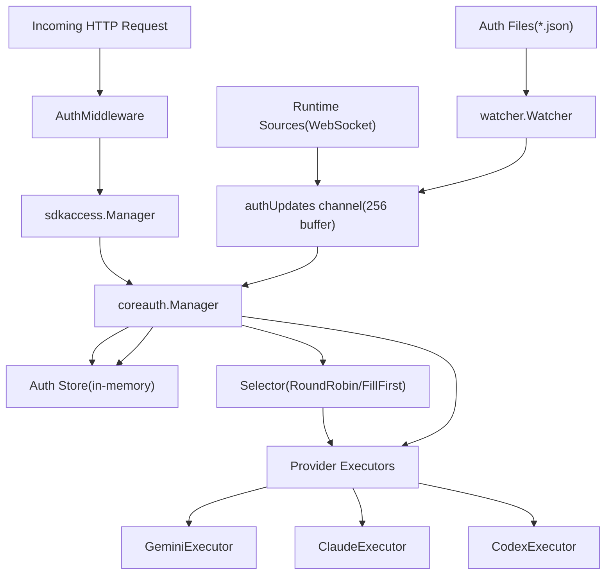
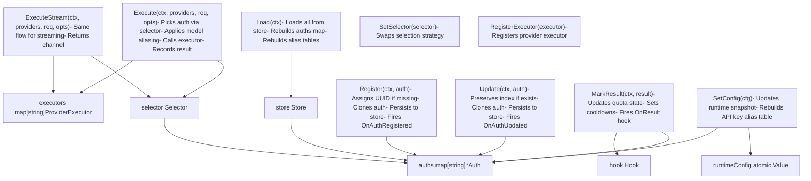
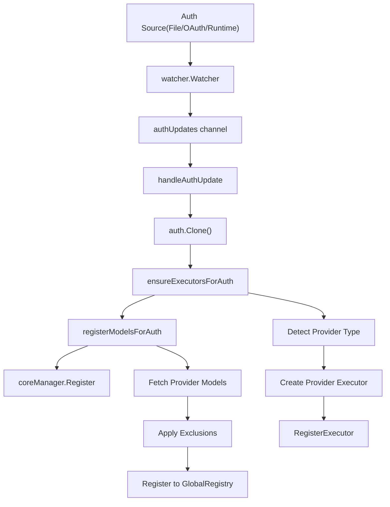
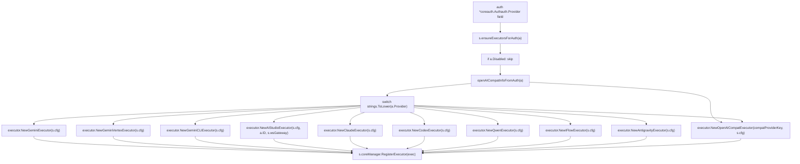
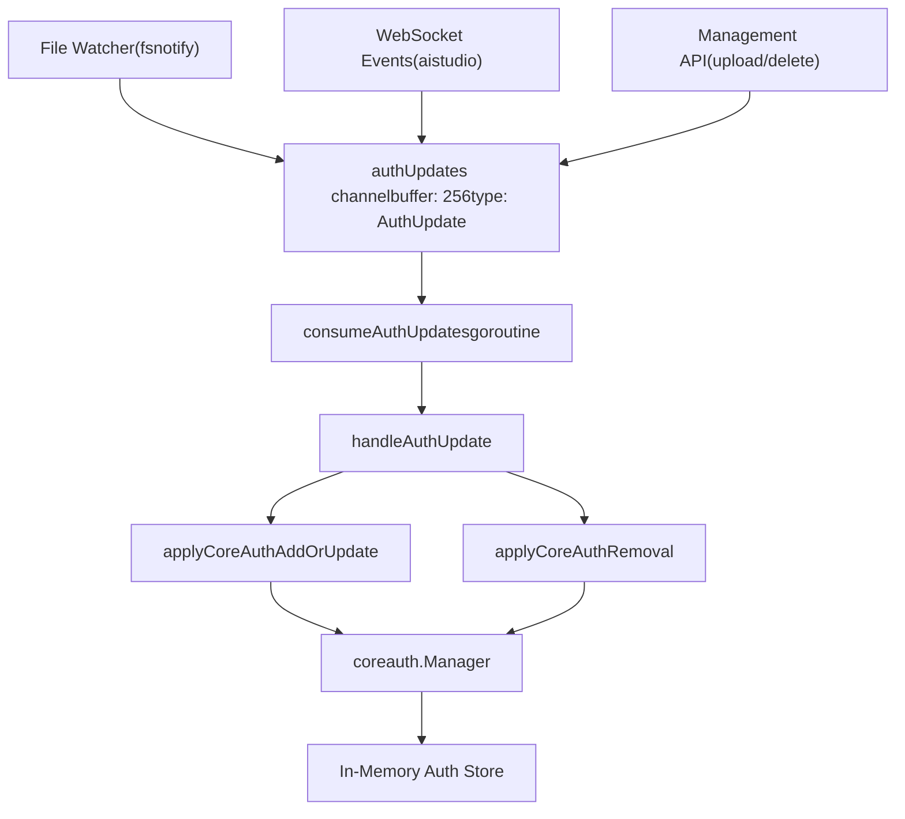
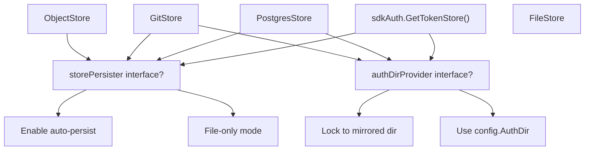

# 身份验证与凭证管理

相关源文件

-   [internal/api/handlers/management/handler.go](https://github.com/router-for-me/CLIProxyAPI/blob/c66cb0af/internal/api/handlers/management/handler.go)
-   [internal/auth/antigravity/auth.go](https://github.com/router-for-me/CLIProxyAPI/blob/c66cb0af/internal/auth/antigravity/auth.go)
-   [internal/auth/claude/token.go](https://github.com/router-for-me/CLIProxyAPI/blob/c66cb0af/internal/auth/claude/token.go)
-   [internal/auth/codex/token.go](https://github.com/router-for-me/CLIProxyAPI/blob/c66cb0af/internal/auth/codex/token.go)
-   [internal/auth/gemini/gemini\_token.go](https://github.com/router-for-me/CLIProxyAPI/blob/c66cb0af/internal/auth/gemini/gemini_token.go)
-   [internal/auth/iflow/iflow\_token.go](https://github.com/router-for-me/CLIProxyAPI/blob/c66cb0af/internal/auth/iflow/iflow_token.go)
-   [internal/auth/kimi/token.go](https://github.com/router-for-me/CLIProxyAPI/blob/c66cb0af/internal/auth/kimi/token.go)
-   [internal/auth/qwen/qwen\_token.go](https://github.com/router-for-me/CLIProxyAPI/blob/c66cb0af/internal/auth/qwen/qwen_token.go)
-   [internal/cmd/anthropic\_login.go](https://github.com/router-for-me/CLIProxyAPI/blob/c66cb0af/internal/cmd/anthropic_login.go)
-   [internal/cmd/iflow\_login.go](https://github.com/router-for-me/CLIProxyAPI/blob/c66cb0af/internal/cmd/iflow_login.go)
-   [internal/cmd/openai\_login.go](https://github.com/router-for-me/CLIProxyAPI/blob/c66cb0af/internal/cmd/openai_login.go)
-   [internal/cmd/qwen\_login.go](https://github.com/router-for-me/CLIProxyAPI/blob/c66cb0af/internal/cmd/qwen_login.go)
-   [internal/misc/credentials.go](https://github.com/router-for-me/CLIProxyAPI/blob/c66cb0af/internal/misc/credentials.go)
-   [internal/watcher/config\_reload.go](https://github.com/router-for-me/CLIProxyAPI/blob/c66cb0af/internal/watcher/config_reload.go)
-   [sdk/auth/antigravity.go](https://github.com/router-for-me/CLIProxyAPI/blob/c66cb0af/sdk/auth/antigravity.go)
-   [sdk/auth/claude.go](https://github.com/router-for-me/CLIProxyAPI/blob/c66cb0af/sdk/auth/claude.go)
-   [sdk/auth/codex.go](https://github.com/router-for-me/CLIProxyAPI/blob/c66cb0af/sdk/auth/codex.go)
-   [sdk/auth/filestore.go](https://github.com/router-for-me/CLIProxyAPI/blob/c66cb0af/sdk/auth/filestore.go)
-   [sdk/auth/iflow.go](https://github.com/router-for-me/CLIProxyAPI/blob/c66cb0af/sdk/auth/iflow.go)
-   [sdk/auth/qwen.go](https://github.com/router-for-me/CLIProxyAPI/blob/c66cb0af/sdk/auth/qwen.go)
-   [sdk/cliproxy/auth/conductor.go](https://github.com/router-for-me/CLIProxyAPI/blob/c66cb0af/sdk/cliproxy/auth/conductor.go)
-   [sdk/cliproxy/auth/selector.go](https://github.com/router-for-me/CLIProxyAPI/blob/c66cb0af/sdk/cliproxy/auth/selector.go)
-   [sdk/cliproxy/auth/selector\_test.go](https://github.com/router-for-me/CLIProxyAPI/blob/c66cb0af/sdk/cliproxy/auth/selector_test.go)
-   [sdk/cliproxy/auth/types.go](https://github.com/router-for-me/CLIProxyAPI/blob/c66cb0af/sdk/cliproxy/auth/types.go)
-   [sdk/cliproxy/auth/types\_test.go](https://github.com/router-for-me/CLIProxyAPI/blob/c66cb0af/sdk/cliproxy/auth/types_test.go)

## 用途与范围

本页面解释了 CLIProxyAPI 中的身份验证与凭证管理架构，重点关注 `coreauth.Manager` 组件、凭证路由策略以及身份验证如何与供应商执行器（Provider Executors）集成。这涵盖了运行时系统架构，而非面向用户的设置。

有关设置 OAuth 流程和 API 密钥的信息，请参阅[身份验证设置](/router-for-me/CLIProxyAPI/2.3-authentication-setup)。有关 OAuth 流程实现的细节，请参阅[身份验证流程](/router-for-me/CLIProxyAPI/7-authentication-flows)。有关令牌刷新机制，请参阅[令牌刷新与生命周期](/router-for-me/CLIProxyAPI/7.4-token-refresh-and-lifecycle)。

---

## 身份验证架构概览

身份验证系统由三个主要层组成，它们协同工作以验证请求并管理供应商凭证：

**图表：身份验证系统分层**


**来源：** [internal/api/server.go113-172](https://github.com/router-for-me/CLIProxyAPI/blob/c66cb0af/internal/api/server.go#L113-L172) [sdk/cliproxy/service.go32-89](https://github.com/router-for-me/CLIProxyAPI/blob/c66cb0af/sdk/cliproxy/service.go#L32-L89) [internal/watcher/watcher.go30-54](https://github.com/router-for-me/CLIProxyAPI/blob/c66cb0af/internal/watcher/watcher.go#L30-L54)

---

## 核心组件

### coreauth.Manager

`coreauth.Manager`（定义在 `sdk/cliproxy/auth/conductor.go` 中）是负责管理供应商凭证、为请求选择凭证以及与执行器协调的核心组件。它维护一个内存中的身份验证条目存储，并提供线程安全的访问。

**关键职责：**

| 职责 | 描述 |
| --- | --- |
| 凭证存储 | 在 `auths map[string]*Auth` 中维护内存中的 `Auth` 条目集合 |
| 凭证选择 | 使用可插拔的 `Selector` 策略将请求路由到适当的凭证 |
| 执行器绑定 | 确保通过 `RegisterExecutor()` 注册供应商执行器 |
| 模型注册 | 与全局注册表协作，跟踪每个凭证的模型可用性 |
| 自动刷新 | 通过后台工作程序定期刷新即将过期的凭证 |
| 状态管理 | 跟踪凭证状态、配额违规和冷却期 |
| 结果记录 | 通过 `MarkResult()` 根据执行结果更新凭证状态 |
| 模型别名 | 支持 OAuth 和 API 密钥的模型名称别名 |

**管理器结构 (sdk/cliproxy/auth/conductor.go)：**

```
type Manager struct {    store     Store                           // 持久化后端    executors map[string]ProviderExecutor     // provider -> executor    selector  Selector                        // 选择策略    hook      Hook                            // 生命周期回调    mu        sync.RWMutex                    // 保护 auths 映射    auths     map[string]*Auth                // authID -> Auth 条目        // 模型别名缓存    oauthModelAlias  atomic.Value              // 全局 OAuth 别名    apiKeyModelAlias atomic.Value              // 每个 auth 的 API 密钥别名        // 运行时配置快照    runtimeConfig atomic.Value                 // *internalconfig.Config        // 重试配置    requestRetry     atomic.Int32              // 最大重试次数    maxRetryInterval atomic.Int64              // 重试间的最大等待时间        // 可选的 RoundTripper 供应商    rtProvider RoundTripperProvider        // 自动刷新控制    refreshCancel context.CancelFunc}
```
**图表：coreauth.Manager 结构与关键方法**


**来源：** [sdk/cliproxy/auth/conductor.go116-147](https://github.com/router-for-me/CLIProxyAPI/blob/c66cb0af/sdk/cliproxy/auth/conductor.go#L116-L147) [sdk/cliproxy/auth/conductor.go149-169](https://github.com/router-for-me/CLIProxyAPI/blob/c66cb0af/sdk/cliproxy/auth/conductor.go#L149-L169) [sdk/cliproxy/auth/conductor.go408-424](https://github.com/router-for-me/CLIProxyAPI/blob/c66cb0af/sdk/cliproxy/auth/conductor.go#L408-L424) [sdk/cliproxy/auth/conductor.go426-443](https://github.com/router-for-me/CLIProxyAPI/blob/c66cb0af/sdk/cliproxy/auth/conductor.go#L426-L443) [sdk/cliproxy/auth/conductor.go472-501](https://github.com/router-for-me/CLIProxyAPI/blob/c66cb0af/sdk/cliproxy/auth/conductor.go#L472-L501)

### sdkaccess.Manager

`sdkaccess.Manager` 通过验证 API 密钥和 Authorization 标头来处理请求身份验证。它位于 HTTP 中间件层，负责确定请求是否有权访问代理。

**图表：请求身份验证流程**

> **[Mermaid sequence]**
> *(图表结构无法解析)*

**来源：** [internal/api/server.go115-149](https://github.com/router-for-me/CLIProxyAPI/blob/c66cb0af/internal/api/server.go#L115-L149) [internal/api/server.go841-848](https://github.com/router-for-me/CLIProxyAPI/blob/c66cb0af/internal/api/server.go#L841-L848)

### Auth 结构

`coreauth.Auth` 结构体表示单个凭证条目，包含其元数据、状态和运行时信息：

**Auth 字段：**

| 字段 | 类型 | 用途 |
| --- | --- | --- |
| `ID` | string | 唯一标识符（文件名或通道 ID） |
| `Index` | string | 源自身份验证元数据的稳定运行时标识符 |
| `Provider` | string | 供应商类型（gemini, claude, codex, antigravity 等） |
| `Prefix` | string | 可选的模型路由命名空间（从模型名称中剥离 `prefix/`） |
| `Label` | string | UI 显示名称 |
| `Status` | Status | 当前状态（Active, Disabled, Cooling, Error） |
| `StatusMessage` | string | 人类可读的状态描述 |
| `Disabled` | bool | 凭证是否已禁用 |
| `Unavailable` | bool | 凭证是否暂时不可用 |
| `FileName` | string | 源文件路径（如果是基于文件的） |
| `Storage` | baseauth.TokenStorage | 令牌持久化实现 |
| `ProxyURL` | string | 逐凭证的代理覆盖 |
| `Attributes` | map\[string\]string | 供应商特定的不可变配置 |
| `Metadata` | map\[string\]any | 供应商特定的可变状态（tokens, cookies, email） |
| `Quota` | QuotaState | 最近的配额/速率限制信息，带有退避（backoff）跟踪 |
| `LastError` | \*Error | 遇到的上一个故障 |
| `CreatedAt` | time.Time | 创建时间戳 |
| `UpdatedAt` | time.Time | 上次更新时间戳 |
| `LastRefreshedAt` | time.Time | 上次令牌刷新时间戳 |
| `NextRefreshAfter` | time.Time | 下次计划刷新时间 |
| `NextRetryAfter` | time.Time | 故障后最早可重试时间 |
| `ModelStates` | map\[string\]\*ModelState | 逐模型的运行时可用性跟踪 |
| `Runtime` | any | 供应商特定的运行时数据（不可序列化） |

**来源：** [sdk/cliproxy/auth/types.go15-66](https://github.com/router-for-me/CLIProxyAPI/blob/c66cb0af/sdk/cliproxy/auth/types.go#L15-L66)

### 配额状态与冷却

`QuotaState` 结构体跟踪受速率限制的凭证的配额违规情况和冷却计时：

**QuotaState 结构：**

```
type QuotaState struct {    // Exceeded 指示凭证最近是否遇到配额错误    Exceeded bool `json:"exceeded"`        // Reason 提供可选的供应商特定的人类可读描述    Reason string `json:"reason,omitempty"`        // NextRecoverAt 是凭证可能再次可用的时间戳    NextRecoverAt time.Time `json:"next_recover_at"`        // BackoffLevel 存储用于速率限制的渐进式冷却指数    BackoffLevel int `json:"backoff_level,omitempty"`}
```
**指数退避（Exponential Backoff）算法：**

当凭证遇到配额错误（HTTP 429 或配额超限响应）时，管理器使用 `BackoffLevel` 字段应用指数退避：

```
退避时长 = min(2^BackoffLevel * 1 秒, 30 分钟)

初始退避 (level 0): 1 秒
第 1 次错误后 (level 1): 2 秒
第 2 次错误后 (level 2): 4 秒
第 3 次错误后 (level 3): 8 秒
...
最大退避: 30 分钟
```
当凭证成功完成一个请求时，`BackoffLevel` 会重置为零。

**冷却常量：**

```
const (    quotaBackoffBase = time.Second       // 基础退避时长    quotaBackoffMax  = 30 * time.Minute  // 最大退避时长)
```
**来源：** [sdk/cliproxy/auth/types.go68-78](https://github.com/router-for-me/CLIProxyAPI/blob/c66cb0af/sdk/cliproxy/auth/types.go#L68-L78) [sdk/cliproxy/auth/conductor.go49-55](https://github.com/router-for-me/CLIProxyAPI/blob/c66cb0af/sdk/cliproxy/auth/conductor.go#L49-L55)

### 模型状态跟踪

每个 `Auth` 都维护一个 `ModelStates` 映射，用于跟踪逐模型的可用性和冷却。这允许在凭证对某些模型有效但对其他模型无效时进行精细控制。

**ModelState 结构：**

```
type ModelState struct {    // Status 反映此模型的生命周期状态    Status Status `json:"status"`        // StatusMessage 提供可选的状态简短描述    StatusMessage string `json:"status_message,omitempty"`        // Unavailable 镜像模型是否由于重试而暂时被阻止    Unavailable bool `json:"unavailable"`        // NextRetryAfter 定义逐模型的重试时间    NextRetryAfter time.Time `json:"next_retry_after"`        // LastError 记录此模型的最新错误    LastError *Error `json:"last_error,omitempty"`        // Quota 如果此模型达到速率限制，则保留配额信息    Quota QuotaState `json:"quota"`        // UpdatedAt 跟踪此模型状态的上次更新时间戳    UpdatedAt time.Time `json:"updated_at"`}
```
**逐模型冷却行为：**

当凭证在特定模型上失败时，`ModelState` 会更新以下内容：

-   `Unavailable=true` 将其标记为暂时阻止
-   `NextRetryAfter` 时间戳指示何时重试
-   `LastError` 捕获故障详情（HTTP 状态、消息）
-   如果故障与配额有关，则包含 `Quota` 状态

选择器实现（`RoundRobinSelector` 和 `FillFirstSelector`）在选择凭证时会同时检查全局身份验证可用性和逐模型的 `ModelStates`。如果 `ModelStates[model].Unavailable == true && ModelStates[model].NextRetryAfter > now`，则凭证在该模型上被阻止。

**来源：** [sdk/cliproxy/auth/types.go80-96](https://github.com/router-for-me/CLIProxyAPI/blob/c66cb0af/sdk/cliproxy/auth/types.go#L80-L96) [sdk/cliproxy/auth/selector.go239-296](https://github.com/router-for-me/CLIProxyAPI/blob/c66cb0af/sdk/cliproxy/auth/selector.go#L239-L296)

---

## 凭证生命周期

### 注册与初始绑定

当系统中添加新凭证时（通过文件创建、OAuth 流程或运行时源），它会流经注册管道：

**图表：凭证注册流程**


**来源：** [sdk/cliproxy/service.go170-198](https://github.com/router-for-me/CLIProxyAPI/blob/c66cb0af/sdk/cliproxy/service.go#L170-L198) [sdk/cliproxy/service.go271-293](https://github.com/router-for-me/CLIProxyAPI/blob/c66cb0af/sdk/cliproxy/service.go#L271-L293) [sdk/cliproxy/service.go340-389](https://github.com/router-for-me/CLIProxyAPI/blob/c66cb0af/sdk/cliproxy/service.go#L340-L389) [sdk/cliproxy/service.go677-793](https://github.com/router-for-me/CLIProxyAPI/blob/c66cb0af/sdk/cliproxy/service.go#L677-L793)

**代码流程：**

1.  **身份验证更新事件**：观察器（Watcher）检测到文件更改或运行时事件。
2.  **队列处理**：`consumeAuthUpdates` goroutine 从 256 缓冲通道接收事件 [sdk/cliproxy/service.go126-147](https://github.com/router-for-me/CLIProxyAPI/blob/c66cb0af/sdk/cliproxy/service.go#L126-L147)。
3.  **克隆**：克隆身份验证信息以防止引用问题 [sdk/cliproxy/service.go278](https://github.com/router-for-me/CLIProxyAPI/blob/c66cb0af/sdk/cliproxy/service.go#L278-L278)。
4.  **执行器绑定**：`ensureExecutorsForAuth` 根据 `auth.Provider` 创建适当的执行器 [sdk/cliproxy/service.go340-389](https://github.com/router-for-me/CLIProxyAPI/blob/c66cb0af/sdk/cliproxy/service.go#L340-L389)。
5.  **模型注册**：`registerModelsForAuth` 获取模型并进行全局注册 [sdk/cliproxy/service.go677-793](https://github.com/router-for-me/CLIProxyAPI/blob/c66cb0af/sdk/cliproxy/service.go#L677-L793)。
6.  **核心注册**：最后在 `coreManager` 中注册或更新 [sdk/cliproxy/service.go282-292](https://github.com/router-for-me/CLIProxyAPI/blob/c66cb0af/sdk/cliproxy/service.go#L282-L292)。

### 更新与热重载

系统支持在不重启服务的情况下热重载凭证。对认证文件的更改会触发更新级联：

**图表：热重载更新级联**

> **[Mermaid sequence]**
> *(图表结构无法解析)*

**来源：** [internal/watcher/watcher.go72-78](https://github.com/router-for-me/CLIProxyAPI/blob/c66cb0af/internal/watcher/watcher.go#L72-L78) [sdk/cliproxy/service.go126-147](https://github.com/router-for-me/CLIProxyAPI/blob/c66cb0af/sdk/cliproxy/service.go#L126-L147) [sdk/cliproxy/service.go271-293](https://github.com/router-for-me/CLIProxyAPI/blob/c66cb0af/sdk/cliproxy/service.go#L271-L293)

**关键特性：**

-   **防抖 (Debouncing)**：观察器等待 150ms 以合并快速的文件更改 [internal/watcher/watcher.go76](https://github.com/router-for-me/CLIProxyAPI/blob/c66cb0af/internal/watcher/watcher.go#L76-L76)。
-   **基于哈希的检测**：仅在文件内容哈希更改时重新加载。
-   **原子操作**：更新会保留 `CreatedAt`、`LastRefreshedAt` 和 `NextRefreshAfter` 时间戳 [sdk/cliproxy/service.go282-285](https://github.com/router-for-me/CLIProxyAPI/blob/c66cb0af/sdk/cliproxy/service.go#L282-L285)。
-   **缓冲队列**：256 元素的通道可防止阻塞 [sdk/cliproxy/service.go116](https://github.com/router-for-me/CLIProxyAPI/blob/c66cb0af/sdk/cliproxy/service.go#L116-L116)。

### 移除

当移除凭证时，系统执行清理：

**清理步骤：**

| 步骤 | 操作 | 代码位置 |
| --- | --- | --- |
| 1. 取消模型注册 | 从全局注册表中移除模型 | [sdk/cliproxy/service.go302](https://github.com/router-for-me/CLIProxyAPI/blob/c66cb0af/sdk/cliproxy/service.go#L302-L302) |
| 2. 标记为已禁用 | 设置 `Disabled=true`, `Status=StatusDisabled` | [sdk/cliproxy/service.go304-305](https://github.com/router-for-me/CLIProxyAPI/blob/c66cb0af/sdk/cliproxy/service.go#L304-L305) |
| 3. 更新核心管理器 | 在 coreManager 中更新 auth（不删除） | [sdk/cliproxy/service.go306-308](https://github.com/router-for-me/CLIProxyAPI/blob/c66cb0af/sdk/cliproxy/service.go#L306-L308) |

注意：身份验证信息被标记为已禁用而非删除，以维护审计追踪并防止竞态条件。

**来源：** [sdk/cliproxy/service.go295-310](https://github.com/router-for-me/CLIProxyAPI/blob/c66cb0af/sdk/cliproxy/service.go#L295-L310)

---

## 结果记录与状态更新

在每次请求执行后，管理器通过 `MarkResult()` 记录结果，根据成功或失败更新凭证状态。

### Result 结构

```
type Result struct {    AuthID     string          // 处理请求的身份验证 ID    Provider   string          // 供应商类型    Model      string          // 上游模型标识符    Success    bool            // 执行是否成功    RetryAfter *time.Duration  // 供应商提供的重试提示    Error      *Error          // 故障详情}
```
**来源：** [sdk/cliproxy/auth/conductor.go73-87](https://github.com/router-for-me/CLIProxyAPI/blob/c66cb0af/sdk/cliproxy/auth/conductor.go#L73-L87)

### MarkResult 流程

**图表：结果记录与状态更新**

> **[Mermaid sequence]**
> *(图表结构无法解析)*

**来源：** [sdk/cliproxy/auth/conductor.go595-617](https://github.com/router-for-me/CLIProxyAPI/blob/c66cb0af/sdk/cliproxy/auth/conductor.go#L595-L617) [sdk/cliproxy/auth/types.go68-96](https://github.com/router-for-me/CLIProxyAPI/blob/c66cb0af/sdk/cliproxy/auth/types.go#L68-L96)

---

## 凭证选择策略

`coreauth.Manager` 使用可插拔的选择策略来为每个请求选择要使用的凭证。策略可以在运行时通过配置热重载进行更改。

### Selector 接口

```
type Selector interface {    Pick(ctx context.Context, provider, model string, opts Options, auths []*Auth) (*Auth, error)}
```
两个选择器实现在选择前都会使用 `getAvailableAuths()` 过滤凭证，该函数：

1.  使用 `collectAvailableByPriority()` 按优先级收集可用的身份验证。
2.  过滤掉禁用的身份验证 (`auth.Disabled == true` 或 `auth.Status == StatusDisabled`)。
3.  通过检查 `isAuthBlockedForModel(auth, model, now)` 过滤掉处于冷却中的身份验证。
4.  按优先级（来自 `auth.Attributes["priority"]`）对可用的身份验证进行分组。
5.  如果所有身份验证都在冷却中，则返回 `modelCooldownError`（触发带有 `Retry-After` 标头的 429 响应）。
6.  选择最高优先级组，并按 `auth.ID` 排序以实现稳定排序。

**身份验证阻止逻辑：**

在以下情况下，身份验证会在模型上被阻止：

-   `auth.Disabled == true` 或 `auth.Status == StatusDisabled`（永久阻止）。
-   存在逐模型状态且 `ModelStates[model].Unavailable == true && ModelStates[model].NextRetryAfter > now`。
-   全局状态具有 `auth.Unavailable == true && auth.NextRetryAfter > now`。

该函数还会单独跟踪基于配额的冷却，以便在错误响应中提供准确的 `Retry-After` 时间。

**来源：** [sdk/cliproxy/auth/selector.go136-191](https://github.com/router-for-me/CLIProxyAPI/blob/c66cb0af/sdk/cliproxy/auth/selector.go#L136-L191) [sdk/cliproxy/auth/selector.go239-296](https://github.com/router-for-me/CLIProxyAPI/blob/c66cb0af/sdk/cliproxy/auth/selector.go#L239-L296)

### 轮询 (Round-Robin) 策略

默认策略 (`RoundRobinSelector`) 使用逐模型游标（cursors）将请求均匀分配到供应商的所有可用凭证上。

**算法 (RoundRobinSelector.Pick)：**

```
func (s *RoundRobinSelector) Pick(ctx, provider, model, opts, auths):
  1. available := getAvailableAuths(auths, provider, model, now)
  2. if len(available) == 0:
       return nil, modelCooldownError or auth_unavailable
  3. key := provider + ":" + canonicalModelKey(model)
  4. s.mu.Lock()
  5. cursor := s.cursors[key]
  6. if cursor >= 2_147_483_640:
       cursor = 0  // 防止溢出
  7. s.cursors[key] = cursor + 1
  8. s.mu.Unlock()
  9. return available[cursor % len(available)]
```
**内部状态：**

```
type RoundRobinSelector struct {    mu      sync.Mutex    cursors map[string]int  // 键: "provider:canonicalModel", 值: 下一个索引    maxKeys int             // 限制游标映射大小 (默认 4096)}
```
选择器使用 `canonicalModelKey()` 剥离思考（thinking）后缀（例如 `"model(high)"` → `"model"`），确保对同一模型的不同思考级别的请求共享轮转状态。

**配置：**

```
routing:  strategy: "round-robin"  # 或 "rr" 或 "roundrobin"
```
**来源：** [sdk/cliproxy/auth/selector.go19-24](https://github.com/router-for-me/CLIProxyAPI/blob/c66cb0af/sdk/cliproxy/auth/selector.go#L19-L24) [sdk/cliproxy/auth/selector.go195-224](https://github.com/router-for-me/CLIProxyAPI/blob/c66cb0af/sdk/cliproxy/auth/selector.go#L195-L224) [sdk/cliproxy/auth/selector.go124-135](https://github.com/router-for-me/CLIProxyAPI/blob/c66cb0af/sdk/cliproxy/auth/selector.go#L124-L135)

### 优先填满 (Fill-First) 策略

备选策略 (`FillFirstSelector`) 会耗尽一个凭证后再移动到下一个。这对于优先使用某些账户或最大限度利用免费层级配额非常有用。

**算法 (FillFirstSelector.Pick)：**

```
func (s *FillFirstSelector) Pick(ctx, provider, model, opts, auths):
  1. available := getAvailableAuths(auths, provider, model, now)
  2. if len(available) == 0:
       return nil, modelCooldownError or auth_unavailable
  3. return available[0]  // 始终是第一个可用的 (按 ID 排序)
```
**内部状态：**

```
type FillFirstSelector struct{}  // 无状态
```
**配置：**

```
routing:  strategy: "fill-first"  # 或 "ff" 或 "fillfirst"
```
**运行时的策略选择：**

当 `config.Routing.Strategy` 更改时，服务通过热重载更新选择器：

```
// sdk/cliproxy/service.go:536-545switch nextStrategy {case "fill-first":    selector = &coreauth.FillFirstSelector{}default:    selector = &coreauth.RoundRobinSelector{}}s.coreManager.SetSelector(selector)
```
**来源：** [sdk/cliproxy/auth/selector.go26-29](https://github.com/router-for-me/CLIProxyAPI/blob/c66cb0af/sdk/cliproxy/auth/selector.go#L26-L29) [sdk/cliproxy/auth/selector.go228-237](https://github.com/router-for-me/CLIProxyAPI/blob/c66cb0af/sdk/cliproxy/auth/selector.go#L228-L237)

---

## 与执行器集成

每个凭证必须绑定到适当的供应商执行器以启用请求执行。这种绑定发生在注册和更新操作期间。

### 执行器绑定流程

**图表：Auth 到执行器的绑定 (s.ensureExecutorsForAuth)**


**来源：** [sdk/cliproxy/service.go340-389](https://github.com/router-for-me/CLIProxyAPI/blob/c66cb0af/sdk/cliproxy/service.go#L340-L389) [sdk/cliproxy/service.go320-338](https://github.com/router-for-me/CLIProxyAPI/blob/c66cb0af/sdk/cliproxy/service.go#L320-L338)

### 供应商特定的执行器映射

| 供应商字符串 | 执行器构造函数 | 代码位置 | 特殊要求 |
| --- | --- | --- | --- |
| `"gemini"` | `executor.NewGeminiExecutor(s.cfg)` | 第 362 行 | 标准 Gemini API |
| `"vertex"` | `executor.NewGeminiVertexExecutor(s.cfg)` | 第 364 行 | Vertex AI 路径 |
| `"gemini-cli"` | `executor.NewGeminiCLIExecutor(s.cfg)` | 第 366 行 | CLI 特定端点 |
| `"aistudio"` | `executor.NewAIStudioExecutor(s.cfg, a.ID, s.wsGateway)` | 第 368-370 行 | 需要 `s.wsGateway != nil` |
| `"antigravity"` | `executor.NewAntigravityExecutor(s.cfg)` | 第 373 行 | 支持备用 URL |
| `"claude"` | `executor.NewClaudeExecutor(s.cfg)` | 第 375 行 | 思考签名验证 |
| `"codex"` | `executor.NewCodexExecutor(s.cfg)` | 第 377 行 | ID 令牌解析 |
| `"qwen"` | `executor.NewQwenExecutor(s.cfg)` | 第 379 行 | 基于设备的认证 |
| `"iflow"` | `executor.NewIFlowExecutor(s.cfg)` | 第 381 行 | 基于 Cookie 的会话 |
| OpenAI-兼容 | `executor.NewOpenAICompatExecutor(compatProviderKey, s.cfg)` | 第 357, 383-388 行 | 通用兼容 OpenAI |

**来源：** [sdk/cliproxy/service.go360-388](https://github.com/router-for-me/CLIProxyAPI/blob/c66cb0af/sdk/cliproxy/service.go#L360-L388)

### 配置更改时的执行器重新绑定

当配置更改（例如代理 URL、重试设置）时，所有执行器都会重新绑定以采用新设置：

> **[Mermaid sequence]**
> *(图表结构无法解析)*

**来源：** [sdk/cliproxy/service.go392-400](https://github.com/router-for-me/CLIProxyAPI/blob/c66cb0af/sdk/cliproxy/service.go#L392-L400) [sdk/cliproxy/service.go547-559](https://github.com/router-for-me/CLIProxyAPI/blob/c66cb0af/sdk/cliproxy/service.go#L547-L559)

---

## 请求身份验证流程

本节详细介绍了如何对传入的 HTTP 请求进行身份验证并将其路由到凭证。

**图表：完整的请求身份验证与执行流程**

> **[Mermaid sequence]**
> *(图表结构无法解析)*

**来源：** [internal/api/server.go203-225](https://github.com/router-for-me/CLIProxyAPI/blob/c66cb0af/internal/api/server.go#L203-L225) [internal/api/server.go1029-1047](https://github.com/router-for-me/CLIProxyAPI/blob/c66cb0af/internal/api/server.go#L1029-L1047) [sdk/cliproxy/auth/selector.go149-172](https://github.com/router-for-me/CLIProxyAPI/blob/c66cb0af/sdk/cliproxy/auth/selector.go#L149-L172) [sdk/cliproxy/auth/selector.go42-104](https://github.com/router-for-me/CLIProxyAPI/blob/c66cb0af/sdk/cliproxy/auth/selector.go#L42-L104)

### AuthMiddleware 实现

[internal/api/server.go1029-1047](https://github.com/router-for-me/CLIProxyAPI/blob/c66cb0af/internal/api/server.go#L1029-L1047) 中的 `AuthMiddleware` 函数返回一个 `gin.HandlerFunc`，该函数使用 `sdkaccess.Manager` 验证传入请求：

```
func AuthMiddleware(manager *sdkaccess.Manager) gin.HandlerFunc {    return func(c *gin.Context) {        if manager == nil {            c.Next()            return        }                result, err := manager.Authenticate(c.Request.Context(), c.Request)        if err == nil {            if result != nil {                c.Set("apiKey", result.Principal)                c.Set("accessProvider", result.Provider)                // ... 其他上下文值            }            c.Next()            return        }                c.AbortWithStatusJSON(http.StatusUnauthorized, ...)    }}
```
`manager.Authenticate()` 方法从多个来源提取并验证 API 密钥：

**API 密钥来源 (优先级顺序)：**

1.  **Authorization 标头**：`Authorization: Bearer sk-...`
2.  **X-API-Key 标头**：`X-API-Key: sk-...`
3.  **查询参数**：`?api-key=sk-...`

**来源：** [internal/api/server.go1029-1047](https://github.com/router-for-me/CLIProxyAPI/blob/c66cb0af/internal/api/server.go#L1029-L1047)

### 上下文传播

身份验证成功后，中间件会将经过验证的 API 密钥存储在 Gin 上下文中：

```
c.Set("apiKey", validatedKey)
c.Set("provider", detectedProvider)  // 如果是特定于路由的
```
路由处理器检索这些值以选择适当的凭证：

```
apiKey := c.GetString("apiKey")
provider := c.GetString("provider")
```
**来源：** [internal/api/server.go321-329](https://github.com/router-for-me/CLIProxyAPI/blob/c66cb0af/internal/api/server.go#L321-L329)

---

## 身份验证更新队列架构

身份验证更新队列提供了解耦的异步凭证更改处理，以防止阻塞观察器或 HTTP 处理器。

**图表：身份验证更新队列流程**


**来源：** [sdk/cliproxy/service.go111-124](https://github.com/router-for-me/CLIProxyAPI/blob/c66cb0af/sdk/cliproxy/service.go#L111-L124) [sdk/cliproxy/service.go126-147](https://github.com/router-for-me/CLIProxyAPI/blob/c66cb0af/sdk/cliproxy/service.go#L126-L147) [sdk/cliproxy/service.go170-198](https://github.com/router-for-me/CLIProxyAPI/blob/c66cb0af/sdk/cliproxy/service.go#L170-L198)

### AuthUpdate 结构

```
type AuthUpdate struct {    Action AuthUpdateAction  // "add", "modify", "delete"    ID     string            // 唯一的 auth 标识符    Auth   *coreauth.Auth    // auth 条目 (删除时为 nil)}
```
**来源：** [internal/watcher/watcher.go56-71](https://github.com/router-for-me/CLIProxyAPI/blob/c66cb0af/internal/watcher/watcher.go#L56-L71)

### 队列饱和处理

如果 256 元素的缓冲区满了（例如在批量操作期间），更新将内联（inline）应用：

```
select {
case authUpdates <- update:
    // 成功入队
default:
    log.Debug("身份验证更新队列已饱和，正在内联应用")
    handleAuthUpdate(ctx, update)
}
```
**来源：** [sdk/cliproxy/service.go149-168](https://github.com/router-for-me/CLIProxyAPI/blob/c66cb0af/sdk/cliproxy/service.go#L149-L168)

---

## 自动刷新机制

管理器通过后台工作程序自动刷新即将过期的凭证，以防止身份验证失败。

### 刷新工作程序 (Refresh Worker)

**图表：自动刷新工作程序流程**

> **[Mermaid sequence]**
> *(图表结构无法解析)*

**刷新决策逻辑：**

在以下情况下刷新身份验证信息：

1.  它具有已过期的 `NextRefreshAfter` 时间戳。
2.  或者它是一个在供应商刷新提前期（通常为 5 分钟）内过期的 OAuth 凭证。
3.  并且它尚未处于“正在刷新”状态（防止并发刷新）。

**按供应商划分的刷新提前期：**

| 供应商 | 刷新提前期 | 配置 |
| --- | --- | --- |
| Gemini | 5 分钟 | 当 `expires_at - now < 5min` 时刷新 |
| Claude | 5 分钟 | 同上 |
| Codex | 5 分钟 | 同上 |
| Antigravity | 5 分钟 | 同上 |
| Qwen | 5 分钟 | 同上 |
| iFlow | 5 分钟 | 同上 |

**来源：** [sdk/cliproxy/auth/refresh.go](https://github.com/router-for-me/CLIProxyAPI/blob/c66cb0af/sdk/cliproxy/auth/refresh.go) [sdk/auth/gemini.go](https://github.com/router-for-me/CLIProxyAPI/blob/c66cb0af/sdk/auth/gemini.go) [sdk/auth/claude.go](https://github.com/router-for-me/CLIProxyAPI/blob/c66cb0af/sdk/auth/claude.go) [sdk/auth/antigravity.go29-33](https://github.com/router-for-me/CLIProxyAPI/blob/c66cb0af/sdk/auth/antigravity.go#L29-L33)

### 手动刷新

单个凭证也可以根据需要通过管理 API 进行手动刷新：

```
POST /v0/management/auth-files/refresh?name=<filename>
```
这将触发立即的刷新尝试，无论过期状态如何。

**来源：** [internal/api/handlers/management/auth\_files.go](https://github.com/router-for-me/CLIProxyAPI/blob/c66cb0af/internal/api/handlers/management/auth_files.go)

---

## 管理 API 集成

管理 API 提供了用于程序化凭证管理的 HTTP 端点，所有端点都通过相同的身份验证更新队列进行路由。

### 关键端点

| 端点 | 方法 | 处理器函数 | 用途 |
| --- | --- | --- | --- |
| `/v0/management/auth-files` | GET | `ListAuthFiles` | 列出所有包含状态和元数据的凭证 |
| `/v0/management/auth-files` | POST | `UploadAuthFile` | 上传新的凭证文件（multipart 或 JSON 体） |
| `/v0/management/auth-files` | DELETE | `DeleteAuthFile` | 移除凭证（单个，或使用 `?all=true` 移除所有） |
| `/v0/management/auth-files` | PATCH | `PatchAuthFileStatus` | 通过 `{"disabled": true/false}` 启用/禁用凭证 |
| `/v0/management/auth-files/models` | GET | `GetAuthFileModels` | 获取特定凭证的可用模型 |
| `/v0/management/auth-files/download` | GET | `DownloadAuthFile` | 下载凭证文件内容 |
| `/v0/management/request/anthropic/token` | GET | `RequestAnthropicToken` | 启动 Claude OAuth 流程，返回 auth URL |
| `/v0/management/request/codex/token` | GET | `RequestCodexToken` | 启动 Codex OAuth 流程 |
| `/v0/management/request/gemini-cli/token` | GET | `RequestGeminiCLIToken` | 启动 Gemini CLI OAuth 流程 |
| `/v0/management/request/antigravity/token` | GET | `RequestAntigravityToken` | 启动 Antigravity OAuth 流程 |
| `/v0/management/request/qwen/token` | GET | `RequestQwenToken` | 启动 Qwen 设备流流程 |
| `/v0/management/request/iflow/token` | GET | `RequestIFlowToken` | 启动 iFlow OAuth 流程 |
| `/anthropic/callback`, `/google/callback` 等 | GET | OAuth 回调 | 处理供应商 OAuth 重定向 |
| `/v0/management/get-auth-status` | GET | `GetAuthStatus` | 轮询 OAuth 流程完成状态 |
| `/v0/management/vertex/import` | POST | `ImportVertexCredential` | 导入 Vertex 服务账号 JSON |

**来源：** [internal/api/server.go609-625](https://github.com/router-for-me/CLIProxyAPI/blob/c66cb0af/internal/api/server.go#L609-L625) [internal/api/handlers/management/auth\_files.go249-271](https://github.com/router-for-me/CLIProxyAPI/blob/c66cb0af/internal/api/handlers/management/auth_files.go#L249-L271) [internal/api/handlers/management/auth\_files.go530-593](https://github.com/router-for-me/CLIProxyAPI/blob/c66cb0af/internal/api/handlers/management/auth_files.go#L530-L593) [internal/api/handlers/management/auth\_files.go596-660](https://github.com/router-for-me/CLIProxyAPI/blob/c66cb0af/internal/api/handlers/management/auth_files.go#L596-L660) [internal/api/handlers/management/auth\_files.go744-808](https://github.com/router-for-me/CLIProxyAPI/blob/c66cb0af/internal/api/handlers/management/auth_files.go#L744-L808)

### 认证文件上传流程

**图表：管理 API 认证上传**

> **[Mermaid sequence]**
> *(图表结构无法解析)*

**文件上传格式：**

1.  **Multipart 上传**：`Content-Type: multipart/form-data` 带有 `file` 字段。
2.  **原始 JSON**：`Content-Type: application/json` 带有 `?name=filename.json` 查询参数。

**验证规则：**

-   文件名必须以 `.json` 结尾。
-   文件名不得包含路径分隔符 (`/` 或 `\`)。
-   文件内容必须是有效的 JSON，且具有指示供应商的 `type` 字段。

**来源：** [internal/api/handlers/management/auth\_files.go530-593](https://github.com/router-for-me/CLIProxyAPI/blob/c66cb0af/internal/api/handlers/management/auth_files.go#L530-L593) [internal/api/handlers/management/auth\_files.go680-742](https://github.com/router-for-me/CLIProxyAPI/blob/c66cb0af/internal/api/handlers/management/auth_files.go#L680-L742)

### OAuth 流程端点

管理 API 为所有受支持的供应商提供统一的 OAuth 流程发起。每个流程都遵循类似的模式：

**图表：通过管理 API 进行的 OAuth 流程**

> **[Mermaid sequence]**
> *(图表结构无法解析)*

**OAuth 状态管理：**

每个 OAuth 流程都会创建一个由 `state` 参数跟踪的会话：

```
// 会话状态: "pending", "complete", "error"RegisterOAuthSession(state, provider)  // 初始CompleteOAuthSession(state)            // 成功SetOAuthSessionError(state, message)   // 失败
```
客户端轮询 `/v0/management/get-auth-status?state=<state>` 以检查完成情况。

**WebUI 模式的回调转发器：**

当 `?is_webui=true` 时，处理器会启动一个临时的回调转发器：

1.  在供应商的回调端口（例如 Claude 为 54545，Gemini 为 8085）上进行监听。
2.  将所有请求重定向到管理 API 的回调处理器。
3.  在 OAuth 流程完成后关闭。
4.  允许 WebUI 在没有 CLI 浏览器访问的情况下发起 OAuth。

**来源：** [internal/api/handlers/management/auth\_files.go869-1011](https://github.com/router-for-me/CLIProxyAPI/blob/c66cb0af/internal/api/handlers/management/auth_files.go#L869-L1011) (Claude 示例), [internal/api/handlers/management/auth\_files.go1013-1241](https://github.com/router-for-me/CLIProxyAPI/blob/c66cb0af/internal/api/handlers/management/auth_files.go#L1013-L1241) (Gemini CLI 示例), [internal/api/handlers/management/auth\_files.go131-189](https://github.com/router-for-me/CLIProxyAPI/blob/c66cb0af/internal/api/handlers/management/auth_files.go#L131-L189) (回调转发器)

### 仅限运行时凭证

某些凭证仅存在于内存中（例如，通过 WebSocket 连接的 AI Studio 通道），并标记有 `runtime_only=true` 属性。这些凭证被排除在基于文件的持久化之外，但参与所有其他凭证管理操作。

**检测：**

```
if auth.Attributes["runtime_only"] == "true" {
    // 跳过文件持久化
    // 包含在凭证选择中
}
```
**来源：** [sdk/cliproxy/service.go236-242](https://github.com/router-for-me/CLIProxyAPI/blob/c66cb0af/sdk/cliproxy/service.go#L236-L242) [internal/api/handlers/management/auth\_files.go497-502](https://github.com/router-for-me/CLIProxyAPI/blob/c66cb0af/internal/api/handlers/management/auth_files.go#L497-L502)

---

## 令牌存储集成

系统与实现了持久化接口的可插拔令牌存储后端集成。观察器（Watcher）可以检测配置了哪个存储后端并相应地传播更改。

**存储后端检测：**


**来源：** [internal/watcher/watcher.go20-28](https://github.com/router-for-me/CLIProxyAPI/blob/c66cb0af/internal/watcher/watcher.go#L20-L28) [internal/watcher/watcher.go94-105](https://github.com/router-for-me/CLIProxyAPI/blob/c66cb0af/internal/watcher/watcher.go#L94-L105)

当检测到支持持久化的存储时，观察器可以在凭证更新后触发后台同步操作，以将更改传播到远程存储（PostgreSQL、Git 仓库、兼容 S3 的存储）。

**来源：** [internal/watcher/watcher.go94-98](https://github.com/router-for-me/CLIProxyAPI/blob/c66cb0af/internal/watcher/watcher.go#L94-L98)
