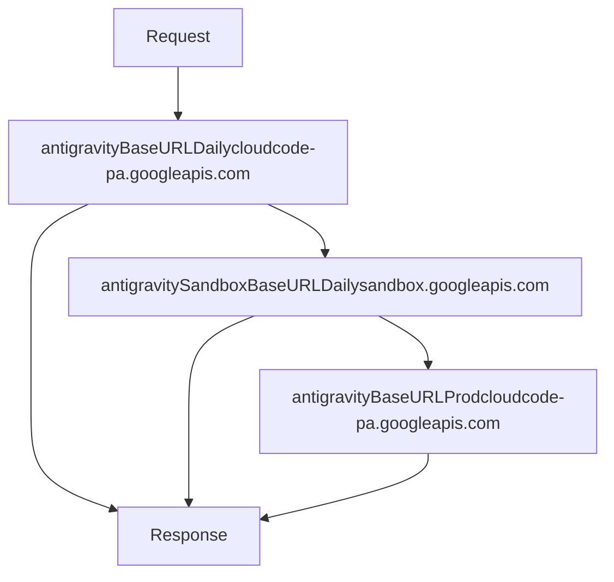

# 供应商执行器系统

相关源文件

-   [internal/runtime/executor/aistudio\_executor.go](https://github.com/router-for-me/CLIProxyAPI/blob/c66cb0af/internal/runtime/executor/aistudio_executor.go)
-   [internal/runtime/executor/antigravity\_executor.go](https://github.com/router-for-me/CLIProxyAPI/blob/c66cb0af/internal/runtime/executor/antigravity_executor.go)
-   [internal/runtime/executor/claude\_executor.go](https://github.com/router-for-me/CLIProxyAPI/blob/c66cb0af/internal/runtime/executor/claude_executor.go)
-   [internal/runtime/executor/codex\_executor.go](https://github.com/router-for-me/CLIProxyAPI/blob/c66cb0af/internal/runtime/executor/codex_executor.go)
-   [internal/runtime/executor/gemini\_cli\_executor.go](https://github.com/router-for-me/CLIProxyAPI/blob/c66cb0af/internal/runtime/executor/gemini_cli_executor.go)
-   [internal/runtime/executor/gemini\_executor.go](https://github.com/router-for-me/CLIProxyAPI/blob/c66cb0af/internal/runtime/executor/gemini_executor.go)
-   [internal/runtime/executor/gemini\_vertex\_executor.go](https://github.com/router-for-me/CLIProxyAPI/blob/c66cb0af/internal/runtime/executor/gemini_vertex_executor.go)
-   [internal/runtime/executor/iflow\_executor.go](https://github.com/router-for-me/CLIProxyAPI/blob/c66cb0af/internal/runtime/executor/iflow_executor.go)
-   [internal/runtime/executor/openai\_compat\_executor.go](https://github.com/router-for-me/CLIProxyAPI/blob/c66cb0af/internal/runtime/executor/openai_compat_executor.go)
-   [internal/runtime/executor/qwen\_executor.go](https://github.com/router-for-me/CLIProxyAPI/blob/c66cb0af/internal/runtime/executor/qwen_executor.go)
-   [internal/watcher/config\_reload.go](https://github.com/router-for-me/CLIProxyAPI/blob/c66cb0af/internal/watcher/config_reload.go)
-   [sdk/cliproxy/auth/conductor.go](https://github.com/router-for-me/CLIProxyAPI/blob/c66cb0af/sdk/cliproxy/auth/conductor.go)
-   [sdk/cliproxy/auth/selector.go](https://github.com/router-for-me/CLIProxyAPI/blob/c66cb0af/sdk/cliproxy/auth/selector.go)
-   [sdk/cliproxy/auth/selector\_test.go](https://github.com/router-for-me/CLIProxyAPI/blob/c66cb0af/sdk/cliproxy/auth/selector_test.go)
-   [sdk/cliproxy/auth/types.go](https://github.com/router-for-me/CLIProxyAPI/blob/c66cb0af/sdk/cliproxy/auth/types.go)
-   [sdk/cliproxy/auth/types\_test.go](https://github.com/router-for-me/CLIProxyAPI/blob/c66cb0af/sdk/cliproxy/auth/types_test.go)

## 用途与范围

供应商执行器系统实现了抽象层，使 CLIProxyAPI 能够通过统一的接口与多个 AI 服务供应商通信。每个供应商执行器负责处理特定供应商的身份验证、请求翻译、HTTP 传输、流式传输、令牌计数和凭证刷新。该系统位于身份验证管理器 ([3.3](/router-for-me/CLIProxyAPI/3.3-authentication-and-credential-management)) 和请求翻译系统 ([3.5](/router-for-me/CLIProxyAPI/3.5-request-translation-system)) 之间，编排对上游供应商的实际 API 调用。

有关在请求处理期间如何选择和轮转执行器的信息，请参阅[模型注册与选择 (3.6)](/router-for-me/CLIProxyAPI/3.6-model-registry-and-selection)。有关身份验证凭证管理的详情，请参阅[身份验证与凭证管理 (3.3)](/router-for-me/CLIProxyAPI/3.3-authentication-and-credential-management)。

---

## ProviderExecutor 接口

所有供应商执行器都实现了 SDK 包中定义的 `cliproxyexecutor.ProviderExecutor` 接口。该接口标准化了身份验证管理器和请求处理器如何与不同的 AI 服务供应商进行交互：

```
type ProviderExecutor interface {    Identifier() string    PrepareRequest(*http.Request, *cliproxyauth.Auth) error    Execute(context.Context, *cliproxyauth.Auth, Request, Options) (Response, error)    ExecuteStream(context.Context, *cliproxyauth.Auth, Request, Options) (<-chan StreamChunk, error)    CountTokens(context.Context, *cliproxyauth.Auth, Request, Options) (Response, error)    Refresh(context.Context, *cliproxyauth.Auth) (*cliproxyauth.Auth, error)}
```
**方法职责：**

| 方法 | 用途 | 返回值 |
| --- | --- | --- |
| `Identifier()` | 返回用于路由的供应商键（例如 "gemini", "claude", "codex"） | 供应商字符串标识符 |
| `PrepareRequest()` | 执行前的请求准备（在当前实现中大多为空操作） | 准备失败则返回错误 |
| `Execute()` | 执行非流式请求 | `cliproxyexecutor.Response` 或错误 |
| `ExecuteStream()` | 通过服务器发送事件 (SSE) 或 WebSocket 执行流式请求 | `cliproxyexecutor.StreamChunk` 通道或错误 |
| `CountTokens()` | 计算请求有效负载（payload）中的令牌数 | 带有令牌计数的 `cliproxyexecutor.Response` 或错误 |
| `Refresh()` | 刷新 OAuth 令牌或服务账号凭证 | 更新后的 `*cliproxyauth.Auth` 对象或错误 |

**关键类型：**

-   `cliproxyexecutor.Request` - 包含 `Model` 字符串、`Payload` 字节和 `Metadata` 映射
-   `cliproxyexecutor.Options` - 包含 `SourceFormat`、`OriginalRequest`、`Stream` 和 `Alt` 字段
-   `cliproxyexecutor.Response` - 包含 `Payload` 字节
-   `cliproxyexecutor.StreamChunk` - 包含 `Payload` 字节和可选的 `Err` 字段

**来源：** [internal/runtime/executor/gemini\_executor.go39-54](https://github.com/router-for-me/CLIProxyAPI/blob/c66cb0af/internal/runtime/executor/gemini_executor.go#L39-L54) [internal/runtime/executor/claude\_executor.go34-40](https://github.com/router-for-me/CLIProxyAPI/blob/c66cb0af/internal/runtime/executor/claude_executor.go#L34-L40) [internal/runtime/executor/codex\_executor.go33-41](https://github.com/router-for-me/CLIProxyAPI/blob/c66cb0af/internal/runtime/executor/codex_executor.go#L33-L41)

---

## 执行器实现

### 概览图

```mermaid
flowchart TD
    GeminiExec["executor.GeminiExecutorIdentifier(): 'gemini'"]
    GeminiCLIExec["executor.GeminiCLIExecutorIdentifier(): 'gemini-cli'"]
    ClaudeExec["executor.ClaudeExecutorIdentifier(): 'claude'"]
    CodexExec["executor.CodexExecutorIdentifier(): 'codex'"]
    AntigravityExec["executor.AntigravityExecutorIdentifier(): 'antigravity'"]
    VertexExec["executor.GeminiVertexExecutorIdentifier(): 'vertex'"]
    QwenExec["executor.QwenExecutorIdentifier(): 'qwen'"]
    IFlowExec["executor.IFlowExecutorIdentifier(): 'iflow'"]
    AIStudioExec["executor.AIStudioExecutorIdentifier(): 'aistudio'"]
    OpenAICompatExec["executor.OpenAICompatExecutorIdentifier(): provider-specific"]
    APIKey["API Key AuthHeader: x-goog-api-keyHeader: Authorization Bearer"]
    OAuth["OAuth 2.0oauth2.TokenSourcecliproxyauth.Auth.Metadata"]
    ServiceAccount["Service Accountgoogle.JWTConfigFromJSONoauth2.JWTAccessTokenSource"]
    Cookie["Cookie Authauth.Attributes['cookie']"]
    HTTP["http.ClientnewProxyAwareHTTPClient()"]
    SSE["SSE Streamingbufio.Scannertext/event-stream"]
    WS["WebSocketwsrelay.Managerwsrelay.HTTPRequest"]

    GeminiExec --> APIKey
    GeminiExec --> OAuth
    GeminiExec --> HTTP
    GeminiExec --> SSE
    GeminiCLIExec --> OAuth
    GeminiCLIExec --> HTTP
    GeminiCLIExec --> SSE
    ClaudeExec --> APIKey
    ClaudeExec --> OAuth
    ClaudeExec --> HTTP
    ClaudeExec --> SSE
    CodexExec --> APIKey
    CodexExec --> OAuth
    CodexExec --> HTTP
    CodexExec --> SSE
    AntigravityExec --> OAuth
    AntigravityExec --> HTTP
    AntigravityExec --> SSE
    VertexExec --> APIKey
    VertexExec --> ServiceAccount
    VertexExec --> HTTP
    VertexExec --> SSE
    QwenExec --> OAuth
    QwenExec --> HTTP
    QwenExec --> SSE
    IFlowExec --> OAuth
    IFlowExec --> Cookie
    IFlowExec --> HTTP
    IFlowExec --> SSE
    AIStudioExec --> OAuth
    AIStudioExec --> WS
    OpenAICompatExec --> APIKey
    OpenAICompatExec --> HTTP
    OpenAICompatExec --> SSE
```


**来源：** [internal/runtime/executor/gemini\_executor.go39-56](https://github.com/router-for-me/CLIProxyAPI/blob/c66cb0af/internal/runtime/executor/gemini_executor.go#L39-L56) [internal/runtime/executor/gemini\_cli\_executor.go47-64](https://github.com/router-for-me/CLIProxyAPI/blob/c66cb0af/internal/runtime/executor/gemini_cli_executor.go#L47-L64) [internal/runtime/executor/claude\_executor.go32-40](https://github.com/router-for-me/CLIProxyAPI/blob/c66cb0af/internal/runtime/executor/claude_executor.go#L32-L40) [internal/runtime/executor/codex\_executor.go31-39](https://github.com/router-for-me/CLIProxyAPI/blob/c66cb0af/internal/runtime/executor/codex_executor.go#L31-L39) [internal/runtime/executor/antigravity\_executor.go56-73](https://github.com/router-for-me/CLIProxyAPI/blob/c66cb0af/internal/runtime/executor/antigravity_executor.go#L56-L73) [internal/runtime/executor/qwen\_executor.go29-39](https://github.com/router-for-me/CLIProxyAPI/blob/c66cb0af/internal/runtime/executor/qwen_executor.go#L29-L39) [internal/runtime/executor/iflow\_executor.go30-41](https://github.com/router-for-me/CLIProxyAPI/blob/c66cb0af/internal/runtime/executor/iflow_executor.go#L30-L41) [internal/runtime/executor/aistudio\_executor.go25-46](https://github.com/router-for-me/CLIProxyAPI/blob/c66cb0af/internal/runtime/executor/aistudio_executor.go#L25-L46) [internal/runtime/executor/openai\_compat\_executor.go22-36](https://github.com/router-for-me/CLIProxyAPI/blob/c66cb0af/internal/runtime/executor/openai_compat_executor.go#L22-L36) [internal/runtime/executor/gemini\_vertex\_executor.go34-51](https://github.com/router-for-me/CLIProxyAPI/blob/c66cb0af/internal/runtime/executor/gemini_vertex_executor.go#L34-L51)

### 执行器注册表 (Executor Registry)

| 执行器 | 标识符 | 基准 URL 常量 | 身份验证 | API 格式 |
| --- | --- | --- | --- | --- |
| `executor.GeminiExecutor` | `"gemini"` | `glEndpoint` = `"https://generativelanguage.googleapis.com"` | `geminiCreds(auth)` - API 密钥或 OAuth | Gemini API `glAPIVersion` = `"v1beta"` |
| `executor.GeminiCLIExecutor` | `"gemini-cli"` | `codeAssistEndpoint` = `"https://cloudcode-pa.googleapis.com"` | `prepareGeminiCLITokenSource()` - OAuth | Gemini CLI `codeAssistVersion` = `"v1internal"` |
| `executor.ClaudeExecutor` | `"claude"` | `"https://api.anthropic.com"` | `claudeCreds(auth)` - API 密钥或 OAuth | Claude Messages API v1 |
| `executor.CodexExecutor` | `"codex"` | `"https://chatgpt.com/backend-api/codex"` | `codexCreds(auth)` - API 密钥或 OAuth | OpenAI Responses API |
| `executor.AntigravityExecutor` | `"antigravity"` | `antigravityBaseURLDaily`, `antigravitySandboxBaseURLDaily`, `antigravityBaseURLProd` | `ensureAccessToken()` - OAuth | Antigravity v1internal |
| `executor.GeminiVertexExecutor` | `"vertex"` | `vertexBaseURL(location)` | `vertexCreds()` 或 `vertexAPICreds()` | Vertex AI `vertexAPIVersion` = `"v1"` |
| `executor.QwenExecutor` | `"qwen"` | `"https://portal.qwen.ai/v1"` | `qwenCreds(auth)` - OAuth | 兼容 OpenAI |
| `executor.IFlowExecutor` | `"iflow"` | `iflowauth.DefaultAPIBaseURL` | `iflowCreds(auth)` - OAuth 或 cookie | 兼容 OpenAI |
| `executor.AIStudioExecutor` | `"aistudio"` | WebSocket 中继 | `wsrelay.Manager` - OAuth | Gemini API v1beta |
| `executor.OpenAICompatExecutor` | 供应商特定 | `resolveCredentials(auth)` | 来自 `auth.Attributes` 的 API 密钥 | 兼容 OpenAI |

**来源：** [internal/runtime/executor/gemini\_executor.go25-33](https://github.com/router-for-me/CLIProxyAPI/blob/c66cb0af/internal/runtime/executor/gemini_executor.go#L25-L33) [internal/runtime/executor/gemini\_cli\_executor.go34-39](https://github.com/router-for-me/CLIProxyAPI/blob/c66cb0af/internal/runtime/executor/gemini_cli_executor.go#L34-L39) [internal/runtime/executor/claude\_executor.go32-40](https://github.com/router-for-me/CLIProxyAPI/blob/c66cb0af/internal/runtime/executor/claude_executor.go#L32-L40) [internal/runtime/executor/codex\_executor.go31-39](https://github.com/router-for-me/CLIProxyAPI/blob/c66cb0af/internal/runtime/executor/codex_executor.go#L31-L39) [internal/runtime/executor/antigravity\_executor.go35-48](https://github.com/router-for-me/CLIProxyAPI/blob/c66cb0af/internal/runtime/executor/antigravity_executor.go#L35-L48) [internal/runtime/executor/qwen\_executor.go23-37](https://github.com/router-for-me/CLIProxyAPI/blob/c66cb0af/internal/runtime/executor/qwen_executor.go#L23-L37) [internal/runtime/executor/iflow\_executor.go24-38](https://github.com/router-for-me/CLIProxyAPI/blob/c66cb0af/internal/runtime/executor/iflow_executor.go#L24-L38) [internal/runtime/executor/aistudio\_executor.go25-46](https://github.com/router-for-me/CLIProxyAPI/blob/c66cb0af/internal/runtime/executor/aistudio_executor.go#L25-L46) [internal/runtime/executor/openai\_compat\_executor.go22-36](https://github.com/router-for-me/CLIProxyAPI/blob/c66cb0af/internal/runtime/executor/openai_compat_executor.go#L22-L36) [internal/runtime/executor/gemini\_vertex\_executor.go29-51](https://github.com/router-for-me/CLIProxyAPI/blob/c66cb0af/internal/runtime/executor/gemini_vertex_executor.go#L29-L51)

---

## 执行流程

### 非流式请求流程

> **[Mermaid sequence]**
> *(图表结构无法解析)*

**来源：** [internal/runtime/executor/gemini\_executor.go72-165](https://github.com/router-for-me/CLIProxyAPI/blob/c66cb0af/internal/runtime/executor/gemini_executor.go#L72-L165) [internal/runtime/executor/claude\_executor.go44-158](https://github.com/router-for-me/CLIProxyAPI/blob/c66cb0af/internal/runtime/executor/claude_executor.go#L44-L158) [internal/runtime/executor/codex\_executor.go43-134](https://github.com/router-for-me/CLIProxyAPI/blob/c66cb0af/internal/runtime/executor/codex_executor.go#L43-L134)

### 流式请求流程

流式请求遵循类似的模式，但返回一个异步产生流分块（stream chunks）的通道：

1.  **设置阶段**：请求翻译、有效负载配置、身份验证标头应用。
2.  **HTTP 请求**：发送带有 `Accept: text/event-stream` 标头的请求。
3.  **流处理**：启动 goroutine 通过 `bufio.Scanner` 读取 SSE 行。
4.  **分块翻译**：每一行 SSE 通过 `sdktranslator.TranslateStream()` 进行翻译。
5.  **使用情况跟踪**：从流事件中解析使用情况元数据（例如 Codex 的 `response.completed`）。
6.  **错误处理**：Scanner 错误传播为 `StreamChunk{Err: ...}` 并关闭通道。

**来源：** [internal/runtime/executor/gemini\_executor.go167-281](https://github.com/router-for-me/CLIProxyAPI/blob/c66cb0af/internal/runtime/executor/gemini_executor.go#L167-L281) [internal/runtime/executor/claude\_executor.go160-300](https://github.com/router-for-me/CLIProxyAPI/blob/c66cb0af/internal/runtime/executor/claude_executor.go#L160-L300) [internal/runtime/executor/codex\_executor.go136-238](https://github.com/router-for-me/CLIProxyAPI/blob/c66cb0af/internal/runtime/executor/codex_executor.go#L136-L238)

---

## 通用模式与实用程序

### 凭证解析

每个执行器都实现了一个凭证解析函数，用于从 `cliproxyauth.Auth` 中提取身份验证数据：

```
模式：
func {provider}Creds(auth *cliproxyauth.Auth) (apiKey, baseURL string) {
    // 1. 检查 auth.Attributes 中的 api_key 和 base_url
    // 2. 回退到 auth.Metadata 获取 access_token 或嵌套令牌映射
    // 3. 返回提取的凭证
}
```
**示例：**

-   [internal/runtime/executor/gemini\_executor.go459-480](https://github.com/router-for-me/CLIProxyAPI/blob/c66cb0af/internal/runtime/executor/gemini_executor.go#L459-L480) - `geminiCreds()`
-   [internal/runtime/executor/claude\_executor.go768-782](https://github.com/router-for-me/CLIProxyAPI/blob/c66cb0af/internal/runtime/executor/claude_executor.go#L768-L782) - `claudeCreds()`
-   [internal/runtime/executor/codex\_executor.go500-514](https://github.com/router-for-me/CLIProxyAPI/blob/c66cb0af/internal/runtime/executor/codex_executor.go#L500-L514) - `codexCreds()`
-   [internal/runtime/executor/qwen\_executor.go297-318](https://github.com/router-for-me/CLIProxyAPI/blob/c66cb0af/internal/runtime/executor/qwen_executor.go#L297-L318) - `qwenCreds()`

### HTTP 客户端创建

所有执行器都使用 `newProxyAwareHTTPClient()` 来创建遵循 `auth.Attributes` 中代理配置的 HTTP 客户端：

```
httpClient := newProxyAwareHTTPClient(ctx, e.cfg, auth, timeout)httpResp, err := httpClient.Do(httpReq)
```
**来源：** [internal/runtime/executor/gemini\_cli\_executor.go620-622](https://github.com/router-for-me/CLIProxyAPI/blob/c66cb0af/internal/runtime/executor/gemini_cli_executor.go#L620-L622)

### 使用情况报告 (Usage Reporting)

每个执行器都实例化一个 `usageReporter`（定义在 `internal/runtime/executor/usage.go` 中）来跟踪令牌消耗：

```
reporter := newUsageReporter(ctx, e.Identifier(), req.Model, auth)defer reporter.trackFailure(ctx, &err)// ... 执行请求 ...reporter.publish(ctx, parseGeminiUsage(data))reporter.ensurePublished(ctx) // 确保即使上游省略了使用情况，也会被记录
```
**usageReporter 方法：**

| 方法 | 用途 |
| --- | --- |
| `newUsageReporter(ctx, provider, model, auth)` | 使用请求上下文创建报告器实例 |
| `publish(ctx, usageDetail)` | 向上下文发布使用情况数据（输入/输出/推理令牌） |
| `publishFailure(ctx)` | 将请求标记为失败 |
| `trackFailure(ctx, *error)` | 延迟调用，如果设置了错误则发布失败 |
| `ensurePublished(ctx)` | 如果未接收到使用情况数据，则发布最小使用情况记录 |

**供应商特定的使用情况解析器：**

-   `parseGeminiUsage(data []byte)` - 从 Gemini 响应中解析 `usageMetadata`
-   `parseGeminiStreamUsage(data []byte)` - 解析 SSE 分块的使用情况
-   `parseClaudeUsage(data []byte)` - 从 Claude 响应中解析 `usage`
-   `parseClaudeStreamUsage(line []byte)` - 解析 Claude SSE 事件使用情况
-   `parseCodexUsage(data []byte)` - 从 Codex 解析 `response.usage`
-   `parseOpenAIUsage(data []byte)` - 解析兼容 OpenAI 的使用情况
-   `parseOpenAIStreamUsage(line []byte)` - 解析 OpenAI SSE 使用情况
-   `parseAntigravityUsage(data []byte)` - 解析 Antigravity 响应使用情况
-   `parseAntigravityStreamUsage(data []byte)` - 解析 Antigravity SSE 使用情况

**来源：** [internal/runtime/executor/gemini\_executor.go77-78](https://github.com/router-for-me/CLIProxyAPI/blob/c66cb0af/internal/runtime/executor/gemini_executor.go#L77-L78) [internal/runtime/executor/claude\_executor.go50-51](https://github.com/router-for-me/CLIProxyAPI/blob/c66cb0af/internal/runtime/executor/claude_executor.go#L50-L51) [internal/runtime/executor/codex\_executor.go49-50](https://github.com/router-for-me/CLIProxyAPI/blob/c66cb0af/internal/runtime/executor/codex_executor.go#L49-L50) [internal/runtime/executor/iflow\_executor.go54-55](https://github.com/router-for-me/CLIProxyAPI/blob/c66cb0af/internal/runtime/executor/iflow_executor.go#L54-L55)

### 请求日志记录 (Request Logging)

所有执行器都使用 `internal/runtime/executor/logging.go` 中定义的辅助函数记录 API 请求和响应：

```
// 记录传出的请求recordAPIRequest(ctx, e.cfg, upstreamRequestLog{    URL: url, Method: http.MethodPost, Headers: httpReq.Header.Clone(),    Body: body, Provider: e.Identifier(),    AuthID: authID, AuthLabel: authLabel, AuthType: authType, AuthValue: authValue,}) // 记录响应元数据recordAPIResponseMetadata(ctx, e.cfg, httpResp.StatusCode, httpResp.Header.Clone()) // 记录响应体分块 (流式或非流式)appendAPIResponseChunk(ctx, e.cfg, data) // 记录错误recordAPIResponseError(ctx, e.cfg, err)
```
**upstreamRequestLog 结构体字段：**

-   `URL` - 完整的端点 URL
-   `Method` - HTTP 方法
-   `Headers` - 请求标头（克隆以确保安全）
-   `Body` - 请求有效负载字节
-   `Provider` - 执行器标识符
-   `AuthID`, `AuthLabel`, `AuthType`, `AuthValue` - 身份验证元数据

这些函数将日志数据存储在上下文键（context keys）中，可以由请求日志记录中间件检索，并在通过 `config.RequestLogger` 启用时写入日志文件。

**来源：** [internal/runtime/executor/gemini\_executor.go133-143](https://github.com/router-for-me/CLIProxyAPI/blob/c66cb0af/internal/runtime/executor/gemini_executor.go#L133-L143) [internal/runtime/executor/claude\_executor.go97-107](https://github.com/router-for-me/CLIProxyAPI/blob/c66cb0af/internal/runtime/executor/claude_executor.go#L97-L107) [internal/runtime/executor/codex\_executor.go87-97](https://github.com/router-for-me/CLIProxyAPI/blob/c66cb0af/internal/runtime/executor/codex_executor.go#L87-L97)

### 有效负载配置 (Payload Configuration)

`applyPayloadConfig()` 和 `applyPayloadConfigWithRoot()` 函数（定义在 `internal/runtime/executor/payload_helpers.go` 中）将 `config.yaml` 中的配置规则应用于请求有效负载：

**有效负载配置流程：**

1.  使用 `matchModelPattern()` 将模型名称与 `config.PayloadConfig` 条目匹配。
2.  为每个匹配条目提取 `defaults` 和 `overrides` 映射。
3.  首先应用默认值 (defaults)（仅设置不存在的字段）。
4.  然后应用覆盖值 (overrides)（始终覆盖现有值）。
5.  支持针对供应商特定格式的嵌套根路径。

**函数签名：**

```
// 标准有效负载配置 (无根路径)func applyPayloadConfig(cfg *config.Config, model string, body []byte) []byte // 带有根路径和供应商类型的有效负载配置func applyPayloadConfigWithRoot(cfg *config.Config, model, providerType, root string,     body, originalBody []byte) []byte
```
**用法示例：**

```
// 应用 Gemini 标准 API 配置body = applyPayloadConfig(e.cfg, req.Model, body) // 应用带有 "request" 根路径的 Gemini CLI 配置body = applyPayloadConfigWithRoot(e.cfg, req.Model, "gemini", "request", body, originalTranslated) // 应用具有供应商特定处理的 Antigravity 配置body = applyPayloadConfigWithRoot(e.cfg, req.Model, "antigravity", "request", body, originalTranslated)
```
**模型模式匹配：**

-   精确匹配：`"gemini-2.5-pro"` 仅匹配 `gemini-2.5-pro`。
-   通配符匹配：`"gemini-*"` 匹配任何以 `gemini-` 开头的模型。
-   多个模式：`["gemini-*", "claude-*"]` 匹配任何 Gemini 或 Claude 模型。

**来源：** [internal/runtime/executor/payload\_helpers.go86-149](https://github.com/router-for-me/CLIProxyAPI/blob/c66cb0af/internal/runtime/executor/payload_helpers.go#L86-L149) [internal/runtime/executor/gemini\_executor.go99](https://github.com/router-for-me/CLIProxyAPI/blob/c66cb0af/internal/runtime/executor/gemini_executor.go#L99-L99) [internal/runtime/executor/gemini\_cli\_executor.go92](https://github.com/router-for-me/CLIProxyAPI/blob/c66cb0af/internal/runtime/executor/gemini_cli_executor.go#L92-L92) [internal/runtime/executor/antigravity\_executor.go109](https://github.com/router-for-me/CLIProxyAPI/blob/c66cb0af/internal/runtime/executor/antigravity_executor.go#L109-L109)

---

## 供应商特定特性

### Gemini: 思考 (Thinking) 配置

Gemini 执行器为支持扩展推理的模型处理思考配置：

| 函数 | 用途 | JSON 路径 |
| --- | --- | --- |
| `applyThinkingMetadata()` | 从模型后缀应用思考配置（例如 `-thinking-medium`） | `generationConfig.thinkingConfig` |
| `util.ApplyDefaultThinkingIfNeeded()` | 为 `gemini-3-pro-preview` 等模型注入默认思考配置 | `generationConfig.thinkingConfig.thinkingBudget` |
| `util.NormalizeGeminiThinkingBudget()` | 将预算值规范化到有效范围 | `generationConfig.thinkingConfig.thinkingBudget` |
| `util.StripThinkingConfigIfUnsupported()` | 移除非思考模型的思考配置 | 移除整个 `thinkingConfig` 对象 |
| `fixGeminiImageAspectRatio()` | 处理 `gemini-2.5-flash-image-preview` 的图像生成宽高比 | `generationConfig.imageConfig.aspectRatio` |

**来源：** [internal/runtime/executor/payload\_helpers.go12-44](https://github.com/router-for-me/CLIProxyAPI/blob/c66cb0af/internal/runtime/executor/payload_helpers.go#L12-L44) [internal/util/gemini\_thinking.go74-187](https://github.com/router-for-me/CLIProxyAPI/blob/c66cb0af/internal/util/gemini_thinking.go#L74-L187) [internal/runtime/executor/gemini\_executor.go84-89](https://github.com/router-for-me/CLIProxyAPI/blob/c66cb0af/internal/runtime/executor/gemini_executor.go#L84-L89) [internal/runtime/executor/gemini\_executor.go503-543](https://github.com/router-for-me/CLIProxyAPI/blob/c66cb0af/internal/runtime/executor/gemini_executor.go#L503-L543)

### Claude: 思考配置与 Beta 特性

Claude 执行器通过 Claude Messages API 管理思考配置：

```
// 从元数据或模型后缀注入思考配置body = e.injectThinkingConfig(req.Model, req.Metadata, body) // 启用思考时，确保 max_tokens > thinking.budget_tokensbody = ensureMaxTokensForThinking(req.Model, body) // 从请求体提取 beta 并移动到标头var extraBetas []stringextraBetas, body = extractAndRemoveBetas(body)applyClaudeHeaders(httpReq, auth, apiKey, stream, extraBetas)
```
该执行器：

-   解析模型后缀（如 `-thinking-low`, `-thinking-medium`, `-thinking-high`）中的思考预算。
-   强制执行 Anthropic 的约束：`max_tokens > thinking.budget_tokens`。
-   通过请求体中的 `betas` 数组支持自定义 Beta 特性。
-   为 Claude Code 身份添加系统指令前缀。

**来源：** [internal/runtime/executor/claude\_executor.go454-506](https://github.com/router-for-me/CLIProxyAPI/blob/c66cb0af/internal/runtime/executor/claude_executor.go#L454-L506) [internal/runtime/executor/claude\_executor.go508-542](https://github.com/router-for-me/CLIProxyAPI/blob/c66cb0af/internal/runtime/executor/claude_executor.go#L508-L542) [internal/runtime/executor/claude\_executor.go432-451](https://github.com/router-for-me/CLIProxyAPI/blob/c66cb0af/internal/runtime/executor/claude_executor.go#L432-L451) [internal/runtime/executor/claude\_executor.go784-801](https://github.com/router-for-me/CLIProxyAPI/blob/c66cb0af/internal/runtime/executor/claude_executor.go#L784-L801)

### Codex: 提示词缓存 (Prompt Caching)

Codex 执行器使用对话 ID 和会话 ID 实现提示词缓存：

```
func (e *CodexExecutor) cacheHelper(ctx context.Context, from sdktranslator.Format,     url string, req cliproxyexecutor.Request, rawJSON []byte) (*http.Request, error) {        var cache codexCache    if from == "claude" {        // 使用 Claude 元数据中的 user_id 构建缓存键        userIDResult := gjson.GetBytes(req.Payload, "metadata.user_id")        if userIDResult.Exists() {            key := fmt.Sprintf("%s-%s", req.Model, userIDResult.String())            cache = codexCacheMap[key] // 检查现有缓存        }    } else if from == "openai-response" {        cache.ID = gjson.GetBytes(req.Payload, "prompt_cache_key").String()    }        rawJSON, _ = sjson.SetBytes(rawJSON, "prompt_cache_key", cache.ID)    httpReq.Header.Set("Conversation_id", cache.ID)    httpReq.Header.Set("Session_id", cache.ID)    return httpReq, nil}
```
**来源：** [internal/runtime/executor/codex\_executor.go430-460](https://github.com/router-for-me/CLIProxyAPI/blob/c66cb0af/internal/runtime/executor/codex_executor.go#L430-L460)

### Codex: 本地令牌计数

Codex 使用 `tiktoken-go` 进行本地令牌计数，无需 API 调用：

```
func tokenizerForCodexModel(model string) (tokenizer.Codec, error) {    sanitized := strings.ToLower(strings.TrimSpace(model))    switch {    case strings.HasPrefix(sanitized, "gpt-5"):        return tokenizer.ForModel(tokenizer.GPT5)    case strings.HasPrefix(sanitized, "gpt-4o"):        return tokenizer.ForModel(tokenizer.GPT4o)    case strings.HasPrefix(sanitized, "gpt-4"):        return tokenizer.ForModel(tokenizer.GPT4)    default:        return tokenizer.Get(tokenizer.Cl100kBase)    }} count, err := countCodexInputTokens(enc, body)
```
**来源：** [internal/runtime/executor/codex\_executor.go269-389](https://github.com/router-for-me/CLIProxyAPI/blob/c66cb0af/internal/runtime/executor/codex_executor.go#L269-L389)

### Vertex: 双重身份验证

Vertex 执行器支持服务账号 JWT 和 API 密钥两种身份验证方式：

```
// 首先尝试 API 密钥apiKey, baseURL := vertexAPICreds(auth)if apiKey == "" {    // 回退到服务账号    projectID, location, saJSON, err := vertexCreds(auth)    return e.executeWithServiceAccount(ctx, auth, req, opts, projectID, location, saJSON)}return e.executeWithAPIKey(ctx, auth, req, opts, apiKey, baseURL)
```
服务账号身份验证使用 `oauth2.JWTAccessTokenSource` 签发访问令牌：

```
func vertexAccessToken(ctx context.Context, cfg *config.Config,     auth *cliproxyauth.Auth, saJSON []byte) (string, error) {        jwtCfg, err := google.JWTConfigFromJSON(saJSON, vertexauth.VertexScope)    src := jwtCfg.TokenSource(ctx)    tok, err := src.Token()    return tok.AccessToken, err}
```
**来源：** [internal/runtime/executor/gemini\_vertex\_executor.go53-68](https://github.com/router-for-me/CLIProxyAPI/blob/c66cb0af/internal/runtime/executor/gemini_vertex_executor.go#L53-L68) [internal/runtime/executor/gemini\_vertex\_executor.go289-388](https://github.com/router-for-me/CLIProxyAPI/blob/c66cb0af/internal/runtime/executor/gemini_vertex_executor.go#L289-L388)

### AIStudio: WebSocket 传输

AIStudio 执行器使用 WebSocket 中继管理器进行基于浏览器的身份验证：

```
func (e *AIStudioExecutor) Execute(ctx context.Context, auth *cliproxyauth.Auth,     req cliproxyexecutor.Request, opts cliproxyexecutor.Options) (resp cliproxyexecutor.Response, err error) {        wsReq := &wsrelay.HTTPRequest{        Method:  http.MethodPost,        URL:     endpoint,        Headers: http.Header{"Content-Type": []string{"application/json"}},        Body:    body.payload,    }        wsResp, err := e.relay.NonStream(ctx, authID, wsReq)    // ... 处理 websocket 响应 ...}
```
流处理负责处理 WebSocket 事件：

-   `MessageTypeStreamStart` - 初始元数据
-   `MessageTypeStreamChunk` - 数据分块
-   `MessageTypeStreamEnd` - 流完成
-   `MessageTypeError` - 错误事件

**来源：** [internal/runtime/executor/aistudio\_executor.go42-93](https://github.com/router-for-me/CLIProxyAPI/blob/c66cb0af/internal/runtime/executor/aistudio_executor.go#L42-L93) [internal/runtime/executor/aistudio\_executor.go95-240](https://github.com/router-for-me/CLIProxyAPI/blob/c66cb0af/internal/runtime/executor/aistudio_executor.go#L95-L240)

### IFlow: 双重身份验证 (OAuth + Cookie)

IFlow 执行器支持 OAuth 和基于 Cookie 的两种身份验证：

```
func (e *IFlowExecutor) Refresh(ctx context.Context, auth *cliproxyauth.Auth) (*cliproxyauth.Auth, error) {    var cookie string    var email string    if auth.Metadata != nil {        cookie = strings.TrimSpace(auth.Metadata["cookie"].(string))        email = strings.TrimSpace(auth.Metadata["email"].(string))    }        if cookie != "" && email != "" {        return e.refreshCookieBased(ctx, auth, cookie, email)    }        return e.refreshOAuthBased(ctx, auth)}
```
基于 Cookie 的刷新在刷新前会检查过期时间：

```
func (e *IFlowExecutor) refreshCookieBased(ctx context.Context, auth *cliproxyauth.Auth,     cookie, email string) (*cliproxyauth.Auth, error) {        needsRefresh, _, err := iflowauth.ShouldRefreshAPIKey(currentExpire)    if !needsRefresh {        return auth, nil // 无需刷新    }        keyData, err := svc.RefreshAPIKey(ctx, cookie, email)    auth.Metadata["api_key"] = keyData.APIKey    auth.Metadata["expired"] = keyData.ExpireTime    return auth, nil}
```
**来源：** [internal/runtime/executor/iflow\_executor.go258-334](https://github.com/router-for-me/CLIProxyAPI/blob/c66cb0af/internal/runtime/executor/iflow_executor.go#L258-L334) [internal/runtime/executor/iflow\_executor.go286-334](https://github.com/router-for-me/CLIProxyAPI/blob/c66cb0af/internal/runtime/executor/iflow_executor.go#L286-L334)

### Antigravity: 多 URL 回退与思考规范化

Antigravity 执行器实现了具有弹性的多 URL 回退机制，以实现高可用性：


执行器通过 `antigravityBaseURLFallbackOrder()` 提供自动回退排序：

```
1. 生产环境日常 URL (cloudcode-pa.googleapis.com)
2. 沙盒环境日常 URL (sandbox.googleapis.com)
3. 生产环境 URL 回退
```
**思考配置规范化：**

Antigravity 使用 `normalizeAntigravityThinking()` 进行统一的思考规范化，该函数：

-   将数字形式的思考预算转换为标准格式。
-   同时支持 Gemini 风格和 Claude 风格的思考配置。
-   将思考级别映射到供应商特定的格式。
-   为扩展思考模式验证思考签名。

**模型别名转换：**

该执行器使用 `modelName2Alias()` 将 Google 模型名称转换为标准别名：

-   `models/gemini-2.5-flash` → `gemini-2.5-flash`
-   `models/claude-3-5-sonnet-v2@20241022` → `claude-3-5-sonnet-20241022`

**来源：** [internal/runtime/executor/antigravity\_executor.go35-48](https://github.com/router-for-me/CLIProxyAPI/blob/c66cb0af/internal/runtime/executor/antigravity_executor.go#L35-L48) [internal/runtime/executor/antigravity\_executor.go886-945](https://github.com/router-for-me/CLIProxyAPI/blob/c66cb0af/internal/runtime/executor/antigravity_executor.go#L886-L945) [internal/runtime/executor/antigravity\_executor.go1011-1052](https://github.com/router-for-me/CLIProxyAPI/blob/c66cb0af/internal/runtime/executor/antigravity_executor.go#L1011-L1052) [internal/runtime/executor/antigravity\_executor.go78-173](https://github.com/router-for-me/CLIProxyAPI/blob/c66cb0af/internal/runtime/executor/antigravity_executor.go#L78-L173)

### 兼容 OpenAI 的供应商: 模型别名

兼容 OpenAI 的执行器从配置中解析模型别名：

```
func (e *OpenAICompatExecutor) resolveUpstreamModel(alias string, auth *cliproxyauth.Auth) string {    compat := e.resolveCompatConfig(auth) // 查找匹配的配置条目        for i := range compat.Models {        model := compat.Models[i]        if model.Alias != "" && strings.EqualFold(model.Alias, alias) {            return model.Name // 返回真实模型名称        }    }    return ""}
```
这实现了透明的模型替换（例如，`claude-opus` → `claude-3-5-sonnet-20241022`）。

**来源：** [internal/runtime/executor/openai\_compat\_executor.go290-314](https://github.com/router-for-me/CLIProxyAPI/blob/c66cb0af/internal/runtime/executor/openai_compat_executor.go#L290-L314)

---

## 错误处理

### 状态错误类型 (Status Error Type)

执行器返回一个实现了错误接口并包含额外元数据的 `statusErr` 结构体：

```
type statusErr struct {    code       int    msg        string    retryAfter *time.Duration} func (e statusErr) Error() string          { return e.msg }func (e statusErr) StatusCode() int        { return e.code }func (e statusErr) RetryAfter() *time.Duration { return e.retryAfter }
```
**来源：** [internal/runtime/executor/openai\_compat\_executor.go351-365](https://github.com/router-for-me/CLIProxyAPI/blob/c66cb0af/internal/runtime/executor/openai_compat_executor.go#L351-L365)

### Retry-After 解析

Gemini CLI 执行器从 Google API 429 响应中解析 `retryDelay`：

```
func parseRetryDelay(errorBody []byte) (*time.Duration, error) {    details := gjson.GetBytes(errorBody, "error.details")    for _, detail := range details.Array() {        if detail.Get("@type").String() == "type.googleapis.com/google.rpc.RetryInfo" {            retryDelay := detail.Get("retryDelay").String()            duration, err := time.ParseDuration(retryDelay) // 例如, "0.847655010s"            return &duration, nil        }    }    return nil, fmt.Errorf("未找到 RetryInfo")}
```
**来源：** [internal/runtime/executor/gemini\_cli\_executor.go766-793](https://github.com/router-for-me/CLIProxyAPI/blob/c66cb0af/internal/runtime/executor/gemini_cli_executor.go#L766-L793)

### 响应体解码

Claude 执行器透明地处理多种压缩格式：

```
func decodeResponseBody(body io.ReadCloser, contentEncoding string) (io.ReadCloser, error) {    encodings := strings.Split(contentEncoding, ",")    for _, encoding := range encodings {        switch encoding {        case "gzip":            return gzip.NewReader(body)        case "deflate":            return flate.NewReader(body)        case "br":            return brotli.NewReader(body)        case "zstd":            return zstd.NewReader(body)        }    }    return body, nil}
```
**来源：** [internal/runtime/executor/claude\_executor.go646-706](https://github.com/router-for-me/CLIProxyAPI/blob/c66cb0af/internal/runtime/executor/claude_executor.go#L646-L706)

---

## 令牌计数 (Token Counting)

### 供应商特定实现

| 供应商 | 方法 | 实现 |
| --- | --- | --- |
| Gemini | API 端点 | POST 到 `/models/{model}:countTokens` |
| Claude | API 端点 | POST 到 `/v1/messages/count_tokens` |
| Codex | 本地 tiktoken | 使用模型特定编码的 `tiktoken-go` 库 |
| Qwen | 本地 tiktoken | 使用 `tiktoken-go` 库，回退到 `Cl100kBase` |
| IFlow | 本地 tiktoken | 使用 `tiktoken-go` 库 |
| OpenAI-兼容 | 本地 tiktoken | 使用 `tiktoken-go` 库 |
| Vertex | API 端点 | POST 到 `/models/{model}:countTokens` |
| AIStudio | API 端点 (通过 WebSocket) | 通过中继 POST 到 `/models/{model}:countTokens` |

### 本地令牌计数流程

> **[Mermaid sequence]**
> *(图表结构无法解析)*

**来源：** [internal/runtime/executor/codex\_executor.go240-267](https://github.com/router-for-me/CLIProxyAPI/blob/c66cb0af/internal/runtime/executor/codex_executor.go#L240-L267) [internal/runtime/executor/codex\_executor.go289-389](https://github.com/router-for-me/CLIProxyAPI/blob/c66cb0af/internal/runtime/executor/codex_executor.go#L289-L389) [internal/runtime/executor/qwen\_executor.go219-242](https://github.com/router-for-me/CLIProxyAPI/blob/c66cb0af/internal/runtime/executor/qwen_executor.go#L219-L242)

---

## 凭证刷新

### OAuth 令牌刷新

多个执行器使用的标准 OAuth 刷新模式：

```
func (e *ExecutorType) Refresh(ctx context.Context, auth *cliproxyauth.Auth) (*cliproxyauth.Auth, error) {    var refreshToken string    if auth.Metadata != nil {        refreshToken = auth.Metadata["refresh_token"].(string)    }    if refreshToken == "" {        return auth, nil // 无需刷新    }        svc := providerauth.NewAuth(e.cfg)    tokenData, err := svc.RefreshTokens(ctx, refreshToken)    if err != nil {        return nil, err    }        auth.Metadata["access_token"] = tokenData.AccessToken    auth.Metadata["refresh_token"] = tokenData.RefreshToken    auth.Metadata["expired"] = tokenData.Expire    auth.Metadata["last_refresh"] = time.Now().Format(time.RFC3339)    return auth, nil}
```
**实现：**

-   Claude: [internal/runtime/executor/claude\_executor.go398-430](https://github.com/router-for-me/CLIProxyAPI/blob/c66cb0af/internal/runtime/executor/claude_executor.go#L398-L430)
-   Codex: [internal/runtime/executor/codex\_executor.go391-428](https://github.com/router-for-me/CLIProxyAPI/blob/c66cb0af/internal/runtime/executor/codex_executor.go#L391-L428)
-   Qwen: [internal/runtime/executor/qwen\_executor.go244-282](https://github.com/router-for-me/CLIProxyAPI/blob/c66cb0af/internal/runtime/executor/qwen_executor.go#L244-L282)
-   IFlow: [internal/runtime/executor/iflow\_executor.go336-389](https://github.com/router-for-me/CLIProxyAPI/blob/c66cb0af/internal/runtime/executor/iflow_executor.go#L336-L389)

### 带有共享凭证的 Gemini OAuth 刷新

Gemini CLI 执行器处理跨虚拟账户的共享凭证：

```
func updateGeminiCLITokenMetadata(auth *cliproxyauth.Auth, base map[string]any, tok *oauth2.Token) {    merged := buildGeminiTokenMap(base, tok)    fields := buildGeminiTokenFields(tok, merged)        shared := geminicli.ResolveSharedCredential(auth.Runtime)    if shared != nil {        snapshot := shared.MergeMetadata(fields)        if !geminicli.IsVirtual(auth.Runtime) {            auth.Metadata = snapshot        }        return    }        // 非共享凭证的标准元数据更新    for k, v := range fields {        auth.Metadata[k] = v    }}
```
**来源：** [internal/runtime/executor/gemini\_cli\_executor.go538-558](https://github.com/router-for-me/CLIProxyAPI/blob/c66cb0af/internal/runtime/executor/gemini_cli_executor.go#L538-L558)

---

## 与其他系统集成

### 身份验证管理器集成

执行器在服务启动期间被实例化并注册到身份验证管理器：

```
// 在 auth.Manager 初始化中executors := map[string]cliproxyexecutor.ProviderExecutor{    "gemini":     executor.NewGeminiExecutor(cfg),    "gemini-cli": executor.NewGeminiCLIExecutor(cfg),    "claude":     executor.NewClaudeExecutor(cfg),    "codex":      executor.NewCodexExecutor(cfg),    "vertex":     executor.NewGeminiVertexExecutor(cfg),    // ... 等等}
```
管理器在请求处理期间通过 [3.6](/router-for-me/CLIProxyAPI/3.6-model-registry-and-selection) 中描述的执行模式调用执行器。

### 请求翻译集成

所有执行器都使用 `sdktranslator` 进行格式转换：

```
from := opts.SourceFormat  // 例如, "openai"to := sdktranslator.FromString("gemini")body := sdktranslator.TranslateRequest(from, to, model, payload, stream) // 执行后output := sdktranslator.TranslateNonStream(ctx, to, from, model, originalRequest, body, response, &param)
```
**来源：** [internal/runtime/executor/gemini\_executor.go82-83](https://github.com/router-for-me/CLIProxyAPI/blob/c66cb0af/internal/runtime/executor/gemini_executor.go#L82-L83) [internal/runtime/executor/gemini\_executor.go162](https://github.com/router-for-me/CLIProxyAPI/blob/c66cb0af/internal/runtime/executor/gemini_executor.go#L162-L162)

### 配置系统集成

执行器通过以下方式访问配置：

-   通过 `util.SetProxy(&e.cfg.SDKConfig, httpClient)` 进行代理设置。
-   通过 `applyPayloadConfig(e.cfg, req.Model, body)` 应用有效负载规则。
-   供应商特定设置（基准 URL、模型映射、默认思考预算）。

**来源：** [internal/runtime/executor/payload\_helpers.go86-149](https://github.com/router-for-me/CLIProxyAPI/blob/c66cb0af/internal/runtime/executor/payload_helpers.go#L86-L149)
