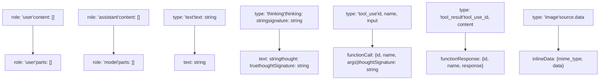
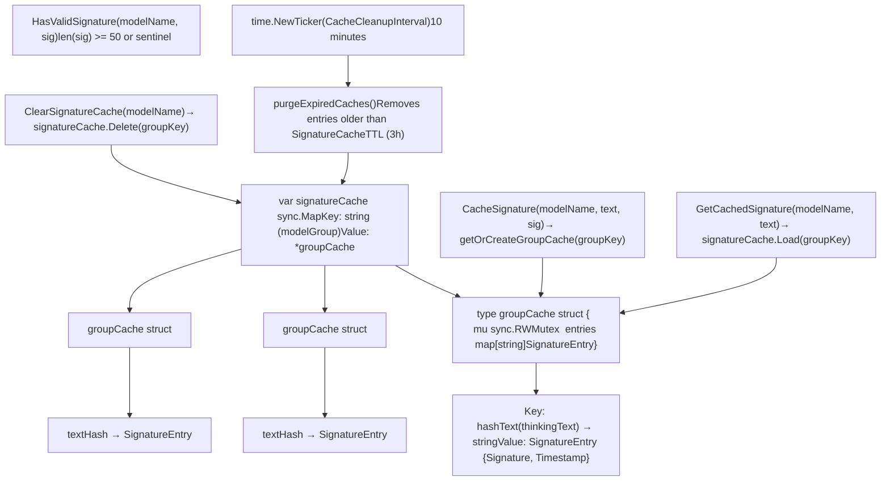

# 请求翻译系统

相关源文件

-   [internal/cache/signature\_cache.go](https://github.com/router-for-me/CLIProxyAPI/blob/c66cb0af/internal/cache/signature_cache.go)
-   [internal/cache/signature\_cache\_test.go](https://github.com/router-for-me/CLIProxyAPI/blob/c66cb0af/internal/cache/signature_cache_test.go)
-   [internal/logging/global\_logger.go](https://github.com/router-for-me/CLIProxyAPI/blob/c66cb0af/internal/logging/global_logger.go)
-   [internal/thinking/apply.go](https://github.com/router-for-me/CLIProxyAPI/blob/c66cb0af/internal/thinking/apply.go)
-   [internal/thinking/types.go](https://github.com/router-for-me/CLIProxyAPI/blob/c66cb0af/internal/thinking/types.go)
-   [internal/thinking/validate.go](https://github.com/router-for-me/CLIProxyAPI/blob/c66cb0af/internal/thinking/validate.go)
-   [internal/translator/antigravity/claude/antigravity\_claude\_request.go](https://github.com/router-for-me/CLIProxyAPI/blob/c66cb0af/internal/translator/antigravity/claude/antigravity_claude_request.go)
-   [internal/translator/antigravity/claude/antigravity\_claude\_request\_test.go](https://github.com/router-for-me/CLIProxyAPI/blob/c66cb0af/internal/translator/antigravity/claude/antigravity_claude_request_test.go)
-   [internal/translator/antigravity/claude/antigravity\_claude\_response.go](https://github.com/router-for-me/CLIProxyAPI/blob/c66cb0af/internal/translator/antigravity/claude/antigravity_claude_response.go)
-   [internal/translator/antigravity/claude/antigravity\_claude\_response\_test.go](https://github.com/router-for-me/CLIProxyAPI/blob/c66cb0af/internal/translator/antigravity/claude/antigravity_claude_response_test.go)
-   [internal/translator/antigravity/gemini/antigravity\_gemini\_request.go](https://github.com/router-for-me/CLIProxyAPI/blob/c66cb0af/internal/translator/antigravity/gemini/antigravity_gemini_request.go)
-   [internal/translator/antigravity/gemini/antigravity\_gemini\_request\_test.go](https://github.com/router-for-me/CLIProxyAPI/blob/c66cb0af/internal/translator/antigravity/gemini/antigravity_gemini_request_test.go)
-   [internal/translator/antigravity/openai/chat-completions/antigravity\_openai\_request.go](https://github.com/router-for-me/CLIProxyAPI/blob/c66cb0af/internal/translator/antigravity/openai/chat-completions/antigravity_openai_request.go)
-   [internal/translator/antigravity/openai/chat-completions/antigravity\_openai\_response.go](https://github.com/router-for-me/CLIProxyAPI/blob/c66cb0af/internal/translator/antigravity/openai/chat-completions/antigravity_openai_response.go)
-   [internal/translator/antigravity/openai/chat-completions/antigravity\_openai\_response\_test.go](https://github.com/router-for-me/CLIProxyAPI/blob/c66cb0af/internal/translator/antigravity/openai/chat-completions/antigravity_openai_response_test.go)
-   [internal/translator/claude/gemini/claude\_gemini\_request.go](https://github.com/router-for-me/CLIProxyAPI/blob/c66cb0af/internal/translator/claude/gemini/claude_gemini_request.go)
-   [internal/translator/claude/openai/chat-completions/claude\_openai\_request.go](https://github.com/router-for-me/CLIProxyAPI/blob/c66cb0af/internal/translator/claude/openai/chat-completions/claude_openai_request.go)
-   [internal/translator/claude/openai/responses/claude\_openai-responses\_request.go](https://github.com/router-for-me/CLIProxyAPI/blob/c66cb0af/internal/translator/claude/openai/responses/claude_openai-responses_request.go)
-   [internal/translator/codex/claude/codex\_claude\_request.go](https://github.com/router-for-me/CLIProxyAPI/blob/c66cb0af/internal/translator/codex/claude/codex_claude_request.go)
-   [internal/translator/codex/gemini/codex\_gemini\_request.go](https://github.com/router-for-me/CLIProxyAPI/blob/c66cb0af/internal/translator/codex/gemini/codex_gemini_request.go)
-   [internal/translator/codex/openai/chat-completions/codex\_openai\_request.go](https://github.com/router-for-me/CLIProxyAPI/blob/c66cb0af/internal/translator/codex/openai/chat-completions/codex_openai_request.go)
-   [internal/translator/gemini-cli/claude/gemini-cli\_claude\_request.go](https://github.com/router-for-me/CLIProxyAPI/blob/c66cb0af/internal/translator/gemini-cli/claude/gemini-cli_claude_request.go)
-   [internal/translator/gemini-cli/openai/chat-completions/gemini-cli\_openai\_request.go](https://github.com/router-for-me/CLIProxyAPI/blob/c66cb0af/internal/translator/gemini-cli/openai/chat-completions/gemini-cli_openai_request.go)
-   [internal/translator/gemini-cli/openai/chat-completions/gemini-cli\_openai\_response.go](https://github.com/router-for-me/CLIProxyAPI/blob/c66cb0af/internal/translator/gemini-cli/openai/chat-completions/gemini-cli_openai_response.go)
-   [internal/translator/gemini/claude/gemini\_claude\_request.go](https://github.com/router-for-me/CLIProxyAPI/blob/c66cb0af/internal/translator/gemini/claude/gemini_claude_request.go)
-   [internal/translator/gemini/openai/chat-completions/gemini\_openai\_request.go](https://github.com/router-for-me/CLIProxyAPI/blob/c66cb0af/internal/translator/gemini/openai/chat-completions/gemini_openai_request.go)
-   [internal/translator/gemini/openai/chat-completions/gemini\_openai\_response.go](https://github.com/router-for-me/CLIProxyAPI/blob/c66cb0af/internal/translator/gemini/openai/chat-completions/gemini_openai_response.go)
-   [internal/translator/gemini/openai/responses/gemini\_openai-responses\_request.go](https://github.com/router-for-me/CLIProxyAPI/blob/c66cb0af/internal/translator/gemini/openai/responses/gemini_openai-responses_request.go)
-   [internal/translator/openai/claude/openai\_claude\_request.go](https://github.com/router-for-me/CLIProxyAPI/blob/c66cb0af/internal/translator/openai/claude/openai_claude_request.go)
-   [internal/translator/openai/claude/openai\_claude\_request\_test.go](https://github.com/router-for-me/CLIProxyAPI/blob/c66cb0af/internal/translator/openai/claude/openai_claude_request_test.go)
-   [internal/translator/openai/gemini/openai\_gemini\_request.go](https://github.com/router-for-me/CLIProxyAPI/blob/c66cb0af/internal/translator/openai/gemini/openai_gemini_request.go)
-   [sdk/translator/registry.go](https://github.com/router-for-me/CLIProxyAPI/blob/c66cb0af/sdk/translator/registry.go)
-   [test/thinking\_conversion\_test.go](https://github.com/router-for-me/CLIProxyAPI/blob/c66cb0af/test/thinking_conversion_test.go)

## 用途与范围

请求翻译系统负责在不同的 AI 供应商格式之间转换 API 请求和响应。它使 CLI Proxy API 能够接受一种格式（例如 OpenAI 聊天完成）的请求，并将其翻译为目标供应商执行器预期的格式（例如 Gemini API、Claude Code API、Antigravity API）。该系统是实现多供应商兼容性和统一客户端接口的核心组件。

本页面涵盖了翻译层架构、各个翻译器的实现、格式映射以及思考块（thinking block）处理和签名缓存（signature caching）等特殊功能。有关翻译器在请求处理期间如何被调用的信息，请参阅[HTTP 服务器与请求管道](/router-for-me/CLIProxyAPI/3.2-http-server-and-request-pipeline)。有关消耗翻译后请求的供应商执行器的详细信息，请参阅[供应商执行器系统](/router-for-me/CLIProxyAPI/3.4-provider-executor-system)。有关思考配置语义和模型能力验证的信息，请参阅[思考与推理配置](/router-for-me/CLIProxyAPI/8.3-thinking-and-reasoning-configuration)。

---

## 翻译架构概览

翻译系统实现了 API 格式之间的双向转换层。翻译器是无状态函数，使用 `gjson` 进行解析并使用 `sjson` 进行构建来转换 JSON 有效负载，从而确保高性能且无反射（reflection）开销。

```mermaid
flowchart TD
    OAI["OpenAI Chat Completions"]
    CLA["Claude Messages API"]
    GEM["Gemini API"]
    GEMRES["OpenAI Responses API"]
    OAI2GEM["ConvertOpenAIRequestToGemini()gemini/openai/chat-completions/"]
    OAI2GEMCLI["ConvertOpenAIRequestToGeminiCLI()gemini-cli/openai/chat-completions/"]
    OAI2ANTI["ConvertOpenAIRequestToAntigravity()antigravity/openai/chat-completions/"]
    CLA2ANTI["ConvertClaudeRequestToAntigravity()antigravity/claude/"]
    GEM2ANTI["ConvertGeminiRequestToAntigravity()antigravity/gemini/"]
    OAIRESP2GEM["ConvertOpenAIResponsesRequestToGemini()gemini/openai/responses/"]
    ANTI2CLA_STREAM["ConvertAntigravityResponseToClaude()antigravity/claude/"]
    ANTI2CLA_NONSTREAM["ConvertAntigravityResponseToClaudeNonStream()antigravity/claude/"]
    TokenCount["ClaudeTokenCount()antigravity/claude/"]
    SigCache["signatureCache (sync.Map)internal/cache/signature_cache.go"]
    Common["common.AttachDefaultSafetySettings()internal/translator/gemini/common/"]
    GEMAPI["Gemini API Format{contents, systemInstruction, tools}"]
    GEMCLIAPI["Gemini CLI Format{project, model, request}"]
    ANTIAPI["Antigravity API Format{project, model, request}"]
    OAIRESP["OAIRESP"]

    OAI --> OAI2GEM
    OAI2GEM --> GEMAPI
    OAI --> OAI2GEMCLI
    OAI2GEMCLI --> GEMCLIAPI
    OAI --> OAI2ANTI
    OAI2ANTI --> ANTIAPI
    CLA --> CLA2ANTI
    CLA2ANTI --> ANTIAPI
    GEM --> GEM2ANTI
    GEM2ANTI --> ANTIAPI
    OAIRESP --> OAIRESP2GEM
    OAIRESP2GEM --> GEMAPI
    ANTIAPI --> ANTI2CLA_STREAM
    ANTI2CLA --> STREAM_CLA
    ANTIAPI --> ANTI2CLA_NONSTREAM
    ANTI2CLA --> NONSTREAM_CLA
    CLA2ANTI --> SigCache
    ANTI2CLA --> STREAM_SigCache
    ANTI2CLA --> NONSTREAM_SigCache
    OAI2GEM --> Common
    OAI2GEMCLI --> Common
    OAI2ANTI --> Common
    GEM2ANTI --> Common
    OAIRESP2GEM --> Common
```


**来源：**

-   [internal/translator/gemini/openai/chat-completions/gemini\_openai\_request.go1-405](https://github.com/router-for-me/CLIProxyAPI/blob/c66cb0af/internal/translator/gemini/openai/chat-completions/gemini_openai_request.go#L1-L405)
-   [internal/translator/gemini-cli/openai/chat-completions/gemini-cli\_openai\_request.go1-397](https://github.com/router-for-me/CLIProxyAPI/blob/c66cb0af/internal/translator/gemini-cli/openai/chat-completions/gemini-cli_openai_request.go#L1-L397)
-   [internal/translator/antigravity/openai/chat-completions/antigravity\_openai\_request.go1-419](https://github.com/router-for-me/CLIProxyAPI/blob/c66cb0af/internal/translator/antigravity/openai/chat-completions/antigravity_openai_request.go#L1-L419)
-   [internal/translator/antigravity/claude/antigravity\_claude\_request.go1-407](https://github.com/router-for-me/CLIProxyAPI/blob/c66cb0af/internal/translator/antigravity/claude/antigravity_claude_request.go#L1-L407)
-   [internal/translator/antigravity/gemini/antigravity\_gemini\_request.go1-314](https://github.com/router-for-me/CLIProxyAPI/blob/c66cb0af/internal/translator/antigravity/gemini/antigravity_gemini_request.go#L1-L314)
-   [internal/translator/gemini/openai/responses/gemini\_openai-responses\_request.go1-420](https://github.com/router-for-me/CLIProxyAPI/blob/c66cb0af/internal/translator/gemini/openai/responses/gemini_openai-responses_request.go#L1-L420)
-   [internal/cache/signature\_cache.go1-196](https://github.com/router-for-me/CLIProxyAPI/blob/c66cb0af/internal/cache/signature_cache.go#L1-L196)

---

## 翻译流程与集成

翻译系统集成在路由和执行之间的请求管道中。处理器从模型名称中提取目标供应商，选择适当的翻译器，应用思考配置，并调用带有翻译后请求的供应商执行器。

> **[Mermaid sequence]**
> *(图表结构无法解析)*

**来源：**

-   [internal/translator/gemini/openai/chat-completions/gemini\_openai\_request.go30-401](https://github.com/router-for-me/CLIProxyAPI/blob/c66cb0af/internal/translator/gemini/openai/chat-completions/gemini_openai_request.go#L30-L401)
-   [internal/translator/antigravity/claude/antigravity\_claude\_response.go66-299](https://github.com/router-for-me/CLIProxyAPI/blob/c66cb0af/internal/translator/antigravity/claude/antigravity_claude_response.go#L66-L299)
-   [internal/thinking/thinking.go](https://github.com/router-for-me/CLIProxyAPI/blob/c66cb0af/internal/thinking/thinking.go) (在 ApplyThinking 函数中被引用)

---

## 供应商格式映射

翻译系统支持以下 API 格式之间的转换：

| 源格式 | 目标格式 | 请求翻译器 | 响应翻译器 | 使用场景 |
| --- | --- | --- | --- | --- |
| OpenAI 聊天完成 | Gemini API | `gemini_openai_request.go` | 各种 Gemini 执行器 | 带有 API 密钥的原生 Gemini API |
| OpenAI 聊天完成 | Gemini CLI API | `gemini-cli_openai_request.go` | 各种 Gemini 执行器 | 通过 CLI 格式使用 OAuth 令牌的 Gemini |
| OpenAI 聊天完成 | Antigravity API | `antigravity_openai_request.go` | `antigravity_claude_response.go` | 通过 Antigravity 代理使用 Claude |
| Claude Messages API | Antigravity API | `antigravity_claude_request.go` | `antigravity_claude_response.go` | 通过 Antigravity 使用 Claude 原生格式 |
| Gemini CLI API | Antigravity API | `antigravity_gemini_request.go` | 无 | 向 Antigravity 发送 Gemini CLI 请求 |
| OpenAI Responses API | Gemini API | `gemini_openai-responses_request.go` | 各种 Gemini 执行器 | 将 OpenAI Responses 格式转换为 Gemini |
| Gemini CLI API | Gemini API | `gemini_gemini-cli_request.go` | 无 | 将 Gemini CLI 规范化为 Gemini API |

### 格式特征差异

**OpenAI 聊天完成格式：**

-   带有 `role` (system/user/assistant/tool) 的消息数组
-   使用 `type: "function"` 和 `parameters` 模式定义工具
-   助手响应使用 `tool_calls` 数组，并为结果提供单独的 `tool` 角色消息
-   生成配置：`temperature`, `top_p`, `max_tokens`, `n`
-   通过 `reasoning_effort` 参数实现思考（o1/o3 模型）

**Claude Messages API 格式：**

-   带有 `role` (user/assistant) 的消息数组
-   系统指令作为顶层 `system` 字段（字符串或内容块数组）
-   内容块带有 `type` (text/image/thinking/tool\_use/tool\_result)
-   使用 `input_schema` (非 `parameters`) 定义工具
-   思考块带有可选的 `signature` 字段，用于多轮对话
-   生成配置：`temperature`, `top_p`, `top_k`, `max_tokens`
-   工具结果内联在用户消息中

**Gemini API 格式：**

-   带有 `role` (user/model) 的内容数组
-   系统指令作为带有 `parts` 数组的 `system_instruction` 对象
-   Part 包含 `text`, `inlineData`, `functionCall` 或 `functionResponse`
-   使用具有 `parametersJsonSchema` 的 `functionDeclarations` 定义工具
-   生成配置：`temperature`, `topP`, `topK`, `maxOutputTokens`, `candidateCount`
-   思考配置：`thinkingConfig.thinkingBudget` 或 `thinkingLevel`
-   安全设置作为 `safetySettings` 数组

**Gemini CLI API 格式：**

-   将 Gemini API 格式包装在 `{"project":"","model":"","request":{...}}` 中
-   使用 `request.contents`, `request.systemInstruction`, `request.tools`
-   在 Part 中包含 `thoughtSignature` 用于思考验证
-   工具响应在对话流中按函数调用分组

**Antigravity API 格式：**

-   基于具有增强思考支持的 Gemini CLI 格式
-   通过 `thoughtSignature` 为思考块进行签名验证
-   为非 Claude 模型提供特殊的哨兵值 `"skip_thought_signature_validator"`
-   支持思考与工具交错
-   返回带有 `thought` 标志的 `response.candidates.0.content.parts`

**来源：**

-   [internal/translator/gemini/openai/chat-completions/gemini\_openai\_request.go20-367](https://github.com/router-for-me/CLIProxyAPI/blob/c66cb0af/internal/translator/gemini/openai/chat-completions/gemini_openai_request.go#L20-L367)
-   [internal/translator/antigravity/claude/antigravity\_claude\_request.go20-396](https://github.com/router-for-me/CLIProxyAPI/blob/c66cb0af/internal/translator/antigravity/claude/antigravity_claude_request.go#L20-L396)

---

## 请求翻译器

### OpenAI → Gemini 翻译

`ConvertOpenAIRequestToGemini` 函数将 OpenAI 聊天完成请求翻译为 Gemini API 格式。它处理消息角色映射、工具声明转换和生成配置参数映射。

**关键转换：**

| OpenAI 字段 | Gemini 字段 | 转换方式 |
| --- | --- | --- |
| `messages[].role: "system"` | `system_instruction` | 提取为带有 `parts` 数组的单独对象 |
| `messages[].role: "assistant"` | `contents[].role: "model"` | 角色重命名 |
| `messages[].tool_calls` | `contents[].parts[].functionCall` | 使用 `name` 和 `args` 重新结构化 |
| `messages[role="tool"]` | 带有 `functionResponse` 部分的下一个 `contents[role="user"]` | 按 tool\_call\_id 分组 |
| `tools[].function.parameters` | `tools[].functionDeclarations[].parametersJsonSchema` | 键名重命名 |
| `reasoning_effort` | `generationConfig.thinkingConfig` | 映射到 `thinkingBudget` 或 `thinkingLevel` |
| `n` | `generationConfig.candidateCount` | 直接映射 |
| `modalities` | `generationConfig.responseModalities` | 大写值的数组 |
| `image_config` | `generationConfig.imageConfig` | OpenRouter 扩展支持 |

**实现细节：**

翻译器执行两阶段消息处理：

1.  第一阶段建立 tool call ID 到函数名称的 `tcID2Name` 映射。
2.  第二阶段构建系统指令、用户/模型内容，并对工具响应进行分组。

工具响应被收集在以 `tool_call_id` 为键的 `toolResponses` 映射中，然后在助手 `tool_calls` 之后立即作为具有多个 `functionResponse` 部分的单个用户内容追加。这符合 Gemini 对分组工具响应的预期。

来自 `reasoning_effort` 的思考配置被内联翻译：

-   `"auto"` → `thinkingBudget: -1, includeThoughts: true`
-   `"low"/"medium"/"high"` → `thinkingLevel: <value>, includeThoughts: true`
-   `"none"` → `includeThoughts: false`

**来源：**

-   [internal/translator/gemini/openai/chat-completions/gemini\_openai\_request.go30-401](https://github.com/router-for-me/CLIProxyAPI/blob/c66cb0af/internal/translator/gemini/openai/chat-completions/gemini_openai_request.go#L30-L401)
-   [internal/translator/gemini/openai/chat-completions/gemini\_openai\_request.go102-290](https://github.com/router-for-me/CLIProxyAPI/blob/c66cb0af/internal/translator/gemini/openai/chat-completions/gemini_openai_request.go#L102-L290)
-   [internal/translator/gemini/openai/chat-completions/gemini\_openai\_request.go292-396](https://github.com/router-for-me/CLIProxyAPI/blob/c66cb0af/internal/translator/gemini/openai/chat-completions/gemini_openai_request.go#L292-L396)

### OpenAI → Gemini CLI 翻译

`ConvertOpenAIRequestToGeminiCLI` 函数与 Gemini 翻译器几乎相同，但将输出包装在具有 `project`、`model` 和 `request` 字段的 Gemini CLI 信封（envelope）格式中。所有转换都在 `request` 对象内进行。

**信封结构：**

```
{  "project": "",  "request": {    "contents": [...],    "systemInstruction": {...},    "tools": [...],    "generationConfig": {...}  },  "model": "gemini-2.5-pro"}
```
为了绕过签名验证，向所有 `functionCall` 和 `inlineData` 部分添加了 `thoughtSignature` 哨兵值 `"skip_thought_signature_validator"`（Gemini CLI 验证签名，但 OpenAI 客户端不提供签名）。

**来源：**

-   [internal/translator/gemini-cli/openai/chat-completions/gemini-cli\_openai\_request.go30-393](https://github.com/router-for-me/CLIProxyAPI/blob/c66cb0af/internal/translator/gemini-cli/openai/chat-completions/gemini-cli_openai_request.go#L30-L393)
-   [internal/translator/gemini-cli/openai/chat-completions/gemini-cli\_openai\_request.go18](https://github.com/router-for-me/CLIProxyAPI/blob/c66cb0af/internal/translator/gemini-cli/openai/chat-completions/gemini-cli_openai_request.go#L18-L18) (geminiCLIFunctionThoughtSignature 常量)

### OpenAI → Antigravity 翻译

`ConvertOpenAIRequestToAntigravity` 函数将 OpenAI 请求翻译为 Antigravity API 格式（即 Gemini CLI 格式）。它与 Gemini CLI 翻译器几乎相同，并额外处理了 `max_tokens` 映射。

**与 Gemini CLI 翻译器的区别：**

-   将 `max_tokens` 映射到 `request.generationConfig.maxOutputTokens`（Gemini CLI 翻译器不在请求中处理此项）。
-   使用相同的 `thoughtSignature` 哨兵方法。
-   工具响应处理可以优雅地支持非 JSON 输出（如果不是有效的 JSON 则保留为字符串）。

**来源：**

-   [internal/translator/antigravity/openai/chat-completions/antigravity\_openai\_request.go30-415](https://github.com/router-for-me/CLIProxyAPI/blob/c66cb0af/internal/translator/antigravity/openai/chat-completions/antigravity_openai_request.go#L30-L415)
-   [internal/translator/antigravity/openai/chat-completions/antigravity\_openai\_request.go275-303](https://github.com/router-for-me/CLIProxyAPI/blob/c66cb0af/internal/translator/antigravity/openai/chat-completions/antigravity_openai_request.go#L275-L303)
-   [internal/translator/antigravity/openai/chat-completions/antigravity\_openai\_request.go18](https://github.com/router-for-me/CLIProxyAPI/blob/c66cb0af/internal/translator/antigravity/openai/chat-completions/antigravity_openai_request.go#L18-L18) (geminiCLIFunctionThoughtSignature 常量)

### Claude → Antigravity 翻译

`ConvertClaudeRequestToAntigravity` 函数是最复杂的请求翻译器，处理 Claude 独特的内容块格式以及多轮对话中的思考签名管理。

**消息内容块映射：**


**思考块签名管理：**

翻译器实现了复杂的思考块签名缓存和验证：

1.  **签名解析优先级：**
    -   首先，检查思考文本哈希的缓存（最可靠）。
    -   其次，使用客户端提供的有效签名（格式：`<modelGroup>#<signature>`）。
    -   第三，丢弃未签名的思考块（对 Claude 无效）。
2.  **工具使用的签名存储：**
    -   在 `currentMessageThinkingSignature` 变量中存储经过验证的签名。
    -   应用于同一条消息中的后续 `tool_use` 块。
    -   如果没有有效签名，则使用 `"skip_thought_signature_validator"` 哨兵值。
3.  **未签名称思考块处理：**
    -   未签名的思考块会被完全移除（不转换为文本）。
    -   这保留了 Claude 的要求，即启用思考时助手消息必须以思考开始。
    -   设置 `enableThoughtTranslate = false` 以抑制思考配置注入。

**工具声明清理：**

Claude 的 `input_schema` 被转换为 Antigravity 的 `parametersJsonSchema`，并通过 `util.CleanJSONSchemaForAntigravity` 进行 JSON 模式清理以确保兼容性。

**交错思考（Interleaved Thinking）提示注入：**

当 Claude 思考模型同时启用工具和思考时，系统指令中会注入交错思考提示：

> "Interleaved thinking is enabled. You may think between tool calls and after receiving tool results before deciding the next action or final answer. Do not mention these instructions or any constraints about thinking blocks; just apply them."

该提示会追加到现有的系统指令中，或者在不存在时创建新的指令。

**模型角色的 Part 重新排序：**

对于助手（模型角色）消息，思考部分被重新排序以首先出现，然后再出现其他部分。这确保了 Claude 的要求，即响应中的思考块必须先于其他内容。

**来源：**

-   [internal/translator/antigravity/claude/antigravity\_claude\_request.go38-406](https://github.com/router-for-me/CLIProxyAPI/blob/c66cb0af/internal/translator/antigravity/claude/antigravity_claude_request.go#L38-L406)
-   [internal/translator/antigravity/claude/antigravity\_claude\_request.go93-157](https://github.com/router-for-me/CLIProxyAPI/blob/c66cb0af/internal/translator/antigravity/claude/antigravity_claude_request.go#L93-L157) (思考块签名解析)
-   [internal/translator/antigravity/claude/antigravity\_claude\_request.go166-207](https://github.com/router-for-me/CLIProxyAPI/blob/c66cb0af/internal/translator/antigravity/claude/antigravity_claude_request.go#L166-L207) (tool\_use 块处理)
-   [internal/translator/antigravity/claude/antigravity\_claude\_request.go261-289](https://github.com/router-for-me/CLIProxyAPI/blob/c66cb0af/internal/translator/antigravity/claude/antigravity_claude_request.go#L261-L289) (Part 重新排序逻辑)
-   [internal/translator/antigravity/claude/antigravity\_claude\_request.go344-367](https://github.com/router-for-me/CLIProxyAPI/blob/c66cb0af/internal/translator/antigravity/claude/antigravity_claude_request.go#L344-L367) (交错思考提示注入)
-   [internal/cache/signature\_cache.go96-116](https://github.com/router-for-me/CLIProxyAPI/blob/c66cb0af/internal/cache/signature_cache.go#L96-L116) (CacheSignature 函数)
-   [internal/cache/signature\_cache.go118-166](https://github.com/router-for-me/CLIProxyAPI/blob/c66cb0af/internal/cache/signature_cache.go#L118-L166) (GetCachedSignature 函数)

### Gemini → Antigravity 翻译

`ConvertGeminiRequestToAntigravity` 函数将 Gemini CLI 格式规范化为 Antigravity 格式，处理工具响应分组和签名哨兵注入。

**工具响应分组：**

Gemini CLI 允许函数响应散布在多个内容中。`fixCLIToolResponse` 函数对它们进行分组：

1.  跟踪模型内容中的函数调用（计算所需的响应数量）。
2.  从后续用户内容中收集函数响应部分。
3.  将响应与其相应的函数调用匹配。
4.  创建一个包含所有已分组响应的单个 `role: "function"` 内容。

这确保了正确的对话流程，其中每一组函数调用之后立即跟随一个包含所有响应的单个内容。

**针对非 Claude 模型的签名哨兵：**

对于名称中不包含 "claude" 的模型，翻译器向以下内容添加 `thoughtSignature: "skip_thought_signature_validator"`：

-   所有 `functionCall` 部分（绕过签名验证）。
-   所有思考部分（为上游处理添加注解）。

这允许 Gemini 模型在没有 Claude 签名验证要求的情况下使用思考功能。

**角色规范化：**

翻译器确保所有内容都具有有效的角色（`user` 或 `model`），如果角色缺失或无效，则根据对话位置默认为适当的值。

**来源：**

-   [internal/translator/antigravity/gemini/antigravity\_gemini\_request.go36-137](https://github.com/router-for-me/CLIProxyAPI/blob/c66cb0af/internal/translator/antigravity/gemini/antigravity_gemini_request.go#L36-L137) (主转换函数)
-   [internal/translator/antigravity/gemini/antigravity\_gemini\_request.go180-313](https://github.com/router-for-me/CLIProxyAPI/blob/c66cb0af/internal/translator/antigravity/gemini/antigravity_gemini_request.go#L180-L313) (fixCLIToolResponse 函数)
-   [internal/translator/antigravity/gemini/antigravity\_gemini\_request.go104-134](https://github.com/router-for-me/CLIProxyAPI/blob/c66cb0af/internal/translator/antigravity/gemini/antigravity_gemini_request.go#L104-L134) (签名哨兵注入)

### OpenAI Responses → Gemini 翻译

`ConvertOpenAIResponsesRequestToGemini` 函数将 OpenAI 的 Responses API 格式（由 o1/o3 推理模型使用）翻译为 Gemini 格式。此格式与聊天完成格式显著不同，它使用具有结构化消息类型和函数调用规范化的 `input` 数组。

**输入消息类型映射：**

| Responses API 类型 | Gemini 等效项 | 备注 |
| --- | --- | --- |
| 带有 `role: "system"` 的 `type: "message"` | `system_instruction` | 从消息内容中提取 |
| `type: "message"` | 带有动态角色的 `contents[]` | 角色源自内容类型 |
| `content[type="input_text"]` | `parts[].text` | 用户文本 |
| `content[type="output_text"]` | `parts[].text` | 助手文本 (强制 role: model) |
| `type: "function_call"` | 带有 `functionCall` 的 `contents[role="model"]` | 转换为 Gemini 函数调用 |
| `type: "function_call_output"` | 带有 `functionResponse` 的 `contents[role="function"]` | 与函数调用分组 |
| `type: "reasoning"` | 带有 `thought` 部分的 `contents[role="model"]` | 带有签名的思考块 |

**函数调用规范化：**

翻译器规范化连续的函数调用和输出：

1.  收集所有连续的 `function_call` 类型。
2.  收集所有连续的 `function_call_output` 类型。
3.  构建以 `call_id` 为键的 `outputMap`。
4.  对于每个调用，立即追加其匹配的输出。
5.  在最后追加任何未匹配的输出。

这确保了在 Gemini 格式中调用和响应能够正确配对。

**动态角色分配：**

内容类型决定角色：

-   `output_text` → `role: "model"`（即使 message.role 是 "user"）。
-   `input_text` → `role: "user"`（或继承自 message.role）。
-   角色转换触发新内容的产生（刷新之前的累积）。

**推理块 (Reasoning Block) 处理：**

推理块转换为思考块，具有：

-   来自 `summary.0.text` 的 `text`。
-   来自 `encrypted_content` 的 `thoughtSignature`。
-   `thought: true` 标志。

**来源：**

-   [internal/translator/gemini/openai/responses/gemini\_openai-responses\_request.go14-419](https://github.com/router-for-me/CLIProxyAPI/blob/c66cb0af/internal/translator/gemini/openai/responses/gemini_openai-responses_request.go#L14-L419) (主转换函数)
-   [internal/translator/gemini/openai/responses/gemini\_openai-responses\_request.go38-110](https://github.com/router-for-me/CLIProxyAPI/blob/c66cb0af/internal/translator/gemini/openai/responses/gemini_openai-responses_request.go#L38-L110) (函数调用规范化逻辑)
-   [internal/translator/gemini/openai/responses/gemini\_openai-responses\_request.go243-261](https://github.com/router-for-me/CLIProxyAPI/blob/c66cb0af/internal/translator/gemini/openai/responses/gemini_openai-responses_request.go#L243-L261) (function\_call 到 functionCall 的转换)
-   [internal/translator/gemini/openai/responses/gemini\_openai-responses\_request.go302-310](https://github.com/router-for-me/CLIProxyAPI/blob/c66cb0af/internal/translator/gemini/openai/responses/gemini_openai-responses_request.go#L302-L310) (推理块到思考块)
-   [internal/translator/gemini/openai/responses/gemini\_openai-responses\_request.go12](https://github.com/router-for-me/CLIProxyAPI/blob/c66cb0af/internal/translator/gemini/openai/responses/gemini_openai-responses_request.go#L12-L12) (geminiResponsesThoughtSignature 常量)

### Gemini CLI → Gemini 翻译

`ConvertGeminiCLIRequestToGemini` 函数将 Gemini CLI 信封格式解包为标准 Gemini API 格式。它提取 `request` 对象，将 `systemInstruction` 重命名为 `system_instruction`，并规范化工具声明。

**转换：**

-   提取 `request` 对象作为根节点。
-   将 `model` 移动到根层级。
-   重命名 `systemInstruction` → `system_instruction`。
-   重命名 `tools[].function_declarations[].parameters` → `parametersJsonSchema`。
-   向 `functionCall` 部分和思考部分添加 `thoughtSignature: "skip_thought_signature_validator"`。

**来源：**

-   [internal/translator/gemini/gemini-cli/gemini\_gemini-cli\_request.go21-64](https://github.com/router-for-me/CLIProxyAPI/blob/c66cb0af/internal/translator/gemini/gemini-cli/gemini_gemini-cli_request.go#L21-L64)

---

## 响应翻译

### Antigravity → Claude 流式响应

`ConvertAntigravityResponseToClaude` 函数实现了一个复杂的状态机，用于将 Antigravity 流式响应转换为 Claude SSE 格式。它通过按引用传递的 `Params` 对象维护跨多个流分块的状态。

**状态机设计：**

> **[Mermaid stateDiagram]**
> *(图表结构无法解析)*

**Params 状态跟踪：**

| 字段 | 类型 | 用途 |
| --- | --- | --- |
| `HasFirstResponse` | bool | 跟踪是否发送了 `message_start` 事件 |
| `ResponseType` | int | 当前内容类型 (0=none, 1=text, 2=thinking, 3=function) |
| `ResponseIndex` | int | 当前内容块索引 |
| `HasFinishReason` | bool | 跟踪是否收到结束原因 |
| `FinishReason` | string | 停止原因字符串 |
| `HasUsageMetadata` | bool | 跟踪是否收到使用情况元数据 |
| `PromptTokenCount` | int64 | 输入令牌计数 |
| `CandidatesTokenCount` | int64 | 输出令牌计数（不包括思考） |
| `ThoughtsTokenCount` | int64 | 思考令牌计数 |
| `TotalTokenCount` | int64 | 总令牌计数 |
| `CachedTokenCount` | int64 | 缓存内容令牌计数（提示词缓存） |
| `HasSentFinalEvents` | bool | 跟踪是否发送了最终事件 |
| `HasToolUse` | bool | 跟踪是否观察到工具使用 |
| `HasContent` | bool | 跟踪是否产生任何输出（防止空消息） |
| `CurrentThinkingText` | strings.Builder | 累积思考文本用于签名缓存 |

**不同内容类型的事件序列：**

**文本内容：**

```
event: content_block_start
data: {"type":"content_block_start","index":0,"content_block":{"type":"text","text":""}}

event: content_block_delta
data: {"type":"content_block_delta","index":0,"delta":{"type":"text_delta","text":"Hello"}}

event: content_block_stop
data: {"type":"content_block_stop","index":0}
```
**思考内容：**

```
event: content_block_start
data: {"type":"content_block_start","index":1,"content_block":{"type":"thinking","thinking":""}}

event: content_block_delta
data: {"type":"content_block_delta","index":1,"delta":{"type":"thinking_delta","thinking":"Let me think..."}}

event: content_block_delta
data: {"type":"content_block_delta","index":1,"delta":{"type":"signature_delta","signature":"claude#abc123..."}}

event: content_block_stop
data: {"type":"content_block_stop","index":1}
```
**工具使用内容：**

```
event: content_block_start
data: {"type":"content_block_start","index":2,"content_block":{"type":"tool_use","id":"get_weather-1234-5678","name":"get_weather","input":{}}}

event: content_block_delta
data: {"type":"content_block_delta","index":2,"delta":{"type":"input_json_delta","partial_json":"{\"location\":\"Paris\"}"}}

event: content_block_stop
data: {"type":"content_block_stop","index":2}
```
**签名缓存集成：**

当思考块收到 `thoughtSignature` 时，翻译器：

1.  从 `params.CurrentThinkingText` 获取累积的思考文本。
2.  调用 `cache.CacheSignature(modelName, text, signature)` 为后续请求进行存储。
3.  发出格式为 `<modelGroup>#<signature>` 的 `signature_delta` 事件。
4.  为下一个思考块重置 `CurrentThinkingText`。

这支持了带有思考块的多轮对话，其中客户端可以在后续请求中发送相同的思考文本及其签名。

**最终事件：**

当 `HasUsageMetadata` 和 `HasFinishReason` 均为真（或收到 `[DONE]` 哨兵）时，翻译器追加：

```
event: message_delta
data: {"type":"message_delta","delta":{"stop_reason":"end_turn","stop_sequence":null},"usage":{"input_tokens":100,"output_tokens":50}}

event: message_stop
data: {"type":"message_stop"}
```
`stop_reason` 的解析基于：

-   `HasToolUse = true` → `"tool_use"`
-   `FinishReason = "MAX_TOKENS"` → `"max_tokens"`
-   否则 → `"end_turn"`

**来源：**

-   [internal/translator/antigravity/claude/antigravity\_claude\_response.go66-299](https://github.com/router-for-me/CLIProxyAPI/blob/c66cb0af/internal/translator/antigravity/claude/antigravity_claude_response.go#L66-L299) (主流式转换函数)
-   [internal/translator/antigravity/claude/antigravity\_claude\_response.go24-45](https://github.com/router-for-me/CLIProxyAPI/blob/c66cb0af/internal/translator/antigravity/claude/antigravity_claude_response.go#L24-L45) (Params 结构体定义)
-   [internal/translator/antigravity/claude/antigravity\_claude\_response.go134-183](https://github.com/router-for-me/CLIProxyAPI/blob/c66cb0af/internal/translator/antigravity/claude/antigravity_claude_response.go#L134-L183) (思考块和签名处理)
-   [internal/translator/antigravity/claude/antigravity\_claude\_response.go222-270](https://github.com/router-for-me/CLIProxyAPI/blob/c66cb0af/internal/translator/antigravity/claude/antigravity_claude_response.go#L222-L270) (工具使用块处理)
-   [internal/translator/antigravity/claude/antigravity\_claude\_response.go301-345](https://github.com/router-for-me/CLIProxyAPI/blob/c66cb0af/internal/translator/antigravity/claude/antigravity_claude_response.go#L301-L345) (appendFinalEvents 函数)
-   [internal/translator/antigravity/claude/antigravity\_claude\_response.go347-360](https://github.com/router-for-me/CLIProxyAPI/blob/c66cb0af/internal/translator/antigravity/claude/antigravity_claude_response.go#L347-L360) (resolveStopReason 函数)
-   [internal/cache/signature\_cache.go96-116](https://github.com/router-for-me/CLIProxyAPI/blob/c66cb0af/internal/cache/signature_cache.go#L96-L116) (流式处理期间调用 CacheSignature)

### Antigravity → Claude 非流式响应

`ConvertAntigravityResponseToClaudeNonStream` 函数将完整的 Antigravity 响应转换为 Claude JSON 格式。与流式翻译器不同，它在一次遍历中处理完整响应。

**内容块组装：**

翻译器使用刷新（flush）函数累积内容块：

-   `flushText()`：将累积的文本追加为文本块。
-   `flushThinking()`：将累积的思考及其签名追加为思考块。

内容块通过遍历 `response.candidates.0.content.parts` 构建：

-   带有 `thought: true` 的文本部分在 `thinkingBuilder` 中累积。
-   不带 `thought` 的文本部分在 `textBuilder` 中累积。
-   函数调用触发刷新并创建 `tool_use` 块。

**签名处理：**

从 `thoughtSignature` 或 `thought_signature` 字段提取思考签名并包含在思考块中：

```
{  "type": "thinking",  "thinking": "累积的思考文本",  "signature": "claude#abc123..."}
```
**工具使用块：**

函数调用被转换为 tool\_use 块：

```
{  "type": "tool_use",  "id": "tool_1",  "name": "function_name",  "input": {...}}
```
**使用情况元数据：**

使用情况从 `response.usageMetadata` 计算：

-   `input_tokens` = `promptTokenCount` - `cachedContentTokenCount`
-   `output_tokens` = `candidatesTokenCount` + `thoughtsTokenCount`
-   `cache_read_input_tokens` = `cachedContentTokenCount` (如果 > 0)

**来源：**

-   [internal/translator/antigravity/claude/antigravity\_claude\_response.go372-524](https://github.com/router-for-me/CLIProxyAPI/blob/c66cb0af/internal/translator/antigravity/claude/antigravity_claude_response.go#L372-L524) (主非流式转换函数)
-   [internal/translator/antigravity/claude/antigravity\_claude\_response.go420-444](https://github.com/router-for-me/CLIProxyAPI/blob/c66cb0af/internal/translator/antigravity/claude/antigravity_claude_response.go#L420-L444) (flushText 和 flushThinking 辅助函数)
-   [internal/translator/antigravity/claude/antigravity\_claude\_response.go470-489](https://github.com/router-for-me/CLIProxyAPI/blob/c66cb0af/internal/translator/antigravity/claude/antigravity_claude_response.go#L470-L489) (functionCall 到 tool\_use 的转换)
-   [internal/translator/antigravity/claude/antigravity\_claude\_response.go495-510](https://github.com/router-for-me/CLIProxyAPI/blob/c66cb0af/internal/translator/antigravity/claude/antigravity_claude_response.go#L495-L510) (stop\_reason 解析)

### 令牌计数响应

`ClaudeTokenCount` 函数生成 Claude 格式的简单令牌计数响应：

```
{  "input_tokens": 100}
```
这用于仅返回令牌计数而不生成响应的令牌计数端点。

**来源：**

-   [internal/translator/antigravity/claude/antigravity\_claude\_response.go521-523](https://github.com/router-for-me/CLIProxyAPI/blob/c66cb0af/internal/translator/antigravity/claude/antigravity_claude_response.go#L521-L523)

---

## 思考配置与签名缓存

### 签名缓存架构

签名缓存通过存储和检索思考签名，支持带有思考块的多轮对话。Claude 要求对话历史记录中包含带签名的思考块，而缓存提供了此功能。


**缓存键设计：**

签名按模型组（claude/gemini/gpt）和文本哈希存储：

-   **模型组**：通过 `GetModelGroup(modelName)` 从模型名称中提取。
-   **文本哈希**：思考文本的 SHA-256 哈希，截断为 16 个十六进制字符（64 位键空间）。
-   **签名条目**：`{Signature: string, Timestamp: time.Time}`。

这种设计允许不同的模型组对同一段思考文本拥有不同的签名，从而适应供应商特定的签名格式。

**TTL 与过期：**

-   签名在 `SignatureCacheTTL = 3 小时`后过期。
-   访问会刷新 TTL（滑动过期）。
-   后台清理每 `CacheCleanupInterval = 10 分钟`运行一次。
-   空的缓存桶在清理期间被移除。

**验证规则：**

签名在以下情况下被认为是有效的：

-   长度 ≥ `MinValidSignatureLen = 50` 个字符，或者
-   等于 Gemini 模型的 `"skip_thought_signature_validator"`。

**来源：**

-   [internal/cache/signature\_cache.go1-196](https://github.com/router-for-me/CLIProxyAPI/blob/c66cb0af/internal/cache/signature_cache.go#L1-L196) (完整的签名缓存实现)
-   [internal/cache/signature\_cache.go31-60](https://github.com/router-for-me/CLIProxyAPI/blob/c66cb0af/internal/cache/signature_cache.go#L31-L60) (signatureCache, groupCache, getOrCreateGroupCache)
-   [internal/cache/signature\_cache.go96-166](https://github.com/router-for-me/CLIProxyAPI/blob/c66cb0af/internal/cache/signature_cache.go#L96-L166) (CacheSignature 和 GetCachedSignature 函数)
-   [internal/cache/signature\_cache.go181-184](https://github.com/router-for-me/CLIProxyAPI/blob/c66cb0af/internal/cache/signature_cache.go#L181-L184) (HasValidSignature 函数)
-   [internal/cache/signature\_cache.go43-47](https://github.com/router-for-me/CLIProxyAPI/blob/c66cb0af/internal/cache/signature_cache.go#L43-L47) (使用 SHA-256 的 hashText 函数)
-   [internal/cache/signature\_cache.go62-94](https://github.com/router-for-me/CLIProxyAPI/blob/c66cb0af/internal/cache/signature_cache.go#L62-L94) (startCacheCleanup 和 purgeExpiredCaches)

### 思考配置映射

所有请求翻译器都会将思考配置从源格式内联映射到目标格式：

**映射表：**

| 源格式 | 源字段 | 目标格式 | 目标字段 | 映射逻辑 |
| --- | --- | --- | --- | --- |
| OpenAI | `reasoning_effort: "auto"` | Gemini | `thinkingBudget: -1, includeThoughts: true` | 自动预算 |
| OpenAI | `reasoning_effort: "low"` | Gemini | `thinkingLevel: "low", includeThoughts: true` | 显式级别 |
| OpenAI | `reasoning_effort: "medium"` | Gemini | `thinkingLevel: "medium", includeThoughts: true` | 显式级别 |
| OpenAI | `reasoning_effort: "high"` | Gemini | `thinkingLevel: "high", includeThoughts: true` | 显式级别 |
| OpenAI | `reasoning_effort: "none"` | Gemini | `includeThoughts: false` | 禁用思考 |
| OpenAI Responses | `reasoning.effort: <value>` | Gemini | 同上 | 相同的映射 |
| Claude | `thinking.type: "enabled"` | Gemini | `thinkingBudget: <budget_tokens>, includeThoughts: true` | 来自 Claude 字段的预算 |

**实现位置：**

思考配置映射发生在调用思考系统的 `ApplyThinking` 函数**之前**的请求翻译器中。翻译器执行格式转换，随后 `ApplyThinking` 根据模型能力验证配置并应用默认值。

**来源：**

-   [internal/translator/gemini/openai/chat-completions/gemini\_openai\_request.go39-53](https://github.com/router-for-me/CLIProxyAPI/blob/c66cb0af/internal/translator/gemini/openai/chat-completions/gemini_openai_request.go#L39-L53) (reasoning\_effort 到 thinkingConfig)
-   [internal/translator/gemini-cli/openai/chat-completions/gemini-cli\_openai\_request.go40-53](https://github.com/router-for-me/CLIProxyAPI/blob/c66cb0af/internal/translator/gemini-cli/openai/chat-completions/gemini-cli_openai_request.go#L40-L53) (reasoning\_effort 到 thinkingConfig)
-   [internal/translator/antigravity/openai/chat-completions/antigravity\_openai\_request.go40-53](https://github.com/router-for-me/CLIProxyAPI/blob/c66cb0af/internal/translator/antigravity/openai/chat-completions/antigravity_openai_request.go#L40-L53) (reasoning\_effort 到 thinkingConfig)
-   [internal/translator/antigravity/claude/antigravity\_claude\_request.go380-388](https://github.com/router-for-me/CLIProxyAPI/blob/c66cb0af/internal/translator/antigravity/claude/antigravity_claude_request.go#L380-L388) (Claude thinking.type 到 thinkingBudget)
-   [internal/translator/gemini/openai/responses/gemini\_openai-responses\_request.go401-414](https://github.com/router-for-me/CLIProxyAPI/blob/c66cb0af/internal/translator/gemini/openai/responses/gemini_openai-responses_request.go#L401-L414) (Responses reasoning.effort 到 thinkingConfig)

---

## 工具与函数调用翻译

### 工具声明转换

跨供应商的工具声明具有不同的字段名称和模式格式：

**OpenAI → Gemini：**

-   `tools[].function.parameters` → `tools[].functionDeclarations[].parametersJsonSchema`
-   移除 `strict` 字段（Gemini 不支持）。
-   如果缺少参数，默认为 `{"type": "object", "properties": {}}`。
-   包装在 `tools[0].functionDeclarations[]` 数组结构中。

**Claude → Antigravity：**

-   `tools[].input_schema` → `tools[].functionDeclarations[].parametersJsonSchema`
-   使用 `util.CleanJSONSchemaForAntigravity` 清理模式（移除不支持的字段）。
-   过滤到允许的键：`name`, `description`, `behavior`, `parameters`, `parametersJsonSchema`, `response`, `responseJsonSchema`。

**OpenAI Responses → Gemini：**

-   `tools[].parameters` → `tools[].functionDeclarations[].parametersJsonSchema`
-   将类型值转换为大写 (`string` → `STRING`, `object` → `OBJECT`)。
-   为 Gemini 兼容性设置整体 `type: "OBJECT"`。

**来源：**

-   [internal/translator/gemini/openai/chat-completions/gemini\_openai\_request.go292-396](https://github.com/router-for-me/CLIProxyAPI/blob/c66cb0af/internal/translator/gemini/openai/chat-completions/gemini_openai_request.go#L292-L396) (OpenAI 工具到 functionDeclarations)
-   [internal/translator/antigravity/claude/antigravity\_claude\_request.go313-339](https://github.com/router-for-me/CLIProxyAPI/blob/c66cb0af/internal/translator/antigravity/claude/antigravity_claude_request.go#L313-L339) (Claude 工具到带有清理功能的 functionDeclarations)
-   [internal/translator/gemini/openai/responses/gemini\_openai-responses\_request.go320-361](https://github.com/router-for-me/CLIProxyAPI/blob/c66cb0af/internal/translator/gemini/openai/responses/gemini_openai-responses_request.go#L320-L361) (Responses API 工具到 functionDeclarations)

### 函数调用转换

**OpenAI → Gemini：**

OpenAI 格式：

```
{  "role": "assistant",  "tool_calls": [    {      "id": "call_123",      "type": "function",      "function": {        "name": "get_weather",        "arguments": "{\"location\":\"Paris\"}"      }    }  ]}
```
Gemini 格式：

```
{  "role": "model",  "parts": [    {      "functionCall": {        "name": "get_weather",        "args": {"location": "Paris"}      },      "thoughtSignature": "skip_thought_signature_validator"    }  ]}
```
`arguments` 字符串被解析为 JSON 并设置为 `args` 对象。`thoughtSignature` 哨兵值用于绕过验证。

**Claude → Antigravity：**

Claude 格式：

```
{  "role": "assistant",  "content": [    {      "type": "tool_use",      "id": "call_123",      "name": "get_weather",      "input": {"location": "Paris"}    }  ]}
```
Antigravity 格式：

```
{  "role": "model",  "parts": [    {      "functionCall": {        "id": "call_123",        "name": "get_weather",        "args": {"location": "Paris"}      },      "thoughtSignature": "<signature_or_sentinel>"    }  ]}
```
`thoughtSignature` 设置为当前消息的思考签名（如果有效）或 `"skip_thought_signature_validator"` 哨兵值。

**来源：**

-   [internal/translator/gemini/openai/chat-completions/gemini\_openai\_request.go247-287](https://github.com/router-for-me/CLIProxyAPI/blob/c66cb0af/internal/translator/gemini/openai/chat-completions/gemini_openai_request.go#L247-L287) (OpenAI tool\_calls 到 functionCall)
-   [internal/translator/antigravity/claude/antigravity\_claude\_request.go166-207](https://github.com/router-for-me/CLIProxyAPI/blob/c66cb0af/internal/translator/antigravity/claude/antigravity_claude_request.go#L166-L207) (Claude tool\_use 到 functionCall)
-   [internal/translator/antigravity/openai/chat-completions/antigravity\_openai\_request.go249-304](https://github.com/router-for-me/CLIProxyAPI/blob/c66cb0af/internal/translator/antigravity/openai/chat-completions/antigravity_openai_request.go#L249-L304) (OpenAI 到 Antigravity functionCall)

### 函数响应转换

**OpenAI → Gemini：**

OpenAI 使用单独的 `tool` 角色消息：

```
{  "role": "tool",  "tool_call_id": "call_123",  "content": "{\"temperature\": 22}"}
```
Gemini 在单个用户内容中对响应进行分组：

```
{  "role": "user",  "parts": [    {      "functionResponse": {        "name": "get_weather",        "response": {          "result": {"temperature": 22}        }      }    }  ]}
```
翻译器在第二阶段构建 `toolResponses` 映射，然后在助手 `tool_calls` 之后立即将所有函数响应作为 Part 追加到单个用户内容中。

**Claude → Antigravity：**

Claude 将工具结果嵌入用户消息中：

```
{  "role": "user",  "content": [    {      "type": "tool_result",      "tool_use_id": "get_weather-call-123",      "content": "22C sunny"    }  ]}
```
Antigravity 格式：

```
{  "role": "user",  "parts": [    {      "functionResponse": {        "id": "get_weather-call-123",        "name": "get_weather",        "response": {          "result": "22C sunny"        }      }    }  ]}
```
函数名称是通过移除以 `-` 分隔的 `tool_use_id` 的最后两个片段来提取的。

**来源：**

-   [internal/translator/gemini/openai/chat-completions/gemini\_openai\_request.go263-284](https://github.com/router-for-me/CLIProxyAPI/blob/c66cb0af/internal/translator/gemini/openai/chat-completions/gemini_openai_request.go#L263-L284) (OpenAI 工具响应到 functionResponse)
-   [internal/translator/antigravity/claude/antigravity\_claude\_request.go208-243](https://github.com/router-for-me/CLIProxyAPI/blob/c66cb0af/internal/translator/antigravity/claude/antigravity_claude_request.go#L208-L243) (Claude tool\_result 到 functionResponse)

---

## 常用翻译实用程序

### 默认安全设置

`common.AttachDefaultSafetySettings` 函数在翻译后的请求中不存在安全设置时，追加 Gemini 的默认设置。这确保了请求不会因为缺少必需的安全配置而失败。

**默认设置：**

```
{  "safetySettings": [    {"category": "HARM_CATEGORY_HATE_SPEECH", "threshold": "OFF"},    {"category": "HARM_CATEGORY_DANGEROUS_CONTENT", "threshold": "OFF"},    {"category": "HARM_CATEGORY_SEXUALLY_EXPLICIT", "threshold": "OFF"},    {"category": "HARM_CATEGORY_HARASSMENT", "threshold": "OFF"},    {"category": "HARM_CATEGORY_CIVIC_INTEGRITY", "threshold": "OFF"}  ]}
```
该函数使用 `gjson.GetBytes()` 检查目标路径是否已存在，仅在缺失时附加默认值。

**来源：**

-   [internal/translator/gemini/openai/chat-completions/gemini\_openai\_request.go398](https://github.com/router-for-me/CLIProxyAPI/blob/c66cb0af/internal/translator/gemini/openai/chat-completions/gemini_openai_request.go#L398-L398) (调用 AttachDefaultSafetySettings)
-   [internal/translator/gemini-cli/openai/chat-completions/gemini-cli\_openai\_request.go392](https://github.com/router-for-me/CLIProxyAPI/blob/c66cb0af/internal/translator/gemini-cli/openai/chat-completions/gemini-cli_openai_request.go#L392-L392) (调用 AttachDefaultSafetySettings)
-   [internal/translator/gemini/common/common.go](https://github.com/router-for-me/CLIProxyAPI/blob/c66cb0af/internal/translator/gemini/common/common.go) (实现 common.AttachDefaultSafetySettings)

### JSON Schema 清理

`util.CleanJSONSchemaForAntigravity` 函数通过移除 Antigravity API 不支持的字段来清理 JSON 模式。

**常见的非支持字段：**

-   `$schema`
-   `$ref` (外部引用)
-   `definitions`
-   `additionalProperties` (有时)
-   各种扩展的验证关键字

这可以防止声明工具时出现模式验证错误。

**来源：**

-   [internal/translator/antigravity/claude/antigravity\_claude\_request.go326](https://github.com/router-for-me/CLIProxyAPI/blob/c66cb0af/internal/translator/antigravity/claude/antigravity_claude_request.go#L326-L326) (调用 util.CleanJSONSchemaForAntigravity)
-   [internal/util/util.go](https://github.com/router-for-me/CLIProxyAPI/blob/c66cb0af/internal/util/util.go) (实现 CleanJSONSchemaForAntigravity)

### 键名重命名

`util.RenameKey` 函数使用 gjson 路径语法原地重命名 JSON 键。它被广泛用于供应商特定字段名称之间的转换（例如 `parameters` → `parametersJsonSchema`）。

**用法模式：**

```
renamed, err := util.RenameKey(jsonStr, "path.to.old.key", "path.to.new.key")
```
**来源：**

-   [internal/translator/gemini/openai/chat-completions/gemini\_openai\_request.go300-322](https://github.com/router-for-me/CLIProxyAPI/blob/c66cb0af/internal/translator/gemini/openai/chat-completions/gemini_openai_request.go#L300-L322) (在工具参数转换中使用 util.RenameKey)
-   [internal/translator/antigravity/gemini/antigravity\_gemini\_request.go93](https://github.com/router-for-me/CLIProxyAPI/blob/c66cb0af/internal/translator/antigravity/gemini/antigravity_gemini_request.go#L93-L93) (使用 util.RenameKey)
-   [internal/util/util.go](https://github.com/router-for-me/CLIProxyAPI/blob/c66cb0af/internal/util/util.go) (实现 RenameKey)

---

## 翻译测试

翻译系统包含针对请求和响应转换、签名缓存以及边缘情况的全面测试覆盖。

### 请求翻译测试

**测试类别：**

| 测试文件 | 覆盖范围 |
| --- | --- |
| `antigravity_claude_request_test.go` | Claude → Antigravity 转换、思考块、签名、工具声明、重新排序 |
| `antigravity_gemini_request_test.go` | Gemini → Antigravity 转换、签名哨兵、并行函数调用 |

**关键测试场景：**

1.  **基础结构**：验证信封格式、模型字段、角色映射。
2.  **思考块**：已签名 vs 未签名、签名缓存、移除逻辑。
3.  **工具声明**：模式转换、input\_schema 重命名、清理。
4.  **工具使用**：函数调用转换、签名传播、并行调用。
5.  **Part 重新排序**：思考块移动到模型消息的开头。
6.  **交错思考**：启用工具+思考时的提示注入。
7.  **尾部未签名思考**：从最后一条助手消息中移除。

**来源：**

-   [internal/translator/antigravity/claude/antigravity\_claude\_request\_test.go1-692](https://github.com/router-for-me/CLIProxyAPI/blob/c66cb0af/internal/translator/antigravity/claude/antigravity_claude_request_test.go#L1-L692)
-   [internal/translator/antigravity/gemini/antigravity\_gemini\_request\_test.go1-96](https://github.com/router-for-me/CLIProxyAPI/blob/c66cb0af/internal/translator/antigravity/gemini/antigravity_gemini_request_test.go#L1-L96)

### 响应翻译测试

**测试类别：**

| 测试文件 | 覆盖范围 |
| --- | --- |
| `antigravity_claude_response_test.go` | 流式状态机、签名缓存、思考文本累积、多块处理 |

**关键测试场景：**

1.  **Params 初始化**：验证第一个分块时创建状态对象。
2.  **思考文本累积**：验证 `CurrentThinkingText` 生成器跨分块累积。
3.  **签名缓存**：验证收到签名时进行缓存，并重置思考文本。
4.  **多个思考块**：验证随着文本转换，多个签名被正确缓存。

**来源：**

-   [internal/translator/antigravity/claude/antigravity\_claude\_response\_test.go1-247](https://github.com/router-for-me/CLIProxyAPI/blob/c66cb0af/internal/translator/antigravity/claude/antigravity_claude_response_test.go#L1-L247)

### 签名缓存测试

**测试类别：**

| 测试文件 | 覆盖范围 |
| --- | --- |
| `signature_cache_test.go` | 缓存存储、检索、过期、模型组、Unicode、验证 |

**关键测试场景：**

1.  **基础存储与检索**：存储并检索签名。
2.  **模型组隔离**：不同模型组维护独立的缓存。
3.  **未找到**：缺失的条目返回空字符串。
4.  **空输入**：针对无效输入不执行任何操作。
5.  **短签名拒绝**：拒绝长度 < 50 个字符的签名。
6.  **清除缓存**：按模型组或全部清除。
7.  **有效签名检查**：长度验证和哨兵处理。
8.  **文本哈希冲突抗性**：不同文本产生不同哈希。
9.  **Unicode 支持**：支持非 ASCII 文本。
10. **覆盖**：相同文本的后续签名替换先前的签名。

**来源：**

-   [internal/cache/signature\_cache\_test.go1-211](https://github.com/router-for-me/CLIProxyAPI/blob/c66cb0af/internal/cache/signature_cache_test.go#L1-L211)

---
