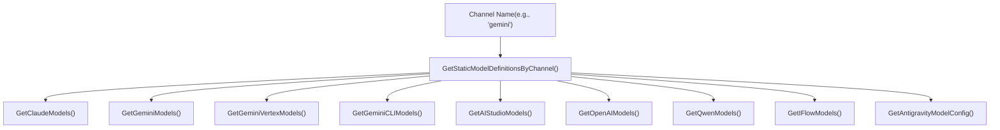
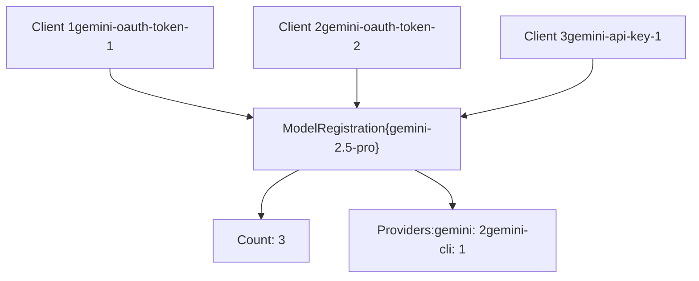
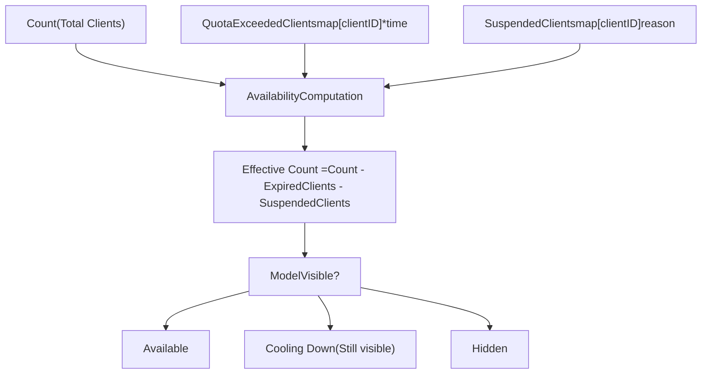
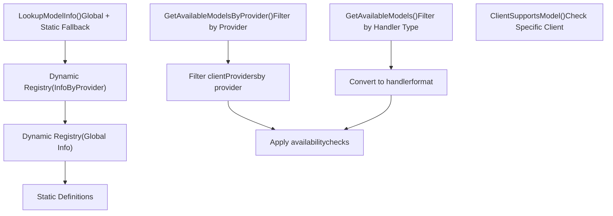

# 模型注册与选择

相关源文件

-   [internal/api/handlers/management/model\_definitions.go](https://github.com/router-for-me/CLIProxyAPI/blob/c66cb0af/internal/api/handlers/management/model_definitions.go)
-   [internal/config/oauth\_model\_alias\_migration.go](https://github.com/router-for-me/CLIProxyAPI/blob/c66cb0af/internal/config/oauth_model_alias_migration.go)
-   [internal/config/oauth\_model\_alias\_migration\_test.go](https://github.com/router-for-me/CLIProxyAPI/blob/c66cb0af/internal/config/oauth_model_alias_migration_test.go)
-   [internal/config/oauth\_model\_alias\_test.go](https://github.com/router-for-me/CLIProxyAPI/blob/c66cb0af/internal/config/oauth_model_alias_test.go)
-   [internal/registry/model\_definitions.go](https://github.com/router-for-me/CLIProxyAPI/blob/c66cb0af/internal/registry/model_definitions.go)
-   [internal/registry/model\_definitions\_static\_data.go](https://github.com/router-for-me/CLIProxyAPI/blob/c66cb0af/internal/registry/model_definitions_static_data.go)
-   [internal/registry/model\_registry.go](https://github.com/router-for-me/CLIProxyAPI/blob/c66cb0af/internal/registry/model_registry.go)
-   [internal/registry/model_registry_hook_test.go](https://github.com/router-for-me/CLIProxyAPI/blob/c66cb0af/internal/registry/model_registry_hook_test.go)
-   [internal/thinking/provider/iflow/apply.go](https://github.com/router-for-me/CLIProxyAPI/blob/c66cb0af/internal/thinking/provider/iflow/apply.go)
-   [internal/util/claude\_model.go](https://github.com/router-for-me/CLIProxyAPI/blob/c66cb0af/internal/util/claude_model.go)
-   [internal/util/claude\_model\_test.go](https://github.com/router-for-me/CLIProxyAPI/blob/c66cb0af/internal/util/claude_model_test.go)
-   [internal/watcher/diff/oauth\_model\_alias.go](https://github.com/router-for-me/CLIProxyAPI/blob/c66cb0af/internal/watcher/diff/oauth_model_alias.go)
-   [sdk/cliproxy/model\_registry.go](https://github.com/router-for-me/CLIProxyAPI/blob/c66cb0af/sdk/cliproxy/model_registry.go)

## 用途与范围

本文档解释了模型注册表（Model Registry）系统，该系统提供了跨所有供应商集成的可用 AI 模型的集中管理。该注册表实现了一个动态可用性跟踪系统，具有引用计数、配额管理和挂起机制，以确保向客户端准确展示模型的可见性。

有关配置模型别名和映射的信息，请参阅[模型映射与排除](/router-for-me/CLIProxyAPI/8.2-model-mapping-and-exclusion)。有关为注册表提供数据的身份验证凭证管理的详情，请参阅[身份验证与凭证管理](/router-for-me/CLIProxyAPI/3.3-authentication-and-credential-management)。

---

## 概览

模型注册表在 [\`internal/registry/model\_registry.go\`](https://github.com/router-for-me/CLIProxyAPI/blob/c66cb0af/`internal/registry/model_registry.go`)() 中实现，是模型可用性的核心真理源。它将静态模型定义与动态运行时注册相结合，跟踪哪些模型可以通过哪些供应商和凭证进行访问。

### 关键职责

| 职责 | 描述 |
| --- | --- |
| **静态定义** | 为已知的供应商模型维护硬编码的模型元数据 |
| **动态注册** | 跟踪由活动身份验证客户端注册的模型 |
| **可用性跟踪** | 对每个模型的客户端进行引用计数，考虑配额/挂起情况 |
| **供应商分组** | 将模型与供应商标识符关联以便路由 |
| **变更通知** | 当模型可用性发生变化时触发钩子 (hooks) |

### 核心数据结构

**ModelInfo** [\`internal/registry/model\_registry.go18-59](https://github.com/router-for-me/CLIProxyAPI/blob/c66cb0af/`internal/registry/model_registry.go#L18-L59)() 表示模型元数据：

```
type ModelInfo struct {    ID                  string            // 模型标识符    Type                string            // 供应商类型    DisplayName         string            // 易读名称    ContextLength       int               // 上下文窗口大小    MaxCompletionTokens int               // 最大输出令牌数    Thinking            *ThinkingSupport  // 推理预算能力    UserDefined         bool              // 配置定义的模型标志    // ... 其他字段}
```
**ModelRegistration** [\`internal/registry/model\_registry.go77-93](https://github.com/router-for-me/CLIProxyAPI/blob/c66cb0af/`internal/registry/model_registry.go#L77-L93)() 跟踪可用性：

```
type ModelRegistration struct {    Info                 *ModelInfo              // 基础模型元数据    InfoByProvider       map[string]*ModelInfo   // 供应商特定元数据    Count                int                     // 活动客户端计数    Providers            map[string]int          // 每个供应商的客户端数    QuotaExceededClients map[string]*time.Time   // 配额超限跟踪    SuspendedClients     map[string]string       // 挂起的客户端    LastUpdated          time.Time               // 上次修改时间}
```
**来源：** [\`internal/registry/model\_registry.go1-135](https://github.com/router-for-me/CLIProxyAPI/blob/c66cb0af/`internal/registry/model_registry.go#L1-L135)()

---

## 静态模型定义

静态模型定义为来自各个供应商的已知 AI 模型提供硬编码的元数据。这些定义在 [\`internal/registry/model\_definitions\_static\_data.go\`](https://github.com/router-for-me/CLIProxyAPI/blob/c66cb0af/`internal/registry/model_definitions_static_data.go`)() 中维护。

### 供应商模型目录

每个供应商都有一个专用的函数来返回其模型目录：

| 函数 | 供应商 | 文件位置 |
| --- | --- | --- |
| `GetClaudeModels()` | Anthropic Claude | [\`model\_definitions\_static\_data.go6-111](https://github.com/router-for-me/CLIProxyAPI/blob/c66cb0af/`model_definitions_static_data.go#L6-L111)() |
| `GetGeminiModels()` | Google Gemini (AI Studio) | [\`model\_definitions\_static\_data.go113-207](https://github.com/router-for-me/CLIProxyAPI/blob/c66cb0af/`model_definitions_static_data.go#L113-L207)() |
| `GetGeminiVertexModels()` | Google Vertex AI | [\`model\_definitions\_static\_data.go209-363](https://github.com/router-for-me/CLIProxyAPI/blob/c66cb0af/`model_definitions_static_data.go#L209-L363)() |
| `GetGeminiCLIModels()` | Gemini CLI | [\`model\_definitions\_static\_data.go365-444](https://github.com/router-for-me/CLIProxyAPI/blob/c66cb0af/`model_definitions_static_data.go#L365-L444)() |
| `GetAIStudioModels()` | AI Studio WebSocket | [\`model\_definitions\_static\_data.go446-600](https://github.com/router-for-me/CLIProxyAPI/blob/c66cb0af/`model_definitions_static_data.go#L446-L600)() |
| `GetOpenAIModels()` | OpenAI Codex | [\`model\_definitions\_static\_data.go602-760](https://github.com/router-for-me/CLIProxyAPI/blob/c66cb0af/`model_definitions_static_data.go#L602-L760)() |
| `GetQwenModels()` | Qwen | [\`model\_definitions\_static\_data.go762-805](https://github.com/router-for-me/CLIProxyAPI/blob/c66cb0af/`model_definitions_static_data.go#L762-L805)() |
| `GetIFlowModels()` | iFlow | [\`model\_definitions\_static\_data.go807-850](https://github.com/router-for-me/CLIProxyAPI/blob/c66cb0af/`model_definitions_static_data.go#L807-L850)() |

### 基于通道的查询

`GetStaticModelDefinitionsByChannel()` [\`internal/registry/model\_definitions.go23-68](https://github.com/router-for-me/CLIProxyAPI/blob/c66cb0af/`internal/registry/model_definitions.go#L23-L68)() 提供基于通道的静态模型查询：


### 思考支持配置

静态定义包含推理能力的 `ThinkingSupport` [\`internal/registry/model\_registry.go61-75](https://github.com/router-for-me/CLIProxyAPI/blob/c66cb0af/`internal/registry/model_registry.go#L61-L75)() 元数据：

```
type ThinkingSupport struct {    Min            int      // 最小思考预算 (tokens)    Max            int      // 最大思考预算 (tokens)    ZeroAllowed    bool     // 是否允许 0 禁用思考    DynamicAllowed bool     // 是否允许 -1 启用动态预算    Levels         []string // 离散的尝试级别}
```
来自 Claude 定义的示例 [\`model\_definitions\_static\_data.go18](https://github.com/router-for-me/CLIProxyAPI/blob/c66cb0af/`model_definitions_static_data.go#L18-L18)():

```
Thinking: &ThinkingSupport{    Min: 1024, Max: 128000,     ZeroAllowed: true, DynamicAllowed: false}
```
**来源：** [\`internal/registry/model\_definitions.go\`](https://github.com/router-for-me/CLIProxyAPI/blob/c66cb0af/`internal/registry/model_definitions.go`)(), [\`internal/registry/model\_definitions\_static\_data.go\`](https://github.com/router-for-me/CLIProxyAPI/blob/c66cb0af/`internal/registry/model_definitions_static_data.go`)()

---

## 动态模型注册

当身份验证客户端注册和取消注册时，注册表会动态跟踪模型。每个客户端可以提供多个模型，注册表通过引用计数来确定模型的可用性。

### 注册流程

> **[Mermaid sequence]**
> *(图表结构无法解析)*

### RegisterClient 实现

`RegisterClient()` 方法 [\`internal/registry/model\_registry.go202-413](https://github.com/router-for-me/CLIProxyAPI/blob/c66cb0af/`internal/registry/model_registry.go#L202-L413)() 处理初始注册和更新：

**新客户端注册：**

1.  验证模型列表是否包含有效的 `ModelInfo` 条目
2.  通过 `addModelRegistration()` 为每个模型增加 `Count`
3.  更新 `Providers` 映射以跟踪各供应商的计数
4.  在 `clientModelInfos` 中按客户端存储原始的 `ModelInfo`
5.  异步触发 `OnModelsRegistered` 钩子

**现有客户端更新：**

1.  通过比较旧模型与新模型计算新增和移除的模型
2.  处理供应商变更（减少旧供应商计数，增加新供应商计数）
3.  首先应用移除操作以保持准确计数
4.  应用带有更新元数据的新增操作
5.  清除重新注册模型的配额/挂起状态

### 引用计数

模型使用引用计数来跟踪可用性：


当 `Count` 达到零时，该模型将从注册表中移除。

**来源：** [\`internal/registry/model\_registry.go202-489](https://github.com/router-for-me/CLIProxyAPI/blob/c66cb0af/`internal/registry/model_registry.go#L202-L489)()

---

## 可用性跟踪

注册表跟踪多个可用性状态，而不仅仅是简单的引用计数，以准确反映哪些模型可以处理请求。

### 可用性状态


### 配额超限跟踪

当客户端用尽其配额时，注册表通过 `SetModelQuotaExceeded()` [\`internal/registry/model\_registry.go590-603](https://github.com/router-for-me/CLIProxyAPI/blob/c66cb0af/`internal/registry/model_registry.go#L590-L603)() 对其进行标记。时间戳存储在 `QuotaExceededClients` 映射中。

**冷却期：** 配额超限的客户端模型在 5 分钟内保持可见 [\`internal/registry/model\_registry.go709](https://github.com/router-for-me/CLIProxyAPI/blob/c66cb0af/`internal/registry/model_registry.go#L709-L709)()，以避免可见性的频繁变化：

```
quotaExpiredDuration := 5 * time.Minutefor _, quotaTime := range registration.QuotaExceededClients {    if quotaTime != nil && now.Sub(*quotaTime) < quotaExpiredDuration {        expiredClients++    }}
```
### 挂起机制

客户端可以通过 `SuspendClientModel()` [\`internal/registry/model\_registry.go624-648](https://github.com/router-for-me/CLIProxyAPI/blob/c66cb0af/`internal/registry/model_registry.go#L624-L648)() 临时挂起，并带有可选的原因字符串：

| 原因 | 效果 |
| --- | --- |
| `"quota"` | 被视为冷却挂起，如果其他客户端处于冷却中，模型仍然可见 |
| 其他原因 | 模型立即变得不可用 |

**恢复：** `ResumeClientModel()` [\`internal/registry/model\_registry.go654-671](https://github.com/router-for-me/CLIProxyAPI/blob/c66cb0af/`internal/registry/model_registry.go#L654-L671)() 清除挂起状态。

### GetAvailableModels 逻辑

`GetAvailableModels()` [\`internal/registry/model\_registry.go704-751](https://github.com/router-for-me/CLIProxyAPI/blob/c66cb0af/`internal/registry/model_registry.go#L704-L751)() 计算可见性：

```
availableClients := registration.CountexpiredClients := 0  // 配额超限，在 5 分钟窗口内cooldownSuspended := 0  // 因 reason="quota" 被挂起otherSuspended := 0  // 因其他原因被挂起 effectiveClients := availableClients - expiredClients - otherSuspended // 包含条件：// 1. effectiveClients > 0，或者// 2. 所有客户端要么已过期，要么处于配额冷却中（没有“其他”挂起）if effectiveClients > 0 ||    (availableClients > 0 && (expiredClients > 0 || cooldownSuspended > 0) && otherSuspended == 0) {    models = append(models, model)}
```
**来源：** [\`internal/registry/model\_registry.go590-751](https://github.com/router-for-me/CLIProxyAPI/blob/c66cb0af/`internal/registry/model_registry.go#L590-L751)()

---

## 模型查找与选择

注册表提供了多种针对不同用例优化的查找方法。

### 查找方法


### LookupModelInfo

`LookupModelInfo()` [\`internal/registry/model\_registry.go138-153](https://github.com/router-for-me/CLIProxyAPI/blob/c66cb0af/`internal/registry/model_registry.go#L138-L153)() 执行分层查找：

1.  通过 `GetModelInfo(modelID, provider)` 检查动态注册表中的供应商特定信息
2.  如果未找到，则检查动态注册表中的全局信息
3.  回退到 `LookupStaticModelInfo()` [\`internal/registry/model\_definitions.go70-105](https://github.com/router-for-me/CLIProxyAPI/blob/c66cb0af/`internal/registry/model_definitions.go#L70-L105)()

**供应商特定信息：** `InfoByProvider` 映射 [\`internal/registry/model\_registry.go82](https://github.com/router-for-me/CLIProxyAPI/blob/c66cb0af/`internal/registry/model_registry.go#L82-L82)() 允许每个供应商拥有不同的元数据。例如，当通过不同供应商访问时，模型可能具有不同的令牌限制。

### GetAvailableModelsByProvider

`GetAvailableModelsByProvider()` [\`internal/registry/model\_registry.go759-876](https://github.com/router-for-me/CLIProxyAPI/blob/c66cb0af/`internal/registry/model_registry.go#L759-L876)() 返回特定供应商的模型：

1.  遍历 `clientProviders` 映射以找到匹配的供应商
2.  通过 `clientModels` 映射从匹配的客户端收集模型
3.  应用每个供应商的配额/挂起过滤
4.  如果可用，从 `clientModelInfos` 返回供应商特定的 `ModelInfo`

**用例：** AMP 模块使用此方法来列出通过特定供应商路由 [\`/api/provider/](https://github.com/router-for-me/CLIProxyAPI/blob/c66cb0af/`/api/provider/#LNaN-LNaN) 可用的模型。请参阅 [Amp CLI 集成](/router-for-me/CLIProxyAPI/4.5-amp-cli-integration)。

### GetModelProviders

`GetModelProviders()` [\`internal/registry/model\_registry.go912-971](https://github.com/router-for-me/CLIProxyAPI/blob/c66cb0af/`internal/registry/model_registry.go#L912-L971)() 返回哪些供应商提供了给定的模型，按可用数量降序排列。

**来源：** [\`internal/registry/model\_registry.go138-971](https://github.com/router-for-me/CLIProxyAPI/blob/c66cb0af/`internal/registry/model_registry.go#L138-L971)(), [\`internal/registry/model\_definitions.go70-105](https://github.com/router-for-me/CLIProxyAPI/blob/c66cb0af/`internal/registry/model_definitions.go#L70-L105)()

---

## 注册表钩子 (Hooks)

注册表通过 `ModelRegistryHook` 接口 [\`internal/registry/model\_registry.go95-100](https://github.com/router-for-me/CLIProxyAPI/blob/c66cb0af/`internal/registry/model_registry.go#L95-L100)() 支持外部观察者。

### 钩子接口

```
type ModelRegistryHook interface {    OnModelsRegistered(ctx context.Context, provider, clientID string, models []*ModelInfo)    OnModelsUnregistered(ctx context.Context, provider, clientID string)}
```
### 钩子执行语义

> **[Mermaid sequence]**
> *(图表结构无法解析)*

**关键属性：**

| 属性 | 行为 |
| --- | --- |
| **执行方式** | 异步、非阻塞 [\`internal/registry/model\_registry.go173-182](https://github.com/router-for-me/CLIProxyAPI/blob/c66cb0af/`internal/registry/model_registry.go#L173-L182)() |
| **超时时间** | 每次钩子调用 5 秒 [\`internal/registry/model\_registry.go165](https://github.com/router-for-me/CLIProxyAPI/blob/c66cb0af/`internal/registry/model_registry.go#L165-L165)() |
| **Panic 安全性** | 被捕获并记录，不影响注册表 [\`internal/registry/model\_registry.go175-177](https://github.com/router-for-me/CLIProxyAPI/blob/c66cb0af/`internal/registry/model_registry.go#L175-L177)() |
| **模型列表** | 通过 `cloneModelInfosUnique()` 创建唯一副本 [\`internal/registry/model\_registry.go172](https://github.com/router-for-me/CLIProxyAPI/blob/c66cb0af/`internal/registry/model_registry.go#L172-L172)() |

### 设置钩子

```
hook := &MyHook{}registry.GetGlobalRegistry().SetHook(hook) // 或者通过 SDK：cliproxy.SetGlobalModelRegistryHook(hook)
```
**用例：** 外部系统可以观察模型可用性的变化以便进行同步或通知。

**来源：** [\`internal/registry/model\_registry.go95-200](https://github.com/router-for-me/CLIProxyAPI/blob/c66cb0af/`internal/registry/model_registry.go#L95-L200)(), [\`internal/registry/model\_registry\_hook\_test.go\`](https://github.com/router-for-me/CLIProxyAPI/blob/c66cb0af/`internal/registry/model_registry_hook_test.go`)(), [\`sdk/cliproxy/model\_registry.go\`](https://github.com/router-for-me/CLIProxyAPI/blob/c66cb0af/`sdk/cliproxy/model_registry.go`)()

---

## 与配置集成

### 用户定义模型

模型可以通过供应商特定的 `models[]` 数组在配置文件中定义。这些模型具有特殊处理：

```
type ModelInfo struct {    // ...    UserDefined bool `json:"-"`  // 为配置定义的模型设置}
```
**用户定义标志：** [\`internal/registry/model\_registry.go58](https://github.com/router-for-me/CLIProxyAPI/blob/c66cb0af/`internal/registry/model_registry.go#L58-L58)() 指示该模型是通过配置而非静态定义来定义的。对于用户定义的模型，思考配置直接透传而不进行验证 [\`internal/thinking/provider/iflow/apply.go58-60](https://github.com/router-for-me/CLIProxyAPI/blob/c66cb0af/`internal/thinking/provider/iflow/apply.go#L58-L60)().

### OAuth 模型别名迁移

注册表支持通过 `MigrateOAuthModelAlias()` [\`internal/config/oauth\_model\_alias\_migration.go38-86](https://github.com/router-for-me/CLIProxyAPI/blob/c66cb0af/`internal/config/oauth_model_alias_migration.go#L38-L86)() 将旧的 `oauth-model-mappings` 迁移到 `oauth-model-alias` 配置。

**Antigravity 模型转换：** [\`internal/config/oauth\_model\_alias\_migration.go12-21](https://github.com/router-for-me/CLIProxyAPI/blob/c66cb0af/`internal/config/oauth_model_alias_migration.go#L12-L21)() 为内置的别名定义了转换：

```
antigravityModelConversionTable = map[string]string{    "gemini-2.5-computer-use-preview-10-2025": "rev19-uic3-1p",    "gemini-3-pro-preview": "gemini-3-pro-high",    // ...}
```
有关模型别名和映射的详情，请参阅 [模型映射与排除](/router-for-me/CLIProxyAPI/8.2-model-mapping-and-exclusion)。

**来源：** [\`internal/config/oauth\_model\_alias\_migration.go\`](https://github.com/router-for-me/CLIProxyAPI/blob/c66cb0af/`internal/config/oauth_model_alias_migration.go`)(), [\`internal/config/oauth\_model\_alias\_test.go\`](https://github.com/router-for-me/CLIProxyAPI/blob/c66cb0af/`internal/config/oauth_model_alias_test.go`)()

---

## SDK 访问

注册表通过 SDK 暴露在 [\`sdk/cliproxy/model\_registry.go\`](https://github.com/router-for-me/CLIProxyAPI/blob/c66cb0af/`sdk/cliproxy/model_registry.go`)() 中：

```
// 获取全局注册表registry := cliproxy.GlobalModelRegistry() // 注册模型registry.RegisterClient("my-client", "openai", models) // 设置钩子cliproxy.SetGlobalModelRegistryHook(myHook) // 查询可用性available := registry.GetAvailableModels("openai")
```
SDK 为外部应用程序集成模型注册表系统提供了简洁的接口。

**来源：** [\`sdk/cliproxy/model\_registry.go\`](https://github.com/router-for-me/CLIProxyAPI/blob/c66cb0af/`sdk/cliproxy/model_registry.go`)()

---

## 管理 API

注册表通过 [\`internal/api/handlers/management/model\_definitions.go\`](https://github.com/router-for-me/CLIProxyAPI/blob/c66cb0af/`internal/api/handlers/management/model_definitions.go`)() 中的管理 API 暴露静态模型定义：

**端点：** `GET /v0/management/models/static/:channel` 或 `GET /v0/management/models/static?channel=...`

**响应：**

```
{  "channel": "gemini",  "models": [    {      "id": "gemini-2.5-pro",      "display_name": "Gemini 2.5 Pro",      "thinking": {        "min": 128,        "max": 32768,        "dynamic_allowed": true      }    }  ]}
```
该端点允许外部工具查询静态模型能力，而无需活动凭证。

**来源：** [\`internal/api/handlers/management/model\_definitions.go\`](https://github.com/router-for-me/CLIProxyAPI/blob/c66cb0af/`internal/api/handlers/management/model_definitions.go`)()
