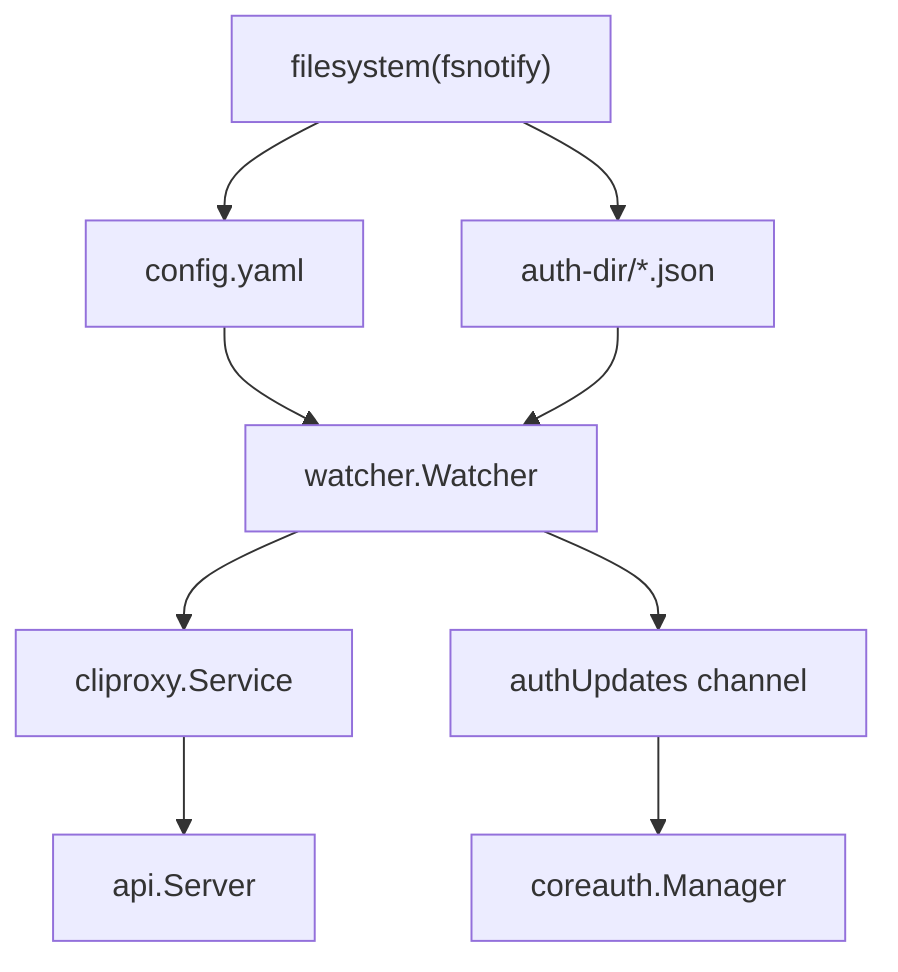
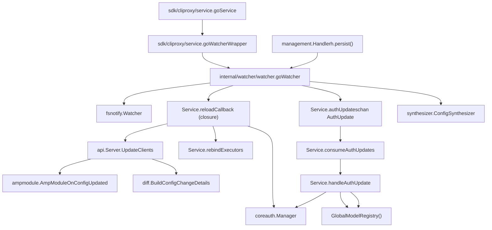

# 热重载与配置更新

相关源文件

-   [config.example.yaml](https://github.com/router-for-me/CLIProxyAPI/blob/c66cb0af/config.example.yaml)
-   [internal/api/handlers/management/config\_basic.go](https://github.com/router-for-me/CLIProxyAPI/blob/c66cb0af/internal/api/handlers/management/config_basic.go)
-   [internal/api/handlers/management/config\_lists.go](https://github.com/router-for-me/CLIProxyAPI/blob/c66cb0af/internal/api/handlers/management/config_lists.go)
-   [internal/api/handlers/management/model\_definitions.go](https://github.com/router-for-me/CLIProxyAPI/blob/c66cb0af/internal/api/handlers/management/model_definitions.go)
-   [internal/api/server.go](https://github.com/router-for-me/CLIProxyAPI/blob/c66cb0af/internal/api/server.go)
-   [internal/config/config.go](https://github.com/router-for-me/CLIProxyAPI/blob/c66cb0af/internal/config/config.go)
-   [internal/config/oauth\_model\_alias\_migration.go](https://github.com/router-for-me/CLIProxyAPI/blob/c66cb0af/internal/config/oauth_model_alias_migration.go)
-   [internal/config/oauth\_model\_alias\_migration\_test.go](https://github.com/router-for-me/CLIProxyAPI/blob/c66cb0af/internal/config/oauth_model_alias_migration_test.go)
-   [internal/config/oauth\_model\_alias\_test.go](https://github.com/router-for-me/CLIProxyAPI/blob/c66cb0af/internal/config/oauth_model_alias_test.go)
-   [internal/config/vertex\_compat.go](https://github.com/router-for-me/CLIProxyAPI/blob/c66cb0af/internal/config/vertex_compat.go)
-   [internal/registry/model\_definitions\_static\_data.go](https://github.com/router-for-me/CLIProxyAPI/blob/c66cb0af/internal/registry/model_definitions_static_data.go)
-   [internal/thinking/provider/iflow/apply.go](https://github.com/router-for-me/CLIProxyAPI/blob/c66cb0af/internal/thinking/provider/iflow/apply.go)
-   [internal/util/claude\_model.go](https://github.com/router-for-me/CLIProxyAPI/blob/c66cb0af/internal/util/claude_model.go)
-   [internal/util/claude\_model\_test.go](https://github.com/router-for-me/CLIProxyAPI/blob/c66cb0af/internal/util/claude_model_test.go)
-   [internal/watcher/diff/config\_diff.go](https://github.com/router-for-me/CLIProxyAPI/blob/c66cb0af/internal/watcher/diff/config_diff.go)
-   [internal/watcher/diff/config\_diff\_test.go](https://github.com/router-for-me/CLIProxyAPI/blob/c66cb0af/internal/watcher/diff/config_diff_test.go)
-   [internal/watcher/diff/model\_hash.go](https://github.com/router-for-me/CLIProxyAPI/blob/c66cb0af/internal/watcher/diff/model_hash.go)
-   [internal/watcher/diff/model\_hash\_test.go](https://github.com/router-for-me/CLIProxyAPI/blob/c66cb0af/internal/watcher/diff/model_hash_test.go)
-   [internal/watcher/diff/models\_summary.go](https://github.com/router-for-me/CLIProxyAPI/blob/c66cb0af/internal/watcher/diff/models_summary.go)
-   [internal/watcher/diff/oauth\_excluded.go](https://github.com/router-for-me/CLIProxyAPI/blob/c66cb0af/internal/watcher/diff/oauth_excluded.go)
-   [internal/watcher/diff/oauth\_excluded\_test.go](https://github.com/router-for-me/CLIProxyAPI/blob/c66cb0af/internal/watcher/diff/oauth_excluded_test.go)
-   [internal/watcher/diff/oauth\_model\_alias.go](https://github.com/router-for-me/CLIProxyAPI/blob/c66cb0af/internal/watcher/diff/oauth_model_alias.go)
-   [internal/watcher/diff/openai\_compat.go](https://github.com/router-for-me/CLIProxyAPI/blob/c66cb0af/internal/watcher/diff/openai_compat.go)
-   [internal/watcher/diff/openai\_compat\_test.go](https://github.com/router-for-me/CLIProxyAPI/blob/c66cb0af/internal/watcher/diff/openai_compat_test.go)
-   [internal/watcher/synthesizer/config.go](https://github.com/router-for-me/CLIProxyAPI/blob/c66cb0af/internal/watcher/synthesizer/config.go)
-   [internal/watcher/watcher.go](https://github.com/router-for-me/CLIProxyAPI/blob/c66cb0af/internal/watcher/watcher.go)
-   [internal/watcher/watcher\_test.go](https://github.com/router-for-me/CLIProxyAPI/blob/c66cb0af/internal/watcher/watcher_test.go)
-   [sdk/cliproxy/service.go](https://github.com/router-for-me/CLIProxyAPI/blob/c66cb0af/sdk/cliproxy/service.go)
-   [test/amp\_management\_test.go](https://github.com/router-for-me/CLIProxyAPI/blob/c66cb0af/test/amp_management_test.go)

本页面解释了 CLIProxyAPI 如何检测 `config.yaml` 和身份验证凭证文件的更改，如何将这些更改传播到运行中的服务器，以及如何在无需重启的情况下更新实时状态。

有关身份验证凭证生命周期和令牌存储的信息，请参阅 [3.3](/router-for-me/CLIProxyAPI/3.3-authentication-and-credential-management)。有关写入配置更改的管理 API 端点，请参阅 [4.4](/router-for-me/CLIProxyAPI/4.4-management-api)。有关初始化观察器的服务启动顺序，请参阅 [3.1](/router-for-me/CLIProxyAPI/3.1-service-lifecycle-and-initialization)。

---

## 概览

CLIProxyAPI 使用两条互补的热重载路径：

1.  **配置文件观察 (Config file watch)**：`watcher.Watcher` 使用 `fsnotify` 监视 `config.yaml`。在检测到更改时，经过防抖（debounced）处理的重载流程会重新解析文件并调用回调函数，将新配置传播到所有正在运行的组件。
2.  **身份验证目录观察 (Auth directory watch)**：同一个 `watcher.Watcher` 也监视身份验证目录 (`auth-dir`)。新增、修改或删除的身份验证文件会被转换为 `AuthUpdate` 事件，并通过一个缓冲通道进行处理。

这两条路径都不需要重启服务器。HTTP 服务器在整个过程中持续提供服务。

**图表：高层热重载触发器**


来源：[internal/watcher/watcher.go31-55](https://github.com/router-for-me/CLIProxyAPI/blob/c66cb0af/internal/watcher/watcher.go#L31-L55) [sdk/cliproxy/service.go56-92](https://github.com/router-for-me/CLIProxyAPI/blob/c66cb0af/sdk/cliproxy/service.go#L56-L92) [sdk/cliproxy/service.go555-627](https://github.com/router-for-me/CLIProxyAPI/blob/c66cb0af/sdk/cliproxy/service.go#L555-L627)

---

## `watcher.Watcher`

[internal/watcher/watcher.go](https://github.com/router-for-me/CLIProxyAPI/blob/c66cb0af/internal/watcher/watcher.go) 中的 `watcher.Watcher` 是核心文件监控结构体。它由 `cliproxy.Service` 在 `Run` 期间创建。

### 关键字段

| 字段 | 类型 | 用途 |
| --- | --- | --- |
| `configPath` | `string` | `config.yaml` 的绝对路径 |
| `authDir` | `string` | 身份验证目录的绝对路径 |
| `reloadCallback` | `func(*config.Config)` | 在检测到配置更改时调用 |
| `watcher` | `*fsnotify.Watcher` | 底层 OS 级文件观察器 |
| `lastAuthHashes` | `map[string]string` | 已知认证文件的 SHA-256 哈希值 |
| `lastAuthContents` | `map[string]*coreauth.Auth` | 上次扫描解析出的认证条目 |
| `configReloadTimer` | `*time.Timer` | 配置更改的防抖计时器 |
| `lastConfigHash` | `string` | 上次看到的配置字节的哈希值 |
| `authQueue` | `chan<- AuthUpdate` | 身份验证更新通道的写入端 |
| `pendingUpdates` | `map[string]AuthUpdate` | 合并快速发生的身份验证更改 |
| `storePersister` | `storePersister` | 可选：将更改传播到外部存储 |
| `oldConfigYaml` | `[]byte` | 用于变更检测的 YAML 快照 |

来源：[internal/watcher/watcher.go31-55](https://github.com/router-for-me/CLIProxyAPI/blob/c66cb0af/internal/watcher/watcher.go#L31-L55)

### 时间常量

```
replaceCheckDelay        = 50ms   // 在将 Remove 视为真实删除之前等待的时间
configReloadDebounce     = 150ms  // 配置文件写入的防抖窗口
authRemoveDebounceWindow = 1s     // 发出身份验证删除之前的防抖窗口
```
来源：[internal/watcher/watcher.go73-79](https://github.com/router-for-me/CLIProxyAPI/blob/c66cb0af/internal/watcher/watcher.go#L73-L79)

### 公共 API

| 方法 | 用途 |
| --- | --- |
| `NewWatcher(configPath, authDir, reloadCallback)` | 构造观察器；检测支持持久化的令牌存储 |
| `Start(ctx)` | 开始观察文件；启动分发 goroutine |
| `Stop()` | 取消分发 goroutine 并关闭 `fsnotify` 观察器 |
| `SetConfig(cfg)` | 在每次重载后更新内部配置引用 |
| `SetAuthUpdateQueue(queue)` | 设置观察器向其写入 `AuthUpdate` 事件的通道 |
| `DispatchRuntimeAuthUpdate(update)` | 注入合成的认证事件（例如，来自 WebSocket 供应商） |
| `SnapshotCoreAuths()` | 将当前所有认证条目作为 `[]*coreauth.Auth` 返回 |

来源：[internal/watcher/watcher.go82-148](https://github.com/router-for-me/CLIProxyAPI/blob/c66cb0af/internal/watcher/watcher.go#L82-L148)

---

## 配置变更检测与防抖

当 `fsnotify` 为 `config.yaml` 发出 `Write` 或 `Create` 事件时，观察器启动（或重置）一个 150ms 的防抖计时器。在计时器触发后，它会：

1.  读取文件并计算其 SHA-256 哈希值。
2.  将该哈希值与 `lastConfigHash` 进行比较。如果未变，则跳过重载。
3.  调用 `config.LoadConfig(configPath)` 重新解析 `Config`。
4.  如果解析成功，则调用 `reloadCallback(newCfg)`。

哈希比较可以防止由那些分多次小额写入配置文件的工具引起的虚假重载。

**图表：配置重载序列**

> **[Mermaid sequence]**
> *(图表结构无法解析)*

来源：[internal/watcher/watcher.go73-79](https://github.com/router-for-me/CLIProxyAPI/blob/c66cb0af/internal/watcher/watcher.go#L73-L79)

---

## 身份验证目录观察

观察器跟踪身份验证目录中的每个 JSON 文件。对于每个 `Write`、`Create` 或 `Remove` 事件，它会：

1.  对文件内容进行哈希处理，并与 `lastAuthHashes` 进行比较。
2.  将文件解析为 `*coreauth.Auth` 结构体。
3.  如果解析出的内容与 `lastAuthContents` 不同，则发出 `AuthUpdate`。

### `AuthUpdate`

```
type AuthUpdate struct {    Action AuthUpdateAction   // "add" | "modify" | "delete"    ID     string    Auth   *coreauth.Auth}
```
Remove 事件会在 `lastRemoveTimes` 中保留最多 `authRemoveDebounceWindow`（1 秒），然后才作为删除事件发出。这处理了原子文件替换的情况，即工具通过先移除旧文件再写入新文件的方式来操作。

来源：[internal/watcher/watcher.go57-71](https://github.com/router-for-me/CLIProxyAPI/blob/c66cb0af/internal/watcher/watcher.go#L57-L71) [internal/watcher/watcher.go73-79](https://github.com/router-for-me/CLIProxyAPI/blob/c66cb0af/internal/watcher/watcher.go#L73-L79)

### 身份验证更新分发

观察器通过 `dispatchMu`/`dispatchCond` 序列化所有待处理的 `AuthUpdate` 事件，并将其写入 `authQueue` 通道。在读取端，`cliproxy.Service.consumeAuthUpdates` 排空通道并调用 `handleAuthUpdate`。

**图表：身份验证更新流程**

> **[Mermaid sequence]**
> *(图表结构无法解析)*

来源：[sdk/cliproxy/service.go114-202](https://github.com/router-for-me/CLIProxyAPI/blob/c66cb0af/sdk/cliproxy/service.go#L114-L202) [sdk/cliproxy/service.go275-332](https://github.com/router-for-me/CLIProxyAPI/blob/c66cb0af/sdk/cliproxy/service.go#L275-L332)

---

## `cliproxy.Service` 中的 `reloadCallback`

`cliproxy.Service.Run` 在 [sdk/cliproxy/service.go556-608](https://github.com/router-for-me/CLIProxyAPI/blob/c66cb0af/sdk/cliproxy/service.go#L556-L608) 处设置了重载回调闭包。该回调在每次配置重载时触发，并按顺序执行以下步骤：

| 步骤 | 代码结构 | 作用 |
| --- | --- | --- |
| 1 | `s.coreManager.SetSelector` | 如果 `routing.strategy` 已更改，则更改凭证选择策略 |
| 2 | `s.applyRetryConfig(newCfg)` | 将新的 `RequestRetry` 和 `MaxRetryInterval` 推送到 `coreauth.Manager` |
| 3 | `s.applyPprofConfig(newCfg)` | 如果 `pprof.enable` 已更改，则启动或停止 pprof 服务器 |
| 4 | `s.server.UpdateClients(newCfg)` | 将完整的配置差异应用到 HTTP 服务器（见下文） |
| 5 | `s.cfg = newCfg` | 替换服务的实时配置引用 |
| 6 | `s.coreManager.SetConfig(newCfg)` | 向核心认证管理器提供新配置 |
| 7 | `s.coreManager.SetOAuthModelAlias(newCfg.OAuthModelAlias)` | 更新模型别名表 |
| 8 | `s.rebindExecutors()` | 重新创建供应商执行器，以便它们从新配置中读取数据 |

来源：[sdk/cliproxy/service.go556-608](https://github.com/router-for-me/CLIProxyAPI/blob/c66cb0af/sdk/cliproxy/service.go#L556-L608)

---

## `Server.UpdateClients`

[internal/api/server.go879-1016](https://github.com/router-for-me/CLIProxyAPI/blob/c66cb0af/internal/api/server.go#L879-L1016) 中的 `api.Server.UpdateClients` 是将新 `*config.Config` 应用到运行中的 HTTP 服务器的核心函数。它使用 YAML 序列化的快照 (`oldConfigYaml`) 构建准确的变更前图像，以便进行字段级比较，因为管理 API 处理器可能会在写入磁盘之前修改内存中的 `h.cfg`。

**图表：`Server.UpdateClients` — 更新的组件**

```mermaid
flowchart TD
    UC["Server.UpdateClients(cfg)"]
    YS["Reconstruct oldCfgfrom oldConfigYaml(yaml.Unmarshal)"]
    RL["RequestLog changed?loggerToggle(bool)"]
    LO["LoggingToFile or LogsMaxTotalSizeMB changed?logging.ConfigureLogOutput"]
    US["UsageStatisticsEnabled changed?usage.SetStatisticsEnabled"]
    EL["ErrorLogsMaxFiles changed?requestLogger.SetErrorLogsMaxFiles"]
    DC["DisableCooling changed?auth.SetQuotaCooldownDisabled"]
    RC["RequestRetry/MaxRetryInterval changed?authManager.SetRetryConfig"]
    DBG["Debug changed?util.SetLogLevel"]
    MR["SecretKey added/removed?registerManagementRoutes or disable"]
    AC["applyAccessConfig(oldCfg, cfg)"]
    WA["WebsocketAuth changed?wsAuthEnabled.Store + wsAuthChanged callback"]
    MS["managementasset.SetCurrentConfig"]
    HC["handlers.UpdateClients(&cfg.SDKConfig)"]
    MH["mgmt.SetConfig + SetAuthManager"]
    AMP["AmpCode changed?ampModule.OnConfigUpdated"]
    TS["tokenStore.SetBaseDir(cfg.AuthDir)"]
    SNAP["Save new oldConfigYaml snapshot(yaml.Marshal)"]

    UC --> YS
    YS --> RL
    YS --> LO
    YS --> US
    YS --> EL
    YS --> DC
    YS --> RC
    YS --> DBG
    YS --> MR
    YS --> AC
    YS --> WA
    YS --> MS
    YS --> HC
    YS --> MH
    YS --> AMP
    YS --> TS
    YS --> SNAP
```


来源：[internal/api/server.go879-1016](https://github.com/router-for-me/CLIProxyAPI/blob/c66cb0af/internal/api/server.go#L879-L1016)

### 用于变更检测的 YAML 快照

`Server` 持有 `oldConfigYaml []byte` — 一份在之前的 `UpdateClients` 调用之后存在的配置的 YAML 编码副本。每次调用开始时，都会将此快照反序列化为一个全新的 `oldCfg` 结构体，用于字段级差分。在应用所有更改后，将保存新的快照。

这种设计避免了当管理 API 处理器在文件观察器触发之前原地修改配置结构体时出现的过时比较。

来源：[internal/api/server.go137-139](https://github.com/router-for-me/CLIProxyAPI/blob/c66cb0af/internal/api/server.go#L137-L139) [internal/api/server.go882-884](https://github.com/router-for-me/CLIProxyAPI/blob/c66cb0af/internal/api/server.go#L882-L884) [internal/api/server.go968](https://github.com/router-for-me/CLIProxyAPI/blob/c66cb0af/internal/api/server.go#L968-L968)

---

## 配置差异 (Config Diff) 实用程序

`internal/watcher/diff` 包提供了计算经过脱敏的人类可读变更摘要的实用程序。主要入口点是 `BuildConfigChangeDetails`：

```
// internal/watcher/diff/config_diff.gofunc BuildConfigChangeDetails(oldCfg, newCfg *config.Config) []string
```
它比较：

-   标量字段（`port`、`debug`、`proxy-url`、`routing.strategy` 等）
-   API 密钥计数（脱敏处理 — 密钥材料绝不会被记录）
-   每个供应商的密钥配置（base-url、prefix、模型列表、排除的模型）
-   每个供应商的 `oauth-excluded-models`
-   每个通道的 `oauth-model-alias`
-   `ampcode` 字段（上游 URL、模型映射、标志）
-   `remote-management` 字段（密钥是否存在，而非其值）

该包中的其他辅助工具：

| 函数 | 文件 | 用途 |
| --- | --- | --- |
| `SummarizeExcludedModels` | `oauth_excluded.go` | 为 `excluded-models` 列表生成哈希和计数 |
| `DiffOAuthExcludedModelChanges` | `oauth_excluded.go` | 每个供应商的排除项差异 |
| `SummarizeAmpModelMappings` | `oauth_excluded.go` | 为 Amp 模型映射生成哈希以进行变更检测 |
| `ComputeOpenAICompatModelsHash` | `model_hash.go` | 为 OpenAI 兼容模型列表生成稳定哈希 |
| `DiffOpenAICompatibility` | `openai_compat.go` | 每个供应商的 OpenAI 兼容配置差异 |
| `SummarizeGeminiModels` / `SummarizeClaudeModels` | `models_summary.go` | 为模型别名列表生成哈希 |

来源：[internal/watcher/diff/config\_diff.go1-50](https://github.com/router-for-me/CLIProxyAPI/blob/c66cb0af/internal/watcher/diff/config_diff.go#L1-L50) [internal/watcher/diff/oauth\_excluded.go](https://github.com/router-for-me/CLIProxyAPI/blob/c66cb0af/internal/watcher/diff/oauth_excluded.go) [internal/watcher/diff/model\_hash.go](https://github.com/router-for-me/CLIProxyAPI/blob/c66cb0af/internal/watcher/diff/model_hash.go) [internal/watcher/diff/openai\_compat.go](https://github.com/router-for-me/CLIProxyAPI/blob/c66cb0af/internal/watcher/diff/openai_compat.go)

---

## 管理 API 作为配置更新的触发器

管理 API 处理器（位于 `internal/api/handlers/management/`）提供了另一条导致相同热重载流程的路径：

1.  PUT/PATCH 请求到达管理端点（例如 `PUT /v0/management/proxy-url`）。
2.  处理器在内存中修改 `h.cfg`。
3.  处理器调用 `h.persist(c)`，该函数将 `h.cfg` 序列化并写入 `configFilePath`。
4.  文件观察器检测到写入并触发防抖重载。
5.  `config.LoadConfig` 重新解析文件。
6.  `reloadCallback` 将更改传播到所有组件。

`PutConfigYAML` 处理器 (`PUT /v0/management/config.yaml`) 执行完整配置替换：

-   根据 `config.LoadConfigOptional` 验证传入的 YAML。
-   通过 `WriteConfig` 原子地写入文件。
-   立即更新 `h.cfg` 以供管理处理器后续请求使用。
-   文件观察器随后驱动整个系统的更新。

来源：[internal/api/handlers/management/config\_basic.go111-163](https://github.com/router-for-me/CLIProxyAPI/blob/c66cb0af/internal/api/handlers/management/config_basic.go#L111-L163) [internal/api/server.go879-1016](https://github.com/router-for-me/CLIProxyAPI/blob/c66cb0af/internal/api/server.go#L879-L1016)

---

## `DispatchRuntimeAuthUpdate`

对于非源自文件系统的身份验证更改（例如 WebSocket 供应商连接/断开），`watcher.Watcher.DispatchRuntimeAuthUpdate` 提供了一种将合成的 `AuthUpdate` 注入同一管道的方法：

```
func (w *Watcher) DispatchRuntimeAuthUpdate(update AuthUpdate) bool
```
`cliproxy.Service` 通过 `emitAuthUpdate` 间接调用此函数，该函数首先尝试 `watcher.DispatchRuntimeAuthUpdate`。如果失败（未配置队列），它会回退到直接写入 `authUpdates` 通道或内联调用 `handleAuthUpdate`。

WebSocket 网关 (`wsrelay.Manager`) 在建立或终止 AI Studio WebSocket 连接时使用此方法：

-   `wsOnConnected(channelID)` → 发出带有 `AuthUpdateActionAdd` 的 `emitAuthUpdate`
-   `wsOnDisconnected(channelID, reason)` → 发出带有 `AuthUpdateActionDelete` 的 `emitAuthUpdate`

来源：[internal/watcher/watcher.go135-140](https://github.com/router-for-me/CLIProxyAPI/blob/c66cb0af/internal/watcher/watcher.go#L135-L140) [sdk/cliproxy/service.go153-172](https://github.com/router-for-me/CLIProxyAPI/blob/c66cb0af/sdk/cliproxy/service.go#L153-L172) [sdk/cliproxy/service.go222-273](https://github.com/router-for-me/CLIProxyAPI/blob/c66cb0af/sdk/cliproxy/service.go#L222-L273)

---

## `ConfigSynthesizer`

当身份验证文件更改或配置重载时，观察器和服务使用 `synthesizer.ConfigSynthesizer` 将 `config.yaml` 中的 API 密钥条目转换为 `*coreauth.Auth` 对象，使 `coreauth.Manager` 能够像管理其他凭证一样管理它们。

`ConfigSynthesizer.Synthesize` 处理：

-   `gemini-api-key` 条目 → 供应商 `"gemini"`
-   `claude-api-key` 条目 → 供应商 `"claude"`
-   `codex-api-key` 条目 → 供应商 `"codex"`
-   `openai-compatibility` 条目 → 供应商 `"openai-compatibility"`
-   `vertex-api-key` 条目 → 供应商 `"vertex"`

每个合成出的 `Auth` 的 `Attributes` 都会被 `synthesizer.ApplyAuthExcludedModelsMeta` 填充元数据，如 `auth_kind`、`excluded_models_hash` 和供应商特定字段。

来源：[internal/watcher/synthesizer/config.go1-40](https://github.com/router-for-me/CLIProxyAPI/blob/c66cb0af/internal/watcher/synthesizer/config.go#L1-L40)

---

## 组件关系摘要

**图表：涉及热重载的代码实体**


来源：[sdk/cliproxy/service.go32-92](https://github.com/router-for-me/CLIProxyAPI/blob/c66cb0af/sdk/cliproxy/service.go#L32-L92) [internal/watcher/watcher.go31-55](https://github.com/router-for-me/CLIProxyAPI/blob/c66cb0af/internal/watcher/watcher.go#L31-L55) [internal/api/server.go122-181](https://github.com/router-for-me/CLIProxyAPI/blob/c66cb0af/internal/api/server.go#L122-L181)
