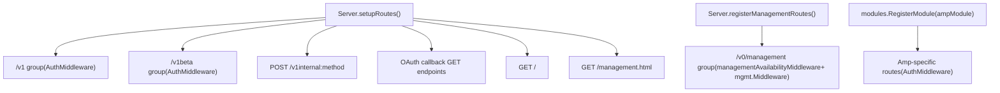
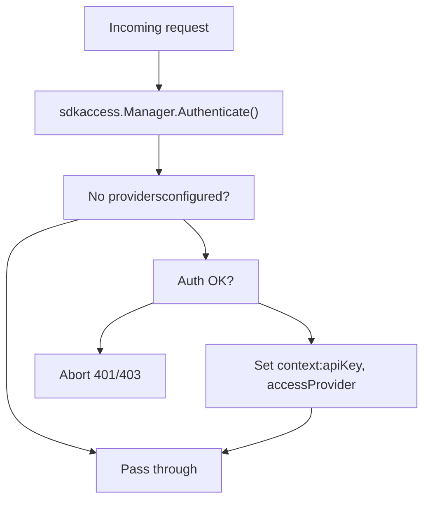
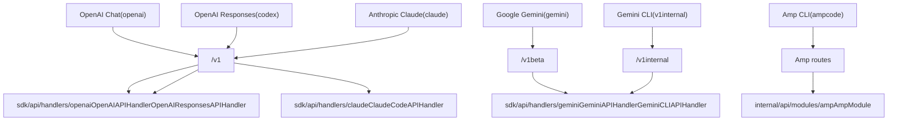

# API 参考

相关源文件

-   [config.example.yaml](https://github.com/router-for-me/CLIProxyAPI/blob/c66cb0af/config.example.yaml)
-   [internal/api/handlers/management/config\_basic.go](https://github.com/router-for-me/CLIProxyAPI/blob/c66cb0af/internal/api/handlers/management/config_basic.go)
-   [internal/api/handlers/management/config\_lists.go](https://github.com/router-for-me/CLIProxyAPI/blob/c66cb0af/internal/api/handlers/management/config_lists.go)
-   [internal/api/server.go](https://github.com/router-for-me/CLIProxyAPI/blob/c66cb0af/internal/api/server.go)
-   [internal/config/config.go](https://github.com/router-for-me/CLIProxyAPI/blob/c66cb0af/internal/config/config.go)
-   [internal/watcher/watcher.go](https://github.com/router-for-me/CLIProxyAPI/blob/c66cb0af/internal/watcher/watcher.go)
-   [sdk/cliproxy/service.go](https://github.com/router-for-me/CLIProxyAPI/blob/c66cb0af/sdk/cliproxy/service.go)
-   [test/amp\_management\_test.go](https://github.com/router-for-me/CLIProxyAPI/blob/c66cb0af/test/amp_management_test.go)

本页面是 CLIProxyAPI 暴露的所有 HTTP 端点的完整参考索引。它涵盖了适用于所有端点系列的路由结构、身份验证要求和通用约定。各系列的详细文档位于以下子页面：

-   兼容 OpenAI 的端点 → [兼容 OpenAI 的端点](/router-for-me/CLIProxyAPI/4.1-openai-compatible-endpoints)
-   Gemini 和 Vertex 端点 → [Gemini 和 Vertex 端点](/router-for-me/CLIProxyAPI/4.2-gemini-and-vertex-endpoints)
-   Claude API 端点 → [Claude API 端点](/router-for-me/CLIProxyAPI/4.3-claude-api-endpoints)
-   管理 API → [管理 API](/router-for-me/CLIProxyAPI/4.4-management-api)
-   Amp CLI 集成路由 → [Amp CLI 集成](/router-for-me/CLIProxyAPI/4.5-amp-cli-integration)

有关请求如何在内部处理的信息（翻译、身份验证注入、执行器分发），请参阅[核心架构](/router-for-me/CLIProxyAPI/3-core-architecture)。

---

## 端点系列概览

所有路由都在 `internal/api/server.go` 中注册。`setupRoutes()` 函数注册推理和回调路由；当配置了 `secret-key` 时，`registerManagementRoutes()` 会延迟注册 `v0/management` 树。

**路由注册图：**

来源：[internal/api/server.go321-438](https://github.com/router-for-me/CLIProxyAPI/blob/c66cb0af/internal/api/server.go#L321-L438) [internal/api/server.go478-646](https://github.com/router-for-me/CLIProxyAPI/blob/c66cb0af/internal/api/server.go#L478-L646)

---

## 端点索引

### 推理端点 (Inference Endpoints)

当配置了 `api-keys` 时，这些路由需要 `Authorization: Bearer <api-key>` 头（请参阅[身份验证设置](/router-for-me/CLIProxyAPI/2.3-authentication-setup)）。所有推理端点均在 Gin 的 `AuthMiddleware` 下注册。

| 方法 | 路径 | 处理器 | 协议系列 |
| --- | --- | --- | --- |
| `GET` | `/v1/models` | `unifiedModelsHandler` | OpenAI / Claude |
| `POST` | `/v1/chat/completions` | `OpenAIAPIHandler.ChatCompletions` | OpenAI |
| `POST` | `/v1/completions` | `OpenAIAPIHandler.Completions` | OpenAI |
| `POST` | `/v1/messages` | `ClaudeCodeAPIHandler.ClaudeMessages` | Claude |
| `POST` | `/v1/messages/count_tokens` | `ClaudeCodeAPIHandler.ClaudeCountTokens` | Claude |
| `POST` | `/v1/responses` | `OpenAIResponsesAPIHandler.Responses` | Codex/OpenAI |
| `POST` | `/v1/responses/compact` | `OpenAIResponsesAPIHandler.Compact` | Codex/OpenAI |
| `GET` | `/v1/responses` | `OpenAIResponsesAPIHandler.ResponsesWebsocket` | Codex/OpenAI WS |
| `GET` | `/v1beta/models` | `GeminiAPIHandler.GeminiModels` | Gemini |
| `POST` | `/v1beta/models/*action` | `GeminiAPIHandler.GeminiHandler` | Gemini |
| `GET` | `/v1beta/models/*action` | `GeminiAPIHandler.GeminiGetHandler` | Gemini |
| `POST` | `/v1internal:method` | `GeminiCLIAPIHandler.CLIHandler` | Gemini CLI |
| `GET` | `/v1/ws` | `wsrelay.Manager.Handler()` | WebSocket 中继 |

来源：[internal/api/server.go329-363](https://github.com/router-for-me/CLIProxyAPI/blob/c66cb0af/internal/api/server.go#L329-L363)

### 管理端点 (Management Endpoints)

所有 `/v0/management/*` 路由均受 `managementAvailabilityMiddleware` 和 `mgmt.Middleware()` 保护。它们仅在 `config.yaml` 中设置了 `remote-management.secret-key`、设置了 `MANAGEMENT_PASSWORD` 环境变量或通过程序提供本地管理密码时才会注册。

| 方法 | 路径 | 描述 |
| --- | --- | --- |
| `GET` | `/v0/management/config` | 以 JSON 形式获取当前配置 |
| `GET` | `/v0/management/config.yaml` | 原始配置文件字节 |
| `PUT` | `/v0/management/config.yaml` | 替换配置文件 |
| `GET` | `/v0/management/usage` | 使用情况统计 |
| `GET` | `/v0/management/usage/export` | 导出统计数据 |
| `POST` | `/v0/management/usage/import` | 导入统计数据 |
| `GET` | `/v0/management/logs` | 应用程序日志 |
| `DELETE` | `/v0/management/logs` | 删除应用程序日志 |
| `GET` | `/v0/management/auth-files` | 列出身份验证文件 |
| `POST` | `/v0/management/auth-files` | 上传身份验证文件 |
| `DELETE` | `/v0/management/auth-files` | 删除身份验证文件 |
| `GET` | `/v0/management/gemini-api-key` | Gemini API 密钥 |
| `GET` | `/v0/management/claude-api-key` | Claude API 密钥 |
| `GET` | `/v0/management/codex-api-key` | Codex API 密钥 |
| `GET` | `/v0/management/openai-compatibility` | 兼容 OpenAI 的供应商 |
| `GET` | `/v0/management/anthropic-auth-url` | 发起 Anthropic OAuth |
| `GET` | `/v0/management/gemini-cli-auth-url` | 发起 Gemini CLI OAuth |
| `GET` | `/v0/management/codex-auth-url` | 发起 Codex OAuth |
| `GET` | `/v0/management/ampcode/*` | Amp 集成配置 |

（完整的管理端点表格位于[管理 API](/router-for-me/CLIProxyAPI/4.4-management-api)。）

来源：[internal/api/server.go488-645](https://github.com/router-for-me/CLIProxyAPI/blob/c66cb0af/internal/api/server.go#L488-L645)

### OAuth 回调端点 (OAuth Callback Endpoints)

这些端点接收来自供应商授权服务器的重定向。它们为在管理 OAuth 流程中等待的 goroutine 持久化授权代码（authorization code）。这些端点无需身份验证。

| 方法 | 路径 | 供应商 |
| --- | --- | --- |
| `GET` | `/anthropic/callback` | Anthropic / Claude |
| `GET` | `/codex/callback` | OpenAI Codex |
| `GET` | `/google/callback` | Google Gemini CLI |
| `GET` | `/iflow/callback` | iFlow |
| `GET` | `/antigravity/callback` | Antigravity |

来源：[internal/api/server.go367-437](https://github.com/router-for-me/CLIProxyAPI/blob/c66cb0af/internal/api/server.go#L367-L437)

### 实用端点 (Utility Endpoints)

| 方法 | 路径 | 描述 |
| --- | --- | --- |
| `GET` | `/` | 服务器信息 + 端点列表 |
| `GET` | `/management.html` | 管理控制面板 HTML（如果已启用） |
| `GET` | `/keep-alive` | 保持活动（Keep-alive）信号（可选，仅限 SDK 功能） |

来源：[internal/api/server.go353-362](https://github.com/router-for-me/CLIProxyAPI/blob/c66cb0af/internal/api/server.go#L353-L362) [internal/api/server.go688-702](https://github.com/router-for-me/CLIProxyAPI/blob/c66cb0af/internal/api/server.go#L688-L702)

---

## 请求身份验证

`AuthMiddleware` 函数（定义在 `internal/api/server.go` 中）包装了所有推理端点组。它委派给 `sdkaccess.Manager.Authenticate()`。

**身份验证行为：**

当在 `config.yaml` 中配置了 `api-keys` 时，服务器接受 `Authorization: Bearer <key>` 或 `X-API-Key: <key>` 头。当未设置 `api-keys` 时，所有对推理端点的请求都允许在没有令牌的情况下访问。有关完整的身份验证模型，请参阅[身份验证流程](/router-for-me/CLIProxyAPI/7-authentication-flows)。

来源：[internal/api/server.go1030-1056](https://github.com/router-for-me/CLIProxyAPI/blob/c66cb0af/internal/api/server.go#L1030-L1056) [config.example.yaml35-38](https://github.com/router-for-me/CLIProxyAPI/blob/c66cb0af/config.example.yaml#L35-L38)

### 管理 API 身份验证

管理路由使用单独的中间件 (`mgmt.Middleware()`)，该中间件针对 `config.yaml` 中的 `remote-management.secret-key` 或 `MANAGEMENT_PASSWORD` 环境变量进行验证。本地主机请求还可以使用启动时提供的仅限本地的密码进行身份验证。

在配置密钥之前，路由完全不存在（返回 404）；`managementAvailabilityMiddleware` 强制执行此规则。

来源：[internal/api/server.go298-304](https://github.com/router-for-me/CLIProxyAPI/blob/c66cb0af/internal/api/server.go#L298-L304) [internal/api/server.go648-656](https://github.com/router-for-me/CLIProxyAPI/blob/c66cb0af/internal/api/server.go#L648-L656)

---

## CORS

全局 CORS 中间件应用于每个响应：

-   `Access-Control-Allow-Origin: *`
-   `Access-Control-Allow-Methods: GET, POST, PUT, PATCH, DELETE, OPTIONS`
-   `Access-Control-Allow-Headers: *`

`OPTIONS` 预检（preflight）请求立即返回 `204 No Content`。

来源：[internal/api/server.go849-862](https://github.com/router-for-me/CLIProxyAPI/blob/c66cb0af/internal/api/server.go#L849-L862)

---

## 流式处理 (Streaming)

支持流式处理的端点（`/v1/chat/completions`、`/v1/messages`、`/v1beta/models/*action` 等）在请求体包含 `"stream": true` 时返回服务器发送事件 (SSE)。`Content-Type` 为 `text/event-stream`。非流式响应使用 `application/json`。

有关引导重试（bootstrap retries）和 SSE 保持活动间隔的详细信息，请参阅[流式处理与保持活动](/router-for-me/CLIProxyAPI/8.6-streaming-and-keep-alive)。

---

## 处理器层次结构 (Handler Hierarchy)

为推理路由提供服务的处理器对象共享一个通用的 `BaseAPIHandler` 基类，该基类保存身份验证管理器和配置。

`GET /v1/models` 上的 `unifiedModelsHandler` 根据 `User-Agent` 头前缀分发到 `OpenAIAPIHandler.OpenAIModels` 或 `ClaudeCodeAPIHandler.ClaudeModels`（`claude-cli` 路由到 Claude 处理器）。

来源：[internal/api/server.go323-341](https://github.com/router-for-me/CLIProxyAPI/blob/c66cb0af/internal/api/server.go#L323-L341) [internal/api/server.go770-783](https://github.com/router-for-me/CLIProxyAPI/blob/c66cb0af/internal/api/server.go#L770-L783)

---

## 协议系列映射

下图将每个客户端协议系列映射到路由前缀以及为其提供服务的处理器/包。

来源：[internal/api/server.go321-363](https://github.com/router-for-me/CLIProxyAPI/blob/c66cb0af/internal/api/server.go#L321-L363) [internal/api/server.go282-291](https://github.com/router-for-me/CLIProxyAPI/blob/c66cb0af/internal/api/server.go#L282-L291)
