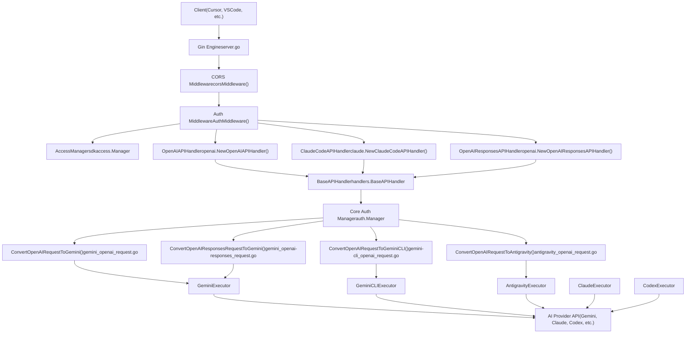
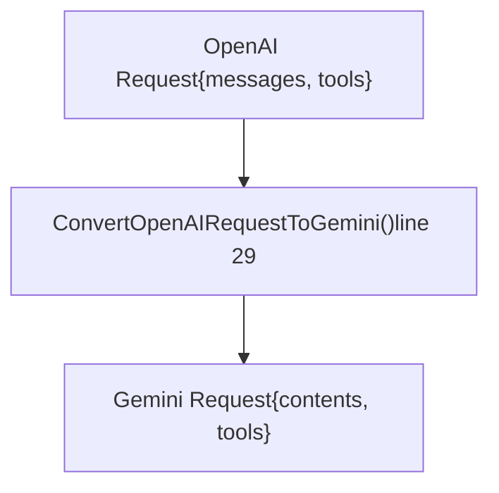
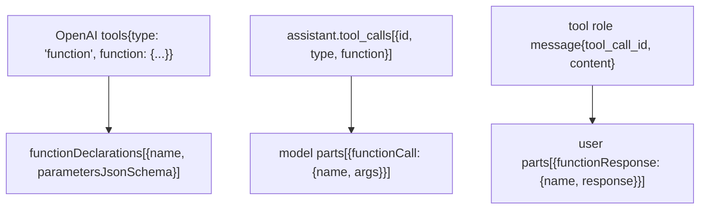
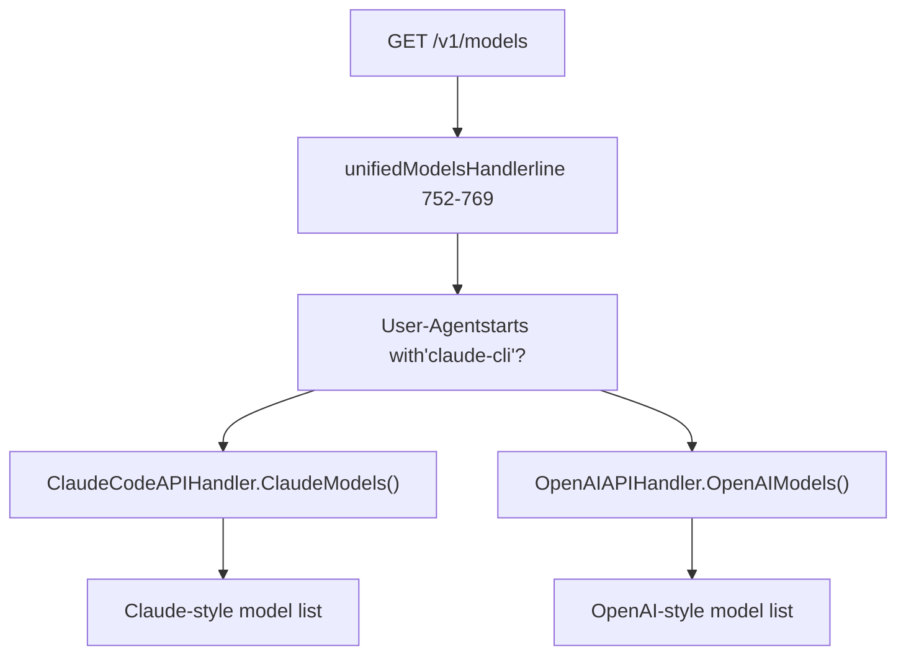
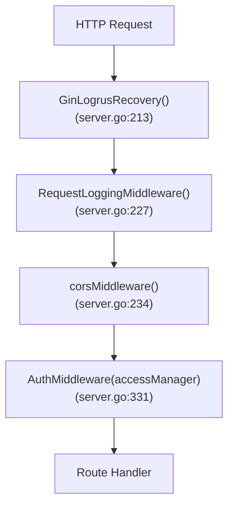

# 兼容 OpenAI 的端点

相关源文件

-   [config.example.yaml](https://github.com/router-for-me/CLIProxyAPI/blob/c66cb0af/config.example.yaml)
-   [internal/api/handlers/management/config\_basic.go](https://github.com/router-for-me/CLIProxyAPI/blob/c66cb0af/internal/api/handlers/management/config_basic.go)
-   [internal/api/handlers/management/config\_lists.go](https://github.com/router-for-me/CLIProxyAPI/blob/c66cb0af/internal/api/handlers/management/config_lists.go)
-   [internal/api/middleware/request\_logging\_test.go](https://github.com/router-for-me/CLIProxyAPI/blob/c66cb0af/internal/api/middleware/request_logging_test.go)
-   [internal/api/middleware/response\_writer\_test.go](https://github.com/router-for-me/CLIProxyAPI/blob/c66cb0af/internal/api/middleware/response_writer_test.go)
-   [internal/api/server.go](https://github.com/router-for-me/CLIProxyAPI/blob/c66cb0af/internal/api/server.go)
-   [internal/config/config.go](https://github.com/router-for-me/CLIProxyAPI/blob/c66cb0af/internal/config/config.go)
-   [internal/config/sdk\_config.go](https://github.com/router-for-me/CLIProxyAPI/blob/c66cb0af/internal/config/sdk_config.go)
-   [internal/runtime/executor/codex\_websockets\_executor.go](https://github.com/router-for-me/CLIProxyAPI/blob/c66cb0af/internal/runtime/executor/codex_websockets_executor.go)
-   [internal/watcher/watcher.go](https://github.com/router-for-me/CLIProxyAPI/blob/c66cb0af/internal/watcher/watcher.go)
-   [sdk/api/handlers/handlers.go](https://github.com/router-for-me/CLIProxyAPI/blob/c66cb0af/sdk/api/handlers/handlers.go)
-   [sdk/api/handlers/handlers\_stream\_bootstrap\_test.go](https://github.com/router-for-me/CLIProxyAPI/blob/c66cb0af/sdk/api/handlers/handlers_stream_bootstrap_test.go)
-   [sdk/api/handlers/header\_filter.go](https://github.com/router-for-me/CLIProxyAPI/blob/c66cb0af/sdk/api/handlers/header_filter.go)
-   [sdk/api/handlers/header\_filter\_test.go](https://github.com/router-for-me/CLIProxyAPI/blob/c66cb0af/sdk/api/handlers/header_filter_test.go)
-   [sdk/api/handlers/openai/openai\_responses\_websocket.go](https://github.com/router-for-me/CLIProxyAPI/blob/c66cb0af/sdk/api/handlers/openai/openai_responses_websocket.go)
-   [sdk/cliproxy/auth/conductor\_executor\_replace\_test.go](https://github.com/router-for-me/CLIProxyAPI/blob/c66cb0af/sdk/cliproxy/auth/conductor_executor_replace_test.go)
-   [sdk/cliproxy/service.go](https://github.com/router-for-me/CLIProxyAPI/blob/c66cb0af/sdk/cliproxy/service.go)
-   [test/amp\_management\_test.go](https://github.com/router-for-me/CLIProxyAPI/blob/c66cb0af/test/amp_management_test.go)

## 用途与范围

本文档描述了 CLIProxyAPI 暴露的兼容 OpenAI 的 HTTP 端点。这些端点实现了 OpenAI API 规范，允许为 OpenAI 设计的客户端（如 Cursor、VSCode 扩展和其他 AI 驱动的工具）通过统一接口无缝地与多个 AI 供应商（Gemini、Claude、Codex 等）进行交互。

有关特定供应商的端点，请参阅 [Gemini 和 Vertex 端点](/router-for-me/CLIProxyAPI/4.2-gemini-and-vertex-endpoints)、[Claude API 端点](/router-for-me/CLIProxyAPI/4.3-claude-api-endpoints)。有关管理操作，请参阅[管理 API](/router-for-me/CLIProxyAPI/4.4-management-api)。有关 Amp CLI 集成路由，请参阅 [Amp CLI 集成](/router-for-me/CLIProxyAPI/4.5-amp-cli-integration)。

## 端点概览

CLIProxyAPI 在 `/v1` 路径前缀下暴露了以下兼容 OpenAI 的端点：

| 端点 | 方法 | 用途 | 处理器 |
| --- | --- | --- | --- |
| `/v1/chat/completions` | POST | OpenAI 聊天完成 API | `OpenAIAPIHandler.ChatCompletions` |
| `/v1/completions` | POST | OpenAI 遗留完成 API | `OpenAIAPIHandler.Completions` |
| `/v1/models` | GET | 列出可用模型 | `unifiedModelsHandler` |
| `/v1/messages` | POST | Claude Messages API 兼容性 | `ClaudeCodeAPIHandler.ClaudeMessages` |
| `/v1/messages/count_tokens` | POST | Claude 令牌计数 | `ClaudeCodeAPIHandler.ClaudeCountTokens` |
| `/v1/responses` | GET | OpenAI Responses API — WebSocket 升级 | `OpenAIResponsesAPIHandler.ResponsesWebsocket` |
| `/v1/responses` | POST | OpenAI Responses API — HTTP (非流式 + 流式) | `OpenAIResponsesAPIHandler.Responses` |
| `/v1/responses/compact` | POST | OpenAI Responses API (紧凑变体) | `OpenAIResponsesAPIHandler.Compact` |

> **注意：** `/v1/messages` 和 `/v1/messages/count_tokens` 使用 Claude API 的请求/响应格式，而非 OpenAI 格式。为了保持兼容性，它们被共同放置在 `/v1` 下。这些端点的详细文档位于页面 4.3 (Claude API 端点)。

**来源：** [internal/api/server.go329-341](https://github.com/router-for-me/CLIProxyAPI/blob/c66cb0af/internal/api/server.go#L329-L341)

## 请求流程架构


**来源：** [internal/api/server.go193-317](https://github.com/router-for-me/CLIProxyAPI/blob/c66cb0af/internal/api/server.go#L193-L317) [internal/api/server.go321-341](https://github.com/router-for-me/CLIProxyAPI/blob/c66cb0af/internal/api/server.go#L321-L341)

## 路由注册

路由在服务器初始化期间通过 `setupRoutes()` 方法注册：

路由设置图 (`setupRoutes`):

> **[Mermaid sequence]**
> *(图表结构无法解析)*

**来源：** [internal/api/server.go321-341](https://github.com/router-for-me/CLIProxyAPI/blob/c66cb0af/internal/api/server.go#L321-L341)

## 身份验证流程

所有兼容 OpenAI 的端点都受到身份验证中间件的保护：

所有 `/v1` 路由的身份验证流程：

`AuthMiddleware` 函数（在 `server.go` 中声明）执行以下操作：

1.  如果未配置 `AccessManager` (`manager == nil`)，则允许所有请求（遗留模式）。
2.  通过 `sdkaccess.Manager` 调用 `manager.Authenticate(c.Request.Context(), c.Request)`。
3.  成功时，设置 Gin 上下文值：
    -   `"apiKey"`：已认证的主体（principal）标识符
    -   `"accessProvider"`：验证请求的供应商
    -   `"accessMetadata"`：来自身份验证结果的其他元数据
4.  失败时，中止并返回适当的 HTTP 状态码。

**来源：** [internal/api/server.go1029-1043](https://github.com/router-for-me/CLIProxyAPI/blob/c66cb0af/internal/api/server.go#L1029-L1043)

## 聊天完成 (Chat Completions) 端点

### 端点详情

-   **路径：** `POST /v1/chat/completions`
-   **处理器：** `OpenAIAPIHandler.ChatCompletions`
-   **用途：** 具有多供应商路由功能的 OpenAI 聊天完成 API 实现

### 请求格式

端点接受标准的 OpenAI 聊天完成请求格式：

| 参数 | 类型 | 描述 |
| --- | --- | --- |
| `model` | 字符串 | 模型标识符（可能包含供应商前缀） |
| `messages` | 数组 | 包含角色和内容的对话历史记录 |
| `temperature` | 数值 | 采样温度 (0-2) |
| `top_p` | 数值 | 核采样（nucleus sampling）阈值 |
| `top_k` | 数值 | Top-K 采样参数（供应商特定） |
| `max_tokens` | 数值 | 响应中的最大令牌数 |
| `stream` | 布尔值 | 启用流式响应 |
| `tools` | 数组 | 函数调用工具声明 |
| `tool_choice` | 字符串/对象 | 工具选择模式 |
| `reasoning_effort` | 字符串 | 思考/推理配置 |
| `n` | 数值 | 生成的完成次数 |
| `modalities` | 数组 | 响应模态（例如 `["text", "image"]`） |
| `image_config` | 对象 | 图像生成配置 |

### 翻译示例

请求翻译系统将 OpenAI 格式转换为供应商特定格式：

#### Gemini 翻译


`ConvertOpenAIRequestToGemini` 中的关键转换：

-   `messages[].role="system"` → `system_instruction` (第 144-163 行)
-   `messages[].role="user"` → `contents[]{role:"user", parts:[]}` (第 164-210 行)
-   `messages[].role="assistant"` → `contents[]{role:"model", parts:[]}` (第 211-286 行)
-   `messages[].role="tool"` → `parts[].functionResponse` (第 129-136, 266-283 行)
-   `tools[].type="function"` → `tools[].functionDeclarations[]` (第 291-395 行)
-   `reasoning_effort` → `generationConfig.thinkingConfig` (第 39-52 行)

**来源：** [internal/translator/gemini/openai/chat-completions/gemini\_openai\_request.go29-400](https://github.com/router-for-me/CLIProxyAPI/blob/c66cb0af/internal/translator/gemini/openai/chat-completions/gemini_openai_request.go#L29-L400)

#### Gemini CLI 翻译

类似于 Gemini 翻译，但将请求包装在 CLI 特定的信封（envelope）中：

```
{  "project": "",  "request": {    "contents": [...],    "generationConfig": {...},    "tools": [...]  },  "model": "gemini-2.5-pro"}
```
**来源：** [internal/translator/gemini-cli/openai/chat-completions/gemini-cli\_openai\_request.go29-392](https://github.com/router-for-me/CLIProxyAPI/blob/c66cb0af/internal/translator/gemini-cli/openai/chat-completions/gemini-cli_openai_request.go#L29-L392)

#### Antigravity 翻译

使用 Gemini CLI 格式并增加了 Antigravity 特有的功能：

```
{  "project": "",  "request": {    "contents": [...],    "generationConfig": {      "maxOutputTokens": 8192,      "thinkingConfig": {...}    }  },  "model": "gemini-3-pro-preview"}
```
**来源：** [internal/translator/antigravity/openai/chat-completions/antigravity\_openai\_request.go29-414](https://github.com/router-for-me/CLIProxyAPI/blob/c66cb0af/internal/translator/antigravity/openai/chat-completions/antigravity_openai_request.go#L29-L414)

### 工具/函数调用 (Tool/Function Calling)

函数调用是双向翻译的：


翻译处理：

1.  模式（Schema）转换：`parameters` → `parametersJsonSchema` (第 298-335 行)
2.  带有 `thoughtSignature` 标记的函数调用序列化 (第 246-264 行)
3.  按调用 ID 聚合工具响应 (第 104-122, 266-283 行)

**来源：** [internal/translator/gemini/openai/chat-completions/gemini\_openai\_request.go291-395](https://github.com/router-for-me/CLIProxyAPI/blob/c66cb0af/internal/translator/gemini/openai/chat-completions/gemini_openai_request.go#L291-L395)

### 思考/推理支持

`reasoning_effort` 参数被翻译为供应商特定的思考配置：

| OpenAI 值 | Gemini 翻译 |
| --- | --- |
| `"auto"` | `thinkingConfig: {thinkingBudget: -1, includeThoughts: true}` |
| `"low"` | `thinkingConfig: {thinkingLevel: "low", includeThoughts: true}` |
| `"medium"` | `thinkingConfig: {thinkingLevel: "medium", includeThoughts: true}` |
| `"high"` | `thinkingConfig: {thinkingLevel: "high", includeThoughts: true}` |
| `"none"` | `thinkingConfig: {thinkingLevel: "none", includeThoughts: false}` |

**来源：** [internal/translator/gemini/openai/chat-completions/gemini\_openai\_request.go39-52](https://github.com/router-for-me/CLIProxyAPI/blob/c66cb0af/internal/translator/gemini/openai/chat-completions/gemini_openai_request.go#L39-L52)

## 完成 (Completions) 端点

### 端点详情

-   **路径：** `POST /v1/completions`
-   **处理器：** `OpenAIAPIHandler.Completions`
-   **用途：** 遗留的 OpenAI 完成 API（不带聊天结构的文本补全）

此端点支持具有简单提示词字符串而非聊天消息数组的遗留完成请求。处理器内部将其转换为聊天格式，以实现供应商兼容性。

**来源：** [internal/api/server.go323](https://github.com/router-for-me/CLIProxyAPI/blob/c66cb0af/internal/api/server.go#L323-L323)

## 模型 (Models) 端点

### 端点详情

-   **路径：** `GET /v1/models`
-   **处理器：** `unifiedModelsHandler`
-   **用途：** 列出所有已配置供应商的可用模型

### 统一处理器路由

模型端点使用一个特殊的统一处理器，根据 User-Agent 进行路由：


**来源：** [internal/api/server.go766-783](https://github.com/router-for-me/CLIProxyAPI/blob/c66cb0af/internal/api/server.go#L766-L783)

### 模型注册表集成

模型端点从全局模型注册表中聚合模型，该注册表跟踪：

1.  **静态模型定义** - 供应商特定的模型目录
2.  **OAuth 认证模型** - 通过 OAuth 凭证可用的模型
3.  **API 密钥模型** - 来自已配置 API 密钥的模型（带有别名）
4.  **动态模型** - 运行时注册的模型（例如 Antigravity）

模型可用性通过以下方式过滤：

-   供应商可用性（活动凭证）
-   配额状态（未挂起）
-   排除模式（按凭证或全局）
-   模型别名（按凭证或全局 OAuth 映射）

有关模型注册表的详细行为，请参阅[模型注册与选择](/router-for-me/CLIProxyAPI/3.6-model-registry-and-selection)。

**来源：** [internal/api/server.go333](https://github.com/router-for-me/CLIProxyAPI/blob/c66cb0af/internal/api/server.go#L333-L333)

## Claude Messages 兼容性

### 端点详情

-   **路径：** `POST /v1/messages`
-   **处理器：** `ClaudeCodeAPIHandler.ClaudeMessages`
-   **用途：** `/v1` 路径下的 Claude Messages API 兼容性

此端点在标准 `/v1` 前缀下暴露了 Claude Messages API 格式，允许客户端交替使用 OpenAI 或 Claude 请求格式。

### 令牌计数 (Token Counting)

-   **路径：** `POST /v1/messages/count_tokens`
-   **处理器：** `ClaudeCodeAPIHandler.ClaudeCountTokens`
-   **用途：** 为 Claude 消息计算令牌数，而不发起实际请求

**来源：** [internal/api/server.go336-337](https://github.com/router-for-me/CLIProxyAPI/blob/c66cb0af/internal/api/server.go#L336-L337)

## OpenAI Responses API

### 端点详情

| 路径 | 方法 | 处理器 | 用途 |
| --- | --- | --- | --- |
| `/v1/responses` | GET | `ResponsesWebsocket` | WebSocket 升级；接受 `response.create` 和 `response.append` 消息 |
| `/v1/responses` | POST | `Responses` | 用于非流式和流式完成的 HTTP 请求/响应 |
| `/v1/responses/compact` | POST | `Compact` | 紧凑响应格式变体 |

当 HTTP 客户端向 `GET /v1/responses` 发送 WebSocket 升级请求时，`ResponsesWebsocket`（位于 `sdk/api/handlers/openai/openai_responses_websocket.go`）会处理该升级。连接接受 `response.create` 或 `response.append` 类型的 JSON 文本消息，并以 JSON WebSocket 文本消息的形式流式传回响应事件。每个会话由一个 UUID (`passthroughSessionID`) 跟踪，并在客户端断开连接时关闭。有关完整的 WebSocket 会话文档，请参见第 8.7 页。

### 请求格式

Responses API 使用与聊天完成不同的消息结构：

| 字段 | 类型 | 描述 |
| --- | --- | --- |
| `input` | 数组 | 包含以下类型的输入项：`message`, `function_call`, `function_call_output`, `reasoning` |
| `instructions` | 字符串 | 系统指令（映射到 `system_instruction`） |
| `tools` | 数组 | 函数工具声明 |
| `max_output_tokens` | 数值 | 最大输出令牌数 |
| `temperature` | 数值 | 采样温度 |
| `reasoning.effort` | 字符串 | 思考/推理尝试级别 |

### 翻译流程

关键转换：

1.  规范化连续的函数调用/输出 (第 37-108 行)
2.  `input[type="message"]` → 基于角色拆分的 `contents[]` (第 117-264 行)
3.  `input[type="function_call"]` → 带有 `functionCall` 部分的模型消息 (第 265-283 行)
4.  `input[type="function_call_output"]` → 带有 `functionResponse` 的函数消息 (第 285-323 行)
5.  `input[type="reasoning"]` → 带有 `thought=true` 标志的模型消息 (第 325-333 行)
6.  `instructions` → `system_instruction` (第 26-30 行)
7.  `reasoning.effort` → `generationConfig.thinkingConfig` (第 424-437 行)

**来源：** [internal/translator/gemini/openai/responses/gemini\_openai-responses\_request.go13-442](https://github.com/router-for-me/CLIProxyAPI/blob/c66cb0af/internal/translator/gemini/openai/responses/gemini_openai-responses_request.go#L13-L442)

### 紧凑 (Compact) 端点

-   **路径：** `POST /v1/responses/compact`
-   **处理器：** `OpenAIResponsesAPIHandler.Compact`
-   **用途：** 紧凑响应格式变体（也由 `CodexWebsocketsExecutor` 通过 `alt == "responses/compact"` 路径在内部使用）

**来源：** [internal/api/server.go338-340](https://github.com/router-for-me/CLIProxyAPI/blob/c66cb0af/internal/api/server.go#L338-L340) [internal/runtime/executor/codex\_websockets\_executor.go148-153](https://github.com/router-for-me/CLIProxyAPI/blob/c66cb0af/internal/runtime/executor/codex_websockets_executor.go#L148-L153)

## 中间件栈 (Middleware Stack)

所有兼容 OpenAI 的端点都经过以下中间件链：

应用于所有 `/v1` 路由上每个请求的中间件链：


中间件职责：

| 中间件 | 注册位置（行号） | 行为 |
| --- | --- | --- |
| `GinLogrusRecovery()` | `server.go:213` | 带有结构化日志记录的 Panic 恢复 |
| `RequestLoggingMiddleware()` | `server.go:227` | 当配置中 `request-log: true` 时记录请求/响应；启用 `CommercialMode` 时跳过 |
| `corsMiddleware()` | `server.go:234` | 设置 `Access-Control-Allow-Origin: *`；通过 `204` 处理 `OPTIONS` 预检 |
| `AuthMiddleware(accessManager)` | `server.go:331` (按组) | 通过 `sdkaccess.Manager` 验证客户端凭证 |

**来源：** [internal/api/server.go204-234](https://github.com/router-for-me/CLIProxyAPI/blob/c66cb0af/internal/api/server.go#L204-L234) [internal/api/server.go329-332](https://github.com/router-for-me/CLIProxyAPI/blob/c66cb0af/internal/api/server.go#L329-L332) [internal/api/server.go849-862](https://github.com/router-for-me/CLIProxyAPI/blob/c66cb0af/internal/api/server.go#L849-L862) [internal/api/server.go1029-1043](https://github.com/router-for-me/CLIProxyAPI/blob/c66cb0af/internal/api/server.go#L1029-L1043)

## CORS 配置

CORS 中间件 (`corsMiddleware`) 允许具有宽松设置的跨域请求：

| 标头 | 值 |
| --- | --- |
| `Access-Control-Allow-Origin` | `*` |
| `Access-Control-Allow-Methods` | `GET, POST, PUT, PATCH, DELETE, OPTIONS` |
| `Access-Control-Allow-Headers` | `*` |

`OPTIONS` 预检请求会立即收到 `204 No Content`，而不经过身份验证中间件。

**来源：** [internal/api/server.go849-862](https://github.com/router-for-me/CLIProxyAPI/blob/c66cb0af/internal/api/server.go#L849-L862)

## 错误处理

身份验证失败会返回标准化的错误响应：

```
{  "error": "error message text"}
```
HTTP 状态码遵循身份验证错误语义：

-   `401 Unauthorized` - 缺少凭证或凭证无效
-   `403 Forbidden` - 凭证有效但权限不足
-   `500 Internal Server Error` - 身份验证系统错误

**来源：** [internal/api/server.go1036-1040](https://github.com/router-for-me/CLIProxyAPI/blob/c66cb0af/internal/api/server.go#L1036-L1040)
