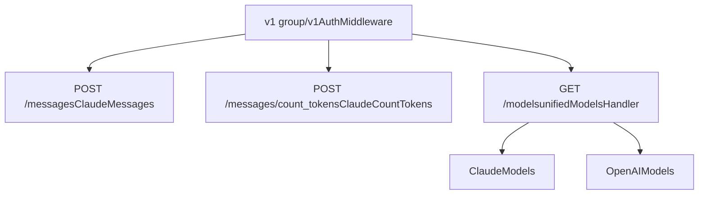
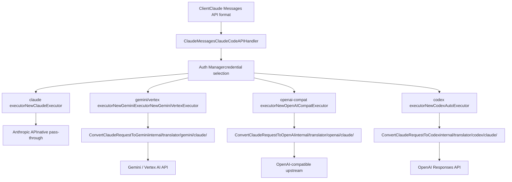
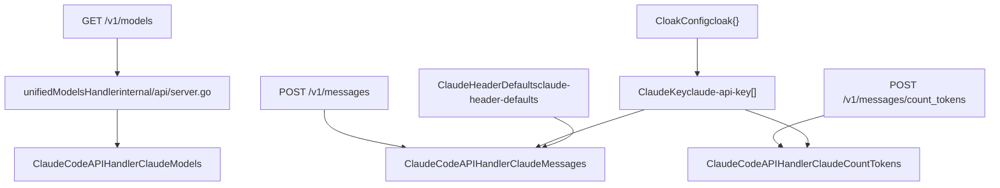

# Claude API 端点

相关源文件

-   [config.example.yaml](https://github.com/router-for-me/CLIProxyAPI/blob/c66cb0af/config.example.yaml)
-   [internal/api/handlers/management/config\_basic.go](https://github.com/router-for-me/CLIProxyAPI/blob/c66cb0af/internal/api/handlers/management/config_basic.go)
-   [internal/api/handlers/management/config\_lists.go](https://github.com/router-for-me/CLIProxyAPI/blob/c66cb0af/internal/api/handlers/management/config_lists.go)
-   [internal/api/server.go](https://github.com/router-for-me/CLIProxyAPI/blob/c66cb0af/internal/api/server.go)
-   [internal/config/config.go](https://github.com/router-for-me/CLIProxyAPI/blob/c66cb0af/internal/config/config.go)
-   [internal/translator/claude/gemini/claude\_gemini\_request.go](https://github.com/router-for-me/CLIProxyAPI/blob/c66cb0af/internal/translator/claude/gemini/claude_gemini_request.go)
-   [internal/translator/claude/openai/chat-completions/claude\_openai\_request.go](https://github.com/router-for-me/CLIProxyAPI/blob/c66cb0af/internal/translator/claude/openai/chat-completions/claude_openai_request.go)
-   [internal/translator/claude/openai/responses/claude\_openai-responses\_request.go](https://github.com/router-for-me/CLIProxyAPI/blob/c66cb0af/internal/translator/claude/openai/responses/claude_openai-responses_request.go)
-   [internal/translator/codex/claude/codex\_claude\_request.go](https://github.com/router-for-me/CLIProxyAPI/blob/c66cb0af/internal/translator/codex/claude/codex_claude_request.go)
-   [internal/translator/codex/gemini/codex\_gemini\_request.go](https://github.com/router-for-me/CLIProxyAPI/blob/c66cb0af/internal/translator/codex/gemini/codex_gemini_request.go)
-   [internal/translator/codex/openai/chat-completions/codex\_openai\_request.go](https://github.com/router-for-me/CLIProxyAPI/blob/c66cb0af/internal/translator/codex/openai/chat-completions/codex_openai_request.go)
-   [internal/translator/openai/claude/openai\_claude\_request.go](https://github.com/router-for-me/CLIProxyAPI/blob/c66cb0af/internal/translator/openai/claude/openai_claude_request.go)
-   [internal/translator/openai/claude/openai\_claude\_request\_test.go](https://github.com/router-for-me/CLIProxyAPI/blob/c66cb0af/internal/translator/openai/claude/openai_claude_request_test.go)
-   [internal/translator/openai/gemini/openai\_gemini\_request.go](https://github.com/router-for-me/CLIProxyAPI/blob/c66cb0af/internal/translator/openai/gemini/openai_gemini_request.go)
-   [internal/watcher/watcher.go](https://github.com/router-for-me/CLIProxyAPI/blob/c66cb0af/internal/watcher/watcher.go)
-   [sdk/api/handlers/claude/code\_handlers.go](https://github.com/router-for-me/CLIProxyAPI/blob/c66cb0af/sdk/api/handlers/claude/code_handlers.go)
-   [sdk/api/handlers/gemini/gemini\_handlers.go](https://github.com/router-for-me/CLIProxyAPI/blob/c66cb0af/sdk/api/handlers/gemini/gemini_handlers.go)
-   [sdk/api/handlers/openai/openai\_handlers.go](https://github.com/router-for-me/CLIProxyAPI/blob/c66cb0af/sdk/api/handlers/openai/openai_handlers.go)
-   [sdk/api/handlers/openai/openai\_responses\_handlers.go](https://github.com/router-for-me/CLIProxyAPI/blob/c66cb0af/sdk/api/handlers/openai/openai_responses_handlers.go)
-   [sdk/api/handlers/openai/openai\_responses\_handlers\_stream\_error\_test.go](https://github.com/router-for-me/CLIProxyAPI/blob/c66cb0af/sdk/api/handlers/openai/openai_responses_handlers_stream_error_test.go)
-   [sdk/api/handlers/openai\_responses\_stream\_error.go](https://github.com/router-for-me/CLIProxyAPI/blob/c66cb0af/sdk/api/handlers/openai_responses_stream_error.go)
-   [sdk/api/handlers/openai\_responses\_stream\_error\_test.go](https://github.com/router-for-me/CLIProxyAPI/blob/c66cb0af/sdk/api/handlers/openai_responses_stream_error_test.go)
-   [sdk/cliproxy/service.go](https://github.com/router-for-me/CLIProxyAPI/blob/c66cb0af/sdk/cliproxy/service.go)
-   [test/amp\_management\_test.go](https://github.com/router-for-me/CLIProxyAPI/blob/c66cb0af/test/amp_management_test.go)

本文档记录了 CLIProxyAPI 暴露的 Claude 兼容 HTTP 端点：`POST /v1/messages`、`POST /v1/messages/count_tokens` 以及 `GET /v1/models` 上的条件性 Claude 模型列表。它涵盖了请求和响应格式、每个端点的实现方式，以及传入的 Claude API 请求如何路由到底层供应商。

有关通用请求管道架构，请参阅 [3.2](/router-for-me/CLIProxyAPI/3.2-http-server-and-request-pipeline)。有关 Claude 供应商执行器和 OAuth 身份验证，请参阅 [6.2](/router-for-me/CLIProxyAPI/6.2-anthropic-claude)。有关相同 `/v1` 前缀下的兼容 OpenAI 的端点，请参阅 [4.1](/router-for-me/CLIProxyAPI/4.1-openai-compatible-endpoints)。

---

## 端点概览

这三个端点共享 `/v1` 路由组，该组在任何处理器运行之前应用 `AuthMiddleware`。

| 方法 | 路径 | 处理器方法 | 描述 |
| --- | --- | --- | --- |
| `POST` | `/v1/messages` | `ClaudeCodeAPIHandler.ClaudeMessages` | Claude Messages API – 流式和非流式 |
| `POST` | `/v1/messages/count_tokens` | `ClaudeCodeAPIHandler.ClaudeCountTokens` | 仅计算输入令牌，不生成响应 |
| `GET` | `/v1/models` | `ClaudeCodeAPIHandler.ClaudeModels` (条件性) | Claude 模型列表；仅当 `User-Agent` 以 `claude-cli` 开头时路由 |

**来源：** [internal/api/server.go330-341](https://github.com/router-for-me/CLIProxyAPI/blob/c66cb0af/internal/api/server.go#L330-L341)

---

## 路由注册

路由在 `Server.setupRoutes()` 中注册。`ClaudeCodeAPIHandler` 从 `BaseAPIHandler` 实例化，其方法直接附加到 Gin 引擎。

**路由组 / 处理器关联图：**


`Server` 中的 `unifiedModelsHandler` 函数检查 `User-Agent` 标头，并据此分发到 `ClaudeCodeAPIHandler.ClaudeModels` 或 `OpenAIAPIHandler.OpenAIModels`。

**来源：** [internal/api/server.go323-341](https://github.com/router-for-me/CLIProxyAPI/blob/c66cb0af/internal/api/server.go#L323-L341) [internal/api/server.go770-783](https://github.com/router-for-me/CLIProxyAPI/blob/c66cb0af/internal/api/server.go#L770-L783)

---

## `POST /v1/messages`

### 处理器

`sdk/api/handlers/claude/code_handlers.go` 中的 `ClaudeCodeAPIHandler.ClaudeMessages`。

该处理器：

1.  通过 `c.GetRawData()` 读取原始 JSON 正文。
2.  解析 `model` 字段以从注册表中选择凭证。
3.  委派给 `BaseAPIHandler`，后者使用身份验证管理器挑选凭据及其关联的供应商执行器。
4.  执行器将 Claude 格式的请求翻译为上游供应商的格式，执行请求并流式传回响应。

**来源：** [sdk/api/handlers/claude/code\_handlers.go59-100](https://github.com/router-for-me/CLIProxyAPI/blob/c66cb0af/sdk/api/handlers/claude/code_handlers.go#L59-L100)

### 请求格式

遵循 Anthropic Messages API。

```
{  "model": "claude-sonnet-4-5-20250929",  "max_tokens": 8096,  "stream": true,  "system": [    {"type": "text", "text": "You are a helpful assistant."}  ],  "messages": [    {"role": "user", "content": [{"type": "text", "text": "Hello"}]}  ],  "thinking": {    "type": "enabled",    "budget_tokens": 10000  },  "temperature": 1.0,  "stop_sequences": ["Human:"]}
```
关键字段：

| 字段 | 类型 | 备注 |
| --- | --- | --- |
| `model` | 字符串 | 必填。与注册表中的已注册模型匹配。 |
| `max_tokens` | 整数 | Anthropic 规范要求；如果缺失，由供应商应用默认值。 |
| `messages` | 数组 | 交替的 `user`/`assistant` 轮次。内容可以是字符串或内容块数组。 |
| `system` | 字符串或数组 | 系统提示词。可以是纯字符串或内容块数组。 |
| `stream` | 布尔值 | 为 `true` 时，响应为服务器发送事件 (SSE)。 |
| `thinking` | 对象 | `{"type": "enabled"/"disabled"/"adaptive", "budget_tokens": N}`。见 [8.3](/router-for-me/CLIProxyAPI/8.3-thinking-and-reasoning-configuration) |
| `temperature` | 浮点数 | 采样温度。 |
| `top_p` | 浮点数 | 核采样（Nucleus sampling）。在缺失 `temperature` 时使用。 |
| `stop_sequences` | 数组 | 最多 4 个停止字符串。 |

### 响应格式 (非流式)

```
{  "id": "msg_01XFDUDYJgAACzvnptvVoYEL",  "type": "message",  "role": "assistant",  "content": [{"type": "text", "text": "Hello! How can I help?"}],  "model": "claude-sonnet-4-5-20250929",  "stop_reason": "end_turn",  "stop_sequence": null,  "usage": {    "input_tokens": 12,    "output_tokens": 8  }}
```
### 流式响应 (SSE)

当 `"stream": true` 时，响应的 `Content-Type` 为 `text/event-stream`。事件遵循 Anthropic 流式格式：

| 事件类型 | 描述 |
| --- | --- |
| `message_start` | 包含具有 `id`, `model`, `usage.input_tokens` 的 `message` 对象 |
| `content_block_start` | 开启一个内容块，带有 `index` 和 `content_block.type` |
| `content_block_delta` | 增量内容：`{"type": "text_delta", "text": "..."}` 或 `{"type": "thinking_delta", ...}` |
| `content_block_stop` | 关闭一个内容块 |
| `message_delta` | 最终的 `stop_reason`, `stop_sequence`, `usage.output_tokens` |
| `message_stop` | 终止流 |

**来源：** [sdk/api/handlers/claude/code\_handlers.go59-200](https://github.com/router-for-me/CLIProxyAPI/blob/c66cb0af/sdk/api/handlers/claude/code_handlers.go#L59-L200)

---

## `POST /v1/messages/count_tokens`

### 处理器

`ClaudeCodeAPIHandler.ClaudeCountTokens`。

将请求有效负载发送到上游供应商的令牌计数 API（如果支持），而不生成完成响应。

### 请求格式

结构与 `/v1/messages` 相同，但忽略 `stream` 和 `max_tokens`。

```
{  "model": "claude-sonnet-4-5-20250929",  "system": "You are a helpful assistant.",  "messages": [    {"role": "user", "content": "How many tokens is this?"}  ]}
```
### 响应格式

```
{  "input_tokens": 42}
```
**来源：** [internal/api/server.go337](https://github.com/router-for-me/CLIProxyAPI/blob/c66cb0af/internal/api/server.go#L337-L337) [sdk/api/handlers/claude/code\_handlers.go1-50](https://github.com/router-for-me/CLIProxyAPI/blob/c66cb0af/sdk/api/handlers/claude/code_handlers.go#L1-L50)

---

## `GET /v1/models` (Claude 变体)

### 路由

`/v1/models` 路由使用 `unifiedModelsHandler`，仅当 `User-Agent` 标头以 `"claude-cli"` 开头时，才路由到 `ClaudeCodeAPIHandler.ClaudeModels`。所有其他客户端接收来自 `OpenAIAPIHandler.OpenAIModels` 的 OpenAI 格式模型列表。

### 响应格式

```
{  "data": [    {      "type": "model",      "id": "claude-sonnet-4-5-20250929",      "display_name": "Claude Sonnet 4.5",      "created_at": "2025-09-29T00:00:00Z"    }  ]}
```
`ClaudeModels` 向 `registry.GetGlobalRegistry().GetAvailableModels("claude")` 发起查询，该查询返回由活动凭据注册在 `"claude"` 通道下的所有模型。

**来源：** [sdk/api/handlers/claude/code\_handlers.go52-57](https://github.com/router-for-me/CLIProxyAPI/blob/c66cb0af/sdk/api/handlers/claude/code_handlers.go#L52-L57) [internal/api/server.go333](https://github.com/router-for-me/CLIProxyAPI/blob/c66cb0af/internal/api/server.go#L333-L333) [internal/api/server.go770-783](https://github.com/router-for-me/CLIProxyAPI/blob/c66cb0af/internal/api/server.go#L770-L783)

---

## 供应商路由与翻译

Claude 端点请求采用 Anthropic Messages API 格式。根据选定的供应商凭据，请求可能需要在转发到上游之前进行翻译。

**来自 `/v1/messages` 的请求翻译路径：**


**来源：** [sdk/cliproxy/service.go399-428](https://github.com/router-for-me/CLIProxyAPI/blob/c66cb0af/sdk/cliproxy/service.go#L399-L428) [internal/translator/openai/claude/openai\_claude\_request.go16-40](https://github.com/router-for-me/CLIProxyAPI/blob/c66cb0af/internal/translator/openai/claude/openai_claude_request.go#L16-L40) [internal/translator/codex/claude/codex\_claude\_request.go36-242](https://github.com/router-for-me/CLIProxyAPI/blob/c66cb0af/internal/translator/codex/claude/codex_claude_request.go#L36-L242)

同时也存在反向路径：到达 Gemini 端点 (`/v1beta/...`) 且路由到 Claude 供应商执行器的请求，使用 `internal/translator/claude/gemini/claude_gemini_request.go` 中的 `ConvertGeminiRequestToClaude`；来自 OpenAI 端点的请求使用 `internal/translator/claude/openai/chat-completions/claude_openai_request.go` 中的 `ConvertOpenAIRequestToClaude`。

---

## 思考 / 扩展推理 (Thinking / Extended Reasoning)

请求正文中的 `thinking` 字段映射到供应商特定的推理控制。Claude 的 `thinking.budget_tokens` 与供应商特定格式之间的转换：

| Claude 字段 | OpenAI (codex/compat) | Codex Responses |
| --- | --- | --- |
| `{"type":"enabled","budget_tokens":N}` | 根据预算确定的 `reasoning_effort` 级别 | `reasoning.effort` |
| `{"type":"disabled"}` | `reasoning_effort: "none"` 或 `"low"` | `reasoning.effort: "none"` |
| `{"type":"adaptive"}` | 最大尝试级别 | 最大 `reasoning.effort` |

转换使用 `thinking.ConvertBudgetToLevel` 和 `thinking.ConvertLevelToBudget`。

有关思考配置的完整详情，请参阅 [8.3](/router-for-me/CLIProxyAPI/8.3-thinking-and-reasoning-configuration)

**来源：** [internal/translator/openai/claude/openai\_claude\_request.go63-88](https://github.com/router-for-me/CLIProxyAPI/blob/c66cb0af/internal/translator/openai/claude/openai_claude_request.go#L63-L88) [internal/translator/codex/claude/codex\_claude\_request.go215-241](https://github.com/router-for-me/CLIProxyAPI/blob/c66cb0af/internal/translator/codex/claude/codex_claude_request.go#L215-L241)

---

## 配置

### `claude-api-key` 条目

`config.yaml` 中 `claude-api-key` 下的每个条目都定义了原生 Anthropic API 的凭据。`internal/config/config.go` 中的 `ClaudeKey` 结构体控制此项。

| 字段 | 类型 | 描述 |
| --- | --- | --- |
| `api-key` | 字符串 | Anthropic API 密钥 (`sk-ant-...`)。 |
| `base-url` | 字符串 | 覆盖 Anthropic API 基准 URL。默认为 `https://api.anthropic.com`。 |
| `prefix` | 字符串 | 可选的命名空间。客户端必须以 `{prefix}/{model}` 形式进行访问。 |
| `priority` | 整数 | 值越高表示该凭据越优先使用。 |
| `proxy-url` | 字符串 | 逐密钥的代理覆盖。 |
| `models` | `[]ClaudeModel` | `{name, alias}` 键值对 — 将上游模型 ID 映射到客户端可见的别名。 |
| `headers` | `map[string]string` | 注入到使用此密钥的每个请求中的额外 HTTP 标头。 |
| `excluded-models` | `[]string` | 对此凭据隐藏的模型。支持通配符 (`*`, `*-thinking`)。 |
| `cloak` | `*CloakConfig` | 请求掩蔽选项（见下文）。 |

**来源：** [internal/config/config.go312-341](https://github.com/router-for-me/CLIProxyAPI/blob/c66cb0af/internal/config/config.go#L312-L341)

#### `CloakConfig`

在 `ClaudeKey` 上设置时，掩蔽功能会将请求伪装成来自官方的 Claude Code CLI。

| 字段 | 取值 | 描述 |
| --- | --- | --- |
| `mode` | `"auto"` (默认), `"always"`, `"never"` | 控制何时应用掩蔽。`"auto"` 仅在 `User-Agent` 不是 `claude-cli` 时进行掩蔽。 |
| `strict-mode` | 布尔值 | 为 `true` 时，剥离所有用户提供的系统消息，仅保留注入的 Claude Code 系统提示词。 |
| `sensitive-words` | `[]string` | 使用零宽字符进行模糊处理的单词。 |
| `cache-user-id` | 布尔值 | 为 `true` 时，每个 API 密钥重用缓存的 `user_id`。默认情况下每个请求生成一个新的随机 UUID。 |

**来源：** [internal/config/config.go287-308](https://github.com/router-for-me/CLIProxyAPI/blob/c66cb0af/internal/config/config.go#L287-L308) [config.example.yaml137-163](https://github.com/router-for-me/CLIProxyAPI/blob/c66cb0af/config.example.yaml#L137-L163)

### `claude-header-defaults`

当客户端未发送标头时，注入到 Claude API 请求中的回退标头值。用于将请求呈现为源自特定版本的 Claude Code。

```
claude-header-defaults:  user-agent: "claude-cli/2.1.44 (external, sdk-cli)"  package-version: "0.74.0"  runtime-version: "v24.3.0"  timeout: "600"
```
由 `internal/config/config.go` 中的 `ClaudeHeaderDefaults` 定义。

**来源：** [internal/config/config.go124-131](https://github.com/router-for-me/CLIProxyAPI/blob/c66cb0af/internal/config/config.go#L124-L131) [config.example.yaml164-171](https://github.com/router-for-me/CLIProxyAPI/blob/c66cb0af/config.example.yaml#L164-L171)

---

## 模型列表与排除

`ClaudeModels` 向全局模型注册表查询在 `"claude"` 通道下注册的所有模型。每个活动的 `claude` 凭据通过 `registry.GetClaudeModels()` 注册模型，并应用逐凭据的 `excluded-models` 和全局的 `oauth-excluded-models.claude` 作为过滤器。

`config.yaml` 中 `oauth-model-alias.claude` 下的全局 OAuth 模型别名在注册表级别重命名模型，这会影响客户端看到的内容以及转发到上游的模型名称。

有关完整的模型注册表和排除项详情，请参阅 [3.6](/router-for-me/CLIProxyAPI/3.6-model-registry-and-selection) 和 [8.2](/router-for-me/CLIProxyAPI/8.2-model-mapping-and-exclusion)

**来源：** [sdk/api/handlers/claude/code\_handlers.go52-57](https://github.com/router-for-me/CLIProxyAPI/blob/c66cb0af/sdk/api/handlers/claude/code_handlers.go#L52-L57) [internal/config/config.go91-116](https://github.com/router-for-me/CLIProxyAPI/blob/c66cb0af/internal/config/config.go#L91-L116) [config.example.yaml284-292](https://github.com/router-for-me/CLIProxyAPI/blob/c66cb0af/config.example.yaml#L284-L292)

---

## 处理器与配置实体映射图


**来源：** [internal/api/server.go323-341](https://github.com/router-for-me/CLIProxyAPI/blob/c66cb0af/internal/api/server.go#L323-L341) [sdk/api/handlers/claude/code\_handlers.go27-57](https://github.com/router-for-me/CLIProxyAPI/blob/c66cb0af/sdk/api/handlers/claude/code_handlers.go#L27-L57) [internal/config/config.go124-341](https://github.com/router-for-me/CLIProxyAPI/blob/c66cb0af/internal/config/config.go#L124-L341)
