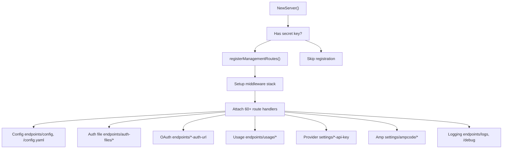
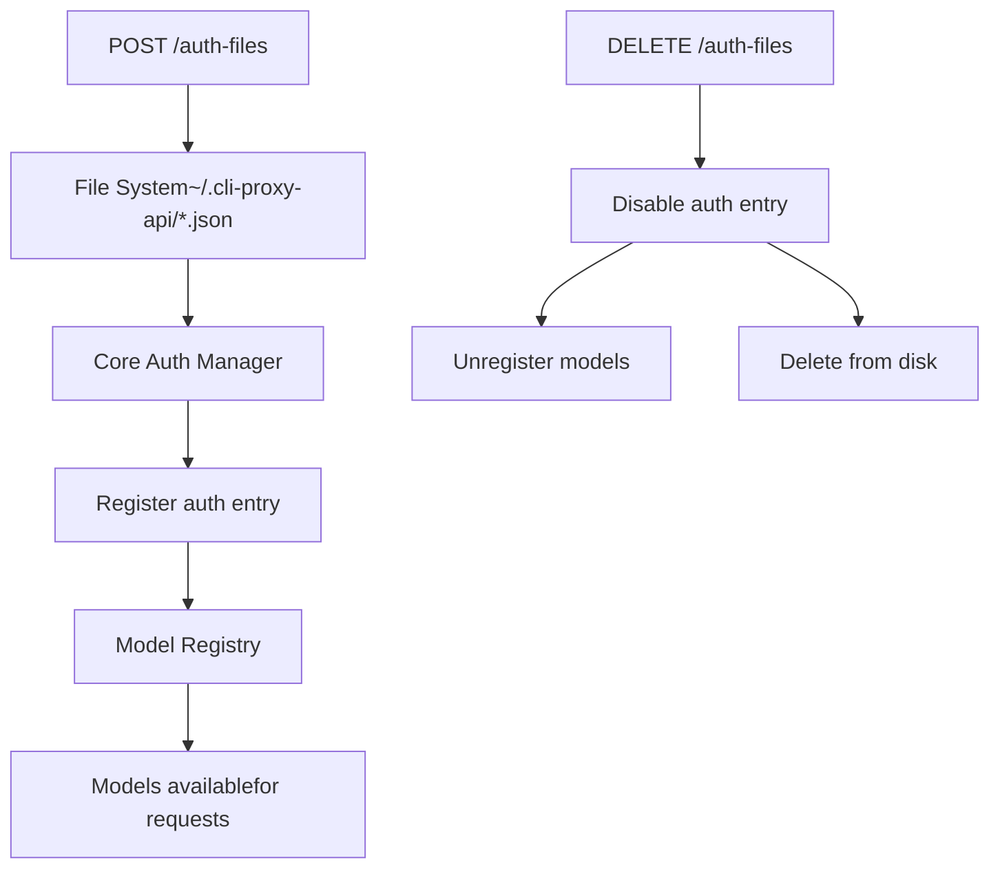
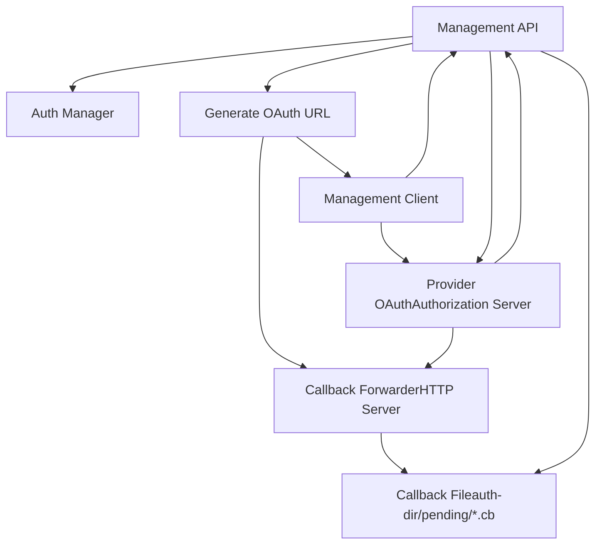
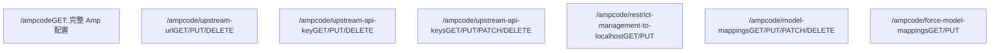

# 管理 API

相关源文件

-   [README.md](https://github.com/router-for-me/CLIProxyAPI/blob/c66cb0af/README.md)
-   [README\_CN.md](https://github.com/router-for-me/CLIProxyAPI/blob/c66cb0af/README_CN.md)
-   [cmd/server/main.go](https://github.com/router-for-me/CLIProxyAPI/blob/c66cb0af/cmd/server/main.go)
-   [config.example.yaml](https://github.com/router-for-me/CLIProxyAPI/blob/c66cb0af/config.example.yaml)
-   [go.mod](https://github.com/router-for-me/CLIProxyAPI/blob/c66cb0af/go.mod)
-   [go.sum](https://github.com/router-for-me/CLIProxyAPI/blob/c66cb0af/go.sum)
-   [internal/api/handlers/management/auth\_files.go](https://github.com/router-for-me/CLIProxyAPI/blob/c66cb0af/internal/api/handlers/management/auth_files.go)
-   [internal/api/handlers/management/config\_basic.go](https://github.com/router-for-me/CLIProxyAPI/blob/c66cb0af/internal/api/handlers/management/config_basic.go)
-   [internal/api/handlers/management/config\_lists.go](https://github.com/router-for-me/CLIProxyAPI/blob/c66cb0af/internal/api/handlers/management/config_lists.go)
-   [internal/api/handlers/management/logs.go](https://github.com/router-for-me/CLIProxyAPI/blob/c66cb0af/internal/api/handlers/management/logs.go)
-   [internal/api/handlers/management/usage.go](https://github.com/router-for-me/CLIProxyAPI/blob/c66cb0af/internal/api/handlers/management/usage.go)
-   [internal/api/server.go](https://github.com/router-for-me/CLIProxyAPI/blob/c66cb0af/internal/api/server.go)
-   [internal/config/config.go](https://github.com/router-for-me/CLIProxyAPI/blob/c66cb0af/internal/config/config.go)
-   [internal/managementasset/updater.go](https://github.com/router-for-me/CLIProxyAPI/blob/c66cb0af/internal/managementasset/updater.go)
-   [internal/runtime/executor/usage\_helpers.go](https://github.com/router-for-me/CLIProxyAPI/blob/c66cb0af/internal/runtime/executor/usage_helpers.go)
-   [internal/store/gitstore.go](https://github.com/router-for-me/CLIProxyAPI/blob/c66cb0af/internal/store/gitstore.go)
-   [internal/store/postgresstore.go](https://github.com/router-for-me/CLIProxyAPI/blob/c66cb0af/internal/store/postgresstore.go)
-   [internal/usage/logger\_plugin.go](https://github.com/router-for-me/CLIProxyAPI/blob/c66cb0af/internal/usage/logger_plugin.go)
-   [internal/watcher/watcher.go](https://github.com/router-for-me/CLIProxyAPI/blob/c66cb0af/internal/watcher/watcher.go)
-   [sdk/cliproxy/service.go](https://github.com/router-for-me/CLIProxyAPI/blob/c66cb0af/sdk/cliproxy/service.go)
-   [sdk/cliproxy/usage/manager.go](https://github.com/router-for-me/CLIProxyAPI/blob/c66cb0af/sdk/cliproxy/usage/manager.go)
-   [test/amp\_management\_test.go](https://github.com/router-for-me/CLIProxyAPI/blob/c66cb0af/test/amp_management_test.go)

## 概览

管理 API 提供了 HTTP 端点，用于动态配置和管理 CLIProxyAPI 服务器，而无需重启。它暴露了配置更新、身份验证管理、OAuth 流程、使用情况统计和运行控制等功能。

本文档涵盖了 `/v0/management` 端点及其实现。有关 AI 供应商 API（OpenAI、Claude、Gemini）的信息，请参阅页面 [4.1](/router-for-me/CLIProxyAPI/4.1-openai-compatible-endpoints)、[4.2](/router-for-me/CLIProxyAPI/4.2-gemini-and-vertex-endpoints) 和 [4.3](/router-for-me/CLIProxyAPI/4.3-claude-api-endpoints)。有关 Amp CLI 特定的路由，请参阅 [4.5](/router-for-me/CLIProxyAPI/4.5-amp-cli-integration)。

**核心特性：**

-   通过 YAML 操作进行热重载配置更新
-   针对多个供应商的 OAuth 流程编排
-   身份验证凭据的上传、下载和删除
-   使用情况统计的导出和导入
-   实时日志配置
-   供应商特定设置管理

**安全模型：**

-   所有管理端点都需要通过密钥（secret key）进行身份验证
-   针对敏感操作可选的仅限本地主机（localhost-only）限制
-   密钥在首次使用时会自动进行 bcrypt 哈希处理
-   未配置密钥时，管理路由被禁用 (404)

---

## 身份验证与授权

### 密钥配置

管理 API 身份验证由 `remote-management.secret-key` 配置字段或 `MANAGEMENT_PASSWORD` 环境变量控制 [internal/api/server.go240-242](https://github.com/router-for-me/CLIProxyAPI/blob/c66cb0af/internal/api/server.go#L240-L242)。当两者均不存在时，所有管理路由均返回 HTTP 404 [internal/api/server.go648-656](https://github.com/router-for-me/CLIProxyAPI/blob/c66cb0af/internal/api/server.go#L648-L656)。

```
remote-management:  secret-key: "your-secret-here"  # 启动时自动哈希  allow-remote: false              # 为 false 时限制为本地主机
```
**身份验证流程：**

> **[Mermaid sequence]**
> *(图表结构无法解析)*

来源：[internal/api/server.go465-632](https://github.com/router-for-me/CLIProxyAPI/blob/c66cb0af/internal/api/server.go#L465-L632) [internal/api/server.go634-642](https://github.com/router-for-me/CLIProxyAPI/blob/c66cb0af/internal/api/server.go#L634-L642)

### 中间件栈

管理路由组按顺序应用两个中间件层 [server.go476](https://github.com/router-for-me/CLIProxyAPI/blob/c66cb0af/server.go#L476-L476)：

1.  **`managementAvailabilityMiddleware()`** - 当 `managementRoutesEnabled` 为 false 时返回 404
2.  **`Handler.Middleware()`** - 验证管理密钥并强制执行本地主机限制

`managementRoutesEnabled` 原子布尔值根据配置进行设置 [server.go288-292](https://github.com/router-for-me/CLIProxyAPI/blob/c66cb0af/server.go#L288-L292) [server.go919-944](https://github.com/router-for-me/CLIProxyAPI/blob/c66cb0af/server.go#L919-L944)：

| 条件 | 路由启用 |
| --- | --- |
| 设置了 `MANAGEMENT_PASSWORD` 环境变量 | 是 |
| `remote-management.secret-key` 非空 | 是 |
| 两者均为空 | 否 (404) |

来源：[internal/api/server.go232-249](https://github.com/router-for-me/CLIProxyAPI/blob/c66cb0af/internal/api/server.go#L232-L249) [internal/api/server.go465-476](https://github.com/router-for-me/CLIProxyAPI/blob/c66cb0af/internal/api/server.go#L465-L476) [internal/api/server.go634-642](https://github.com/router-for-me/CLIProxyAPI/blob/c66cb0af/internal/api/server.go#L634-L642)

---

## 路由注册架构

### 注册过程

当密钥可用时，管理路由将被延迟注册 [server.go465-471](https://github.com/router-for-me/CLIProxyAPI/blob/c66cb0af/server.go#L465-L471)：


来源：[internal/api/server.go465-632](https://github.com/router-for-me/CLIProxyAPI/blob/c66cb0af/internal/api/server.go#L465-L632) [internal/api/server.go288-292](https://github.com/router-for-me/CLIProxyAPI/blob/c66cb0af/internal/api/server.go#L288-L292)

### 处理器结构

管理包中的 `Handler` 类型封装了所有端点的实现：

```
type Handler struct {    cfg            *config.Config      // 当前配置    authManager    *auth.Manager       // 核心认证管理器    configFilePath string              // config.yaml 的绝对路径    localPassword  string              // 运行时本地主机密码    logDirectory   string              // 解析后的日志目录路径    mu             sync.Mutex          // 保护配置变更}
```
**关键职责：**

-   配置 YAML 序列化与持久化 [config\_basic.go95-110](https://github.com/router-for-me/CLIProxyAPI/blob/c66cb0af/config_basic.go#L95-L110)
-   OAuth 回调转发与状态管理 [auth\_files.go132-234](https://github.com/router-for-me/CLIProxyAPI/blob/c66cb0af/auth_files.go#L132-L234)
-   身份验证文件的上传、下载和删除 [auth\_files.go506-627](https://github.com/router-for-me/CLIProxyAPI/blob/c66cb0af/auth_files.go#L506-L627)
-   使用情况统计的聚合与导出 [usage.go](https://github.com/router-for-me/CLIProxyAPI/blob/c66cb0af/usage.go)
-   供应商特定设置管理 [config\_lists.go](https://github.com/router-for-me/CLIProxyAPI/blob/c66cb0af/config_lists.go)

来源：[internal/api/handlers/management/handler.go](https://github.com/router-for-me/CLIProxyAPI/blob/c66cb0af/internal/api/handlers/management/handler.go) [internal/api/handlers/management/config\_basic.go95-110](https://github.com/router-for-me/CLIProxyAPI/blob/c66cb0af/internal/api/handlers/management/config_basic.go#L95-L110)

---

## 配置管理端点

### GET /v0/management/config

以 JSON 格式返回完整的服务器配置，不包括标有 `json:"-"` 标签的敏感字段。

**响应结构：**

```
{  "debug": true,  "request-retry": 3,  "max-retry-interval": 30,  "gemini-api-key": [...],  "claude-api-key": [...],  "routing": {    "strategy": "round-robin"  }}
```
来源：[internal/api/handlers/management/config\_basic.go26-33](https://github.com/router-for-me/CLIProxyAPI/blob/c66cb0af/internal/api/handlers/management/config_basic.go#L26-L33)

### GET /v0/management/config.yaml

返回原始的 `config.yaml` 文件内容，保留格式、注释和空格 [config\_basic.go168-183](https://github.com/router-for-me/CLIProxyAPI/blob/c66cb0af/config_basic.go#L168-L183)。

**标头：**

-   `Content-Type: application/yaml; charset=utf-8`
-   `Cache-Control: no-store`

### PUT /v0/management/config.yaml

验证后替换整个配置文件。请求体必须是有效的 YAML，且能够成功解析为 `Config` 结构体 [config\_basic.go112-164](https://github.com/router-for-me/CLIProxyAPI/blob/c66cb0af/config_basic.go#L112-L164)。

**验证过程：**

1.  将请求体反序列化为临时配置结构体
2.  写入同一目录下的临时文件
3.  调用 `config.LoadConfigOptional()` 并设置 `optional=false` 以强制执行解析
4.  如果有效，则原子地替换原始配置文件
5.  将配置重载到处理器中

**错误响应：**

-   `400 Bad Request` - 无效的 YAML 语法
-   `422 Unprocessable Entity` - YAML 有效但配置结构无效
-   `500 Internal Server Error` - 文件写入失败

来源：[internal/api/handlers/management/config\_basic.go112-164](https://github.com/router-for-me/CLIProxyAPI/blob/c66cb0af/internal/api/handlers/management/config_basic.go#L112-L164)

### 配置持久化流程

> **[Mermaid sequence]**
> *(图表结构无法解析)*

来源：[internal/api/handlers/management/config\_basic.go95-110](https://github.com/router-for-me/CLIProxyAPI/blob/c66cb0af/internal/api/handlers/management/config_basic.go#L95-L110) [internal/watcher/watcher.go73-79](https://github.com/router-for-me/CLIProxyAPI/blob/c66cb0af/internal/watcher/watcher.go#L73-L79) [internal/api/server.go859-1002](https://github.com/router-for-me/CLIProxyAPI/blob/c66cb0af/internal/api/server.go#L859-L1002)

---

## 配置字段端点

### 布尔字段端点

所有布尔配置字段都遵循一致的模式：

| 端点 | 配置字段 | 默认值 |
| --- | --- | --- |
| `/debug` | `debug` | `false` |
| `/usage-statistics-enabled` | `usage_statistics_enabled` | `false` |
| `/logging-to-file` | `logging_to_file` | `false` |
| `/request-log` | `request_log` | `false` |
| `/ws-auth` | `websocket_auth` | `false` |
| `/force-model-prefix` | `force_model_prefix` | `false` |
| `/quota-exceeded/switch-project` | `quota_exceeded.switch_project` | `true` |
| `/quota-exceeded/switch-preview-model` | `quota_exceeded.switch_preview_model` | `true` |

**操作：**

-   `GET` - 返回 `{"field-name": value}`
-   `PUT` / `PATCH` - 接受 `{"value": true/false}`

来源：[internal/api/handlers/management/config\_basic.go186-281](https://github.com/router-for-me/CLIProxyAPI/blob/c66cb0af/internal/api/handlers/management/config_basic.go#L186-L281)

### 整数字段端点

| 端点 | 配置字段 | 范围 |
| --- | --- | --- |
| `/logs-max-total-size-mb` | `logs_max_total_size_mb` | `>= 0` |
| `/error-logs-max-files` | `error_logs_max_files` | `>= 0` (默认 10) |
| `/request-retry` | `request_retry` | `>= 0` |
| `/max-retry-interval` | `max_retry_interval` | `>= 0` (秒) |

负值在持久化期间会被限制在最小边界。

来源：[internal/api/handlers/management/config\_basic.go206-273](https://github.com/router-for-me/CLIProxyAPI/blob/c66cb0af/internal/api/handlers/management/config_basic.go#L206-L273)

### 字符串字段端点

| 端点 | 配置字段 | 验证 |
| --- | --- | --- |
| `/proxy-url` | `proxy_url` | 支持 `socks5://`, `http://`, `https://` |
| `/routing/strategy` | `routing.strategy` | `"round-robin"` 或 `"fill-first"` |

**DELETE /v0/management/proxy-url** - 清除代理设置 [config\_basic.go326-329](https://github.com/router-for-me/CLIProxyAPI/blob/c66cb0af/config_basic.go#L326-L329)。

来源：[internal/api/handlers/management/config\_basic.go322-329](https://github.com/router-for-me/CLIProxyAPI/blob/c66cb0af/internal/api/handlers/management/config_basic.go#L322-L329) [internal/api/handlers/management/config\_basic.go283-319](https://github.com/router-for-me/CLIProxyAPI/blob/c66cb0af/internal/api/handlers/management/config_basic.go#L283-L319)

---

## 身份验证文件管理

### 身份验证文件生命周期


来源：[internal/api/handlers/management/auth\_files.go531-594](https://github.com/router-for-me/CLIProxyAPI/blob/c66cb0af/internal/api/handlers/management/auth_files.go#L531-L594) [internal/api/handlers/management/auth\_files.go597-662](https://github.com/router-for-me/CLIProxyAPI/blob/c66cb0af/internal/api/handlers/management/auth_files.go#L597-L662)

### GET /v0/management/auth-files

列出所有身份验证文件，并包含从核心认证管理器中提取的元数据。

**响应结构：**

```
{  "files": [    {      "id": "gemini-cli-user@example.com.json",      "auth_index": 42,      "name": "gemini-cli-user@example.com.json",      "type": "gemini-cli",      "provider": "gemini-cli",      "label": "user@example.com",      "email": "user@example.com",      "status": "active",      "status_message": "",      "disabled": false,      "unavailable": false,      "runtime_only": false,      "source": "file",      "size": 2048,      "created_at": "2024-01-15T10:30:00Z",      "updated_at": "2024-01-20T15:45:00Z",      "last_refresh": "2024-01-20T15:45:00Z",      "path": "/home/user/.cli-proxy-api/gemini-cli-user@example.com.json"    }  ]}
```
**仅限运行时的认证条目：**
通过 WebSocket 连接或临时 OAuth 流程创建的凭据具有 `"runtime_only": true` 和 `"source": "memory"`。这些条目在被禁用时会从列表中隐藏 [auth\_files.go361-363](https://github.com/router-for-me/CLIProxyAPI/blob/c66cb0af/auth_files.go#L361-L363)。

来源：[internal/api/handlers/management/auth\_files.go250-272](https://github.com/router-for-me/CLIProxyAPI/blob/c66cb0af/internal/api/handlers/management/auth_files.go#L250-L272) [internal/api/handlers/management/auth\_files.go356-428](https://github.com/router-for-me/CLIProxyAPI/blob/c66cb0af/internal/api/handlers/management/auth_files.go#L356-L428)

### GET /v0/management/auth-files/models

返回特定身份验证文件支持的模型，通过 `?name=` 参数进行查询。

**示例：**

```
GET /v0/management/auth-files/models?name=claude-user@example.com.json
```
**响应：**

```
{  "models": [    {      "id": "claude-sonnet-4",      "display_name": "Claude Sonnet 4",      "type": "chat",      "owned_by": "anthropic"    }  ]}
```
模型是从全局注册表中检索的，使用认证 ID 作为客户端标识符 [auth\_files.go283-320](https://github.com/router-for-me/CLIProxyAPI/blob/c66cb0af/auth_files.go#L283-L320)。

来源：[internal/api/handlers/management/auth\_files.go274-320](https://github.com/router-for-me/CLIProxyAPI/blob/c66cb0af/internal/api/handlers/management/auth_files.go#L274-L320)

### POST /v0/management/auth-files

通过 multipart 表单或原始 JSON 正文上传身份验证凭证文件。

**Multipart 上传：**

```
POST /v0/management/auth-filesContent-Type: multipart/form-data --boundaryContent-Disposition: form-data; name="file"; filename="gemini-cli-account.json"Content-Type: application/json {...credential JSON...}
```
**原始 JSON 上传：**

```
POST /v0/management/auth-files?name=gemini-cli-account.jsonContent-Type: application/json {...credential JSON...}
```
**上传过程：**

1.  将文件保存到 `auth-dir`，权限为 0600 [auth\_files.go585-587](https://github.com/router-for-me/CLIProxyAPI/blob/c66cb0af/auth_files.go#L585-L587)
2.  读取文件内容并解析 JSON
3.  调用 `registerAuthFromFile()` 以在认证管理器中注册 [auth\_files.go589-591](https://github.com/router-for-me/CLIProxyAPI/blob/c66cb0af/auth_files.go#L589-L591)
4.  模型通过供应商执行器自动注册

**错误处理：**

-   非 `.json` 文件将被拒绝并返回 400
-   无效的 JSON 将返回 500 及解析错误
-   通过 `filepath.Base()` 清理路径以阻止目录遍历尝试

来源：[internal/api/handlers/management/auth\_files.go531-594](https://github.com/router-for-me/CLIProxyAPI/blob/c66cb0af/internal/api/handlers/management/auth_files.go#L531-L594)

### GET /v0/management/auth-files/download

按名称下载单个身份验证文件。

**示例：**

```
GET /v0/management/auth-files/download?name=codex-account.json
```
**响应：**

-   `Content-Disposition: attachment; filename="codex-account.json"`
-   `Content-Type: application/json`
-   原始文件内容，保留原始格式

如果文件不存在则返回 404，读取错误则返回 500。

来源：[internal/api/handlers/management/auth\_files.go506-528](https://github.com/router-for-me/CLIProxyAPI/blob/c66cb0af/internal/api/handlers/management/auth_files.go#L506-L528)

### DELETE /v0/management/auth-files

单独或批量删除身份验证文件。

**单个文件：**

```
DELETE /v0/management/auth-files?name=gemini-cli-old-account.json
```
**所有文件：**

```
DELETE /v0/management/auth-files?all=true
```
**删除过程：**

1.  通过文件名在核心认证管理器中查找认证条目
2.  标记为已禁用并设置状态为 `StatusDisabled` [auth\_files.go629-636](https://github.com/router-for-me/CLIProxyAPI/blob/c66cb0af/auth_files.go#L629-L636)
3.  从注册表中取消模型注册
4.  （可选）从磁盘中删除文件（代码片段中未实现）

认证条目在内存中保持为已禁用状态，以防止文件观察器检测到删除事件时立即重新注册。

来源：[internal/api/handlers/management/auth\_files.go597-662](https://github.com/router-for-me/CLIProxyAPI/blob/c66cb0af/internal/api/handlers/management/auth_files.go#L597-L662)

---

## OAuth 流程管理

### OAuth 供应商架构


来源：[internal/api/handlers/management/auth\_files.go132-234](https://github.com/router-for-me/CLIProxyAPI/blob/c66cb0af/internal/api/handlers/management/auth_files.go#L132-L234) [internal/api/handlers/management/oauth.go](https://github.com/router-for-me/CLIProxyAPI/blob/c66cb0af/internal/api/handlers/management/oauth.go)

### 回调转发器 (Callback Forwarder) 系统

回调转发器是临时 HTTP 服务器，运行在供应商特定的端口上，接收 OAuth 重定向并将其转发到主服务器 [auth\_files.go132-190](https://github.com/router-for-me/CLIProxyAPI/blob/c66cb0af/auth_files.go#L132-L190)。

**供应商端口：**

| 供应商 | 端口 | 转发器寿命 |
| --- | --- | --- |
| Anthropic | 54545 | OAuth 流程期间 |
| Codex | 1455 | OAuth 流程期间 |
| Gemini CLI | 8085 | OAuth 流程期间 |
| Antigravity | 动态 | OAuth 流程期间 |
| iFlow | 动态 | OAuth 流程期间 |
| Qwen | 动态 | OAuth 流程期间 |

**转发器生命周期：**

1.  当管理 API 返回 OAuth URL 时启动 [auth\_files.go132-190](https://github.com/router-for-me/CLIProxyAPI/blob/c66cb0af/auth_files.go#L132-L190)
2.  在供应商特定端口上进行监听，超时时间为 5 秒
3.  将所有请求重定向到主服务器回调端点
4.  在回调处理完成或会话超时后停止

**回调文件格式：**

```
{  "code": "authorization_code_here",  "state": "random_state_string",  "error": "",  "timestamp": 1705843200}
```
文件被写入 `{auth-dir}/pending/{provider}-{state}.cb` 以供轮询。

来源：[internal/api/handlers/management/auth\_files.go132-234](https://github.com/router-for-me/CLIProxyAPI/blob/c66cb0af/internal/api/handlers/management/auth_files.go#L132-L234) [internal/api/handlers/management/oauth\_callback.go](https://github.com/router-for-me/CLIProxyAPI/blob/c66cb0af/internal/api/handlers/management/oauth_callback.go)

### OAuth URL 端点

所有 OAuth URL 端点都遵循相同的模式：生成授权 URL、启动回调转发器并向客户端返回 URL。

**端点：**

| 端点 | 供应商 | 认证器 |
| --- | --- | --- |
| `GET /anthropic-auth-url` | Claude OAuth | `sdkAuth.NewClaudeAuthenticator()` |
| `GET /codex-auth-url` | OpenAI Codex | `sdkAuth.NewCodexAuthenticator()` |
| `GET /gemini-cli-auth-url` | Gemini CLI | `sdkAuth.NewGeminiAuthenticator()` |
| `GET /antigravity-auth-url` | Antigravity | `sdkAuth.NewAntigravityAuthenticator()` |
| `GET /qwen-auth-url` | Qwen | `sdkAuth.NewQwenAuthenticator()` |
| `GET /kimi-auth-url` | Kimi | `sdkAuth.NewKimiAuthenticator()` |
| `GET /iflow-auth-url` | iFlow | `sdkAuth.NewIFlowAuthenticator()` |

**查询参数：**

-   `is_webui=true` - 启用带有回调轮询的 Web UI 模式

来源：[internal/api/handlers/management/oauth.go](https://github.com/router-for-me/CLIProxyAPI/blob/c66cb0af/internal/api/handlers/management/oauth.go) [sdk/auth/](https://github.com/router-for-me/CLIProxyAPI/blob/c66cb0af/sdk/auth/)

### POST /v0/management/oauth-callback

通过用授权码交换令牌并持久化凭据来完成 OAuth 流程。

**请求体：**

```
{  "provider": "gemini-cli",  "state": "random_state_string",  "callback_port": 8085}
```
**流程：**

1.  从 `{auth-dir}/pending/{provider}-{state}.cb` 读取回调文件
2.  验证 state 与请求是否匹配
3.  从回调文件中提取授权码
4.  调用供应商认证器的令牌交换方法
5.  将凭据文件持久化到认证目录
6.  在核心认证管理器中注册认证条目
7.  清理回调文件并停止转发器

来源：[internal/api/handlers/management/oauth\_callback.go](https://github.com/router-for-me/CLIProxyAPI/blob/c66cb0af/internal/api/handlers/management/oauth_callback.go)

### GET /v0/management/get-auth-status

在 Web UI 流程中轮询 OAuth 回调完成状态。

**查询参数：**

-   `provider` - 供应商标识符
-   `state` - OAuth state 参数

**响应 (pending)：**

```
{  "status": "pending",  "message": "Waiting for authentication..."}
```
**响应 (completed)：**

```
{  "status": "success",  "auth_file": "gemini-cli-user@example.com.json",  "email": "user@example.com"}
```
**响应 (error)：**

```
{  "status": "error",  "message": "Authentication failed: user_denied"}
```
来源：[internal/api/handlers/management/oauth\_callback.go](https://github.com/router-for-me/CLIProxyAPI/blob/c66cb0af/internal/api/handlers/management/oauth_callback.go)

---

## 供应商特定设置

### API 密钥列表端点

所有供应商 API 密钥端点均遵循 CRUD 模式，具有列表、条目和别名管理功能。

**通用操作：**

| HTTP 方法 | 操作 | 正文格式 |
| --- | --- | --- |
| GET | 列出所有条目 | 无 |
| PUT | 替换整个列表 | `{"items": [...]}` 或 `[...]` |
| PATCH | 更新单个条目 | `{"index": 0, "value": {...}}` |
| DELETE | 移除条目 | `?index=0` 或 `?api-key=...` |

### GET /v0/management/gemini-api-key

返回所有 Gemini API 密钥配置 [config\_lists.go122-124](https://github.com/router-for-me/CLIProxyAPI/blob/c66cb0af/config_lists.go#L122-L124)。

**响应结构：**

```
{  "gemini-api-key": [    {      "api-key": "AIzaSy...01",      "priority": 0,      "prefix": "",      "base-url": "https://generativelanguage.googleapis.com",      "proxy-url": "",      "models": [        {"name": "gemini-2.5-flash", "alias": "flash"}      ],      "headers": {        "X-Custom-Header": "value"      },      "excluded-models": ["gemini-2.5-pro"]    }  ]}
```
来源：[internal/api/handlers/management/config\_lists.go122-124](https://github.com/router-for-me/CLIProxyAPI/blob/c66cb0af/internal/api/handlers/management/config_lists.go#L122-L124)

### PATCH /v0/management/gemini-api-key

通过索引或匹配的密钥值更新单个 Gemini API 密钥条目 [config\_lists.go146-213](https://github.com/router-for-me/CLIProxyAPI/blob/c66cb0af/config_lists.go#L146-L213)。

**请求体：**

```
{  "index": 0,  "value": {    "api-key": "AIzaSy...01",    "prefix": "team-a",    "excluded-models": ["gemini-2.5-pro"]  }}
```
**部分更新：** 仅修改指定的字段。如果 `api-key` 被设置为空字符串，则整个条目将被移除 [config\_lists.go186-192](https://github.com/router-for-me/CLIProxyAPI/blob/c66cb0af/config_lists.go#L186-L192)。

来源：[internal/api/handlers/management/config\_lists.go146-213](https://github.com/router-for-me/CLIProxyAPI/blob/c66cb0af/internal/api/handlers/management/config_lists.go#L146-L213)

### 供应商特定端点

相同的 CRUD 模式适用于所有供应商密钥类型：

| 端点基础路径 | 配置字段 | 条目类型 |
| --- | --- | --- |
| `/gemini-api-key` | `gemini_key` | `GeminiKey` |
| `/claude-api-key` | `claude_key` | `ClaudeKey` |
| `/codex-api-key` | `codex_key` | `CodexKey` |
| `/vertex-api-key` | `vertex_compat_api_key` | `VertexCompatKey` |
| `/openai-compatibility` | `openai_compatibility` | `OpenAICompatibility` |

每种条目类型支持：

-   `api-key` 或 `api-key-entries` - 凭证
-   `prefix` - 模型命名空间（例如 `"team-a/model-name"`）
-   `priority` - 选择偏好（越高越优先）
-   `base-url` - 自定义 API 端点
-   `proxy-url` - 逐凭证的代理覆盖
-   `models` - 模型名称别名
-   `headers` - 自定义 HTTP 标头
-   `excluded-models` - 通配符排除模式

来源：[internal/api/handlers/management/config\_lists.go](https://github.com/router-for-me/CLIProxyAPI/blob/c66cb0af/internal/api/handlers/management/config_lists.go)

---

## OAuth 模型配置

### GET /v0/management/oauth-excluded-models

返回应用于 OAuth 和基于文件的凭据的每个供应商的模型排除模式 [config\_oauth.go](https://github.com/router-for-me/CLIProxyAPI/blob/c66cb0af/config_oauth.go)。

**响应结构：**

```
{  "oauth-excluded-models": {    "gemini-cli": ["gemini-2.5-pro", "*-preview"],    "claude": ["claude-3-5-haiku-*"],    "codex": ["gpt-5-*-mini"]  }}
```
**通配符模式：**

-   `gemini-2.5-*` - 前缀匹配
-   `*-preview` - 后缀匹配
-   `*flash*` - 子串匹配

来源：[internal/api/handlers/management/config\_oauth.go](https://github.com/router-for-me/CLIProxyAPI/blob/c66cb0af/internal/api/handlers/management/config_oauth.go)

### GET /v0/management/oauth-model-alias

返回 OAuth 通道的全局模型名称别名 [config\_oauth.go](https://github.com/router-for-me/CLIProxyAPI/blob/c66cb0af/config_oauth.go)。

**响应结构：**

```
{  "oauth-model-alias": {    "gemini-cli": [      {        "name": "gemini-2.5-pro",        "alias": "g2.5p",        "fork": false      }    ],    "claude": [      {        "name": "claude-sonnet-4-5-20250929",        "alias": "cs4.5",        "fork": true      }    ]  }}
```
**分叉 (Fork) 行为：**
当 `fork: true` 时，原始模型名称和别名都会被暴露。当 `fork: false` 时，别名将替换原始名称 [config/config.go168-176](https://github.com/router-for-me/CLIProxyAPI/blob/c66cb0af/config/config.go#L168-L176)。

**支持的通道：**
`gemini-cli`, `vertex`, `aistudio`, `antigravity`, `claude`, `codex`, `qwen`, `iflow`, `kimi`

来源：[internal/api/handlers/management/config\_oauth.go](https://github.com/router-for-me/CLIProxyAPI/blob/c66cb0af/internal/api/handlers/management/config_oauth.go) [internal/config/config.go168-176](https://github.com/router-for-me/CLIProxyAPI/blob/c66cb0af/internal/config/config.go#L168-L176)

---

## Amp CLI 集成设置

### GET /v0/management/ampcode

返回完整的 Amp CLI 配置，包括上游路由和模型映射。

**响应结构：**

```
{  "ampcode": {    "upstream-url": "https://ampcode.com",    "upstream-api-key": "",    "upstream-api-keys": [      {        "upstream-api-key": "amp_key_team_a",        "api-keys": ["client-key-1", "client-key-2"]      }    ],    "restrict-management-to-localhost": false,    "model-mappings": [      {        "from": "claude-opus-4-5-20251101",        "to": "gemini-claude-opus-4-5-thinking",        "regex": false      }    ],    "force-model-mappings": false  }}
```
来源：[internal/api/handlers/management/config\_amp.go](https://github.com/router-for-me/CLIProxyAPI/blob/c66cb0af/internal/api/handlers/management/config_amp.go)

### Amp 配置端点

| 端点 | 配置字段 | 类型 |
| --- | --- | --- |
| `/ampcode/upstream-url` | `ampcode.upstream_url` | 字符串 |
| `/ampcode/upstream-api-key` | `ampcode.upstream_api_key` | 字符串 |
| `/ampcode/upstream-api-keys` | `ampcode.upstream_api_keys` | 列表 |
| `/ampcode/restrict-management-to-localhost` | `ampcode.restrict_management_to_localhost` | 布尔值 |
| `/ampcode/model-mappings` | `ampcode.model_mappings` | 列表 |
| `/ampcode/force-model-mappings` | `ampcode.force_model_mappings` | 布尔值 |

**逐客户端的上游密钥：**
`upstream-api-keys` 字段将客户端 API 密钥映射到特定的 Amp 上游密钥，从而实现多租户路由 [config/config.go197-207](https://github.com/router-for-me/CLIProxyAPI/blob/c66cb0af/config/config.go#L197-L207)。

**模型映射：**
允许将不可用的 Amp 请求模型路由到本地可用的备选模型。当 `force-model-mappings: true` 时，映射优先于本地 API 密钥 [config/config.go214-221](https://github.com/router-for-me/CLIProxyAPI/blob/c66cb0af/config/config.go#L214-L221)。

来源：[internal/api/handlers/management/config\_amp.go](https://github.com/router-for-me/CLIProxyAPI/blob/c66cb0af/internal/api/handlers/management/config_amp.go) [internal/config/config.go197-221](https://github.com/router-for-me/CLIProxyAPI/blob/c66cb0af/internal/config/config.go#L197-L221)

---

## 使用情况统计与监控

### GET /v0/management/usage

返回所有模型和供应商的聚合使用情况统计信息。

**响应结构：**

```
{  "statistics": {    "gemini-2.5-flash": {      "total_requests": 150,      "success_requests": 148,      "failed_requests": 2,      "total_prompt_tokens": 45000,      "total_completion_tokens": 12000,      "total_tokens": 57000,      "first_request_at": "2024-01-01T00:00:00Z",      "last_request_at": "2024-01-20T15:30:00Z"    }  }}
```
当 `usage-statistics-enabled: true` 时，统计信息将在内存中聚合 [config/config.go64-65](https://github.com/router-for-me/CLIProxyAPI/blob/c66cb0af/config/config.go#L64-L65)。

来源：[internal/api/handlers/management/usage.go](https://github.com/router-for-me/CLIProxyAPI/blob/c66cb0af/internal/api/handlers/management/usage.go)

### GET /v0/management/usage/export

将使用情况统计信息导出为可下载的 JSON 文件。

**响应标头：**

-   `Content-Type: application/json`
-   `Content-Disposition: attachment; filename="usage-statistics-{timestamp}.json"`

**用例：** 服务器重启前的备份或在外部工具中进行数据分析。

来源：[internal/api/handlers/management/usage.go](https://github.com/router-for-me/CLIProxyAPI/blob/c66cb0af/internal/api/handlers/management/usage.go)

### POST /v0/management/usage/import

导入先前导出的使用情况统计信息，并与当前数据合并。

**请求体：**
先前通过 `/usage/export` 端点导出的 JSON 文件。

**合并行为：**

-   请求计数求和
-   令牌计数求和
-   时间戳范围扩展至包含两组数据

来源：[internal/api/handlers/management/usage.go](https://github.com/router-for-me/CLIProxyAPI/blob/c66cb0af/internal/api/handlers/management/usage.go)

---

## 日志与调试

### 日志文件端点

| 端点 | 操作 | 查询参数 |
| --- | --- | --- |
| `GET /logs` | 列出所有日志文件 | 无 |
| `DELETE /logs` | 删除所有日志 | 无 |
| `GET /request-error-logs` | 列出错误日志 | 无 |
| `GET /request-error-logs/:name` | 下载错误日志 | 无 |
| `GET /request-log-by-id/:id` | 获取特定请求日志 | 无 |

**日志目录解析：**
日志文件被写入 `{writable-base}/logs/`，其中可写基准路径由 `util.WritablePath()` 确定，或回退到相对路径 `./logs` [server.go59-65](https://github.com/router-for-me/CLIProxyAPI/blob/c66cb0af/server.go#L59-L65)。

来源：[internal/api/server.go59-65](https://github.com/router-for-me/CLIProxyAPI/blob/c66cb0af/internal/api/server.go#L59-L65) [internal/api/handlers/management/logs.go](https://github.com/router-for-me/CLIProxyAPI/blob/c66cb0af/internal/api/handlers/management/logs.go)

### GET /v0/management/logs

列出所有日志文件及其元数据。

**响应结构：**

```
{  "logs": [    {      "name": "app-2024-01-20.log",      "size": 2048576,      "modified": "2024-01-20T15:45:00Z",      "type": "application"    },    {      "name": "error-2024-01-20.log",      "size": 8192,      "modified": "2024-01-20T14:30:00Z",      "type": "error"    }  ]}
```
来源：[internal/api/handlers/management/logs.go](https://github.com/router-for-me/CLIProxyAPI/blob/c66cb0af/internal/api/handlers/management/logs.go)

### GET /v0/management/request-error-logs

列出当 `request-log: false` 但发生错误时创建的请求错误日志文件。

**保留策略：**
保留的错误日志数量由 `error-logs-max-files` 配置字段控制（默认 10）。当超过限制时，最旧的文件将被删除 [config/config.go59-62](https://github.com/router-for-me/CLIProxyAPI/blob/c66cb0af/config/config.go#L59-L62)。

来源：[internal/api/handlers/management/logs.go](https://github.com/router-for-me/CLIProxyAPI/blob/c66cb0af/internal/api/handlers/management/logs.go) [internal/config/config.go59-62](https://github.com/router-for-me/CLIProxyAPI/blob/c66cb0af/internal/config/config.go#L59-L62)

### GET /v0/management/request-log-by-id/:id

通过唯一 ID 检索特定的请求日志条目。

**用例：** 调试失败请求或分析特定的 API 调用模式。

来源：[internal/api/handlers/management/logs.go](https://github.com/router-for-me/CLIProxyAPI/blob/c66cb0af/internal/api/handlers/management/logs.go)

---

## 其他端点

### POST /v0/management/api-call

通过代理执行测试 API 调用，以验证供应商的连通性。

**请求体：**

```
{  "provider": "gemini",  "model": "gemini-2.5-flash",  "prompt": "Test message"}
```
**响应：**
来自供应商的代理 API 响应或错误详情。

来源：[internal/api/handlers/management/api\_call.go](https://github.com/router-for-me/CLIProxyAPI/blob/c66cb0af/internal/api/handlers/management/api_call.go)

### GET /v0/management/latest-version

向 GitHub API 查询 CLIProxyAPI 的最新发布版本，不下载资产 [config\_basic.go41-93](https://github.com/router-for-me/CLIProxyAPI/blob/c66cb0af/config_basic.go#L41-L93)。

**响应：**

```
{  "latest-version": "v6.2.0"}
```
**错误响应：**

-   `502 Bad Gateway` - GitHub API 请求失败
-   `502 Bad Gateway` - 响应格式无效

在发起 GitHub 请求时遵循 `proxy-url` 配置。

来源：[internal/api/handlers/management/config\_basic.go41-93](https://github.com/router-for-me/CLIProxyAPI/blob/c66cb0af/config_basic.go#L41-L93)

### GET /v0/management/model-definitions/:channel

无需身份验证即可返回供应商通道的静态模型定义。

**支持的通道：**
`gemini`, `gemini-cli`, `vertex`, `aistudio`, `antigravity`, `claude`, `codex`, `qwen`, `iflow`, `kimi`, `openai`

**响应：**

```
{  "models": [    {      "id": "gemini-2.5-flash",      "display_name": "Gemini 2.5 Flash",      "type": "chat",      "owned_by": "google"    }  ]}
```
**用例：** 在配置凭证之前，为管理 UI 中的模型选择下拉菜单填充数据。

来源：[internal/api/handlers/management/auth\_files.go](https://github.com/router-for-me/CLIProxyAPI/blob/c66cb0af/internal/api/handlers/management/auth_files.go)

### POST /v0/management/vertex/import

通过上传 JSON 文件导入 Vertex AI 服务账号凭证。

**请求：** 包含 Google Cloud 服务账号 JSON 的 multipart 表单，字段名为 `file`。

**过程：**

1.  解析服务账号 JSON
2.  提取项目 ID 和客户端邮箱
3.  为 Vertex AI 供应商创建认证条目
4.  在带有适当执行器的认证管理器中注册

来源：[internal/api/handlers/management/vertex.go](https://github.com/router-for-me/CLIProxyAPI/blob/c66cb0af/internal/api/handlers/management/vertex.go)

---

## 完整端点参考

### 配置端点


来源：[internal/api/server.go475-632](https://github.com/router-for-me/CLIProxyAPI/blob/c66cb0af/internal/api/server.go#L475-L632)

### 身份验证端点


来源：[internal/api/server.go611-631](https://github.com/router-for-me/CLIProxyAPI/blob/c66cb0af/internal/api/server.go#L611-L631)

### 供应商配置端点


来源：[internal/api/server.go521-610](https://github.com/router-for-me/CLIProxyAPI/blob/c66cb0af/internal/api/server.go#L521-L610)

### Amp 集成端点


来源：[internal/api/server.go543-565](https://github.com/router-for-me/CLIProxyAPI/blob/c66cb0af/internal/api/server.go#L543-L565)

### 监控端点

```mermaid
flowchart TD
    APICall["/api-callPOST: 测试供应商调用"]
    ListLogs["/logsGET: 列出日志文件"]
    DeleteLogs["/logsDELETE: 清除日志"]
    ErrorLogs["/request-error-logsGET: 列出错误日志"]
    DownloadError["/request-error-logs/:nameGET: 下载错误"]
    GetLogByID["/request-log-by-id/:idGET: 特定请求"]
    GetUsage["/usageGET: 聚合统计"]
    ExportUsage["/usage/exportGET: 下载 JSON"]
    ImportUsage["/usage/importPOST: 合并统计"]
```


来源：[internal/api/server.go478-540](https://github.com/router-for-me/CLIProxyAPI/blob/c66cb0af/internal/api/server.go#L478-L540)
